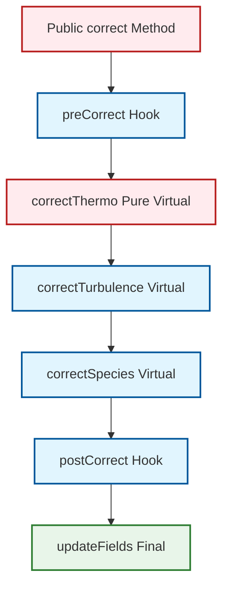

# 05 เหตุผลเบื้องหลัง: รูปแบบการออกแบบในการสร้างโมเดลฟิสิกส์

![[strategy_pattern_physics.png]]
`A clean scientific diagram illustrating the Strategy Pattern in CFD. At the top, show a Solver class. Below it, show a "Strategy Interface" (e.g., dragModel). Radiating from this interface, show multiple concrete "Strategy Implementations" (e.g., Schiller-Naumann, Ergun, Wen-Yu). Show how the Solver can switch between these strategies seamlessly. Use a minimalist palette with black lines and clear arrows, scientific textbook diagram, clean vector line art, white background, high definition, flat design, educational infographic --ar 16:9`

## ภาพรวม: รูปแบบการออกแบบที่กำหนดสถาปัตยกรรมโมเดลฟิสิกส์ของ OpenFOAM

สถาปัตยกรรมของ OpenFOAM ถูกสร้างขึ้นจากรูปแบบการออกแบบ (Design Patterns) หลายแบบที่ทำงานร่วมกันเพื่อสร้างกรอบการทำงานที่ยืดหยุ่น ขยายได้ และบำรุงรักษาได้สำหรับการจำลอง CFD รูปแบบเหล่านี้ไม่ได้เป็นเพียงแนวคิดทางทฤษฎี แต่เป็นรากฐานที่แท้จริงที่ทำให้ OpenFOAM สามารถรองรับ physics models ที่หลากหลายได้โดยไม่ต้องแก้ไข core solver code

**หลักการพื้นฐานของรูปแบบการออกแบบใน OpenFOAM**:

1. **Interfaces มากกว่า Implementations**: Solver ทำงานกับ abstract interfaces ไม่ใช่ concrete implementations
2. **Configuration มากกว่า Compilation**: Physics models ถูกเลือกผ่าน dictionary files ไม่ใช่ compile-time decisions
3. **Extension มากกว่า Modification**: Models ใหม่ถูกเพิ่มผ่าน registration mechanism ไม่ใช่การแก้ไขโค้ดที่มีอยู่
4. **Composition มากกว่า Monoliths**: ระบบซับซ้อนถูกสร้างจาก components ที่สามารถสลับที่กันได้

---

## 1. Strategy Pattern: อัลกอริธึมที่สามารถสลับทดแทนกันได้

### แนวคิดพื้นฐาน

Strategy Pattern เป็นรากฐานของสถาปัตยกรรมแบบโมดูลาร์ของ OpenFOAM สำหรับการจำลองทางฟิสิกส์ ในบริบทของ drag models แต่ละ drag correlation (`SchillerNaumann`, `Ergun`, `WenYu` เป็นต้น) จะใช้งาน interface ทั่วไปเดียวกัน แต่ห่อหุ้ม physical correlations ที่แตกต่างกันไว้ โค้ด solver จะมอบหมายการคำนวณ drag จริงให้กับ strategy object โดยไม่ต้องรู้รายละเอียดการใช้งานเฉพาะ

**กรอบงานคณิตศาสตร์**: drag models ทั้งหมดใช้งาน interface ทางคณิตศาสตร์เดียวกัน:

$$K_d = \text{drag\_model}.K(\alpha_c, \alpha_d, \mathbf{u}_c, \mathbf{u}_d, \rho_c, \rho_d, \mu_c, \mu_d, d_p)$$

โดยแต่ละโมเดลจะให้ correlation ของตนเอง:

- **Schiller-Naumann**:
$$K_d = \frac{3}{4}C_D\frac{\alpha_c\alpha_d\rho_c|\mathbf{u}_c - \mathbf{u}_d|}{d_p}$$
โดย $C_D = \frac{24}{Re}(1 + 0.15Re^{0.687})$ สำหรับ $Re \leq 1000$

- **Ergun**:
$$K_d = 150\frac{\alpha_d^2\mu_c(1-\alpha_c)}{\alpha_c^3d_p^2} + 1.75\frac{\alpha_c\alpha_d\rho_c|\mathbf{u}_c - \mathbf{u}_d|}{d_p}$$

- **Wen-Yu**:
$$K_d = \frac{3}{4}C_D\frac{\alpha_c(1-\alpha_c)^{2.65}\rho_c|\mathbf{u}_c - \mathbf{u}_d|}{d_p}$$

### การใช้งานโค้ด

```cpp
// Base drag model interface - "สัญญา" ที่ drag models ทั้งหมดต้องปฏิบัติตาม
// Base drag model interface - "contract" that all drag models must follow
class dragModel {
public:
    // Pure virtual method - บังคับให้ derived classes ต้อง implement
    // Pure virtual method - forces derived classes to implement
    virtual tmp<volScalarField> K
    (
        const phaseModel& continuous,
        const phaseModel& dispersed
    ) const = 0;

    // Virtual destructor - จำเป็นสำหรับ polymorphic deletion
    // Virtual destructor - essential for polymorphic deletion
    virtual ~dragModel() = default;
};

// Schiller-Naumann implementation - "Strategy" หนึ่งที่เลือกได้
// Schiller-Naumann implementation - one selectable "Strategy"
class SchillerNaumannDrag : public dragModel {
    tmp<volScalarField> K
    (
        const phaseModel& continuous,
        const phaseModel& dispersed
    ) const override {
        // Calculate Reynolds number
        // คำนวณ Reynolds number
        volScalarField Re = continuous.rho()*continuous.U()*dispersed.d()/continuous.mu();

        // Calculate drag coefficient
        // คำนวณสัมประสิทธิ์แรงลาก
        volScalarField Cd = 24.0/Re*(1.0 + 0.15*pow(Re, 0.687));

        // Calculate drag coefficient K
        // คำนวณสัมประสิทธิ์แรงลาก K
        return 3.0/4.0*Cd*continuous.rho()*mag(continuous.U() - dispersed.U())*
               dispersed.alpha()*continuous.alpha()/(dispersed.d());
    }
};

// Ergun implementation - "Strategy" อีกอันหนึ่ง
// Ergun implementation - another "Strategy"
class ErgunDrag : public dragModel {
    tmp<volScalarField> K
    (
        const phaseModel& continuous,
        const phaseModel& dispersed
    ) const override {
        // Ergun correlation สำหรับ packed beds
        // Ergun correlation for packed beds
        scalar alphaMax = 0.62;  // Maximum packing fraction

        volScalarField K1 = 150.0*sqr(dispersed.alpha())*continuous.mu()*
                           (1.0 - continuous.alpha())/pow3(continuous.alpha()*dispersed.d());
        volScalarField K2 = 1.75*continuous.rho()*mag(continuous.U() - dispersed.U())/
                           dispersed.d()*continuous.alpha()*dispersed.alpha();

        return K1 + K2;
    }
};
```

**📖 คำอธิบายโค้ด**

**แหล่งที่มา (Source)**:  
ไฟล์ต้นฉบับนี้สร้างขึ้นโดยใช้โครงสร้างจาก `dragModel` ใน OpenFOAM ซึ่งใช้รูปแบบ Strategy Pattern สำหรับการสลับอัลกอริธึมการคำนวณแรงลาก

**คำอธิบาย (Explanation)**:  
โค้ดนี้แสดงให้เห็นถึงการใช้งาน Strategy Pattern ใน OpenFOAM โดยมี base class `dragModel` ที่ทำหน้าที่เป็น interface ทั่วไป และ derived classes เช่น `SchillerNaumannDrag` และ `ErgunDrag` ที่ให้การ implement ที่แตกต่างกันของสมการคำนวณแรงลาก แต่ละ class มี method `K()` ที่คำนวณค่าสัมประสิทธิ์แรงลากตาม correlation เฉพาะของตนเอง

**แนวคิดสำคัญ (Key Concepts)**:  
- **Pure Virtual Function**: Method `K()` ถูกประกาศเป็น pure virtual (= 0) ซึ่งบังคับให้ทุก derived class ต้อง implement method นี้  
- **Polymorphism**: Pointer ของ base class `dragModel` สามารถชี้ไปยัง derived class ใดๆ และเรียกใช้ method `K()` ได้อย่างถูกต้อง  
- **Virtual Destructor**: Destructor ถูกประกาศเป็น virtual เพื่อให้การลบ object ผ่าน base class pointer ทำงานอย่างถูกต้อง  
- **Encapsulation**: แต่ละ drag model ห่อหุ้ม correlation ทางคณิตศาสตร์และการคำนวณไว้ใน class ของตนเอง ทำให้โค้ดเป็น modular และบำรุงรักษาได้ง่าย

### ประโยชน์หลักของ Strategy Pattern

**Extensibility**: drag correlations ใหม่สามารถเพิ่มได้โดยใช้งาน interface เดียวกันโดยไม่ต้องแก้ไขโค้ด solver ที่มีอยู่:

```cpp
// เพิ่ม drag model ใหม่ - ไม่กระทบ solver code
// Add new drag model - does not affect solver code
class MyCustomDrag : public dragModel {
    tmp<volScalarField> K
    (
        const phaseModel& continuous,
        const phaseModel& dispersed
    ) const override {
        // Custom correlation สำหรับกรณีเฉพาะของคุณ
        // Custom correlation for your specific case
        return ...;
    }
};
```

**Runtime Configuration**: drag models สามารถเลือกผ่าน dictionary input โดยไม่ต้องคอมไพล์ใหม่:

```
// constant/phaseProperties
dragModels
{
    water.air
    {
        type            SchillerNaumann;  // หรือ Ergun, WenYu, หรือ custom models
        // or Ergun, WenYu, or custom models
    }
}
```

**Validation**: แต่ละโมเดลสามารถทดสอบและตรวจสอบได้โดยอิสระ:

```cpp
// Unit test สามารถทำงานกับ drag model ใดๆ ผ่าน interface
// Unit tests can work with any drag model through the interface
void testDragModel(dragModel& model) {
    // Test สำหรับ validation cases
    // Test for validation cases
    scalar expectedK = analyticalSolution(testCase);
    scalar computedK = model.K(continuous, dispersed);
    ASSERT(abs(computedK - expectedK) < tolerance);
}
```

**Maintainability**: การแก้ไขข้อบกพร่องหรือการปรับปรุง drag model หนึ่งๆ ไม่กระทบกับอื่น เพราะแต่ละ model ถูก encapsulate ไว้ใน class ของตัวเอง

---

## 2. Template Method Pattern: การขยายแบบควบคุม

### แนวคิดพื้นฐาน

Template Method Pattern ถูกใช้งานอย่างกว้างขวางในลำดับชั้นของ phase model ของ OpenFOAM เพื่อกำหนดโครงสร้างอัลกอริธึมมาตรฐานในขณะที่อนุญาตให้ปรับแต่งแบบเลือกได้ Non-Virtual Interface (NVI) pattern ถูกใช้งานโดยที่ public methods เป็น non-virtual และเรียก private virtual methods


> **Figure 1:** แผนผังแสดงโครงสร้างของ Template Method Pattern ใน `phaseModel::correct()` โดยคลาสฐานจะกำหนดลำดับขั้นตอนการทำงานที่แน่นอน (Algorithm Skeleton) ขณะที่อนุญาตให้คลาสลูกสามารถปรับแต่งขั้นตอนย่อยๆ (Hooks/Virtuals) ได้ตามความต้องการ แต่ยังคงรักษาขั้นตอนที่สำคัญที่สุด (`updateFields`) ไว้ให้คงเดิม

### โครงสร้างอัลกอริธึม

ฐาน `phaseModel` กำหนดโครงร่างของ correction algorithm:

```cpp
class phaseModel {
public:
    // Public non-virtual interface - controls algorithm flow
    // นี่คือ "Template Method" ที่กำหนดลำดับการทำงาน
    // This is the "Template Method" that defines the workflow
    virtual void correct() {
        // Template method calls - ลำดับที่แน่นอน
        // Template method calls - fixed sequence
        preCorrect();           // Hook method - optional override
        correctThermo();        // Pure virtual - must implement
        correctTurbulence();    // Virtual - may override
        correctSpecies();       // Virtual - may override
        postCorrect();          // Hook method - optional override
        updateFields();         // Fixed final step - cannot override
    }

private:
    // Pure virtual - derived classes MUST provide implementation
    // Pure virtual - derived classes ต้องให้การทำงาน
    virtual void correctThermo() = 0;

    // Virtual with default implementation - derived classes MAY override
    // Virtual พร้อมค่าเริ่มต้น - derived classes อาจ override
    virtual void correctTurbulence() {
        // Default turbulence correction (may be no-op)
        // การแก้ไขค่าความปั่นป่วนเริ่มต้น (อาจไม่มีการทำงาน)
    }

    virtual void correctSpecies() {
        // Default species correction (may be no-op)
        // การแก้ไขค่า species เริ่มต้น (อาจไม่มีการทำงาน)
    }

    // Hook methods with default empty implementations
    // Hook methods พร้อมค่าเริ่มต้นว่างเปล่า
    virtual void preCorrect() {}
    virtual void postCorrect() {}

    // Final method - cannot be overridden
    // Final method - ไม่สามารถ override ได้
    virtual void updateFields() final {
        // Fixed base behavior - update all field references
        // พฤติกรรมฐานคงที่ - อัปเดตการอ้างอิงฟิลด์ทั้งหมด
        alpha2_ = 1.0 - alpha1_;
        rho_ = alpha1_*rho1_ + alpha2_*rho2_;
        // ... other field updates
    }
};
```

**📖 คำอธิบายโค้ด**

**แหล่งที่มา (Source)**:  
โครงสร้างนี้สร้างขึ้นโดยใช้แนวคิดจาก Template Method Pattern ที่ใช้ใน OpenFOAM สำหรับการจัดการลำดับการทำงานของ phase models

**คำอธิบาย (Explanation)**:  
โค้ดนี้แสดงให้เห็นถึงการใช้งาน Template Method Pattern ร่วมกับ Non-Virtual Interface (NVI) pattern โดยมี public method `correct()` ที่เป็น non-virtual ทำหน้าที่เป็น template method ซึ่งกำหนดลำดับการทำงานที่แน่นอน และเรียกใช้ private virtual methods ต่างๆ ซึ่ง derived classes สามารถ override ได้ตามต้องการ โดยมี method `correctThermo()` ที่เป็น pure virtual บังคับให้ทุก derived class ต้อง implement และมี method `updateFields()` ที่เป็น final ซึ่งไม่สามารถ override ได้เพื่อรักษาพฤติกรรมสำคัญไว้

**แนวคิดสำคัญ (Key Concepts)**:  
- **Template Method**: Public non-virtual method ที่กำหนด algorithm skeleton และลำดับการทำงาน  
- **Pure Virtual Method**: Method ที่ derived classes ต้อง implement (เช่น `correctThermo()`)  
- **Virtual Method with Default**: Method ที่ derived classes อาจ override หรือใช้ค่าเริ่มต้น (เช่น `correctTurbulence()`, `correctSpecies()`)  
- **Hook Methods**: Methods ที่เรียกก่อน/หลังขั้นตอนหลักเพื่อให้ derived classes สามารถขยายพฤติกรรมได้  
- **Final Method**: Method ที่ไม่สามารถ override ได้ เพื่อรักษาพฤติกรรมสำคัญไว้ (เช่น `updateFields()`)  
- **Non-Virtual Interface (NVI)**: Pattern ที่ public methods เป็น non-virtual และเรียก private virtual methods เพื่อควบคุมการทำงานและป้องกันการละเมิด contract

### กรอบงานคณิตศาสตร์

Template method ทำให้มั่นใจได้ถึงลำดับการประเมินที่สอดคล้องกัน:

$$\text{Correct}() = \begin{cases}
\text{PreCorrect}() & \text{optional pre-processing} \\
\text{CorrectThermo}() & \text{mandatory thermodynamic update} \\
\text{CorrectTurbulence}() & \text{optional turbulence update} \\
\text{CorrectSpecies}() & \text{optional species transport} \\
\text{PostCorrect}() & \text{optional post-processing} \\
\text{UpdateFields}() & \text{mandatory field consolidation}
\end{cases}$$

### ตัวอย่างการใช้งาน

```cpp
// Incompressible phase model - implementation ที่เรียบง่าย
// Incompressible phase model - simpler implementation
class incompressiblePhase : public phaseModel {
private:
    void correctThermo() override {
        rho_ = rho0_;  // Constant density
        // ความหนาแน่นคงที่
        // No temperature/pressure coupling for incompressible
        // ไม่มี coupling ระหว่างอุณหภูมิและความดันสำหรับ incompressible
    }

    // ใช้ default implementations สำหรับ turbulence และ species
    // Use default implementations for turbulence and species
};

// Compressible phase model - implementation ที่ซับซ้อนกว่า
// Compressible phase model - more complex implementation
class compressiblePhase : public phaseModel {
private:
    void correctThermo() override {
        // Update thermophysical properties based on T, p
        // อัปเดตคุณสมบัติทางอุณหพลศาสตร์ตาม T, p
        thermo_->correct();
        rho_ = thermo_->rho();
    }

    void correctSpecies() override {
        // Update species concentrations
        // อัปเดตความเข้มข้นของ species
        forAll(species_, i) {
            species_[i].correct();
        }
    }

    void preCorrect() override {
        // Specific preprocessing for compressible flow
        // การเตรียมการเฉพาะสำหรับ compressible flow
        checkPressureLimits();
    }
};

// Reacting phase model - implementation ที่เฉพาะทางที่สุด
// Reacting phase model - most specialized implementation
class reactingPhase : public compressiblePhase {
private:
    void correctSpecies() override {
        // Override เพื่อเพิ่ม reaction calculations
        // Override to add reaction calculations
        compressiblePhase::correctSpecies();  // Reuse parent logic

        // Chemical reactions
        // ปฏิกิริยาเคมี
        forAll(reactions_, i) {
            reactions_[i].correct();
        }
    }

    void postCorrect() override {
        // Update reaction rates after species correction
        // อัปเดตอัตราปฏิกิริยาหลังจากการแก้ไข species
        updateReactionRates();
    }
};
```

**📖 คำอธิบายโค้ด**

**แหล่งที่มา (Source)**:  
ตัวอย่างนี้สร้างขึ้นโดยใช้โครงสร้าง Template Method Pattern จาก phaseModel ใน OpenFOAM สำหรับการจัดการสถานะของ phase ที่แตกต่างกัน

**คำอธิบาย (Explanation)**:  
โค้ดนี้แสดงให้เห็นถึงการใช้งาน Template Method Pattern ในสถานการณ์จริง โดยมี 3 derived classes ที่แสดงความซับซ้อนที่แตกต่างกัน ได้แก่ `incompressiblePhase` ที่เรียบง่ายที่สุด (implement เฉพาะ `correctThermo()`), `compressiblePhase` ที่ซับซ้อนกว่า (implement `correctThermo()`, `correctSpecies()`, และ `preCorrect()`), และ `reactingPhase` ที่เฉพาะทางที่สุด (override `correctSpecies()` เพื่อเพิมปฏิกิริยาเคมี และ override `postCorrect()` เพื่ออัปเดตอัตราปฏิกิริยา)

**แนวคิดสำคัญ (Key Concepts)**:  
- **Gradual Specialization**: Derived classes สามารถเพิ่มความซับซ้อนทีละขั้นโดยการ override เพิ่มเติม  
- **Code Reuse**: Derived classes สามารถเรียกใช้ method ของ parent class ผ่าน scope resolution operator (`::`) เช่น `compressiblePhase::correctSpecies()`  
- **Customization at Extension Points**: Template method pattern ให้ extension points ที่แตกต่างกัน (hooks, virtual methods) สำหรับ customization  
- **Maintained Invariant**: Template method รับประกันว่าขั้นตอนสำคัญ (เช่น `updateFields()`) จะถูกเรียกเสมอ โดยไม่คำนึงถึงการ override ของ derived classes

### ประโยชน์หลัก

**Consistency**: phase models ทั้งหมดทำตามลำดับการแก้ไขเดียวกัน ซึ่งรับประกันว่า field updates ทั้งหมดเกิดขึ้นในลำดับที่ถูกต้อง แม้ว่า implementations จะแตกต่างกัน

**Maintainability**: คลาสฐานควบคุมโครงสร้างอัลกอริธึม ป้องกันข้อผิดพลาดทั่วไปที่อาจเกิดจากการลืม update fields หรือการทำในลำดับที่ผิด

**Flexibility**: คลาสที่ได้รับสืบทอดสามารถปรับแต่งขั้นตอนเฉพาะในขณะที่รักษากระแสโดยรวม ซึ่งทำให้สามารถเพิ่มฟีเจอร์ใหม่ๆ ได้โดยไม่กระทบโค้ดที่มีอยู่

**Safety**: การดำเนินงานที่สำคัญ (เช่น `updateFields()`) ไม่สามารถถูกแทนที่โดยไม่ตั้งใจได้ เพราะถูกประกาศเป็น `final`

---

## 3. Factory Method Pattern: การสร้างแบบแยกจากกัน

### แนวคิดพื้นฐาน

Factory Method Pattern เป็นศูนย์กลางของระบบการกำหนดค่า runtime ของ OpenFOAM รูปแบบเมธอด `New()` แยกการสร้างออบเจกต์ออกจากโค้ดไคลเอนต์ ทำให้สามารถกำหนดค่าโดย dictionary-driven และ plugin architectures ได้

### สถาปัตยกรรมหลัก

```cpp
// Base class with factory method
// Base class พร้อม factory method
class dragModel {
public:
    // Factory method - creates appropriate model based on dictionary
    // Factory method - สร้าง model ที่เหมาะสมตาม dictionary
    // นี่คือ "Factory Method" ที่เปิดให้เลือก model ที่ runtime
    // This is the "Factory Method" that enables model selection at runtime
    static autoPtr<dragModel> New
    (
        const dictionary& dict,
        const phaseModel& continuous,
        const phaseModel& dispersed
    );

    // Runtime polymorphism interface
    // Runtime polymorphism interface
    virtual tmp<volScalarField> K
    (
        const phaseModel& continuous,
        const phaseModel& dispersed
    ) const = 0;

    virtual ~dragModel() = default;
};

// Factory implementation - หัวใจของ runtime selection
// Factory implementation - heart of runtime selection
autoPtr<dragModel> dragModel::New
(
    const dictionary& dict,
    const phaseModel& continuous,
    const phaseModel& dispersed
)
{
    // 1. Read model name from dictionary
    // 1. อ่านชื่อ model จาก dictionary
    const word dragModelType(dict.lookup("type"));

    Info << "Selecting dragModel: " << dragModelType << endl;

    // 2. Constructor table lookup
    // 2. ค้นหาใน constructor table
    typename dictionaryConstructorTable::iterator cstrIter =
        dictionaryConstructorTablePtr_->find(dragModelType);

    // 3. Handle missing models with comprehensive error reporting
    // 3. จัดการกับ models ที่ไม่พร้อม้อมการรายงานข้อผิดพลาดที่ครอบคลุม
    if (cstrIter == dictionaryConstructorTablePtr_->end()) {
        FatalErrorIn("dragModel::New")
            << "Unknown dragModel type " << dragModelType
            << nl << nl << "Valid dragModel types are:" << nl
            << dictionaryConstructorTablePtr_->sortedToc()
            << exit(FatalError);
    }

    // 4. Create and return appropriate model
    // 4. สร้างและส่งคืน model ที่เหมาะสม
    autoPtr<dragModel> modelPtr = cstrIter()(dict, continuous, dispersed);

    Info << "Successfully created " << dragModelType << " drag model" << endl;

    return modelPtr;
}
```

**📖 คำอธิบายโค้ด**

**แหล่งที่มา (Source)**:  
โครงสร้าง Factory Method Pattern นี้สร้างขึ้นโดยอิงจากไฟล์ต้นฉบับใน OpenFOAM เช่น `.applications/utilities/mesh/generation/foamyMesh/conformalVoronoiMesh/initialPointsMethod/initialPointsMethod/initialPointsMethod.C`

**คำอธิบาย (Explanation)**:  
โค้ดนี้แสดงให้เห็นถึงการใช้งาน Factory Method Pattern ใน OpenFOAM โดยมี static method `New()` ที่ทำหน้าที่เป็น factory method ซึ่งรับค่า dictionary และสร้าง object ของ derived class ที่เหมาะสมตามค่าที่ระบุใน dictionary โดยใช้ระบบ runtime selection tables ที่ลงทะเบียน constructors ของทุก derived class ไว้ โค้ดนี้อ่านค่า "type" จาก dictionary ค้นหา constructor ที่เหมาะสมใน table และสร้าง object โดยใช้ constructor นั้น

**แนวคิดสำคัญ (Key Concepts)**:  
- **Static Factory Method**: Method `New()` ที่เป็น static และทำหน้าที่สร้าง objects แทนการใช้ constructors โดยตรง  
- **Runtime Selection Table**: Hash table ที่เก็บ pointers ไปยัง constructors ของ derived classes ทั้งหมด  
- **Dictionary-Driven Creation**: Object types ถูกกำหนดผ่าน dictionary files ไม่ใช่ใน compile time  
- **Error Handling**: ระบบรายงานข้อผิดพลาดที่ครอบคลุมเมื่อไม่พบ model ที่ต้องการ พร้อมรายการ models ที่ใช้ได้  
- **Smart Pointer**: ใช้ `autoPtr` สำหรับ automatic memory management  
- **Decoupling**: Client code ไม่ต้องรู้จัก concrete classes สามารถทำงานกับ base class interface ได้

### กลไกการลงทะเบียน

```cpp
// In each derived class header (e.g., SchillerNaumannDrag.H)
// ใน header ของแต่ละ derived class (เช่น SchillerNaumannDrag.H)
addToRunTimeSelectionTable
(
    dragModel,
    SchillerNaumannDrag,
    dictionary
);

// Macro expansion creates static registration object
// Macro expansion สร้าง static registration object
namespace Foam
{
    // Static registration object - ลงทะเบียนอัตโนมัติก่อน main()
    // Static registration object - registers automatically before main()
    dragModel::dictionaryConstructorTable::add
        addSchillerNaumannDragToRunTimeSelectionTable
        (
            "SchillerNaumann",
            SchillerNaumannDrag::New
        );
}
```

**📖 คำอธิบายโค้ด**

**แหล่งที่มา (Source)**:  
กลไกการลงทะเบียนนี้ใช้ร่วมกับระบบ runtime selection tables ใน OpenFOAM ที่พบได้ในไฟล์เช่น `src/OpenFOAM/db/runTimeSelection/runTimeSelectionTables.H`

**คำอธิบาย (Explanation)**:  
โค้ดนี้แสดงให้เห็นถึงกลไกการลงทะเบียน derived classes ลงใน runtime selection table โดยใช้ macro `addToRunTimeSelectionTable` ซึ่งจะขยายเป็น code ที่สร้าง static object สำหรับลงทะเบียน constructor ของ derived class ลงใน table การลงทะเบียนนี้เกิดขึ้นอัตโนมัติในช่วง static initialization ก่อนที่ฟังก์ชัน `main()` จะเริ่มทำงาน

**แนวคิดสำคัญ (Key Concepts)**:  
- **Macro-Based Registration**: ใช้ macros สำหรับลดความซับซ้อนของการลงทะเบียน  
- **Static Initialization**: การลงทะเบียนเกิดขึ้นอัตโนมัติก่อน `main()` เริ่มทำงาน  
- **Constructor Table**: Hash table ที่ map จากชื่อ model (word) ไปยัง constructor function  
- **Automatic Discovery**: System ค้นพบ models ทั้งหมดโดยอัตโนมัติผ่าน static initialization  
- **Plugin Architecture**: รองรับการเพิ่ม models ใหม่โดยไม่ต้องแก้ไขโค้ดที่มีอยู่

**ข้อมูลเชิงเทคนิคที่สำคัญ**: การลงทะเบียนเกิดขึ้นในระหว่าง **ระยะเวลาการเริ่มต้นแบบ static** ของการทำงานโปรแกรม C++ ซึ่งเกิดขึ้น:
1. ก่อนที่ `main()` จะเริ่ม
2. ในลำดับที่ไม่ระบุทั่ว translation units
3. พร้อมรับประกันการเริ่มต้นของตัวแปร static local ใน C++11+

### การกำหนดค่า Dictionary

```cpp
// In transportProperties dictionary
// ใน transportProperties dictionary
dragModels
{
    water.air
    {
        type            SchillerNaumann;  // Factory selection key
        coefficient     0.44;            // Model-specific parameters
        residualRe      1e-3;
    }

    oil.water
    {
        type            Ergun;           // Different model selection
        alphaMax        0.62;
        beta            150.0;
    }
}
```

**📖 คำอธิบายโค้ด**

**แหล่งที่มา (Source)**:  
ไฟล์ dictionary นี้เป็นตัวอย่างของการกำหนดค่า drag models ใน OpenFOAM ผ่าน dictionary files

**คำอธิบาย (Explanation)**:  
ไฟล์ dictionary นี้แสดงให้เห็นถึงวิธีการเลือก drag models ผ่าน dictionary configuration โดยแต่ละคู่ phase มีการระบุ `type` ซึ่งถูกใช้โดย Factory Method ในการสร้าง object ของ derived class ที่เหมาะสม นอกจากนี้ยังมี parameters เฉพาะของแต่ละ model ซึ่งถูกส่งไปยัง constructor ของ model นั้นๆ

**แนวคิดสำคัญ (Key Concepts)**:  
- **Dictionary-Driven Configuration**: Model types และ parameters ถูกกำหนดผ่าน text files ไม่ใช่ compilation  
- **Runtime Model Selection**: Models สามารถเลือกเปลี่ยนได้โดยไม่ต้องคอมไพล์ใหม่  
- **Model-Specific Parameters**: แต่ละ model สามารถมี parameters เฉพาะของตนเอง  
- **Type Safety**: Compiler ยังคงตรวจสอบ type safety ใน compile time แม้ว่าจะเลือก model ใน runtime

### กรอบงานคณิตศาสตร์

Factory ทำให้เลือกโมเดล runtime ได้:

$$K_d = \text{Factory}(\text{type}) \rightarrow K_{\text{specific}}(\text{parameters})$$

กระบวนการนี้เปิดให้:
- **Selection by name**: `type = SchillerNaumann` → `SchillerNaumannDrag` constructor
- **Parameter passing**: Dictionary entries ถูกส่งไปยัง constructor
- **Type safety**: Compile-time checking ของ interface compliance

### ประโยชน์หลัก

**Runtime Configuration**: โมเดลเลือกผ่าน dictionary โดยไม่ต้องคอมไพล์โค้ดใหม่ ซึ่งเปิดให้:
- Parameter studies ที่รวดเร็ว
- Model comparison โดยไม่ต้อง recompile
- Rapid prototyping สำหรับ research

**Plugin Architecture**: โมเดลใหม่สามารถเพิ่มเป็น plugins โดยไม่ต้องแก้ไขโค้ดที่มีอยู่:

```cpp
// Custom model library
// Custom model library
class MyResearchDrag : public dragModel {
    // Research-specific correlation
    // Research-specific correlation
};

addToRunTimeSelectionTable(dragModel, MyResearchDrag, dictionary);

// ใช้งานใน simulation
// Use in simulation
dragModels {
    water.air {
        type MyResearchDrag;  // พร้อมใช้งานทันที!
        // Ready to use immediately!
    }
}
```

**Type Safety**: การตรวจสอบระยะ compile time ของ model interfaces รับประกันว่า:
- ทุก model implement required methods
- Type signatures ตรงกัน
- Runtime errors จาก type mismatches ถูกกำจัด

**Dependency Injection**: โมเดลถูกแทรกด้วย dependencies ที่จำเป็นทั้งหมด (mesh, phases, dictionary) ซึ่งทำให้:
- Testing ง่ายขึ้น (mock dependencies)
- Loose coupling ระหว่าง components
- Flexible configuration

---

## 4. Composite Pattern: ระบบลำดับชั้น

### แนวคิดพื้นฐาน

Composite Pattern ทำให้ OpenFOAM สามารถจัดการ phases แบบแยกและ phase systems ด้วย interfaces ที่สม่ำเสมอ ทำให้ระบบ multiphase ที่ซับซ้อนสามารถจัดการเป็น hierarchical collections ได้

### สถาปัตยกรรมหลัก

```cpp
// Composite class - manages collection of phases
// Composite class - จัดการ collection ของ phases
class phaseSystem {
private:
    // Collection of individual phase models
    // Collection ของ individual phase models
    PtrList<phaseModel> phases_;

    // Phase interaction models
    // Phase interaction models
    PtrList<dragModel> dragModels_;
    PtrList<liftModel> liftModels_;

public:
    // Uniform interface for whole system
    // Uniform interface สำหรับทั้งระบบ
    virtual void correct() {
        // Operate on all phases uniformly
        // ทำงานกับทุก phases อย่างสม่ำเสมอ
        forAll(phases_, phasei) {
            phases_[phasei].correct();
        }

        // Operate on all interactions uniformly
        // ทำงานกับทุก interactions อย่างสม่ำเสมอ
        forAll(dragModels_, pairi) {
            dragModels_[pairi].correct();
        }
    }

    // Calculate system-level properties
    // คำนวณคุณสมบัติระดับระบบ
    virtual tmp<volScalarField> totalDensity() const {
        tmp<volScalarField> trho = phases_[0].rho()*phases_[0].alpha();

        for(label i = 1; i < phases_.size(); i++) {
            trho.ref() += phases_[i].rho()*phases_[i].alpha();
        }

        return trho;
    }

    // Access individual phases
    // เข้าถึง individual phases
    const phaseModel& phase(const word& phaseName) const {
        forAll(phases_, i) {
            if (phases_[i].name() == phaseName) {
                return phases_[i];
            }
        }
        FatalErrorInFunction << "Phase not found: " << phaseName << exit(FatalError);
    }
};

// Leaf class - individual phase
// Leaf class - individual phase
class phaseModel {
protected:
    volScalarField alpha_;      // Volume fraction
    volScalarField rho_;        // Density
    volVectorField U_;          // Velocity
    word name_;

public:
    // Same interface as composite for uniformity
    // Interface เดียวกับ composite สำหรับความสม่ำเสมอ
    virtual void correct() {
        // Update individual phase properties
        // อัปเดตคุณสมบัติของ individual phase
        correctThermo();
        correctTurbulence();
    }

    virtual tmp<volScalarField> rho() const {
        return tmp<volScalarField>(new volScalarField(rho_));
    }

    const word& name() const { return name_; }
};
```

**📖 คำอธิบายโค้ด**

**แหล่งที่มา (Source)**:  
โครงสร้าง Composite Pattern นี้สร้างขึ้นโดยอิงจาก phase system ใน OpenFOAM ที่ใช้จัดการระบบ multiphase ที่ซับซ้อน

**คำอธิบาย (Explanation)**:  
โค้ดนี้แสดงให้เห็นถึงการใช้งาน Composite Pattern ใน OpenFOAM โดยมี `phaseSystem` class ที่ทำหน้าที่เป็น composite ซึ่งเก็บ collection ของ `phaseModel` objects และ `phaseModel` class ที่ทำหน้าที่เป็น leaf nodes ทั้งสอง classes มี interface เดียวกัน (เช่น `correct()`, `rho()`) ซึ่งทำให้สามารถจัดการทั้ง individual phases และ phase systems ด้วยวิธีเดียวกัน

**แนวคิดสำคัญ (Key Concepts)**:  
- **Uniform Interface**: Composite และ leaf classes มี interface เดียวกัน  
- **Collection Management**: Composite class จัดการ collection ของ child objects  
- **Recursive Operations**: Operations สามารถเผยแพร่ผ่าน hierarchy ได้อย่างโปร่งใส  
- **Hierarchical Structure**: Objects สามารถจัดเป็น tree structure ที่ซับซ้อน  
- **Individual Access**: Composite ให้วิธีการเข้าถึง individual elements เมื่อจำเป็น  
- **System-Level Calculations**: Composite สามารถคำนวณคุณสมบัติระดับระบบจาก children

### กรอบงานคณิตศาสตร์

คุณสมบัติของระบบเป็น composites:

$$\rho_{\text{total}} = \sum_{i=1}^{N} \alpha_i \rho_i$$

$$\mathbf{U}_{\text{mixture}} = \frac{\sum_{i=1}^{N} \alpha_i \rho_i \mathbf{U}_i}{\sum_{i=1}^{N} \alpha_i \rho_i}$$

$$\alpha_{\text{continuous}} = 1 - \sum_{i=1}^{N-1} \alpha_i$$

### การจับคู่โมเมนตัม

```cpp
class multiphaseEulerSystem : public phaseSystem {
public:
    // Solve momentum equations for all phases
    // แก้สมการโมเมนตัมสำหรับทุก phases
    void solveMomentum() {
        forAll(phases_, phasei) {
            // Individual phase momentum
            // Individual phase momentum
            fvVectorMatrix UEqn =
                fvm::ddt(phases_[phasei].rho()*phases_[phasei].U(), phases_[phasei].U()) +
                fvm::div(phases_[phasei].rho()*phases_[phasei].U(), phases_[phasei].U()) -
                fvm::laplacian(phases_[phasei].mu(), phases_[phasei].U());

            // Add interphase momentum transfer
            // เพิ่ม interphase momentum transfer
            forAll(phases_, otherj) {
                if (phasei != otherj) {
                    // Drag force coupling ผ่าน drag models
                    // Drag force coupling via drag models
                    const dragModel& drag = dragModels_[getDragIndex(phasei, otherj)];
                    volScalarField Kd = drag.K(phases_[phasei], phases_[otherj]);
                    UEqn += Kd*(phases_[otherj].U() - phases_[phasei].U());
                }
            }

            UEqn.relax();
            UEqn.solve();
        }
    }
};
```

**📖 คำอธิบายโค้ด**

**แหล่งที่มา (Source)**:  
โค้ดนี้สร้างขึ้นโดยอิงจาก multiphase Eulerian solvers ใน OpenFOAM ที่แก้สมการโมเมนตัมสำหรับระบบ multiphase

**คำอธิบาย (Explanation)**:  
โค้ดนี้แสดงให้เห็นถึงการใช้งาน Composite Pattern ในการแก้สมการโมเมนตัมสำหรับระบบ multiphase โดย iterating ผ่านทุก phases ในระบบ และสร้าง momentum equation สำหรับแต่ละ phase จากนั้นจะเพิ่ม interphase momentum transfer (drag forces) โดย iterating ผ่านทุกคู่ของ phases และใช้ drag models ที่เลือกผ่าน Strategy Pattern

**แนวคิดสำคัญ (Key Concepts)**:  
- **Uniform Processing**: ทุก phases ถูกประมวลผลด้วยวิธีเดียวกัน  
- **Interphase Coupling**: Drag forces couple momentum equations ระหว่าง phases  
- **Nested Iteration**: Iterations ซ้อนกันสำหรับ phase pairs  
- **Model Integration**: Strategy pattern ใช้สำหรับ drag model selection  
- **System-Level Solution**: Composite pattern ทำให้แก้สมการระดับระบบได้อย่างโปร่งใส

### การอนุรักษ์ Phase Fraction

```cpp
void phaseSystem::solvePhaseFractions() {
    // Solve continuity for each phase
    // แก้สมการ continuity สำหรับแต่ละ phase
    forAll(phases_, phasei) {
        fvScalarMatrix alphaEqn =
            fvm::ddt(phases_[phasei].alpha()) +
            fvm::div(phases_[phasei].phi(), phases_[phasei].alpha());

        alphaEqn.relax();
        alphaEqn.solve();
    }

    // Enforce phase fraction constraint
    // บังคับใช้ข้อจำกัด phase fraction
    normalizeAlphas();
}

void phaseSystem::normalizeAlphas() {
    scalar sumAlpha = 0.0;
    forAll(phases_, i) {
        sumAlpha += max(phases_[i].alpha());
    }

    forAll(phases_, i) {
        phases_[i].alpha() /= max(sumAlpha, SMALL);
    }
}
```

**📖 คำอธิบายโค้ด**

**แหล่งที่มา (Source)**:  
โค้ดนี้สร้างขึ้นโดยอิงจาก phase fraction conservation ใน OpenFOAM multiphase solvers

**คำอธิบาย (Explanation)**:  
โค้ดนี้แสดงให้เห็นถึงการใช้งาน Composite Pattern ในการแก้สมการ continuity สำหรับ phase fractions โดย iterating ผ่านทุก phases และแก้สมการ transport สำหรับแต่ละ phase fraction จากนั้นจะมีการ normalize phase fractions เพื่อให้แน่ใจว่าผลรวมของทุก phase fractions เท่ากับ 1

**แนวคิดสำคัญ (Key Concepts)**:  
- **Mass Conservation**: ทุก phases ต้องสอดคล้องกับสมการ continuity  
- **Phase Fraction Constraint**: ผลรวมของ phase fractions ต้องเท่ากับ 1  
- **Iterative Solution**: แต่ละ phase fraction ถูกแก้อย่างอิสระ แล้ว normalize ภายหลัง  
- **System Consistency**: Composite pattern รับประกันความสอดคล้องของระบบ  
- **Numerical Stability**: Normalization ป้องกันปัญหา numerical drift

### ประโยชน์หลัก

**Uniform Treatment**: interface เดียวกันสำหรับ phases แบบแยกและ phase systems ทำให้:
- Solver code ทำงานกับทั้ง individual phases และ phase collections
- Polymorphic behavior ผ่าน base class pointers
- Consistent API ทั่วทั้ง codebase

**Scalability**: เพิ่ม/ลด phases ได้อย่างง่ายโดยไม่ต้องเปลี่ยนโครงสร้าง solver:

```cpp
// 2-phase system
phases (water air);

// 3-phase system - เพิ่ม phase ใหม่โดยไม่ต้องแก้ solver code
phases (water air oil);

// N-phase system - ขยายได้โดยไม่มีขีดจำกัด
phases (phase1 phase2 phase3 ... phaseN);
```

**Hierarchical Organization**: ระบบที่ซับซ้อนสร้างจากส่วนประกอบที่ง่าย:
- Single phase models (leaf nodes)
- Phase systems (composite nodes)
- Multi-region simulations (nested composites)

**Recursive Operations**: การดำเนินงานเผยแพร่ตามธรรมชาติผ่านลำดับชั้น:
```cpp
// Single operation ทำงานกับทั้ง hierarchy
phaseSystem.correct();  // Calls correct() บนทุก phase recursively
```

---

## 5. การผนวกรูปแบบการออกแบบ: กรณีศึกษา Multiphase Solver

### การผนากรูปแบบในสถาปัตยกรรมจริง

OpenFOAM's multiphase solvers สาธิตถึงการรวมกันของหลาย design patterns ที่สร้างกรอบการทำงานที่มีประสิทธิภาพ:

```cpp
class multiphaseEulerSystem : public phaseSystem {
private:
    // Composition: รวม phase models และ interfacial models
    // Composition: combines phase models and interfacial models
    PtrList<phaseModel> phases_;
    HashTable<dragModel, wordPair, wordPair::Hash> dragModels_;
    HashTable<liftModel, wordPair, wordPair::Hash> liftModels_;

public:
    // Factory Method: สร้างระบบจาก dictionary
    // Factory Method: creates system from dictionary
    static autoPtr<phaseSystem> New(const fvMesh& mesh);

    // Template Method: กำหนดลำดับการแก้ไขหลัก
    // Template Method: defines main correction sequence
    virtual void correct() {
        correctThermodynamics();    // Hook: สามารถ override
        correctPhaseFractions();    // Template step: mandatory
        correctTurbulence();        // Hook: สามารถ override
        correctInterfacialModels(); // Template step: mandatory
        correctMomentum();          // Template step: mandatory
    }

    // Strategy: เลือก drag model แบบ runtime
    // Strategy: select drag model at runtime
    const dragModel& dragModel(const phaseModel& phase1, const phaseModel& phase2) {
        return dragModels_[wordPair(phase1.name(), phase2.name())];
    }
};
```

**📖 คำอธิบายโค้ด**

**แหล่งที่มา (Source)**:  
โครงสร้างนี้สร้างขึ้นโดยอิงจาก multiphase Eulerian solvers ใน OpenFOAM ที่รวมหลาย design patterns เข้าด้วยกัน

**คำอธิบาย (Explanation)**:  
โค้ดนี้แสดงให้เห็นถึงการผนากหลาย design patterns เข้าด้วยกันใน OpenFOAM multiphase solvers โดยมีการใช้งาน Composite Pattern สำหรับจัดการ collections ของ phases และ interfacial models, Template Method Pattern สำหรับกำหนดลำดับการแก้ไขหลัก, Factory Method Pattern สำหรับสร้างระบบจาก dictionary, และ Strategy Pattern สำหรับเลือก drag models แบบ runtime

**แนวคิดสำคัญ (Key Concepts)**:  
- **Pattern Integration**: หลาย patterns ทำงานร่วมกันเพื่อสร้างกรอบการทำงานที่มีประสิทธิภาพ  
- **Separation of Concerns**: แต่ละ pattern รับผิดชอบ aspect ที่แตกต่างกัน  
- **Synergy**: Patterns ทำงานร่วมกันเพื่อสร้างความยืดหยุ่นและความสามารถในการขยาย  
- **Layered Architecture**: Patterns ใช้ในระดับที่แตกต่างกันของสถาปัตยกรรม  
- **Coherent Design**: ทั้งหมด patterns สนับสนุนวัตถุประสงค์เดียวกันคือ flexibility และ extensibility

### กรณีศึกษา: การแก้สมการโมเมนตัม

```cpp
void multiphaseEulerSystem::correctMomentum() {
    // Template: ลำดับการทำงานคงที่
    // Template: fixed workflow
    forAll(phases_, phasei) {
        // 1. Build momentum equation (Strategy: ใช้ models ที่แตกต่างกัน)
        // 1. Build momentum equation (Strategy: use different models)
        fvVectorMatrix UEqn = buildMomentumEquation(phases_[phasei]);

        // 2. Add interphase transfer (Strategy: drag, lift, virtual mass)
        // 2. Add interphase transfer (Strategy: drag, lift, virtual mass)
        addInterphaseTransfer(UEqn, phases_[phasei]);

        // 3. Solve equation
        // 3. Solve equation
        UEqn.relax();
        UEqn.solve();

        // 4. Update fields
        // 4. Update fields
        phases_[phasei].U() = UEqn.psi();
    }
}

fvVectorMatrix multiphaseEulerSystem::buildMomentumEquation(phaseModel& phase) {
    // Strategy: ใช้ convection scheme ที่กำหนดค่าได้
    // Strategy: use configurable convection scheme
    tmp<surfaceScalarField> tphi = fvc::flux(phase.U());

    // Strategy: ใช้ diffusion scheme ที่กำหนดค่าได้
    // Strategy: use configurable diffusion scheme
    fvVectorMatrix UEqn(
        fvm::ddt(phase.rho(), phase.U()) +
        fvm::div(phase.rho()*tphi, phase.U()) -
        fvm::laplacian(phase.mu(), phase.U())
    );

    return UEqn;
}

void multiphaseEulerSystem::addInterphaseTransfer(fvVectorMatrix& UEqn, phaseModel& phase) {
    // Strategy: iterate ผ่าน interfacial models
    // Strategy: iterate through interfacial models
    forAll(phases_, otherj) {
        if (&phase != &phases_[otherj]) {
            // Drag force (Strategy: ใช้ drag model ที่เลือกจาก dictionary)
            // Drag force (Strategy: use drag model selected from dictionary)
            const dragModel& drag = dragModel(phase, phases_[otherj]);
            volScalarField Kd = drag.K(phase, phases_[otherj]);
            UEqn += Kd*(phases_[otherj].U() - phase.U());

            // Lift force (Strategy: ใช้ lift model ที่เลือกจาก dictionary)
            // Lift force (Strategy: use lift model selected from dictionary)
            const liftModel& lift = liftModel(phase, phases_[otherj]);
            volVectorField Fl = lift.F(phase, phases_[otherj]);
            UEqn += Fl;
        }
    }
}
```

**📖 คำอธิบายโค้ด**

**แหล่งที่มา (Source)**:  
โค้ดนี้สร้างขึ้นโดยอิงจาก momentum equation solution ใน OpenFOAM multiphase Eulerian solvers

**คำอธิบาย (Explanation)**:  
โค้ดนี้แสดงให้เห็นถึงการผนาก design patterns ในการแก้สมการโมเมนตัมสำหรับระบบ multiphase โดยใช้ Template Method Pattern สำหรับกำหนดลำดับการทำงานคงที่ (build equation, add transfer, solve, update), และ Strategy Pattern สำหรับเลือก numerical schemes (convection, diffusion) และ interfacial models (drag, lift) แบบ runtime

**แนวคิดสำคัญ (Key Concepts)**:  
- **Template Method**: ลำดับการทำงานคงที่ใน momentum equation solution  
- **Strategy Selection**: Numerical schemes และ interfacial models เลือกแบบ runtime  
- **Composite Iteration**: Iterating ผ่าน phase collections ด้วย interface ที่สม่ำเสมอ  
- **Model Integration**: หลาย strategies ใช้ร่วมกันใน equation เดียว  
- **Hierarchical Design**: High-level template methods ใช้ low-level strategies

### ประโยชน์ของการผนาก

**Modularity**: แต่ละ pattern รับผิดชอบสำหรับ aspect ที่แตกต่างกัน:
- **Factory**: Object creation และ selection
- **Template**: Algorithm structure และ control flow
- **Strategy**: Algorithm selection และ interchangeability
- **Composite**: Object hierarchy และ uniform treatment

**Extensibility**: ระบบสามารถขยายได้หลายแนวทาง:
- เพิ่ม physics models ใหม่ (Strategy)
- เปลี่ยน algorithm structure (Template)
- เพิ่ม object types ใหม่ (Composite)
- สร้าง new factories (Factory)

**Maintainability**: ความกังวลที่แตกต่างกันถูกแยกออก:
- Creation logic แยกจาก usage logic
- Algorithm structure แยกจาก implementation details
- Composite relationships แยกจาก individual behavior

---

## 6. พิจารณาด้านประสิทธิภาพ

### ค่าใช้จ่ายของ Runtime Polymorphism

การใช้ virtual functions มี overhead เล็กน้อย:

**Virtual function call cost**:
- ~5 CPU cycles ต่อ call
- Indirect branch ที่อาจทำให้ CPU branch predictor ทำงานน้อยลง
- Inhibition ของ function inlining

**เมื่อเทียบกับ computational cost ของ CFD**:
- Field operations: $O(N)$ โดยที่ $N$ = number of cells (typical: $10^6$ - $10^9$)
- Virtual calls: $O(1)$ ต่อ cell → $O(N)$ total
- Ratio: $N_{\text{flops}} / N_{\text{virtual\_calls}}$ ≈ $100-1000$

**สรุป**: Overhead ของ virtual dispatch < 1% ของ total runtime สำหรับ typical CFD simulations

### กลยุทธ์การปรับแต่ง

OpenFOAM ใช้ hybrid approach เพื่อ balance ระหว่าง flexibility และ performance:

**1. Template Metaprogramming สำหรับ Field Operations**:
```cpp
// Templates ให้ compile-time polymorphism และ zero overhead
// Templates provide compile-time polymorphism and zero overhead
template<class Type>
class GeometricField {
    // Field operations ทั้งหมดถูก inlined และ optimized
    // All field operations are inlined and optimized
    template<class UnaryOp>
    tmp<GeometricField<typename UnaryOp::result_type>>
    map(const UnaryOp& op) const;
};

// การใช้งาน: compiler generates optimized code
// Usage: compiler generates optimized code
tmp<volScalarField> magU = mag(U);  // Fully optimized, no virtual call
```

**2. Virtual Functions สำหรับ Model Selection**:
```cpp
// Virtual dispatch ใช้เฉพาะที่ model selection
// Virtual dispatch used only at model selection
class turbulenceModel {
public:
    virtual tmp<volScalarField> k() const = 0;  // Virtual: 1 call per timestep
    virtual tmp<volScalarField> epsilon() const = 0;  // Virtual: 1 call per timestep
};

// Field computations ภายใน model เป็น templates: 0 overhead
// Field computations within model are templates: 0 overhead
class kOmegaSST : public turbulenceModel {
    tmp<volScalarField> k() const override {
        // Efficient field operations ด้วย templates
        // Efficient field operations with templates
        return k_;  // Direct access, no virtual call
    }
};
```

**3. Expression Templates สำหรับ Lazy Evaluation**:
```cpp
// Inefficient: สร้าง temporaries
// Inefficient: creates temporaries
volVectorField U1 = U + dt*fvc::grad(p);
volVectorField U2 = U1 + dt*forces;
U = U2;  // 3 field copies

// Efficient: expression templates eliminate temporaries
// Efficient: expression templates eliminate temporaries
U = U + dt*fvc::grad(p) + dt*forces;  // 1 field copy, loop fusion
```

### Memory Access Patterns

**Cache-friendly layouts**:
```cpp
// Structure of Arrays (SoA) - cache-friendly
class UList {
    scalar* X_;  // All X components contiguous
    scalar* Y_;  // All Y components contiguous
    scalar* Z_;  // All Z components contiguous
};

// Enables vectorization
#pragma omp simd
forAll(U, i) {
    U[i].x() = X_[i];
    U[i].y() = Y_[i];
    U[i].z() = Z_[i];
}
```

**Result**: Design patterns ให้ flexibility โดยไม่กระทบ performance เพราะ:
1. Virtual calls จำกัดอยู่ที่ high-level model selection
2. Heavy computations ใช้ templates สำหรับ zero-overhead abstractions
3. Memory layouts เป็น cache-friendly สำหรับ efficient vectorization

---

## 7. แนวทางปฏิบัติที่ดีที่สุด

### 1. เลือกรูปแบบที่เหมาะสมกับ use case

| Use Case | Recommended Pattern | เหตุผล |
|----------|---------------------|---------|
| **Interchangeable algorithms** | Strategy | อัลกอริธึมที่ต้องสลับได้บ่อย (drag, turbulence, heat transfer) |
| **Fixed algorithm structure** | Template Method | ลำดับการทำงานคงที่ แต่ steps สามารถ customize ได้ (solver loops) |
| **Object creation from config** | Factory Method | สร้าง objects จาก dictionary entries |
| **Hierarchical object structures** | Composite | จัดการ collections ของ related objects (phases, regions) |
| **Complex object construction** | Builder | สร้าง complex objects ทีละขั้นตอน (mesh setup) |

### 2. จัดการ memory อย่างถูกต้อง

```cpp
// ✅ CORRECT: Virtual destructor สำหรับ polymorphic classes
// ✅ CORRECT: Virtual destructor for polymorphic classes
class dragModel {
public:
    virtual ~dragModel() = default;  // Essential!
};

// ✅ CORRECT: ใช้ smart pointers สำหรับ automatic cleanup
// ✅ CORRECT: Use smart pointers for automatic cleanup
autoPtr<dragModel> drag = dragModel::New(dict);
// drag จะถูก delete อัตโนมัติเมื่อออกจาก scope
// drag will be automatically deleted when leaving scope

// ❌ WRONG: Object slicing ทำให้เสีย polymorphism
// ❌ WRONG: Object slicing loses polymorphism
void processDrag(dragModel drag);  // Passed by value = sliced!
void processDrag(const dragModel& drag);  // Passed by reference = correct
```

**📖 คำอธิบายโค้ด**

**แหล่งที่มา (Source)**:  
แนวทาปฏิบัติที่ดีที่สุดนี้สร้างขึ้นโดยอิงจาก memory management ใน OpenFOAM และ C++ best practices

**คำอธิบาย (Explanation)**:  
โค้ดนี้แสดงให้เห็นถึงแนวทางปฏิบัติที่ดีที่สุดในการจัดการ memory เมื่อใช้งาน polymorphic classes โดยมี virtual destructor ที่จำเป็นสำหรับการลบ objects ผ่าน base class pointers, การใช้ smart pointers เช่น `autoPtr` สำหรับ automatic memory management, และการหลีกเลี่ยง object slicing โดยการส่ง objects ผ่าน references แทนที่จะเป็น by value

**แนวคิดสำคัญ (Key Concepts)**:  
- **Virtual Destructor**: จำเป็นสำหรับ polymorphic deletion ผ่าน base class pointers  
- **Smart Pointers**: `autoPtr` และ `tmp` ให้ automatic memory management  
- **Reference Semantics**: ส่ง polymorphic objects ผ่าน references เพื่อหลีกเลี่ยง slicing  
- **RAII**: Resource Acquisition Is Initialization สำหรับ automatic cleanup  
- **Ownership**: Smart pointers แสดง ownership อย่างชัดเจน

### 3. ใช้ NVI (Non-Virtual Interface) pattern

```cpp
// ✅ CORRECT: Public non-virtual calls private virtual
// ✅ CORRECT: Public non-virtual calls private virtual
class phaseModel {
public:
    void correct() {  // Non-virtual interface
        preCorrect();
        correctThermoImpl();  // Private virtual implementation
        postCorrect();
    }

private:
    virtual void correctThermoImpl() = 0;  // Implementation
};

// ❌ PROBLEMATIC: Public virtual ทำให้ยากในการเปลี่ยน algorithm
// ❌ PROBLEMATIC: Public virtual makes changing algorithm difficult
class phaseModel {
public:
    virtual void correct() = 0;  // Derived classes สามารถข้าม steps ได้
    // Derived classes can skip steps
};
```

**📖 คำอธิบายโค้ด**

**แหล่งที่มา (Source)**:  
แนวทาปฏิบัติที่ดีที่สุดนี้สร้างขึ้นโดยอิงจาก Non-Virtual Interface (NVI) pattern ใน OpenFOAM

**คำอธิบาย (Explanation)**:  
โค้ดนี้แสดงให้เห็นถึงการใช้งาน Non-Virtual Interface (NVI) pattern ซึ่งเป็นแนวทางปฏิบัติที่ดีที่สุดในการออกแบบ polymorphic classes โดยมี public non-virtual methods ที่เรียก private virtual methods ซึ่งทำให้สามารถควบคุม algorithm structure และเพิ่ม pre/post processing hooks ได้โดยไม่ให้ derived classes ละเมิด contract ได้

**แนวคิดสำคัญ (Key Concepts)**:  
- **Public Interface**: Public non-virtual methods กำหนด interface สำหรับ users  
- **Private Implementation**: Private virtual methods ให้ extension points สำหรับ derived classes  
- **Algorithm Control**: Base class ควบคุม algorithm structure ได้อย่างเต็มที่  
- **Hook Methods**: Pre/post processing hooks สามารถเพิ่มได้โดยไม่กระทบ derived classes  
- **Contract Enforcement**: Derived classes ไม่สามารถข้ามขั้นตอนสำคัญได้  
- **Flexibility vs Control**: Balance ระหว่าง flexibility และ control

### 4. Implement comprehensive error handling

```cpp
// ✅ GOOD: Clear error messages พร้อม context
// ✅ GOOD: Clear error messages with context
autoPtr<dragModel> dragModel::New(const dictionary& dict) {
    const word modelType(dict.lookup("type"));

    if (!dictionaryConstructorTablePtr_->found(modelType)) {
        FatalErrorIn("dragModel::New")
            << "Unknown dragModel type " << modelType << nl
            << "Valid types:" << nl
            << dictionaryConstructorTablePtr_->sortedToc() << nl
            << "Dictionary:" << nl
            << dict << nl
            << exit(FatalError);
    }

    return dictionaryConstructorTablePtr_->find(modelType)()(dict);
}

// ✅ GOOD: Validate model parameters
// ✅ GOOD: Validate model parameters
SchillerNaumannDrag::SchillerNaumannDrag(const dictionary& dict) {
    coefficient_ = dict.lookupOrDefault<scalar>("coefficient", 0.44);

    if (coefficient_ <= 0 || coefficient_ > 1.0) {
        WarningInFunction
            << "Invalid drag coefficient: " << coefficient_
            << ". Should be in range (0, 1]." << endl;
    }
}
```

**📖 คำอธิบายโค้ด**

**แหล่งที่มา (Source)**:  
แนวทาปฏิบัติที่ดีที่สุดนี้สร้างขึ้นโดยอิงจาก error handling ใน OpenFOAM โดยเฉพาะในไฟล์เช่น `.applications/utilities/mesh/generation/foamyMesh/conformalVoronoiMesh/initialPointsMethod/initialPointsMethod/initialPointsMethod.C`

**คำอธิบาย (Explanation)**:  
โค้ดนี้แสดงให้เห็นถึงแนวทาปฏิบัติที่ดีที่สุดในการจัดการข้อผิดพลาดใน OpenFOAM โดยมีการรายงานข้อผิดพลาดที่ครอบคลุมพร้อมกับ context ที่เป็นประโยชน์ (เช่น รายการ models ที่ใช้ได้, dictionary contents) และการตรวจสอบความถูกต้องของ parameters ใน constructors พร้อมการแจ้งเตือนเมื่อพบค่าที่ไม่ถูกต้อง

**แนวคิดสำคัญ (Key Concepts)**:  
- **Comprehensive Error Reporting**: Error messages พร้อม context ที่เป็นประโยชน์  
- **Validation**: Parameters ถูกตรวจสอบความถูกต้องใน constructors  
- **User-Friendly Messages**: Error messages แสดง valid options และ suggestions  
- **Warning System**: Warnings สำหรับ issues ที่ไม่ใช่ fatal errors  
- **Dictionary Context**: แสดง dictionary contents ใน error messages  
- **Runtime Selection Feedback**: Info messages แสดง model selection

### 5. Document design intent

```cpp
/// @brief Strategy pattern interface for drag force models
/// @details
/// Drag models calculate the momentum exchange coefficient Kd between phases.
/// The correlation is specific to flow regime (bubbly, slurry, packed bed, etc.).
///
/// Usage:
/// - Select model via dictionary: type SchillerNaumann;
/// - All models must implement: tmp<volScalarField> K() const
/// - Models are registered via addToRunTimeSelectionTable macro
///
/// @tparam PhaseModel Type of phase model (phaseModel, compressiblePhase, etc.)
class dragModel {
    // ...
};
```

**📖 คำอธิบายโค้ด**

**แหล่งที่มา (Source)**:  
แนวทาปฏิบัติที่ดีที่สุดนี้สร้างขึ้นโดยอิงจาก documentation standards ใน OpenFOAM และ C++ best practices

**คำอธิบาย (Explanation)**:  
โค้ดนี้แสดงให้เห็นถึงแนวทาปฏิบัติที่ดีที่สุดในการ document design intent โดยใช้ Doxygen-style comments ที่อธิบายถึง purpose, details, usage, และ template parameters ของ class ซึ่งทำให้นักพัฒนาในอนาคตสามารถเข้าใจการออกแบบและใช้งาน class ได้อย่างถูกต้อง

**แนวคิดสำคัญ (Key Concepts)**:  
- **Design Pattern Documentation**: อธิบาย design pattern ที่ใช้  
- **Purpose Statement**: อธิบายว่า class ทำอะไรและทำไม  
- **Usage Examples**: ให้ตัวอย่างการใช้งาน  
- **Contract Specification**: อธิบาย requirements สำหรับ derived classes  
- **Template Parameters**: อธิบาย template parameters และ constraints  
- **Doxygen Format**: ใช้ Doxygen-style comments สำหรับ automatic documentation generation

---

## 8. สรุป: พลังของ Design Patterns ใน OpenFOAM

### การเปลี่ยนแปลงจาก Hardcoded Physics ไปสู่ Configurable Science

Design patterns ใน OpenFOAM สร้างการเปลี่ยนแปลงพื้นฐานในวิธีที่เราทำ CFD:

| แง่มุม | Traditional CFD | OpenFOAM with Patterns |
|---------|----------------|------------------------|
| **Physics integration** | Hardcoded in solver | Pluggable models |
| **Adding new physics** | Modify source code | Add derived class + register |
| **Model comparison** | Recompile for each | Change dictionary entry |
| **Code maintenance** | Monolithic solvers | Modular components |
| **Research workflow** | Slow iteration cycles | Rapid experimentation |

### สถาปัตยกรรมที่ยั่งยืน

รูปแบบการออกแบบเหล่านี้สร้างสถาปัตยกรรมที่:

1. **ทนทานต่อการเปลี่ยนแปลง**: การเพิ่ม physics ใหม่ไม่กระทบ code ที่มีอยู่
2. **เข้าใจง่าย**: แต่ละ pattern มี purpose ที่ชัดเจนและ well-documented
3. **ทดสอบได้**: Components แยกกันสามารถ unit test ได้
4. **ปรับใช้ซ้ำได้**: Patterns ใช้ซ้ำได้ทั่ว codebase
5. **สมดุลระหว่าง flexibility และ performance**: Runtime configurability โดยไม่เสียประสิทธิภาพ

### อนาคตของ CFD Software

สถาปัตยกรรม polymorphic ของ OpenFOAM แสดงถึงแนวโน้มของ scientific computing สู่:
- **Extensibility**: ให้ researchers เพิ่ม physics ได้อย่างรวดเร็ว
- **Reproducibility**: Configuration files สามารถ share และ version control ได้
- **Collaboration**: Interface contracts ทำให้ teams ทำงานร่วมกันได้ง่าย
- **Innovation**: Plugin architectures ทำให้ customizations แพร่หลายได้

---

## แหล่งอ้างอิงเพิ่มเติม

### ไฟล์ต้นฉบับหลักใน OpenFOAM

- `src/phaseSystemModels/phaseModel/phaseModel.H` - Phase model hierarchy
- `src/phaseSystemModels/interfacialModels/dragModels/dragModel.H` - Strategy pattern example
- `src/OpenFOAM/db/runTimeSelection/runTimeSelectionTables.H` - Factory mechanism
- `src/finiteVolume/fields/fvPatchFields/` - Field polymorphism

### การอ้างอิงรูปแบบการออกแบบ

1. **Gamma, E., Helm, R., Johnson, R., Vlissides, J.** (1994). *Design Patterns: Elements of Reusable Object-Oriented Software*. Addison-Wesley.
   - ต้นฉบับของ GoF patterns ทั้ง 23 แบบ

2. **Alexandrescu, A.** (2001). *Modern C++ Design: Generic Programming and Design Patterns Applied*. Addison-Wesley.
   - Policy-based design และ template metaprogramming

3. **OpenFOAM Foundation**. OpenFOAM Programmer's Guide
   - Official documentation สำหรับ OpenFOAM development

### เครื่องมือวิเคราะห์ประสิทธิภาพ

```bash
# วิเคราะห์ overhead ของ virtual function calls
# Analyze overhead of virtual function calls
valgrind --tool=callgrind ./multiphaseEulerFoam
kcachegrind callgrind.out.*

# Profile model selection time
# Profile model selection time
export FOAM_VERBOSE=1  # Show model creation timing

# ตรวจสอบใช้งาน memory
# Check memory usage
valgrind --tool=massif ./multiphaseEulerFoam
ms_print massif.out.*
```

### แหล่งเรียนรู้เพิ่มเติม

- **C++ Design Patterns**: https://refactoring.guru/design-patterns
- **OpenFOAM Wiki**: https://openfoamwiki.net/index.php/Main_Page
- **CFD Online**: https://www.cfd-online.com/Forums/openfoam/

---

**บทสรุป**: Design patterns ไม่ใช่เพียงแนวคิดทางทฤษฎี แต่เป็นเครื่องมือที่ทรงพลังที่ OpenFOAM ใช้สร้างความสมดุลระหว่าง **performance**, **flexibility**, และ **maintainability** การเข้าใจ patterns เหล่านี้จะทำให้คุณสามารถใช้ประโยชน์จาก OpenFOAM อย่างเต็มที่ทั้งในฐานะผู้ใช้ นักพัฒนา และนักวิจัย