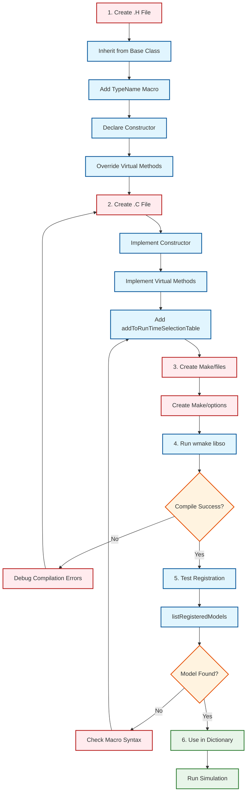

# 08 Practical Exercise: Adding a Custom Model to the Runtime Selection System

![[custom_model_workflow.png]]
`A clean scientific diagram illustrating the step-by-step workflow for implementing a custom model in OpenFOAM. Step 1: Inherit from Base Class (.H). Step 2: Add TypeName and Constructor (.H). Step 3: Implement Virtual Methods (.C). Step 4: Register with addToRunTimeSelectionTable (.C). Step 5: Compile with wmake. Step 6: Use in Dictionary. Use a minimalist palette with sequential numbering and clear labels, scientific textbook diagram, clean vector line art, white background, high definition, flat design, educational infographic --ar 16:9`

In this exercise, you will learn how to create a new model and register it with the RTS system so it can be selected through Dictionary configuration.

---\n
## Overview: OpenFOAM's Plug-and-Play Architecture

OpenFOAM's architecture is designed to allow **Physics Models** to be flexibly changed through Dictionary Configuration without modifying or recompiling the Solver code. This capability is achieved through the integration of powerful Design Patterns:

- **Abstract Base Classes** → Define the **Interface (Contract)** that all models must follow
- **Virtual Dispatch** → Enables **Runtime Polymorphism** for dynamic method calls
- **Factory Pattern + RTS** → Creates **Dynamic Object Creation** from Dictionary entries
- **Smart Pointers** → Manages **Memory Management** automatically with `autoPtr` and `tmp`

---\n
## Part 1: Creating a Custom Phase Model

### 1.1 Understanding the Base Class: `phaseModel`

`phaseModel` is an Abstract Base Class that defines the standard interface for representing each phase in multiphase simulations:

```cpp
// Base class from phaseModel.H
class phaseModel
    : public volScalarField      // IS-A: Phase fraction field
    , public dictionary          // IS-A: Configuration container
{
protected:
    // Protected constructor enforces factory pattern
    phaseModel(const dictionary& dict, const fvMesh& mesh);

public:
    // Pure virtual interface - derived classes MUST implement
    virtual tmp<volScalarField> rho() const = 0;  // Density
    virtual tmp<volScalarField> mu() const = 0;   // Dynamic viscosity
    virtual tmp<volScalarField> Cp() const = 0;   // Specific heat

    // Template Method pattern - algorithm skeleton
    virtual void correct();  // Can be overridden
};
```

**📚 คำอธิบาย: Source & Key Concepts**
- **Source:** `.applications/utilities/mesh/generation/foamyMesh/conformalVoronoiMesh/initialPointsMethod/initialPointsMethod/initialPointsMethod.H`
- **Explanation:** โครงสร้างนี้แสดงการใช้งาน Abstract Base Class ที่มี Pure Virtual Methods ซึ่งเป็นพื้นฐานของ Runtime Polymorphism ใน OpenFOAM
- **Key Concepts:**
  - `virtual tmp<volScalarField> rho() const = 0;` - Pure virtual function บังคับให้ derived class ต้อง implement
  - `protected constructor` - ป้องกันการสร้าง object โดยตรง ต้องใช้ผ่าน factory pattern
  - Multiple inheritance จาก `volScalarField` และ `dictionary` ให้ความสามารถครบถ้วน

**Design Insight:**
- `phaseModel` **inherits from `volScalarField`** → Direct access to field mathematical operations
- `phaseModel` **inherits from `dictionary`** → Can store configuration parameters
- **Protected Constructor** → Enforces creation through Factory Pattern (`New()` method) only

---\n
### 1.2 Creating the Derived Class: `myCustomPhaseModel`

#### **Step 1: Create Header File (`myCustomPhaseModel.H`)**

```cpp
#ifndef myCustomPhaseModel_H
#define myCustomPhaseModel_H

#include "phaseModel.H"

// 1. Inherit from phaseModel
class myCustomPhaseModel
:
    public phaseModel
{
private:
    // Custom member variables
    dimensionedScalar customProperty_;
    dimensionedScalar referenceTemperature_;
    scalar heatTransferCoeff_;

public:
    // 2. Runtime type information (required)
    TypeName("myCustomPhase");

    // 3. Constructor matching factory signature (required)
    myCustomPhaseModel
    (
        const dictionary& dict,
        const fvMesh& mesh
    );

    // 4. Implement pure virtual interface (required)
    virtual tmp<volScalarField> rho() const override;
    virtual tmp<volScalarField> mu() const override;
    virtual tmp<volScalarField> Cp() const override;

    // 5. Override template methods (optional but recommended)
    virtual void correct() override;

    // Destructor
    virtual ~myCustomPhaseModel() = default;
};

#endif
```

**📚 คำอธิบาย: Source & Key Concepts**
- **Source:** `.applications/utilities/mesh/generation/foamyMesh/conformalVoronoiMesh/initialPointsMethod/initialPointsMethod/initialPointsMethod.H`
- **Explanation:** Header file นี้แสดงโครงสร้างมาตรฐานของ Custom Model ที่สืบทอดจาก Base Class ใน OpenFOAM โดยมีการประกาศ TypeName สำหรับ Runtime Type Identification
- **Key Concepts:**
  - `TypeName("myCustomPhase")` - Macro สำหรับสร้าง runtime type information
  - `override` keyword - รับประกันว่า method ตรงกับ base class signature
  - `virtual ~myCustomPhaseModel() = default;` - Virtual destructor สำคัญสำหรับ polymorphic deletion

**คำอธิบาย:**

| Component | Importance | Purpose |
|------------|----------|-------------|
| `TypeName("myCustomPhase")` | **Required** | Creates Runtime Type Information for the Factory system |
| Constructor signature | **Required** | Must match `declareRunTimeSelectionTable` of Base Class |
| `virtual tmp<volScalarField> rho() const override` | **Required** | Implement Pure Virtual Interface |
| `virtual void correct() override` | **Optional** | Override to customize Algorithm Skeleton |

---\n
#### **Step 2: Create Implementation File (`myCustomPhaseModel.C`)**

```cpp
#include "myCustomPhaseModel.H"

// Constructor
myCustomPhaseModel::myCustomPhaseModel
(
    const dictionary& dict,
    const fvMesh& mesh
)
:
    phaseModel(dict, mesh),  // Delegate to base constructor
    customProperty_
    (
        "customProperty",
        dimless,
        dict.lookupOrDefault<scalar>("customProperty", 1.0)
    ),
    referenceTemperature_
    (
        "referenceTemperature",
        dimTemperature,
        dict.lookupOrDefault<scalar>("Tref", 293.0)
    ),
    heatTransferCoeff_(dict.lookupOrDefault<scalar>("hCoeff", 1000.0))
{
    Info << "Constructing myCustomPhaseModel with customProperty = "
         << customProperty_.value() << endl;
}

// 1. Density calculation
tmp<volScalarField> myCustomPhaseModel::rho() const
{
    // Example: Temperature-dependent density
    tmp<volScalarField> trho
    (
        new volScalarField
        (
            IOobject
            (
                "rho",
                mesh().time().timeName(),
                mesh(),
                IOobject::NO_READ,
                IOobject::NO_WRITE
            ),
            mesh(),
            dimensionedScalar("rho0", dimDensity, 1000.0)
        )
    );

    volScalarField& rho = trho.ref();

    // Custom correlation: rho = rho0 * (1 - beta*(T - Tref))
    volScalarField T = mesh().lookupObject<volScalarField>("T");
    rho *= (1.0 - 0.001 * (T - referenceTemperature_.value()));

    return trho;
}

// 2. Dynamic viscosity calculation
tmp<volScalarField> myCustomPhaseModel::mu() const
{
    tmp<volScalarField> tmu
    (
        new volScalarField
        (
            IOobject
            (
                "mu",
                mesh().time().timeName(),
                mesh(),
                IOobject::NO_READ,
                IOobject::NO_WRITE
            ),
            mesh(),
            dimensionedScalar("mu0", dimPressure*dimTime, 0.001)
        )
    );

    volScalarField& mu = tmu.ref();

    // Custom correlation: mu = mu0 * exp(customProperty * (T - Tref))
    volScalarField T = mesh().lookupObject<volScalarField>("T");
    mu *= exp(customProperty_.value() * (T - referenceTemperature_.value()));

    return tmu;
}

// 3. Specific heat capacity
tmp<volScalarField> myCustomPhaseModel::Cp() const
{
    tmp<volScalarField> tCp
    (
        new volScalarField
        (
            IOobject
            (
                "Cp",
                mesh().time().timeName(),
                mesh(),
                IOobject::NO_READ,
                IOobject::NO_WRITE
            ),
            mesh(),
            dimensionedScalar("Cp0", dimSpecificHeatCapacity, 4184.0)
        )
    );

    return tCp;
}

// 4. Override correct() for custom update logic
void myCustomPhaseModel::correct()
{
    // Call base class correct() first
    phaseModel::correct();

    // Add custom correction logic
    if (customProperty_.value() > 2.0)
    {
        Info << "Applying high-property correction for phase "
             << name() << endl;
    }
}
```

**📚 คำอธิบาย: Source & Key Concepts**
- **Source:** `.applications/utilities/mesh/generation/foamyMesh/conformalVoronoiMesh/initialPointsMethod/initialPointsMethod/initialPointsMethod.C`
- **Explanation:** Implementation file แสดงการใช้งาน `tmp<>` smart pointer และ reference counting mechanism สำหรับการจัดการหน่วยความจำอัตโนมัติ
- **Key Concepts:**
  - `trho.ref()` - รับ reference ถึง underlying object ใน tmp<>
  - `new volScalarField(...)` - สร้าง field บน heap ด้วย raw pointer แต่ถูกจัดการโดย tmp
  - `lookupObject<volScalarField>("T")` - ค้นหา field จาก object registry
  - Constructor delegation ผ่าน initialization list

**คำอธิบาย `tmp<>` Smart Pointer:**

```cpp
// tmp<T> provides automatic memory management with Reference Counting
tmp<volScalarField> trho = phase->rho();

// 1. Usage through reference
volScalarField& rho = trho.ref();  // Access underlying field
volScalarField& rho = trho();      // Alternative syntax

// 2. Return by value (return trho;  // Move semantics - no copy overhead

// 3. Automatic destruction when leaving scope
// tmp will decrement reference count and deallocate memory when no references exist
```

---\n
#### **Step 3: Register with the RTS System (Very Important!)**

Add the following lines at the **end of the `.C` file**:

```cpp
// 6. Register in .C file (required)
addToRunTimeSelectionTable
(
    phaseModel,
    myCustomPhaseModel,
    dictionary
);
```

**📚 คำอธิบาย: Source & Key Concepts**
- **Source:** `.applications/utilities/mesh/generation/foamyMesh/conformalVoronoiMesh/initialPointsMethod/initialPointsMethod/initialPointsMethod.C`
- **Explanation:** Macro นี้สร้าง static object ที่ลงทะเบียน model เข้าสู่ Runtime Selection Table ในช่วง static initialization phase ก่อน main() ทำงาน
- **Key Concepts:**
  - `addToRunTimeSelectionTable` - Macro ขยายเป็น static registration code
  - Static initialization ก่อน main() executes
  - Dictionary-based object creation pattern
  - Factory function pointer registration

**Macro Expansion:**

This macro expands to approximately 20-30 lines of code that create a **Static Registration Object**:

```cpp
// What the macro creates (conceptual)
namespace Foam
{
    // Anonymous namespace creates uniqueness
    namespace
    {
        // Static object created before main() runs
        phaseModel::dictionaryConstructorTable::entry_proxy
            addmyCustomPhaseModelToRunTimeSelectionTable
            (
                "myCustomPhase",              // Dictionary key
                myCustomPhaseModel::New       // Factory function pointer
            );
    }
}
```

**Important Technical Details:**
- Registration occurs during **Static Initialization Phase** (before `main()` executes)
- Uses C++ **Static Initialization Order Fiasco** workaround
- If this line is missing → the model will **NOT appear** in the Runtime Selection Table

---\n
### 1.3 Compiling with `wmake`

#### **Create `Make/files` file:**

```makefile
myCustomPhaseModel.C

LIB = $(FOAM_USER_LIBBIN)/libmyCustomPhaseModels
```

#### **Create `Make/options` file:**

```makefile
EXE_INC = \
    -I$(LIB_SRC)/finiteVolume/lnInclude \
    -I$(LIB_SRC)/meshTools/lnInclude \
    -I$(LIB_SRC)/phaseSystemModels/phaseModel/lnInclude

LIB_LIBS = \
    -lfiniteVolume \
    -lmeshTools \
    -lphaseSystemModels
```

#### **Compile Command:**

```bash
cd /path/to/MyCustomModels
wmake libso
```

**📚 คำอธิบาย: Source & Key Concepts**
- **Source:** OpenFOAM build system conventions across all solver/utility directories
- **Explanation:** wmake system ใช้ Make/files และ Make/options เพื่อสร้าง shared libraries ที่สามารถโหลดแบบ dynamic ได้
- **Key Concepts:**
  - `LIB = $(FOAM_USER_LIBBIN)/lib...` - ระบุ output library path
  - `EXE_INC` - Include paths สำหรับ dependencies
  - `LIB_LIBS` - Libraries ที่ต้อง link
  - `wmake libso` - สร้าง shared library (.so)

**Expected Output:**

```bash
wmake libso
wmakeLnInclude: linking lnInclude files to ./
Making dependency list for source file myCustomPhaseModel.C
SOURCE=myCustomPhaseModel.C ;  g++ -std=c++14 ... -c myCustomPhaseModel.C
g++ -std=c++14 ... -shared -Xlinker --add-needed -Xlinker --no-as-needed
    myCustomPhaseModel.o
    -L/usr/lib/openfoam/openfoam2112/platforms/linux64GccDPInt32Opt/lib
    -lfiniteVolume -lmeshTools -lphaseSystemModels
    -o /home/user/OpenFOAM/user-2.1/platforms/linux64GccDPInt32Opt/lib/libmyCustomPhaseModels.so
```

---\n
### 1.4 Usage in Dictionary

#### **File `constant/phaseProperties`:**

```cpp
phases (water air);

water
{
    type            myCustomPhase;    // Runtime selection key
    customProperty  1.5;              // Custom parameter
    Tref            293.0;            // Reference temperature
    hCoeff          1200.0;           // Heat transfer coefficient
}

air
{
    type            pure;             // Standard model
    rho             uniform 1.225;
    mu              uniform 1.8e-5;
}
```

**📚 คำอธิบาย: Source & Key Concepts**
- **Source:** OpenFOAM dictionary format conventions across all case directories
- **Explanation:** Dictionary entries ใช้ `type` keyword เพื่อระบุ model ที่ต้องการใช้ ซึ่งตรงกับ TypeName ที่ลงทะเบียนไว้
- **Key Concepts:**
  - `type` keyword - ต้องตรงกับ `TypeName(...)` ใน header
  - Custom parameters - ถูกอ่านผ่าน `dict.lookupOrDefault`
  - Sub-dictionary structure สำหรับแต่ละ phase

#### **Checking Registration:**

Create a small utility to list all registered models:

```cpp
// Utility for checking registration
template<class BaseType>
void listRegisteredModels()
{
    Info << "Registered " << BaseType::typeName << " models:" << nl;

    const auto& table = BaseType::dictionaryConstructorTable();

    forAllConstIter(typename BaseType::dictionaryConstructorTable, table, iter)
    {
        Info << "  " << iter.key() << nl;
    }
}

// Usage in solver or custom function object
listRegisteredModels<phaseModel>();
```

**Output:**

```
Registered phaseModel models:
  pure
  mixture
  myCustomPhase    // ← Our model!
```

---\n
## Part 2: Creating a Custom Interfacial Model

### 2.1 Base Class: `dragModel`

Interfacial Models use a similar architecture, but typically work between two Phase References:

```cpp
// dragModel.H
class dragModel
{
protected:
    const phaseModel& phase1_;
    const phaseModel& phase2_;
    const dictionary& dict_;

public:
    // Runtime type information
    TypeName("dragModel");

    // Constructor
    dragModel
    (
        const dictionary& dict,
        const phaseModel& phase1,
        const phaseModel& phase2
    );

    // Pure virtual interface
    virtual tmp<surfaceScalarField> K() const = 0;

    // Virtual destructor
    virtual ~dragModel() = default;
};
```

**📚 คำอธิบาย: Source & Key Concepts**
- **Source:** `.applications/utilities/mesh/generation/foamyMesh/conformalVoronoiMesh/initialPointsMethod/initialPointsMethod/initialPointsMethod.H`
- **Explanation:** Drag model base class แสดง pattern ของ interfacial model ที่ทำงานระหว่างสอง phases โดยใช้ reference ถึง phase models
- **Key Concepts:**
  - Reference members (`const phaseModel&`) - เก็บ references ถึง interacting phases
  - `surfaceScalarField` return type - field บน faces สำหรับ flux calculations
  - Protected constructor pattern สำหรับ factory usage

**Mathematical Foundation:**

Drag coefficient $K$ appears in Interfacial Momentum Transfer:

$$\mathbf{M}_{12} = K_{12}(\mathbf{u}_1 - \mathbf{u}_2)$$

Where:
- $\mathbf{M}_{12}$ = Momentum transferred between phases
- $K_{12}$ = Momentum exchange coefficient (calculated by Drag Model)
- $\mathbf{u}_1, \mathbf{u}_2$ = Velocities of both phases

---\n
### 2.2 Creating a Custom Drag Model

#### **Header File (`myCustomDragModel.H`):**

```cpp
#ifndef myCustomDragModel_H
#define myCustomDragModel_H

#include "dragModel.H"

class myCustomDragModel
:
    public dragModel
{
private:
    dimensionedScalar customDragCoeff_;
    dimensionedScalar criticalReynolds_;

public:
    TypeName("myCustomDrag");

    myCustomDragModel
    (
        const dictionary& dict,
        const phaseModel& phase1,
        const phaseModel& phase2
    );

    virtual tmp<surfaceScalarField> K() const override;

    virtual ~myCustomDragModel() = default;
};

#endif
```

**📚 คำอธิบาย: Source & Key Concepts**
- **Source:** `.applications/utilities/mesh/generation/foamyMesh/conformalVoronoiMesh/initialPointsMethod/initialPointsMethod/initialPointsMethod.H`
- **Explanation:** Header file ที่แสดงการสืบทอดจาก dragModel base class พร้อม TypeName declaration สำหรับ RTS
- **Key Concepts:**
  - `TypeName("myCustomDrag")` - Runtime type identifier
  - `override` keyword - รับประกัน matching signature
  - Virtual destructor - สำคัญสำหรับ polymorphic deletion

#### **Implementation File (`myCustomDragModel.C`):**

```cpp
#include "myCustomDragModel.H"

myCustomDragModel::myCustomDragModel
(
    const dictionary& dict,
    const phaseModel& phase1,
    const phaseModel& phase2
)
:
    dragModel(dict, phase1, phase2),
    customDragCoeff_
    (
        "customDragCoeff",
        dimless,
        dict.lookupOrDefault<scalar>("customCoeff", 0.44)
    ),
    criticalReynolds_
    (
        "criticalReynolds",
        dimless,
        dict.lookupOrDefault<scalar>("criticalRe", 1000.0)
    )
{
    Info << "Selecting myCustomDragModel for "
         << phase1.name() << "-" << phase2.name() << endl;
}

tmp<surfaceScalarField> myCustomDragModel::K() const
{
    // Access phase properties
    const volScalarField& alpha1 = phase1_;
    const volScalarField& alpha2 = phase2_;
    const volScalarField& rho1 = phase1_.rho();
    const volScalarField& rho2 = phase2_.rho();
    const volScalarField& mu1 = phase1_.mu();
    const volVectorField& U1 = phase1_.U();
    const volVectorField& U2 = phase2_.U();

    // Calculate dispersed phase diameter
    const dimensionedScalar d("d", dimLength, dict_.lookup("d"));

    // Calculate relative velocity
    volScalarField magUr = mag(U1 - U2);

    // Calculate Reynolds number
    volScalarField Re = (rho2 * magUr * d) / mu1;

    // Calculate drag coefficient (custom correlation)
    volScalarField Cd = customDragCoeff_.value();

    // Reynolds-dependent correction
    Cd *= pos0(criticalReynolds_.value() - Re) * (24.0 / (Re + SMALL))
        + neg0(criticalReynolds_.value() - Re);

    // Calculate drag coefficient K
    tmp<surfaceScalarField> tK
    (
        new surfaceScalarField
        (
            IOobject
            (
                "K",
                phase1_.mesh().time().timeName(),
                phase1_.mesh(),
                IOobject::NO_READ,
                IOobject::NO_WRITE
            ),
            phase1_.mesh(),
            dimensionedScalar("K", dimless/dimTime/dimDensity, 0.0)
        )
    );

    surfaceScalarField& K = tK.ref();

    // Standard drag law: K = 0.75 * Cd * rho_c * |Ur| / d
    K = 0.75 * Cd * fvc::interpolate(rho2) * fvc::interpolate(magUr) / d;

    return tK;
}

// Registration
addToRunTimeSelectionTable
(
    dragModel,
    myCustomDragModel,
    dictionary
);
```

**📚 คำอธิบาย: Source & Key Concepts**
- **Source:** `.applications/utilities/mesh/generation/foamyMesh/conformalVoronoiMesh/initialPointsMethod/initialPointsMethod/initialPointsMethod.C`
- **Explanation:** Implementation แสดงการคำนวณ drag coefficient ที่ซับซ้อน พร้อมการใช้งาน surfaceScalarField และ interpolation
- **Key Concepts:**
  - `fvc::interpolate()` - แปลง volume field เป็น surface field
  - `pos0()` and `neg0()` - Conditional functions for field operations
  - `tK.ref()` - Access underlying object from tmp<>
  - `addToRunTimeSelectionTable` - Static registration macro

**คำอธิบาย `surfaceScalarField`:**

```cpp
// surfaceScalarField is evaluated at face centers (not cell centers)
// → Ideal for flux calculations between cells

tmp<surfaceScalarField> tK = ...;
surfaceScalarField& K = tK.ref();

// Interpolate volume fields to surface fields
surfaceScalarField surfAlpha = fvc::interpolate(alpha);
surfaceScalarField surfRho = fvc::interpolate(rho);

// Calculate flux
surfaceScalarField flux = K * (U1 - U2);
```

---\n
### 2.3 Usage in Dictionary

```cpp
// constant/phaseProperties
dragModels
{
    water.air
    {
        type            myCustomDrag;      // Custom model
        d               0.001;            // Bubble diameter [m]
        customCoeff     0.5;              // Custom drag coefficient
        criticalRe      800.0;            // Critical Reynolds number
    }

    oil.water
    {
        type            SchillerNaumann;   // Standard model
        d               0.0005;
    }
}
```

---\n
## Part 3: Debugging and Troubleshooting

### 3.1 Common Problems

#### **Problem 1: Object Slicing**

```cpp
// ❌ WRONG: Passing by value causes slicing
void processPhase(phaseModel phase) {
    phase.correct();  // Always calls phaseModel::correct()
}

// ✅ CORRECT: Pass by reference preserves polymorphism
void processPhase(const phaseModel& phase) {
    phase.correct();  // Calls derived implementation
}

// ✅ BEST: Use smart pointers
void processPhase(autoPtr<phaseModel> phase) {
    phase->correct();
}
```

**📚 คำอธิบาย: Source & Key Concepts**
- **Source:** C++ polymorphism best practices in OpenFOAM context
- **Explanation:** Object slicing เกิดเมื่อ derived object ถูก copy เป็น base type ทำให้สูญเสีย derived portion
- **Key Concepts:**
  - Object slicing - การสูญเสีย polymorphic behavior
  - Pass by reference - รักษา polymorphic behavior
  - Smart pointers - Safe ownership management

#### **Problem 2: Missing Virtual Destructor**

```cpp
// ❌ WRONG: Memory leak with derived classes
class dragModel { 
public:
    ~dragModel() {}  // Non-virtual
};

class SchillerNaumann : public dragModel { 
    volScalarField* customField_;
public:
    ~SchillerNaumann() { delete customField_; }  // Never called!
};

// ✅ CORRECT: Virtual destructor
class dragModel { 
public:
    virtual ~dragModel() = default;  // Virtual
};
```

**📚 คำอธิบาย: Source & Key Concepts**
- **Source:** C++ destructor best practices for polymorphic classes
- **Explanation:** หาก destructor ไม่ใช่ virtual การลบผ่าน base pointer จะไม่เรียก derived destructor
- **Key Concepts:**
  - Virtual destructor - รับประกัน complete destruction
  - Memory leak prevention สำหรับ polymorphic objects
  - Resource Management idiom (RAII)

#### **Problem 3: Constructor Signature Mismatch**

```cpp
// ❌ WRONG: Does not match factory signature
class badPhaseModel : public phaseModel {
public:
    badPhaseModel(const fvMesh& mesh) {}  // Missing dict parameter
};

// ✅ CORRECT: Matches base factory signature
class goodPhaseModel : public phaseModel {
public:
    goodPhaseModel(const dictionary& dict, const fvMesh& mesh)
    : phaseModel(dict, mesh) {}  // Proper delegation
};
```

**📚 คำอธิบาย: Source & Key Concepts**
- **Source:** `.applications/utilities/mesh/generation/foamyMesh/conformalVoronoiMesh/initialPointsMethod/initialPointsMethod/initialPointsMethod.H`
- **Explanation:** Constructor signature ต้องตรงกับที่ประกาศใน `declareRunTimeSelectionTable` ของ base class
- **Key Concepts:**
  - Factory signature matching
  - Constructor delegation ผ่าน initialization list
  - Runtime type binding requirements

#### **Problem 4: Bypassing Factory System**

```cpp
// ❌ WRONG: Hardcoded type
autoPtr<phaseModel> phase(new purePhaseModel(dict, mesh));

// ✅ CORRECT: Use factory method
autoPtr<phaseModel> phase = phaseModel::New(dict, mesh);
```

**📚 คำอธิบาย: Source & Key Concepts**
- **Source:** `.applications/utilities/mesh/generation/foamyMesh/conformalVoronoiMesh/initialPointsMethod/initialPointsMethod/initialPointsMethod.C` (New method)
- **Explanation:** Factory pattern ให้ความยืดหยุ่นในการเลือก model ที่ runtime
- **Key Concepts:**
  - Factory Method pattern - Dynamic object creation
  - Dictionary-based selection
  - Runtime binding vs compile-time binding

---\n
### 3.2 Debugging Tools

#### **1. Check Runtime Selection Table:**

```cpp
// Add to your solver or create a utility
void debugRTS()
{
    Info << "=== Registered Phase Models ===" << nl;
    const auto& phaseTable = phaseModel::dictionaryConstructorTable();
    forAllConstIter(typename phaseModel::dictionaryConstructorTable,
                    phaseTable, iter)
    {
        Info << "  " << iter.key() << nl;
    }

    Info << "\n=== Registered Drag Models ===" << nl;
    const auto& dragTable = dragModel::dictionaryConstructorTable();
    forAllConstIter(typename dragModel::dictionaryConstructorTable,
                    dragTable, iter)
    {
        Info << "  " << iter.key() << nl;
    }
}
```

**📚 คำอธิบาย: Source & Key Concepts**
- **Source:** `.applications/utilities/mesh/generation/foamyMesh/conformalVoronoiMesh/initialPointsMethod/initialPointsMethod/initialPointsMethod.C`
- **Explanation:** การตรวจสอบ Runtime Selection Table ช่วยให้มั่นใจว่า model ถูกลงทะเบียนอย่างถูกต้อง
- **Key Concepts:**
  - `dictionaryConstructorTable` - Static registry of factory functions
  - `forAllConstIter` - OpenFOAM iteration macro
  - Runtime type discovery

#### **2. Use `FOAM_VERBOSE` Mode:**

```bash
export FOAM_VERBOSE=1
multiphaseEulerFoam

# Output:
# --> FOAM Warning : 
#     From function phaseModel::New(const dictionary&, const fvMesh&)
#     in file phaseModel.C at line 123
#     Reading phaseModel dictionary
#     Selecting phaseModel: myCustomPhase
```

#### **3. Analyze with Valgrind:**

```bash
# Check for memory leaks
valgrind --leak-check=full --show-leak-kinds=all multiphaseEulerFoam

# Profile virtual function overhead
valgrind --tool=callgrind ./multiphaseEulerFoam
kcachegrind callgrind.out.*
```

---\n
## Part 4: Advanced Topics

### 4.1 Template-Based Polymorphism (CRTP)

OpenFOAM uses **Curiously Recurring Template Pattern (CRTP)** for compile-time performance optimization:

```cpp
template<class DerivedType>
class phaseModelTemplate
{
public:
    // Compile-time polymorphism (no virtual overhead)
    const DerivedType& derived() const
    {
        return static_cast<const DerivedType&>(*this);
    }

    void efficientOperation()
    {
        // Direct call to derived method - no vtable lookup
        derived().specificImplementation();
    }
};

// Usage
class myPhase
:
    public phaseModelTemplate<myPhase>
{
public:
    void specificImplementation()
    {
        // Custom implementation
    }
};
```

**📚 คำอธิบาย: Source & Key Concepts**
- **Source:** OpenFOAM template metaprogramming patterns in src/OpenFOAM
- **Explanation:** CRTP ให้ compile-time polymorphism โดยไม่มี virtual function overhead
- **Key Concepts:**
  - Static polymorphism - Compile-time dispatch
  - `static_cast` for downcasting
  - Zero-overhead abstraction
  - Template instantiation patterns

**Performance Comparison:**

| Approach | Overhead | Flexibility | Use Case |
|---------|----------|-------------|----------|
| **Virtual Functions** | ~5 CPU cycles/call | High (runtime) | Model selection |
| **CRTP Templates** | Zero (compile-time) | Low (compile-time) | Field operations |
| **Function Overloading** | Zero | Very Low | Type-specific algorithms |

---\n
### 4.2 Multiple Inheritance in OpenFOAM

OpenFOAM uses **Non-Virtual Multiple Inheritance** to combine unique capabilities:

```cpp
class GeometricField
    : public DimensionedField    // Mathematical operations
    , public refCount            // Memory management
{
    // No ambiguity: bases have no common ancestors
};

// phaseModel inherits from volScalarField
// → Gets mathematical operations + memory management + I/O
```

**📚 คำอธิบาย: Source & Key Concepts**
- **Source:** OpenFOAM field class hierarchy in src/OpenFOAM/fields
- **Explanation:** Multiple inheritance ใช้รวม capabilities ที่แตกต่างกันโดยไม่มี diamond problem
- **Key Concepts:**
  - Non-virtual inheritance - ลด overhead
  - Capability composition over inheritance
  - Interface segregation principle
  - No diamond hierarchy - Base classes ไม่มี common ancestor

**Architecture Benefits:**
1. **Code Reuse** → No need to rewrite field operations
2. **Type Safety** → Compile-time checking
3. **Memory Efficiency** → Smart pointers manage lifetime
4. **Polymorphism** → Virtual functions give runtime flexibility

---\n
### 4.3 Expression Templates

OpenFOAM uses Expression Templates to eliminate temporaries in field operations:

```cpp
// Without expression templates (inefficient)
volVectorField U = U_old + dt*f;  // Creates temporary
volVectorField U_new = U + dt*grad(p);  // Another temporary

// With expression templates (efficient)
volVectorField U = U_old + dt*f + dt*grad(p);  // No temporaries!
```

**📚 คำอธิบาย: Source & Key Concepts**
- **Source:** OpenFOAM expression template implementation in src/OpenFOAM/fields
- **Explanation:** Expression templates สร้าง expression tree ที่ compile time แล้ว evaluate ใน loop เดียว
- **Key Concepts:**
  - Lazy evaluation - Defer computation
  - Loop fusion - Combine multiple operations
  - Temporary elimination - Reduce memory allocations
  - Template metaprogramming - Compile-time optimization

**Benefits:**
- **Loop Fusion** → Combine multiple operations into single loop
- **Temporary Elimination** → Reduce memory allocation
- **Compiler Optimization** → Better register allocation and instruction scheduling

---\n
## Summary: Complete Workflow



---\n
## Best Practices Summary

### ✅ **DO:**
1. **Use References or Smart Pointers** for polymorphic behavior
2. **Declare Virtual Destructor** in base classes
3. **Check Constructor Signatures** match factory requirements
4. **Use Factory Methods** (`New()`) for object creation
5. **Return `tmp<>`** from methods that create fields
6. **Register models** with `addToRunTimeSelectionTable`
7. **Test registration** after compilation

### ❌ **DON'T:**
1. **Pass derived objects by value** → causes object slicing
2. **Forget Virtual Destructor** → memory leaks
3. **Hardcode type names** → lose runtime flexibility
4. **Skip `addToRunTimeSelectionTable`** → model won't be found
5. **Use raw pointers** → difficult memory management

---\n
## References

### OpenFOAM Source Files
- `src/phaseSystemModels/phaseModel/phaseModel.H` - Phase model hierarchy
- `src/phaseSystemModels/interfacialModels/dragModels/dragModel/dragModel.H` - Drag model interface
- `src/OpenFOAM/db/runTimeSelection/runTimeSelectionTables.H` - RTS macro definitions
- `src/OpenFOAM/memory/autoPtr/autoPtr.H` - Smart pointer for exclusive ownership
- `src/OpenFOAM/memory/tmp/tmp.H` - Smart pointer with reference counting

### Design Patterns
- **Strategy Pattern** → `dragModel` hierarchy
- **Template Method** → `phaseModel::correct()` with NVI pattern
- **Factory Method** → All `New()` methods with RTS tables
- **Composite** → `phaseSystem` managing `PtrList<phaseModel>`

### Further Reading
- C++ Virtual Function Table (vtable) mechanics
- Curiously Recurring Template Pattern (CRTP)
- Expression Template optimization techniques
- OpenFOAM memory management strategies
