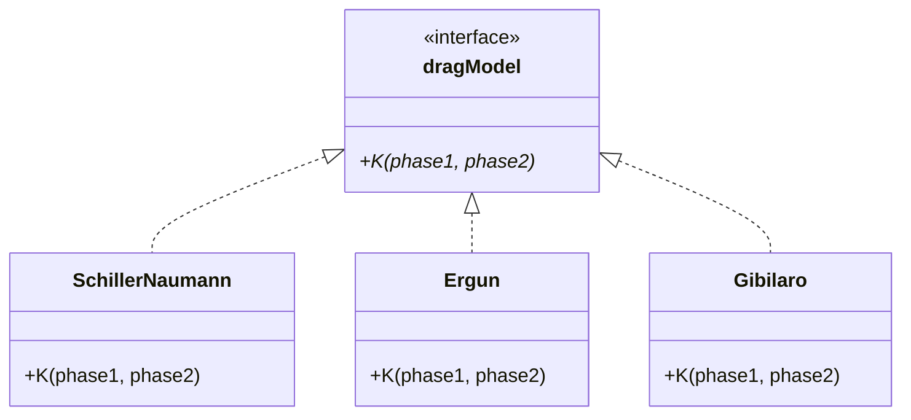

# 03 Strategy Pattern: อัลกอริทึมที่สลับเปลี่ยนได้ (Interchangeable Algorithms)

![[strategy_pattern_toolbox.png]]
`A clean scientific diagram illustrating the "Strategy Pattern Toolbox". Show a large "Solver" machine with a slot labeled "Physics Engine". Around the machine, show several modular "Algorithm Blocks" (representing different drag models: Schiller-Naumann, Ergun, Gibilaro) that can be plugged into the slot. Each block has the same "Standard Interface" but different internal "Mathematical Gears". Use a minimalist palette, scientific textbook diagram, clean vector line art, white background, high definition, flat design, educational infographic --ar 16:9`

ในขณะที่ Factory Pattern ตัดสินใจว่าจะ **"สร้างอะไร"**, Strategy Pattern จะเป็นตัวกำหนดว่าออบเจกต์นั้นจะ **"คำนวณอย่างไร"**:

## 1. "Hook": ชุดเครื่องมืออัลกอริทึม CFD

**อนาล็อกี**: จินตนาการชุดเครื่องมือที่แต่ละอันแก้ปัญหาเฉพาะทาง คุณไม่สนใจว่าประแจทำงานภายในอย่างไร—คุณแค่ต้องการขันสกรู ใน OpenFOAM แบบจำลองแรงลาก, แบบจำลองความปั่นป่วน, และรูปแบบการ Discretization เป็นเครื่องมือ "สลับเปลี่ยนได้" ในชุดเครื่องมือ CFD ของคุณ

**ปัญหาที่แก้**: จะ encapsulate กลุ่มของอัลกอริทึมที่เกี่ยวข้องและทำให้สามารถสลับเปลี่ยนกันได้ใน runtime?

**บริบทฟิสิกส์**: กฎแรงลากที่แตกต่างกัน (Schiller-Naumann, Ergun, Gibilaro) มีความแตกต่างทางคณิตศาสตร์ แต่มี interface เดียวกัน (คำนวณสัมประสิทธิ์แรงลาก)

## 2. Blueprint: อินเทอร์เฟซอัลกอริทึม


> **Figure 1:** แผนผังโครงสร้างของ Strategy Pattern ที่ใช้ในโมเดลแรงลาก (Drag Model) โดยกำหนดอินเทอร์เฟซกลาง `dragModel` ที่ทุกอัลกอริทึมต้องปฏิบัติตาม ทำให้ Solver สามารถเรียกใช้ฟังก์ชัน `K` ได้อย่างสม่ำเสมอโดยไม่ต้องสนใจว่าภายในจะใช้สูตรคณิตศาสตร์ของ Schiller-Naumann หรือ Ergun

**คำจำกัดความ Strategy Pattern**: กำหนด family ของอัลกอริทึม, encapsulate แต่ละอัน, และทำให้สามารถสลับเปลี่ยนกันได้

**การ Implement ใน OpenFOAM**: Abstract base class พร้อม pure virtual methods, concrete implementations สำหรับแต่ละอัลกอริทึม

```cpp
// Strategy Interface
class dragModel
{
public:
    TypeName("dragModel");

    // Pure virtual strategy method
    virtual tmp<surfaceScalarField> K
    (
        const phaseModel& phase1,
        const phaseModel& phase2
    ) const = 0;

    // Factory for runtime selection (combines Strategy with Factory!)
    static autoPtr<dragModel> New
    (
        const dictionary& dict,
        const phaseModel& phase1,
        const phaseModel& phase2
    );
};

// Concrete Strategy: Schiller-Naumann Drag
class SchillerNaumann
:
    public dragModel
{
private:
    dimensionedScalar C_;  // Algorithm parameters
    dimensionedScalar n_;

public:
    TypeName("SchillerNaumann");

    // Strategy implementation
    virtual tmp<surfaceScalarField> K
    (
        const phaseModel& phase1,
        const phaseModel& phase2
    ) const override
    {
        // Mathematical implementation
        const volScalarField Re = mag(phase1.U() - phase2.U()) * phase1.d() / phase2.nu();
        const volScalarField Cd = 24.0/Re * (1.0 + 0.15*pow(Re, 0.687));

        return 0.75 * Cd * phase2.rho() * mag(phase1.U() - phase2.U()) / phase1.d();
    }
};
```

📂 **Source:** `.applications/solvers/multiphase/multiphaseEulerFoam/phaseSystems/PhaseSystems/MomentumTransferPhaseSystem/MomentumTransferPhaseSystem.C`

📖 **Explanation:** โค้ดนี้แสดงโครงสร้างพื้นฐานของ Strategy Pattern ใน OpenFOAM ซึ่งประกอบด้วย:
1. **Abstract Interface (`dragModel`)**: กำหนด pure virtual method `K()` ที่ทุกอัลกอริทึมต้อง implement
2. **Concrete Strategy (`SchillerNaumann`)**: ให้การ implement จริงของอัลกอริทึม Schiller-Naumann สำหรับคำนวณสัมประสิทธิ์แรงลาก
3. **Factory Method**: ใช้ `New()` ร่วมกับ runtime selection table เพื่อสร้างออบเจกต์จาก dictionary

🔑 **Key Concepts:**
- **Pure Virtual Method**: Method ที่ไม่มีการ implement ใน base class และต้องถูก override ใน derived class
- **Runtime Selection**: การเลือกอัลกอริทึมจาก dictionary file โดยไม่ต้องคอมไพล์โค้ดใหม่
- **Polymorphism**: การเรียกใช้ method `K()` ผ่าน pointer ของ base class แต่ใช้ implementation ของ derived class

## 3. กลไกภายใน: Strategy + Factory Synergy

**การผสมผสานที่มีพลัง**: OpenFOAM ผสมผสาน Strategy Pattern (การ abstract อัลกอริทึม) กับ Factory Pattern (การสร้างใน runtime)

**กลไกการลงทะเบียน** (เหมือนกับ Factory):
```cpp
// In SchillerNaumann.C
addToRunTimeSelectionTable(dragModel, SchillerNaumann, dictionary);
```

📂 **Source:** `.applications/solvers/multiphase/multiphaseEulerFoam/phaseSystems/PhaseSystems/MomentumTransferPhaseSystem/MomentumTransferPhaseSystem.C`

📖 **Explanation:** นี่คือบรรทัดที่ลงทะเบียนคลาส `SchillerNaumann` เข้าไปใน runtime selection table เมื่อผู้ใช้ระบุ `type SchillerNaumann;` ใน dictionary file ระบบจะค้นหาคลาสนี้ในตารางและสร้างออบเจกต์ให้โดยอัตโนมัติ

🔑 **Key Concepts:**
- **Runtime Selection Table**: ตารางที่เก็บคลาสทั้งหมดที่สามารถถูกสร้างได้
- **Dictionary-Based Instantiation**: การสร้างออบเจกต์ผ่าน configuration file แทน hardcoded
- **Automatic Registration**: คลาสลูกลงทะเบียนตัวเองเมื่อ library ถูกโหลด

**ขั้นตอนการเลือกอัลกอริทึม**:
```cpp
// 1. Dictionary ระบุอัลกอริทึม
dragModel
{
    type            SchillerNaumann;  // Strategy selection
    C               0.44;             // Algorithm parameters
    n               1.0;
}

// 2. Factory สร้าง concrete strategy
autoPtr<dragModel> drag = dragModel::New(dragDict, phase1, phase2);

// 3. ใช้อัลกอริทึมแบบ polymorphic
surfaceScalarField Kdrag = drag->K(phase1, phase2);
```

📂 **Source:** `.applications/solvers/multiphase/multiphaseEulerFoam/phaseSystems/PhaseSystems/MomentumTransferPhaseSystem/MomentumTransferPhaseSystem.C`

📖 **Explanation:** นี่คือวิธีการใช้งาน Strategy Pattern ใน OpenFOAM ซึ่งเป็นการผสมผสานระหว่าง Strategy Pattern (สำหรับ abstraction) และ Factory Pattern (สำหรับ creation) ทำให้สามารถเลือกอัลกอริทึมได้ใน runtime

🔑 **Key Concepts:**
- **Dictionary Configuration**: การกำหนดค่าผ่าน text file แทนการ compile ใหม่
- **Factory Method**: `New()` เป็น static method ที่สร้างออบเจกต์ตาม type ที่ระบุ
- **Polymorphic Usage**: ใช้ผ่าน pointer ของ base class (`dragModel`) แต่เรียกใช้ implementation ของ derived class

## 4. กลไก: การ Encapsulation อัลกอริทึมคณิตศาสตร์

**แต่ละ strategy encapsulate แบบจำลองทางคณิตศาสตร์**:

**Schiller-Naumann Drag**:
$$
C_D = \frac{24}{\mathrm{Re}} (1 + 0.15\mathrm{Re}^{0.687})
$$

**Ergun Drag** (สำหรับ packed beds):
$$
K = 150 \frac{(1-\alpha)^2 \mu}{\alpha d_p^2} + 1.75 \frac{(1-\alpha) \rho |\mathbf{U}|}{d_p}
$$

**Gibilaro Drag**:
$$
K = \frac{17.3}{\mathrm{Re}} + 0.336
$$

**Strategy Pattern ทำให้เป็นไปได้**: การสลับเปลี่ยนระหว่างสูตรทางคณิตศาสตร์เหล่านี้ผ่านการกำหนดค่า dictionary โดยไม่ต้องเปลี่ยนโค้ด

## 5. "Why": Strategy Pattern สำหรับอัลกอริทึม CFD

**ทำไมต้อง Strategy Pattern ใน CFD?**:
1. **ความหลากหลายของอัลกอริทึม**: มีแบบจำลองทางคณิตศาสตร์ที่ถูกต้องหลายรูปแบบสำหรับฟิสิกส์เดียวกัน
2. **แบบจำลองเชิงประจักษ์**: แบบจำลองแรงลาก, การถ่ายเทความร้อน, ความปั่นป่วนมักเป็นสหสัมพันธ์เชิงประจักษ์
3. **ความยืดหยุ่นสำหรับการวิจัย**: สามารถเพิ่มแบบจำลองใหม่ได้โดยไม่ต้องแก้ไขโค้ด solver
4. **ความยืดหยุ่นในการตรวจสอบความถูกต้อง**: การเปรียบเทียบแบบจำลองต่างๆ บนปัญหาเดียวกันได้ง่าย

**ประโยชน์ด้านการออกแบบ**:
- **Encapsulation**: แต่ละอัลกอริทึมเป็นแบบสแตนด์อโลน
- **Interchangeability**: สามารถสลับแบบจำลองได้ใน runtime
- **Testability**: สามารถทดสอบแบบจำลองแต่ละอันแยกกันได้
- **Maintainability**: การเปลี่ยนแปลงอัลกอริทึมไม่กระทบโครงสร้าง solver

**พิจารณาด้านประสิทธิภาพ**: Virtual function overhead มีค่าเล็กน้อยเมื่อเทียบกับ field operations (โดยทั่วไป <0.1% ของ runtime)

## 6. ตัวอย่างการใช้งาน & ข้อผิดพลาด

### ✅ การใช้งานที่ถูกต้อง: การ Implement แบบจำลองแรงลากใหม่

```cpp
// 1. ศึกษาฟิสิกส์
// New drag correlation from journal paper:
// C_D = A/Re + B*Re^C

// 2. Implement เป็น strategy
class MyDragModel : public dragModel
{
    dimensionedScalar A_, B_, C_;

public:
    TypeName("myDrag");

    MyDragModel(const dictionary& dict, const phaseModel& p1, const phaseModel& p2)
    :
        dragModel(dict, p1, p2),
        A_(dict.lookup<dimensionedScalar>("A")),
        B_(dict.lookup<dimensionedScalar>("B")),
        C_(dict.lookup<dimensionedScalar>("C"))
    {}

    virtual tmp<surfaceScalarField> K(const phaseModel& p1, const phaseModel& p2) const override
    {
        const volScalarField Re = mag(p1.U() - p2.U()) * p1.d() / p2.nu();
        const volScalarField Cd = A_/Re + B_*pow(Re, C_);

        return 0.75 * Cd * p2.rho() * mag(p1.U() - p2.U()) / p1.d();
    }
};

// 3. Register
addToRunTimeSelectionTable(dragModel, MyDragModel, dictionary);

// 4. ใช้ใน case
dragModel
{
    type    myDrag;
    A       24.0;
    B       0.15;
    C       0.687;
}
```

📂 **Source:** `.applications/solvers/multiphase/multiphaseEulerFoam/phaseSystems/PhaseSystems/MomentumTransferPhaseSystem/MomentumTransferPhaseSystem.C`

📖 **Explanation:** ตัวอย่างนี้แสดงวิธีการ implement drag model ใหม่ใน OpenFOAM โดยการ:
1. สร้างคลาสที่สืบทอดจาก `dragModel`
2. Override method `K()` ด้วยสมการใหม่
3. ลงทะเบียนคลาสใน runtime selection table
4. ใช้งานผ่าน dictionary file

🔑 **Key Concepts:**
- **Custom Model Development**: การสร้างฟิสิกส์โมเดลใหม่โดยไม่ต้องแก้ไข solver
- **Parameter Reading**: การอ่านค่าพารามิเตอร์จาก dictionary ผ่าน `lookup`
- **Runtime Registration**: การลงทะเบียนคลาสให้รู้จักในระบบ runtime selection

### ❌ Anti-Patterns ของ Strategy Pattern

**Anti-Pattern 1: อัลกอริทึมเป็น Switch Statement**
```cpp
// WRONG: Hardcoded algorithm selection
surfaceScalarField calculateDrag(const word& modelType, ...)
{
    if (modelType == "SchillerNaumann")
        return calculateSchillerNaumann(...);
    else if (modelType == "Ergun")
        return calculateErgun(...);
    // Adding new models requires modifying this function
}

// RIGHT: Strategy pattern
autoPtr<dragModel> drag = dragModel::New(dict, phase1, phase2);
return drag->K(phase1, phase2);
```

📂 **Source:** `.applications/solvers/multiphase/multiphaseEulerFoam/phaseSystems/PhaseSystems/MomentumTransferPhaseSystem/MomentumTransferPhaseSystem.C`

📖 **Explanation:** ตัวอย่างนี้แสดงความแตกต่างระหว่างการใช้ switch statement (ผิด) กับ Strategy Pattern (ถูก) Switch statement ทำให้ต้องแก้ไขโค้ดเมื่อเพิ่มอัลกอริทึมใหม่ ในขณะที่ Strategy Pattern ทำให้สามารถเพิ่มอัลกอริทึมได้โดยไม่ต้องแก้ไขโค้ดที่มีอยู่

🔑 **Key Concepts:**
- **Open/Closed Principle**: คลาสควรเปิดสำหรับการ extend แต่ปิดสำหรับการ modify
- **Hardcoded Logic**: การเขียน if-else หรือ switch-case ทำให้โค้ดยากต่อการบำรุงรักษา
- **Polymorphic Design**: การใช้ virtual functions แทน conditional logic

**Anti-Pattern 2: การผสมผสานอัลกอริทึมกับข้อมูล**
```cpp
// WRONG: Algorithm parameters mixed with phase data
class phaseModel
{
    // ...
    scalar dragCoefficient_;  // Which drag model does this belong to?
    word dragModelType_;      // Mixing concerns
};

// RIGHT: Separate strategy object
class phaseModel
{
    autoPtr<dragModel> drag_;  // Strategy object
};
```

📂 **Source:** `.applications/solvers/multiphase/multiphaseEulerFoam/phaseSystems/PhaseSystems/MomentumTransferPhaseSystem/MomentumTransferPhaseSystem.C`

📖 **Explanation:** ตัวอย่างนี้แสดงหลักการ Separation of Concerns ซึ่งควรแยก algorithm ออกจากข้อมูล (data) การใช้ Strategy object ทำให้โค้ดมีความยืดหยุ่นและบำรุงรักษาได้ง่ายกว่าการฝังพารามิเตอร์ไว้ในคลาสโดยตรง

🔑 **Key Concepts:**
- **Separation of Concerns**: การแยกปัญหาออกจากกันให้แต่ละคลาสมีความรับผิดชอบเดียว
- **Composition over Inheritance**: การใช้ออบเจกต์มาประกอบกันมากกว่าการสืบทอดหลายชั้น
- **Encapsulation**: การซ่อนรายละเอียดของอัลกอริทึมไว้ในคลาส strategy

**Anti-Pattern 3: การ Copy-Paste การ Implement อัลกอริทึม**
```cpp
// WRONG: Duplicated code across solvers
void solver1::calculateDrag() { /* Schiller-Naumann implementation */ }
void solver2::calculateDrag() { /* Same implementation copied */ }
void solver3::calculateDrag() { /* Same implementation copied again */ }

// RIGHT: Single strategy implementation
class SchillerNaumann : public dragModel { /* One implementation */ };
// Used by all solvers via dragModel::New()
```

📂 **Source:** `.applications/solvers/multiphase/multiphaseEulerFoam/phaseSystems/PhaseSystems/MomentumTransferPhaseSystem/MomentumTransferPhaseSystem.C`

📖 **Explanation:** ตัวอย่างนี้แสดงความสำคัญของ DRY (Don't Repeat Yourself) Principle การ copy-paste โค้ดทำให้เกิดปัญหาเมื่อต้องแก้ไข bug หรือปรับปรุงอัลกอริทึม ในขณะที่การใช้ Strategy Pattern ทำให้มี implementation เดียวที่ใช้ร่วมกันทุก solver

🔑 **Key Concepts:**
- **Code Reusability**: การเขียนโค้ดครั้งเดียวและนำไปใช้ซ้ำ
- **Maintenance Burden**: การ copy-paste ทำให้ต้องแก้ไขหลายจุดเมื่อเกิด bug
- **Single Source of Truth**: การมี implementation เดียวที่เป็นที่ยอมรับ

## 7. สรุป Strategy Pattern

**Strategy Pattern ใน OpenFOAM คือ**:
1. **ชุดเครื่องมือ** ของอัลกอริทึมที่สลับเปลี่ยนได้
2. **การ Encapsulation แบบจำลองทางคณิตศาสตร์**
3. **การเลือกอัลกอริทึมใน runtime**
4. **รวมกับ Factory Pattern** สำหรับการสร้าง

**จุดสำคัญ**:
- แต่ละอัลกอริทึมเป็น class แยกกันที่ implement common interface
- อัลกอริทึมถูกเลือกผ่านฟิลด์ `type` ใน dictionary
- Strategy + Factory ทำให้การสลับอัลกอริทึมใน runtime เป็นไปได้
- Virtual function overhead มีค่าเล็กน้อยสำหรับ field operations

## 🧠 ทดสอบความเข้าใจ (Concept Check)

<details>
<summary>1. อะไรคือความแตกต่างหลักระหว่าง Factory Pattern และ Strategy Pattern?</summary>

**คำตอบ:** 
*   **Factory Pattern** เน้นที่ **"การสร้าง" (Creation)**: สร้างออบเจกต์อะไร
*   **Strategy Pattern** เน้นที่ **"พฤติกรรม" (Behavior)** หรือ **"วิธีการคำนวณ" (Algorithm)**: ออบเจกต์ทำอะไร (เช่น คำนวณ Drag ด้วยสูตรไหน)
</details>

<details>
<summary>2. Anti-Pattern การใช้ `switch-case` หรือ `if-else` เพื่อเลือกโมเดล (เช่น Drag Model) ไม่ดีอย่างไร?</summary>

**คำตอบ:** เพราะมันละเมิดหลักการ **Open/Closed Principle** กล่าวคือ หากเราต้องการเพิ่มโมเดลใหม่ เราต้องกลับไปแก้โค้ดที่มีอยู่เดิม (ในส่วน `if-else`) และต้องคอมไพล์โปรแกรมใหม่ทั้งหมด ซึ่งทำให้โค้ดขยายยากและบำรุงรักษายาก
</details>

## 📚 เอกสารที่เกี่ยวข้อง (Related Documents)

*   **ก่อนหน้า:** [02_Factory_Pattern.md](02_Factory_Pattern.md) - เจาะลึก Factory Pattern ใน OpenFOAM
*   **ถัดไป:** [04_Pattern_Synergy.md](04_Pattern_Synergy.md) - การทำงานร่วมกันของ Patterns