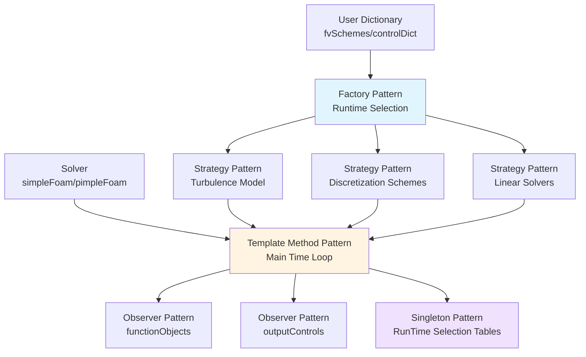

# Pattern Synergy

การใช้ Design Patterns ร่วมกันอย่างมีประสิทธิภาพ

---

## 🎯 Learning Objectives

หลังจากอ่านบทนี้ คุณจะสามารถ:
- เข้าใจการทำงานร่วมกันของ Design Patterns หลายๆ แบบ
- รู้จัก pattern combinations ที่พบบ่อยใน OpenFOAM
- ประยุกต์ใช้ pattern synergy ในการออกแบบซอฟต์แวร์ที่ยืดหยุ่น
- วิเคราะห์สถาปัตยกรรม OpenFOAM ผ่านมุมมอง pattern combinations

---

## 📋 Prerequisites

- **ความรู้พื้นฐาน:** [02_Factory_Pattern.md](02_Factory_Pattern.md) - Factory Pattern
- **ความรู้พื้นฐาน:** [03_Strategy_Pattern.md](03_Strategy_Pattern.md) - Strategy Pattern
- **ความรู้พื้นฐาน:** Template Method Pattern basics
- **ประสบการณ์:** เขียนโปรแกรม C++ ขั้นกลาง
- **ความเข้าใจ:** OpenFOAM solver architecture

---

## 📖 Overview

### What (อะไร)

**Pattern Synergy** คือการใช้ Design Patterns หลายๆ แบบร่วมกันอย่างสอดคล้องเพื่อสร้างสถาปัตยกรรมที่แข็งแกร่งกว่าการใช้ pattern เดียว เป็นการผสมผสาน patterns เพื่อแก้ปัญหาที่ซับซ้อน

### Why (ทำไม)

Patterns ไม่ได้อยู่โดดๆ ในโลกแห่งความเป็นจริง การใช้ร่วมกันช่วย:
- **เพิ่มความยืดหยุ่น:** runtime configuration หลายระดับ
- **ลด coupling:** separation of concerns ชัดเจน
- **เพิ่ม reusability:** components ใช้ซ้ำได้
- **บริหารจัดการความซับซ้อน:** แตกละเอียดได้ดีขึ้น

### How (อย่างไร)

OpenFOAM ใช้ pattern combinations อย่างแพร่หลาย:
- **Factory + Strategy:** runtime algorithm selection
- **Template Method + Strategy:** fixed structure, variable behavior
- **Factory + Observer:** pluggable monitoring system
- **Singleton + Factory:** global registries

---

## 📚 Main Content

### 1. Factory + Strategy

#### What: Runtime Algorithm Creation & Selection

Factory สร้าง Strategy objects ตาม dictionary specification ผู้ใช้เลือก algorithm ได้โดยไม่ต้อง recompile

#### Why: Maximum Flexibility

- **Decoupling:** client ไม่รู้จัก concrete classes
- **Configuration:** เลือก algorithm ผ่าน dictionary
- **Extensibility:** เพิ่ม algorithm ใหม่ง่ายๆ

#### How: OpenFOAM Implementation

```cpp
// Dictionary-based factory creation
// "divSchemes" section in fvSchemes
divSchemes
{
    default         none;
    div(phi,U)      Gauss upwind;         // Factory creates upwind scheme
    div(phi,k)      Gauss limitedLinear 1; // Factory creates limitedLinear
    div(phi,epsilon) Gauss upwind;
}

// Factory method (OpenFOAM internals)
template<class Type>
tmp<convectionScheme<Type>> 
convectionScheme<Type>::New
(
    const fvMesh& mesh,
    Istream& schemeData
)
{
    if (eqnScheme == "Gauss")
    {
        return tmp<convectionScheme<Type>>
        (
            new gaussConvectionScheme<Type>(mesh, schemeData)
        );
    }
    // Factory creates appropriate strategy based on input
}

// Runtime usage - Strategy pattern
autoPtr<convectionScheme<volVectorField>> divScheme = 
    convectionScheme<volVectorField>::New(mesh, schemeData);

// Use the strategy
tmp<volVectorField> convection = divScheme->fvmDiv(phi, U);
```

**Real Example:** `src/finiteVolume/finiteVolume/convectionSchemes/`

---

### 2. Template Method + Strategy

#### What: Fixed Algorithm Structure, Variable Components

Template Method กำหนด algorithm structure หลัก ส่วน Strategy ให้ behavior ที่เปลี่ยนแปลงได้

#### Why: Code Reuse + Customization

- **Consistency:** solver loop โครงสร้างเหมือนกัน
- **Variability:** turbulence models ต่างกัน
- **Maintainability:** เปลี่ยน algorithm หลักง่าย

#### How: OpenFOAM Solver Architecture

```cpp
// Template Method: Base solver defines algorithm structure
class solver
{
protected:
    autoPtr<turbulenceModel> turbulence_; // Strategy
    
public:
    virtual void solve() = 0; // Abstract method
    
    void run()
    {
        // Fixed algorithm structure (Template Method)
        while (runTime.loop())
        {
            // Variable steps using strategies
            turbulence_->predict();  // Strategy: turbulence model
            
            solve();                 // Template method hook
            
            turbulence_->correct();  // Strategy: turbulence correction
            
            // Observer pattern integration
            runTime.functionObjects().execute();
        }
    }
};

// Concrete solver implements specific solve() method
class simpleFoam : public solver
{
    void solve()
    {
        // Specific pressure-velocity algorithm
        solveUEqn();
        solvePEqn();
    }
};

// Strategy: Different turbulence models
class kEpsilon : public turbulenceModel
{
    void correct() 
    { 
        // k-epsilon specific corrections
        solveKEqn();
        solveEpsilonEqn();
    }
};

class kOmegaSST : public turbulenceModel
{
    void correct() 
    { 
        // k-omega SST specific corrections
        solveKEqn();
        solveOmegaEqn();
    }
};
```

**Real Example:** `applications/solvers/incompressible/simpleFoam/`

---

### 3. Factory + Observer

#### What: Creating Pluggable Monitors

Factory creates Observer objects (functionObjects) ที่ monitor solver execution

#### Why: Flexible Monitoring System

- **Non-invasive:** solver ไม่ต้องรู้จัก monitoring logic
- **Composable:** เลือก function objects ตามต้องการ
- **Reusable:** function objects ใช้กับ solvers ต่างๆ

#### How: OpenFOAM Function Objects

```cpp
// Dictionary: Factory specification
// system/controlDict
functions
{
    // Factory creates fieldAverage function object
    fieldAverage1
    {
        type            fieldAverage;  // Factory identifier
        functionObjectLibs ("libfieldFunctionObjects.so");
        
        fields
        (
            U
            p
        );
    }
    
    // Factory creates probes function object
    probeLocations
    {
        type            probes;        // Factory identifier
        functionObjectLibs ("libsampling.so");
        
        probeLocations
        (
            (0.01 0.01 0.01)
            (0.02 0.02 0.02)
        );
        
        fields
        (
            p
            U
        );
    }
}

// Runtime: Observer pattern in action
// Solver code (simplified)
while (runTime.loop())
{
    solve();
    
    // Notify all observers (function objects)
    runTime.functionObjects().execute();
}

// Function object observes and reacts
class fieldAverage
{
    void execute()
    {
        // React to solver iteration: accumulate fields
        accumulateField(field);
    }
    
    void write()
    {
        // React to write time: output averaged results
        averagedField = sumField / nSamples;
        averagedField.write();
    }
};
```

**Real Example:** `src/functionObjects/`

---

### 4. Singleton + Factory

#### What: Global Registry for Factories

Singleton จัดการ Factory registries ที่ใช้ global access

#### Why: Centralized Object Management

- **Global access:** 任何地方都能访问 factories
- **Lazy initialization:** factories สร้างเมื่อจำเป็น
- **Controlled creation:** prevent duplicates

#### How: OpenFOAM RunTime Selection

```cpp
// Singleton: Runtime selection tables
// Templated class with static registry
template<class Type>
class Runtime
{
    // Static registry (Singleton-like behavior)
    static HashTable<word, autoPtr<Type>*> constructorTable_;
    
public:
    // Register factory function
    static void addConstructor
    (
        const word& typeName,
        autoPtr<Type> (*constructor)()
    )
    {
        constructorTable_.insert(typeName, constructor);
    }
    
    // Factory method using registry
    static autoPtr<Type> New(const word& typeName)
    {
        typename HashTable<autoPtr<Type>*>::iterator iter =
            constructorTable_.find(typeName);
        
        if (iter != constructorTable_.end())
        {
            return iter()(); // Call constructor
        }
        
        FatalError << "Unknown type " << typeName << endl;
    }
};

// Usage: Auto-registration
// Define new turbulence model
class kEpsilon : public turbulenceModel
{
    // Register with factory (static initialization)
    defineTypeNameAndDebug(kEpsilon, 0);
    
    // Add to runtime table
    addToRunTimeSelectionTable
    (
        turbulenceModel,
        kEpsilon,
        dictionary
    );
};

// Client code - factory method
autoPtr<turbulenceModel> turb = 
    turbulenceModel::New(mesh); // Factory from Singleton registry
```

**Real Example:** `src/OpenFOAM/db/runTimeSelection/`

---

### 5. Complete OpenFOAM Architecture



---

### 6. Real-World Examples

#### Example 1: Complete Solver with Pattern Synergy

```cpp
// simpleFoam.C - Pattern combinations in action

// Factory + Strategy: Create turbulence model
autoPtr<incompressible::turbulenceModel> turbulence
(
    incompressible::turbulenceModel::New
    (
        U,
        phi,
        laminarTransport
    )
);

// Factory: Create linear solver
autoPtr<linearSolver> solver = 
    linear<scalar>::solver::New
    (
        U.name(),
        UEqn,
        solverControls
    );

// Template Method: Main solver loop
while (runTime.loop())
{
    // Strategy: Turbulence model correction
    turbulence->correct();
    
    // Template Method Hook: Solve momentum
    solveUEqn();
    
    // Strategy: Pressure solver with different schemes
    solvePEqn();
    
    // Observer: Function objects
    runTime.functionObjects().execute();
    
    // Observer: Output control
    runTime.write();
}

// Singleton: Runtime selection used throughout
// No need to manage global registries manually
```

#### Example 2: Dictionary-Driven Pattern Combination

```cpp
// system/fvSolution: Combines multiple patterns
solvers
{
    // Factory creates linear solver strategies
    p
    {
        solver          GAMG;              // Factory identifier
        tolerance       1e-06;
        relTol          0.1;
        
        // Strategy: Smoother algorithm
        smoother        GaussSeidel;
    }
    
    U
    {
        solver          smoothSolver;      // Factory identifier
        tolerance       1e-05;
        relTol          0.1;
        
        // Strategy: Different smoother
        smoother        symGaussSeidel;
    }
}

// SIMPLE algorithm: Template Method
SIMPLE
{
    // Fixed algorithm structure
    nNonOrthogonalCorrectors 0;
    
    // Strategy: Relaxation factors
    relaxationFactors
    {
        p               0.3;
        U               0.7;
        k               0.7;
        epsilon         0.7;
    }
}

// Observer: Function object specifications
functions
{
    #includeFunc residualsWithTime
    #includeFunc courantNo
}
```

---

## 🎓 Pattern Combinations Reference

| Pattern Combination | Primary Benefit | OpenFOAM Example |
|-------------------|-----------------|------------------|
| **Factory + Strategy** | Runtime algorithm selection | `fvSchemes` discretization |
| **Template + Strategy** | Fixed structure, variable behavior | Solver + turbulence models |
| **Factory + Observer** | Pluggable monitoring | `functionObjects` |
| **Singleton + Factory** | Global registries | Runtime selection tables |
| **Strategy + Observer** | Reactive algorithms | Adaptive time stepping |
| **Template + Factory** | Configurable workflows | Dynamic mesh solvers |

---

## 📝 Key Takeaways

### ✅ Pattern Synergy Principles

1. **Patterns Complement Each Other**
   - Factory creates objects, Strategy defines behavior
   - Template method provides structure, Observer adds monitoring

2. **OpenFOAM Architecture**
   - **Multi-layer patterns:** Factory → Strategy → Template → Observer
   - **Dictionary-driven:** All patterns configurable at runtime
   - **Extensible:** Add new strategies without modifying existing code

3. **Design Guidelines**
   - Use **Factory + Strategy** for algorithm selection
   - Use **Template Method** for fixed workflows
   - Use **Observer** for cross-cutting concerns
   - Use **Singleton** for global registries

4. **Best Practices**
   - Keep patterns decoupled
   - Make strategies swappable
   - Use dictionaries for configuration
   - Document pattern interactions

---

## 🧠 Concept Check

<details>
<summary><b>1. ทำไม Factory + Strategy ทำงานดีด้วยกัน?</b></summary>

**Factory สร้าง Strategy objects** — runtime selection ของ algorithms โดยไม่ต้อง compile ใหม่

Factory แยก creation logic ออกจาก usage ส่วน Strategy แยก algorithm implementation รวมกันทำให้:
- เลือก algorithm ผ่าน dictionary ได้
- เพิ่ม algorithm ใหม่ได้โดยไม่แก้ client code
- Test และ swap algorithms ง่าย

</details>

<details>
<summary><b>2. Template Method Pattern ช่วยอะไรใน OpenFOAM solvers?</b></summary>

**Fixed algorithm structure** — solver time loop โครงสร้างคงที่ แต่ override steps เฉพาะ

Template Method:
- กำหนด skeleton: `while (runTime.loop()) { ... }`
-  Delegate ให้ derived classes implement specific steps
- ใช้ร่วมกับ Strategy: turbulence models, discretization schemes

ข้อดี:
- Code reuse: solvers ใช้ loop structure เดียวกัน
- Consistency: รับรอง workflow ถูกต้อง
- Maintainability: เปลี่ยน structure หลักง่าย

</details>

<details>
<summary><b>3. functionObjects ใช้ Observer pattern จริงหรือ?</b></summary>

**ใช่** — registered objects observe solver events และ react ตาม trigger

Observer pattern ใน functionObjects:
- **Subject:** `runTime` (solver timeline)
- **Observers:** `fieldAverage`, `probes`, `forces`, etc.
- **Events:** `execute()` (per iteration), `write()` (per output)

ข้อดี:
- Non-invasive: solver ไม่รู้จัก monitoring logic
- Composable: เลือก function objects ตามต้องการ
- Decoupled: monitoring logic แยกจาก solver

</details>

<details>
<summary><b>4. Singleton ใช้ร่วมกับ Factory ยังไงใน OpenFOAM?</b></summary>

**Runtime selection tables** — Singleton-like static registries เก็บ factory functions

วิธีการ:
- `constructorTable_`: static HashTable (Singleton pattern)
- `New()`: Factory method ใช้ registry
- `addToRunTimeSelectionTable`: Auto-registration

ผลลัพธ์:
- Global access: 任何地方都能 create objects
- Lazy initialization: factories load on demand
- Type-safe: compile-time checking
- Extensible: third-party libraries register types

</details>

<details>
<summary><b>5. เมื่อไหรควรใช้ pattern combinations?</b></summary>

**Complex problems requiring flexibility** — single patterns ไม่เพียงพอ

ใช้ combinations เมื่อ:
- **Multiple variabilities:** algorithms + structures (Factory + Template)
- **Runtime configuration:** user needs full control (Factory + Strategy)
- **Cross-cutting concerns:** monitoring, logging (Template + Observer)
- **Global coordination:** registries, caches (Singleton + Factory)

ตัวอย่าง:
- OpenFOAM solvers: Template + Factory + Strategy + Observer
- Database systems: Singleton + Factory + Strategy
- UI frameworks: Observer + Command + Strategy

</details>

---

## 📖 Related Documents

### Pattern Fundamentals
- **Overview:** [00_Overview.md](00_Overview.md) — All design patterns summary
- **Factory Pattern:** [02_Factory_Pattern.md](02_Factory_Pattern.md) — Object creation patterns
- **Strategy Pattern:** [03_Strategy_Pattern.md](03_Strategy_Pattern.md) — Algorithm selection

### Advanced Topics
- **Performance:** [05_Performance_Analysis.md](05_Performance_Analysis.md) — Pattern performance considerations
- **Practical:** [06_Practical_Exercise.md](06_Practical_Exercise.md) — Hands-on pattern implementation

### Module References
- **OpenFOAM Architecture:** [03_OpenFOAM_Architecture.md](03_OpenFOAM_Architecture.md) — Codebase design
- **RTS System:** [04_Run_Time_Selection_System.md](04_Run_Time_Selection_System.md) — Runtime selection mechanism