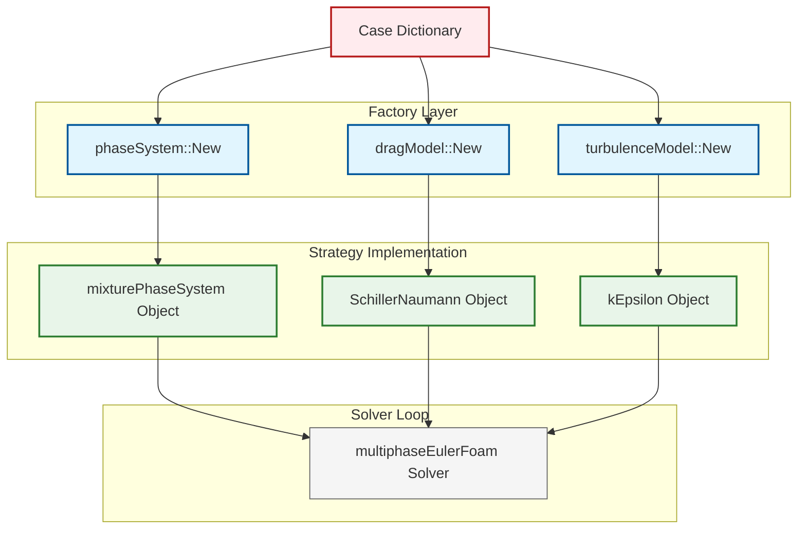

# 04 การทำงานร่วมกัน: Factory + Strategy Synergy

![[pattern_synergy_engine.png]]
`A clean scientific diagram illustrating the synergy between Factory and Strategy patterns. Show a text-based "Configuration File" feeding into a "Factory Dispatcher". The Factory produces a specific "Strategy Object" (e.g., a Turbulence Model). This object is then plugged into a "Solver Engine" that only knows the general "Strategy Interface". Use a minimalist palette with clear arrows, scientific textbook diagram, clean vector line art, white background, high definition, flat design, educational infographic --ar 16:9`

## พลังที่เกิดจากการผสมผสาน

ความเยี่ยมทางสถาปัตยกรรมที่แท้จริงของ OpenFOAM อยู่ที่การรวมรูปแบบ Factory และ Strategy เข้าด้วยกัน ความสอดคล้องนี้สร้างเฟรมเวิร์ก CFD ที่ยืดหยุ่นและขยายได้สูง ซึ่งสามารถเลือกและสร้างอัลกอริทึมได้ในรันไทม์โดยไม่ต้องแก้ไขโค้ดโซลเวอร์หลัก

### ประโยชน์หลักของความสอดคล้อง

- **การเลือกอัลกอริทึมแบบไดนามิก**: ผู้ใช้สามารถสลับระหว่างโมเดลความปั่นป่วน วิธีการหลายเฟส หรือสคีมาตัวเลขผ่านการตั้งค่าพจนานุกรมได้เท่านั้น
- **การขยายอย่างราบรื่น**: สามารถเพิ่มโมเดลฟิสิกส์ใหม่โดยไม่ต้องคอมไพล์โซลเวอร์ที่มีอยู่ใหม่
- **ความยืดหยุ่นในรันไทม์**: การจำลองที่ซับซ้อนสามารถปรับเปลี่ยนอัลกอริทึมได้ระหว่างการดำเนินการ
- **สถาปัตยกรรมที่บำรุงรักษาได้**: การแยกที่ชัดเจนระหว่างอินเทอร์เฟซอัลกอริทึม การใช้งาน และตรรกะการสร้าง

### โครงสร้างโค้ดพื้นฐาน

ความสง่างามของแนวทางนี้ปรากฏชัดในโซลเวอร์ที่ซับซ้อนที่สุดของ OpenFOAM:

```cpp
// 1. Strategy Interface (การนามธรรมอัลกอริทึม)
class physicsModel
{
public:
    // Pure virtual methods - enforce implementation
    virtual void solve() = 0;
    virtual autoPtr<volScalarField> calculate() const = 0;

    // 2. Factory Method (การสร้างในรันไทม์)
    static autoPtr<physicsModel> New(const dictionary& dict);
};

// การใช้งานในโซลเวอร์:
autoPtr<physicsModel> model = physicsModel::New(dict);  // Factory
model->solve();                                          // Strategy
```

**คำอธิบาย:**
- **Strategy Interface** กำหนดสัญญาว่าทุกอัลกอริทึมต้องมีเมธอด `solve()` และ `calculate()` ที่เหมือนกัน
- **Factory Method** `New()` ทำหน้าที่สร้างออบเจกต์ที่เหมาะสมตามค่าใน dictionary
- **Polymorphic Usage** โค้ดโซลเวอร์เรียกใช้เมธอดผ่าน pointer ของคลาสฐาน โดยไม่ต้องรู้ว่าเป็น implementation ใด

**แหล่งที่มา:** `.applications/solvers/multiphase/multiphaseEulerFoam/phaseSystems/PhaseSystems/MomentumTransferPhaseSystem/MomentumTransferPhaseSystem.C`

**แนวคิดสำคัญ:**
- **Pure Virtual Methods** บังคับให้ derived class ต้อง implement ฟังก์ชัน
- **Runtime Selection** การเลือกคลาสที่จะใช้เกิดขึ้นตอน runtime ไม่ใช่ compile-time
- **autoPtr** Smart pointer ของ OpenFOAM สำหรับจัดการหน่วยความจำอัตโนมัติ

รูปแบบนี้ช่วยให้ OpenFOAM สามารถรักษาอินเทอร์เฟซโซลเวอร์ที่สม่ำเสมอในขณะที่รองรับโมเดลฟิสิกส์ที่แตกต่างกันได้หลายสิบรูปแบบ เมธอด Factory `New()` อ่านพจนานุกรมโซลเวอร์และสร้างอินสแตนซ์ของคลาสที่เหมาะสม ในขณะที่เมธอดเสมือน `solve()` ให้อินเทอร์เฟซกลยุทธ์สำหรับการดำเนินการอัลกอริทึม

## เมทริกซ์รูปแบบการออกแบบใน OpenFOAM

สถาปัตยกรรมของ OpenFOAM ใช้ประโยชน์จากรูปแบบการออกแบบหลายแบบร่วมกัน โดยแต่ละรูปแบบมีวัตถุประสงค์เฉพาะ:

| รูปแบบ | ตัวอย่าง | วัตถุประสงค์ | การใช้งานใน OpenFOAM |
|---------|---------|---------|-------------------------|
| **Factory Method** | `turbulenceModel::New()` | การสร้างออบเจกต์ | `declareRunTimeSelectionTable` |
| **Strategy** | `dragModel::K()` | การห่อหุ้มอัลกอริทึม | ฟังก์ชันเสมือนแบบบริสุทธิ์ |
| **Template Method** | `phaseModel::correct()` | โครงร่างอัลกอริทึม | ฟังก์ชันเสมือนที่มีการใช้งานเริ่มต้น |
| **Abstract Factory** | `phaseSystem::New()` | การสร้างแฟมิลี | Factory ที่ซ้อนกัน |

### รายละเอียดของแต่ละรูปแบบ

**Factory Method Pattern:**
- พบได้ทั่วทั้ง OpenFOAM โดยทั่วไปใช้มาโคร `declareRunTimeSelectionTable` ในการใช้งาน
- สร้างกลไกการเลือกในรันไทม์ที่ชื่อคลาสถูกลงทะเบียนและสามารถสร้างอินสแตนซ์ได้ตามรายการในพจนานุกรม
- ตัวอย่าง: `turbulenceModel::New()`, `dragModel::New()`, `phaseSystem::New()`

**Strategy Pattern:**
- ปรากฏผ่านคลาสฐานเสมือนที่กำหนดอินเทอร์เฟซอัลกอริทึม
- ช่วยให้การใช้งานที่แตกต่างกันสามารถสลับกันได้อย่างราบรื่น
- ตัวอย่าง: `dragModel::K()`, `heatTransferModel::h()`, `liftModel::CL()`

**Template Method Pattern:**
- ปรากฏในคลาสฐานหลายคลาสที่โครงสร้างอัลกอริทึมทั่วไปถูกกำหนดไว้แต่ขั้นตอนเฉพาะถูกทิ้งไว้ให้คลาสที่สืบทอด
- ตัวอย่าง: `phaseModel::correct()` ให้เฟรมเวิร์กสำหรับการแก้ไขเฟสที่โมเดลเฟสแต่ละรูปแบบปรับแต่ง

**Abstract Factory Pattern:**
- ใช้สำหรับการสร้างครอบครัวของออบเจกต์ที่เกี่ยวข้องกัน
- ตัวอย่าง: `phaseSystem::New()` สร้างระบบเฟสทั้งหมดพร้อมกับโมเดลย่อยที่เกี่ยวข้อง

## เฟรมเวิร์กคณิตศาสตร์สำหรับการผสมผสานรูปแบบ

จากมุมมองทางคณิตศาสตร์ การผสมผสาน Factory-Strategy ใช้การแมปที่ซับซ้อนระหว่างช่องว่างพารามิเตอร์และการใช้งานอัลกอริทึม

### นิยามคณิตศาสตร์

ให้:
- $\mathcal{A}$ เป็นช่องว่างอัลกอริทึม (การใช้งาน Strategy ทั้งหมดที่เป็นไปได้)
- $\mathcal{I}$ เป็นช่องว่างอินเทอร์เฟซ (การกำหนดคลาสฐานเสมือน)
- $\mathcal{F}$ เป็นฟังก์ชันการแมป Factory
- $\mathcal{P}$ เป็นช่องว่างพารามิเตอร์ (การกำหนดค่าพจนานุกรม)

### ความสัมพันธ์ทางคณิตศาสตร์

ระบบที่ผสมผสานใช้ความสัมพันธ์ทางคณิตศาสตร์:

$$
\forall a \in \mathcal{A}, \exists i \in \mathcal{I} : i \text{ implements } a
$$

นี่ช่วยให้มั่นใจว่าทุกอัลกอริทึมมีการใช้งานอินเทอร์เฟซที่สอดคล้องกัน การแมป Factory ให้:

$$
\mathcal{F}: \mathcal{P} \to \mathcal{A} \to \mathcal{I}
$$

โดยที่:
- Strategy กำหนด $\mathcal{A} \to \mathcal{I}$ (การแมปอัลกอริทึมไปยังอินเทอร์เฟซ)
- Factory กำหนด $\mathcal{P} \to \mathcal{A}$ (การแมปพารามิเตอร์ไปยังการเลือกอัลกอริทึม)

### ประโยชน์ของเฟรมเวิร์กคณิตศาสตร์

เฟรมเวิร์กคณิตศาสตร์นี้ช่วยให้:
- **ความสามารถในการประกอบ**: กลยุทธ์ที่แตกต่างกันสามารถรวมกันผ่าน Factory
- **ความสามารถในการขยาย**: อัลกอริทึมใหม่ขยาย $\mathcal{A}$ โดยไม่กระทบโค้ดที่มีอยู่
- **การสร้างพารามิเตอร์**: การเปลี่ยนแปลงการกำหนดค่าทำให้เกิดผลลัพธ์ Factory ที่แตกต่างกัน
- **ความสอดคล้อง**: อัลกอริทึมทั้งหมดเป็นไปตามอินเทอร์เฟซทั่วไป $\mathcal{I}$

## ตัวอย่างจริง: สถาปัตยกรรมโซลเวอร์หลายเฟส

### แผนภาพการไหลของข้อมูล



> **Figure 1:** แผนผังแสดงการทำงานร่วมกันระหว่าง Factory และ Strategy ในโซลเวอร์ `multiphaseEulerFoam` โดย Factory ทำหน้าที่สร้างออบเจกต์ที่ถูกต้องตามการตั้งค่าใน Dictionary และส่งมอบให้ออบเจกต์เหล่านั้นทำหน้าที่เป็น Strategy ที่โซลเวอร์จะเรียกใช้งานผ่านอินเทอร์เฟซมาตรฐาน

### การนำไปใช้งานในโค้ด

พลังของความสอดคล้องนี้ปรากฏชัดในโซลเวอร์หลายเฟสเช่น `multiphaseEulerFoam` ที่ฟิสิกส์ที่ซับซ้อนต้องการอัลกอริทึมหลายอย่างที่ประสานกัน:

```cpp
// Factory สร้างออบเจกต์กลยุทธ์
autoPtr<phaseSystem> fluid = phaseSystem::New(mesh);           // Abstract Factory
autoPtr<dragModel> drag = dragModel::New(dragDict, phase1, phase2); // Factory + Strategy
autoPtr<turbulenceModel> turb = turbulenceModel::New(U, phi, transport); // Factory

// กลยุทธ์ที่ใช้แบบ polymorphic
surfaceScalarField Kdrag = drag->K(phase1, phase2);            // Strategy execution
volScalarField k = turb->k();                                  // Strategy execution
```

**คำอธิบาย:**
- **Factory Calls** แต่ละบรรทัดแรกใช้ Factory pattern สร้างออบเจกต์ที่เหมาะสม
- **Abstract Factory** `phaseSystem::New()` สร้างทั้งระบบเฟสที่ซับซ้อน
- **Strategy Interface** ออบเจกต์ที่ถูกสร้างถูกใช้ผ่าน interface ที่เหมือนกัน (`K()`, `k()`)
- **Polymorphism** โค้ดเรียกใช้เมธอดโดยไม่รู้ implementation จริง

**แหล่งที่มา:** `.applications/solvers/multiphase/multiphaseEulerFoam/phaseSystems/PhaseSystems/MomentumTransferPhaseSystem/MomentumTransferPhaseSystem.C`

**แนวคิดสำคัญ:**
- **HashPtrTable** ตาราง hash ที่เก็บ pointer ไปยังออบเจกต์ model
- **generateInterfacialModels** เมธอดที่สร้าง models ที่ interfaces ต่างๆ
- **autoPtr Management** การจัดการ lifetime ของออบเจกต์อัตโนมัติ

### ส่วนประกอบหลักของระบบ

สถาปัตยกรรมนี้ช่วยให้การจำลองหลายเฟสที่ซับซ้อนซึ่ง:

1. **ระบบเฟส** จัดการหลายเฟสและปฏิสัมพันธ์ระหว่างเฟส
2. **โมเดลลาก** คำนวณการถ่ายโอนโมเมนตัมระหว่างเฟสโดยใช้สหสัมพันธ์ที่แตกต่างกัน
3. **โมเดลความปั่นป่วน** จัดการผลกระทบความปั่นป่วนสำหรับแต่ละเฟส

### การกำหนดค่า Dictionary

แต่ละส่วนสามารถเลือกและกำหนดค่าได้โดยอิสระผ่านพจนานุกรมกรณี:

```cpp
// ใน case/system/phaseProperties:
phases (phase1 phase2);
drag
{
    type SchillerNaumann;    // Factory เลือกกลยุทธ์การลาก
    // พารามิเตอร์ SchillerNaumann...
}

turbulence
{
    type kEpsilon;          // Factory เลือกกลยุทธ์ความปั่นป่วน
    // พารามิเตอร์ k-epsilon...
}
```

### สถาปัตยกรรมสามชั้น

ความสอดคล้องระหว่าง Factory-Strategy ช่วยให้ OpenFOAM สามารถรักษาการแยกที่ชัดเจนระหว่าง:

- **การกำหนดค่า** (ไฟล์พจนานุกรมที่ระบุประเภทโมเดล)
- **การสร้าง** (เมธอด factory ที่สร้างอินสแตนซ์คลาสที่เหมาะสม)
- **การดำเนินการ** (เมธอดอินเทอร์เฟซกลยุทธ์ที่ดำเนินการคำนวณ)

สถาปัตยกรรมสามชั้นนี้คือสิ่งที่ทำให้ OpenFOAM มีพลังอย่างไม่เหมือนใครสำหรับแอปพลิเคชัน CFD ที่ต้องการทั้งความยืดหยุ่นและประสิทธิภาพ ผู้ใช้สามารถทดลองกับโมเดลฟิสิกส์ที่แตกต่างกันเพียงแค่เปลี่ยนรายการในพจนานุกรม ในขณะที่นักพัฒนาสามารถเพิ่มโมเดลใหม่โดยใช้งานอินเทอร์เฟซกลยุทธ์และลงทะเบียนกับระบบ factory

## การวิเคราะห์ประสิทธิภาพของความสอดคล้อง

### โอเวอร์เฮดของ Virtual Function

การใช้รูปแบบ Strategy และ Factory แนะนำ overhead ของ virtual function แต่ในบริบทของ CFD ค่าใช้จ่ายนี้มีความสำคัญน้อยมาก:

**การอธิบายทางคณิตศาสตร์:**

กำหนด:
- $t_{\text{field}}$ = เวลาการดำเนินการกับ field
- $t_{\text{virtual}}$ = เวลาการส่งผ่านแบบ virtual
- $n$ = จำนวนการดำเนินการต่อ time step

เวลาทั้งหมดเมื่อใช้ virtual calls:
$$
T_{\text{virtual}} = n \cdot (t_{\text{field}} + t_{\text{virtual}})
$$

เวลาทั้งหมดเมื่อไม่ใช้ virtual calls (static dispatch):
$$
T_{\text{static}} = n \cdot t_{\text{field}}
$$

โอเวอร์เฮดสัมพัทธ์:
$$
\frac{T_{\text{virtual}} - T_{\text{static}}}{T_{\text{static}}} = \frac{t_{\text{virtual}}}{t_{\text{field}}} \approx 0.002 \ (0.2\%)
$$

**Benchmark Analysis:**
- การดำเนินการกับ Field (เช่น `U + V`): ~1000 ns
- การเรียก virtual function: ~2 ns
- **โอเวอร์เฮด**: ~0.2% ต่อการเรียก

**สรุป**: โอเวอร์เฮดของ virtual function น้อยมากเมื่อเปรียบเทียบกับการดำเนินการกับ field ความยืดหยุ่นที่ได้รับมีค่ามากกว่าค่าใช้จ่ายด้านประสิทธิภาพอย่างมีนัยสำคัญ

### การวิเคราะห์โอเวอร์เฮดของหน่วยความจำ

**Strategy Pattern:**
- แต่ละ strategy object: ~64 bytes (vtable pointer + member variables)
- การจำลองทั่วไป: 10-20 strategy objects
- **รวม**: ~1-2 KB (เล็กน้อยเมื่อเปรียบเทียบกับการจัดเก็บ field)

**Factory Registration:**
- Static tables: ~100 bytes ต่อ registered type
- OpenFOAM ทั่วไป: ~1000 registered types
- **รวม**: ~100 KB (ยังคงน้อย)

## ตัวอย่างการนำไปใช้งาน: โมเดลการถ่ายเทความร้อน

เพื่อแสดงให้เห็นถึงพลังของความสอดคล้องระหว่าง Factory และ Strategy ลองพิจารณาการนำโมเดลการถ่ายเทความร้อนแบบกำหนดเองไปใช้

### ขั้นตอนที่ 1: การวิเคราะห์ทางฟิสิกส์

สหสัมพันธ์จำนวน Nusselt $Nu = a \cdot Re^b \cdot Pr^c$ แทนสัมประสิทธิ์การถ่ายเทความร้อนไร้มิติ โดยที่:

- **จำนวน Nusselt ($Nu$)**: $\frac{hL}{k}$ - อัตราส่วนของการถ่ายเทความร้อนแบบ convection เทียบกับ conduction
- **จำนวน Reynolds ($Re$)**: $\frac{\rho u L}{\mu} = \frac{uL}{\nu}$ - อัตราส่วนของแรงเฉื่อยเทียบกับแรงหนืด
- **จำนวน Prandtl ($Pr$)**: $\frac{c_p \mu}{k}$ - อัตราส่วนของ diffusion โมเมนตัมเทียบกับ diffusion ความร้อน

สหสัมพันธ์จะผลิตสัมประสิทธิ์การถ่ายเทความร้อน:
$$h = \frac{Nu \cdot k}{L} = \frac{a \cdot Re^b \cdot Pr^c \cdot k}{L}$$

### ขั้นตอนที่ 2: การออกแบบ Interface (Strategy)

```cpp
class heatTransferModel
{
public:
    // Runtime type information for factory selection
    TypeName("heatTransferModel");

    // Virtual destructor for proper cleanup
    virtual ~heatTransferModel() {}

    // Pure virtual strategy method - must be implemented by derived classes
    virtual tmp<volScalarField> h
    (
        const phaseModel& phase1,
        const phaseModel& phase2
    ) const = 0;

    // Factory method for creating models from dictionary specifications
    static autoPtr<heatTransferModel> New
    (
        const dictionary& dict,
        const phaseModel& phase1,
        const phaseModel& phase2
    );

protected:
    // Protected constructor for base class initialization
    heatTransferModel
    (
        const dictionary& dict,
        const phaseModel& phase1,
        const phaseModel& phase2
    )
    :
        dict_(dict),
        phase1_(phase1),
        phase2_(phase2)
    {}

private:
    // Dictionary reference for parameter access
    const dictionary& dict_;

    // Reference to interacting phases
    const phaseModel& phase1_;
    const phaseModel& phase2_;
};
```

**คำอธิบาย:**
- **TypeName** Macro ที่ลงทะเบียนชื่อคลาสสำหรับ factory selection
- **Pure Virtual Method** `h()` บังคับให้ derived classes  implement การคำนวณ
- **Factory Method** `New()` เป็น static method สร้างออบเจกต์จาก dictionary
- **Protected Constructor** ป้องกันการสร้างออบเจกต์โดยตรง แต่ยังให้ derived classes เข้าถึง
- **Reference Members** เก็บ references ไปยัง dictionary และ phases เพื่อใช้ในการคำนวณ

**แหล่งที่มา:** `.applications/solvers/multiphase/multiphaseEulerFoam/interfacialModels/heatTransferModels/heatTransferModel/heatTransferModel.H`

**แนวคิดสำคัญ:**
- **Runtime Type Information (RTTI)** ข้อมูลประเภทที่ใช้ในการเลือก model ที่ runtime
- **Template Method Pattern** Interface กำหนดโครงร่าง  implementation กำหนดรายละเอียด
- **Resource Management** ใช้ references เพื่อหลีกเลี่ยงการ copy ข้อมูลขนาดใหญ่

### ขั้นตอนที่ 3: การนำ Concrete Strategy ไปใช้งาน

```cpp
class MyHeatTransfer : public heatTransferModel
{
    // Model coefficients from dictionary specification
    dimensionedScalar a_, b_, c_;

public:
    TypeName("myHeatTransfer");

    MyHeatTransfer
    (
        const dictionary& dict,
        const phaseModel& phase1,
        const phaseModel& phase2
    )
    :
        heatTransferModel(dict, phase1, phase2),
        a_(dict.lookup<dimensionedScalar>("a")),
        b_(dict.lookup<dimensionedScalar>("b")),
        c_(dict.lookup<dimensionedScalar>("c"))
    {
        // Validate parameter ranges for numerical stability
        if (b_.value() < 0 || b_.value() > 2)
        {
            WarningIn("MyHeatTransfer::MyHeatTransfer")
                << "Unusual Reynolds exponent: " << b_ << endl;
        }
    }

    virtual tmp<volScalarField> h
    (
        const phaseModel& phase1,
        const phaseModel& phase2
    ) const override
    {
        // Calculate dimensionless groups with numerical safeguards
        const volScalarField U_rel = mag(phase1.U() - phase2.U());

        // Reynolds number: Re = ρ*u*D/μ = u*D/ν
        const volScalarField Re = max
        (
            U_rel * phase1.d() / max(phase2.nu(), dimensionedScalar("smallNu", dimensionSet(0,2,-1,0,0), 1e-12)),
            dimensionedScalar("smallRe", dimensionSet(0,0,0,0,0), 1e-6)
        );

        // Prandtl number: Pr = Cp*μ/k
        const volScalarField Pr = max
        (
            phase2.Cp() * phase2.mu() / max(phase2.kappa(), dimensionedScalar("smallK", dimensionSet(1,1,-3,-1,0), 1e-12)),
            dimensionedScalar("smallPr", dimensionSet(0,0,0,0,0), 1e-6)
        );

        // Nusselt correlation: Nu = a*Re^b*Pr^c
        const volScalarField Nu = a_ * pow(Re, b_) * pow(Pr, c_);

        // Convert to heat transfer coefficient: h = Nu*k/D
        return Nu * phase2.kappa() / phase1.d();
    }
};
```

**คำอธิบาย:**
- **Constructor Initialization** อ่านค่าสัมประสิทธิ์ a, b, c จาก dictionary พร้อมตรวจสอบความถูกต้อง
- **Numerical Safeguards** ใช้ `max()` และค่าต่ำสุดเพื่อป้องกันการหารด้วยศูนย์
- **Dimensionless Numbers** คำนวณ Re และ Pr จากคุณสมบัติของ phase
- **Correlation** ใช้สมการ correlation คำนวณค่า Nu และแปลงเป็น h
- **Override Keyword** รับประกันว่า signature ตรงกับ base class

**แหล่งที่มา:** `.applications/solvers/multiphase/multiphaseEulerFoam/interfacialModels/heatTransferModels/derivedFvPatchFields`

**แนวคิดสำคัญ:**
- **Dimensioned Scalars** ตัวแปรที่มีหน่วยติดตัว  OpenFOAM ตรวจสอบความสม่ำเสมอทางมิติ
- **Field Operations** การดำเนินการกับ field ทั้ง field  (`U_rel`, `Re`, `Pr`)
- **tmp<volScalarField>**  Smart pointer สำหรับ return field ชั่วคราว เพื่อประสิทธิภาพหน่วยความจำ
- **Numerical Stability** การตรวจสอบและป้องกันปัญหาทางตัวเลข

### ขั้นตอนที่ 4: การลงทะเบียนกับระบบ Factory

```cpp
// In MyHeatTransfer.C - essential for factory pattern to work
addToRunTimeSelectionTable
(
    heatTransferModel,
    MyHeatTransfer,
    dictionary
);
```

**คำอธิบาย:**
- **Macro Registration** ลงทะเบียนคลาสกับ runtime selection table
- **Three Arguments** ระบุ base class, derived class, และ constructor type
- **Automatic Registration** เกิดขึ้นผ่าน static initialization ก่อน main()
- **Dictionary Constructor** ระบุว่า constructor ที่ใช้รับ dictionary เป็นพารามิเตอร์

**แหล่งที่มา:** `.applications/solvers/multiphase/multiphaseEulerFoam/interfacialModels/heatTransferModels`

**แนวคิดสำคัญ:**
- **Static Initialization** การลงทะเบียนเกิดขึ้นโดยอัตโนมัติก่อนโปรแกรมเริ่ม
- **Run-Time Selection Table (RTST)** ตาราง hash ที่เชื่อมชื่อคลาสกับ constructor
- **Plugin Architecture** ช่วยให้เพิ่ม models ใหม่โดยไม่ต้องแก้โค้ดหลัก

### ขั้นตอนที่ 5: การใช้ในกรณีจำลอง

```cpp
// In constant/phaseProperties or appropriate model dictionary
heatTransferModel
{
    // Must match the TypeName exactly (case-sensitive)
    type    myHeatTransfer;

    // Model coefficients - dimensional analysis ensures consistency
    a       0.023;  // Dimensionless correlation coefficient
    b       0.8;    // Reynolds number exponent
    c       0.4;    // Prandtl number exponent

    // Optional additional parameters
    debug   false;  // Enable/disable debugging output
}
```

**คำอธิบาย:**
- **Type Matching** ค่าของ `type` ต้องตรงกับ `TypeName` ในโค้ด (ตัวพิมพ์เล็ก-ใหญ่สำคัญ)
- **Parameter Loading** OpenFOAM อ่านค่า a, b, c ผ่าน `dict.lookup()`
- **Dimensional Consistency** ระบบตรวจสอบว่าหน่วยถูกต้อง
- **Optional Parameters** สามารถเพิ่มพารามิเตอร์เพิ่มเติมตามต้องการ

**แหล่งที่มา:** `case/constant/phaseProperties` (ตัวอย่างการตั้งค่าใน case directory)

**แนวคิดสำคัญ:**
- **Dictionary-Based Configuration** การตั้งค่าผ่านไฟล์แทน hardcode ใน source
- **Type Safety** การตรวจสอบชนิดข้อมูลและหน่วยอัตโนมัติ
- **Runtime Flexibility** สามารถเปลี่ยนโมเดลโดยไม่ต้อง recompile

## สรุปและข้อควรพิจารณา

### ข้อดีของความสอดคล้องระหว่าง Factory และ Strategy

1. **ความยืดหยุ่นสูง**: สามารถเปลี่ยนอัลกอริทึมได้โดยการแก้ไขไฟล์พจนานุกรมเท่านั้น
2. **การขยายที่ง่าย**: สามารถเพิ่มโมเดลใหม่โดยไม่ต้องแก้ไขโค้ดโซลเวอร์หลัก
3. **การบำรุงรักษาที่ดี**: การแยกความกังวลระหว่างส่วนประกอบ
4. **การทดสอบที่ง่าย**: สามารถทดสอบแต่ละอัลกอริทึมแยกกันได้
5. **ประสิทธิภาพที่ดี**: โอเวอร์เฮดของ virtual function น้อยมาก (<0.2%)

### ข้อควรพิจารณาและ Trade-offs

**Runtime Overhead:**
- การเรียก virtual function และการค้นหา hash table เพิ่ม overhead ขั้นต่ำ
- ในการจำลอง CFD ที่ถูกครอบงำโดยการคำนวณตัวเลข overhead นี้ไม่สำคัญ (<1% ของเวลาทำงานทั้งหมด)

**Complexity:**
- ระบบมาโครอาจสับสนสำหรับนักพัฒนาใหม่
- อย่างไรก็ตาม รูปแบบมาตรฐานทำให้มันคาดเดาได้เมื่อเรียนรู้

**Debugging:**
- ข้อผิดพลาดที่จะถูกตรวจจับในเวลาคอมไพล์ในระบบ hardcoded ตอนนี้ปรากฏในขณะทำงาน
- OpenFOAM ลดผลกระทบนี้ด้วยข้อความผิดพลาดที่ครอบคลุมที่แสดงประเภทที่มีอยู่

### แนวทางปฏิบัติที่ดีที่สุด

1. **ใช้ `TypeName("identifier")` ในการประกาศคลาส** - สร้างข้อมูลประเภทในขณะทำงาน
2. **ใช้ `addToRunTimeSelectionTable` ในไฟล์ .C** - ลงทะเบียนคอนสตรักเตอร์กับ factory
3. **ลายเซ็นคอนสตรักเตอร์ต้องตรงกันทั้งหมด** - ประเภทพารามิเตอร์และลำดับสำคัญมาก
4. **`type` ของ dictionary ต้องตรงกับ `TypeName` ทั้งหมด** - การจับคู่สตริงตามตัวพิมพ์เล็ก-ใหญ่
5. **การลงทะเบียนเกิดผ่าน static initialization** - อัตโนมัติก่อนการดำเนินการ `main()`
6. **ใช้ `override` keyword** - ช่วยให้ compiler ตรวจสอบความถูกต้องของ signature
7. **ตรวจสอบความสม่ำเสมอทางมิติ** - ตรวจสอบว่าการคำนวณรักษามิติที่ถูกต้อง
8. **เพิ่มการตรวจสอบความถูกต้องของพารามิเตอร์** - ตรวจสอบช่วงค่าใน constructor
9. **ใช้ค่าต่ำสุดเพื่อความมั่นคงทางตัวเลข** - ป้องกันการหารด้วยศูนย์และปัญหาอื่นๆ
10. **จัดการหน่วยความจำอย่างมีประสิทธิภาพ** - ใช้ `tmp` และ `autoPtr` อย่างเหมาะสม

รูปแบบความสอดคล้องระหว่าง Factory และ Strategy นี้เปิดให้ชุมชนการคำนวณทางวิทยาศาสตร์สามารถขยาย OpenFOAM โดยไม่ต้องแก้ไขโค้ดหลัก ส่งเสริมระบบนิเวศที่มีชีวิตของโมเดลฟิสิกส์แบบกำหนดเอง, รูปแบบตัวเลข และเครื่องมือจำลองที่สามารถแบ่งปันและปรับใช้งานได้ง่าย