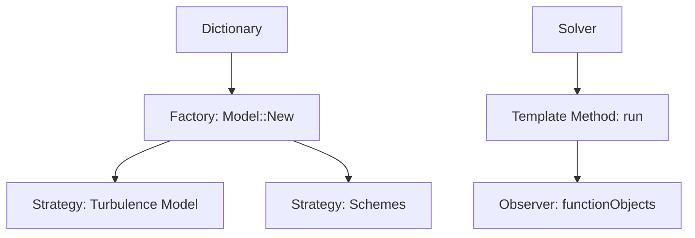

# Pattern Synergy

การใช้ Design Patterns ร่วมกัน

---

## Overview

> Patterns work **together** for flexible, maintainable systems

---

## 1. Factory + Strategy

```cpp
// Factory creates Strategy objects
autoPtr<scheme> div = schemeFactory::New("upwind");
autoPtr<scheme> laplacian = schemeFactory::New("Gauss linear");

// Use strategies
tmp<volVectorField> convection = div->fvmDiv(phi, U);
```

---

## 2. Template Method + Strategy

```cpp
class solver
{
    autoPtr<turbulenceModel> turbulence_;

public:
    void run()
    {
        while (runTime.loop())  // Template method
        {
            solve();
            turbulence_->correct();  // Strategy
        }
    }
};
```

---

## 3. Factory + Observer

```cpp
// Factories create function objects
functions
{
    average { type fieldAverage; ... }
    probe { type probes; ... }
}

// They observe solver execution
runTime.functionObjects().execute();
```

---

## 4. OpenFOAM Architecture



---

## 5. Benefits

| Combination | Benefit |
|-------------|---------|
| Factory + Strategy | Runtime algorithm selection |
| Template + Strategy | Fixed structure, variable parts |
| Factory + Observer | Pluggable monitors |

---

## 6. Example: Complete Solver

```cpp
// main()
autoPtr<turbulenceModel> turb = turbulenceModel::New(dict);  // Factory
autoPtr<solver> solver = solver::New(mesh);  // Factory

while (runTime.loop())
{
    solver->solve();           // Template method
    turb->correct();           // Strategy
    runTime.functionObjects().execute();  // Observer
}
```

---

## Quick Reference

| Pattern Pair | Use |
|--------------|-----|
| Factory + Strategy | Select algorithms |
| Template + Strategy | Skeleton + plugins |
| Singleton + Factory | Global registries |

---

## 🧠 Concept Check

<details>
<summary><b>1. ทำไม Factory + Strategy ทำงานด้วยกันได้ดี?</b></summary>

**Factory creates strategies** — runtime selection of algorithms
</details>

<details>
<summary><b>2. Template Method ช่วยอะไร?</b></summary>

**Fixed algorithm structure**, override specific steps
</details>

<details>
<summary><b>3. functionObjects = Observer pattern?</b></summary>

**ใช่** — registered objects observe and react to events
</details>

---

## 📖 เอกสารที่เกี่ยวข้อง

- **ภาพรวม:** [00_Overview.md](00_Overview.md)
- **Performance:** [05_Performance_Analysis.md](05_Performance_Analysis.md)