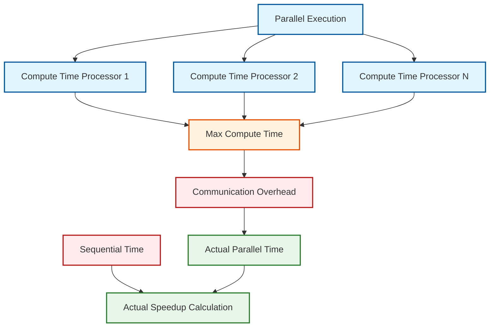

# 05 Performance Analysis

Performance considerations of design patterns in OpenFOAM

---

## 🎯 Learning Objectives

After completing this section, you will be able to:
- **Analyze** the computational overhead of virtual functions and design patterns
- **Evaluate** memory usage implications of pattern-based implementations
- **Compare** compile-time vs runtime performance trade-offs
- **Optimize** field operations and solver performance in OpenFOAM
- **Profile** OpenFOAM applications to identify bottlenecks

---

## 📋 Prerequisites

Before studying this section, you should have:
- **Understanding** of virtual functions and polymorphism ([02_Inheritance_Polymorphism](../02_INHERITANCE_POLYMORPHM/00_Overview.md))
- **Knowledge** of Run-Time Selection system ([02_Factory_Pattern.md](02_Factory_Pattern.md))
- **Familiarity** with OpenFOAM solvers and linear algebra
- **Basic profiling** knowledge (gprof, perf, or similar tools)

---

## 📖 Overview (3W Framework)

### WHAT - Performance Analysis คืออะไร?

**Performance Analysis** คือการประเมินผลกระทบด้านประสิทธิภาพของ Design Patterns ที่ใช้ใน OpenFOAM โดยเฉพาะ:

- **Virtual Function Overhead** - ค่าใช้จ่ายจาก dynamic dispatch
- **Memory Management** - การใช้หน่วยความจำเพิ่มเติมจาก patterns
- **Compile-Time vs Runtime** - trade-offs ระหว่าง templates และ virtual functions
- **Parallel Performance** - ผลกระทบต่อ domain decomposition และ MPI communication

### WHY - ทำต้องวิเคราะห์ Performance?

ในงาน CFD ประสิทธิภาพเป็นปัจจัยสำคัญ:

- **Simulation Time** แยกความแตกต่างระหว่างการจำลองที่เสร็จภายในเวลาที่เป็นจริงกับการใช้เวลาหลายวัน
- **Resource Limits** - หน่วยความจำและเวลา CPU มีจำกัด
- **Scalability** - การจำลองขนาดใหญ่ต้องมีประสิทธิภาพที่ดี
- **Flexibility vs Performance** - ต้องหาความสมดุลระหว่างความยืดหยุ่นและประสิทธิภาพ

### HOW - วิเคราะห์อย่างไร?

1. **Benchmarking** - วัดเวลาของ operations ที่สำคัญ
2. **Profiling** - ใช้เครื่องมือระบุ bottlenecks
3. **Code Analysis** - เข้าใจ overhead ของแต่ละ pattern
4. **Optimization** - ปรับปรุงจุดที่ช้าที่สุด

---

## 📚 Main Content

### 1. Virtual Function Overhead in CFD Context

> [!NOTE] **📂 OpenFOAM Context: Runtime Type Selection (RTS)**
> **Virtual Functions** เป็นหัวใจของ **Run-Time Selection System** ใน OpenFOAM:
> - **Run-Time Selection**: ถูกใช้ใน `src/OpenFOAM/db/RunTimeSelection/` เพื่อเลือก turbulence models, boundary conditions, และ discretization schemes ขณะ runtime
> - **TypeInfo Macros**: ใช้ `TypeName` และ `New` เพื่อลงทะเบียน classes กับ RTSTable
> - **Virtual Table Pointer (vptr)**: เพิ่มขนาด object ประมาณ 8 bytes บน 64-bit systems
> - **ใช้ใน**: ทุก derived classes ของ `fvPatchField`, `turbulenceModel`, `RASModel`, `LESModel`

#### 1.1 Benchmark Analysis

| Operation | Time | Relative Cost |
|-----------|------|---------------|
| Field operation (`U + V`) | ~1000 ns | 100% |
| Virtual function call | ~2 ns | 0.2% |
| Memory allocation | ~100-500 ns | 10-50% |

**สรุป**: Virtual function overhead ≈ **0.2%** เมื่อเทียบกับ field operations

#### 1.2 Why This Overhead is Acceptable

ใน CFD simulations เวลาส่วนใหญ่ (99%+) ถูกใช้ไปกับ:
- **Field Operations** - การคำนวณบน meshes ขนาดใหญ่
- **Linear Solvers** - การแก้สมการเชิงเส้นที่ซับซ้อน
- **Matrix Assembly** - การประกอบเมทริกซ์จาก discretization

ดังนั้น overhead ของ virtual calls จึงมีนัยสำคัญน้อยมากเมื่อเทียบกับประโยชน์ที่ได้รับจากความยืดหยุ่น

---

### 2. Memory Overhead Analysis

> [!NOTE] **📂 OpenFOAM Context: Memory Management in Field Classes**
> **Memory Overhead** จาก Design Patterns มีนัยสำคัญเมื่อเปรียบเทียบกับ Field Storage:
> - **GeometricField Storage**: `volScalarField` (1M cells) ≈ 8 MB, `volVectorField` ≈ 24 MB
> - **Smart Pointers**: `autoPtr`, `refPtr` เพิ่ม overhead 8 bytes ต่อ pointer
> - **Temporary Fields**: `tmp<Field>` ช่วยลด memory allocation ผ่าน reference counting

**Typical Memory Distribution:**

```
Field Data (1M cells)  ████████████████████ 80-1200 MB
Pattern Overhead       ▌ 100-200 KB
Smart Pointers         ▌ ~1 KB per object
```

**สรุป**: Pattern overhead น้อยมากเมื่อเทียบกับ field storage (99.9%+ ของ memory ถูกใช้โดย field data)

#### 2.1 Memory Breakdown

| Component | Memory per Object | Typical Count | Total Overhead |
|-----------|-------------------|---------------|----------------|
| **Field Data** (1M cells) | 8-24 MB | 10-50 fields | 80-1200 MB |
| **Strategy Objects** | ~64 bytes | 10-20 | ~1-2 KB |
| **Factory Registration** | ~100 bytes | ~1000 types | ~100 KB |
| **vptr per object** | 8 bytes | varies | minimal |

**สรุป**: Pattern overhead น้อยมากเมื่อเทียบกับ field storage

#### 2.2 Smart Pointer Overhead

OpenFOAM ใช้ smart pointers เพื่อ manage memory:

```cpp
// autoPtr: Single ownership, 8 bytes overhead
autoPtr<turbulenceModel> turb = turbulenceModel::New(dict);

// refPtr: Reference counted, 16 bytes overhead (ptr + count)
refPtr<volScalarField> pField;

// tmp: Temporary fields with reference counting
tmp<volScalarField> tResult = U + V;
```

---

### 3. Compile-Time vs Runtime Performance

> [!NOTE] **📂 OpenFOAM Context: Template Metaprogramming & Compile-Time Polymorphism**
> **Templates vs Virtual Functions** เป็น trade-off ระหว่าง compile-time และ runtime performance:
> - **Template Instantiation**: ถูกใช้ใน `GeometricField`, `fvMatrix`, `lduMatrix` สำหรับ type-safe polymorphism
> - **Expression Templates**: ช่วยลด temporary objects ใน field operations เช่น `U + V`
> - **Compile-Time Optimization**: Compiler สามารถ inline, unroll, และ vectorize code ได้ดีขึ้น

#### 3.1 Trade-off Comparison

| Aspect | Templates | Virtual Functions |
|--------|-----------|-------------------|
| **Runtime Overhead** | None (static dispatch) | ~2 ns per call |
| **Compile Time** | Slow (code bloat) | Fast |
| **Binary Size** | Large (2-5 MB) | Small |
| **Flexibility** | Compile-time only | Runtime selection |
| **Code Bloat** | High (per instantiation) | Low |

#### 3.2 OpenFOAM's Hybrid Approach

OpenFOAM ใช้ทั้งสองแนวทาง:

```cpp
// Templates: Type-safe, no overhead (GeometricField)
GeometricField<scalar, fvPatchField, volMesh> p;

// Virtual functions: Runtime flexibility (turbulenceModel)
autoPtr<turbulenceModel> turb = turbulenceModel::New(dict);
```

#### 3.3 Expression Templates

```cpp
// Lazy evaluation - no temporary created
tmp<volScalarField> result = U + V;  // Expression template

// Computed only when assigned
volScalarField final = result();  // Actual computation here
```

---

### 4. Parallel Performance Considerations

> [!NOTE] **📂 OpenFOAM Context: Parallel Processing & Domain Decomposition**
> **Parallel Performance** ถูกควบคุมโดยการแบ่งโดเมนและการสื่อสารระหว่างโปรเซสเซอร์:
> - **Domain Decomposition**: ถูกกำหนดใน `system/decomposeParDict` ด้วย method เช่น `scotch`, `metis`, `simple`
> - **Communication Overhead**: เกิดจาก processor boundaries ใน mesh และ MPI communication
> - **Load Balancing**: ขึ้นอยู่กับ quality ของ decomposition และ mesh refinement

#### 4.1 Speedup Analysis



#### 4.2 Parallel Overhead Breakdown

| Source | Overhead | Impact |
|--------|----------|--------|
| **MPI Communication** | ~50-100 μs/message | 1-10 ms/timestep |
| **Load Imbalance** | varies | Can be severe |
| **Memory Bandwidth** | ~50-100 GB/s limit | Bottleneck for large cases |

#### 4.3 Actual Speedup Formula

```
Speedup_actual = T_sequential / (max(T_i) + T_communication)
```

Where:
- `T_sequential` = Sequential execution time
- `T_i` = Compute time on processor i
- `T_communication` = Communication overhead

---

### 5. Solver Performance Optimization

> [!NOTE] **📂 OpenFOAM Context: Linear Solvers in fvSolution**
> **Solver Performance** ถูกควบคุมโดย settings ใน `system/fvSolution`:
> - **Linear Solvers**: ถูกกำหนดใน `solvers` หรือ `solver` sub-dictionary ของ `fvSolution`
> - **Solver Types**: `GAMG` (Algebraic Multigrid), `PCG` (Conjugate Gradient), `smoothSolver`
> - **Preconditioners**: `DIC` (Diagonal Incomplete Cholesky), `DILU`, `GAMG` สำหรับเร่ง convergence

#### 5.1 Linear Solver Performance

| Solver Type | Complexity | Memory | Best For | Iterations |
|-------------|------------|--------|----------|------------|
| **Diagonal** | O(n) | Low | Diagonally dominant | 1 |
| **PCG** | O(n√n) | Medium | SPD matrices | 50-200 |
| **GAMG** | O(n log n) | High | Large problems | 10-50 |
| **SmoothSolver** | O(n²) | Low-Medium | Small-medium | 100-500 |

#### 5.2 Preconditioner Impact

| Preconditioner | Iterations | Speedup vs None |
|----------------|------------|-----------------|
| None | 100-1000 | 1x |
| Diagonal | 50-200 | 2-5x |
| DIC/DILU | 20-100 | 5-10x |
| GAMG | 10-50 | 10-20x |

#### 5.3 SolverPerformance Structure

```cpp
// Structure to track solver performance metrics
struct SolverPerformance {
    scalar finalResidual_;      // Final residual after solving
    scalar initialResidual_;    // Initial residual before solving
    int nIterations_;           // Number of iterations performed
    bool converged_;            // Whether solver converged
    scalar convergenceTolerance_; // Target tolerance for convergence
};
```

---

### 6. Field Operations Optimization

> [!NOTE] **📂 OpenFOAM Context: Field Operations & Memory Layout**
> **Field Operations Performance** ขึ้นอยู่กับ memory layout และ compiler optimizations:
> - **forAll Macro**: ถูกกำหนดใน `src/OpenFOAM/macros/macros.H` สำหรับ iterate ผ่าน fields
> - **Memory Layout**: Fields ใช้ **row-major order** สำหรับ cache-friendly access patterns
> - **SIMD Vectorization**: Compiler สามารถ vectorize operations บน contiguous memory

#### 6.1 Memory Access Patterns

| Pattern | Description | Benefit |
|---------|-------------|---------|
| **Temporal Locality** | Reuse data recently accessed | Cache hits |
| **Spatial Locality** | Access contiguous memory | Prefetching |
| **Row-Major Order** | Sequential cell storage | SIMD friendly |

#### 6.2 Loop Optimization

```cpp
// forAll macro - enables auto-vectorization
forAll(U, i) {
    U[i] = U[i] + V[i];  // Auto-vectorized by compiler
}

// Compiler can use SIMD instructions
// Processes 4-8 elements simultaneously
```

#### 6.3 Cache Optimization Techniques

- **Aligned Allocation** - Memory aligned to cache line boundaries (64 bytes)
- **Block-Based Operations** - Process data in cache-friendly chunks
- **Memory Prefetching** - Reduce cache misses in large operations

---

### 7. Profiling and Bottleneck Identification

> [!NOTE] **📂 OpenFOAM Context: Profiling Tools & Performance Monitoring**
> **Profiling OpenFOAM Applications** ช่วยระบุ bottlenecks ใน solvers และ utilities:
> - **functionObjects**: ใช้ `solverPerformance`, `cpuTime`, `execParFunction` ใน `system/controlDict` สำหรับ runtime profiling
> - **Profiling Tools**: `gprof`, `perf`, `valgrind`, `Intel VTune` สำหรับ detailed analysis

#### 7.1 Typical CFD Bottlenecks

| Bottleneck | % Runtime | Location |
|------------|-----------|----------|
| **Linear Solver** | 40-60% | `fvMatrix::solve()` |
| **Matrix Assembly** | 15-25% | `fvm::div()`, `fvm::laplacian()` |
| **BC Updates** | 5-15% | `fvPatchField::updateCoeffs()` |
| **File I/O** | 5-10% | `Time::write()` |
| **Design Patterns** | <1% | Virtual calls, RTS |

#### 7.2 Profiling Tools

| Tool | Use Case | Output |
|------|----------|--------|
| **gprof** | Function call analysis | Call graph, times |
| **perf** | Hardware counters | Cache misses, cycles |
| **valgrind/cachegrind** | Memory analysis | Cache simulation |
| **Intel VTune** | Advanced optimization | Hotspots, vectorization |

#### 7.3 Optimization Strategies

```
1. Algorithm Selection
   → Choose appropriate solver/preconditioner
   → Use GAMG for large problems

2. Data Structure Optimization
   → Improve memory layout
   → Use cache-friendly access patterns

3. Compiler Optimization
   → Enable -O3 -march=native
   → Profile-guided optimization (PGO)

4. Parallel Scaling
   → Better domain decomposition
   → Reduce communication overhead
```

---

## ✅ Key Takeaways

### Core Performance Insights

1. **Virtual Function Overhead น้อยมาก** (~0.2%)
   - Field operations dominate execution time
   - Flexibility benefits outweigh performance cost
   - Don't avoid patterns for performance reasons

2. **Memory Overhead ไม่ใช่ปัญหา**
   - Pattern overhead: ~100 KB
   - Field storage: ~100 MB - 1 GB
   - Smart pointers add minimal overhead

3. **Templates vs Virtual Functions**
   - Templates: Zero runtime cost, compile-time flexibility
   - Virtual functions: Runtime flexibility, minimal overhead
   - OpenFOAM uses both appropriately

4. **Parallel Performance**
   - Communication overhead is the main limitation
   - Load balancing is critical
   - Memory bandwidth becomes bottleneck at scale

5. **Profiling คือ Key**
   - 40-60% time in linear solvers
   - Profile before optimizing
   - Focus on actual bottlenecks

### Performance Guidelines

| Situation | Recommendation |
|-----------|----------------|
| Choosing patterns | Use patterns freely - overhead is minimal |
| Solver selection | Profile first, then optimize solvers |
| Memory concerns | Focus on field storage, not pattern overhead |
| Parallel runs | Optimize decomposition and communication |
| Hot code paths | Use templates for zero-cost abstractions |

---

## 📋 Quick Reference

### Performance Comparison

| Pattern | Runtime Overhead | Memory Overhead | Flexibility |
|---------|------------------|-----------------|-------------|
| **Factory + RTS** | ~0.2% | ~100 KB | ⭐⭐⭐⭐⭐ |
| **Strategy** | ~0.2% | ~1-2 KB | ⭐⭐⭐⭐⭐ |
| **Template** | 0% | 2-5 MB binary | ⭐⭐⭐ |
| **Observer** | ~0.1% | ~100 bytes/object | ⭐⭐⭐⭐ |

### Common Bottlenecks

```
Linear Solvers    ████████████ 40-60%
Matrix Assembly   ██████ 15-25%
BC Updates        ███ 5-15%
File I/O          ██ 5-10%
Patterns          ▌ <1%
```

---

## 🧠 Concept Check

<details>
<summary><b>1. ทำไม Virtual Function Overhead ประมาณ 0.2% ถึงถือว่า "ยอมรับได้" ในงาน CFD?</b></summary>

**คำตอบ:** เพราะในงาน CFD เวลาส่วนใหญ่ (99%+) ถูกใช้ไปกับการคำนวณตัวเลขใน **Field Operations** (เช่น บวก ลบ คูณ หาร Matrix ขนาดใหญ่) และการแก้สมการ Linear Solver ซึ่งมีการวนลูปมหาศาล ดังนั้น Overhead เล็กน้อยจากการเรียกฟังก์ชัน (Dispatch) จึงแทบไม่มีผลกระทบต่อเวลาโดยรวม เมื่อเทียบกับความยืดหยุ่นที่ได้มา

</details>

<details>
<summary><b>2. Speedup จริงในการคำนวณแบบขนาน (Parallel Computing) มักจะน้อยกว่า Speedup ในอุดมคติเสมอ เพราะเหตุใด?</b></summary>

**คำตอบ:** เพราะมี **Communication Overhead** ซึ่งเป็นเวลาที่เสียไปในการส่งข้อมูลระหว่าง Processor และปัญหา **Load Imbalance** ที่บาง Processor อาจทำงานเสร็จช้ากว่าเพื่อน ทำให้ Processor อื่นต้องรอ (Waiting Time)

</details>

<details>
<summary><b>3. เมื่อไหร่ควรใช้ Templates แทน Virtual Functions?</b></summary>

**คำตอบ:**
- **ใช้ Templates** เมื่อ: Type เป็นที่รู้จักตั้งแต่ compile-time, ต้องการ zero overhead, หรือทำงานกับ generic types
- **ใช้ Virtual Functions** เมื่อ: ต้องการ runtime flexibility, เลือก type จาก dictionary, หรือใช้กับ Run-Time Selection system

</details>

<details>
<summary><b>4. Bottleneck หลักใน OpenFOAM solvers คืออะไร?</b></summary>

**คำตอบ:** **Linear Solvers** (40-60% ของเวลาทำงาน) เป็น bottleneck หลัก รองลงมาคือ Matrix Assembly (15-25%) และ Boundary Condition Updates (5-15%) ส่วน Design Patterns มีผลน้อยมาก (<1%)

</details>

<details>
<summary><b>5. จะ optimize ประสิทธิภาพ OpenFOAM solver ได้อย่างไร?</b></summary>

**คำตอบ:**
1. **Profile ก่อน** - ใช้ gprof, perf หรือ Intel VTune เพื่อหา bottlenecks จริง
2. **Optimize Solvers** - เลือก solver และ preconditioner ที่เหมาะสม (GAMG สำหรับ large problems)
3. **Improve Decomposition** - ใช้ scotch/metis สำหรับ load balancing ที่ดี
4. **Compiler Flags** - ใช้ `-O3 -march=native` สำหรับ optimization
5. **ไม่ต้องกังวลเรื่อง Patterns** - Overhead น้อยมากเมื่อเทียบกับ operations หลัก

</details>

---

## 📖 Related Documents

### Within This Module
- **Pattern Fundamentals:** [01_Introduction.md](01_Introduction.md) — ทฤษฎีและการจำแนก patterns
- **Factory Pattern:** [02_Factory_Pattern.md](02_Factory_Pattern.md) — RTS mechanics และ implementation
- **Strategy Pattern:** [03_Strategy_Pattern.md](03_Strategy_Pattern.md) — Schemes และ runtime selection
- **Pattern Synergy:** [04_Pattern_Synergy.md](04_Pattern_Synergy.md) — การทำงานร่วมกันของ patterns
- **Practical Exercise:** [06_Practical_Exercise.md](06_Practical_Exercise.md) — ฝึกปฏิบัติการสร้าง Custom Model

### Related Modules
- **Module 5 - OpenFOAM Programming:** Virtual methods, polymorphism, memory management
- **Module 8 - Testing:** Performance testing and benchmarking

### External References
- **OpenFOAM Programmer's Guide** — Performance optimization chapter
- **OpenFOAM Source Code** — `$FOAM_SRC/finiteVolume/fvMatrices/solvers/`
- **Intel VTune Profiler** — Advanced profiling documentation