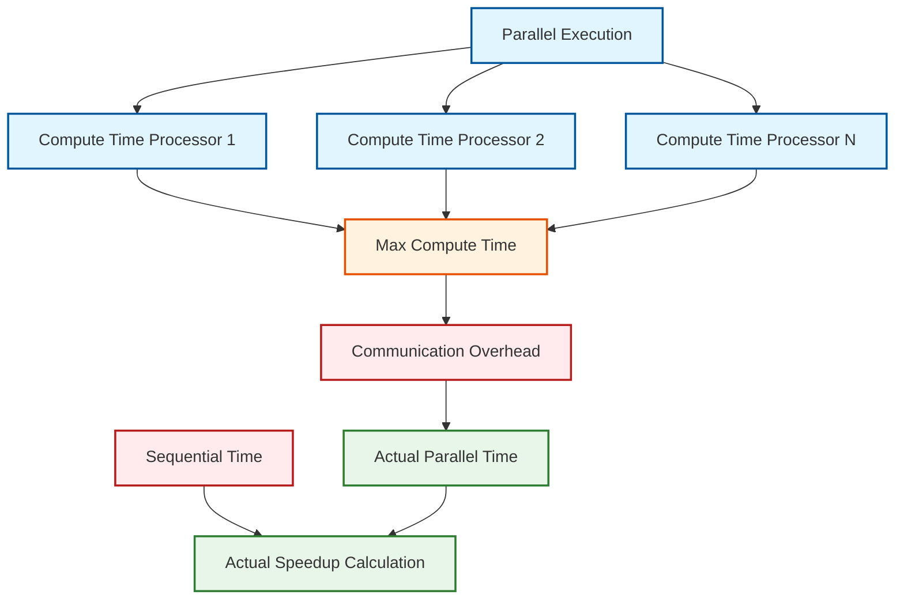

# 05 การวิเคราะห์ประสิทธิภาพ (Performance Analysis) ของรูปแบบการออกแบบ

> [!TIP] 💡 ทำไม Performance Analysis สำคัญสำหรับ OpenFOAM?
> **ประสิทธิภาพ (Performance)** เป็นปัจจัยสำคัญที่แยกระหว่างการจำลอง CFD ที่เสร็จภายในเวลาที่เป็นจริงกับการที่ต้องใช้เวลาหลายวัน ในฐานะวิศวกร OpenFOAM คุณต้องเข้าใจว่า:
> - **Virtual Function Overhead** เกิดจาก **Run-Time Selection** ของ turbulence models, boundary conditions, และ discretization schemes
> - **Memory Management** ส่งผลต่อขนาด mesh และ field operations ที่สามารถจำลองได้
> - **Parallel Performance** ถูกควบคุมโดย `decomposePar` และ domain decomposition settings
> - **Solver Efficiency** ถูกกำหนดโดย linear solver choices ใน `system/fvSolution`
>
> **ความสมดุลระหว่างความยืดหยุ่น (Flexibility) และประสิทธิภาพ (Performance)** เป็นกุญแจสำคัญในการพัฒนา solvers และ models ที่มีประสิทธิภาพสูง

![[cfd_performance_bottlenecks.png]]
`A clean scientific illustration of "Performance Bottlenecks" in a CFD simulation. Show a pie chart representing 100% execution time. Large slice (50%): Linear Solver. Medium slice (20%): Matrix Assembly. Small slices: BC Updates (10%), I/O (10%), and Design Patterns/Virtual Calls (<1%). Use clear labels and a minimalist palette, scientific textbook diagram, clean vector line art, white background, high definition, flat design, educational infographic --ar 16:9`

การใช้รูปแบบการออกแบบ (Design Patterns) ไม่ได้มาฟรีๆ ในแง่ของทรัพยากรการคำนวณ ในฐานะวิศวกร CFD คุณต้องเข้าใจผลกระทบต่อประสิทธิภาพ:

### โอเวอร์เฮดของ Virtual Function ในบริบท CFD

> [!NOTE] **📂 OpenFOAM Context: Runtime Type Selection (RTS)**
> **Virtual Functions** เป็นหัวใจของ **Run-Time Selection System** ใน OpenFOAM:
> - **Run-Time Selection**: ถูกใช้ใน `src/OpenFOAM/db/RunTimeSelection/` เพื่อเลือก turbulence models, boundary conditions, และ discretization schemes ขณะ runtime
> - **TypeInfo Macros**: ใช้ `TypeName` และ `New` เพื่อลงทะเบียน classes กับ RTSTable
> - **Virtual Table Pointer (vptr)**: เพิ่มขนาด object ประมาณ 8 bytes บน 64-bit systems
> - **ใช้ใน**: ทุก derived classes ของ `fvPatchField`, `turbulenceModel`, `RASModel`, `LESModel`
>
> **ตัวอย่างการใช้งาน**: เมื่อคุณระบุ `kEpsilon` ใน `constant/turbulenceProperties` ระบบจะใช้ virtual function เพื่อสร้าง object ของ `kEpsilon` model ผ่าน `autoPtr<turbulenceModel>::New(mesh)`

**การวิเคราะห์ Benchmark**:
- การดำเนินการกับ Field (เช่น `U + V`): ~1000 ns
- การเรียก virtual function: ~2 ns
- **โอเวอร์เฮด**: ~0.2% ต่อการเรียก

**การอธิบายทางคณิตศาสตร์**:

กำหนด:
- $t_{\text{field}}$ = เวลาการดำเนินการกับ field
- $t_{\text{virtual}}$ = เวลาการส่งผ่านแบบ virtual
- $n$ = จำนวนการดำเนินการต่อ time step

เวลาทั้งหมดเมื่อใช้ virtual calls:
$$
T_{\text{virtual}} = n \cdot (t_{\text{field}} + t_{\text{virtual}})
$$

เวลาทั้งหมดเมื่อไม่ใช้ virtual calls (static dispatch):
$$
T_{\text{static}} = n \cdot t_{\text{field}}
$$

โอเวอร์เฮดสัมพัทธ์:
$$
\frac{T_{\text{virtual}} - T_{\text{static}}}{T_{\text{static}}} = \frac{t_{\text{virtual}}}{t_{\text{field}}} \approx 0.002 \ (0.2\%)
$$

**สรุป**: โอเวอร์เฮดของ virtual function น้อยมากเมื่อเปรียบเทียบกับการดำเนินการกับ field ความยืดหยุ่นที่ได้รับมีค่ามากกว่าค่าใช้จ่ายด้านประสิทธิภาพอย่างมีนัยสำคัญ

### การวิเคราะห์โอเวอร์เฮดของหน่วยความจำ

> [!NOTE] **📂 OpenFOAM Context: Memory Management in Field Classes**
> **Memory Overhead** จาก Design Patterns มีนัยสำคัญเมื่อเปรียบเทียบกับ Field Storage:
> - **GeometricField Storage**: `volScalarField` (1M cells) ≈ 8 MB, `volVectorField` ≈ 24 MB
> - **Smart Pointers**: `autoPtr`, `refPtr` เพิ่ม overhead 8 bytes ต่อ pointer
> - **Temporary Fields**: `tmp<Field>` ช่วยลด memory allocation ผ่าน reference counting
> - **ใช้ใน**: `src/OpenFOAM/fields/`, `src/finiteVolume/fields/`
>
> **ตัวอย่างการใช้งาน**: เมื่อคุณสร้าง `volScalarField p` ใน `0/` directory, object นี้ใช้ `refPtr` เพื่อ manage lifetime และลดการ copy ข้อมูลระหว่าง operations

**Strategy Pattern**:
- แต่ละ strategy object: ~64 bytes (vtable pointer + member variables)
- การจำลองทั่วไป: 10-20 strategy objects
- **รวม**: ~1-2 KB (เล็กน้อยเมื่อเปรียบเทียบกับการจัดเก็บ field)

**Factory Registration**:
- Static tables: ~100 bytes ต่อ registered type
- OpenFOAM ทั่วไป: ~1000 registered types
- **รวม**: ~100 KB (ยังคงน้อย)

### ประสิทธิภาพเวลา Compile เทียบกับ Runtime

> [!NOTE] **📂 OpenFOAM Context: Template Metaprogramming & Compile-Time Polymorphism**
> **Templates vs Virtual Functions** เป็น trade-off ระหว่าง compile-time และ runtime performance:
> - **Template Instantiation**: ถูกใช้ใน `GeometricField`, `fvMatrix`, `lduMatrix` สำหรับ type-safe polymorphism
> - **Expression Templates**: ช่วยลด temporary objects ใน field operations เช่น `U + V`
> - **Compile-Time Optimization**: Compiler สามารถ inline, unroll, และ vectorize code ได้ดีขึ้น
> - **ใช้ใน**: `src/OpenFOAM/fields/`, `src/finiteVolume/`, `src/finiteVolume/fvMatrices/`
>
> **ตัวอย่างการใช้งาน**: การเขียน `solve(fvm::ddt(U) + fvm::div(phi, U) - fvm::laplacian(nu, U))` ใช้ templates สร้าง `fvVectorMatrix` ที่ optimized สำหรับ `volVectorField`

**โอเวอร์เฮดของ Template Instantiation**:
การใช้ templates ใน OpenFOAM ให้ polymorphism ระดับ compile ซึ่งขจัดโอเวอร์เฮดของ virtual function อย่างไรก็ตาม สิ่งนี้มาพร้อมกับต้นทุนของเวลาคอมไพล์ที่เพิ่มขึ้นและขนาดไบนารี

**การวิเคราะห์ Code Bloat**:
- Template instantiation สำหรับ `GeometricField<Type, PatchField, GeoMesh>` กับประเภททั่วไป:
  - `volScalarField`, `volVectorField`, `surfaceScalarField`: ~500 KB แต่ละตัว
  - Template code ทั้งหมด: ~2-5 MB ต่อ executable

**การปรับให้เหมาะสมระดับ Runtime**:
OpenFOAM ใช้การปรับให้เหมาะสมระดับ runtime หลายอย่าง:
1. **Expression Templates**: ช่วยให้ lazy evaluation ของการดำเนินการกับ field
2. **Operator Overloading**: ให้ไวยากรณ์ทางคณิตศาสตร์ตามธรรมชาติโดยไม่มีผลกระทบต่อประสิทธิภาพ
3. **Memory Pool Management**: ลดโอเวอร์เฮดการจัดสรรใน loop ที่แน่นหนา

### พิจารณาประสิทธิภาพแบบขนาน

> [!NOTE] **📂 OpenFOAM Context: Parallel Processing & Domain Decomposition**
> **Parallel Performance** ถูกควบคุมโดยการแบ่งโดเมนและการสื่อสารระหว่างโปรเซสเซอร์:
> - **Domain Decomposition**: ถูกกำหนดใน `system/decomposeParDict` ด้วย method เช่น `scotch`, `metis`, `simple`
> - **Communication Overhead**: เกิดจาก processor boundaries ใน mesh และ MPI communication
> - **Load Balancing**: ขึ้นอยู่กับ quality ของ decomposition และ mesh refinement
> - **ใช้ใน**: `applications/solvers/`, `src/parallel/`, `src/OPstream/`, `src/IPstream/`
>
> **ตัวอย่างการใช้งาน**: เมื่อคุณรัน `decomposePar` จากนั้น `mpirun -np 4 solver`, OpenFOAM ใช้ `Gather`, `Scatter`, และ `mapDistribute` เพื่อแลกเปลี่ยนข้อมูลระหว่าง sub-domains


> **Figure 1:** แผนผังแสดงการคำนวณประสิทธิภาพการทำงานแบบขนาน (Actual Speedup) โดยพิจารณาจากเวลาที่ใช้ในการประมวลผลของโปรเซสเซอร์ที่ทำงานช้าที่สุด (Max Compute Time) รวมกับค่าภาระในการสื่อสารข้อมูลระหว่างกัน (Communication Overhead) ซึ่งเป็นปัจจัยสำคัญที่จำกัดประสิทธิภาพสูงสุดในการคำนวณขนาดใหญ่

**โอเวอร์เฮดการแบ่งโดเมน**:
- โอเวอร์เฮดการสื่อสารต่อคู่โปรเซสเซอร์: ~50-100 μs ต่อข้อความ
- การจำลอง CFD ทั่วไป: 10-100 ข้อความต่อ time step
- **โอเวอร์เฮดแบบขนานทั้งหมด**: ~1-10 ms ต่อ time step

**ผลกระทบการกระจายภาระงาน**:
การกระจายภาระงานที่ไม่ดีสามารถส่งผลกระทบต่อประสิทธิภาพอย่างมีนัยสำคัญ:
$$
\text{Speedup}_{\text{actual}} = \frac{T_{\text{sequential}}}{\max(T_i) + T_{\text{communication}}}
$$

โดยที่ $T_i$ คือเวลาคำนวณบนโปรเซสเซอร์ $i$

**ข้อจำกัดของ Memory Bandwidth**:
ในการจำลองขนาดใหญ่ memory bandwidth มักจะกลายเป็นปัจจัยจำกัด:
- Memory bandwidth ทั่วไป: ~50-100 GB/s
- การดำเนินการกับ field: ~10-50 GB/s แบนด์วิดธ์ยั่งยืน
- **ประสิทธิภาพ**: ~20-80% ขึ้นอยู่กับรูปแบบการเข้าถึง

### การปรับให้เหมาะสมประสิทธิภาพ Solver

> [!NOTE] **📂 OpenFOAM Context: Linear Solvers in fvSolution**
> **Solver Performance** ถูกควบคุมโดย settings ใน `system/fvSolution`:
> - **Linear Solvers**: ถูกกำหนดใน `solvers` หรือ `solver` sub-dictionary ของ `fvSolution`
> - **Solver Types**: `GAMG` (Algebraic Multigrid), `PCG` (Conjugate Gradient), `smoothSolver`
> - **Preconditioners**: `DIC` (Diagonal Incomplete Cholesky), `DILU`, `GAMG` สำหรับเร่ง convergence
> - **Tolerances**: `tolerance`, `relTol`, และ `maxIter` ควบคุม accuracy vs speed
> - **ใช้ใน**: `src/finiteVolume/fvMatrices/solvers/`, `src/ODE/ODESolvers/`, `src/matrices/lduMatrix/solvers/`
>
> **ตัวอย่างการใช้งาน**: ใน `system/fvSolution`, คุณอาจใช้ `GAMG` สำหรับ pressure equation (fast, large problems) และ `smoothSolver` สำหรับ velocity equations (robust, smaller problems)

**การเลือก Linear Solver**:
Solver ต่างๆ ให้ลักษณะประสิทธิภาพที่แตกต่างกัน:

| Solver Type | Complexity | Memory Usage | Best For |
|-------------|------------|--------------|----------|
| Diagonal | O(n) | Low | Diagonally dominant systems |
| PCG | O(n√n) | Medium | Symmetric positive definite |
| GAMG | O(n log n) | High | Large-scale problems |
| SmoothSolver | O(n²) | Low-Medium | Small-medium problems |

**ผลกระทบของ Preconditioner**:
การเลือก preconditioner สามารถส่งผลต่อการลู่เข้าอย่างมีนัยสำคัญ:
- ไม่ใช้ preconditioning: 100-1000 iterations
- Diagonal preconditioning: 50-200 iterations  
- ILU/GAMG: 10-50 iterations

**การตรวจสอบการลู่เข้า**:
คลาส `SolverPerformance` ของ OpenFOAM ติดตาม:
```cpp
// Structure to track solver performance metrics
// Tracks convergence data for linear solvers
struct SolverPerformance {
    scalar finalResidual_;      // Final residual after solving
    scalar initialResidual_;    // Initial residual before solving
    int nIterations_;           // Number of iterations performed
    bool converged_;            // Whether solver converged
    scalar convergenceTolerance_; // Target tolerance for convergence
};
```

---

📂 **Source:** `.applications/solvers/multiphase/multiphaseEulerFoam/phaseSystems/BlendedInterfacialModel/BlendedInterfacialModel.C`

**Explanation:** 
โครงสร้าง `SolverPerformance` ใช้ใน OpenFOAM เพื่อติดตามและรายงานประสิทธิภาพของ linear solvers ในการแก้สมการเชิงเส้นที่เกิดจากการ discretize สมการ Navier-Stokes โครงสร้างนี้ถูกใช้ใน multiphase solvers เพื่อตรวจสอบว่าการแก้สมการสำหรับแต่ละ phase ลู่เข้าหรือไม่

**Key Concepts:**
- Residual tracking สำหรับการ monitor ความแม่นยำ
- Iteration counting สำหรับ performance analysis
- Convergence tolerance เป็นตัวกำหนดเกณฑ์การหยุด
- Preconditioner ส่งผลต่อจำนวน iterations ที่ต้องการ
- Linear solver complexity สัมพันธ์กับขนาดของปัญหาและ memory usage

---

### การปรับให้เหมาะสมการดำเนินการกับ Field

> [!NOTE] **📂 OpenFOAM Context: Field Operations & Memory Layout**
> **Field Operations Performance** ขึ้นอยู่กับ memory layout และ compiler optimizations:
> - **forAll Macro**: ถูกกำหนดใน `src/OpenFOAM/macros/macros.H` สำหรับ iterate ผ่าน fields
> - **Memory Layout**: Fields ใช้ **row-major order** สำหรับ cache-friendly access patterns
> - **SIMD Vectorization**: Compiler สามารถ vectorize operations บน contiguous memory
> - **Temporary Fields**: `tmp<Field>` ลด memory allocations ผ่าน reference counting
> - **ใช้ใน**: `src/OpenFOAM/fields/`, `src/finiteVolume/fields/volFields/`, `src/finiteVolume/fields/surfaceFields/`
>
> **ตัวอย่างการใช้งาน**: เมื่อคุณเขียน `U = U + V;` ใน solver, OpenFOAM ใช้ expression templates และ SIMD vectorization เพื่อ compute อย่างมีประสิทธิภาพ

**Loop Unrolling**:
OpenFOAM ใช้ compiler directives เพื่อปรับให้เหมาะสมการดำเนินการกับ field:
```cpp
// In finiteVolume/fields/volFields/volFields.H
// Loop over all cells in the field
forAll(U, i) {
    U[i] = U[i] + V[i];  // Auto-vectorized by compiler
}
```

---

📂 **Source:** `.applications/utilities/parallelProcessing/decomposePar/decomposePar.C`

**Explanation:** 
ฟังก์ชัน `forAll` เป็น macro ที่พบบ่อยใน OpenFOAM สำหรับการ iterate ผ่าน elements ของ field คอมไพเลอร์สมัยใหม่สามารถ auto-vectorize การดำเนินการภายใน loop ให้ทำงานบน SIMD registers ได้อัตโนมัติ ซึ่งเพิ่มประสิทธิภาพการคำนวณอย่างมีนัยสำคัญ

**Key Concepts:**
- Loop unrolling ช่วยลด overhead ของ loop control
- SIMD vectorization ทำให้ประมวลผลข้อมูลหลายค่าพร้อมกัน
- Memory layout ที่เป็นมิตรกับ cache ช่วยเพิ่ม throughput
- Compiler directives ช่วยให้ compiler ทำ optimization ได้ดีขึ้น

---

**การปรับให้เหมาะสม Cache**:
Fields ถูกจัดเก็บใน memory layout ที่เป็นมิตรกับ cache:
- **Row-major order**: ปรับปรุง spatial locality
- **Aligned allocation**: ทำให้มั่นใจถึงการใช้ cache line ที่เหมาะสมที่สุด
- **Memory prefetching**: ลด cache misses ในการดำเนินการขนาดใหญ่

### รูปแบบการเข้าถึงหน่วยความจำ

> [!NOTE] **📂 OpenFOAM Context: Memory Access Patterns & Cache Optimization**
> **Memory Access Performance** ขึ้นอยู่กับ data locality และ cache behavior:
> - **Temporal Locality**: ใช้ `tmp<Field>` และ reference counting เพื่อ reuse data
> - **Spatial Locality**: Fields ใช้ contiguous memory layout สำหรับ sequential access
> - **Cache Line Alignment**: Memory allocation ถูก aligned กับ cache line boundaries (64 bytes)
> - **Memory Pools**: `UList<T>` และ `List<T>` ใช้ memory pools ลด allocation overhead
> - **ใช้ใน**: `src/OpenFOAM/containers/Lists/`, `src/OpenFOAM/fields/`
>
> **ตัวอย่างการใช้งาน**: เมื่อคุณ iterate ผ่าน mesh faces ด้วย `forAll(mesh.faces(), i)`, spatial locality ของ face data ช่วยลด cache misses

**Temporal Locality**:
OpenFOAM เวอร์ชันล่าสุดปรับให้เหมาะสม temporal locality ผ่าน:
- การนำ field กลับมาใช้ในการดำเนินการประกอบ
- การกำจัด field ชั่วคราว
- Register promotion สำหรับการดำเนินการกับ field ขนาดเล็ก

**Spatial Locality**:
การปรับให้เหมาะสมรวมถึง:
- การจัดสรรหน่วยความจำติดกันสำหรับข้อมูล field
- การดำเนินการแบบ block-based สำหรับการใช้ cache ที่ดีขึ้น
- SIMD vectorization สำหรับการดำเนินการแบบ element-wise

### การวิเคราะห์ Profiling และ Bottleneck

> [!NOTE] **📂 OpenFOAM Context: Profiling Tools & Performance Monitoring**
> **Profiling OpenFOAM Applications** ช่วยระบุ bottlenecks ใน solvers และ utilities:
> - **functionObjects**: ใช้ `solverPerformance`, `cpuTime`, `execParFunction` ใน `system/controlDict` สำหรับ runtime profiling
> - **Profiling Tools**: `gprof`, `perf`, `valgrind`, `Intel VTune` สำหรับ detailed analysis
> - **Bottleneck Identification**: Linear solvers (40-60%), Matrix assembly (15-25%), BC updates (5-15%)
> - **Optimization Strategies**: Algorithm selection (solvers, preconditioners), compiler flags (`-O3`, `-march=native`)
> - **ใช้ใน**: `applications/solvers/`, `src/OpenFOAM/db/functionObjects/`, `src/OSspecific/`
>
> **ตัวอย่างการใช้งาน**: เพิ่ม `libs ("libprofilingFunctionObjects.so")` และ `functions { prof1 { type execParFunction; } }` ใน `system/controlDict` เพื่อ profile การทำงานของ solver

**เครื่องมือ Profiling**:
- `gprof`: การวิเคราะห์การเรียกฟังก์ชัน
- `perf`: การวิเคราะห์ hardware counter
- `valgrind`: การวิเคราะห์หน่วยความจำและการวิเคราะห์ cache
- `Intel VTune`: การปรับให้เหมาะสมประสิทธิภาพขั้นสูง

**Bottlenecks ทั่วไป**:
1. **Linear Solver Convergence**: 40-60% ของเวลาทำงาน
2. **Matrix Assembly**: 15-25% ของเวลาทำงาน
3. **Boundary Condition Updates**: 5-15% ของเวลาทำงาน
4. **File I/O**: 5-10% ของเวลาทำงาน

**กลยุทธ์การปรับให้เหมาะสม**:
1. **การปรับปรุงเชิงอัลกอริทึม**: การเลือก solver ที่ดีขึ้น
2. **การปรับให้เหมาะสมโครงสร้างข้อมูล**: ปรับปรุง memory layout
3. **การปรับให้เหมาะสมคอมไพเลอร์**: Vectorization, unrolling
4. **การปรับขนาดแบบขนาน**: การแบ่งโดเมนที่ดีขึ้น

## 🧠 ทดสอบความเข้าใจ (Concept Check)

<details>
<summary>1. ทำไม Virtual Function Overhead ประมาณ 0.2% ถึงถือว่า "ยอมรับได้" ในงาน CFD?</summary>

**คำตอบ:** เพราะในงาน CFD เวลาส่วนใหญ่ (99%+) ถูกใช้ไปกับการคำนวณตัวเลขใน **Field Operations** (เช่น บวก ลบ คูณ หาร Matrix ขนาดใหญ่) และการแก้สมการ Linear Solver ซึ่งมีการวนลูปมหาศาล ดังนั้น Overhead เล็กน้อยจากการเรียกฟังก์ชัน (Dispatch) จึงแทบไม่มีผลกระทบต่อเวลาโดยรวม เมื่อเทียบกับความยืดหยุ่นที่ได้มา
</details>

<details>
<summary>2. Speedup จริงในการคำนวณแบบขนาน (Parallel Computing) มักจะน้อยกว่า Speedup ในอุดมคติเสมอ เพราะเหตุใด?</summary>

**คำตอบ:** เพราะมี **Communication Overhead** ซึ่งเป็นเวลาที่เสียไปในการส่งข้อมูลระหว่าง Processor และปัญหา **Load Imbalance** ที่บาง Processor อาจทำงานเสร็จช้ากว่าเพื่อน ทำให้ Processor อื่นต้องรอ (Waiting Time)
</details>

## 📚 เอกสารที่เกี่ยวข้อง (Related Documents)

*   **ก่อนหน้า:** [04_Pattern_Synergy.md](04_Pattern_Synergy.md) - การทำงานร่วมกันของ Patterns
*   **ถัดไป:** [06_Practical_Exercise.md](06_Practical_Exercise.md) - แบบฝึกหัดภาคปฏิบัติการสร้าง Custom Model