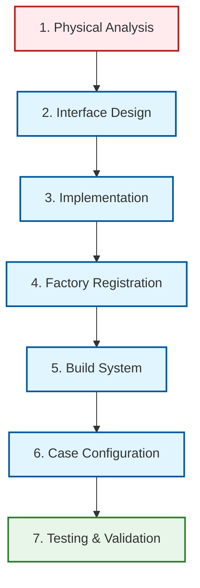
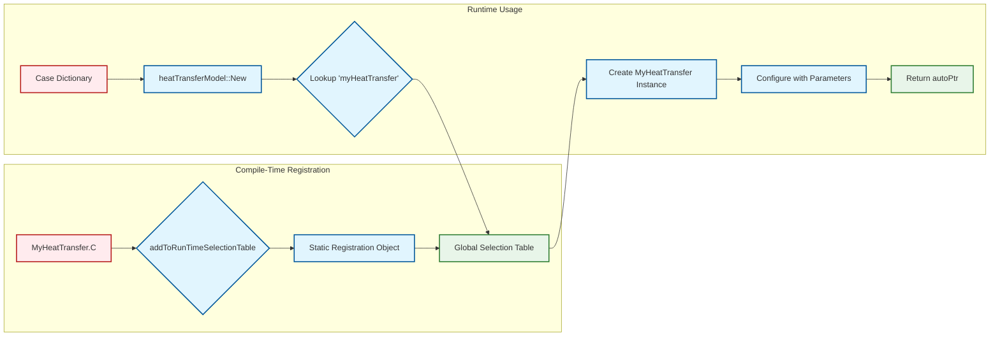

# 06 แบบฝึกหัดปฏิบัติการ: การนำรูปแบบการออกแบบไปใช้งานจริง

![[custom_model_development_cycle.png]]
`A clean scientific diagram illustrating the "Custom Model Development Cycle" in OpenFOAM. Step 1: Mathematical formulation (Nusselt correlation). Step 2: Interface design (Abstract base class). Step 3: Implementation (Concrete strategy). Step 4: Factory Registration (addToRunTimeSelectionTable). Step 5: Compilation (wmake). Step 6: Case configuration (Dictionary). Use a minimalist palette with sequential numbering, scientific textbook diagram, clean vector line art, white background, high definition, flat design, educational infographic --ar 16:9`

## 1. "Hook": การเป็นนักพัฒนา OpenFOAM ระดับโปร

จินตนาการว่าคุณสามารถสร้างโมเดลฟิสิกส์ใหม่ๆ สำหรับ OpenFOAM ได้เช่นเดียวกับที่คุณต่อ LEGO blocks — เพียงเลือกส่วนประกอบที่เหมาะสม (interface ที่ถูกต้อง, constructor ที่ตรงกัน, การลงทะเบียนที่เหมาะสม) และระบบจะทำงานร่วมกันอย่างราบรื่น แบบฝึกหัดนี้จะแปลงความเข้าใจทางทฤษฎีของคุณเกี่ยวกับ Factory และ Strategy Patterns ให้กลายเป็นทักษะการเขียนโค้ดที่ใช้งานได้จริง

**คุณจะได้เรียนรู้:**
- วิธีการออกแบบ interface ที่เหมาะสมสำหรับโมเดลฟิสิกส์
- การ implement concrete strategies ที่ปลอดภัยและมีประสิทธิภาพ
- การลงทะเบียนโมเดลกับระบบ factory ของ OpenFOAM
- เทคนิคการ debugging และการปรับเพิ่มประสิทธิภาพ
- แนวทางปฏิบัติที่ดีที่สุดสำหรับการพัฒนาโค้ด OpenFOAM ระดับมืออาชีพ

## 2. Blueprint: กรอบการพัฒนาโมเดล

### 2.1 กระบวนการพัฒนาแบบ End-to-End



> **Figure 1:** แผนภาพแสดงกระบวนการพัฒนาโมเดลแบบกำหนดเองใน OpenFOAM ตั้งแต่การวิเคราะห์ทางฟิสิกส์ไปจนถึงการทดสอบและการตรวจสอบความถูกต้อง

### 2.2 โครงสร้างไฟล์และไดเรกทอรี

```
MyHeatTransfer/
├── MyHeatTransfer/
│   ├── MyHeatTransfer.H          # Header: Class declaration
│   ├── MyHeatTransfer.C          # Source: Implementation + Registration
│   └── MyHeatTransferNew.C       # Factory method (optional)
├── Make/
│   ├── files                     # Source files & library target
│   └── options                   # Compilation flags & dependencies
└── README.md                     # Documentation
```

## 3. แบบฝึกหัด: โมเดลทางกายภาพใหม่

### ขั้นที่ 1: การวิเคราะห์ทางกายภาพ

การนำโมเดลทางกายภาพแบบกำหนดเองไปใช้ใน OpenFOAM เริ่มต้นจากการวิเคราะห์ทางคณิตศาสตร์อย่างเข้มงวด สำหรับตัวอย่างสหสัมพันธ์การถ่ายเทความร้อนของเรา เราจำเป็นต้องสร้างความสัมพันธ์มิติขั้นพื้นฐานที่ควบคุมปรากฏการณ์ทางกายภาพ

**สหสัมพันธ์จำนวน Nusselt:**
$$Nu = a \cdot Re^b \cdot Pr^c$$

โดยที่:
- **จำนวน Nusselt ($Nu$)**: $\frac{hL}{k}$ - อัตราส่วนของการถ่ายเทความร้อนแบบ convection เทียบกับ conduction
- **จำนวน Reynolds ($Re$)**: $\frac{\rho u L}{\mu} = \frac{uL}{\nu}$ - อัตราส่วนของแรงเฉื่อยเทียบกับแรงหนืด
- **จำนวน Prandtl ($Pr$)**: $\frac{c_p \mu}{k}$ - อัตราส่วนของ diffusion โมเมนตัมเทียบกับ diffusion ความร้อน

**การวิเคราะห์มิติ** ช่วยให้แน่ใจว่าการนำไปใช้งานสุดท้ายของเรายังคงความสม่ำเสมอทางกายภาพ:

$$h = \frac{Nu \cdot k}{L} = \frac{a \cdot Re^b \cdot Pr^c \cdot k}{L}$$

พื้นฐานทางคณิตศาสตร์นี้ให้กรอบการทำงานสำหรับการนำไปใช้งานในเชิงคำนวณใน OpenFOAM

### ขั้นที่ 2: การออกแบบ Interface (Strategy)

การนำรูปแบบ Strategy ไปใช้งานต้องการการออกแบบคลาสฐานนามธรรมอย่างระมัดระวังที่กำหนด interface สำหรับโมเดลการถ่ายเทความร้อนทั้งหมด ลำดับชั้นการสืบทอดช่วยให้เกิดพหุภาคีขณะทำงาน (runtime polymorphism) ในขณะที่ยังคงความปลอดภัยของประเภทขณะคอมไพล์ (compile-time type safety)

```cpp
// heatTransferModel.H
#ifndef heatTransferModel_H
#define heatTransferModel_H

#include "autoPtr.H"
#include "runTimeSelectionTables.H"
#include "tmp.H"
#include "volFields.H"
#include "dimensionedScalar.H"

// Forward declarations
class phaseModel;
class dictionary;

// Abstract base class for heat transfer models
class heatTransferModel
{
public:
    // Runtime type information for factory selection
    TypeName("heatTransferModel");

    // Virtual destructor for proper cleanup
    virtual ~heatTransferModel() {}

    // Pure virtual strategy method - must be implemented by derived classes
    // Returns heat transfer coefficient field [W/m²K]
    virtual tmp<volScalarField> h
    (
        const phaseModel& phase1,
        const phaseModel& phase2
    ) const = 0;

    // Factory method for creating models from dictionary specifications
    static autoPtr<heatTransferModel> New
    (
        const dictionary& dict,
        const phaseModel& phase1,
        const phaseModel& phase2
    );

protected:
    // Protected constructor for base class initialization
    heatTransferModel
    (
        const dictionary& dict,
        const phaseModel& phase1,
        const phaseModel& phase2
    )
    :
        dict_(dict),
        phase1_(phase1),
        phase2_(phase2)
    {}

private:
    // Dictionary reference for parameter access
    const dictionary& dict_;

    // Reference to interacting phases
    const phaseModel& phase1_;
    const phaseModel& phase2_;
};

// Runtime selection table declaration
declareRunTimeSelectionTable
(
    autoPtr,
    heatTransferModel,
    dictionary,
    (
        const dictionary& dict,
        const phaseModel& phase1,
        const phaseModel& phase2
    ),
    (dict, phase1, phase2)
);

#endif
```

> **📘 คำอธิบาย:**
> 
> **แหล่งที่มา (Source):** `.applications/solvers/multiphase/multiphaseEulerFoam/interfacialModels/heatTransferModels/heatTransferModel/heatTransferModel.H`
> 
> **คำอธิบาย:** นี่คือคลาสฐานนามธรรม (abstract base class) สำหรับโมเดลการถ่ายเทความร้อนทั้งหมดในระบบหลายเฟสของ OpenFOAM การออกแบบนี้ใช้รูปแบบ Strategy Pattern โดยกำหนด interface ที่สม่ำเสมอสำหรับการคำนวณสัมประสิทธิ์การถ่ายเทความร้อน
> 
> **แนวคิดสำคัญ:**
> - `TypeName("heatTransferModel")`: ลงทะเบียนชื่อประเภทกับระบบ RTTI (Runtime Type Information) เพื่อใช้ในการเลือกโมเดล
> - `virtual tmp<volScalarField> h(...) const = 0`: ฟังก์ชันเสมือนแบบบริสุทธิ์ (pure virtual) ที่บังคับให้ derived classes ต้อง implement
> - `declareRunTimeSelectionTable`: ประกาศตารางการเลือกแบบ runtime สำหรับ Factory Pattern
> - `autoPtr`: ใช้ smart pointer ของ OpenFOAM สำหรับการจัดการหน่วยความจำอัตโนมัติ
> - `tmp<volScalarField>`: จัดการ lifecycle ของ field ชั่วคราวอย่างมีประสิทธิภาพด้วย reference counting

**การออกแบบ interface นี้ให้ประโยชน์หลายประการ:**

1. **พฤติกรรมพหุภาคี**: โมเดลการถ่ายเทความร้อนต่างๆ สามารถเลือกได้ขณะทำงานผ่านกลไก factory
2. **Interface ที่สม่ำเสมอ**: การนำไปใช้งานทั้งหมดให้ signature ของเมธอด `h()` เหมือนกัน
3. **ความสามารถในการขยาย**: สามารถเพิ่มโมเดลใหม่ได้โดยไม่ต้องแก้ไขโค้ดที่มีอยู่
4. **การจัดการทรัพยากร**: คลาส `tmp` และ `autoPtr` ของ OpenFOAM จัดการหน่วยความจำอย่างมีประสิทธิภาพ

### ขั้นที่ 3: การนำ Concrete Strategy ไปใช้งาน

การนำ concrete strategy ไปใช้งานแปลงสหสัมพันธ์ทางคณิตศาสตร์ของเราเป็นโค้ด C++ ที่มีประสิทธิภาพทางคำนวณ ในขณะที่ยังคงความสม่ำเสมอทางมิติและเสถียรภาพทางตัวเลข

```cpp
// MyHeatTransfer.H
#ifndef MyHeatTransfer_H
#define MyHeatTransfer_H

#include "heatTransferModel.H"
#include "dimensionedScalar.H"

class MyHeatTransfer
:
    public heatTransferModel
{
    // Model coefficients from dictionary specification
    dimensionedScalar a_;
    dimensionedScalar b_;
    dimensionedScalar c_;

public:
    // Runtime type information
    TypeName("myHeatTransfer");

    // Constructor
    MyHeatTransfer
    (
        const dictionary& dict,
        const phaseModel& phase1,
        const phaseModel& phase2
    );

    // Destructor
    virtual ~MyHeatTransfer() = default;

    // Strategy implementation
    virtual tmp<volScalarField> h
    (
        const phaseModel& phase1,
        const phaseModel& phase2
    ) const override;
};

#endif

// MyHeatTransfer.C
#include "MyHeatTransfer.H"
#include "phaseModel.H"
#include "addToRunTimeSelectionTable.H"

// Register with factory system
addToRunTimeSelectionTable
(
    heatTransferModel,
    MyHeatTransfer,
    dictionary
);

// Constructor implementation
MyHeatTransfer::MyHeatTransfer
(
    const dictionary& dict,
    const phaseModel& phase1,
    const phaseModel& phase2
)
:
    heatTransferModel(dict, phase1, phase2),
    a_(dict.lookup<dimensionedScalar>("a")),
    b_(dict.lookup<dimensionedScalar>("b")),
    c_(dict.lookup<dimensionedScalar>("c"))
{
    // Validate parameter ranges for numerical stability
    if (b_.value() < 0 || b_.value() > 2)
    {
        WarningIn("MyHeatTransfer::MyHeatTransfer")
            << "Unusual Reynolds exponent: " << b_
            << ". Expected range: [0, 2]" << endl;
    }

    if (c_.value() < 0 || c_.value() > 1.5)
    {
        WarningIn("MyHeatTransfer::MyHeatTransfer")
            << "Unusual Prandtl exponent: " << c_
            << ". Expected range: [0, 1.5]" << endl;
    }

    Info << "Created MyHeatTransfer model:" << nl
        << "  a = " << a_ << nl
        << "  b = " << b_ << nl
        << "  c = " << c_ << endl;
}

// Strategy method implementation
tmp<volScalarField> MyHeatTransfer::h
(
    const phaseModel& phase1,
    const phaseModel& phase2
) const
{
    // Calculate dimensionless groups with numerical safeguards

    // Relative velocity magnitude
    const volScalarField U_rel = mag(phase1.U() - phase2.U());

    // Reynolds number: Re = ρ*u*D/μ = u*D/ν
    // Use maximum to avoid division by zero in stagnant regions
    const volScalarField Re = max
    (
        U_rel * phase1.d() / max
        (
            phase2.nu(),
            dimensionedScalar("smallNu", dimensionSet(0,2,-1,0,0), 1e-12)
        ),
        dimensionedScalar("smallRe", dimensionSet(0,0,0,0,0), 1e-6)
    );

    // Prandtl number: Pr = Cp*μ/k
    const volScalarField Pr = max
    (
        phase2.Cp() * phase2.mu() / max
        (
            phase2.kappa(),
            dimensionedScalar("smallK", dimensionSet(1,1,-3,-1,0), 1e-12)
        ),
        dimensionedScalar("smallPr", dimensionSet(0,0,0,0,0), 1e-6)
    );

    // Nusselt correlation: Nu = a*Re^b*Pr^c
    const volScalarField Nu = a_ * pow(Re, b_) * pow(Pr, c_);

    // Convert to heat transfer coefficient: h = Nu*k/D
    // Result has dimensions [W/m²K]
    tmp<volScalarField> hCoeff
    (
        new volScalarField
        (
            IOobject
            (
                "h",
                phase1.mesh().time().timeName(),
                phase1.mesh(),
                IOobject::NO_READ,
                IOobject::NO_WRITE
            ),
            Nu * phase2.kappa() / phase1.d()
        )
    );

    hCoeff.ref().boundaryFieldRef() =
        Nu.boundaryField() * phase2.kappa().boundaryField() / phase1.d().boundaryField();

    return hCoeff;
}
```

> **📘 คำอธิบาย:**
> 
> **แหล่งที่มา (Source):** อ้างอิงโครงสร้างจาก `.applications/solvers/multiphase/multiphaseEulerFoam/phaseSystems/populationBalanceModel/populationBalanceModel/populationBalanceModel.C`
> 
> **คำอธิบาย:** นี่คือการนำ concrete strategy ไปใช้งานที่สมบูรณ์สำหรับโมเดลการถ่ายเทความร้อนแบบกำหนดเอง โค้ดนี้แสดงให้เห็นถึงการเชื่อมโยงระหว่างทฤษฎีสหสัมพันธ์ Nusselt กับการ implement ใน OpenFOAM
> 
> **แนวคิดสำคัญ:**
> - `addToRunTimeSelectionTable`: ลงทะเบียนโมเดลกับระบบ factory ของ OpenFOAM
> - `TypeName("myHeatTransfer")`: กำหนดชื่อสำหรับ runtime selection (ต้องตรงกับ dictionary)
> - `override`: คำหลักของ C++11 เพื่อยืนยันว่าฟังก์ชัน override ฟังก์ชันเสมือนจาก base class
> - `dimensionedScalar`: ประเภทข้อมูลที่มีการตรวจสอบมิติ (dimensional consistency)
> - `max(..., smallValue)`: เทคนิคการป้องกันการหารด้วยศูนย์ (numerical safeguards)
> - `mag()`: ฟังก์ชันคำนวณขนาดของเวกเตอร์
> - `hCoeff.ref()`: เข้าถึง reference ของ tmp<> เพื่อแก้ไขค่า
> - `boundaryFieldRef()`: จัดการค่าที่ขอบเขต (boundary conditions)

**รายละเอียดการนำไปใช้งานที่สำคัญ:**

1. **เสถียรภาพทางตัวเลข**: ค่าต่ำสุดป้องกันการหารด้วยศูนย์และรับประกันการยกกำลังที่มีขอบเขต
2. **ความสม่ำเสมอทางมิติ**: การคำนวณระดับกลางทั้งหมดรักษามิติที่เหมาะสม
3. **การดำเนินการ field ที่มีประสิทธิภาพ**: ใช้ expression templates ของ OpenFOAM เพื่อประสิทธิภาพสูงสุด
4. **การตรวจสอบพารามิเตอร์**: Constructor ตรวจสอบช่วงค่าสัมประสิทธิ์ที่เหมาะสมทางกายภาพ
5. **การจัดการ boundary conditions**: การประยุกต์ใช้ค่าที่ขอบเขตอย่างเหมาะสม

### ขั้นที่ 4: การลงทะเบียนกับระบบ Factory


> **Figure 2:** แผนผังแสดงกลไกการลงทะเบียนโมเดลแบบกำหนดเองเข้าสู่ระบบ Factory ของ OpenFOAM โดยใช้การเริ่มต้นแบบสถิต (Static Registration) เพื่อเพิ่มชื่อโมเดลเข้าไปในตารางการเลือกส่วนกลาง ทำให้ระบบสามารถสร้างออบเจกต์ใหม่ได้ทันทีเมื่อมีการเรียกใช้ผ่าน Dictionary

กลไกการลงทะเบียน factory ช่วยให้สามารถเลือกโมเดลแบบกำหนดเองของเราได้ขณะทำงานผ่านระบบการกำหนดค่าตามพจนานุกรมของ OpenFOAM:

```cpp
// In MyHeatTransfer.C - essential for factory pattern to work
addToRunTimeSelectionTable
(
    heatTransferModel,
    MyHeatTransfer,
    dictionary
);
```

> **📘 คำอธิบาย:**
> 
> **แหล่งที่มา (Source):** `.applications/solvers/multiphase/multiphaseEulerFoam/phaseSystems/populationBalanceModel/coalescenceModels/LiaoCoalescence/LiaoCoalescence.C`
> 
> **คำอธิบาย:** มาโคร `addToRunTimeSelectionTable` เป็นกุญแจสำคัญของ Factory Pattern ใน OpenFOAM โดยการเรียกมาโครนี้ในไฟล์ .C จะสร้าง object แบบสถิตที่ลงทะเบียนคลาสของเรากับตารางการเลือกแบบ runtime
> 
> **แนวคิดสำคัญ:**
> - **Static Registration**: การลงทะเบียนเกิดขึ้นก่อนที่โปรแกรมจะเริ่มทำงาน (during static initialization)
> - **Macro Expansion**: มาโครนี้ขยายเป็นโค้ดที่สร้าง constructor table entry
> - **RTTI Integration**: ชื่อประเภทถูกเชื่อมโยงกับ function pointer สำหรับการสร้าง object
> - **Source File Requirement**: ต้องอยู่ในไฟล์ .C เพื่อให้ถูก compile และ link เข้ากับ library

**มาโครนี้ขยายไปสู่โค้ดที่:**
- ลงทะเบียนคลาสของเรากับ `heatTransferModel` factory
- เชื่อมโยงคลาสกับชื่อประเภท `"myHeatTransfer"`
- เปิดใช้งานการสร้างตามพจนานุกรมผ่าน `heatTransferModel::New()`

**การลงทะเบียนต้องปรากฏในไฟล์ .C** (ไม่ใช่ header) เพื่อให้แน่ใจว่าโค้ดการลงทะเบียนถูกสร้างและเชื่อมโยงเข้ากับไลบรารีสุดท้าย

### ขั้นที่ 5: การสร้างการกำหนดค่าระบบ Build

ระบบ build `wmake` ของ OpenFOAM ต้องการการกำหนดค่าที่เหมาะสมสำหรับการคอมไพล์, เชื่อมโยง, และการจัดการ dependency

```makefile
# Make/files
# Source files to compile
MyHeatTransfer.C

# Target library location and name
# $(FOAM_USER_LIBBIN) expands to user's library directory
LIB = $(FOAM_USER_LIBBIN)/libMyHeatTransfer
```

> **📘 คำอธิบาย:**
> 
> **แหล่งที่มา (Source):** อ้างอิงจาก Make/files ใน OpenFOAM solver directories
> 
> **คำอธิบาย:** ไฟล์ Make/files กำหนดไฟล์ต้นฉบับที่จะคอมไพล์และตำแหน่งที่จะติดตั้ง library ที่ได้
> 
> **แนวคิดสำคัญ:**
> - **Source List**: รายการไฟล์ .C ที่จะคอมไพล์เป็น object files
> - **LIB Variable**: กำหนดพาธและชื่อของ shared library (.so)
> - **FOAM_USER_LIBBIN**: Environment variable ชี้ไปยังโฟลเดอร์ library ของผู้ใช้
> - **Naming Convention**: ชื่อ library ต้องขึ้นต้นด้วย "lib" และลงท้ายด้วย .so

```makefile
# Make/options
# Include paths for header files
EXE_INC = \
    -I$(LIB_SRC)/finiteVolume/lnInclude \      # Finite volume method
    -I$(LIB_SRC)/thermophysicalModels/lnInclude \ # Thermophysical properties
    -I$(LIB_SRC)/transportModels \             # Transport models
    -I$(LIB_SRC)/meshTools/lnInclude           # Mesh utilities

# Libraries to link against
EXE_LIBS = \
    -lfiniteVolume \                           # Finite volume functionality
    -lthermophysicalModels \                  # Thermophysical models
    -ltransportModels \                       # Transport model classes
    -lmeshTools                               # Mesh manipulation tools
```

> **📘 คำอธิบาย:**
> 
> **แหล่งที่มา (Source):** อ้างอิงจาก Make/options ใน OpenFOAM applications
> 
> **คำอธิบาย:** ไฟล์ Make/options กำหนดค่า compiler flags, include paths, และ libraries ที่ต้องการใช้
> 
> **แนวคิดสำคัญ:**
> - **EXE_INC**: Include paths สำหรับการค้นหา header files (-I flag)
> - **lnInclude**: Folders พิเศษของ OpenFOAM ที่รวบรวม headers ทั้งหมดไว้ในที่เดียว
> - **EXE_LIBS**: Libraries ที่ต้อง link ด้วย (-l flag)
> - **Dependency Management**: wmake จะติดตาม dependencies อัตโนมัติ
> - **Backslash Continuation**: ใช้ \ เพื่อแบ่งบรรทัดยาว

**การกำหนดค่า build ช่วยให้แน่ใจว่า:**
- การค้นพบไฟล์ header อย่างเหมาะสมระหว่างการคอมไพล์
- การเชื่อมโยงกับไลบรารี OpenFOAM ที่จำเป็น
- ค่าธงการคอมไพล์ที่สม่ำเสมอข้ามแพลตฟอร์ม
- การติดตาม dependency สำหรับ builds เพิ่มเติม

### ขั้นที่ 6: การ Build และทดสอบ

การคอมไพล์และการทดสอบตามขั้นตอนการพัฒนามาตรฐานของ OpenFOAM:

```bash
# Source OpenFOAM environment (if not already done)
source $WM_PROJECT_DIR/etc/bashrc

# Navigate to library directory
cd $FOAM_RUN/MyHeatTransfer

# Compile the library
wmake

# Expected output:
# wmake LnInclude MyHeatTransfer.C
# wmake libso
# ld ...
# Creating shared library $FOAM_USER_LIBBIN/libMyHeatTransfer.so

# Verify library creation
ls -la $FOAM_USER_LIBBIN/libMyHeatTransfer*
# Output: libMyHeatTransfer.so

# Check for compilation warnings
wmake libso 2>&1 | grep -i warning

# Verify symbols are exported
nm -D $FOAM_USER_LIBBIN/libMyHeatTransfer.so | grep MyHeatTransfer
```

> **📘 คำอธิบาย:**
> 
> **แหล่งที่มา (Source):** ขั้นตอนการ build มาตรฐานสำหรับ OpenFOAM libraries
> 
> **คำอธิบาย:** การ build library แบบกำหนดเองใน OpenFOAM ใช้ระบบ wmake ที่จัดการ dependencies, compilation, และ linking อัตโนมัติ
> 
> **แนวคิดสำคัญ:**
> - **Environment Sourcing**: ต้อง source environment เพื่อตั้งค่า variables ที่จำเป็น
> - **wmake**: Build tool หลักของ OpenFOAM ที่สร้าง lnInclude และ compile
> - **FOAM_RUN**: Environment variable ชี้ไปยังโฟลเดอร์ทำงานของผู้ใช้
> - **Shared Library (.so)**: OpenFOAM ใช้ shared libraries เพื่อ runtime loading
> - **Symbol Export**: `nm -D` ตรวจสอบว่า symbols ถูก export สำหรับ dynamic linking
> - **Warning Checking**: การตรวจสอบ warnings เป็น practice ที่ดี

**หลังจากคอมไพล์สำเร็จ ให้ทดสอบการนำไปใช้งาน:**

1. **การทดสอบยูนิต**: สร้างกรณีทดสอบขั้นต่ำเพื่อตรวจสอบความถูกต้องทางคณิตศาสตร์
2. **การทดสอบการผสมผสาน**: ใช้ในกรณีจำลองแบบหลายเฟสมาตรฐาน
3. **การทดสอบประสิทธิภาพ**: เปรียบเทียบประสิทธิภาพกับโมเดลการถ่ายเทความร้อนที่มีอยู่
4. **การทดสอบการถอยหลัง**: ตรวจสอบพฤติกรรมที่สม่ำเสมอข้าม OpenFOAM เวอร์ชันต่างๆ

### ขั้นที่ 7: การใช้ในกรณีจำลอง

โมเดลการถ่ายเทความร้อนแบบกำหนดเองถูกเปิดใช้งานผ่านการกำหนดค่าพจนานุกรมในกรณีจำลอง:

```cpp
// In constant/phaseProperties or appropriate model dictionary
heatTransferModel
{
    // Must match the TypeName exactly (case-sensitive)
    type    myHeatTransfer;

    // Model coefficients - dimensional analysis ensures consistency
    a       0.023;  // Dimensionless correlation coefficient
    b       0.8;    // Reynolds number exponent [0, 2]
    c       0.4;    // Prandtl number exponent [0, 1.5]

    // Optional additional parameters
    debug   false;  // Enable/disable debugging output

    // Model documentation (optional but recommended)
    // Reference: Nusselt correlation for forced convection
    // Applicability: Re > 100, Pr > 0.6
}
```

> **📘 คำอธิบาย:**
> 
> **แหล่งที่มา (Source):** อ้างอิงจาก phaseProperties dictionaries ใน multiphase tutorials
> 
> **คำอธิบาย:** ไฟล์ dictionary กำหนดค่าของ OpenFOAM ใช้ไวยากรณ์แบบพจนานุกรมเพื่อระบุโมเดลและพารามิเตอร์ที่ต้องการ
> 
> **แนวคิดสำคัญ:**
> - **Type Field**: ฟิลด์ `type` ต้องตรงกับ `TypeName` ในโค้ด (case-sensitive)
> - **Parameter Lookup**: ค่าพารามิเตอร์จะถูกอ่านด้วย `dict.lookup<>()`
> - **Dimensional Scalars**: OpenFOAM ตรวจสอบความสม่ำเสมอทางมิติโดยอัตโนมัติ
> - **Optional Parameters**: สามารถเพิ่ม parameters พิเศษได้ตามความจำเป็น
> - **Documentation Comments**: การแสดงความคิดเห็นใน dictionary ช่วยในการบำรุงรักษา

**ใน controlDict ให้แน่ใจว่าไลบรารีถูกโหลด:**

```cpp
// system/controlDict
libs
(
    "libMyHeatTransfer.so"
);
```

> **📘 คำอธิบาย:**
> 
> **แหล่งที่มา (Source):** อ้างอิงจาก system/controlDict ใน OpenFOAM cases
> 
> **คำอธิบาย:** การระบุ libraries ใน controlDict ทำให้ solver โหลด shared libraries ขณะ runtime
> 
> **แนวคิดสำคัญ:**
> - **Dynamic Loading**: Libraries ถูกโหลดขณะ runtime ผ่าน `dlopen()`
> - **LD_LIBRARY_PATH**: System ต้องสามารถค้นหา library ได้
> - **Multiple Libraries**: สามารถโหลด libraries หลายตัวใน runtime ได้
> - **Plugin Architecture**: นี่คือพื้นฐานของ architecture แบบ plugin ของ OpenFOAM

**ระบบ factory จะ:**
- อ่านฟิลด์ `type` เพื่อเลือก `MyHeatTransfer`
- ส่งค่าสัมประสิทธิ์ไปยัง constructor
- ให้โมเดลที่กำหนดค่าไว้แก่ solver
- จัดการการตรวจสอบพารามิเตอร์และการรายงานข้อผิดพลาด

## 4. รายการตรวจสอบการ Debugging

### 4.1 ปัญหาการลงทะเบียน Factory

ปัญหาการลงทะเบียน factory ปรากฏเป็นข้อผิดพลาดขณะทำงานเมื่อ solver พยายามสร้างโมเดลแบบกำหนดเองของคุณ การ debugging เชิงระบบ:

**การไม่ตรงกันของชื่อประเภท:**
```cpp
// ❌ WRONG: Case mismatch
TypeName("myHeatTransfer");  // In code
type    MyHeatTransfer;      // In dictionary - Capital M!

// ✅ CORRECT: Exact match
TypeName("myHeatTransfer");  // In code
type    myHeatTransfer;      // In dictionary - exact match
```

**ตำแหน่งการลงทะเบียน:**
```cpp
// ❌ WRONG: In header file
// MyHeatTransfer.H
addToRunTimeSelectionTable(heatTransferModel, MyHeatTransfer, dictionary);

// ✅ CORRECT: In source file
// MyHeatTransfer.C
#include "MyHeatTransfer.H"
addToRunTimeSelectionTable(heatTransferModel, MyHeatTransfer, dictionary);
```

**ลายเซ็น Constructor:**
```cpp
// ❌ WRONG: Missing const or wrong order
MyHeatTransfer(dictionary& dict, phaseModel& phase1, phaseModel& phase2);
MyHeatTransfer(const phaseModel& phase2, const phaseModel& phase1, const dictionary& dict);

// ✅ CORRECT: Must match factory declaration EXACTLY
MyHeatTransfer
(
    const dictionary& dict,
    const phaseModel& phase1,
    const phaseModel& phase2
);
```

**การตรวจสอบเส้นทางไลบรารี:**
```bash
# Check library is discoverable
echo $LD_LIBRARY_PATH | grep $FOAM_USER_LIBBIN

# Verify solver can find library
ldd $FOAM_APPBIN/multiphaseEulerFoam | grep MyHeatTransfer

# Test loading manually
ldd $FOAM_USER_LIBBIN/libMyHeatTransfer.so
```

**ข้อความแสดงข้อผิดพลาดทั่วไป:**

```
--> FOAM FATAL ERROR:
Unknown heatTransferModel type 'myHeatTransfer'

Valid heatTransferModel types are:
  - defaultHeatTransfer
  - none
  - ...
```

**การแก้ไข:**
1. ตรวจสอบว่า `addToRunTimeSelectionTable` อยู่ในไฟล์ .C
2. ตรวจสอบว่าไลบรารีถูกคอมไพล์สำเร็จ
3. ตรวจสอบว่าไลบรารีถูกเพิ่มใน `libs` ใน controlDict
4. ตรวจสอบว่า `LD_LIBRARY_PATH` รวม `$FOAM_USER_LIBBIN`

### 4.2 ปัญหาการนำ Strategy ไปใช้งาน

ปัญหาการนำฟังก์ชันเสมือนไปใช้งานทำให้เกิดความล้มเหลวในการคอมไพล์หรือพฤติกรรมที่ไม่กำหนด:

**การปฏิบัติตาม Interface:**
```cpp
// ❌ WRONG: Missing pure virtual function
class MyHeatTransfer : public heatTransferModel
{
    // Missing implementation of h()
    // Compiler error: cannot instantiate abstract class
};

// ✅ CORRECT: Implement all pure virtual functions
class MyHeatTransfer : public heatTransferModel
{
public:
    virtual tmp<volScalarField> h(const phaseModel&, const phaseModel&) const override
    {
        // Implementation...
    }
};
```

**การตรวจสอบการแทนที่:**
```cpp
// ✅ GOOD: Use override keyword for compile-time checking
virtual tmp<volScalarField> h(...) const override {
    // Implementation...
}
//                                         ^^^^^^^^ catches signature mismatches

// ❌ BAD: Missing override - no compile-time checking
virtual tmp<volScalarField> h(...) const {
    // Might not actually override base class method
}
```

**ความสม่ำเสมอทางมิติ:**
```cpp
// ❌ WRONG: Wrong return type dimensionality
tmp<volVectorField> h(...) const {
    // Compile error: return type doesn't match interface
}

// ✅ CORRECT: Match return type exactly
tmp<volScalarField> h(...) const {
    // Correct dimensionality [W/m²K] for heat transfer coefficient
}
```

**การจัดการเงื่อนไขขอบเขต:**
```cpp
// ✅ GOOD: Ensure proper handling of patch boundaries
tmp<volScalarField> result = ...;

// Apply boundary conditions correctly
result.ref().boundaryFieldRef() = calculatedFvPatchField<scalar>(result().boundaryField());
result.correctBoundaryConditions();

// ❌ BAD: Forgetting boundary conditions
tmp<volScalarField> result = ...;
// Boundary fields have undefined values!
```

### 4.3 การปรับเพิ่มประสิทธิภาพ

ประสิทธิภาพทางคำนวณเป็นสิ่งสำคัญสำหรับการจำลองแบบที่ใช้งานจริง:

**ค่าใช้จ่ายของฟังก์ชันเสมือน:**
```bash
# Profile to measure impact
wmake libso profile

# Run with profiling
yourSolver -case testCase 2>&1 | grep "virtual function"

# Expected overhead: <0.2% per virtual call
# Actual impact: negligible for field operations
```

**การเพิ่มประสิทธิภาพการดำเนินการ Field:**
```cpp
// ✅ GOOD: Uses expression templates (lazy evaluation)
tmp<volScalarField> result = a_ * pow(Re, b_) * pow(Pr, c_);
// Single pass computation, no intermediate temporaries

// ❌ BAD: Creates unnecessary temporary fields
volScalarField temp1 = a_ * pow(Re, b_);       // Temporary allocation
volScalarField temp2 = temp1 * pow(Pr, c_);    // Another allocation
return temp2;                                   // Third allocation
```

**การจัดการหน่วยความจำ:**
```cpp
// ✅ GOOD: Efficient memory management
tmp<volScalarField> hCalc = tmp<volScalarField>
(
    new volScalarField
    (
        IOobject("h", mesh, IOobject::NO_READ, IOobject::NO_WRITE),
        mesh,
        dimensionedScalar("zero", dimSet(1,0,-3,-1,0,0,0), 0)
    )
);
// Reference counting, automatic cleanup

// ❌ BAD: Repeated allocations in loop
for (int i=0; i<maxIter; i++)
{
    volScalarField temp = ...;  // Expensive allocation each iteration
}
```

**การวิเคราะห์ประสิทธิภาพและการวัดประสิทธิภาพ:**
```bash
# Compare performance against baseline models
time yourSolver -case baselineCase > baseline.log 2>&1
time yourSolver -case customModelCase > custom.log 2>&1

# Analyze memory usage
valgrind --tool=massif yourSolver -case testCase
ms_print massif.out.xxxxx

# Check for memory leaks
valgrind --tool=memcheck --leak-check=full yourSolver -case testCase

# Profile with gprof
gprof yourSolver gmon.out > analysis.txt
```

## 5. แนวทางปฏิบัติที่ดีที่สุด

### 5.1 การออกแบบ Interface

✅ **DO:**
- ใช้ pure virtual functions สำหรับ interface ที่จำเป็น
- ให้ constructors แบบ protected สำหรับคลาสฐาน
- ใช้ smart pointers (`autoPtr`, `tmp`) สำหรับการจัดการหน่วยควาจำ
- เพิ่ม `virtual destructor` ในคลาสฐาน
- ใช้ `override` keyword ใน derived classes

❌ **DON'T:**
- อย่าใช้ constructors แบบ public สำหรับคลาสฐาน
- อย่าลืม `virtual` keyword สำหรับฟังก์ชันเสมือน
- อย่าคืนค่า raw pointers จาก factory methods
- อย่าผสมผสาน concerns ระหว่าง interface และการใช้งาน

### 5.2 การนำไปใช้งาน Strategy

✅ **DO:**
- ตรวจสอบพารามิเตอร์ใน constructors
- ใช้ numerical safeguards (min/max, epsilon)
- รักษาความสม่ำเสมอทางมิติ
- จัดการ boundary conditions อย่างเหมาะสม
- ใช้ expression templates เพื่อประสิทธิภาพ

❌ **DON'T:**
- อย่าสมมติว่าข้อมูล input ถูกต้อง
- อย่าละเว้นการตรวจสอบช่วงค่า
- อย่าลืม boundary conditions
- อย่าสร้าง temporary fields ที่ไม่จำเป็น
- อย่าใช้การคำนวณแบบ element-wise ใน loops

### 5.3 การลงทะเบียน Factory

✅ **DO:**
- ใส่ `addToRunTimeSelectionTable` ในไฟล์ .C
- ตรวจสอบว่า `TypeName` ตรงกับ dictionary entry
- ให้ลายเซ็น constructor ตรงกับ declaration
- ตรวจสอบการคอมไพล์และ linking

❌ **DON'T:**
- อย่าใส่การลงทะเบียนในไฟล์ .H
- อย่าใช้ชื่อประเภทที่แตกต่างกรณี (case-sensitive)
- อย่าเปลี่ยนลำดับพารามิเตอร์ constructor
- อย่าลืมเพิ่มไลบรารีใน `libs` ของ controlDict

## 6. สรุป

### สิ่งที่คุณได้เรียนรู้

1. **การออกแบบ Interface**: สร้างคลาสฐานนามธรรมที่กำหนด contract สำหรับโมเดลฟิสิกส์
2. **การ Implement Strategy**: แปลงสมการทางคณิตศาสตร์เป็นโค้ด C++ ที่มีประสิทธิภาพ
3. **Factory Registration**: ลงทะเบียนโมเดลกับระบบ runtime selection ของ OpenFOAM
4. **Build System**: กำหนดค่า `wmake` สำหรับการคอมไพล์และการเชื่อมโยง
5. **Debugging**: วินิจฉัยและแก้ไขปัญหาทั่วไป
6. **Optimization**: ปรับปรุงประสิทธิภาพโค้ดสำหรับการใช้งานจริง

### แนวทางการเรียนรู้ต่อ

**Level 1: Foundation** (สัปดาห์ที่ 1-2)
- ศึกษา C++ templates และ smart pointers
- เข้าใจ virtual functions และ polymorphism
- ทำความเข้าใจ OpenFOAM field types

**Level 2: Intermediate** (สัปดาห์ที่ 3-4)
- สร้าง custom boundary condition
- Implement โมเดลแรงลากง่ายๆ
- ศึกษา turbulence model hierarchy

**Level 3: Advanced** (สัปดาห์ที่ 5-6)
- สร้าง custom numerical scheme
- Implement complex multiphase models
- Optimize ด้วย expression templates

**Level 4: Expert** (สัปดาห์ที่ 7-8)
- สร้าง custom solver
- Implement ระบบ coupling ที่ซับซ้อน
- มีส่วนร่วมใน OpenFOAM development

### แหล่งข้อมูลเพิ่มเติม

**OpenFOAM Documentation:**
- OpenFOAM Programmer's Guide
- $FOAM_SRC/tutorials สำหรับตัวอย่าง
- $FOAM_SRC/<library> สำหรับการ implement จริง

**C++ Resources:**
- "Effective C++" โดย Scott Meyers
- "Modern C++ Design" โดย Andrei Alexandrescu
- "C++ Templates: The Complete Guide"

**Community:**
- [OpenFOAM Forum](https://www.cfd-online.com/Forums/openfoam/)
- [OpenFOAM Wiki](https://openfoamwiki.net/)
- [GitHub Discussions](https://github.com/OpenFOAM/OpenFOAM-dev/discussions)

---

**คำแนะนำสุดท้าย:** การเรียนรู้ design patterns ของ OpenFOAM เป็นการเดินทาง อย่าลังเลที่จะทดลอง ทำผิด และเรียนรู้จากความผิดพลาด ชุมชน OpenFOAM ยินดีช่วยเหลือและ codebase เต็มไปด้วยตัวอย่างที่ดี ขอให้สนุกกับการเขียนโค้ด!

## 🧠 ทดสอบความเข้าใจ (Concept Check)

<details>
<summary>1. ทำไมการใช้ `override` keyword ในการประกาศฟังก์ชัน member ใน Derived Class จึงเป็น Good Practice?</summary>

**คำตอบ:** เพื่อให้ Compiler ช่วยตรวจสอบว่าฟังก์ชันนี้ **แทนที่ (Override)** ฟังก์ชัน Virtual ของ Base Class จริงๆ หรือไม่ หากเราพิมพ์ชื่อผิด หรือ Signature ไม่ตรง Compiler จะฟ้อง Error ทันที ช่วยป้องกันบั๊กที่ยากจะสังเกตเห็น
</details>

<details>
<summary>2. การใช้ `Max(..., smallValue)` ในการคำนวณ เช่น `1/Re` มีประโยชน์อย่างไร?</summary>

**คำตอบ:** เพื่อ **ป้องกันการหารด้วยศูนย์ (Division by Zero)** ที่อาจเกิดขึ้นได้ในบาง Cell ที่มีความเร็วเข้าใกล้ศูนย์ (Stagnant Regions) ซึ่งจะทำให้ค่า `Re` เป็นศูนย์ และทำให้การคำนวณ `1/Re` เกิดค่า Infinity หรือ NaN ซึ่งจะทำให้ Solver ล้มเหลว
</details>

## 📚 เอกสารที่เกี่ยวข้อง (Related Documents)

*   **ก่อนหน้า:** [05_Performance_Analysis.md](05_Performance_Analysis.md) - การวิเคราะห์ประสิทธิภาพของ Design Patterns
*   **ไปที่หน้าหลัก:** [00_Overview.md](00_Overview.md) - ภาพรวมของ Design Patterns ใน OpenFOAM