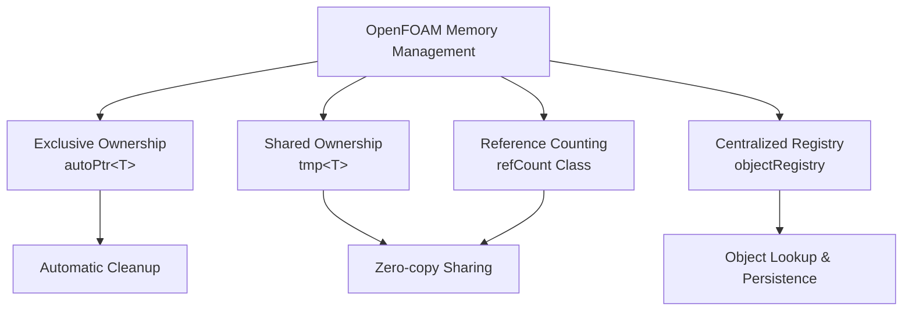

# 01 บทนำ: ความท้าทายและการจัดการหน่วยความจำใน CFD

การจัดการหน่วยความจำในการคำนวณพลศาสตร์ของไหล (Computational Fluid Dynamics - CFD) เป็นหนึ่งในความท้าทายด้านประสิทธิภาพและความน่าเชื่อถือที่สำคัญที่สุดในการจำลองเชิงตัวเลขขนาดใหญ่ แอปพลิเคชัน OpenFOAM ต้องจัดการข้อมูลหลายล้านรายการที่กระจายอยู่บนโครงสร้างเมชที่ซับซ้อน โดยมีข้อมูลชั่วคราวที่ต้องจัดสรรให้มีประสิทธิภาพ แชร์ระหว่างโมดูลการคำนวณ และทำความสะอาดอย่างเป็นระบบโดยไม่มีหน่วยความจำรั่วหรือการลดประสิทธิภาพ

แตกต่างจากแอปพลิเคชัน C++ แบบดั้งเดิมที่พึ่งพาการจัดการหน่วยความจำด้วยตนเองผ่านการดำเนินการ `new`/`delete` หรือ smart pointer ของไลบรารีมาตรฐาน (`std::shared_ptr`, `std::unique_ptr`) OpenFOAM ใช้ระบบนิเวศการจัดการหน่วยความจำแบบกำหนดเองที่ซับซ้อนซึ่งได้รับการออกแบบมาโดยเฉพาะสำหรับความต้องการเฉพาะของงาน CFD

สถาปัตยกรรมการจัดการหน่วยความจำเฉพาะทางนี้ได้แก้ไขความท้าทายพื้นฐานหลายประการที่เป็นสิ่งที่หลีกเลี่ยงไม่ได้ในการคำนวณ CFD:

- **โครงสร้างข้อมูลขนาดใหญ่**: กรณีการจำลองเดี่ยวอาจต้องการหน่วยความจำหลายกิกะไบต์สำหรับสนามความเร็ว การกระจายความดัน แผนที่อุณหภูมิ และปริมาณความปั่นป่วน ทั้งหมดถูกแบ่งย่อยบนเซลล์การคำนวณหลายล้านเซลล์

- **รูปแบบการเป็นเจ้าของที่ซับซ้อน**: สนามฟิสิกส์อาจถูกแชร์ระหว่าง solver ตัวเลขหลายตัว, ตัวจัดการเงื่อนไขขอบเขต, และโมดูลการประมวลผลหลังการคำนวณได้ในเวลาเดียวกัน

- **การดำเนินการที่มีความสำคัญต่อประสิทธิภาพ**: รูปแบบการจัดสรรและคืนหน่วยความจำต้องลดการ miss cache และหลีกเลี่ยงการคัดลอกที่ไม่จำเป็นในระหว่างขั้นตอนการแก้ปัญหาแบบทำซ้ำ

- **การจัดการอายุการใช้งานอัตโนมัติ**: ออบเจกต์ต้องถูกสร้างและทำลายอย่างคาดเดาได้โดยไม่ต้องการการแทรกแซงด้วยตนเองเพื่อป้องกันการรั่วของหน่วยความจำในการจำลองที่ทำงานนาน

ระบบการจัดการหน่วยความจำของ OpenFOAM ประกอบด้วยส่วนประกอบที่เชื่อมโยงกันสี่ส่วนที่ทำงานร่วมกันเพื่อให้การจัดการหน่วยความจำที่มีประสิทธิภาพ, ปลอดภัย, และทำงานได้ดี:

1. **`autoPtr`** – smart pointer ที่เป็นเจ้าของแบบเดี่ยว (exclusive ownership) ซึ่งให้การทำความสะอาดแบบดีเทอร์มินิสติกคล้ายกับ `std::unique_ptr` แต่ได้รับการปรับให้เหมาะสมกับความต้องการด้านการคอมไพล์และรันไทม์ของ OpenFOAM

2. **`tmp`** – ตัวจัดการออบเจกต์ชั่วคราวที่นับการอ้างอิง (reference-counted) ซึ่งช่วยให้สามารถแชร์ผลลัพธ์การคำนวณได้อย่างมีประสิทธิภาพในขณะที่จัดการอายุการใช้งานของออบเจกต์โดยอัตโนมัติผ่าน semantic แบบ copy-on-write

3. **`refCount`** – คลาสฐานที่ใช้กลไกการนับการอ้างอิงสำหรับออบเจกต์ที่สามารถแชร์ระหว่างเจ้าของหลายรายอย่างปลอดภัยโดยไม่ถูกทำลายก่อนเวลา

4. **`objectRegistry`** – ระบบฐานข้อมูลแบบลำดับชั้นที่จัดการออบเจกต์ CFD รวมถึงฟิลด์, เมช, และเงื่อนไขขอบเขตอย่างกลาง โดยให้การทำความสะอาดหน่วยความจำอัตโนมัติและความสามารถในการค้นหาออบเจกต์

บทต่อไปจะสำรวจแต่ละส่วนประกอบโดยละเอียด โดยตรวจสอบกลยุทธ์การนำไปใช้งาน, การแลกเปลี่ยนการออกแบบ และรูปแบนการใช้งานจริงผ่านมุมมองของสถาปัตยกรรม solver ของ OpenFOAM เราจะเริ่มต้นด้วย `autoPtr` ที่เป็นพื้นฐานของการเป็นเจ้าของแบบเดี่ยว จากนั้นดำเนินผ่านกลไกการนับการอ้างอิงของ `tmp` และ `refCount` และสุดท้ายจะตรวจสอบว่า `objectRegistry` จัดระเบียบการจัดการหน่วยความจำในระดับแอปพลิเคชันอย่างไร

## ทำไมไม่ใช้ `std::shared_ptr` และ `std::unique_ptr`?

การออกแบบของ OpenFOAM เกิดขึ้นก่อน C++11 และ smart pointers ของมัน ที่สำคัญกว่านั้น คือ smart pointers มาตรฐานเป็นสิ่งทั่วไปและไม่ได้รับการปรับให้เหมาะสมกับรูปแบบเฉพาะทาง CFD ระบบการจัดการหน่วยความจำแบบกำหนดเองของกรอบงานนี้จัดการกับความต้องการการคำนวณเฉพาะทางของการคำนวณวิธีปริมาตรจำกัด

ความแตกต่างพื้นฐานอยู่ที่รูปแบบการเข้าถึงข้อมูลที่เป็นเอกลักษณ์ในการจำลอง CFD ในขณะที่ smart pointers มาตรฐานได้รับการออกแบบสำหรับการเขียนโปรแกรมเชิงทั่วไป การจัดการหน่วยความจำของ OpenFOAM มุ่งเป้าไปที่การดำเนินการฟิลด์ที่:

1. **โครงสร้างข้อมูลขนาดใหญ่** เป็นส่วนใหญ่ (ฟิลด์ความเร็ว ความดัน อุณหภูมิ ที่มีเซลล์หลายล้านเซลล์)
2. **วัตถุชั่วคราว** ถูกสร้างขึ้นบ่อยครั้งระหว่างการคำนวณระดับกลาง
3. **ประสิทธิภาพการคำนวณ** เป็นสิ่งสำคัญที่สุด โดยมีการ coupling ที่แน่นหนากับอัลกอริทึมตัวเลข
4. **ความใกล้ชิดของหน่วยควาจำ** ส่งผลโดยตรงต่อประสิทธิภาพของ solver

| ด้าน | `std::shared_ptr` / `std::unique_ptr` | `tmp` / `autoPtr` ของ OpenFOAM |
|--------|----------------------------------------|--------------------------------|
| **ค่าใช้จ่ายในการนับ reference** | สองพอยน์เตอร์ (object + control block) + atomic operations | หนึ่งพอยน์เตอร์ + integer counter (ไม่มี control block แยก) |
| **การตรวจจับวัตถุชั่วคราว** | ไม่มีความคิดเรื่อง "temporary" ในตัว | `tmp` แยกความแตกต่างระหว่างวัตถุชั่วคราวและถาวร |
| **การผสานรวมกับ object registry** | ไม่มีการผสานรวมแบบ native | การลงทะเบียน/ค้นหาผ่าน `objectRegistry` อย่างราบรื่น |
| **การปรับให้เหมาะสมกับเค้าโครงหน่วยความจำ** | ทั่วไป อาจทำให้เกิด cache misses | การออกแบบแบบ data-oriented สำหรับการดำเนินการฟิลด์ |
| **ความปลอดภัยของ thread** | Atomic reference counting (หนัก) | Non-atomic โดยค่าเริ่มต้น (เบา); มีเวอร์ชันที่ปลอดภัยต่อ thread |

smart pointers แบบกำหนดเองของ OpenFOAM เป็น **abstraction เฉพาะทาง** ที่ตรงกับ workflow ของ CFD: ฟิลด์ชั่วคราวขนาดใหญ่จำนวนมาก (เช่น residuals, corrections) และชุดย่อยของฟิลด์ที่มีอายุยืนนาน (เช่น ความดัน ความเร็ว)

ผลกระทบต่อประสิทธิภาพของทางเลือกการออกแบบนี้เป็นสิ่งที่สำคัญมาก ในการจำลอง CFD แบบปกติที่มีองศาอิสระหลายล้านองศา ค่าใช้จ่ายของ generic smart pointers สามารถลดประสิทธิภาพการคำนวณลง 10-30% เนื่องจาก:

- **ประสิทธิภาพของ cache**: Control blocks แยกทำให้เค้าโครงหน่วยความจำแตกออก
- **Atomic operations**: ค่าใช้จ่ายในการซิงโครไนซ์ที่ไม่จำเป็นในการดำเนินการฟิลด์แบบ single-thread
- **Generic interfaces**: ค่าใช้จ่ายของ runtime polymorphism ที่สามารถแก้ไขได้ในเวลา compile

## องค์ประกอบหลักของระบบ

> **Figure 1:** องค์ประกอบหลักทั้ง 4 ประการของระบบจัดการหน่วยความจำใน OpenFOAM ซึ่งทำงานร่วมกันเพื่อรับประกันความปลอดภัยของทรัพยากร (Resource Safety) และเพิ่มประสิทธิภาพในการประมวลผลข้อมูลขนาดใหญ่โดยลดการคัดลอกข้อมูลที่ไม่จำเป็น

## การทำความเข้าใจผ่านอุปมาน

เพื่อให้เข้าใจสถาปัตยกรรมการจัดการหน่วยความจำของ OpenFOAM ได้ง่ายขึ้น เราสามารถใช้การเปรียบเทียบดังนี้:

### 1. "ห้องโรงแรม" – RAII และการทำความสะอาดอัตโนมัติ

การจัดการหน่วยความจำของ OpenFOAM ทำงานเหมือนการเช็คอินเข้าโรงแรม เมื่อคุณสร้างออบเจกต์ (เช่น ฟิลด์ความดัน) ระบบจะเตรียมห้องที่สะอาดและพร้อมใช้งานให้คุณ (Constructor) คุณสามารถใช้งานทุกอย่างในห้องได้โดยไม่ต้องกังวลเรื่องการบำรุงรักษา และเมื่อคุณเช็คเอาท์ (ออบเจกต์ออกนอกขอบเขต) ทีมงานจะเข้ามาทำความสะอาดและคืนห้องสู่ระบบโดยอัตโนมัติ (Destructor) กลไกนี้เรียกว่า **RAII (Resource Acquisition Is Initialization)**

### 2. "หนังสือห้องสมุด" – การนับการอ้างอิง (Reference Counting)

เมื่อออบเจกต์หลายตัวต้องการใช้ข้อมูลเดียวกัน (เช่น ค่าความเร็วที่ถูกใช้ทั้งในโมเดลความปั่นป่วนและเงื่อนไขขอบเขต) OpenFOAM จะไม่สร้างสำเนาข้อมูลใหม่ แต่จะใช้ระบบ "ยืมหนังสือ" โดยจะมีตัวนับการใช้งาน (Reference Count) เมื่อมีคนมาขอยืมเพิ่ม ตัวนับจะเพิ่มขึ้น และเมื่อคนคืนหนังสือ ตัวนับจะลดลง หนังสือจะถูกเก็บเข้าชั้นหรือทำลายทิ้งก็ต่อเมื่อไม่มีใครถือครองมันอยู่แล้วเท่านั้น (ตัวนับเป็นศูนย์)

### 3. "แคตตาล็อกกลาง" – Object Registry

`objectRegistry` ของ OpenFOAM ทำหน้าที่เหมือนแคตตาล็อกกลางของห้องสมุดที่ติดตามออบเจกต์การคำนวณทั้งหมด ไม่ว่าจะเป็นฟิลด์, เมช, หรือตัวแปร Solver โดยแต่ละรายการจะมีชื่อเรียก (Identifier) ที่ไม่ซ้ำกัน ระบบนี้ช่วยให้ส่วนประกอบต่างๆ ของ Solver สื่อสารและแบ่งปันข้อมูลกันได้ผ่านฐานข้อมูลส่วนกลางที่ตรวจสอบและจัดการได้ง่าย

ในบทนี้เราจะเจาะลึก 4 องค์ประกอบสำคัญที่ทำให้สถาปัตยกรรมนี้เป็นจริง:
1. **`autoPtr`**: Smart Pointer สำหรับการเป็นเจ้าของแบบเดี่ยว (Exclusive Ownership)
2. **`tmp`**: Smart Pointer สำหรับออบเจกต์ชั่วคราวที่นับการอ้างอิง (Reference-counted)
3. **`refCount`**: คลาสพื้นฐานสำหรับกลไกการนับการอ้างอิง
4. **`objectRegistry`**: ฐานข้อมูลออบเจกต์แบบลำดับชั้น

การทำความเข้าใจองค์ประกอบเหล่านี้จะช่วยให้คุณสามารถพัฒนาส่วนขยายของ OpenFOAM ที่มีประสิทธิภาพสูงและปราศจากปัญหาหน่วยความจำรั่วไหล