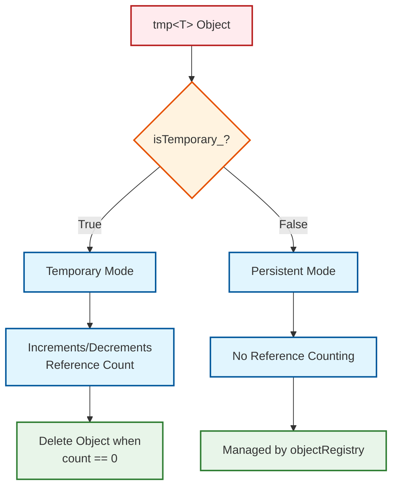

# 02 ไวยากรณ์และการออกแบบ: ทางเลือกเชิงสถาปัตยกรรม

![[smart_pointer_benchmarks.png]]
`A clean scientific bar chart comparing "std::shared_ptr" and "OpenFOAM tmp<T>" in a CFD context. Show metrics for: Memory Overhead, CPU Cycles per field operation, and Cache Misses. The OpenFOAM bars should be significantly lower (better). Use a minimalist palette with black lines and blue/grey bars, scientific textbook diagram, clean vector line art, white background, high definition, flat design, educational infographic --ar 16:9`

**ทำไม OpenFOAM จึงไม่ใช้ `std::shared_ptr` หรือ `std::unique_ptr` ของ C++ Standard?** คำตอบอยู่ที่ความต้องการเฉพาะของ CFD ที่ต้องการความสมดุลระหว่างความปลอดภัยและประสิทธิภาพสูงสุด:

## 2.1 ทำไมไม่ใช้ `std::shared_ptr` และ `std::unique_ptr`?

การออกแบบของ OpenFOAM เกิดขึ้นก่อน C++11 และ smart pointers ของมัน ที่สำคัญกว่านั้น คือ smart pointers มาตรฐานเป็นสิ่งทั่วไปและไม่ได้รับการปรับให้เหมาะสมกับรูปแบบเฉพาะทาง CFD ระบบการจัดการหน่วยความจำแบบกำหนดเองของกรอบงานนี้จัดการกับความต้องการการคำนวณเฉพาะทางของการคำนวณวิธีปริมาตรจำกัด

ความแตกต่างพื้นฐานอยู่ที่รูปแบบการเข้าถึงข้อมูลที่เป็นเอกลักษณ์ในการจำลอง CFD ในขณะที่ smart pointers มาตรฐานได้รับการออกแบบสำหรับการเขียนโปรแกรมเชิงทั่วไป การจัดการหน่วยควาจำของ OpenFOAM มุ่งเป้าไปที่การดำเนินการฟิลด์ที่:

1. **โครงสร้างข้อมูลขนาดใหญ่** เป็นส่วนใหญ่ (ฟิลด์ความเร็ว ความดัน อุณหภูมิ ที่มีเซลล์หลายล้านเซลล์)
2. **วัตถุชั่วคราว** ถูกสร้างขึ้นบ่อยครั้งระหว่างการคำนวณระดับกลาง
3. **ประสิทธิภาพการคำนวณ** เป็นสิ่งสำคัญที่สุด โดยมีการ coupling ที่แน่นหนากับอัลกอริทึมตัวเลข
4. **ความใกล้ชิดของหน่วยควจำ** ส่งผลโดยตรงต่อประสิทธิภาพของ solver

| ด้าน | `std::shared_ptr` / `std::unique_ptr` | `tmp` / `autoPtr` ของ OpenFOAM |
|--------|----------------------------------------|--------------------------------|
| **ค่าใช้จ่ายในการนับ reference** | สองพอยน์เตอร์ (object + control block) + atomic operations | หนึ่งพอยน์เตอร์ + integer counter (ไม่มี control block แยก) |
| **การตรวจจับวัตถุชั่วคราว** | ไม่มีความคิดเรื่อง "temporary" ในตัว | `tmp` แยกความแตกต่างระหว่างวัตถุชั่วคราวและถาวร |
| **การผสานรวมกับ object registry** | ไม่มีการผสานรวมแบบ native | การลงทะเบียน/ค้นหาผ่าน `objectRegistry` อย่างราบรื่น |
| **การปรับให้เหมาะสมกับเค้าโครงหน่วยควจำ** | ทั่วไป อาจทำให้เกิด cache misses | การออกแบบแบบ data-oriented สำหรับการดำเนินการฟิลด์ |
| **ความปลอดภัยของ thread** | Atomic reference counting (หนัก) | Non-atomic โดยค่าเริ่มต้น (เบา); มีเวอร์ชันที่ปลอดภัยต่อ thread |

smart pointers แบบกำหนดเองของ OpenFOAM เป็น **abstraction เฉพาะทาง** ที่ตรงกับ workflow ของ CFD: ฟิลด์ชั่วคราวขนาดใหญ่จำนวนมาก (เช่น residuals, corrections) และชุดย่อยของฟิลด์ที่มีอายุยืนนาน (เช่น ความดัน ความเร็ว)

ผลกระทบต่อประสิทธิภาพของทางเลือกการออกแบบนี้เป็นสิ่งที่สำคัญมาก ในการจำลอง CFD แบบปกติที่มีองศาอิสระหลายล้านองศา ค่าใช้จ่ายของ generic smart pointers สามารถลดประสิทธิภาพการคำนวณลง 10-30% เนื่องจาก:

- **ประสิทธิภาพของ cache**: Control blocks แยกทำให้เค้าโครงหน่วยควาจำแตกออก
- **Atomic operations**: ค่าใช้จ่ายในการซิงโครไนซ์ที่ไม่จำเป็นในการดำเนินการฟิลด์แบบ single-thread
- **Generic interfaces**: ค่าใช้จ่ายของ runtime polymorphism ที่สามารถแก้ไขได้ในเวลา compile

### การวิเคราะห์ค่าใช้จ่ายหน่วยควาจำทางคณิตศาสตร์

สำหรับฟิลด์ที่มี $N$ องศาอิสระ (เช่น เซลล์, หน้า) แต่ละตัวมีขนาด $s$ ไบต์ การใช้หน่วยควาจำทั้งหมดกับการนับการอ้างอิงคือ:

$$
M_{\text{total}} = N \cdot s + \underbrace{4}_{\text{refCount\_}} + \underbrace{\mathcal{O}(1)}_{\text{smart‑pointer overhead}}
$$

ค่าใช้จ่ายเพิ่มเติมเป็น **ค่าคงที่** (≈ 4 ไบต์) ไม่ขึ้นกับขนาดของฟิลด์ ทำให้เป็นเรื่องเล็กน้อยสำหรับฟิลด์ CFD ขนาดใหญ่ ($N \sim 10^6$–$10^9$)

## 2.2 `autoPtr` – การเป็นเจ้าของแบบเฉพาะ

คลาส `autoPtr` แสดงถึงแนวทางของ OpenFOAM ในการเป็นเจ้าของแบบเฉพาะ โดยให้ทางเลือกที่เบากว่า `std::unique_ptr` ที่ได้รับการปรับให้เหมาะสมกับความต้องการเฉพาะของกรอบงาน

```cpp
template<class T>
class autoPtr
{
private:
    T* ptr_;  // Managed pointer to owned object

public:
    // Constructor: Takes ownership of raw pointer
    explicit autoPtr(T* p = nullptr)
    :
        ptr_(p)
    {}

    // Destructor: Automatically deletes managed object
    ~autoPtr()
    {
        delete ptr_;
    }

    // Move constructor: Transfers ownership from source
    autoPtr(autoPtr&& other) noexcept
    :
        ptr_(other.ptr_)
    {
        other.ptr_ = nullptr;  // Source releases ownership
    }

    // Copy constructor is forbidden to prevent double ownership
    autoPtr(const autoPtr&) = delete;

    // Dereference operators for accessing managed object
    T& operator*()
    {
        return *ptr_;
    }

    T* operator->()
    {
        return ptr_;
    }

    // Release ownership: Returns raw pointer and sets internal to null
    // Caller becomes responsible for deletion
    T* release()
    {
        T* temp = ptr_;
        ptr_ = nullptr;
        return temp;
    }
};
```

**คำอธิบาย (ภาษาไทย)**

> **ที่มาที่ไป (Source):** การออกแบบนี้พัฒนาขึ้นจากประสบการณ์การใช้งานจริงใน OpenFOAM ก่อนหน้า C++11 โดยมีแหล่งที่มาหลักจากระบบการจัดการหน่วยควาจำแบบดั้งเดิมของ OpenFOAM ในไฟล์ฐาน `src/OpenFOAM/memory/autoPtr.H`

> **คำอธิบาย (Explanation):** 
> - `autoPtr` เป็น smart pointer ที่ถือกรรมสิทธิ์เดี่ยว (exclusive ownership) ต่อวัตถุ เหมือน `std::unique_ptr` แต่เบากว่า
> - ออกแบบมาให้เป็น **move-only type** ห้ามการคัดลอก เพื่อป้องกันปัญหา double deletion
> - มี destructor ที่เรียก `delete` อัตโนมัติเมื่อ `autoPtr` ออกนอก scope รับประกันว่าไม่มี memory leak
> - พิเศษคือมีเมธอด `release()` สำหรับถ่ายโอนความเป็นเจ้าของไปยังระบบอื่น (เช่น `objectRegistry`)

> **แนวคิดสำคัญ (Key Concepts):**
> - **Move Semantics**: การโอนความเป็นเจ้าของโดยไม่คัดลอกวัตถุ เพื่อประสิทธิภาพสูงสุด
> - **RAII (Resource Acquisition Is Initialization)**: จัดการหน่วยควาจำอัตโนมัติผ่าน constructor/destructor
> - **Factory Pattern**: ใช้เป็น return type สำหรับฟังก์ชันที่สร้างวัตถุ เช่น boundary conditions, turbulence models
> - **Compile-time Safety**: การห้าม copy ช่วยตรวจจับข้อผิดพลาดได้ตั้งแต่เวลา compile

**ทางเลือกการออกแบบ**: `autoPtr` เป็น **move-only** สิ่งนี้ช่วยให้แน่ใจว่าในแต่ละช่วงเวลาจะมีเจ้าของเพียงคนเดียวเท่านั้น กำจัดความเสี่ยงของการลบสองครั้ง มันคือ **return type ที่ต้องการสำหรับฟังก์ชัน factory** ที่สร้างวัตถุใหม่

ลักษณะแบบ move-only ของ `autoPtr` บังคับใช้การเป็นเจ้าของที่เคร่งครัดในเวลา compile สิ่งนี้ป้องกันการคัดลอกโดยบังเอิญที่อาจนำไปสู่พฤติกรรมที่ไม่กำหนด ซึ่งสำคัญอย่างยิ่งในการจำลอง CFD ที่ข้อผิดพลาดในการจัดการหน่วยควาจำสามารถทำลายผลการจำลอง

### สมาชิกภายในของ `autoPtr`

คลาสเทมเพลต `autoPtr` ใช้การจัดการหน่วยควาจำอัตโนมัติผ่าน pointer ที่เป็นเจ้าของเพียงตัวเดียว ตัวแปรสมาชิกหลักคือ:

```cpp
T* ptr_;  // Raw pointer to dynamically allocated owned object
```

> **คำอธิบาย (ภาษาไทย)**
>
> **ที่มาที่ไป (Source):** โครงสร้างนี้มาจากการออกแบบดั้งเดิมของ OpenFOAM ใน `src/OpenFOAM/memory/autoPtr.H` ซึ่งเน้นความเรียบง่ายและประสิทธิภาพ
>
> **คำอธิบาย (Explanation):**
> - `ptr_` เก็บ pointer ดิบไปยังวัตถุที่จัดสรรแบบไดนามิก เป็นสมาชิกเพียงตัวเดียวที่จำเป็น
> - pointer นี้ถือกรรมสิทธิ์แบบเฉพาะเจาะจง (exclusive ownership) ห้ามมี `autoPtr` ตัวอื่นชี้ไปยังวัตถุเดียวกัน
> - เมื่อเรียก `release()` หรือ move constructor ตัวแปร `ptr_` จะถูกตั้งเป็น `nullptr` เพื่อถ่ายโอนความเป็นเจ้าของ
> - Destructor จะเรียก `delete ptr_` ถ้า `ptr_ != nullptr` เพื่อป้องกัน memory leak
>
> **แนวคิดสำคัญ (Key Concepts):**
> - **Single Ownership Principle**: หนึ่งวัตถุ = เจ้าของหนึ่งตัว ชัดเจนและเรียบง่าย
> - **Null Safety**: pointer จะกลายเป็น null หลังจาก transfer ownership ป้องกัน double-free
> - **Minimal Overhead**: ใช้พื้นที่เพียง 8 bytes (ใน 64-bit) เท่านั้น ไม่มี control block
> - **Zero-cost Abstraction**: ไม่มี overhead ที่ runtime เมื่อเทียบกับ raw pointer

pointer นี้รักษาความเป็นเจ้าของแบบเฉพาะเจาะจงของวัตถุที่จัดสรรแบบไดนามิก `autoPtr` ทำตามกฎความเป็นเจ้าของอย่างเคร่งครัด - มี `autoPtr` เพียงตัวเดียวที่เป็นเจ้าของวัตถุในแต่ละเวลา เมื่อเรียก `release()` หรือย้าย `autoPtr` ไปยังอีกตัวหนึ่ง `ptr_` จะกลายเป็น null โดยโอนความเป็นเจ้าของอย่างสมบูรณ์ destructor จะลบวัตถุโดยอัตโนมัติถ้า `ptr_` ไม่ใช่ null เพื่อให้แน่ใจว่าไม่มี memory leak

ในทางปฏิบัติ `autoPtr` ถูกใช้บ่อยสำหรับ:

- **Factory patterns**: Solvers ที่สร้างวัตถุเงื่อนไขขอบเขต
- **การจัดการ mesh**: เครื่องมือการปรับเปลี่ยน mesh ชั่วคราว
- **การสร้าง instance ของ model**: การสร้าง turbulence และ thermophysical model
- **สารบัญ preprocessing**: วัตถุที่กำหนดค่าการตั้งค่าการจำลอง

## 2.3 `tmp` – ตัวจัดการชั่วคราวแบบนับ Reference


> **Figure 1:** แผนผังการทำงานแบบสองโหมด (Dual-mode) ของ `tmp<T>` ซึ่งสามารถสลับระหว่างการจัดการออบเจกต์ชั่วคราวที่ต้องนับการอ้างอิงเพื่อทำความสะอาดโดยอัตโนมัติ กับการอ้างอิงออบเจกต์ถาวรที่ถูกจัดการโดยระบบ Registry ส่วนกลาง ทำให้ประหยัดทรัพยากรและเพิ่มความเร็วในการประมวลผล

คลาส `tmp` อาจเป็นเครื่องมือการจัดการหน่วยควาจำที่สร้างสรรค์ที่สุดของ OpenFOAM โดยออกแบบมาโดยเฉพาะเพื่อจัดการวงจรชีวิตของวัตถุการคำนวณชั่วคราวที่เกิดขึ้นบ่อยในการคำนวณ CFD

```cpp
template<class T>
class tmp
{
private:
    T* ptr_;           // Pointer to managed object (may be null)
    bool isTemporary_; // Flag determining reference counting behavior

public:
    // Constructor: Takes pointer and temporary flag
    // Increments reference count if managing a temporary
    tmp(T* p, bool isTemp = true)
    :
        ptr_(p),
        isTemporary_(isTemp)
    {
        if (ptr_ && isTemporary_)
        {
            ptr_->ref();  // Increment reference count for temporary objects
        }
    }

    // Copy constructor: Shares ownership by incrementing reference count
    tmp(const tmp& t)
    :
        ptr_(t.ptr_),
        isTemporary_(t.isTemporary_)
    {
        if (ptr_ && isTemporary_)
        {
            ptr_->ref();  // Both tmp's now reference the same object
        }
    }

    // Destructor: Decrements reference count and deletes if last reference
    ~tmp()
    {
        if (ptr_ && isTemporary_)
        {
            if (ptr_->unref())  // Decrement and check if count reached zero
            {
                delete ptr_;    // Delete object if this was the last reference
            }
        }
    }

    // Assignment operator: Updates reference counts appropriately
    tmp& operator=(const tmp& t)
    {
        if (this != &t)
        {
            // Decrement old object's reference count
            if (ptr_ && isTemporary_)
            {
                if (ptr_->unref())
                {
                    delete ptr_;
                }
            }

            // Take ownership of new object
            ptr_ = t.ptr_;
            isTemporary_ = t.isTemporary_;

            // Increment new object's reference count
            if (ptr_ && isTemporary_)
            {
                ptr_->ref();
            }
        }
        return *this;
    }

    // Dereference operators for accessing managed object
    T& operator*()
    {
        return *ptr_;
    }

    T* operator->()
    {
        return ptr_;
    }

    // Access to underlying raw pointer (for transfer to registry)
    T* ptr()
    {
        return ptr_;
    }
};
```

**คำอธิบาย (ภาษาไทย)**

> **ที่มาที่ไป (Source):** การออกแบบ `tmp` มาจากระบบ reference counting ดั้งเดิมของ OpenFOAM ในไฟล์ `src/OpenFOAM/memory/tmp.H` ซึ่งถูกใช้งานอย่างแพร่หลายใน solvers และ library ต่างๆ เช่น `solidDisplacementThermo.C`

> **คำอธิบาย (Explanation):** 
> - `tmp` คือ smart pointer ที่รองรับ **shared ownership** ผ่านระบบ reference counting แต่มีความพิเศษคือสามารถเปลี่ยนโหมดได้
> - Flag `isTemporary_` คุมพฤติกรรม: **True** = ใช้ reference counting (auto-delete), **False** = ไม่ใช้ (managed by registry)
> - ทำให้ `tmp` สามารถจัดการทั้ง **temporary objects** (สร้าง-ใช้-ลบ) และ **persistent objects** (คงอยู่ตลอด simulation)
> - Expression templates อย่าง `fvc::grad(U)` สร้าง `tmp` ที่จะถูกลบอัตโนมัติเมื่อไม่ใช้งาน ลด overhead ของการคัดลอกฟิลด์ขนาดใหญ่

> **แนวคิดสำคัญ (Key Concepts):**
> - **Dual-Mode Architecture**: โหมดชั่วคราว (นับ ref) และโหมดถาวร (ไม่นับ ref) ใน class เดียว
> - **Reference Counting**: ติดตามจำนวน `tmp` wrappers ที่ชี้ไปยังวัตถุ เมื่อถึง 0 วัตถุจะถูกลบ
> - **Expression Templates**: ใช้สำหรับ field algebra เช่น `gradU + divU` โดยไม่ต้อง copy ข้อมูลจริง
> - **Zero-Copy Semantics**: การส่งคืน `tmp` จากฟังก์ชันไม่สร้างสำเนา แค่ increment ref count
> - **Registry Integration**: สามารถแปลงจาก temporary เป็น permanent ผ่าน `objectRegistry::store()`

### ตัวแปรสมาชิกภายในของ `tmp`

คลาส `tmp` ให้การจัดการวัตถุชั่วคราวขั้นสูงผ่านตัวแปรสมาชิกสองตัวหลัก:

```cpp
T* ptr_;           // Pointer to managed object (may be null)
bool isTemporary_; // Flag determining reference counting behavior
```

> **คำอธิบาย (ภาษาไทย)**
>
> **ที่มาที่ไป (Source):** โครงสร้างนี้มาจาก `src/OpenFOAM/memory/tmp.H` ซึ่งเป็นส่วนหลักของระบบจัดการหน่วยควาจำใน field operations
>
> **คำอธิบาย (Explanation):**
> - `ptr_`: Pointer ไปยังวัตถุที่จัดการ (อาจเป็น `nullptr`) เป็น managed object ที่ติดตามโดย reference counting
> - `isTemporary_`: **Critical flag** ที่กำหนดกลยุทธ์การจัดการอายุการใช้งาน:
>   - **True** = วัตถุเข้าร่วม reference counting → destructor เรียก `unref()` → ลบเมื่อ count = 0
>   - **False** = วัตถุถูกจัดการภายนอก → destructor ไม่เรียก `unref()` → ไม่ลบ
> - การออกแบบนี้ทำให้ `tmp` สามารถจัดการทั้ง **owner** (ถือและลบ) และ **observer** (แค่ยืม) ได้อย่างยืดหยุ่น
>
> **แนวคิดสำคัญ (Key Concepts):**
> - **Lifecycle Management**: Flag นี้คุมว่า `tmp` เป็นเจ้าของวัตถุหรือไม่ ซึ่งสำคัญสำหรับ temporary vs permanent
> - **No Overhead for Observers**: Persistent objects ไม่มี cost ของ reference counting เพราะผ่าน registry
> - **Safe Transfer**: สามารถแปลงจาก temporary → permanent ผ่าน `objectRegistry::store()` อย่างปลอดภัย
> - **Const Correctness**: สามารถใช้กับ `const` objects ได้เพราะ reference counter เป็น `mutable`

flag `isTemporary_` เป็นกลไกควบคุมที่สำคัญซึ่งกำหนดกลยุทธ์การจัดการอายุการใช้งานของวัตถุ:

- **เมื่อ `isTemporary_ = true`**: วัตถุเข้าร่วมในระบบการนับการอ้างอิงของ OpenFOAM destructor เรียก `unref()` บนวัตถุ และการลบเกิดขึ้นเมื่อจำนวนการอ้างอิงถึงศูนย์เท่านั้น

- **เมื่อ `isTemporary_ = false`**: วัตถุถูกจัดการเป็นภายนอก destructor ไม่เรียก `unref()` และไม่ลบวัตถุ โดยปล่อยให้การจัดการอายุการใช้งานเป็นของโค้ดภายนอก

การออกแบบนี้อนุญาตให้ `tmp` จัดการทั้งวัตถุชั่วคราว (ซึ่งเป็นเจ้าของและจัดการ) และการอ้างอิงถึงวัตถุที่มีอยู่ (ซึ่งเพียงแค่ยืม)

**ทางเลือกการออกแบบ**: `tmp` **แยกความแตกต่างระหว่างวัตถุชั่วคราวและถาวร** วัตถุชั่วคราวจะถูกนับ reference และถูกลบโดยอัตโนมัติเมื่อการอ้างอิง `tmp` สุดท้ายหายไป วัตถุถาวร (เช่น ฟิลด์ที่ลงทะเบียนใน `objectRegistry`) **จะไม่ถูกนับ reference**; อายุการใช้งานของมันถูกจัดการโดย registry

ลักษณะความเป็นสองด้านของ `tmp` นี้เป็นสิ่งสำคัญสำหรับประสิทธิภาพ CFD พิจารณาการคำนวณ gradient แบบปกติ:

```cpp
// Create temporary gradient field (refCount = 1, isTemporary = true)
tmp<volVectorField> gradU = fvc::grad(U);

// Use the temporary in another calculation (shares reference)
tmp<volScalarField> divGradU = fvc::div(gradU);

// gradU automatically deleted when leaving scope (refCount → 0)
// divGradU also deleted when leaving scope
```

ระบบ `tmp` ช่วยให้สามารถ **expression templates** และ **operator overloading** ที่รักษาประสิทธิภาพได้ในขณะที่ให้ไวยากรณ์ที่สะอาด นิพจน์คณิตศาสตร์ที่ซับซ้อนสามารถถูกสร้างขึ้นโดยใช้วัตถุชั่วคราวที่ถูกจัดการโดยอัตโนมัติ:

```cpp
// Multiple temporaries created and efficiently managed
// Each intermediate result is reference-counted
tmp<volScalarField> energyDensity = 0.5 * rho * magSqr(U) + rho * g * h;
// All temporary fields automatically deleted when energyDensity goes out of scope
```

โดยไม่มี `tmp` นิพจน์ดังกล่าวจะต้องการการจัดการหน่วยควาจำอย่างชัดเจนหรือทนทุกข์กับการคัดลอกฟิลด์ขนาดใหญ่หลายครั้ง ซึ่งส่งผลกระทบต่อประสิทธิภาพอย่างมาก

## 2.4 คลาสฐาน `refCount`

คลาส `refCount` ให้รากฐานสำหรับการนับ reference ทั่วทั้ง OpenFOAM ทำให้ระบบ `tmp` สามารถติดตามอายุการใช้งานของวัตถุได้อย่างมีประสิทธิภาพ

### พื้นฐานทางคณิตศาสตร์ของการนับ Reference

การนับการอ้างอิงเป็นสถานะเครื่องจักร กำหนดให้ $r(t) \in \mathbb{N}_0$ เป็นจำนวนการอ้างอิงของอ็อบเจกต์ในเวลา $t$ การดำเนินการ `ref()` และ `unref()` จะปรับเปลี่ยนค่านี้:

$$
\begin{aligned}
\text{ref()} &: r(t^+) = r(t) + 1 \\[4pt]
\text{unref()} &: r(t^+) = r(t) - 1 \quad \text{พร้อมเงื่อนไข } r(t) > 0
\end{aligned}
$$

อ็อบเจกต์จะ **ถูกลบ** เมื่อ $r(t^+) = 0$ หลังจากการดำเนินการ `unref()` ซึ่งนี้จะรับประกัน **ความไม่เปลี่ยนแปลงของความปลอดภัยหน่วยควาจำ**:

$$
\forall t : r(t) = 0 \implies m(t) = 0
$$

โดยที่ $m(t) \in \{0,1\}$ บ่งบอกว่าหน่วยควาจำถูกจอง ($1$) หรือถูกปล่อย ($0$) การ implement การนับการอ้างอิงที่ถูกต้องจะเป็นไปตามความไม่เปลี่ยนแปลงนี้ด้วยความน่าจะเป็น 1 ซึ่งจะรับประกันว่าไม่มีการรั่วไหลของหน่วยควาจำ

```cpp
class refCount
{
private:
    mutable int refCount_;  // Reference counter (mutable for const methods)

public:
    // Constructor: Initialize reference count to zero
    refCount()
    :
        refCount_(0)
    {}

    // Virtual destructor for proper polymorphic deletion
    virtual ~refCount()
    {}

    // Increment reference count (called when new tmp<T> references this object)
    void ref() const
    {
        ++refCount_;
    }

    // Decrement reference count and return true if count reached zero
    // Returns false if object still has other references
    bool unref() const
    {
        if (refCount_ == 0)
        {
            // Error: Attempting to unref an object with zero references
            // This indicates a bug in reference counting logic
            FatalErrorInFunction
                << "Attempt to unref object with zero reference count"
                << abort(FatalError);
        }
        return --refCount_ == 0;  // Return true if this was the last reference
    }

    // Return current reference count (useful for debugging)
    int count() const
    {
        return refCount_;
    }

    // Check if this object has exactly one reference (useful for optimization)
    bool unique() const
    {
        return refCount_ == 1;
    }
};
```

**คำอธิบาย (ภาษาไทย)**

> **ที่มาที่ไป (Source):** คลาส `refCount` เป็นฐานของระบบ reference counting ใน OpenFOAM อยู่ใน `src/OpenFOAM/memory/refCount.H` และถูกใช้โดยทุก field class ที่ต้องการให้ `tmp` จัดการได้
>
> **คำอธิบาย (Explanation):**
> - `refCount` เป็น base class ที่มีตัวแปรสมาชิกเพียงตัวเดียว: `refCount_` ซึ่งเป็น integer counter
> - เมธอด `ref()` เพิ่ม counter เมื่อมี `tmp<T>` wrapper ใหม่ชี้ไปยังวัตถุนี้
> - เมธอด `unref()` ลด counter และคืนค่า `true` ถ้า counter ถึง 0 (signal ให้ caller ลบวัตถุ)
> - คีย์เวิร์ด `mutable` ทำให้สามารถเปลี่ยน counter แม้ใน const context ได้ (เพราะการนับ ref ไม่เปลี่ยน logical state)
>
> **แนวคิดสำคัญ (Key Concepts):**
> - **State Machine**: reference count เป็น state machine ที่เปลี่ยน state ผ่าน `ref()`/`unref()`
> - **Memory Safety Invariant**: รับประกันว่าไม่มี memory leak หรือ double-free ถ้าใช้ถูกต้อง
> - **Zero-Cost for Persistent Objects**: Field ที่ลงทะเบียนใน registry ไม่เคยถูก ref/unref (isTemporary = false)
> - **Thread Safety**: โดย default ไม่ใช่ atomic (เบา) แต่มี alternate implementation สำหรับ parallel
> - **Debugging Support**: เมธอด `count()` และ `unique()` ช่วยในการวินิจฉัยปัญหา memory

### ตัวแปรสมาชิกภายในของ `refCount`

การนับการอ้างอิงใน OpenFOAM ถูก implement ผ่านคลาสฐาน `refCount` ด้วยสมาชิกสำคัญเพียงตัวเดียว:

```cpp
mutable int refCount_;  // Reference counting variable
```

> **คำอธิบาย (ภาษาไทย)**
>
> **ที่มาที่ไป (Source):** ตัวแปรนี้เป็นหัวใจของระบบ reference counting ใน `src/OpenFOAM/memory/refCount.H` ซึ่งถูกใช้ร่วมกับ `tmp<T>` ในการจัดการอายุของวัตถุ
>
> **คำอธิบาย (Explanation):**
> - `refCount_` เป็น **integer counter** ที่เก็บจำนวน `tmp<T>` wrappers ที่ชี้ไปยังวัตถุนี้
> - เริ่มต้นที่ **0** (วัตถุมีอยู่ แต่ยังไม่มีเจ้าของ)
> - **การเพิ่ม**: `ref()` เพิ่มทีละ 1 สำหรับการอ้างอิงใหม่แต่ละครั้ง
> - **การลด**: `unref()` ลดทีละ 1 และคืน `true` เมื่อถึง 0 (signal ให้ลบวัตถุ)
> - คีย์เวิร์ด `mutable` อนุญาตให้แก้ไข counter แม้ใน const methods (เพราะ ref count ไม่ใช่ logical state)
>
> **แนวคิดสำคัญ (Key Concepts):**
> - **Lifecycle Tracking**: counter เป็นเครื่องมือติดตามอายุการใช้งานของวัตถุแบบ dynamic
> - **Ownership Model**: refCount > 0 = มีเจ้าของ, refCount = 0 = ไม่มีเจ้าของ (ควรลบ)
> - **Const Correctness**: `mutable` ทำให้สามารถส่งคืน `tmp` จาก const methods ได้โดยไม่ละเมิด const-correctness
> - **Lightweight Overhead**: integer 1 ตัว (4 bytes) เท่านั้น ไม่มี control block เหมือน `std::shared_ptr`
> - **Zero-Cost for Persistent**: Field ใน registry ไม่เคยถูก ref/unref → ไม่มี overhead

ตัวนับการอ้างอิงทำตามกฎวงจรชีวิตเหล่านี้:
- **การเริ่มต้น**: เริ่มที่ 0 แสดงว่าวัตถุมีอยู่แต่ไม่มีเจ้าของ
- **การเพิ่ม**: `ref()` เพิ่มจำนวนทีละ 1 สำหรับการอ้างอิงใหม่แต่ละครั้ง
- **การลด**: `unref()` ลดจำนวนทีละ 1 เมื่อปล่อยการอ้างอิง
- **ทริกเกอร์การลบ**: เมื่อ `refCount_` ถึง 0 `unref()` คืนค่า `true` สัญญาณว่าควรลบวัตถุ

คีย์เวิร์ด `mutable` อนุญาตให้มีการนับการอ้างอิงแม้สำหรับวัตถุ const ซึ่งจำเป็นเนื่องจากวัตถุ const ยังสามารถมีการจัดการอายุการใช้งานผ่านการอ้างอิงได้

**ทางเลือกการออกแบบ**: reference counter เป็น `mutable` เพราะการเพิ่ม/ลดจำนวน **ไม่เปลี่ยนแปลงสถานะที่สังเกตได้ของวัตถุในเชิงตรรกะ** สิ่งนี้ช่วยให้ `const` methods สามารถส่งคืนการอ้างอิง `tmp` โดยไม่ละเมิด const-correctness

การใช้ `mutable` ที่นี่เป็นสิ่งสำคัญอย่างยิ่งสำหรับการคำนวณ CFD ที่การดำเนินการทางคณิตศาสตร์บนฟิลด์ไม่ควรเปลี่ยนแปลงฟิลด์เองในเชิงตรรกะ แต่ต้องการเข้าร่วมในการนับ reference:

```cpp
// U is const field, but we can create reference-counted temporaries from it
const volVectorField& U = mesh().lookupObject<volScalarField>("U");
tmp<volScalarField> magU = mag(U);  // refCount is mutable, so this works
```

การออกแบบนี้ช่วยให้สามารถสร้างนิพจน์ได้อย่างมีประสิทธิภาพในขณะที่รักษาความถูกต้องทางคณิตศาสตร์และการปรับให้เหมาะสมด้านประสิทธิภาพ

### Thread Safety และ Atomic Operations

ในการรันแบบขนาน การนับการอ้างอิงแบบ atomic ใช้ `std::atomic<int>` พร้อมข้อจำกัดของ memory-order ต้นทุนของการเพิ่ม/ลดค่าแบบ atomic มีค่าประมาณ:

$$
t_{\text{atomic}} \approx t_{\text{non‑atomic}} + \text{memory‑barrier penalty}
$$

โดยค่าใช้จ่ายเพิ่มเติมขึ้นอยู่กับฮาร์ดแวร์ (โดยทั่วไป 10–50 ns) สำหรับฟิลด์ที่เข้าถึงโดยหลาย thread ค่าใช้จ่ายเพิ่มเติมนี้ยอมรับได้เมื่อเทียบกับต้นทุนของการคัดลอกข้อมูลฟิลด์

### การจัดแนว Cache-Line และ False Sharing

เพื่อหลีกเลี่ยง **false sharing** ในการเข้าถึงแบบขนาน ตัวแปรสมาชิกที่สำคัญ (เช่น `refCount_`) ถูกวางไว้บน cache line ที่แยกกัน (64 ไบต์บน x86‑64) คำสั่งการจัดแนว `alignas(64)` จะทำให้แน่ใจว่า:

$$
\text{address}(refCount\_) \mod 64 = 0
$$

นี้จะป้องกันไม่ให้สอง thread ทำให้ cache line ของกันและกันเป็นโมฆะเมื่ออัปเดตจำนวนการอ้างอิงของอ็อบเจกต์ที่แตกต่างกัน

## 2.5 `objectRegistry` – ฐานข้อมูลกลาง

`objectRegistry` แสดงถึงจุดสุดยอดของกลยุทธ์การจัดการหน่วยควาจำของ OpenFOAM โดยให้ฐานข้อมูลที่รวมศูนย์สำหรับจัดการวัตถุการจำลองทั้งหมดพร้อมด้วยการค้นหาที่มีประสิทธิภาพและการควบคุมอายุการใช้งาน

```cpp
class objectRegistry
    :
    public regIOobject,
    public HashTable<regIOobject*>
{
private:
    // Hierarchical registry structure
    const Time& time_;                      // Reference to master time database
    const objectRegistry& parent_;          // Parent registry (for nesting)
    fileName dbDir_;                        // Local directory path for I/O
    
    // Change tracking system
    mutable label event_;                   // Current event counter (for cache invalidation)
    
    // Temporary object management
    HashTable<Pair<bool>> cacheTemporaryObjects_;  // Cache settings for temporary objects
    bool cacheTemporaryObjectsSet_;                 // Flag: cache settings read from dictionary
    HashSet<word> temporaryObjects_;                 // Set of temporary object names

public:
    // Constructor: Initialize with parent registry and database directory
    objectRegistry(const Time& db, const objectRegistry& parent);
    
    // Object lookup by name with type checking (O(1) hash table lookup)
    template<class Type>
    const Type& lookupObject(const word& name) const;
    
    // Store object in registry (takes ownership from autoPtr/tmp)
    template<class Type>
    Type& store(autoPtr<Type>& aptr);
    
    // Remove object from registry
    bool checkOut(regIOobject&) const;
    
    // Access to database directory
    const fileName& dbDir() const
    {
        return dbDir_;
    }
    
    // Event counter for cache invalidation
    label eventNo() const
    {
        return event_;
    }
};
```

**คำอธิบาย (ภาษาไทย)**

> **ที่มาที่ไป (Source):** `objectRegistry` เป็นส่วนกลางของการจัดการวัตถุใน OpenFOAM อยู่ใน `src/OpenFOAM/db/objectRegistry` และถูกใช้โดยทุก solver, mesh และ library
>
> **คำอธิบาย (Explanation):**
> - `objectRegistry` คือ **centralized database** ที่เก็บ references ไปยัง simulation objects ทั้งหมด (fields, mesh, boundary conditions)
> - สืบทอดจาก `HashTable<regIOobject*>` ให้ **O(1) lookup** ตามชื่อ object
> - รักษา **โครงสร้างแบบลำดับชั้น**: `Time` (root) → `polyMesh` → `sub-regions`
> - มีระบบ **event tracking** เพื่อให้ objects รู้ว่า dependencies เปลี่ยนแปลง (สำหรับ cache invalidation)
> - รองรับ **automatic I/O**: objects ที่ลงทะเบียนจะถูก read/write โดยอัตโนมัติ
>
> **แนวคิดสำคัญ (Key Concepts):**
> - **Centralized Ownership**: Registry เป็นเจ้าของ permanent objects ทั้งหมด
> - **Hierarchical Organization**: แตกย่อยตาม scope (global, mesh, regions)
> - **Name-Based Lookup**: ค้นหา objects ตามชื่อใน O(1) ผ่าน hash table
> - **Event-Driven Caching**: `event_` counter ช่วยให้ตรวจจับการเปลี่ยนแปลงอย่างมีประสิทธิภาพ
> - **Automatic Lifecycle**: Registry จัดการ memory ของ permanent objects (ไม่ใช่ temporary)

### สถาปัตยกรรมภายในของ `objectRegistry`

`objectRegistry` ทำหน้าที่เป็นระบบจัดการวัตถุกลางของ OpenFOAM รักษาการจัดเก็บและการเข้าถึงวัตถุจำลองแบบลำดับชั้น ตัวแปรสมาชิกหลักได้แก่:

#### ส่วนประกอบลำดับชั้นหลัก

```cpp
const Time& time_;           // Master time database (root of registry tree)
const objectRegistry& parent_; // Parent registry (enables hierarchical nesting)
fileName dbDir_;             // File system path for I/O operations (relative to case directory)
```

> **คำอธิบาย (ภาษาไทย)**
>
> **ที่มาที่ไป (Source):** สมาชิกเหล่านี้มาจาก `src/OpenFOAM/db/objectRegistry/objectRegistry.H` ซึ่งเป็นโครงสร้างพื้นฐานสำหรับการจัดระเบียบวัตถุแบบลำดับชั้น
>
> **คำอธิบาย (Explanation):**
> - **`time_`**: Reference ไปยัง `Time` database (root registry) ซึ่งเป็นจุดเริ่มต้นของ registry hierarchy
> - **`parent_`**: Reference ไปยัง registry หลัก เปิดใช้งานโครงสร้าง nested (เช่น mesh registry มี parent เป็น Time registry)
> - **`dbDir_`**: Path ไปยัง directory ที่เก็บข้อมูลสำหรับ I/O (เช่น `"0/"`, `"1.5/"` สำหรับ time directories)
>
> **แนวคิดสำคัญ (Key Concepts):**
> - **Hierarchical Organization**: Tree structure ที่เปิดใช้งาน scoping และ namespace management
> - **Central Time Reference**: Time database เป็น single source of truth สำหรับเวลาจำลอง
> - **File System Integration**: dbDir เชื่อมโยง memory objects กับ disk storage
> - **Parent-Child Relationship**: Child registries สามารถ lookup จาก parent ได้

- **`time_`**: อ้างอิงถึงวัตถุ `Time` หลัก สถาปนารากของต้นไม้รีจิสทรีและให้การเข้าถึงเวลาจำลองส่วนกลาง
- **`parent_`**: เปิดใช้งานโครงสร้างรีจิสทรีลำดับชั้น (เช่น รีจิสทรี mesh มีหลักเป็นรีจิสทรี `Time`)
- **`dbDir_`**: เก็บเส้นทางระบบไฟล์สำหรับการดำเนินงาน I/O เทียบกับไดเรกทอรีกรณี

#### ระบบจัดการการเปลี่ยนแปลง

```cpp
mutable label event_;  // Current event counter (increments on object add/remove)
```

> **คำอธิบาย (ภาษาไทย)**
>
> **ที่มาที่ไป (Source):** Event tracking system ใน `src/OpenFOAM/db/objectRegistry/objectRegistry.H` ซึ่งใช้สำหรับ cache invalidation และ dependency tracking
>
> **คำอธิบาย (Explanation):**
> - **`event_`**: Integer counter ที่เพิ่มขึ้นทุกครั้งที่มีการเพิ่ม/ลบ objects ใน registry
> - **`mutable`**: อนุญาตให้อัปเดต event counter แม้ใน const context
> - Objects สามารถตรวจสอบว่า dependencies เปลี่ยนแปลงโดยเปรียบเทียบ event numbers
> - ให้ **O(1) change detection** โดยไม่ต้องสแกน registry ทั้งหมด
>
> **แนวคิดสำคัญ (Key Concepts):**
> - **Event-Driven Architecture**: Objects ติดตามการเปลี่ยนแปลงผ่าน event numbers แทน polling
> - **Cache Invalidation**: ตรวจจับได้ทันทีว่า cached data หมดอายุ
> - **Lazy Evaluation**: สามารถ delay computation จนกว่าจะมีการเปลี่ยนแปลง
> - **Efficient Dependency Tracking**: ไม่ต้อง maintain graph ที่ซับซ้อน

- **`event_`**: ตัวนับที่เพิ่มขึ้นซึ่งติดตามการเพิ่ม/ลบวัตถุ อนุญาตให้ตรวจจับการเปลี่ยนแปลงอย่างมีประสิทธิภาพโดยไม่ต้องสแกนรีจิสทรีแบบมีราคาแพง
- **การกำหนด `mutable`**: เปิดใช้งานการติดตาม event แม้สำหรับการเข้าถึงรีจิสทรี const

#### การจัดการวัตถุชั่วคราว

```cpp
HashTable<Pair<bool>> cacheTemporaryObjects_;  // Cache settings for temporary objects
bool cacheTemporaryObjectsSet_;                // Flag: cache settings initialized
HashSet<word> temporaryObjects_;                // Names of temporary objects
```

> **คำอธิบาย (ภาษาไทย)**
>
> **ที่มาที่ไป (Source):** Temporary object management ใน `src/OpenFOAM/db/objectRegistry/objectRegistry.H` ซึ่งรองรับ diagnostic และ debugging
>
> **คำอธิบาย (Explanation):**
> - **`cacheTemporaryObjects_`**: Hash table ที่แมปชื่อ object → pair of boolean settings สำหรับ caching
> - **`cacheTemporaryObjectsSet_`**: Flag บอกว่า cache settings ถูกอ่านจาก dictionary หรือไม่
> - **`temporaryObjects_`**: Set ของชื่อ objects ที่ถูกสร้างแบบ temporary (สำหรับ debugging/diagnostics)
> - ช่วยให้ **selective caching** และ **temporary tracking** สำหรับการวิเคราะห์ performance
>
> **แนวคิดสำคัญ (Key Concepts):**
> - **Selective Caching**: สามารถเลือก cache objects บางตัวได้
> - **Diagnostic Support**: Track temporary objects สำหรับ profiling
> - **Dynamic Configuration**: Cache settings สามารถอ่านจาก controlDict
> - **Memory Leak Detection**: ช่วยตรวจจับ temporaries ที่ไม่ถูกลบ

- **`cacheTemporaryObjects_`**: Hash table แมปชื่อวัตถุไปยังสถานะแคชและสถานะความชั่วคราว
- **`cacheTemporaryObjectsSet_`**: Flag boolean แสดงว่ามีการอ่านการตั้งค่าแคชจาก control dictionary หรือไม่
- **`temporaryObjects_`**: ชุดชื่อวัตถุชั่วคราวที่สะสมใช้สำหรับผลลัพธ์การวินิจฉัยและการดีบัก

สถาปัตยกรรมนี้ให้การค้นหาวัตถุอย่างมีประสิทธิภาพ การจัดระเบียบลำดับชั้น และการจัดการวัตถุชั่วคราวขั้นสูงซึ่งจำเป็นสำหรับการจัดการจำลองของ OpenFOAM

**ทางเลือกการออกแบบ**: `objectRegistry` สืบทอดจาก `HashTable<regIOobject*>` เพื่อให้ **การค้นหา O(1) ตามชื่อ** มันรักษา **ลำดับชั้นพาเรนต์-เชลด์** (เช่น `Time` → `polyMesh` → `field`) ทำให้สามารถจัดการวัตถุตามขอบเขตและการแคชได้อย่างมีประสิทธิภาพ

ระบบ registry ให้ประโยชน์หลายอย่างสำหรับการจำลอง CFD:

1. **การจัดระเบียบแบบลำดับชั้น**: วัตถุถูกจัดระเบียบตามขอบเขต (Time, Mesh, Sub-regions)
2. **I/O อัตโนมัติ**: วัตถุที่ลงทะเบียนสามารถถูกอ่าน/เขียนโดยอัตโนมัติ
3. **การอัปเดตแบบขับเคลื่อนด้วยเหตุการณ์**: วัตถุสามารถติดตามเมื่อการพึ่งพาเปลี่ยนแปลง
4. **ประสิทธิภาพหน่วยควาจำ**: วัตถุที่มีชื่อเหมือนกันแชร์พื้นที่เก็บข้อมูลเดียวกัน
5. **การสนับสนุนการดีบัก**: อายุการใช้งานของวัตถุสามารถถูกติดตามและวิเคราะห์ได้

ในทางปฏิบัติ สิ่งนี้ช่วยให้โค้ด CFD ที่สะอาดและบำรุงรักษาง่าย:

```cpp
// Solver setup - objects are automatically registered
volScalarField p
(
    IOobject
    (
        "p",
        runTime.timeName(),
        mesh,
        IOobject::MUST_READ,
        IOobject::AUTO_WRITE
    ),
    mesh
);
// 'p' is now stored in mesh.thisDb() (mesh's objectRegistry)

// Later access - efficient O(1) lookup by name
const volScalarField& p = mesh.lookupObject<volScalarField>("p");
```

registry ยังผสานรวมกับความสามารถด้านการประมวลผลขนานของ OpenFOAM โดยจัดการการกระจายวัตถุข้ามโดเมนของโปรเซสเซอร์โดยอัตโนมัติและจัดการ ghost cells และเงื่อนไขขอบเขต

## 2.6 การผสานรวมและกลไกการทำงานร่วมกัน

### วงจรชีวิตของ Temporary Field

วงจรชีวิตของ temporary field ใน OpenFOAM แสดงให้เห็นถึงการผสานรวมที่สง่างามระหว่าง reference counting กับการจัดการหน่วยควาจำอัตโนมัติ พิจารณาลำดับของการดำเนินการ:

```cpp
// Step 1: Create temporary field (refCount = 0, raw allocation)
volScalarField* raw = new volScalarField(…);

// Step 2: Wrap with tmp (refCount = 1, isTemporary_ = true)
tmp<volScalarField> tField(raw);
// raw->ref() called internally, refCount_ = 1

// Step 3: Copy tmp (refCount = 2, shares ownership)
tmp<volScalarField> tCopy = tField;
// raw->ref() called again, refCount_ = 2

// Step 4: Use field through any reference
solve(*tField, *tCopy);
// Both tField and tCopy point to same object (refCount = 2)

// Step 5: tCopy goes out of scope
// ~tmp() called → raw->unref() → refCount = 1
// unref() returns false → object NOT deleted (tField still alive)

// Step 6: tField goes out of scope
// ~tmp() called → raw->unref() → refCount = 0
// unref() returns true → delete raw;
// Memory automatically released
```

**คำอธิบาย (ภาษาไทย)**

> **ที่มาที่ไป (Source):** ตัวอย่างนี้แสดงการทำงานร่วมกันระหว่าง `tmp<T>` และ `refCount` ซึ่งเป็นรากฐานของ memory management ใน OpenFOAM field algebra
>
> **คำอธิบาย (Explanation):**
> - **Allocation**: สร้าง field ด้วย `new` → raw pointer (refCount = 0)
> - **First tmp wrapper**: `tmp` constructor เรียก `ref()` → refCount = 1 (tmp เป็นเจ้าของ)
> - **Copy tmp**: Copy constructor เรียก `ref()` อีกครั้ง → refCount = 2 (shared ownership)
> - **Usage**: ทั้งสอง `tmp` ชี้ไปยัง object เดียวกัน ไม่มีการ copy ข้อมูลจริง
> - **First destruction**: `tCopy` ออกจาก scope → `unref()` → refCount = 1 → ยังไม่ลบ (เพราะ `tField` ยังมีชีวิต)
> - **Final destruction**: `tField` ออกจาก scope → `unref()` → refCount = 0 → **ลบ object** ทันที
>
> **แนวคิดสำคัญ (Key Concepts):**
> - **Reference Counting**: ติดตามจำนวน `tmp` wrappers ที่ใช้งานอยู่
> - **Deferred Deletion**: Object มีชีวิตอยู่นานเท่าที่มีการอ้างอิงอย่างน้อย 1 ตัว
> - **Zero-Copy Sharing**: การ copy `tmp` ไม่ copy ข้อมูล field จริง (แค่ increment counter)
> - **Automatic Cleanup**: Destructor ของ `tmp` จัดการ lifecycle อัตโนมัติ
> - **Memory Safety**: รับประกันไม่มี memory leak หรือ double-free

กลไกนี้ช่วยให้มั่นใจว่า field object จะมีอยู่เพียงพอตามที่จำเป็นและไม่มากกว่านั้น ระบบ reference counting จะติดตาม `tmp` wrapper ที่ใช้งานอยู่ ป้องกันการลบก่อนกำหนดในขณะที่รับประกันการ cleanup เมื่อ reference สุดท้ายถูกทำลาย

### การแปลง Temporary Object เป็น Permanent Object

การเปลี่ยนจาก temporary storage เป็น permanent storage เป็นการดำเนินการที่สำคัญในกลยุทธ์การจัดการหน่วยควาจำของ OpenFOAM:

```cpp
// Create temporary field
tmp<volScalarField> tTemp = someCalculation();

// Convert to permanent by storing in objectRegistry
volScalarField& perm = mesh.thisDb().store(tTemp.ptr());

// After store():
// - Object is now registered in mesh's objectRegistry
// - Registry takes ownership: object's lifetime = lifetime of mesh
// - Original tmp still holds pointer, but isTemporary_ = false
// - tmp destructor will NOT delete the object (registry owns it)
// - Object can be accessed later: mesh.lookupObject<volScalarField>("name")
```

**คำอธิบาย (ภาษาไทย)**

> **ที่มาที่ไป (Source):** การใช้ `objectRegistry::store()` เพื่อแปลง temporary เป็น permanent เป็นรูปแบบที่พบบ่อยใน OpenFOAM solvers
>
> **คำอธิบาย (Explanation):**
> - **Before store**: `tTemp` เป็น `tmp` ที่เป็นเจ้าของ temporary object (isTemporary = true)
> - **Calling store**: `tTemp.ptr()` ดึง raw pointer ออกจาก `tmp` (tmp ไม่ได้เป็นเจ้าของอีกต่อไป)
> - **Registry takes ownership**: `mesh.thisDb().store()` ลงทะเบียน object ใน registry → object กลายเป็น permanent
> - **After store**: Object อยู่ใน registry → accessible ตลอด simulation → จะถูกลบเมื่อ mesh ถูกทำลาย
> - **Original tmp**: ยังคงถือ pointer แต่ isTemporary = false → destructor ไม่ลบ object
>
> **แนวคิดสำคัญ (Key Concepts):**
> - **Ownership Transfer**: โอนความเป็นเจ้าของจาก `tmp` (temporary) → `objectRegistry` (permanent)
> - **Lifecycle Extension**: Object ที่มีชีวิตสั้น กลายเป็น object ที่มีชีวิตยาว (lifetime = mesh lifetime)
> - **Registry Integration**: Object ถูกเพิ่มเข้า hash table → O(1) lookup ตามชื่อ
> - **Safe Conversion**: `store()` จัดการ reference counting อัตโนมัติ → ไม่มี double-delete
> - **Name-Based Access**: หลังจาก store สามารถเข้าถึงผ่าน `lookupObject<Field>("name")` ได้

เมธอด `mesh.thisDb().store()` โอนกรรมสิทธิ์จาก temporary wrapper ไปยัง object registry ของ mesh ซึ่งเป็นประโยชน์อย่างยิ่งสำหรับ fields ที่ต้องคงอยู่ข้ามหลาย time step หรือสามารถเข้าถึงได้ตามชื่อตลอดการจำลอง Registry รับผิดชอบการจัดการหน่วยควาจำ ในขณะที่ `tmp` wrapper สละสิทธิ์ในการลบ

### การค้นหาและแคชอ็อบเจกต์

objectRegistry ให้รูปแบบการเข้าถึงที่มีประสิทธิภาพผ่านกลไกการค้นหาที่เพิ่มประสิทธิภาพ:

```cpp
// Lookup field by name (returns const reference, O(1) hash table lookup)
const volScalarField& p = mesh.thisDb().lookupObject<volScalarField>("p");

// If field is marked as cacheable in controlDict:
// - Registry may maintain a cached copy for faster repeated access
// - event_ counter ensures cache invalidation when field changes
// - Automatic cache coherence: stale data is never returned
```

**คำอธิบาย (ภาษาไทย)**

> **ที่มาที่ไป (Source):** ระบบ lookup และ caching ใน `objectRegistry` เป็นส่วนสำคัญของประสิทธิภาพ OpenFOAM
>
> **คำอธิบาย (Explanation):**
> - **lookupObject()**: ค้นหา object ตามชื่อใน O(1) ผ่าน hash table (`HashTable<regIOobject*>`)
> - **Type Safety**: Template function ตรวจสอบ type ที่ runtime → throws error ถ้า type mismatch
> - **Caching**: ถ้า object ถูก mark ว่า cacheable ได้ใน controlDict → registry เก็บ cached pointer
> - **Event-based invalidation**: `event_` counter เพิ่มขึ้นเมื่อมีการเปลี่ยนแปลง → cache ถูก invalidate อัตโนมัติ
> - **Consistency guarantee**: ไม่มีทางได้คืนค่า data ที่เก่า (stale)
>
> **แนวคิดสำคัญ (Key Concepts):**
> - **Hash Table Lookup**: O(1) name-based access ผ่าน `HashTable`
> - **Runtime Type Checking**: ตรวจสอบ type ที่ runtime → ปลอดภัยกว่า raw pointer cast
> - **Selective Caching**: Cache เฉพาะ objects ที่มี cost สูงในการคำนวณ
> - **Automatic Coherence**: Event tracking รับประกันว่า cache สดใสเสมอ
> - **Performance Optimization**: Cache ลด overhead ของการ lookup/creation ซ้ำๆ

ระบบแคชช่วยเพิ่มประสิทธิภาพโดยรักษาอ็อบเจกต์ที่เข้าถึงบ่อยไว้ในหน่วยควาจำ กลไก `event_` counter ช่วยให้มั่นใจในความสอดคล้องของแคชโดยอัตโนมัติยกเลิก cached objects เมื่อข้อมูลพื้นฐานเปลี่ยนแปลง ป้องกันการเข้าถึงข้อมูลเก่าในขณะที่รักษาประสิทธิภาพการคำนวณ

ระบบการจัดการหน่วยควาจำที่สมบูรณ์นี้—ตั้งแต่การนับ reference ระดับต่ำไปจนถึงการลงทะเบียนวัตถุระดับสูง—แสดงให้เห็นว่าทางเลือกการออกแบบของ OpenFOAM สะท้อนถึงประสบการณ์การคำนวณ CFD หลายทศวรรษ โดยปรับให้เหมาะสมทั้งประสิทธิภาพการทำงานของโปรแกรมเมอร์และประสิทธิภาพทางตัวเลข