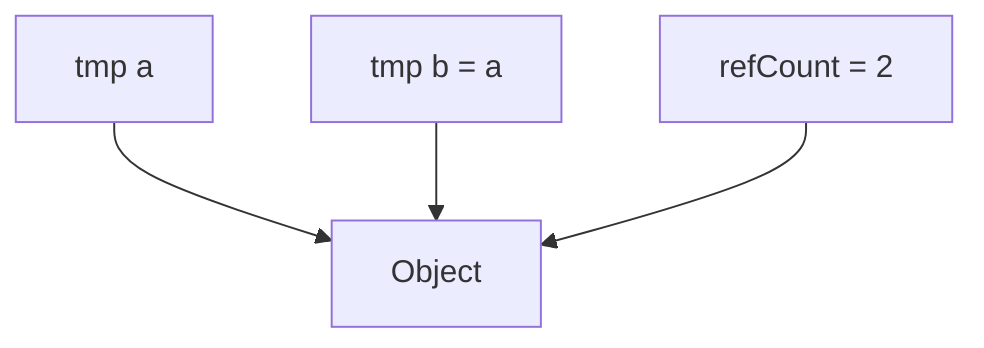

# Memory Internal Mechanics

กลไกภายในของ Memory Management

---

## Overview

> Smart pointers use **reference counting** or **unique ownership**

---

## 1. autoPtr Implementation

```cpp
template<class T>
class autoPtr
{
    T* ptr_;

public:
    autoPtr(T* p = nullptr) : ptr_(p) {}
    ~autoPtr() { delete ptr_; }

    // Move only
    autoPtr(autoPtr&& other) : ptr_(other.ptr_)
    {
        other.ptr_ = nullptr;
    }

    T& operator()() { return *ptr_; }
    bool valid() const { return ptr_ != nullptr; }
};
```

---

## 2. tmp Implementation

```cpp
template<class T>
class tmp
{
    T* ptr_;
    int* refCount_;

public:
    tmp(T* p) : ptr_(p), refCount_(new int(1)) {}

    tmp(const tmp& other)
    : ptr_(other.ptr_), refCount_(other.refCount_)
    {
        ++(*refCount_);
    }

    ~tmp()
    {
        if (--(*refCount_) == 0)
        {
            delete ptr_;
            delete refCount_;
        }
    }
};
```

---

## 3. Reference Counting



- When all references gone → delete object

---

## 4. Move Semantics

```cpp
autoPtr<T> a(new T());
autoPtr<T> b = std::move(a);

// Now:
// a.ptr_ = nullptr
// b.ptr_ = object
```

---

## 5. OpenFOAM tmp Details

- Can hold **pointer** (owns) or **reference** (doesn't own)
- `isTmp()` — check if owns
- `clear()` — release ownership

---

## Quick Reference

| Feature | autoPtr | tmp |
|---------|---------|-----|
| Ownership | Unique | Shared |
| Copy | Move | Ref count |
| Cleanup | On destroy | When count = 0 |

---

## Concept Check

<details>
<summary><b>1. Reference counting ทำงานอย่างไร?</b></summary>

**Count copies**, delete when count reaches 0
</details>

<details>
<summary><b>2. Move semantics ทำอะไร?</b></summary>

**Transfer ownership** without copy, source becomes null
</details>

<details>
<summary><b>3. tmp ต่างจาก shared_ptr อย่างไร?</b></summary>

**tmp** can hold reference (non-owning), shared_ptr always owns
</details>

---

## Related Documents

- **ภาพรวม:** [00_Overview.md](00_Overview.md)
- **Syntax:** [02_Memory_Syntax_and_Design.md](02_Memory_Syntax_and_Design.md)