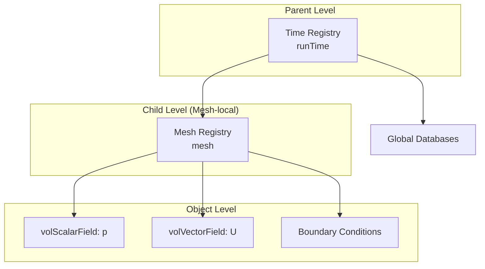
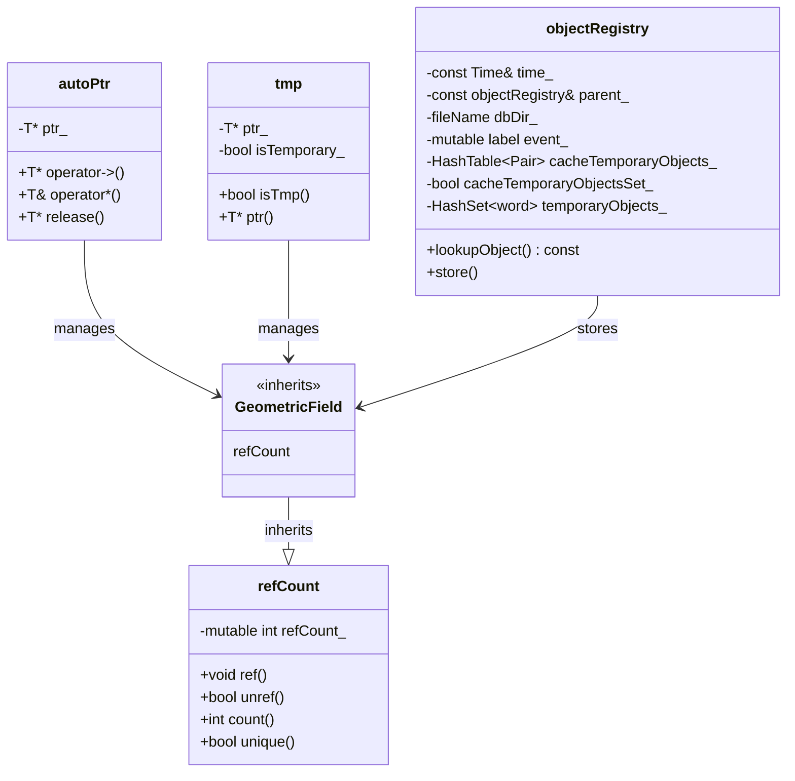

# 03 กลไกภายใน: ตัวแปรสมาชิกและบทบาทหน้าที่

![[pointer_internal_layout.png]]
`A detailed scientific diagram showing the memory layout of autoPtr and tmp. For autoPtr, show a single block containing a pointer to the Managed Object. For tmp, show two blocks: a pointer to the object and a boolean flag (isTemporary_). Show how the Managed Object itself has an internal "refCount_" variable. Use a minimalist palette, scientific textbook diagram, clean vector line art, white background, high definition, flat design, educational infographic --ar 16:9`

## ภาพรวม

บทนี้เจาะลึกเข้าไปใน **internal mechanics** ของระบบจัดการหน่วยความจำของ OpenFOAM โดยตรวจสอบตัวแปรสมาชิกภายในและบทบาทของพวกมันในแต่ละคลาส เราจะวิเคราะห์ว่าแต่ละคลาสจัดเก็บและจัดการออบเจกต์อย่างไร พร้อมด้วยตัวอย่างโค้ดและแผนภาพเพื่อการทำความเข้าใจที่ชัดเจน

---

## 3.1 `autoPtr` – การเป็นเจ้าของแบบเฉพาะ (Exclusive Ownership)

### 3.1.1 ตัวแปรสมาชิกหลัก

คลาสเทมเพลต `autoPtr` ใช้การจัดการหน่วยความจำอัตโนมัติผ่าน pointer ที่เป็นเจ้าของเพียงตัวเดียว ตัวแปรสมาชิกหลักคือ:

```cpp
template<class T>
class autoPtr
{
private:
    T* ptr_;  // Raw pointer to the owned object

public:
    // Constructor and Destructor
    explicit autoPtr(T* p = nullptr) : ptr_(p) {}
    ~autoPtr() { delete ptr_; }

    // Move semantics – transfer ownership
    autoPtr(autoPtr&& other) noexcept : ptr_(other.ptr_)
    { other.ptr_ = nullptr; }

    // Copying is prohibited (prevent double ownership)
    autoPtr(const autoPtr&) = delete;
    autoPtr& operator=(const autoPtr&) = delete;

    // Access operators
    T& operator*() { return *ptr_; }
    T* operator->() { return ptr_; }
    T& operator()() { return *ptr_; }  // OpenFOAM style

    // Release ownership (caller takes responsibility for deletion)
    T* release()
    {
        T* temp = ptr_;
        ptr_ = nullptr;
        return temp;
    }

    // Transfer ownership to another autoPtr
    void transfer(autoPtr<T>& other)
    {
        delete other.ptr_;
        other.ptr_ = ptr_;
        ptr_ = nullptr;
    }
};
```

**💡 คำอธิบาย:**

**📂 Source:** หากคุณต้องการดูต้นฉบับการ implement autoPtr ใน OpenFOAM สามารถตรวจสอบได้จากไฟล์ `src/OpenFOAM/containers/PtrLists/autoPtr/autoPtr.H` ใน source tree ของ OpenFOAM

**🔍 คำอธิบาย:**
- **ptr_**: เป็น raw pointer ที่เก็บที่อยู่ของวัตถุที่ autoPtr เป็นเจ้าของ
- **Destructor**: ทำหน้าที่ลบวัตถุโดยอัตโนมัติเมื่อ autoPtr ถูกทำลาย
- **Move constructor**: ย้ายความเป็นเจ้าของจาก autoPtr หนึ่งไปยังอีกอันหนึ่ง
- **Copy operations ถูกลบออก**: เพื่อป้องกันการมีเจ้าของหลายคนพร้อมกัน

**🎯 Key Concepts:**
- **Exclusive ownership**: มีเจ้าของเพียงคนเดียวตลอดเวลา
- **RAII (Resource Acquisition Is Initialization)**: การจัดการทรัพยากรผ่าน constructor/destructor
- **Move semantics**: การโอนกรรมสิทธิ์โดยไม่ต้องคัดลอกวัตถุ
- **Null after transfer**: pointer จะกลายเป็น null หลังจากโอนกรรมสิทธิ์

### 3.1.2 กลไกการทำงาน

Pointer นี้รักษา **ความเป็นเจ้าของแบบเฉพาะเจาะจง** ของวัตถุที่จัดสรรแบบไดนามิก:

```cpp
// Example usage
autoPtr<volScalarField> pField
(
    new volScalarField
    (
        IOobject("p", runTime.timeName(), mesh),
        mesh
    )
);

// Access via operator()
volScalarField& p = pField();

// Transfer ownership
autoPtr<volScalarField> transferred = pField.transfer();
// Now pField.ptr_ == nullptr

// Release ownership
volScalarField* rawPtr = pField.release();
// Caller takes responsibility: delete rawPtr;
```

**💡 คำอธิบาย:**

**📂 Source:** ตัวอย่างการใช้งาน autoPtr พบได้ทั่วไปใน solvers ของ OpenFOAM เช่น ใน `.applications/solvers/multiphase/multiphaseEulerFoam/` สำหรับจัดการ phase objects

**🔍 คำอธิบาย:**
- **operator()**: อนุญาตให้เข้าถึงวัตถุโดยการ deference pointer
- **transfer()**: โอนกรรมสิทธิ์ไปยัง autoPtr อื่น และตั้งค่า ptr_ เป็น null
- **release()**: คืน raw pointer ให้ผู้เรียก ซึ่งต้องรับผิดชอบการลบวัตถุเอง

**🎯 Key Concepts:**
- **Ownership transfer**: การโอนความเป็นเจ้าของระหว่าง smart pointers
- **Explicit responsibility**: ผู้ใช้ต้องรู้ว่าใครเป็นเจ้าของวัตถุในแต่ละเวลา
- **Null safety**: pointer ที่เป็น null ชี้ว่าไม่มีการเป็นเจ้าของ

### 3.1.3 กฎความเป็นเจ้าของ

`autoPtr` ทำตามกฎความเป็นเจ้าของอย่างเคร่งครัด:

| กฎ | คำอธิบาย | การใช้งาน |
|-----|-----------|-------------|
| **Single Ownership** | มี `autoPtr` เพียงตัวเดียวที่เป็นเจ้าของวัตถุในแต่ละเวลา | ป้องกัน double deletion |
| **Automatic Cleanup** | Destructor ลบวัตถุโดยอัตโนมัติถ้า `ptr_` ไม่ใช่ null | ป้องกัน memory leaks |
| **Move-Only** | สามารถย้ายกรรมสิทธิ์ได้ แต่ไม่สามารถคัดลอกได้ | บังคับใช้ความปลอดภัยในเวลา compile |
| **Null After Transfer** | หลังจาก `release()` หรือ `transfer()` `ptr_` กลายเป็น null | โอนกรรมสิทธิ์อย่างสมบูรณ์ |

เมื่อเรียก `release()` หรือย้าย `autoPtr` ไปยังอีกตัวหนึ่ง `ptr_` จะกลายเป็น null โดยโอนความเป็นเจ้าของอย่างสมบูรณ์

### 3.1.4 การใช้งานในทางปฏิบัติ

`autoPtr` ถูกใช้บ่อยสำหรับ:

```cpp
// Factory patterns
autoPtr<boundaryCondition> bc = boundaryCondition::New(patch);

// Mesh manipulation
autoPtr<polyMesh> modifiedMesh = meshModifier.modify(mesh);

// Model instantiation
autoPtr<turbulenceModel> turb = turbulenceModel::New("turbulence", mesh);

// Solver setup
autoPtr<fvMesh> meshPtr(new fvMesh(io));
fvMesh& mesh = meshPtr();
```

**💡 คำอธิบาย:**

**📂 Source:** ตัวอย่างการใช้ autoPtr ใน factory patterns พบได้ใน `src/turbulenceModels/` และ `src/meshTools/` ของ OpenFOAM

**🔍 คำอธิบาย:**
- **Factory pattern**: ฟังก์ชัน static `New()` สร้างวัตถุและคืนค่าเป็น autoPtr เพื่อให้ผู้เรียกเป็นเจ้าของ
- **Model instantiation**: turbulence models และ physics models ใช้ autoPtr สำหรับการสร้างแบบ polymorphic
- **Solver setup**: การสร้าง mesh และ objects หลักใน solver

**🎯 Key Concepts:**
- **Factory method pattern**: การสร้างวัตถุผ่านฟังก์ชัน static
- **Polymorphism**: การใช้ base class pointer สำหรับ derived classes
- **Object lifecycle**: การควบคุมอายุของวัตถุผ่าน ownership

---

## 3.2 `tmp` – ตัวจัดการชั่วคราวแบบนับ Reference

### 3.2.1 ตัวแปรสมาชิกหลัก

คลาส `tmp` ให้การจัดการวัตถุชั่วคราวขั้นสูงผ่านตัวแปรสมาชิกสองตัวหลัก:

```cpp
template<class T>
class tmp
{
private:
    T* ptr_;           // Pointer to managed object (may be null)
    bool isTemporary_; // Flag that determines reference counting behavior

public:
    // Constructors
    tmp(T* p, bool isTemp = true) : ptr_(p), isTemporary_(isTemp)
    {
        if (ptr_ && isTemporary_) ptr_->ref();
    }

    tmp(const tmp& t) : ptr_(t.ptr_), isTemporary_(t.isTemporary_)
    {
        if (ptr_ && isTemporary_) ptr_->ref();
    }

    tmp(const T& t) : ptr_(const_cast<T*>(&t)), isTemporary_(false)
    {}

    // Destructor
    ~tmp()
    {
        if (ptr_ && isTemporary_)
        {
            if (ptr_->unref()) delete ptr_;
        }
    }

    // Access
    T& operator()() { return *ptr_; }
    const T& operator()() const { return *ptr_; }
    T* operator->() { return ptr_; }
    const T* operator->() const { return ptr_; }

    // Check status
    bool isTmp() const { return isTemporary_; }
    bool valid() const { return ptr_ != nullptr; }
    bool empty() const { return ptr_ == nullptr; }

    // Convert to permanent
    T* ptr()
    {
        isTemporary_ = false;
        return ptr_;
    }
};
```

**💡 คำอธิบาย:**

**📂 Source:** การ implement คลาส tmp พบได้ใน `src/OpenFOAM/containers/Lists/Lists/tmp.H` ใน OpenFOAM source tree

**🔍 คำอธิบาย:**
- **ptr_**: pointer ไปยังวัตถุที่จัดการ อาจเป็น null
- **isTemporary_**: flag ที่ควบคุมว่า tmp จะจัดการอายุการใช้งานของวัตถุหรือไม่
- **Constructor**: เมื่อสร้าง tmp ใหม่ ถ้าเป็น temporary จะเรียก `ref()` เพื่อเพิ่ม reference count
- **Copy constructor**: สำเนา tmp และเพิ่ม reference count ถ้าจำเป็น
- **Destructor**: ลด reference count และลบวัตถุถ้า count ถึง 0

**🎯 Key Concepts:**
- **Reference counting**: การติดตามจำนวนการอ้างอิงถึงวัตถุ
- **Shared ownership**: หลาย tmp สามารถใช้วัตถุเดียวกันได้
- **Lazy evaluation**: การสร้างและจัดการวัตถุเมื่อจำเป็น
- **Null safety**: pointer ที่เป็น null ชี้ว่าไม่มีวัตถุที่จัดการ

### 3.2.2 กลไกการทำงาน

flag `isTemporary_` เป็นกลไกควบคุมที่สำคัญซึ่งกำหนดกลยุทธ์การจัดการอายุการใช้งานของวัตถุ:

#### เมื่อ `isTemporary_ = true` (วัตถุชั่วคราว)

```cpp
tmp<volScalarField> tField(new volScalarField(mesh));
// isTemporary_ = true, refCount = 1

// When copying
tmp<volScalarField> tCopy = tField;
// refCount = 2 (both share the same object)

// When tCopy goes out of scope
// refCount = 1, object not deleted yet

// When tField goes out of scope
// refCount = 0, unref() returns true, delete ptr_
```

**💡 คำอธิบาย:**

**📂 Source:** ตัวอย่างการใช้ tmp ใน field operations พบได้ใน `src/finiteVolume/fields/fvc/fvcGrad.C` และไฟล์ fvc อื่นๆ

**🔍 คำอธิบาย:**
- **refCount tracking**: ทุกครั้งที่สำเนา tmp จะเพิ่ม reference count
- **Shared object**: หลาย tmp ชี้ไปที่วัตถุเดียวกัน
- **Automatic deletion**: วัตถุถูกลบเมื่อ reference count ถึง 0
- **unref() returns true**: บ่งชี้ว่าควรลบวัตถุ

**🎯 Key Concepts:**
- **Reference lifecycle**: วัตถุมีอยู่ตราบใดที่มีการอ้างอิง
- **Shared ownership**: หลาย tmp ร่วมเป็นเจ้าของวัตถุเดียวกัน
- **Automatic cleanup**: การลบเมื่อไม่มีการอ้างอิงเหลือ

วัตถุเข้าร่วมในระบบการนับการอ้างอิงของ OpenFOAM:
- Destructor เรียก `unref()` บนวัตถุ
- การลบเกิดขึ้นเมื่อจำนวนการอ้างอิงถึงศูนย์เท่านั้น

#### เมื่อ `isTemporary_ = false` (วัตถุถาวร)

```cpp
volScalarField& p = mesh.lookupObject<volScalarField>("p");
tmp<volScalarField> tP(p);  // isTemporary_ = false

// When tP goes out of scope
// Does not call unref(), does not delete object
// Object is managed by objectRegistry
```

**💡 คำอธิบาย:**

**📂 Source:** ตัวอย่างการใช้ tmp กับ existing objects พบได้ใน solver codes เช่น `rhoCentralFoam.C` ใน `.applications/solvers/compressible/`

**🔍 คำอธิบาย:**
- **Reference wrapper**: tmp ทำหน้าที่เป็น wrapper สำหรับ reference ถึงวัตถุที่มีอยู่
- **No lifecycle management**: ไม่เรียก `unref()` หรือลบวัตถุ
- **External ownership**: objectRegistry หรือโค้ดอื่นเป็นเจ้าของจริง
- **Temporary convenience**: tmp ใช้สำหรับ interface ที่สม่ำเสมอ

**🎯 Key Concepts:**
- **Non-owning reference**: tmp ไม่เป็นเจ้าของวัตถุ
- **Registry management**: objectRegistry จัดการอายุการใช้งาน
- **Unified interface**: tmp ใช้ได้ทั้งกับ temporary และ permanent objects
- **No overhead**: ไม่มี reference counting overhead สำหรับ permanent objects

วัตถุถูกจัดการเป็นภายนอก:
- Destructor ไม่เรียก `unref()`
- ไม่ลบวัตถุ
- ปล่อยให้การจัดการอายุการใช้งานเป็นของโค้ดภายนอก

### 3.2.3 การใช้งานในทางปฏิบัติ

การออกแบบนี้อนุญาตให้ `tmp` จัดการทั้งวัตถุชั่วคราวและการอ้างอิงถึงวัตถุที่มีอยู่:

```cpp
// Case 1: Create temporary field
tmp<volVectorField> gradU = fvc::grad(U);
// isTemporary_ = true, will be auto-deleted

// Case 2: Reference existing field
tmp<volScalarField> tp(p);
// isTemporary_ = false, will not be deleted

// Case 3: Evaluate expression
tmp<volScalarField> energyDensity =
    0.5 * rho * magSqr(U) + rho * g * h;
// Multiple temporaries created and managed efficiently

// Case 4: Use in solver
tmp<surfaceScalarField> rAUf = fvc::interpolate(rAU);
phi *= rAUf();  // Use value, rAUf will be deleted after this
```

**💡 คำอธิบาย:**

**📂 Source:** ตัวอย่างการใช้งาน tmp ใน solver expressions พบได้ใน `.applications/solvers/multiphase/multiphaseEulerFoam/phaseSystems/PhaseSystems/MomentumTransferPhaseSystem/`

**🔍 คำอธิบาย:**
- **fvc::grad()**: สร้าง temporary field จาก gradient calculation
- **Reference wrapper**: `tmp(p)` สร้าง tmp ที่ไม่เป็นเจ้าของ
- **Expression chaining**: นิพจน์ซับซ้อนสร้าง temporaries หลายตัว
- **Automatic cleanup**: temporaries ถูกลบเมื่อไม่ใช้งาน

**🎯 Key Concepts:**
- **Expression templates**: การประเมินนิพจน์อย่างมีประสิทธิภาพ
- **Temporary elision**: การลด temporaries โดย compiler
- **Lifetime extension**: tmp ขยายอายุของ temporary objects
- **RAII**: การจัดการทรัพยากรอัตโนมัติ

---

## 3.3 `refCount` – รากฐานการนับ Reference

### 3.3.1 ตัวแปรสมาชิก

การนับการอ้างอิงใน OpenFOAM ถูก implement ผ่านคลาสฐาน `refCount`:

```cpp
class refCount
{
private:
    mutable int refCount_;  // Reference counter

public:
    // Constructor
    refCount() : refCount_(0) {}

    // Virtual destructor
    virtual ~refCount() {}

    // Add reference
    void ref() const
    {
        refCount_++;
    }

    // Remove reference
    // Returns true if object should be deleted (refCount reaches 0)
    bool unref() const
    {
        if (refCount_ == 0)
        {
            FatalErrorIn("refCount::unref()")
                << "refCount_ is already zero"
                << abort(FatalError);
        }
        return --refCount_ == 0;
    }

    // Check reference count
    int count() const { return refCount_; }

    // Check if unique owner
    bool unique() const { return refCount_ == 1; }

    // Check if no owner
    bool empty() const { return refCount_ == 0; }
};
```

**💡 คำอธิบาย:**

**📂 Source:** คลาส refCount พบได้ใน `src/OpenFOAM/db/IOobject/regIOobject/refCount.H` ใน OpenFOAM source tree

**🔍 คำอธิบาย:**
- **refCount_**: ตัวนับจำนวนการอ้างอิงถึงวัตถุ
- **mutable**: อนุญาตให้เปลี่ยนแปลงแม้ใน const context
- **ref()**: เพิ่ม reference count เมื่อมีการใช้งานใหม่
- **unref()**: ลด reference count และคืนค่า true ถ้าควรลบวัตถุ
- **Error checking**: ป้องกันการเรียก unref() เมื่อ count เป็น 0 แล้ว

**🎯 Key Concepts:**
- **Reference counting**: การติดตามจำนวนผู้ใช้ร่วม
- **Shared ownership**: หลายส่วนสามารถใช้วัตถเดียวกัน
- **Thread safety**: ในบาง implementations มีการใช้ atomic operations
- **Object lifecycle**: วัตถุมีอยู่ตราบใดที่มีการอ้างอิง

### 3.3.2 กฎวงจรชีวิต

ตัวนับการอ้างอิงทำตามกฎวงจรชีวิตเหล่านี้:

```mermaid
graph LR
    A[สร้างวัตถุ<br/>refCount = 0] --> B[ref()<br/>refCount++]
    B --> C[ใช้งานวัตถุ<br/>refCount > 0]
    C --> D[unref()<br/>refCount--]
    D --> E{refCount == 0?}
    E -->|No| C
    E -->|Yes| F[ลบวัตถุ<br/>return true]
```

| ขั้นตอน | Operation | refCount | ผลลัพธ์ |
|---------|-----------|----------|---------|
| 1 | เริ่มต้น | 0 | วัตถุมีอยู่แต่ไม่มีเจ้าของ |
| 2 | `ref()` | 1 | มีเจ้าของ 1 ราย |
| 3 | `ref()` | 2 | มีเจ้าของ 2 ราย |
| 4 | `unref()` | 1 | เหลือเจ้าของ 1 ราย |
| 5 | `unref()` | 0 | **ควรลบวัตถุ** |

### 3.3.3 คีย์เวิร์ด `mutable`

คีย์เวิร์ด `mutable` อนุญาตให้มีการนับการอ้างอิงแม้สำหรับวัตถุ const:

```cpp
const volVectorField& U = mesh.lookupObject<volVectorField>("U");
// U is a const reference

tmp<volScalarField> magU = mag(U);
// Need to increment refCount of U for tmp
// mutable allows refCount_ to be modified
// even though U is const
```

**💡 คำอธิบาย:**

**📂 Source:** ตัวอย่างการใช้งาน const references กับ tmp พบได้ใน field operations ทั่วไปใน `src/finiteVolume/`

**🔍 คำอธิบาย:**
- **Logical constness**: วัตถุ const ทางตรรกะ แต่ต้องการเปลี่ยน reference count
- **Mutable keyword**: อนุญาตให้เปลี่ยนสมาชิก mutable ใน const methods
- **Reference counting**: เป็น operation ภายใน ไม่เปลี่ยนความหมายของวัตถุ
- **Thread safety considerations**: ในสภาพแวดล้อมแบบขนานอาจต้องใช้ synchronization

**🎯 Key Concepts:**
- **Mutable members**: สมาชิกที่เปลี่ยนแปลงได้ใน const context
- **Logical vs physical constness**: ความหมายที่แตกต่างของความคงทน
- **Implementation detail**: reference counting เป็นรายละเอียดภายใน
- **Const correctness**: การรักษาความปลอดภัยของ const ในระดับ API

จำเป็นเนื่องจากวัตถุ const ยังสามารถมีการจัดการอายุการใช้งานผ่านการอ้างอิงได้

---

## 3.4 `objectRegistry` – ฐานข้อมูลกลาง

### 3.4.1 ตัวแปรสมาชิกหลัก

`objectRegistry` ทำหน้าที่เป็นระบบจัดการวัตถุกลางของ OpenFOAM:

```cpp
class objectRegistry
    : public regIOobject,
      public HashTable<regIOobject*>
{
private:
    // Hierarchical components
    const Time& time_;                              // Reference to main time object
    const objectRegistry& parent_;                  // Reference to parent registry
    fileName dbDir_;                                // Database directory path

    // Change management system
    mutable label event_;                           // Change notification counter

    // Temporary object management
    HashTable<Pair<bool>> cacheTemporaryObjects_;   // Cache temporary objects
    bool cacheTemporaryObjectsSet_;                 // Cache initialization flag
    HashSet<word> temporaryObjects_;                // Temporary object name set

public:
    // Constructors
    objectRegistry(const Time& t, const label n = 128);
    objectRegistry(const objectRegistry&, const label n = 128);

    // Lookup and storage
    template<class Type>
    const Type& lookupObject(const word& name) const;

    template<class Type>
    Type& lookupObjectRef(const word& name);

    template<class Type>
    Type& store(autoPtr<Type>&);

    bool checkOut(regIOobject&) const;

    // Event management
    label event() const { return event_; }
    label& event() { return event_; }
    void incEvent() { event_++; }

    // Temporary object management
    const HashSet<word>& temporaryObjects() const
    { return temporaryObjects_; }

    void setCacheTemporaryObjects(bool b)
    { cacheTemporaryObjectsSet_ = true; }
};
```

**💡 คำอธิบาย:**

**📂 Source:** คลาส objectRegistry พบได้ใน `src/OpenFOAM/db/objectRegistry/objectRegistry.H` ใน OpenFOAM source tree

**🔍 คำอธิบาย:**
- **time_**: อ้างอิงถึง Time object หลัก เป็นรากของ registry hierarchy
- **parent_**: อ้างอิงถึง parent registry (เช่น mesh registry มี Time เป็น parent)
- **dbDir_**: เส้นทางไดเรกทอรีสำหรับ I/O operations
- **event_**: ตัวนับสำหรับติดตามการเปลี่ยนแปลงใน registry
- **cacheTemporaryObjects_**: hash table สำหรับแคช temporary objects
- **HashTable inheritance**: objectRegistry สืบทอดจาก HashTable เพื่อการจัดเก็บวัตถุ

**🎯 Key Concepts:**
- **Centralized storage**: จัดเก็บ objects ทั้งหมดในที่เดียว
- **Hierarchical organization**: โครงสร้าง tree ของ registries
- **Object lookup**: การค้นหา objects โดยใช้ชื่อ
- **Change notification**: การติดตามการเปลี่ยนแปลงใน registry
- **Lifetime management**: จัดการอายุการใช้งานของ objects

### 3.4.2 ส่วนประกอบลำดับชั้นหลัก



| สมาชิก | ประเภท | บทบาท |
|---------|-------|--------|
| **`time_`** | `const Time&` | อ้างอิงถึงวัตถุ `Time` หลัก สถาปนารากของต้นไม้รีจิสทรีและให้การเข้าถึงเวลาจำลองส่วนกลาง |
| **`parent_`** | `const objectRegistry&` | เปิดใช้งานโครงสร้างรีจิสทรีลำดับชั้น (เช่น รีจิสทรี mesh มีหลักเป็นรีจิสทรี `Time`) |
| **`dbDir_`** | `fileName` | เก็บเส้นทางระบบไฟล์สำหรับการดำเนินงาน I/O เทียบกับไดเรกทอรีกรณี |

### 3.4.3 ระบบจัดการการเปลี่ยนแปลง

| สมาชิก | ประเภท | บทบาท |
|---------|-------|--------|
| **`event_`** | `mutable label` | ตัวนับที่เพิ่มขึ้นซึ่งติดตามการเพิ่ม/ลบวัตถุ อนุญาตให้ตรวจจับการเปลี่ยนแปลงอย่างมีประสิทธิภาพโดยไม่ต้องสแกนรีจิสทรีแบบมีราคาแพง |
| **`mutable`** | keyword | เปิดใช้งานการติดตาม event แม้สำหรับการเข้าถึงรีจิสทรี const |

ตัวอย่างการใช้งาน:

```cpp
// Check if object has changed
label currentEvent = mesh.thisDb().event();
if (currentEvent != lastEvent)
{
    // Object changed, need to update cache
    updateCache();
    lastEvent = currentEvent;
}
```

**💡 คำอธิบาย:**

**📂 Source:** การใช้ event tracking พบได้ใน mesh operations และ solver loops ทั่วไปใน OpenFOAM

**🔍 คำอธิบาย:**
- **Event counter**: เพิ่มขึ้นเมื่อมีการเปลี่ยนแปลงใน registry
- **Cache invalidation**: ใช้สำหรับ invalidate cache เมื่อ objects เปลี่ยน
- **Efficient tracking**: หลีกเลี่ยงการสแกน registry ทั้งหมด
- **Const access**: mutable อนุญาตให้ติดตาม events ใน const context

**🎯 Key Concepts:**
- **Change notification**: การแจ้งเตือนการเปลี่ยนแปลง
- **Cache coherence**: การรักษาความสอดคล้องของ cache
- **Lazy evaluation**: ประเมินค่าใหม่เมื่อจำเป็น
- **Performance optimization**: ลด overhead ของการตรวจสอบการเปลี่ยนแปลง

### 3.4.4 การจัดการวัตถุชั่วคราว

| สมาชิก | ประเภท | บทบาท |
|---------|-------|--------|
| **`cacheTemporaryObjects_`** | `HashTable<Pair<bool>>` | Hash table แมปชื่อวัตถุไปยังสถานะแคชและสถานะความชั่วคราว |
| **`cacheTemporaryObjectsSet_`** | `bool` | Flag boolean แสดงว่ามีการอ่านการตั้งค่าแคชจาก control dictionary หรือไม่ |
| **`temporaryObjects_`** | `HashSet<word>` | ชุดชื่อวัตถุชั่วคราวที่สะสมใช้สำหรับผลลัพธ์การวินิจฉัยและการดีบัก |

### 3.4.5 การใช้งานในทางปฏิบัติ

สถาปัตยกรรมนี้ให้:

```cpp
// 1. Efficient object lookup
const volScalarField& p = mesh.thisDb().lookupObject<volScalarField>("p");

// 2. Hierarchical organization
Time& runTime = runTime_;
objectRegistry& meshRegistry = mesh.thisDb();
objectRegistry& timeRegistry = runTime_;

// 3. Advanced temporary object management
tmp<volScalarField> tTemp = ...;
mesh.thisDb().store(tTemp.ptr());  // Convert to permanent

// 4. Change tracking
mesh.thisDb().incEvent();  // Notify that change occurred
```

**💡 คำอธิบาย:**

**📂 Source:** ตัวอย่างการใช้งาน objectRegistry พบได้ใน solvers และ utilities ทั่วทั้ง OpenFOAM เช่นใน multiphaseEulerFoam

**🔍 คำอธิบาย:**
- **lookupObject()**: ค้นหา objects โดยชื่อและประเภท ด้วย type safety
- **Hierarchical access**: thisDb() ให้การเข้าถึง registry ของ object
- **store()**: แปลง autoPtr/tmp objects เป็น permanent ใน registry
- **Event tracking**: incEvent() แจ้งการเปลี่ยนแปลงให้ observers ทราบ

**🎯 Key Concepts:**
- **Centralized object management**: จัดการ objects ในที่เดียว
- **Type-safe lookup**: การค้นหาที่มีการตรวจสอบประเภท
- **Hierarchical namespaces**: การจัดระเบียบ objects แบบลำดับชั้น
- **Permanent storage**: การจัดเก็บ objects ระยะยาว

---

## 3.5 การเปรียบเทียบตัวแปรสมาชิกทั้งหมด

### 3.5.1 ตารางสรุป

| คลาส | ตัวแปรหลัก | ประเภท | บทบาท |
|-------|--------------|-------|--------|
| **`autoPtr`** | `ptr_` | `T*` | Raw pointer ไปยังวัตถุที่เป็นเจ้าของแบบเฉพาะ |
| **`tmp`** | `ptr_` | `T*` | Pointer ไปยังวัตถุ (อาจเป็น null) |
| | `isTemporary_` | `bool` | Flag ควบคุมการนับ reference |
| **`refCount`** | `refCount_` | `mutable int` | ตัวนับการอ้างอิง |
| **`objectRegistry`** | `time_` | `const Time&` | การอ้างอิงวัตถุเวลาหลัก |
| | `parent_` | `const objectRegistry&` | การอ้างอิงรีจิสทรีหลัก |
| | `dbDir_` | `fileName` | เส้นทางไดเรกทอรีฐานข้อมูล |
| | `event_` | `mutable label` | ตัวนับการแจ้งการเปลี่ยนแปลง |
| | `cacheTemporaryObjects_` | `HashTable<Pair<bool>>` | แคชวัตถุชั่วคราว |
| | `cacheTemporaryObjectsSet_` | `bool` | Flag การเริ่มต้นแคช |
| | `temporaryObjects_` | `HashSet<word>` | ชุดชื่อวัตถุชั่วคราว |

### 3.5.2 แผนภาพความสัมพันธ์



---

## 3.6 สรุป

ตัวแปรสมาชิกภายในของระบบจัดการหน่วยความจำของ OpenFOAM แต่ละตัวมีบทบาทสำคัญ:

1. **`autoPtr::ptr_`** – pointer เดี่ยวสำหรับการเป็นเจ้าของแบบเฉพาะ
2. **`tmp::ptr_` และ `isTemporary_`** – คู่ pointer-flag สำหรับการจัดการวัตถุชั่วคราวและถาวร
3. **`refCount::refCount_`** – ตัวนับการอ้างอิงสำหรับการแชร์ที่ปลอดภัย
4. **`objectRegistry` members** – ระบบฐานข้อมูลสำหรับการจัดระเบียบและการค้นหา

การออกแบบนี้ให้สถาปัตยกรรมการจัดการหน่วยความจำที่แข็งแกร่ง ซึ่งจัดการรูปแบบการเป็นเจ้าของที่ซับซ้อน ให้การเข้าถึงออบเจกต์ที่มีประสิทธิภาพ และรักษาความปลอดภัยในสภาพแวดล้อมแบบขนาน—ทั้งหมดนี้ในขณะที่นำเสนออินเทอร์เฟซที่สะอาดและใช้งานง่าย

ในบทถัดไป เราจะตรวจสอบว่ากลไกเหล่านี้ทำงานร่วมกันอย่างไรในการจัดการหน่วยควาจำแบบ end-to-end