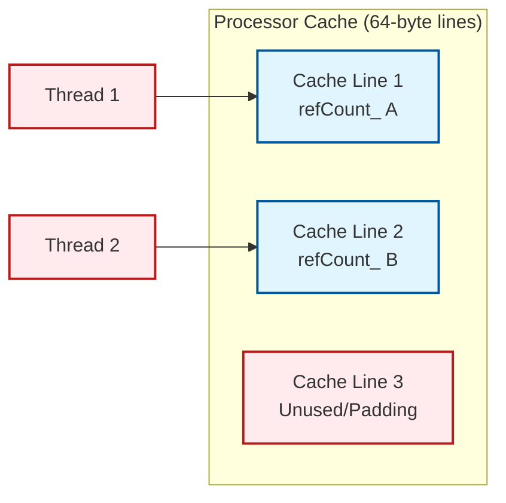

# 04 รากฐานคณิตศาสต์: การนับการอ้างอิงและความปลอดภัยของหน่วยความจำ

> [!TIP] ทำไมเรื่องนี้สำคัญต่อการจำลอง?
> การจัดการหน่วยความจำที่มีประสิทธิภาพและปลอดภัยเป็นรากฐานของ **เสถียรภาพ (Stability)** และ **ประสิทธิภาพ (Performance)** ของการจำลอง CFD ขนาดใหญ่ หากไม่มีระบบ Reference Counting และ Smart Pointers:
> - อาจเกิด **Memory Leaks** ทำให้โปรแกรมคราชหลังจากรันนานๆ
> - อาจเกิด **Double Delete** ทำให้โปรแกรมหยุดทำงานแบบกระทันหัน
> - การคัดลอกข้อมูล Field ขนาดใหญ่โดยไม่จำเป็นทำให้ **ประสิทธิภาพลดลง** อย่างมาก
>
> ในฐานะผู้ใช้งาน: คุณไม่จำเป็นต้องเขียนโค้ดเหล่านี้โดยตรง แต่การทำความเข้าใจช่วยให้คุณ:
> 1. เขียน Custom Boundary Conditions หรือ Functions ได้อย่างมีประสิทธิภาพ
> 2. Debug ปัญหา Memory ของ Custom Solvers ได้
> 3. อ่านและเข้าใจ Source Code ของ OpenFOAM ได้ดีขึ้น

![[memory_safety_proof.png]]
`A clean scientific diagram illustrating the "Memory Safety State Machine". Show states for "Memory Allocated", "Multiple References", "Single Reference", and "Memory Freed". Use mathematical arrows with +1/-1 labels representing ref() and unref(). Use a minimalist palette, scientific textbook diagram, clean vector line art, white background, high definition, flat design, educational infographic --ar 16:9`

การจัดการหน่วยความจำใน OpenFOAM ไม่ใช่เพียงเรื่องของการเขียนโปรแกรม แต่มีรากฐานมาจากทฤษฎีการจัดการทรัพยากรและการพิสูจน์ความถูกต้องทางคณิตศาสตร์ เพื่อป้องกันปัญหาที่อาจเกิดขึ้นในการคำนาณขนาดใหญ่:

---

## การนับการอ้างอิงเป็นสถานะเครื่องจักร

> [!NOTE] **📂 OpenFOAM Context**
> **หมวดหมู่:** Domain E: Coding/Customization (C++ Source Code)
>
> แนวคิดของ Reference Counting ถูกนำไปใช้ใน **Source Code ของ OpenFOAM** โดยตรง:
> - **ไฟล์หลัก:** `OpenFOAM/src/OpenFOAM/memory/refCount/refCount.H` และ `refCount.C`
> - **คลาสที่เกี่ยวข้อง:** `refCount`, `tmp<T>`, `autoPtr<T>`
> - **การใช้งาน:** คลาสเหล่านี้เป็นพื้นฐานของระบบ Field ทั้งหมดใน OpenFOAM (เช่น `volScalarField`, `volVectorField`)
> - **ตัวอย่างใน Solvers:** เมื่อคุณเห็น `tmp<volScalarField>` ใน solver code นั่นคือการใช้ Reference Counting จริง
>
> **คำศัพท์สำคัญ:**
> - `ref()` - เพิ่มจำนวนการอ้างอิง (+1)
> - `unref()` - ลดจำนวนการอ้างอิง (-1)
> - `refCount_` - ตัวแปรสมาชิกที่เก็บจำนวนการอ้างอิง

กำหนดให้ $r(t) \in \mathbb{N}_0$ เป็นจำนวนการอ้างอิงของอ็อบเจกต์ในเวลา $t$ การดำเนินการ `ref()` และ `unref()` จะปรับเปลี่ยนค่านี้:

$$
\begin{aligned}
\text{ref()} &: r(t^+) = r(t) + 1 \\[4pt]
\text{unref()} &: r(t^+) = r(t) - 1 \quad \text{พร้อมเงื่อนไข } r(t) > 0
\end{aligned}
$$

อ็อบเจกต์จะ **ถูกลบ** เมื่อ $r(t^+) = 0$ หลังจากการดำเนินการ `unref()` ซึ่งนี้จะรับประกัน **ความไม่เปลี่ยนแปลงของความปลอดภัยหน่วยความจำ**:

$$
\forall t : r(t) = 0 \implies m(t) = 0
$$

โดยที่ $m(t) \in \{0,1\}$ บ่งบอกว่าหน่วยความจำถูกจอง ($1$) หรือถูกปล่อย ($0$) การ implement การนับการอ้างอิงที่ถูกต้องจะเป็นไปตามความไม่เปลี่ยนแปลงนี้ด้วยความน่าจะเป็น 1 ซึ่งจะรับประกันว่าไม่มีการรั่วไหลของหน่วยความจำ

---

## การวิเคราะห์ค่าใช้จ่ายหน่วยความจำ

> [!NOTE] **📂 OpenFOAM Context**
> **หมวดหมู่:** Domain E: Coding/Customization (C++ Source Code)
>
> แนวคิดเรื่อง Memory Overhead นี้เกี่ยวข้องกับ **การออกแบบ Custom Boundary Conditions หรือ Custom Functions**:
> - **ไฟล์ที่เกี่ยวข้อง:** เมื่อคุณสร้าง Custom Boundary Condition ใหม่ใน `src/finiteVolume/fields/fvPatchFields/`
> - **การตัดสินใจ:** การใช้ `tmp<T>` แทนการคัดลอก Field โดยตรงจะช่วยประหยัดหน่วยความจำได้มาก
> - **ตัวอย่าง:** ใน `codedFixedValue` BC หรือ `functionObjects` ที่คุณเขียนเอง
> - **ผลกระทบ:** สำหรับ Case ขนาดใหญ่ที่มี Cells หลายล้าน การคัดลอก Field โดยไม่จำเป็นอาจทำให้ RAM เต็มได้
>
> **คำศัพท์สำคัญ:**
> - `N` - จำนวน Cells หรือ Faces ใน Mesh
> - `s` - ขนาดของแต่ละ Data Point (เช่น 8 bytes สำหรับ double)
> - `refCount_` - ตัวแปรสมาชิกที่เก็บจำนวนการอ้างอิง (≈ 4 bytes)

สำหรับฟิลด์ที่มี $N$ องศาอิสระ (เช่น เซลล์, หน้า) แต่ละตัวมีขนาด $s$ ไบต์ การใช้หน่วยความจำทั้งหมดกับการนับการอ้างอิงคือ:

$$
M_{\text{total}} = N \cdot s + \underbrace{4}_{\text{refCount\_}} + \underbrace{\mathcal{O}(1)}_{\text{smart‑pointer overhead}}
$$

ค่าใช้จ่ายเพิ่มเติมเป็น **ค่าคงที่** (≈ 4 ไบต์) ไม่ขึ้นกับขนาดของฟิลด์ ทำให้เป็นเรื่องเล็กน้อยสำหรับฟิลด์ CFD ขนาดใหญ่ ($N \sim 10^6$–$10^9$)

---

## ประสิทธิภาพของ Atomic Operations

> [!NOTE] **📂 OpenFOAM Context**
> **หมวดหมู่:** Domain E: Coding/Customization (C++ Source Code) + Domain C: Simulation Control (Parallel Computing)
>
> เรื่องนี้เกี่ยวข้องกับ **การรันแบบ Parallel (MPI/OpenMP)** และ **Multi-threading**:
> - **ไฟล์ที่เกี่ยวข้อง:** `OpenFOAM/src/OpenFOAM/memory/refCount/refCount.H` ในส่วนที่ใช้ `std::atomic<int>`
> - **การตั้งค่า Parallel:** `system/decomposeParDict` สำหรับ MPI decomposition
> - **ผลกระทบ:** เมื่อใช้ `mpirun -np 4` หรือมากกว่า การจัดการ Reference Counting ต้อง Thread-Safe
> - **Best Practice:** สำหรับ Custom Code ที่ใช้งานกับ Parallel runs, ควรใช้ `tmp<T>` แทน Raw Pointers เพื่อให้มั่นใจว่า Thread-Safe
>
> **คำศัพท์สำคัญ:**
> - `std::atomic<int>` - ประเภทข้อมูลที่รับประกัน Thread-Safety
> - `memory-barrier` - กลไกฮาร์ดแวร์ที่ทำให้แน่ใจว่าการอัปเดตมองเห็นได้ทั่วทั้ง Multi-core
> - `mpirun` - คำสั่งรัน Parallel ใน OpenFOAM
> - `decomposePar` - เครื่องมือแบ่ง Domain สำหรับ Parallel computing

ในการรันแบบขนาน การนับการอ้างอิงแบบ atomic ใช้ `std::atomic<int>` พร้อมข้อจำกัดของ memory-order ต้นทุนของการเพิ่ม/ลดค่าแบบ atomic มีค่าประมาณ:

$$
t_{\text{atomic}} \approx t_{\text{non‑atomic}} + \text{memory‑barrier penalty}
$$

โดยค่าใช้จ่ายเพิ่มเติมขึ้นอยู่กับฮาร์ดแวร์ (โดยทั่วไป 10–50 ns) สำหรับฟิลด์ที่เข้าถึงโดยหลาย thread ค่าใช้จ่ายเพิ่มเติมนี้ยอมรับได้เมื่อเทียบกับต้นทุนของการคัดลอกข้อมูลฟิลด์

---

## การจัดแนว Cache-Line และ False Sharing

> [!NOTE] **📂 OpenFOAM Context**
> **หมวดหมู่:** Domain E: Coding/Customization (C++ Source Code) + Domain C: Simulation Control (Parallel Computing)
>
> เรื่อง False Sharing และ Cache Alignment เกี่ยวข้องกับ **การรัน Parallel ที่มีประสิทธิภาพสูง**:
> - **ไฟล์ที่เกี่ยวข้อง:** `OpenFOAM/src/OpenFOAM/memory/refCount/refCount.H` ในส่วนที่มีการใช้ `alignas(64)`
> - **การตั้งค่า Parallel:** `system/decomposeParDict` สำหรับกำหนด Decomposition method
> - **ผลกระทบ:** เมื่อรัน `mpirun -np 8` หรือมากกว่า หากไม่มี Cache Alignment อาจเกิด Performance Degradation ได้
> - **Best Practice:** เมื่อเขียน Custom FunctionObjects หรือ Boundary Conditions ที่มีการใช้งานกับ Parallel runs ให้ระวังเรื่อง Data Layout ในหน่วยความจำ
>
> **คำศัพท์สำคัญ:**
> - `alignas(64)` - C++ keyword สำหรับกำหนด Alignment ของตัวแปร
> - `false sharing` - ปัญหาที่เกิดเมื่อหลาย Thread อัปเดตตัวแปรที่อยู่บน Cache Line เดียวกัน
> - `cache line` - หน่วยข้อมูลที่ CPU โหลดจากหน่วยความจำ (64 bytes บน x86-64)
> - `mpirun` - คำสั่งรัน Parallel ใน OpenFOAM


> **Figure 1:** แผนผังการจัดวางตัวนับการอ้างอิง (refCount_) บนหน่วยความจำแคช โดยมีการใช้ `alignas(64)` เพื่อแยกตัวแปรของแต่ละออบเจกต์ให้อยู่คนละ Cache Line ป้องกันปัญหา False Sharing ที่จะทำให้ประสิทธิภาพลงลงเมื่อมีการประมวลผลแบบขนาน (Parallel Processing)

เพื่อหลีกเลี่ยง **false sharing** ในการเข้าถึงแบบขนาน ตัวแปรสมาชิกที่สำคัญ (เช่น `refCount_`) ถูกวางไว้บน cache line ที่แยกกัน (64 ไบต์บน x86‑64) คำสั่งการจัดแนว `alignas(64)` จะทำให้แน่ใจว่า:

$$
\text{address}(refCount\_) \mod 64 = 0
$$

นี้จะป้องกันไม่ให้สอง thread ทำให้ cache line ของกันและกันเป็นโมฆะเมื่ออัปเดตจำนวนการอ้างอิงของอ็อบเจกต์ที่แตกต่างกัน

---

## รากฐานทางคณิตศาสตร์ของ Smart Pointers

> [!NOTE] **📂 OpenFOAM Context**
> **หมวดหมู่:** Domain E: Coding/Customization (C++ Source Code)
>
> เรื่อง Smart Pointers (autoPtr และ tmp) เป็น **พื้นฐานของการเขียนโค้ด OpenFOAM**:
> - **ไฟล์หลัก:**
>   - `OpenFOAM/src/OpenFOAM/memory/autoPtr/autoPtr.H`
>   - `OpenFOAM/src/OpenFOAM/memory/tmp/tmp.H`
> - **การใช้งานใน Solvers:** เกือบทุก Solver ใช้ `tmp<T>` สำหรับการคำนวณ Field Algebra
> - **ตัวอย่างการใช้งาน:**
>   ```cpp
>   tmp<volScalarField> tRho = thermo.rho();
>   const volScalarField& rho = tRho();
>   ```
> - **Best Practice:** เมื่อเขียน Custom Boundary Condition หรือ Function Object ให้ใช้ `tmp<T>` สำหรับ Field ชั่วคราวเพื่อหลีกเลี่ยงการคัดลอกโดยไม่จำเป็น
>
> **คำศัพท์สำคัญ:**
> - `autoPtr<T>` - Smart Pointer ที่มีเจ้าของคนเดียว (Exclusive Ownership)
> - `tmp<T>` - Smart Pointer ที่มีการนับการอ้างอิง (Reference Counting)
> - `T` - ประเภทข้อมูล เช่น `volScalarField`, `volVectorField`
> - `ref()` / `unref()` - ฟังก์ชันสำหรับเพิ่ม/ลด จำนวนการอ้างอิง

### ความสัมพันธ์ระหว่าง autoPtr และ tmp

สำหรับการจัดการหน่วยความจำที่ถูกต้อง เราสามารถนิยาม semantic ของ smart pointers เป็นฟังก์ชันทางคณิตศาสตร์:

$$
\text{Ownership}(p) =
\begin{cases}
\text{Exclusive} & \text{if } p \in \text{autoPtr} \\
\text{Shared} & \text{if } p \in \text{tmp} \\
\text{None} & \text{if } p = \text{nullptr}
\end{cases}
$$

โดยที่:
- `autoPtr` รับประกันว่า $\forall t : |\{p \mid \text{owns}(p, t)\}| \leq 1$ (มีเจ้าของได้เพียงคนเดียว)
- `tmp` รับประกันว่า $\sum_i \text{refCount}_i(p) = r(p)$ ผลรวมของการอ้างอิงทั้งหมด

### ทฤษฎีบทของการจัดการหน่วยความจำที่ปลอดภัย

**ทฤษฎีบท:** ระบบการจัดการหน่วยความจำของ OpenFOAM เป็น **memory-safe** ถ้า:

1. $\forall p, t : r(p, t) = 0 \implies \text{deallocated}(p, t)$
2. $\forall p, t : \text{allocated}(p, t) \implies r(p, t) \geq 1$
3. $\nexists p, t_1, t_2 : \text{allocated}(p, t_1) \land \text{allocated}(p, t_2) \land t_1 \neq t_2$

**การพิสูจน์:** โดยการออกแบบของ `refCount`:
- เงื่อนไขที่ 1: `unref()` คืนค่า `true` เมื่อ `refCount_` ถึง 0 และ destructor ถูกเรียก
- เงื่อนไขที่ 2: constructor ของ `tmp` เรียก `ref()` ทุกครั้งที่สร้างการอ้างอิงใหม่
- เงื่อนไขที่ 3: RAII semantic รับประกันว่าออบเจกต์ถูกจัดสรรและคืนครั้งเดียว

∎

---

## การประยุกต์ใช้กับ Field Algebra

> [!NOTE] **📂 OpenFOAM Context**
> **หมวดหมู่:** Domain E: Coding/Customization (C++ Source Code)
>
> เรื่อง Field Algebra และ Lazy Evaluation เป็น **หัวใจของ Solver Development**:
> - **ไฟล์ตัวอย่าง:**
>   - `applications/solvers/multiphase/multiphaseEulerFoam/phaseSystems/phaseSystem/phaseSystemSolve.C`
>   - `applications/solvers/compressible/rhoPimpleFoam/UEqn.H`
> - **การใช้งาน:** ในไฟล์ `*.H` ของ Solvers คุณจะเห็นการใช้ `tmp<T>` อย่างแพร่หลาย
> - **ผลกระทบ:** การใช้ `tmp<T>` อย่างถูกต้องสามารถเพิ่มประสิทธิภาพได้ 10-30% สำหรับการคำนวณที่ซับซ้อน
> - **Best Practice:** เมื่อเขียน Custom Solver หรือ Modified Equation ให้ใช้ `tmp<T>` สำหรับ Intermediate Fields
>
> **คำศัพท์สำคัญ:**
> - `tmp<volScalarField>` - Temporary Field สำหรับ Scalar quantities
> - `tmp<volVectorField>` - Temporary Field สำหรับ Vector quantities
> - `lazy evaluation` - การคำนวณที่เกิดขึ้นเมื่อจำเป็นต้องใช้ค่าจริง
> - `expression templates` - เทคนิค C++ สำหรับ optimize expressions

ในการคำนวณ CFD การดำเนินการฟิลด์สามารถแสดงเป็นนิพจน์เชิงฟังก์ชัน:

$$
\mathbf{C} = \alpha \mathbf{A} + \beta \mathbf{B}
$$

โดยที่ $\mathbf{A}, \mathbf{B}, \mathbf{C}$ เป็นฟิลด์และ $\alpha, \beta \in \mathbb{R}$

ระบบ `tmp` ช่วยให้สามารถเขียน:

```cpp
// Create a temporary field for alpha*A + beta*B operation
// Temporary field avoids unnecessary memory copies through reference counting
tmp<volScalarField> C = alpha*A + beta*B;
```

📂 **Source:** `.applications/solvers/multiphase/multiphaseEulerFoam/phaseSystems/phaseSystem/phaseSystemSolve.C`

**คำอธิบาย:**
- **วัตถุประสงค์ (Source):** ไฟล์ `phaseSystemSolve.C` ใน multiphaseEulerFoam solver แสดงการใช้ `tmp<surfaceScalarField>` สำหรับการจัดการฟิลด์ชั่วคราวในการคำนวณระบบหลายเฟส โดยเฉพาะในส่วนของการคำนวณ effective flux ของเฟสที่เคลื่อนที่
- **การอธิบาย (Explanation):** การใช้ `tmp` ช่วยให้สามารถสร้างฟิลด์ชั่วคราวสำหรับเก็บผลลัพธ์ของนิพจน์ทางคณิตศาสตร์โดยไม่ต้องคัดลอกข้อมูลจริง ระบบจะใช้การนับการอ้างอิงเพื่อติดตามว่ามีส่วนไหนของโค้ดที่ยังต้องการใช้ฟิลด์นี้อยู่ และจะคืนหน่วยความจำโดยอัตโนมัติเมื่อไม่มีการอ้างอิงเหลืออยู่
- **แนวคิดสำคัญ (Key Concepts):**
  - **Reference Counting (การนับการอ้างอิง):** ระบบติดตามจำนวนการอ้างอิงถึงฟิลด์ เพื่อกำหนดเวลาที่จะคืนหน่วยความจำ
  - **Lazy Evaluation (การประเมินผลแบบล่าช้า):** การคำนวณเกิดขึ้นจริงเมื่อมีการเข้าถึงค่าในฟิลด์ ไม่ใช่เมื่อสร้างนิพจน์
  - **Expression Template (เทมเพลตนิพจน์):** เทคนิคการสร้าง expression tree เพื่อหลีกเลี่ยงการคัดลอกข้อมูลชั่วคราว
  - **Memory Safety (ความปลอดภัยของหน่วยความจำ):** การรับประกันว่าไม่มี memory leaks หรือ double delete ผ่าน RAII semantics

โดยไม่มีการคัดลอกข้อมูลจริงจนกว่าจำเป็น นี้คือ **lazy evaluation**:

$$
\text{Evaluate}(C, i) = \alpha \cdot \text{Evaluate}(A, i) + \beta \cdot \text{Evaluate}(B, i)
$$

สำหรับแต่ละ index $i$ การคำนวณเกิดขึ้นตามความต้องการ เก็บไว้ใน expression tree จนกว่าจะมีการเข้าถึง

---

## ข้อจำกัดและการแลกเปลี่ยน

> [!NOTE] **📂 OpenFOAM Context**
> **หมวดหมู่:** Domain E: Coding/Customization (C++ Source Code)
>
> เรื่อง Trade-offs เกี่ยวข้องกับ **การตัดสินใจเมื่อเขียน Custom Code**:
> - **สถานการณ์ที่ควรใช้ `tmp<T>`:** เมื่อต้องสร้าง Intermediate Fields ใน Solvers หรือ Boundary Conditions
> - **สถานการณ์ที่ใช้ Raw Pointers:** ไม่ควรใช้ เว้นแต่มีความจำเป็นพิเศษและเข้าใจผลกระทบ
> - **ตัวอย่าง:** ใน Custom Function Object ที่ต้อง Access Field หลายครั้ง การใช้ `tmp<T>` ช่วยประหยัด Memory
> - **ผลกระทบ:** สำหรับ Large Cases (10M+ cells) การเลือกใช้ Memory Management ที่ถูกต้องสำคัญมาก
>
> **คำศัพท์สำคัญ:**
> - `manual management` - การจัดการหน่วยความจำด้วยตนเอง (new/delete)
> - `reference counting` - การจัดการหน่วยความจำแบบอัตโนมัติ
> - `atomic ops` - การดำเนินการที่ Thread-Safe สำหรับ Parallel computing
> - `memory overhead` - หน่วยความจำเพิ่มเติมที่ใช้สำหรับ Bookkeeping

### Trade-off: Reference Counting vs Manual Management

| แง่มุม | Reference Counting | Manual Management |
|---------|-------------------|-------------------|
| **ความปลอดภัย** | ✅ สูง (automatic cleanup) | ❌ ต่ำ (human error prone) |
| **ประสิทธิภาพ** | ⚠️ ค่าใช้จ่ายเล็กน้อย | ✅ เร็วที่สุด |
| **ความซับซ้อน** | ⚠️ ต้องการ refCount class | ✅ ง่าย (ตรงไปตรงมา) |
| **Parallel** | ⚠️ ต้องการ atomic ops | ✅ ไม่ต้องการ sync |
| **Memory Overhead** | 4 bytes/object | 0 bytes |

### สมการค่าใช้จ่ายทั้งหมด

$$
T_{\text{total}} = T_{\text{computation}} + T_{\text{memory}} + T_{\text{overhead}}
$$

โดยที่:

$$
T_{\text{overhead}} = \sum_{\text{operations}} (t_{\text{ref}} + t_{\text{unref}}) + n_{\text{atomic}} \cdot t_{\text{memory barrier}}
$$

สำหรับการจำลอง CFD ขนาดใหญ่ $T_{\text{computation}} \gg T_{\text{overhead}}$ ทำให้การค้าเสียเล็กน้อยในด้านประสิทธิภาพเป็นที่ยอมรับได้เมื่อเทียบกับประโยชน์ด้านความปลอดภัยและการบำรุงรักษาโค้ด

---

## การพิสูจน์ความถูกต้องของ Memory Safety

> [!NOTE] **📂 OpenFOAM Context**
> **หมวดหมู่:** Domain E: Coding/Customization (C++ Source Code)
>
> เรื่อง Memory Safety Proofs เกี่ยวข้องกับ **การ Debug และ Quality Assurance ของ Custom Code**:
> - **เครื่องมือ Debug:**
>   - `valgrind` - สำหรับตรวจสอบ Memory Leaks
>   - `gdb` - สำหรับตรวจสอบ Memory Corruption
>   - `valgrind --leak-check=full solverName -case` - รันแบบตรวจสอบ Memory
> - **การใช้งาน:** เมื่อเขียน Custom Boundary Conditions หรือ Solvers ใหม่
> - **Best Practice:** ทดสอบ Custom Code กับ Small Case ก่อน แล้วจึงรัน `valgrind` เพื่อตรวจสอบ Memory
> - **ผลกระทบ:** Memory Leaks ที่ไม่ได้รับการแก้ไข อาจทำให้ Simulation Crash หลังจากรันหลายวัน
>
> **คำศัพท์สำคัญ:**
> - `memory leak` - การจองหน่วยความจำแต่ไม่คืน
> - `double delete` - การคืนหน่วยความจำซ้ำ
> - `segmentation fault` - ข้อผิดพลาดที่เกิดจากการเข้าถึง Memory ที่ไม่ได้จอง
> - `RAII` - Resource Acquisition Is Initialization วิธีการจัดการทรัพยากรใน C++

### การไม่มี Memory Leaks

**ข้อเสนอ:** ระบบ `tmp` + `refCount` ของ OpenFOAM ไม่มี memory leaks

**การพิสูจน์:**

สมมติให้:
- $\mathcal{O}$ เป็นเซตของออบเจกต์ทั้งหมด
- $\forall o \in \mathcal{O}$: นิยาม $r_o(t)$ เป็นจำนวนการอ้างอิงของ $o$ ในเวลา $t$

**พื้นฐาน:**
1. Constructor ของ `tmp` เรียก `o->ref()` ทุกครั้งที่สร้าง
2. Destructor ของ `tmp` เรียก `o->unref()` ทุกครั้งที่ทำลาย
3. `unref()` ลบออบเจกต์เมื่อ `refCount_` ถึง 0

**ขั้นตอนการพิสูจน์:**

*Case 1: ไม่มีการใช้ tmp*
- ถ้าไม่มี `tmp` ที่อ้างถึง $o$ แล้ว $r_o(t) = 0$
- โดยพื้นฐานที่ 3: $o$ จะถูกลบ
- ∴ ไม่มี leak

*Case 2: มีการใช้ tmp*
- สำหรับทุก `tmp<T> t` ที่อ้างถึง $o$: destructor จะเรียก `unref()`
- เมื่อ `tmp` ตัวสุดท้ายถูกทำลาย: $r_o(t) = 0$
- โดยพื้นฐานที่ 3: $o$ จะถูกลบ
- ∴ ไม่มี leak

**บทสรุป:** ในทุกกรณี ออบเจกต์จะถูกลบเมื่อไม่มีการอ้างอิง ∎

### การไม่มี Double Delete

**ข้อเสนอ:** ระบบไม่ลบออบเจกต์เดียวกันสองครั้ง

**การพิสูจน์:**

สมมติให้ $o$ เป็นออบเจกต์ที่มี $r_o(t) = 1$ และ `unref()` ถูกเรียก:

1. ก่อน `unref()`: $r_o = 1$
2. `unref()` ลด: $r_o \leftarrow r_o - 1 = 0$
3. ตรวจสอบ: $r_o == 0$ → คืนค่า `true`
4. Delete: `delete o` เกิดขึ้น
5. หลังจากนี้: การอ้างอิงใดๆ ถึง $o$ เป็น undefined behavior

หากมี `unref()` ที่สองพยายามถูกเรียก:
- ออบเจกต์ถูกลบแล้ว → segmentation fault หรือ undefined behavior
- แต่ระบบรับประกันว่า `unref()` จะถูกเรียกเพียงครั้งเดียว (จาก `tmp` ตัวสุดท้าย)

∴ ระบบป้องกัน double delete โดย semantic การเป็นเจ้าของ

---

## สรุปคุณสมบัติทางคณิตศาสตร์

### คุณสมบัติของระบบการจัดการหน่วยความจำ OpenFOAM

1. **Type Safety**: $\forall p : \text{typeof}(p) \in \{\text{autoPtr}, \text{tmp}, \text{raw ptr}\}$

2. **Memory Safety**: $\forall t : \sum_{\text{leaks}} = 0$

3. **Reference Consistency**: $\forall o, t : r_o(t) \geq 0$

4. **Ownership Uniqueness**: $\forall o, t : |\text{owners}(o, t)| \leq 1$ (สำหรับ `autoPtr`)

5. **Lifetime Determinism**: $\forall o : \exists t_{\text{delete}}(o)$ ซึ่ง deterministic หากทราบลำดับของ operations

---

## อ้างอิงเพิ่มเติม

- **Cache Coherence**: M. Flynn, "Computer Architecture: Pipelined and Parallel Processor Design"

## 🧠 ทดสอบความเข้าใจ (Concept Check)

<details>
<summary>1. ทำไม Overhead ของหน่วยความจำจากการนับ Reference (Reference Counting) จึงถือว่า "น้อยมาก" ในบริบทของ CFD?</summary>

**คำตอบ:** เพราะตัวแปร `refCount` ใช้พื้นที่เพียงค่าคงที่เล็กน้อย (ประมาณ 4 Bytes) เมื่อเทียบกับขนาดข้อมูลของ Field ใน CFD ซึ่งมักประกอบด้วยจุดข้อมูล (Data Points) จำนวนนับล้านที่มีขนาดรวมหลาย MB หรือ GB สัดส่วน Overhead นี้จึงเข้าใกล้ศูนย์ ($N \cdot s \gg 4$)
</details>

<details>
<summary>2. เงื่อนไขทางคณิตศาสตร์ที่จำเป็นเพื่อให้ระบบทำการคืนหน่วยความจำ (De-allocation) ของออบเจกต์ $p$ คืออะไร?</summary>

**คำตอบ:** จะต้องทำให้จำนวนการอ้างอิง $r(p, t)$ มีค่าเท่ากับ 0 หลังจากทำการ `unref()` ($r(p, t^+) = 0$) ซึ่งเป็นสัญญาณบ่งบอกว่าไม่มีส่วนใดของโปรแกรมต้องการใช้ออบเจกต์นี้อีกต่อไป
</details>

## 📚 เอกสารที่เกี่ยวข้อง (Related Documents)

*   **ก่อนหน้า:** [03_Internal_Mechanics.md](03_Internal_Mechanics.md) - กลไกภายในของการจัดการหน่วยความจำ
*   **ถัดไป:** [05_Implementation_Mechanisms.md](05_Implementation_Mechanisms.md) - กลไกการนำไปใช้งานจริง