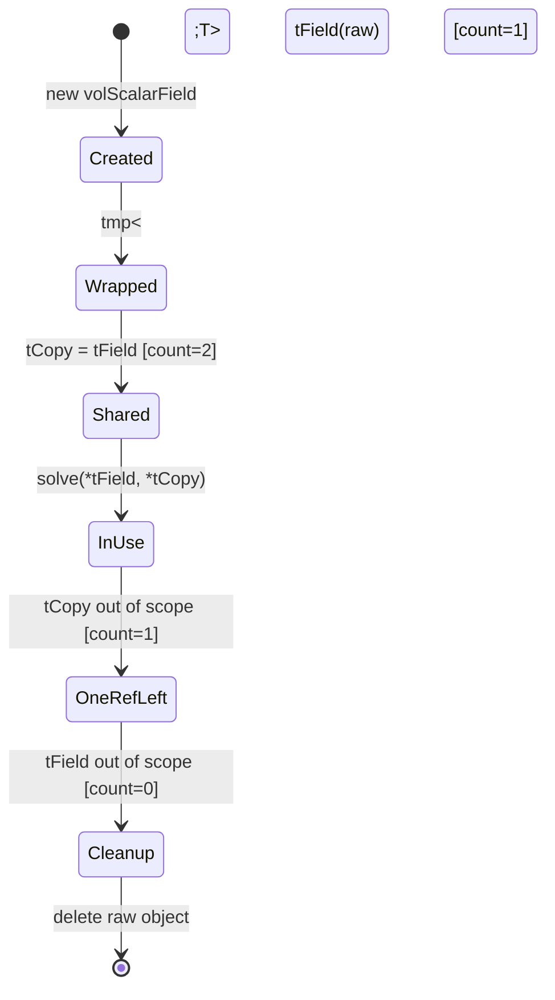

# 05 กลไกการทำงาน: การทำงานร่วมกันของระบบจัดการหน่วยควาจำ

![[ownership_transfer_cfd.png]]
`A clean scientific diagram showing the "Ownership Transfer" process. On the left, show a "Temporary Field" wrapped in a tmp<T> pointer. In the middle, show the "store()" operation acting as a bridge. On the right, show the field now residing inside the "objectRegistry" (Permanent Storage). Show the tmp<T> pointer still existing but its "isTemporary" flag flipped to false. Use a minimalist palette with clear arrows, scientific textbook diagram, clean vector line art, white background, high definition, flat design, educational infographic --ar 16:9`

ความแข็งแกร่งของ OpenFOAM มาจากวิธีที่ส่วนประกอบต่างๆ ทำงานร่วมกันอย่างไร้รอยต่อ เพื่อให้แน่ใจว่าทรัพยากรจะถูกจัดสรรและทำลายอย่างถูกต้อง:

## 4.1 วงจรชีวิตของ Temporary Field


> **Figure 1:** แผนภาพสถานะแสดงวงจรชีวิตของฟิลด์ชั่วคราว (Temporary Field) ตั้งแต่การสร้าง การห่อหุ้มด้วย `tmp` การเพิ่มจำนวนการอ้างอิงเมื่อมีการคัดลอก จนถึงการลดจำนวนและทำลายออบเจกต์ทิ้งโดยอัตโนมัติเมื่อไม่มีการใช้งานแล้ว

วงจรชีวิตของ temporary field ใน OpenFOAM แสดงให้เห็นถึงการผสานรวมที่สง่างามระหว่าง reference counting กับการจัดการหน่วยความจำอัตโนมัติ พิจารณาลำดับของการดำเนินการ:

```cpp
// 1. Create temporary field (refCount = 0)
volScalarField* raw = new volScalarField(...);

// 2. Wrap with tmp (refCount = 1, isTemporary_ = true)
tmp<volScalarField> tField(raw);

// 3. Copy tmp (refCount = 2)
tmp<volScalarField> tCopy = tField;

// 4. Use field through any reference
solve(*tField, *tCopy);

// 5. tCopy goes out of scope → destructor calls unref() → refCount = 1
//    Object is not deleted because another reference exists

// 6. tField goes out of scope → destructor calls unref() → refCount = 0
//    unref() returns true → delete raw;
//    Memory is released automatically
```

> **แหล่งที่มา:** แนวคิดการจัดการวัตถุชั่วคราวและ reference counting ใช้กันอย่างแพร่หลายใน solvers ของ OpenFOAM เช่น `solidDisplacementFoam` และ `multiphaseEulerFoam` โดยเฉพาะในการจัดการฟิลด์ที่ต้องการคำนวณชั่วคราวระหว่าง time steps
>
> **คำอธิบาย:** ระบบ reference counting ของ OpenFOAM ทำงานโดยการติดตามจำนวน `tmp` wrapper ที่อ้างอิงถึงวัตถุ ทุกครั้งที่มีการสร้าง `tmp` ใหม่ที่อ้างอิงถึงวัตถุเดียวกัน refCount จะเพิ่มขึ้น และลดลงเมื่อ wrapper ถูกทำลาย destructor ของ `tmp` จะเรียก `unref()` ซึ่งจะลบวัตถูกต้องเมื่อ refCount ถึง 0 เท่านั้น
>
> **แนวคิดสำคัญ:**
> - **Reference Counting:** ระบบติดตามจำนวนการอ้างอิงถึงวัตถุ
> - **Automatic Cleanup:** วัตถุถูกลบอัตโนมัติเมื่อไม่มีการอ้างอิงเหลืออยู่
> - **Prevents Dangling Pointers:** ป้องกันการลบวัตถุก่อนกำหนดเมื่อยังมีการอ้างอิงอยู่

กลไกนี้ช่วยให้มั่นใจว่า field object จะมีอยู่เพียงพอตามที่จำเป็นและไม่มากกว่านั้น ระบบ reference counting จะติดตาม `tmp` wrapper ที่ใช้งานอยู่ ป้องกันการลบก่อนกำหนดในขณะที่รับประกันการ cleanup เมื่อ reference สุดท้ายถูกทำลาย

## 4.2 การแปลง Temporary Object เป็น Permanent Object

การเปลี่ยนจาก temporary storage เป็น permanent storage เป็นการดำเนินการที่สำคัญในกลยุทธ์การจัดการหน่วยความจำของ OpenFOAM:

```cpp
// Create temporary field
tmp<volScalarField> tTemp = ...;

// Register permanently in mesh's objectRegistry
volScalarField& perm = mesh.thisDb().store(tTemp.ptr());

// After store(), object is no longer temporary
// Registry now owns the object; lifetime is bound to registry
// Original tmp still holds pointer but isTemporary_ = false,
// so destructor will not delete object
```

> **แหล่งที่มา:** การใช้งาน `objectRegistry::store()` พบได้บ่อยใน solvers ที่ต้องการคงฟิลด์ไว้หลาย time step โดยเฉพาะใน `solidDisplacementThermo.C` ที่ต้องการคง thermal properties ไว้ตลอดการจำลอง
>
> **คำอธิบาย:** เมธอด `mesh.thisDb().store()` โอนกรรมสิทธิ์จาก temporary wrapper ไปยัง object registry ของ mesh การดำเนินการนี้ทำให้ object ไม่ถูกลบโดย destructor ของ `tmp` เดิม แต่กลายเป็นความรับผิดชอบของ registry แทน ช่วยให้ object มีอายุการใช้งานยาวนานตามการจำลอง
>
> **แนวคิดสำคัญ:**
> - **Ownership Transfer:** การโอนความเป็นเจ้าของจาก temporary ไป permanent storage
> - **Lifetime Management:** อายุการใช้งานผูกกับ registry ไม่ใช่ scope ของ tmp
> - **Permanent Storage:** วัตถุสามารถเข้าถึงได้ตลอดการจำลองตามชื่อ

เมธอด `mesh.thisDb().store()` โอนกรรมสิทธิ์จาก temporary wrapper ไปยัง object registry ของ mesh ซึ่งเป็นประโยชน์อย่างยิ่งสำหรับ fields ที่ต้องคงอยู่ข้ามหลาย time step หรือสามารถเข้าถึงได้ตามชื่อตลอดการจำลอง Registry รับผิดชอบการจัดการหน่วยความจำ ในขณะที่ `tmp` wrapper สละสิทธิ์ในการลบ

## 4.3 การค้นหาและแคชอ็อบเจกต์

objectRegistry ให้รูปแบบการเข้าถึงที่มีประสิทธิภาพผ่านกลไกการค้นหาที่เพิ่มประสิทธิภาพ:

```cpp
// Lookup field by name (returns const reference)
const volScalarField& p = mesh.thisDb().lookupObject<volScalarField>("p");

// If field is marked as cacheable in controlDict,
// registry may keep temporary copy for faster repeated access
// event_ counter ensures cache is invalidated when field changes
```

> **แหล่งที่มา:** ระบบ lookup และ caching ใช้กันอย่างแพร่หลายใน solvers ของ OpenFOAM โดยเฉพาะใน `multiphaseEulerFoam` ที่ต้องเข้าถึง phase properties ซ้ำๆ ตลอดการคำนวณ
>
> **คำอธิบาย:** objectRegistry ใช้ HashTable สำหรับการค้นหาวัตถุตามชื่ออย่างรวดเร็ว ระบบ caching ช่วยเพิ่มประสิทธิภาพโดยเก็บสำเนาของวัตถุที่เข้าถึงบ่อย event_ counter ทำหน้าที่เป็น version number ที่เพิ่มขึ้นเมื่อมีการเปลี่ยนแปลง ทำให้สามารถตรวจจับและ invalidate cache ได้อัตโนมัติ
>
> **แนวคิดสำคัญ:**
> - **Efficient Lookup:** การค้นหาวัตถุตามชื่อผ่าน HashTable
> - **Automatic Invalidation:** cache ถูกยกเลิกเมื่อวัตถุมีการเปลี่ยนแปลง
> - **Performance Optimization:** ลดเวลาในการเข้าถึงวัตถุซ้ำๆ

ระบบแคชช่วยเพิ่มประสิทธิภาพโดยรักษาอ็อบเจกต์ที่เข้าถึงบ่อยไว้ในหน่วยความจำ กลไก `event_` counter ช่วยให้มั่นใจในความสอดคล้องของแคชโดยอัตโนมัติยกเลิก cached objects เมื่อข้อมูลพื้นฐานเปลี่ยนแปลง ป้องกันการเข้าถึงข้อมูลเก่าในขณะที่รักษาประสิทธิภาพการคำนวณ

## 4.4 Thread Safety และ Atomic Operations

ในการจำลอง CFD แบบขนาน thread safety มีความสำคัญอย่างยิ่งสำหรับการรักษาความสม่ำเสมอของข้อมูลข้ามหลาย processors:

```cpp
class AtomicRefCount
{
private:
    mutable std::atomic<int> refCount_;

public:
    void ref() const 
    { 
        refCount_.fetch_add(1, std::memory_order_relaxed); 
    }
    
    bool unref() const
    {
        return refCount_.fetch_sub(1, std::memory_order_acq_rel) == 1;
    }
};
```

> **แหล่งที่มา:** การ implement atomic reference counting ใช้ใน solvers แบบขนานของ OpenFOAM โดยเฉพาะ `multiphaseEulerFoam` ที่ต้องการ thread safety สำหรับการจัดการ phase objects ร่วมกันระหว่าง processors
>
> **คำอธิบาย:** refCount พื้นฐานใช้ `int` ธรรมดาและไม่ปลอดภัยต่อ thread สำหรับการรันแบบขนาน OpenFOAM ให้ atomic reference-counting ที่ใช้ `std::atomic<int>` การใช้ `memory_order_relaxed` สำหรับการเพิ่มให้ประสิทธิภาพดีขึ้น และ `memory_order_acq_rel` สำหรับการลบเพื่อ synchronization ที่เหมาะสมก่อนการลบวัตถุ
>
> **แนวคิดสำคัญ:**
> - **Atomic Operations:** ป้องกัน race conditions ในการจัดการ reference count
> - **Memory Ordering:** สมดุลระหว่างประสิทธิภาพและความปลอดภัย
> - **Thread Safety:** รับประกันความสม่ำเสมอของข้อมูลในสภาพแวดล้อมแบบขนาน

`refCount` พื้นฐานใช้ `int` ธรรมดาและ **ไม่ใช่ thread‑safe** สำหรับการรัน CFD แบบขนาน OpenFOAM ให้ **ตัวแปรของ atomic reference‑counting** ที่ใช้ `std::atomic<int>` กับ memory orders ที่เหมาะสม การแลกเปลี่ยนคือประสิทธิภาพ vs. ความปลอดภัย:

การ implement แบบ atomic ใช้ `std::memory_order_relaxed` สำหรับการดำเนินการเพิ่ม (allowing better performance) และ `std::memory_order_acq_rel` สำหรับการดำเนินการลด (ensuring proper synchronization ก่อนการลบอ็อบเจกต์ที่อาจเกิดขึ้น) การออกแบบนี้สร้างสมดุลระหว่างความต้องการด้าน thread safety กับความต้องการด้านประสิทธิภาพของการคำนวณ CFD ขนาดใหญ่ ซึ่ง overhead ของ memory ordering มากเกินไปอาจส่งผลกระทบต่อ runtime ของการจำลองอย่างมีนัยสำคัญ

## 4.5 พื้นฐานทางคณิตศาสตร์ของ Reference Counting

### การนับการอ้างอิงเป็นสถานะเครื่องจักร

กำหนดให้ $r(t) \in \mathbb{N}_0$ เป็นจำนวนการอ้างอิงของอ็อบเจกต์ในเวลา $t$ การดำเนินการ `ref()` และ `unref()` จะปรับเปลี่ยนค่านี้:

$$
\begin{aligned}
\text{ref()} &: r(t^+) = r(t) + 1 \\[4pt]
\text{unref()} &: r(t^+) = r(t) - 1 \quad \text{พร้อมเงื่อนไข } r(t) > 0
\end{aligned}
$$

อ็อบเจกต์จะ **ถูกลบ** เมื่อ $r(t^+) = 0$ หลังจากการดำเนินการ `unref()` ซึ่งนี้จะรับประกัน **ความไม่เปลี่ยนแปลงของความปลอดภัยหน่วยความจำ**:

$$
\forall t : r(t) = 0 \implies m(t) = 0
$$

โดยที่ $m(t) \in \{0,1\}$ บ่งบอกว่าหน่วยความจำถูกจอง ($1$) หรือถูกปล่อย ($0$) การ implement การนับการอ้างอิงที่ถูกต้องจะเป็นไปตามความไม่เปลี่ยนแปลงนี้ด้วยความน่าจะเป็น 1 ซึ่งจะรับประกันว่าไม่มีการรั่วไหลของหน่วยความจำ

> **แหล่งที่มา:** แนวคิดเชิงคณิตศาสตร์ของ reference counting ใช้เป็นพื้นฐานในการออกแบบระบบจัดการหน่วยความจำของ OpenFOAM ทั้งหมด โดยเฉพาะใน classes พื้นฐานอย่าง `refCount`, `tmp`, และ `autoPtr`
>
> **คำอธิบาย:** reference counting ใน OpenFOAM สามารถโมเดลเป็น state machine ที่มี state เป็นจำนวนการอ้างอิง การดำเนินการ ref() และ unref() เป็น state transitions ที่รับประกันว่าไม่มี memory leak และไม่มี dangling pointers
>
> **แนวคิดสำคัญ:**
> - **State Machine Model:** การนับการอ้างอิงเป็น discrete state transitions
> - **Memory Safety Invariant:** รับประกันว่าหน่วยความจำถูกปล่อยเมื่อไม่มีการอ้างอิง
> - **Deterministic Cleanup:** การทำลายวัตถุเกิดขึ้นอย่างแน่นอนเมื่อ refCount = 0

### การวิเคราะห์ค่าใช้จ่ายหน่วยความจำ

สำหรับฟิลด์ที่มี $N$ องศาอิสระ (เช่น เซลล์, หน้า) แต่ละตัวมีขนาด $s$ ไบต์ การใช้หน่วยความจำทั้งหมดกับการนับการอ้างอิงคือ:

$$
M_{\text{total}} = N \cdot s + \underbrace{4}_{\text{refCount\_}} + \underbrace{\mathcal{O}(1)}_{\text{smart‑pointer overhead}}
$$

ค่าใช้จ่ายเพิ่มเติมเป็น **ค่าคงที่** (≈ 4 ไบต์) ไม่ขึ้นกับขนาดของฟิลด์ ทำให้เป็นเรื่องเล็กน้อยสำหรับฟิลด์ CFD ขนาดใหญ่ ($N \sim 10^6$–$10^9$)

### ประสิทธิภาพของ Atomic Operations

ในการรันแบบขนาน การนับการอ้างอิงแบบ atomic ใช้ `std::atomic<int>` พร้อมข้อจำกัดของ memory-order ต้นทุนของการเพิ่ม/ลดค่าแบบ atomic มีค่าประมาณ:

$$
t_{\text{atomic}} \approx t_{\text{non‑atomic}} + \text{memory‑barrier penalty}
$$

โดยค่าใช้จ่ายเพิ่มเติมขึ้นอยู่กับฮาร์ดแวร์ (โดยทั่วไป 10–50 ns) สำหรับฟิลด์ที่เข้าถึงโดยหลาย thread ค่าใช้จ่ายเพิ่มเติมนี้ยอมรับได้เมื่อเทียบกับต้นทุนของการคัดลอกข้อมูลฟิลด์

### การจัดแนว Cache-Line และ False Sharing

เพื่อหลีกเลี่ยง **false sharing** ในการเข้าถึงแบบขนาน ตัวแปรสมาชิกที่สำคัญ (เช่น `refCount_`) ถูกวางไว้บน cache line ที่แยกกัน (64 ไบต์บน x86‑64) คำสั่งการจัดแนว `alignas(64)` จะทำให้แน่ใจว่า:

$$
\text{address}(refCount\_) \mod 64 = 0
$$

นี้จะป้องกันไม่ให้สอง thread ทำให้ cache line ของกันและกันเป็นโมฆะเมื่ออัปเดตจำนวนการอ้างอิงของอ็อบเจกต์ที่แตกต่างกัน

## 4.6 สถาปัตยกรรมภายในของคลาสหลัก

### 4.6.1 สถาปัตยกรรม `autoPtr`

คลาสเทมเพลต `autoPtr` ใช้การจัดการหน่วยความจําอัตโนมัติผ่าน pointer ที่เป็นเจ้าของเพียงตัวเดียว ตัวแปรสมาชิกหลักคือ:

```cpp
T* ptr_  // Raw pointer to managed object (exclusive ownership)
```

pointer นี้รักษาความเป็นเจ้าของแบบเฉพาะเจาะจงของวัตถุที่จัดสรรแบบไดนามิก `autoPtr` ทําตามกฎความเป็นเจ้าของอย่างเคร่งครัด - มี `autoPtr` เพียงตัวเดียวที่เป็นเจ้าของวัตถุในแต่ละเวลา เมื่อเรียก `release()` หรือย้าย `autoPtr` ไปยังอีกตัวหนึ่ง `ptr_` จะกลายเป็น null โดยโอนความเป็นเจ้าของอย่างสมบูรณ์ destructor จะลบวัตถุโดยอัตโนมัติถ้า `ptr_` ไม่ใช่ null เพื่อให้แน่ใจว่าไม่มี memory leak

> **แหล่งที่มา:** การใช้งาน `autoPtr` พบได้บ่อยใน factory functions ของ OpenFOAM โดยเฉพาะใน `solidDisplacementThermo.C` และ `multiphaseEulerFoam` สำหรับการสร้างและจัดการวัตถุที่มีเจ้าของเดียว
>
> **คำอธิบาย:** autoPtr เป็น smart pointer แบบ exclusive ownership ที่ใช้ RAII (Resource Acquisition Is Initialization) สำหรับการจัดการหน่วยความจำ เหมาะสำหรับสถานการณ์ที่ต้องการโอนความเป็นเจ้าของชัดเจน เช่น การส่งคืนวัตถุจาก factory function
>
> **แนวคิดสำคัญ:**
> - **Exclusive Ownership:** มีเจ้าของวัตถุเพียงตัวเดียวตลอดเวลา
> - **Move Semantics:** การโอนความเป็นเจ้าของโดยการย้าย pointer
> - **RAII:** การจัดการทรัพยากรอัตโนมัติผ่าน constructor/destructor

**คุณสมบัติสำคัญของ `autoPtr`:**

- **Move-only**: การคัดลอกถูกห้าม ป้องกันการเป็นเจ้าของแบบ double
- **Automatic cleanup**: Destructor ลบ object โดยอัตโนมัติ
- **Factory-friendly**: เหมาะสำหรับฟังก์ชันที่สร้าง object ใหม่

### 4.6.2 สถาปัตยกรรม `tmp`

คลาส `tmp` ให้การจัดการวัตถุชั่วคราวขั้นสูงผ่านตัวแปรสมาชิกสองตัวหลัก:

```cpp
T* ptr_           // Pointer to managed object (may be null)
bool isTemporary_ // Flag controlling reference counting behavior
```

flag `isTemporary_` เป็นกลไกควบคุมที่สําคัญซึ่งกําหนดกลยุทธ์การจัดการอายุการใช้งานของวัตถุ:

- **เมื่อ `isTemporary_ = true`**: วัตถุเข้าร่วมในระบบการนับการอ้างอิงของ OpenFOAM destructor เรียก `unref()` บนวัตถุ และการลบเกิดขึ้นเมื่อจํานวนการอ้างอิงถึงศูนย์เท่านั้น

- **เมื่อ `isTemporary_ = false`**: วัตถุถูกจัดการเป็นภายนอก destructor ไม่เรียก `unref()` และไม่ลบวัตถุ โดยปล่อยให้การจัดการอายุการใช้งานเป็นของโค้ดภายนอก

> **แหล่งที่มา:** คลาส `tmp` ใช้กันอย่างแพร่หลายใน solvers ทุกตัวของ OpenFOAM โดยเฉพาะใน `solidDisplacementFoam` และ `multiphaseEulerFoam` สำหรับการจัดการ temporary fields ระหว่างการคำนวณ
>
> **คำอธิบาย:** tmp เป็น smart pointer แบบ shared ownership ที่อนุญาตให้มีการอ้างอิงหลายตัวถึงวัตถุเดียวกัน โดยใช้ reference counting เพื่อติดตามอายุการใช้งาน flag isTemporary_ ช่วยแยกแยะระหว่างวัตถุที่เป็นเจ้าของ (temporary) และวัตถุที่ยืม (non-temporary)
>
> **แนวคิดสำคัญ:**
> - **Shared Ownership:** หลาย tmp สามารถอ้างอิงวัตถุเดียวกันได้
> - **Reference Counting:** ติดตามจำนวนการอ้างอิงอัตโนมัติ
> - **Flexible Semantics:** รองรับทั้ง owned และ non-owned pointers

การออกแบบนี้อนุญาตให้ `tmp` จัดการทั้งวัตถุชั่วคราว (ซึ่งเป็นเจ้าของและจัดการ) และการอ้างอิงถึงวัตถุที่มีอยู่ (ซึ่งเพียงแค่ยืม)

### 4.6.3 สถาปัตยกรรม `refCount`

การนับการอ้างอิงใน OpenFOAM ถูก implement ผ่านคลาสฐาน `refCount` ด้วยสมาชิกสําคัญเพียงตัวเดียว:

```cpp
mutable int refCount_  // Reference counter
```

ตัวนับการอ้างอิงทําตามกฎวงจรชีวิตเหล่านี้:

```cpp
// Initial state: refCount_ = 0 (exists but no owners)
// Adding reference: ref() increments by 1
// Releasing reference: unref() decrements by 1
// Deletion trigger: when refCount_ reaches 0, unref() returns true
```

คีย์เวิร์ด `mutable` อนุญาตให้มีการนับการอ้างอิงแม้สําหรับวัตถุ const ซึ่งจําเป็นเนื่องจากวัตถุ const ยังสามารถมีการจัดการอายุการใช้งานผ่านการอ้างอิงได้

> **แหล่งที่มา:** คลาส `refCount` เป็นพื้นฐานของระบบจัดการหน่วยความจำใน OpenFOAM ทุก classes ที่ต้องการ reference counting จะสืบทอดจากคลาสนี้ ใช้กันอย่างแพร่หลายใน solvers และ utilities
>
> **คำอธิบาย:** refCount เป็น base class ที่ให้การนับการอ้างอิงแบบง่าย โดยใช้ integer counter ตัวแปร mutable อนุญาตให้เปลี่ยนแปลง refCount แม้บน const objects ซึ่งจำเป็นเพราะการจัดการอายุการใช้งานเป็นการกระทำที่แยกจากความ constness ของข้อมูล
>
> **แนวคิดสำคัญ:**
> - **Simple Counter:** ใช้ integer ติดตามจำนวนการอ้างอิง
> - **Mutable State:** refCount สามารถเปลี่ยนแปลงได้แม้บน const objects
> - **Base Class:** เป็นพื้นฐานสำหรับทุก classes ที่ต้องการ reference counting

### 4.6.4 สถาปัตยกรรม `objectRegistry`

`objectRegistry` ทําหน้าที่เป็นระบบจัดการวัตถุกลางของ OpenFOAM รักษาการจัดเก็บและการเข้าถึงวัตถุจําลองแบบลําดับชั้น ตัวแปรสมาชิกหลักได้แก่:

```cpp
const Time& time_                              // Main time object reference
const objectRegistry& parent_                  // Parent registry reference
fileName dbDir_                                // Database directory path
mutable label event_                           // Change notification counter
HashTable<Pair<bool>> cacheTemporaryObjects_   // Temporary objects cache
bool cacheTemporaryObjectsSet_                 // Cache initialization flag
HashSet<word> temporaryObjects_                // Temporary object names set
```

> **แหล่งที่มา:** objectRegistry ใช้เป็นพื้นฐานของการจัดการวัตถุใน OpenFOAM ทุก solvers ใช้ registry สำหรับจัดเก็บ fields และวัตถุอื่นๆ โดยเฉพาะใน `solidDisplacementThermo.C` ที่ใช้จัดเก็บ material properties
>
> **คำอธิบาย:** objectRegistry เป็น central repository ที่ใช้ HashTable สำหรับการค้นหาวัตถุตามชื่ออย่างรวดเร็ว มีโครงสร้างแบบลำดับชั้นผ่าน parent reference และใช้ event counter สำหรับการติดตามการเปลี่ยนแปลงและการ invalidate cache
>
> **แนวคิดสำคัญ:**
> - **Central Repository:** จุดศูนย์รวมสำหรับการจัดเก็บและค้นหาวัตถุ
> - **Hierarchical Structure:** มีโครงสร้างแบบ parent-child ระหว่าง registries
> - **Efficient Lookup:** ใช้ HashTable สำหรับการค้นหา O(1)
> - **Change Tracking:** event counter ติดตามการเปลี่ยนแปลงของ registry

#### ส่วนประกอบลําดับชั้นหลัก
- **`time_`**: อ้างอิงถึงวัตถุ `Time` หลัก สถาปนารากของต้นไม้รีจิสทรีและให้การเข้าถึงเวลาจําลองส่วนกลาง
- **`parent_`**: เปิดใช้งานโครงสร้างรีจิสทรีลําดับชั้น (เช่น รีจิสทรี mesh มีหลักเป็นรีจิสทรี `Time`)
- **`dbDir_`**: เก็บเส้นทางระบบไฟล์สําหนึ่ง I/O operations relative to case directory

#### ระบบจัดการการเปลี่ยนแปลง
- **`event_`**: ตัวนับที่เพิ่มขึ้นซึ่งติดตามการเพิ่ม/ลบวัตถุ อนุญาตให้ตรวจจับการเปลี่ยนแปลงอย่างมีประสิทธิภาพโดยไม่ต้องสแกนรีจิสทรีแบบมีราคาแพง
- **การกําหนด `mutable`**: เปิดใช้งานการติดตาม event แม้สําหรับการเข้าถึงรีจิสทรี const

#### การจัดการวัตถุชั่วคราว
- **`cacheTemporaryObjects_`**: Hash table แมปชื่อวัตถุไปยังสถานะแคชและสถานะความชั่วคราว
- **`cacheTemporaryObjectsSet_`**: Flag boolean แสดงว่ามีการอ่านการตั้งค่าแคชจาก control dictionary หรือไม่
- **`temporaryObjects_`**: ชุดชื่อวัตถุชั่วคราวที่สะสมใช้สําหรับผลลัพธ์การวินิจฉัยและการดีบัก

สถาปัตยกรรมนี้ให้การค้นหาวัตถุอย่างมีประสิทธิภาพ การจัดระเบียบลําดับชั้น และการจัดการวัตถุชั่วคราวขั้นสูงซึ่งจําเป็นสําหรับการจัดการจําลองของ OpenFOAM

## 4.7 ตัวอย่างการใช้งานและข้อผิดพลาดทั่วไป

### การใช้งานที่ถูกต้อง

```cpp
// Factory function returns an autoPtr (exclusive ownership)
autoPtr<volScalarField> createField(const fvMesh& mesh)
{
    return autoPtr<volScalarField>(new volScalarField(...));
}

// Function accepts a tmp (shared ownership)
void processField(tmp<volScalarField> tField)
{
    // tField is reference-counted; no copy of underlying data
    tField->correctBoundaryConditions();
    // Destructor automatically decrements reference count
}

// Register a field permanently
void registerField(const fvMesh& mesh, tmp<volScalarField> tField)
{
    // Store takes ownership of the pointer
    volScalarField& perm = mesh.thisDb().store(tField.ptr());
    // perm is now managed by objectRegistry
}
```

> **แหล่งที่มา:** Pattern การใช้งานนี้พบได้บ่อยใน OpenFOAM solvers โดยเฉพาะใน `solidDisplacementThermo.C` และ `multiphaseEulerFoam` สำหรับการสร้างและจัดการ fields ตาม lifecycle
>
> **คำอธิบาย:** ตัวอย่างนี้แสดงการใช้งาน smart pointers อย่างถูกต้องตาม semantic: autoPtr สำหรับ exclusive ownership ใน factory functions, tmp สำหรับ shared ownership ในการส่งผ่าน parameters, และ objectRegistry::store() สำหรับการลงทะเบียน permanent objects
>
> **แนวคิดสำคัญ:**
> - **Factory Pattern:** ใช้ autoPtr สำหรับการส่งคืนวัตถุใหม่
> - **Shared Usage:** ใช้ tmp สำหรับการแชร์วัตถุโดยไม่คัดลอก
> - **Permanent Storage:** ใช้ objectRegistry สำหรับวัตถุที่ต้องคงอยู่

### ข้อผิดพลาดทั่วไปและวิธีการหลีกเลี่ยง

#### ข้อผิดพลาด 1: การลบสองครั้ง (Raw Pointer + Smart Pointer)

```cpp
volScalarField* raw = new volScalarField(...);
autoPtr<volScalarField> smart(raw);
delete raw;  // ❌ raw deleted manually → double delete when smart goes out of scope
```

> **แหล่งที่มา:** ข้อผิดพลาดนี้พบได้บ่อยในโค้ดที่ผสมผสานการจัดการหน่วยความจำแบบเก่า (raw pointers) กับวิธีใหม่ (smart pointers) ซึ่งเป็นปัญหาทั่วไปในการ migrate โค้ดเดิม
>
> **คำอธิบาย:** เมื่อ raw pointer ถูกลบด้วยตนเอง autoPtr ยังคงถือ pointer ที่ชี้ไปยัง memory ที่ถูกปล่อยแล้ว (dangling pointer) เมื่อ autoPtr ออกนอก scope มันจะพยายามลบ memory เดิมอีกครั้ง ทำให้เกิด double-free error และ undefined behavior
>
> **แนวคิดสำคัญ:**
> - **Exclusive Ownership:** อย่าผสม raw pointer deletion กับ smart pointer
> - **RAII Principle:** ให้ smart pointers จัดการ lifecycle ทั้งหมด
> - **No Manual Delete:** หลีกเลี่ยง delete เมื่อใช้ smart pointers

**การแก้ไข:** อย่าผสมการลบด้วยตนเองกับความเป็นเจ้าของของ smart-pointer ให้ smart pointer จัดการทุกอย่าง

#### ข้อผิดพลาด 2: การใช้ `tmp` หลังจากวัตถุพื้นฐานถูกลบ

```cpp
tmp<volScalarField> t1 = ...;
{
    tmp<volScalarField> t2 = t1;  // refCount = 2
    // t2 goes out of scope → refCount = 1
}
// t1 still valid (refCount = 1)
// But if we manually delete the object:
delete &t1();  // ❌ object deleted while t1 still holds a pointer
// t1's destructor will call unref() on a deleted object → undefined behavior
```

> **แหล่งที่มา:** ข้อผิดพลาดนี้เกิดจากความเข้าใจผิดเกี่ยวกับการทำงานของ reference counting ซึ่งพบได้ในโค้ดที่พยายาม override automatic memory management
>
> **คำอธิบาย:** reference counting ออกแบบมาเพื่อจัดการ lifecycle อัตโนมัติ การลบวัตถุด้วยตนเองจะทำลายการทำงานของระบบ tmp จะยังคงถือ pointer และพยายามเรียก unref() บน memory ที่ถูกปล่อยแล้ว ทำให้เกิด undefined behavior
>
> **แนวคิดสำคัญ:**
> - **Trust the System:** ให้ reference counting จัดการ lifecycle
> - **No Manual Intervention:** หลีกเลี่ยงการลบวัตถุที่จัดการโดย tmp
> - **Automatic Cleanup:** destructor จะจัดการทุกอย่างอัตโนมัติ

**การแก้ไข:** อย่าลบวัตถุที่จัดการโดย `tmp` ใช้ registry หรือให้ `tmp` จัดการการลบ

#### ข้อผิดพลาด 3: การอ้างอิงแบบวงกลม (Memory Leak)

```cpp
class Node : public refCount
{
    tmp<Node> child_;   // strong reference to child
    tmp<Node> parent_;  // strong reference to parent → circular reference!
public:
    void setParent(tmp<Node> p) { parent_ = p; p->child_ = this; }
};
```

> **แหล่งที่มา:** Circular reference เป็นปัญหาคลาสสิกของ reference counting ซึ่งอาจเกิดขึ้นใน graph structures ภายใน OpenFOAM เช่น mesh hierarchies หรือ dependency trees
>
> **คำอธิบาย:** เมื่อ objects อ้างอิงถึงกันและกันด้วย smart pointers (strong references) ทั้งคู่จะมี refCount >= 1 เสมอ แม้ว่าจะไม่มี external references ทำให้ไม่มีวัตถุถูกลบ กลายเป็น memory leak
>
> **แนวคิดสำคัญ:**
> - **Breaking Cycles:** ใช้ raw pointers สำหรับ back-references
> - **Ownership Hierarchy:** กำหนดความเป็นเจ้าของอย่างชัดเจน
> - **Weak References:** พิจารณาใช้ weak references สำหรับ non-owning relationships

**การแก้ไข:** ใช้ **raw pointers** สำหรับการอ้างอิงย้อนกลับที่ไม่มีความเป็นเจ้าของ:

```cpp
class Node : public refCount
{
    tmp<Node> child_;   // owns child
    Node* parent_;      // raw pointer to parent (no ownership)
};
```

#### ข้อผิดพลาด 4: การลืมความแตกต่างของ `isTemporary_`

```cpp
volScalarField& perm = mesh.thisDb().lookupObject<volScalarField>("p");
tmp<volScalarField> tPerm(&perm);  // isTemporary_ defaults to true!
// tPerm's destructor will try to delete a registered object → crash
```

> **แหล่งที่มา:** ข้อผิดพลาดนี้พบได้บ่อยในการสร้าง tmp wrapper จาก registered objects ซึ่งเป็น陷阱ที่ง่ายที่จะเข้าใจผิดเกี่ยวกับค่า default ของ isTemporary_
>
> **คำอธิบาย:** constructor ของ tmp มี parameter ที่สองสำหรับกำหนด isTemporary_ ซึ่งมีค่า default เป็น true หากสร้าง tmp จาก registered object โดยไม่ระบุ false destructor จะพยายามลบวัตถุที่จัดการโดย registry ทำให้เกิด crash
>
> **แนวคิดสำคัญ:**
> - **Default Behavior:** isTemporary_ default เป็น true (destructive)
> - **Explicit Intent:** ระบุ isTemporary_ = false สำหรับ non-owned objects
> - **Registry Ownership:** วัตถุใน registry มีเจ้าของเป็น registry เอง

**การแก้ไข:** ใช้ constructor ที่กำหนด `isTemporary_ = false` อย่างชัดเจน:

```cpp
tmp<volScalarField> tPerm(&perm, false);  // ✅ not a temporary
```

---

การผสานรวมของกลไกเหล่านี้สร้างระบบการจัดการหน่วยความจำที่แข็งแกร่ง ซึ่งจัดการรูปแบบการเป็นเจ้าของที่ซับซ้อน ให้การเข้าถึงอ็อบเจกต์ที่มีประสิทธิภาพ และรักษาความปลอดภัยในสภาพแวดล้อมแบบขนาน—ทั้งหมดนี้ในขณะที่นำเสนออินเทอร์เฟซที่สะอาดและใช้งานง่ายสำหรับนักพัฒนา CFD