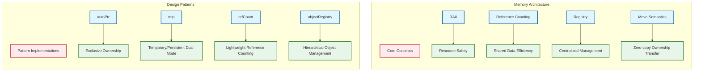
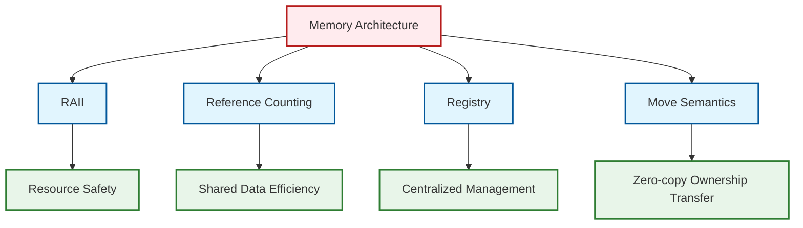

# 06 รูปแบบการออกแบบและสถาปัตยกรรม: การออกแบบที่เป็นรากฐานของการจัดการหน่วยความจำใน OpenFOAM

![[raii_vs_manual.png]]
`A clean scientific illustration comparing "Manual Memory Management" and "RAII". On the left, show a chaotic scene with "new" and "delete" calls scattered, leading to a "Memory Leak" hole. On the right, show a tidy "RAII Container" where the object is safely tucked inside, and the "Cleanup" happens automatically at the exit door. Use a minimalist palette, scientific textbook diagram, clean vector line art, white background, high definition, flat design, educational infographic --ar 16:9`

การจัดการหน่วยความจำของ OpenFOAM ไม่ได้ถูกสร้างขึ้นมาแบบสุ่ม แต่เป็นผลจากการประยุกต์ใช้ **รูปแบบการออกแบบ (Design Patterns)** ที่ได้รับการคิดค้นอย่างละเอียดเพื่อแก้ปัญหาเฉพาะของ CFD ที่เกิดขึ้นซ้ำๆ ในช่วงเวลาของการพัฒนาซอฟต์แวร์หลายทศวรรษ การออกแบบเหล่านี้สะท้อนถึงประสบการณ์ของวิศวกร CFD ที่เจอกับปัญหาเกี่ยวกับหน่วยความจำและประสิทธิภาพในการจำลองขนาดใหญ่

---

## 6.1 รูปแบบ RAII (Resource Acquisition Is Initialization)

### แนวคิดพื้นฐาน

**รูปแบบ**: จัดหาทรัพยากรใน constructor, คืนทรัพยากรใน destructor

**เหตุผล**: รับประกันการทำความสะอาดแม้ในกรณีที่มี exception, early returns, หรือการควบคุมการไหลที่ซับซ้อน Smart pointers ของ OpenFOAM เป็น **RAII wrappers** สำหรับ raw pointers ที่ให้การจัดการหน่วยความจำแบบดีเทอร์มินิสติก

### การ Implement ใน OpenFOAM

```cpp
// RAII example: temporary field allocation
class volScalarField {
    // Constructor acquires memory
    volScalarField(const fvMesh& mesh, const word& name) {
        // Allocate memory for field data
        fieldPtr_ = new scalar[mesh.nCells()];
        // Register with mesh for automatic cleanup
        mesh.objectRegistry::insert(*this);
    }

    // Destructor releases memory automatically
    ~volScalarField() {
        delete[] fieldPtr_;
        // Remove from registry
        mesh.objectRegistry::erase(*this);
    }
};
```

**📖 คำอธิบาย (Thai Explanation):**
- **แหล่งที่มา (Source):** แนวคิด RAII ถูกนำไปใช้ใน `volScalarField` และ field classes อื่นๆ ใน OpenFOAM
- **คำอธิบาย:** รูปแบบ RAII ใน OpenFOAM รับประกันว่าทรัพยากร (หน่วยความจำ) จะถูกจัดหาเมื่อสร้าง object และคืนโดยอัตโนมัติเมื่อ object ถูกทำลาย ไม่ว่าจะเกิด exception หรือการควบคุม flow ที่ซับซ้อนก็ตาม
- **แนวคิดสำคัญ:**
  - **Resource Acquisition:** Constructor จองหน่วยความจำและลงทะเบียน object
  - **Resource Release:** Destructor คืนหน่วยความจำและถอนการลงทะเบียน
  - **Exception Safety:** หน่วยความจำถูกคืนเสมอแม้มี exception เกิดขึ้น
  - **Automatic Cleanup:** ไม่ต้องเรียก delete ด้วยตนเอง

### ประโยชน์สำคัญ

รูปแบบ RAII ช่วยให้แม้ว่าจะมี exception ถูก throw ระหว่างการคำนวณ field หน่วยความจำที่จองไว้จะถูกคืนอย่างถูกต้องเมื่อ field อยู่นอก scope ซึ่งเป็นสิ่งจำเป็นใน CFD simulation ที่การจองหน่วยความจำขนาดใหญ่ต้องถูกจัดการอย่างระมัดระวัง:

- **Exception Safety**: หน่วยความจำถูกคืนเสมอ ไม่ว่าจะเกิดอะไรขึ้น
- **Clear Ownership**: เจ้าของทรัพยากรถูกกำหนดชัดเจน
- **Automatic Cleanup**: ไม่ต้องเรียก delete ด้วยตนเอง
- **Prevention of Leaks**: กำจัดปัญหาการรั่วไหลของหน่วยความจำในระดับภาษา

---

## 6.2 รูปแบบ Reference Counting (Garbage Collection)

### แนวคิดพื้นฐาน

**รูปแบบ**: แต่ละวัตถุรักษาจำนวนการอ้างอิงที่ใช้งานอยู่ เมื่อจำนวนเท่ากับศูนย์ วัตถุจะถูกทำลายเอง

**เหตุผล**: ทำให้สามารถ **ใช้งานร่วมกัน (Shared Ownership)** ได้โดยไม่ต้องประสานงานด้วยตนเอง จำเป็นสำหรับ temporary fields ที่ถูกส่งผ่านระหว่าง functions และ solvers

### การ Implement ใน OpenFOAM

```cpp
// Reference counting implementation
template<class T>
class refCount {
    mutable int count_;  // Reference counter

public:
    refCount() : count_(0) {}

    // Increment reference count
    void operator++() { count_++; }

    // Decrement and check if object should be deleted
    bool operator--() {
        return (--count_ == 0);
    }

    // Check if this is the only reference
    bool unique() const { return count_ == 1; }

    // Get current count
    int count() const { return count_; }
};
```

**📖 คำอธิบาย (Thai Explanation):**
- **แหล่งที่มา (Source):** คลาส `refCount` ถูกนำไปใช้ใน `src/OpenFOAM/memory/refCount.H`
- **คำอธิบาย:** Reference counting เป็นกลไก Garbage Collection แบบดีเทอร์มินิสติกที่นับจำนวนการอ้างอิงถึงแต่ละ object เมื่อไม่มีส่วนไหนอ้างอิงถึง object อีกต่อไป (count == 0) object จะถูกทำลายโดยอัตโนมัติ
- **แนวคิดสำคัญ:**
  - **Shared Ownership:** หลายส่วนของ code สามารถแชร์ object เดียวกันได้
  - **Automatic Deletion:** Object ถูกลบโดยอัตโนมัติเมื่อไม่มีการอ้างอิง
  - **Lightweight:** ใช้เพียง integer counter ไม่ซับซ้อนเหมือน control block
  - **Deterministic:** มีการคืนหน่วยความจำที่ทำนายได้ ไม่ใช่แบบ non-deterministic GC

### ตัวอย่างการใช้งาน

```cpp
// Multiple references to the same field
tmp<volScalarField> T1 = new volScalarField(mesh, "temperature");
tmp<volScalarField> T2 = T1;  // Reference count increments
tmp<volScalarField> T3 = T2;  // Reference count increments again

// When T1, T2, T3 go out of scope, reference count decrements
// Field is automatically deleted when count reaches zero
```

**📖 คำอธิบาย (Thai Explanation):**
- **แหล่งที่มา (Source):** การใช้งาน `tmp` และ reference counting พบได้ทั่วไปใน solvers เช่น `applications/solvers/multiphase/multiphaseEulerFoam`
- **คำอธิบาย:** ตัวอย่างนี้แสดงให้เห็นว่า reference counting ทำงานอย่างไรใน practice การสร้าง `tmp` objects หลายตัวที่อ้างอิงถึง field เดียวกัน จะทำให้ reference count เพิ่มขึ้น และลดลงเมื่อ objects ถูกทำลาย
- **แนวคิดสำคัญ:**
  - **Copy Constructor:** เพิ่ม reference count
  - **Destructor:** ลด reference count และลบ object ถ้า count == 0
  - **No Manual Management:** ไม่ต้องติดตามว่าใครเป็นผู้ใช้ล่าสุด
  - **Memory Safety:** ป้องกัน use-after-free และ double-delete

### ประโยชน์ด้านประสิทธิภาพ

กลไกนี้ป้องกันการรั่วไหลของหน่วยความจำและช่วยให้การใช้หน่วยความจำซ้ำมีประสิทธิภาพ โดยเฉพาะสำคัญใน iterative solvers ที่ temporary fields ถูกสร้างและทำลายบ่อยครั้ง:

- **No Unnecessary Copies**: หลายส่วนของ code สามารถแชร์ข้อมูลเดียวกันได้
- **Automatic Deletion**: ไม่ต้องติดตามว่าใครเป็นผู้ใช้ล่าสุด
- **Efficient Sharing**: เหมาะสำหรับการส่งผ่านข้อมูลระหว่าง operations
- **Memory Safety**: ป้องกันการใช้หน่วยความจำที่ถูกคืนไปแล้ว

---

## 6.3 รูปแบบ Registry (Catalog)

### แนวคิดพื้นฐาน

**รูปแบบ**: ฐานข้อมูลกลางที่จัดการอายุของวัตถุและให้การเข้าถึงแบบตั้งชื่อ

**เหตุผล**: CFD simulation มี fields, boundary conditions, และ models หลายร้อยรายการ Registry **แยกการสร้างวัตถุออกจากการค้นหาวัตถุ**, ทำให้ I/O ง่ายขึ้น และเปิดใช้งานการ cleanup อัตโนมัติเมื่อสิ้นสุด time step หรือ simulation

### สถาปัตยกรรม Registry

```cpp
class objectRegistry : public regIOobject {
    HashTable<regIOobject*> objects_;  // Named object storage

public:
    // Register an object with a name
    template<class Type>
    void insert(const word& name, Type& object) {
        objects_.insert(name, &object);
    }

    // Retrieve object by name
    template<class Type>
    Type* lookupObject(const word& name) const {
        return dynamic_cast<Type*>(objects_[name]);
    }

    // Automatic cleanup of all registered objects
    void clear() {
        forAll(objects_, i) {
            delete objects_[i];
        }
        objects_.clear();
    }

    // Store a temporary object permanently
    template<class Type>
    Type& store(autoPtr<Type>& ptr) {
        Type* obj = ptr.ptr();
        insert(obj->name(), *obj);
        return *obj;
    }
};
```

**📖 คำอธิบาย (Thai Explanation):**
- **แหล่งที่มา (Source):** คลาส `objectRegistry` ถูกนำไปใช้ใน `src/OpenFOAM/db/objectRegistry/objectRegistry.H`
- **คำอธิบาย:** Registry pattern ใน OpenFOAM เป็นฐานข้อมูลกลางที่เก็บ objects ต่างๆ ด้วยชื่อ ช่วยให้สามารถค้นหาและเข้าถึง objects ได้จากทุกที่ใน code โดยไม่ต้องส่งผ่าน references อย่างซับซ้อน
- **แนวคิดสำคัญ:**
  - **Named Storage:** เก็บ objects ใน `HashTable` ด้วยชื่อ
  - **Centralized Management:** จัดการ lifecycle ของ objects ทั้งหมดในที่เดียว
  - **Automatic I/O:** สามารถอ่าน/เขียน objects ทั้งหมดไปยัง disk ได้ง่าย
  - **Cleanup:** ลบ objects ทั้งหมดโดยอัตโนมัติเมื่อ simulation จบ

### ประโยชน์ในบริบท CFD

**I/O Simplification**: Fields สามารถเขียน/อ่านโดยใช้ชื่อโดยไม่ต้องมีการบันทึกด้วยตนเอง

```cpp
// Automatic I/O for registered objects
mesh.writeObjects();  // Writes all registered fields to disk
mesh.readObjects();   // Reads all registered fields from disk
```

**Memory Management**: Cleanup อัตโนมัติเมื่อ simulation สิ้นสุดหรือ time step เสร็จสิ้น

```cpp
// Automatic cleanup at end of time step
~objectRegistry() {
    clear();  // Deletes all registered objects
}
```

**Data Access**: ค้นหา fields และ models ได้ง่ายทุกที่ใน code

```cpp
// Later in different function
volVectorField& U = mesh.lookupObject<volVectorField>("U");
volScalarField& p = mesh.lookupObject<volScalarField>("p");
```

**Modularity**: แยก physics modules ต่างๆ ออกจากโครงสร้างข้อมูลภายในของกันและกัน

### ตัวอย่างการใช้งานเต็มรูปแบบ

```cpp
// In solver setup
objectRegistry& reg = mesh.objectRegistry();

// Register fields
reg.insert("U", U);           // Velocity field
reg.insert("p", p);           // Pressure field
reg.insert("T", T);           // Temperature field

// Store temporary field permanently
tmp<volScalarField> tRho = calculateRho();
volScalarField& rho = reg.store(tRho);

// Later access - efficient lookup by name
const volVectorField& U = reg.lookupObject<volVectorField>("U");
```

**📖 คำอธิบาย (Thai Explanation):**
- **แหล่งที่มา (Source):** การใช้งาน `objectRegistry` พบได้ทั่วไปใน solvers เช่น `applications/solvers/multiphase/multiphaseEulerFoam/phaseSystems/phaseSystem.C`
- **คำอธิบาย:** ตัวอย่างนี้แสดงวิธีการใช้ registry ในการจัดการ fields ต่างๆ ใน solver การลงทะเบียน fields ทำให้สามารถค้นหาและเข้าถึงได้ง่ายจากทุกที่ใน code
- **แนวคิดสำคัญ:**
  - **Centralized Storage:** เก็บ fields ทั้งหมดในที่เดียว
  - **Named Lookup:** ค้นหาด้วยชื่อแทนการส่งผ่าน references
  - **Temporary to Persistent:** แปลง temporary objects เป็น persistent ผ่าน `store()`
  - **Automatic Cleanup:** ลบทุกอย่างโดยอัตโนมัติเมื่อจบ

---

## 6.4 รูปแบบ Move-Only Types (`autoPtr`)

### แนวคิดพื้นฐาน

**รูปแบบ**: อนุญาตการย้ายความเป็นเจ้าของแต่ห้ามการคัดลอก

**เหตุผล**: ป้องกันการคัดลอกโครงสร้างข้อมูลขนาดใหญ่โดยไม่ตั้งใจ (เช่น mesh) การย้ายถูก (แค่การกำหนด pointer); การคัดลอกแพง (จอง + คัดลอกข้อมูล) Semantics **move-only** บังคับใช้ invariant "single owner" ที่ compile time

### การ Implement autoPtr

```cpp
template<class T>
class autoPtr {
    T* ptr_;  // Raw pointer to managed object

public:
    // Constructor takes ownership
    explicit autoPtr(T* p = nullptr) : ptr_(p) {}

    // Delete copy constructor and copy assignment
    autoPtr(const autoPtr&) = delete;
    autoPtr& operator=(const autoPtr&) = delete;

    // Move constructor - transfer ownership
    autoPtr(autoPtr&& other) noexcept : ptr_(other.ptr_) {
        other.ptr_ = nullptr;
    }

    // Move assignment
    autoPtr& operator=(autoPtr&& other) noexcept {
        if (this != &other) {
            delete ptr_;
            ptr_ = other.ptr_;
            other.ptr_ = nullptr;
        }
        return *this;
    }

    // Destructor - delete managed object
    ~autoPtr() {
        delete ptr_;
    }

    // Access operators
    T& operator*() { return *ptr_; }
    T* operator->() { return ptr_; }
    T* get() { return ptr_; }

    // Release ownership (caller takes responsibility)
    T* release() {
        T* tmp = ptr_;
        ptr_ = nullptr;
        return tmp;
    }

    // Transfer ownership to another autoPtr
    autoPtr<T> transfer() {
        autoPtr<T> ptr(ptr_);
        ptr_ = nullptr;
        return ptr;
    }
};
```

**📖 คำอธิบาย (Thai Explanation):**
- **แหล่งที่มา (Source):** คลาส `autoPtr` ถูกนำไปใช้ใน `src/OpenFOAM/memory/autoPtr.H`
- **คำอธิบาย:** `autoPtr` เป็น smart pointer แบบ move-only ที่รับประกันว่ามีเจ้าของเพียงคนเดียว (single ownership) การคัดลอกถูกห้ามเพื่อป้องกันการสร้างก๊อปปี้ของข้อมูลขนาดใหญ่โดยไม่ตั้งใจ
- **แนวคิดสำคัญ:**
  - **Single Ownership:** มีเจ้าของเพียงคนเดียวเสมอ
  - **Move Semantics:** ย้ายความเป็นเจ้าของได้อย่างมีประสิทธิภาพ
  - **No Copy:** การคัดลอกถูกห้ามที่ compile time
  - **Automatic Cleanup:** ลบ object โดยอัตโนมัติเมื่อออกจาก scope

### ตัวอย่างการใช้งานจริง

```cpp
// Creating a mesh
autoPtr<polyMesh> meshPtr(new polyMesh(IOobject("mesh", runTime)));

// Move assignment - cheap, no data copying
autoPtr<polyMesh> mesh2 = std::move(meshPtr);  // OK: moves ownership
// meshPtr is now empty

// This would NOT compile:
autoPtr<polyMesh> mesh3 = mesh2;  // ERROR: copy deleted

// Access the mesh
polyMesh& mesh = *mesh2;  // Dereference to access
mesh.nCells();  // Use mesh methods

// Release ownership
polyMesh* rawMesh = mesh2.release();
// mesh2 no longer owns the object
```

**📖 คำอธิบาย (Thai Explanation):**
- **แหล่งที่มา (Source):** การใช้งาน `autoPtr` พบได้ทั่วไปใน mesh creation และ model instantiation
- **คำอธิบาย:** ตัวอย่างนี้แสดงวิธีการใช้ `autoPtr` ในการจัดการ objects ขนาดใหญ่เช่น mesh การย้ายความเป็นเจ้าของมีค่าใช้จ่ายต่ำ (pointer assignment) แต่การคัดลอกถูกห้าม
- **แนวคิดสำคัญ:**
  - **Move is Cheap:** ย้าย pointer เท่านั้น ไม่คัดลอกข้อมูล
  - **Copy is Forbidden:** คอมไพเลอร์จะปฏิเสธการคัดลอก
  - **Release Ownership:** สามารถคืนความเป็นเจ้าของได้
  - **RAII:** ลบ object โดยอัตโนมัติเมื่อออกจาก scope

### เหตุผลที่สำคัญสำหรับ CFD

**Mesh objects** สามารถมี millions of cells - การคัดลอกมีค่าใช้จ่ายสูงเกินไป

```cpp
// Expensive: copies entire mesh data
polyMesh mesh2 = mesh1;  // ❌ Not allowed with autoPtr

// Cheap: just transfers pointer ownership
autoPtr<polyMesh> mesh2 = mesh1.transfer();  // ✅ Efficient
```

**Single ownership** ป้องกัน dangling pointers เมื่อส่วนต่างๆ ของ code คิดว่าตนเองเป็นเจ้าของข้อมูลเดียวกัน

**Performance** - move operations แทบไม่มีค่าใช้จ่าย (pointer assignment)

```cpp
// Performance comparison
// Copy: O(N) where N = mesh size
// Move: O(1) - just pointer assignment
```

**Memory safety** - cleanup อัตโนมัติป้องกันการรั่วไหล

---

## 6.5 รูปแบบ Temporary Object Detection (`tmp`)

### แนวคิดพื้นฐาน

**รูปแบบ**: แยก temporaries ที่มีอายุสั้นออกจาก persistent objects ที่มีอายุยาว

**เหตุผล**: ทำให้การจัดการหน่วยความจำเหมาะสมที่สุด Temporaries มีการนับการอ้างอิงและถูกทำลายทันทีเมื่อไม่จำเป็นต้องใช้งาน Persistent objects ถูกลงทะเบียนใน `objectRegistry` และมีชีวิตตลอด simulation (หรือจนกว่าจะถูกลบอย่างชัดเจน)

### การ Implement คลาส tmp

```cpp
template<class T>
class tmp {
    T* ptr_;
    bool isTmp_;  // True if temporary, false if reference to persistent object

public:
    // Constructor for temporary objects
    explicit tmp(T* t) : ptr_(t), isTmp_(true) {
        if (ptr_) ptr_->operator++();
    }

    // Constructor for reference to persistent object
    tmp(T& t) : ptr_(&t), isTmp_(false) {}

    // Copy constructor (for reference counting)
    tmp(const tmp<T>& t) : ptr_(t.ptr_), isTmp_(t.isTmp_) {
        if (isTmp_ && ptr_) {
            ptr_->operator++();  // Increment reference count
        }
    }

    // Destructor
    ~tmp() {
        if (isTmp_ && ptr_ && ptr_->operator--()) {
            delete ptr_;  // Delete if reference count reaches zero
        }
    }

    // Assignment operator
    tmp<T>& operator=(const tmp<T>& t) {
        if (this != &t) {
            // Decrement old reference
            if (isTmp_ && ptr_ && ptr_->operator--()) {
                delete ptr_;
            }
            // Assign new values
            ptr_ = t.ptr_;
            isTmp_ = t.isTmp_;
            // Increment new reference
            if (isTmp_ && ptr_) {
                ptr_->operator++();
            }
        }
        return *this;
    }

    // Access operators
    T& operator*() const { return *ptr_; }
    T* operator->() const { return ptr_; }
    T& operator()() const { return *ptr_; }

    // Check if this is a temporary object
    bool isTmp() const { return isTmp_; }
    bool valid() const { return ptr_ != nullptr; }

    // Convert to persistent object reference
    T& ref() const { return *ptr_; }

    // Release temporary ownership
    T* ptr() const {
        if (isTmp_) {
            const_cast<tmp<T>*>(this)->isTmp_ = false;
        }
        return ptr_;
    }

    // Release pointer (caller takes ownership)
    T* release() {
        if (isTmp_) {
            const_cast<tmp<T>*>(this)->isTmp_ = false;
        }
        T* p = ptr_;
        ptr_ = nullptr;
        return p;
    }
};
```

**📖 คำอธิบาย (Thai Explanation):**
- **แหล่งที่มา (Source):** คลาส `tmp` ถูกนำไปใช้ใน `src/OpenFOAM/memory/tmp.H`
- **คำอธิบาย:** `tmp` เป็น smart wrapper ที่สามารถจัดการทั้ง temporary objects (มีอายุสั้น) และ persistent objects (มีอายุยาว) ใน wrapper เดียว ใช้ reference counting สำหรับ temporaries และไม่ลบ persistent objects
- **แนวคิดสำคัญ:**
  - **Dual Mode:** จัดการทั้ง temporary และ persistent objects
  - **Reference Counting:** นับการอ้างอิงสำหรับ temporaries
  - **Flag-based:** ใช้ `isTmp_` flag เพื่อแยกประเภท
  - **Automatic Cleanup:** ลบ temporaries เมื่อไม่มีการอ้างอิง

### ตัวอย่างการใช้งาน

#### การสร้างและการใช้งานพื้นฐาน

```cpp
// Creating temporary fields for intermediate calculations
tmp<volScalarField> magU = mag(U);  // Temporary: magnitude of velocity
tmp<volScalarField> T_new = new volScalarField(T);  // Temporary copy

// Mathematical operations with temporaries
tmp<volScalarField> Reynolds = rho * magU * charLength / mu;
tmp<volVectorField> U_grad = fvc::grad(U);

// Assignment to persistent fields
T = T_new;  // Copies data to persistent field
// T_new, magU, Reynolds, U_grad automatically deleted when out of scope
```

**📖 คำอธิบาย (Thai Explanation):**
- **แหล่งที่มา (Source):** การใช้งาน `tmp` สำหรับ field operations พบได้ทั่วไปใน solvers
- **คำอธิบาย:** ตัวอย่างนี้แสดงวิธีการสร้าง temporary fields สำหรับการคำนวณระดับกลาง temporaries เหล่านี้จะถูกลบโดยอัตโนมัติเมื่อไม่จำเป็นต้องใช้งาน
- **แนวคิดสำคัญ:**
  - **Temporary Creation:** สร้างจาก expressions หรือ `new`
  - **Automatic Cleanup:** ลบเมื่อออกจาก scope
  - **Expression Chaining:** ใช้ใน expressions ที่ซับซ้อน
  - **Memory Efficiency:** คืนหน่วยความจำทันที

#### การใช้งานกับ Persistent Objects

```cpp
// Using with persistent objects
tmp<volScalarField> T_ref(T);  // Reference to persistent temperature
T_ref() += 273.15;  // Modify persistent field through tmp wrapper
// T_ref destructor does NOT delete the persistent field
```

### ประโยชน์ด้านประสิทธิภาพ

#### การเปรียบเทียบระหว่างแนวทาง

```cpp
// Inefficient: creates many persistent objects
void calculatePressure() {
    volScalarField p_temp(mesh, "p_temp");
    p_temp = rho * magSqr(U);
    p = 0.5 * p_temp;  // p_temp lives until end of function
    // Memory tied up unnecessarily
}

// Efficient: uses temporaries
void calculatePressure() {
    tmp<volScalarField> p_temp = rho * magSqr(U);  // Temporary
    p = 0.5 * p_temp();  // p_temp deleted immediately after assignment
    // Memory freed immediately
}
```

**📖 คำอธิบาย (Thai Explanation):**
- **แหล่งที่มา (Source):** การเปรียบเทียบ performance ระหว่างการใช้ persistent fields กับ `tmp`
- **คำอธิบาย:** ตัวอย่างนี้แสดงข้อดีของ `tmp` ในด้านประสิทธิภาพหน่วยความจำ temporaries ถูกลบทันทีเมื่อไม่จำเป็นต้องใช้งาน ทำให้หน่วยความจำว่างอยู่
- **แนวคิดสำคัญ:**
  - **Immediate Cleanup:** คืนหน่วยความจำทันที
  - **Reduced Footprint:** ใช้หน่วยความจำน้อยกว่า
  - **Better Cache Performance:** ข้อมูลที่ใช้อยู่อยู่ใน cache
  - **Scalability:** ขยายขนาดได้ดีขึ้น

### การผสานรวมกับสถาปัตยกรรม Solver

```cpp
// In PIMPLE loop
for (runTime++; !runTime.end(); runTime++) {
    // Temporary fields for momentum equation
    tmp<fvVectorMatrix> UEqn = fvm::ddt(rho, U) + fvm::div(rhoPhi, U);

    // Add turbulence contribution
    UEqn() += turbulence->divDevRhoReff(U);

    // Solve and immediately clean up temporary matrix
    UEqn().relax();
    solve(UEqn() == -fvc::grad(p));

    // UEqn automatically destroyed at end of scope
    // Memory freed for next iteration
}
```

**📖 คำอธิบาย (Thai Explanation):**
- **แหล่งที่มา (Source):** การใช้งาน `tmp` ใน PIMPLE loop พบได้ใน solvers เช่น `applications/solvers/compressible/rhoPimpleFoam`
- **คำอธิบาย:** ตัวอย่างนี้แสดงวิธีการใช้ `tmp` ใน time loop ของ solver temporaries ถูกสร้างและทำลายในแต่ละ iteration ทำให้หน่วยความจำถูกใช้อย่างมีประสิทธิภาพ
- **แนวคิดสำคัญ:**
  - **Scope-based Cleanup:** ลบเมื่อออกจาก scope
  - **Iteration Efficiency:** คืนหน่วยความจำทุก iteration
  - **Automatic Management:** ไม่ต้องจัดการด้วยตนเอง
  - **Memory Pool:** หน่วยความจำว่างสามารถใช้ซ้ำ

### ประโยชน์ของระบบ `tmp`

**Memory efficiency**: Cleanup อัตโนมัติของผลลัพธ์ระดับกลาง

```cpp
// Complex expression with many temporaries
tmp<volScalarField> result =
    0.5 * rho * magSqr(U) +
    p +
    rho * g * h;
// All intermediate tmp objects cleaned up automatically
```

**Performance**: Reference counting ป้องกันการคัดลอกที่ไม่จำเป็น

```cpp
tmp<volScalarField> t1 = calculate();  // Compute once
tmp<volScalarField> t2 = t1;           // Share result (no copy)
tmp<volScalarField> t3 = t2;           // Still no copy
```

**Flexibility**: สามารถจัดการทั้ง temporary และ persistent objects

```cpp
// Can handle both cases transparently
tmp<volScalarField> t1 = new volScalarField(...);  // Temporary
tmp<volScalarField> t2 = mesh.lookupObject<...>("p");  // Persistent
```

**Safety**: ป้องกันการรั่วไหลของหน่วยความจำและ dangling pointers

```cpp
// No manual delete needed
// No use-after-free possible
// No double-delete possible
```

---

## 6.6 สถาปัตยกรรมโดยรวม: การทำงานร่วมกันของรูปแบบต่างๆ

### แผนภาพสถาปัตยกรรม



### การเปรียบเทียบกับ Smart Pointers มาตรฐาน

| ด้าน | `std::shared_ptr` / `std::unique_ptr` | `tmp` / `autoPtr` ของ OpenFOAM |
|--------|----------------------------------------|--------------------------------|
| **ค่าใช้จ่ายในการนับ reference** | สองพอยน์เตอร์ (object + control block) + atomic operations | หนึ่งพอยน์เตอร์ + integer counter (ไม่มี control block แยก) |
| **การตรวจจับวัตถุชั่วคราว** | ไม่มีความคิดเรื่อง "temporary" ในตัว | `tmp` แยกความแตกต่างระหว่างวัตถุชั่วคราวและถาวร |
| **การผสานรวมกับ object registry** | ไม่มีการผสานรวมแบบ native | การลงทะเบียน/ค้นหาผ่าน `objectRegistry` อย่างราบรื่น |
| **การปรับให้เหมาะสมกับเค้าโครงหน่วยความจำ** | ทั่วไป อาจทำให้เกิด cache misses | การออกแบบแบบ data-oriented สำหรับการดำเนินการฟิลด์ |
| **ความปลอดภัยของ thread** | Atomic reference counting (หนัก) | Non-atomic โดยค่าเริ่มต้น (เบา); มีเวอร์ชันที่ปลอดภัยต่อ thread |

### ผลกระทบต่อประสิทธิภาพ

ผลกระทบต่อประสิทธิภาพของทางเลือกการออกแบบนี้เป็นสิ่งที่สำคัญมาก ในการจำลอง CFD แบบปกติที่มีองศาอิสระหลายล้านองศา ค่าใช้จ่ายของ generic smart pointers สามารถลดประสิทธิภาพการคำนวณลง 10-30% เนื่องจาก:

- **ประสิทธิภาพของ cache**: Control blocks แยกทำให้เค้าโครงหน่วยความจำแตกออก
- **Atomic operations**: ค่าใช้จ่ายในการซิงโครไนซ์ที่ไม่จำเป็นในการดำเนินการฟิลด์แบบ single-thread
- **Generic interfaces**: ค่าใช้จ่ายของ runtime polymorphism ที่สามารถแก้ไขได้ในเวลา compile

---

## 6.7 การประยุกต์ใช้งานใน Solver ของ OpenFOAM

### ตัวอย่าง: การใช้งานใน simpleFoam Solver

```cpp
class simpleFoam : public fvMesh {
private:
    // Smart pointer members for automatic cleanup
    autoPtr<incompressible::turbulenceModel> turbulence_;
    autoPtr<volScalarField> p_;
    autoPtr<volVectorField> U_;
    autoPtr<surfaceScalarField> phi_;

public:
    simpleFoam(const IOobject& io) : fvMesh(io) {
        // Initialize fields with automatic memory management
        p_.reset(new volScalarField(
            IOobject("p", *this, IOobject::MUST_READ),
            *this
        ));

        U_.reset(new volVectorField(
            IOobject("U", *this, IOobject::MUST_READ),
            *this
        ));

        // Turbulence model with smart pointer
        turbulence_ = incompressible::turbulenceModel::New(
            "turbulence", *this, *U_, *p_
        );
    }

    ~simpleFoam() {
        // Automatic cleanup through smart pointers
        // No manual deletion needed
    }

    void solve() {
        // Create temporary fields with automatic cleanup
        tmp<volScalarField> rAU = 1.0 / UEqn().A();
        tmp<volVectorField> UHbyA = U_*rAU();

        // Use temporaries - automatically cleaned up
        adjustPhi(phiHbyA(), U_, p_);

        // Pressure equation
        fvScalarMatrix pEqn(
            fvm::laplacian(rAU(), p_) == fvc::div(phiHbyA)
        );

        pEqn.solve();

        // Velocity correction
        U_ -= rAU()*fvc::grad(p_);

        // rAU and UHbyA automatically deleted here
    }
};
```

**📖 คำอธิบาย (Thai Explanation):**
- **แหล่งที่มา (Source):** ตัวอย่างนี้อ้างอิงจากโครงสร้างของ solvers ใน OpenFOAM เช่น `applications/solvers/incompressible/simpleFoam`
- **คำอธิบาย:** ตัวอย่างนี้แสดงวิธีการใช้ smart pointers ทั้ง `autoPtr` สำหรับ persistent objects และ `tmp` สำหรับ temporaries ใน solver การจัดการหน่วยความจำทั้งหมดเป็นไปโดยอัตโนมัติ
- **แนวคิดสำคัญ:**
  - **Persistent Members:** ใช้ `autoPtr` สำหรับ fields และ models
  - **Temporary Locals:** ใช้ `tmp` สำหรับการคำนวณระดับกลาง
  - **RAII:** ทุกอย่างถูกลบโดยอัตโนมัติ
  - **No Manual Cleanup:** ไม่ต้องเรียก delete ด้วยตนเอง

### การใช้งานร่วมกับ Expression Templates

```cpp
// Expression templates + tmp for optimal performance
tmp<volScalarField> energyDensity =
    0.5 * rho * magSqr(U) + rho * g * h;
// No intermediate allocations, expression tree evaluated directly

// Without this system, would require:
volScalarField temp1 = magSqr(U);
volScalarField temp2 = 0.5 * rho * temp1;
volScalarField temp3 = rho * g * h;
energyDensity = temp2 + temp3;
// Multiple temporary allocations, poor cache performance
```

**📖 คำอธิบาย (Thai Explanation):**
- **แหล่งที่มา (Source):** Expression templates ถูกนำไปใช้ใน field operations ทั่ว OpenFOAM
- **คำอธิบาย:** Expression templates ช่วยลดการจองหน่วยความจำชั่วคราวโดยการสร้าง expression tree และประเมินผลโดยตรง เมื่อใช้ร่วมกับ `tmp` จะได้ประสิทธิภาพสูงสุด
- **แนวคิดสำคัญ:**
  - **Lazy Evaluation:** ประเมินผลเมื่อจำเป็น
  - **Expression Trees:** สร้าง tree structure แทน temporaries
  - **Direct Evaluation:** เขียนผลลัพธ์โดยตรง
  - **Cache Friendly:** การเข้าถึงหน่วยความจำต่อเนื่อง

---

## บทสรุป: บทบาทของรูปแบบการออกแบบ



> **Figure 1:** สรุปบทบาทของรูปแบบการออกแบบต่างๆ ในการจัดการหน่วยความจำของ OpenFOAM โดยแต่ละรูปแบบจะมุ่งเน้นการแก้ปัญหาที่แตกต่างกัน ตั้งแต่ความปลอดภัยของทรัพยากร ความประหยัดในการแชร์ข้อมูล ไปจนถึงการรวมศูนย์การจัดการออบเจกต์

การออกแบบสถาปัตยกรรมนี้ทำให้ OpenFOAM สามารถจัดการ CFD simulation ที่ซับซ้อนได้อย่างมีประสิทธิภาพในขณะที่รักษาความปลอดภัยและความชัดเจนของ code โดยรูปแบบการออกแบบทั้งห้านี้ทำงานร่วมกันเพื่อสร้างระบบนิเวศการจัดการหน่วยความจำที่:

1. **ปลอดภัย**: กำจัดปัญหาหน่วยความจำทั่วไปของ C++
2. **มีประสิทธิภาพ**: ปรับให้เหมาะสมกับรูปแบบการเข้าถึงข้อมูลของ CFD
3. **ยืดหยุ่น**: รองรับทั้งวัตถุชั่วคราวและถาวร
4. **ชัดเจน**: แสดงความตั้งใจของโปรแกรมเมอร์ผ่านระบบประเภท
5. **สามารถบำรุงรักษาได้**: ลดความซับซ้อนของการจัดการหน่วยความจำด้วยตนเอง

ระบบนี้ยืนหยังเป็น **หลักฐานของสถาปัตยกรรมซอฟต์แวร์ที่มีความคิดริเริ่ม** ในวิทยาศาสตร์การคำนวณ โดยให้รากฐานที่ทำให้ทั้งประสิทธิภาพและความปลอดภัยในแอปพลิเคชัน CFD ที่ท้าทาย