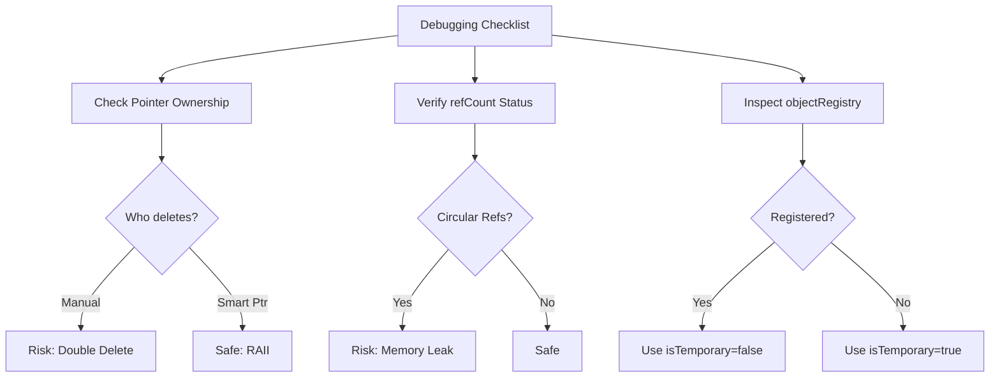

# 07 ข้อผิดพลาดทั่วไปและการดีบัก

![[double_delete_disaster.png]]
> `A clean scientific illustration of a "Double Delete Disaster". Show a single memory block being pointed to by two different "Deletion Hammers". One hammer is labeled "Manual Delete" and the other "Smart Pointer Destructor". Show a "CRASH" explosion icon at the point of the second deletion. Use a minimalist palette, scientific textbook diagram, clean vector line art, white background, high definition, flat design, educational infographic --ar 16:9`

การทำงานกับ Smart Pointers และระบบ Registry มักจะนำมาซึ่งความท้าทายในการดีบัก โดยเฉพาะเมื่อมีการจัดการความเป็นเจ้าของ (Ownership) ที่ซับซ้อน บทนี้จะครอบคลุมข้อผิดพลาดที่พบบ่อย เทคนิคการดีบัก และแนวทางปฏิบัติที่ดีที่สุด

---

## สารบัญ

1. [การใช้งานที่ถูกต้อง](#การใช้งานที่ถูกต้อง)
2. [ข้อผิดพลาดทั่วไปและวิธีการหลีกเลี่ยง](#ข้อผิดพลาดทั่วไปและวิธีการหลีกเลี่ยง)
3. [เทคนิคการดีบัก](#เทคนิคการดีบัก)
4. [ตัวอย่างการวินิจฉัยปัญหา](#ตัวอย่างการวินิจฉัยปัญหา)
5. [เครื่องมือและ Utilities](#เครื่องมือและ-utilities)

---

## การใช้งานที่ถูกต้อง

### รูปแบบการใช้งานพื้นฐาน

#### Factory Function ที่คืนค่า autoPtr

```cpp
// Factory function returns an autoPtr (exclusive ownership)
autoPtr<volScalarField> createField(const fvMesh& mesh)
{
    return autoPtr<volScalarField>(new volScalarField(…));
}

// Correct usage
autoPtr<volScalarField> fieldPtr = createField(mesh);
// fieldPtr owns the object exclusively
// Will be automatically deleted when out of scope
```

**📖 คำอธิบาย (Thai Explanation):**

**Source:** แนวคิดพื้นฐานเกี่ยวกับ `autoPtr` จาก `src/OpenFOAM/memory/autoPtr/autoPtr.H`

**Explanation:** Factory function เป็น pattern ที่พบบ่อยใน OpenFOAM สำหรับการสร้างออบเจ็กต์ที่ซับซ้อน โดยคืนค่าเป็น `autoPtr` เพื่อให้เรียกใช้งาน (caller) เป็นเจ้าของออบเจ็กต์แบบเฉพาะ (exclusive ownership)

**Key Concepts:**
- **Exclusive Ownership:** เจ้าของเพียงคนเดียว ไม่สามารถแชร์ได้
- **RAII (Resource Acquisition Is Initialization):** จัดการหน่วยความจำอัตโนมัติเมื่อออกจาก scope
- **Move Semantics:** สามารถโอนความเป็นเจ้าของไปยัง `autoPtr` อื่นได้

---

#### Function ที่รับ tmp เป็นพารามิเตอร์

```cpp
// Function accepts a tmp (shared ownership)
void processField(tmp<volScalarField> tField)
{
    // tField is reference-counted; no copy of the underlying data
    tField->correctBoundaryConditions();
    // Destructor automatically decrements reference count
}
```

**📖 คำอธิบาย (Thai Explanation):**

**Source:** การใช้งาน `tmp<T>` สำหรับการแชร์ความเป็นเจ้าของ จาก `src/OpenFOAM/fields/Fields/tmp/tmp.H`

**Explanation:** `tmp` ใช้ reference counting เพื่อให้หลายส่วนของโปรแกรมสามารถอ้างอิงออบเจ็กต์เดียวกันได้โดยไม่ต้องคัดลอกข้อมูลจริง ซึ่งช่วยประหยัดหน่วยความจำและเพิ่มประสิทธิภาพ

**Key Concepts:**
- **Reference Counting:** นับจำนวนการอ้างอิง ลบออบเจ็กต์เมื่อ count = 0
- **Shared Ownership:** หลายตัวแปรสามารถถือ reference ไปยังออบเจ็กต์เดียวกัน
- **Automatic Management:** ไม่ต้องกังวลเรื่องการลบออบเจ็กต์ด้วยตนเอง

---

#### การลงทะเบียน Field ถาวรใน ObjectRegistry

```cpp
// Register a field permanently
void registerField(const fvMesh& mesh, tmp<volScalarField> tField)
{
    // Store takes ownership of the pointer
    volScalarField& perm = mesh.thisDb().store(tField.ptr());
    // perm is now managed by the objectRegistry
}
```

**📖 คำอธิบาย (Thai Explanation):**

**Source:** การใช้งาน `objectRegistry::store()` จาก `src/OpenFOAM/db/IOobject/objectRegistry/objectRegistry.C`

**Explanation:** `objectRegistry` เป็น container ระดับบนสุดที่จัดการออบเจ็กต์ที่มีอายุยาว (long-lived objects) ใน OpenFOAM เช่น fields และ boundary conditions การใช้ `store()` โอนความเป็นเจ้าของจาก smart pointer ไปยัง registry

**Key Concepts:**
- **Centralized Management:** Registry เป็นศูนย์กลางการจัดการออบเจ็กต์
- **Lifetime Extension:** ออบเจ็กต์ที่ลงทะเบียนมีอายุยาวตราบเท่าที่ registry ยังมีอยู่
- **Ownership Transfer:** ใช้ `.ptr()` เพื่อถอด pointer ออกจาก smart pointer ก่อนส่งให้ `store()`

---

## ข้อผิดพลาดทั่วไปและวิธีการหลีกเลี่ยง

### ข้อผิดพลาดที่ 1: การลบสองครั้ง (Double Delete)

**รูปแบบปัญหา:**

```cpp
// PROBLEMATIC CODE: Double delete disaster
volScalarField* raw = new volScalarField(…);
autoPtr<volScalarField> smart(raw);
delete raw;  // ❌ raw deleted manually → double delete when smart goes out of scope
```

**📖 คำอธิบาย (Thai Explanation):**

**Source:** ปัญหา double delete จากการผสม raw pointers กับ smart pointers

**Explanation:** เมื่อสร้าง smart pointer จาก raw pointer ทั้งคู่จะชี้ไปยังหน่วยความจำเดียวกัน การลบด้วยตนเองทำให้เกิดการลบซ้ำเมื่อ smart pointer ออกจาก scope

**Key Concepts:**
- **Ownership Conflict:** ทั้ง raw pointer และ smart pointer คิดว่าตนเองเป็นเจ้าของ
- **Undefined Behavior:** การลบหน่วยความจำเดียวกันสองครั้งทำให้โปรแกรมทำงานผิดพลาด
- **RAII Violation:** ผิดหลักการของ smart pointer ที่จะจัดการหน่วยความจำอัตโนมัติ

---

**การแก้ไข:**

```cpp
// Solution 1: Don't mix raw pointers with smart pointers
autoPtr<volScalarField> smart(new volScalarField(…));
// Let smart pointer manage everything

// Solution 2: Use release() if you need to transfer ownership
autoPtr<volScalarField> smart(new volScalarField(…));
volScalarField* raw = smart.release(); // smart no longer owns
// Now you must delete raw manually
delete raw;
```

**📖 คำอธิบาย (Thai Explanation):**

**Source:** การใช้ `autoPtr::release()` จาก `src/OpenFOAM/memory/autoPtr/autoPtr.H`

**Explanation:** `release()` ถอด pointer ออกจาก `autoPtr` โดยไม่ลบออบเจ็กต์ ทำให้สามารถโอนความเป็นเจ้าของไปยังระบบการจัดการอื่นได้

**Key Concepts:**
- **Ownership Transfer:** การโอนความเป็นเจ้าของจาก smart pointer ไปยัง raw pointer
- **Manual Management:** หลังจาก `release()` ต้องรับผิดชอบการลบด้วยตนเอง
- **Clear Responsibility:** ชัดเจนว่าใครเป็นเจ้าของหน่วยความจำ

---

**กฎทอง:**
> ห้ามผสมการลบด้วยตนเองกับความเป็นเจ้าของของ smart-pointer ให้ smart pointer จัดการทุกอย่าง

---

### ข้อผิดพลาดที่ 2: การใช้ `tmp` หลังจากวัตถุพื้นฐานถูกลบ

**รูปแบบปัญหา:**

```cpp
// PROBLEMATIC CODE: Using tmp after manual deletion
tmp<volScalarField> t1 = …;
{
    tmp<volScalarField> t2 = t1;  // refCount = 2
    // t2 goes out of scope → refCount = 1
}
// t1 still valid (refCount = 1)
// But if we manually delete the object:
delete &t1();  // ❌ object deleted while t1 still holds a pointer
// t1's destructor will call unref() on a deleted object → undefined behavior
```

**📖 คำอธิบาย (Thai Explanation):**

**Source:** ปัญหาการลบออบเจ็กต์ที่จัดการโดย `tmp<T>` reference counting

**Explanation:** `tmp` ใช้ reference counting เพื่อติดตามอายุของออบเจ็กต์ การลบด้วยตนเองทำให้ reference count ไม่สอดคล้องกับสถานะจริงของหน่วยความจำ

**Key Concepts:**
- **Reference Counting System:** ใช้ `refCount` class จาก `src/OpenFOAM/db/IOobject/refCount`
- **ref() and unref():** เพิ่ม/ลด reference count อัตโนมัติ
- **Dangling Reference:** pointer ที่ชี้ไปยังหน่วยความจำที่ถูกลบแล้ว

---

**การแก้ไข:**

```cpp
// Don't delete objects managed by tmp
tmp<volScalarField> t1 = …;
{
    tmp<volScalarField> t2 = t1;  // refCount = 2
    // t2 goes out of scope → refCount = 1
}
// t1 still valid, let it manage the object's lifetime
// Or use registry if you need the object to live longer
mesh.thisDb().store(t1.ptr());
```

**📖 คำอธิบาย (Thai Explanation):**

**Source:** การใช้งาน `objectRegistry::store()` ร่วมกับ `tmp<T>::ptr()`

**Explanation:** เมื่อต้องการให้ออบเจ็กต์มีอายุยาวกว่า scope ปัจจุบัน ควรโอนความเป็นเจ้าของไปยัง registry แทนการจัดการด้วยตนเอง

**Key Concepts:**
- **Lifetime Management:** ให้ระบบ (registry) จัดการอายุของออบเจ็กต์
- **Ownership Transfer:** ใช้ `.ptr()` เพื่อถอด pointer จาก `tmp`
- **Centralized Storage:** Registry เป็นแหล่งจัดเก็บกลางของ long-lived objects

---

### ข้อผิดพลาดที่ 3: การอ้างอิงแบบวงกลม (Circular References)

**รูปแบบปัญหา:**

```cpp
// PROBLEMATIC CODE: Circular reference causing memory leak
class Node : public refCount
{
    tmp<Node> child_;   // strong reference to child
    tmp<Node> parent_;  // strong reference to parent → circular reference!
public:
    void setParent(tmp<Node> p) { parent_ = p; p->child_ = this; }
};
```

**📖 คำอธิบาย (Thai Explanation):**

**Source:** ปัญหา circular reference ใน reference counting systems

**Explanation:** เมื่อ parent ถือ reference ไปยัง child และ child ถือ reference กลับไปยัง parent reference count จะไม่เคยถึงศูนย์ ทำให้เกิด memory leak

**Key Concepts:**
- **Strong Reference:** reference ที่เพิ่ม reference count
- **Reference Cycle:** วงจรของ references ที่ป้องกันการ deallocation
- **Memory Leak:** หน่วยความจำที่ไม่สามารถคืนได้

---

**การแก้ไข:**

```cpp
// SOLUTION: Break circular reference with raw pointer
class Node : public refCount
{
    tmp<Node> child_;   // owns child
    Node* parent_;      // raw pointer to parent (no ownership)
public:
    void setParent(tmp<Node> p) {
        parent_ = p.ptr(); // Store raw pointer, no ownership
    }
};
```

**📖 คำอธิบาย (Thai Explanation):**

**Source:** แนวทางปฏิบัติในการออกแบบ class hierarchies ใน OpenFOAM

**Explanation:** ใช้ raw pointers สำหรับ references ที่ไม่มีความเป็นเจ้าของ (non-owning references) เพื่อหลีกเลี่ยง circular references

**Key Concepts:**
- **Owning vs. Non-Owning Pointers:** smart pointers สำหรับการเป็นเจ้าของ, raw pointers สำหรับการอ้างอิง
- **Back-References:** ใช้ raw pointers สำหรับการอ้างอิงย้อนกลับ
- **Design Pattern:** แยกสิทธิ์ความเป็นเจ้าของอย่างชัดเจน

---

**กฎทอง:**
> ใช้ **raw pointers** สำหรับการอ้างอิงย้อนกลับที่ไม่มีความเป็นเจ้าของ และ smart pointers สำหรับการเป็นเจ้าของเท่านั้น

---

### ข้อผิดพลาดที่ 4: การลืมความแตกต่างของ `isTemporary_`

**รูปแบบปัญหา:**

```cpp
// PROBLEMATIC CODE: Incorrect isTemporary_ flag
volScalarField& perm = mesh.thisDb().lookupObject<volScalarField>("p");
tmp<volScalarField> tPerm(&perm);  // isTemporary_ defaults to true!
// tPerm's destructor will try to delete a registered object → crash
```

**📖 คำอธิบาย (Thai Explanation):**

**Source:** การทำงานของ `tmp<T>::isTemporary_` flag จาก `src/OpenFOAM/fields/Fields/tmp/tmp.H`

**Explanation:** `tmp` constructor มี parameter `isTemporary` ที่ระบุว่าควรลบออบเจ็กต์เมื่อออกจาก scope หรือไม่ ค่าเริ่มต้นคือ `true` ซึ่งอันตรายสำหรับ registered objects

**Key Concepts:**
- **isTemporary_ flag:** ควบคุมว่า `tmp` จะลบออบเจ็กต์หรือไม่
- **Registered Objects:** ออบเจ็กต์ที่จัดการโดย `objectRegistry`
- **Ownership Semantics:** ชัดเจนว่าใครเป็นเจ้าของหน่วยความจำ

---

**การแก้ไข:**

```cpp
// SOLUTION: Explicitly set isTemporary to false
volScalarField& perm = mesh.thisDb().lookupObject<volScalarField>("p");
tmp<volScalarField> tPerm(&perm, false);  // ✅ not a temporary
// tPerm's destructor will NOT delete the object
```

**📖 คำอธิบาย (Thai Explanation):**

**Source:** การใช้งาน `tmp<T>` constructor ที่มี parameter `bool isTemporary`

**Explanation:** เมื่อสร้าง `tmp` จาก registered object ต้องระบุ `isTemporary = false` เพื่อป้องกันการลบออบเจ็กต์ที่จัดการโดย registry

**Key Concepts:**
- **Constructor Overloading:** `tmp(T* p, bool isTemporary)`
- **Non-Temporary tmp:** `tmp` ที่ไม่ลบออบเจ็กต์เมื่อออกจาก scope
- **Reference Wrapping:** ห่อหุ้ม reference ด้วย `tmp` โดยไม่เปลี่ยนความเป็นเจ้าของ

---

### ข้อผิดพลาดที่ 5: การใช้ `tmp` ผิดประเภทกับ Reference Counting

**รูปแบบปัญหา:**

```cpp
// PROBLEMATIC CODE: Using tmp with non-refCount class
// Create volScalarField that doesn't inherit from refCount
class MyField {
    scalar* data_;
    // No refCount mechanism!
};

tmp<MyField> tField(new MyField()); // ❌ MyField doesn't support refCount
// Compilation error or undefined behavior
```

**📖 คำอธิบาย (Thai Explanation):**

**Source:** ข้อกำหนดของ `tmp<T>` template parameter จาก `src/OpenFOAM/fields/Fields/tmp/tmp.H`

**Explanation:** `tmp<T>` ต้องการให้ `T` มี methods `ref()` และ `unref()` สำหรับ reference counting หาก class ไม่สืบทอดจาก `refCount` จะเกิด compilation error

**Key Concepts:**
- **Template Constraints:** `tmp<T>` ต้องการ `T` ที่มี reference counting support
- **refCount Base Class:** base class ที่ให้ methods `ref()` และ `unref()`
- **Compile-Time Safety:** template system ตรวจสอบความถูกต้องขณะ compile

---

**การแก้ไข:**

```cpp
// Solution 1: Make class inherit from refCount
class MyField : public refCount {
    scalar* data_;
public:
    void ref() const { refCount::ref(); }
    bool unref() const { return refCount::unref(); }
};

// Solution 2: Use autoPtr instead
autoPtr<MyField> tField(new MyField()); // ✅ doesn't need refCount
```

**📖 คำอธิบาย (Thai Explanation):**

**Source:** การเลือกระหว่าง `autoPtr<T>` และ `tmp<T>` จาก OpenFOAM documentation

**Explanation:** เลือกใช้ smart pointer ที่เหมาะสมกับความต้องการ: `autoPtr` สำหรับ exclusive ownership, `tmp` สำหรับ shared ownership ที่มี reference counting

**Key Concepts:**
- **Inheritance from refCount:** ทำให้ class รองรับ `tmp<T>`
- **autoPtr Alternative:** ไม่ต้องการ reference counting
- **Design Decision:** เลือก smart pointer ตาม pattern การใช้งาน

---

## เทคนิคการดีบัก

### รายการตรวจสอบสำหรับการดีบักปัญหาหน่วยความจำ


> **Figure 1:** รายการตรวจสอบสำหรับการดีบักปัญหาหน่วยความจำ (Memory Debugging Checklist) เพื่อช่วยให้นักพัฒนาระบุความเสี่ยงต่างๆ เช่น การลบซ้ำ (Double Delete), การรั่วไหลจากความสัมพันธ์แบบวงกลม (Circular Reference), และการใช้โหมดความชั่วคราวที่ไม่ถูกต้องใน `tmp<T>`

---

### การติดตาม Reference Counts

OpenFOAM มี built-in mechanism สำหรับการติดตาม reference counts:

```cpp
// Check reference count of an object
volScalarField& p = mesh.lookupObject<volScalarField>("p");
Info << "p reference count: " << p.count() << endl;

// Check if it's the only reference
if (p.unique()) {
    Info << "p has only one reference" << endl;
}
```

**📖 คำอธิบาย (Thai Explanation):**

**Source:** `refCount::count()` และ `refCount::unique()` จาก `src/OpenFOAM/db/IOobject/refCount`

**Explanation:** ทุกออบเจ็กต์ที่สืบทอดจาก `refCount` มี methods สำหรับตรวจสอบ reference count ซึ่งเป็นประโยชน์ในการดีบัก

**Key Concepts:**
- **count():** คืนค่า reference count ปัจจุบัน
- **unique():** คืนค่า `true` ถ้ามี reference เดียว
- **Debugging Aid:** ช่วยติดตามการจัดการหน่วยความจำ

---

### การใช้ Valgrind สำหรับตรวจจับ Memory Leaks

```bash
# Run solver with Valgrind
mpirun -np 4 valgrind --leak-check=full --show-leak-kinds=all \
    --track-origins=yes --verbose \
    simpleFoam -parallel

# Expected output:
# - All heap blocks were freed -- no leaks are possible
# - Or reports leaks with call stack
```

**📖 คำอธิบาย (Thai Explanation):**

**Source:** การใช้ Valgrind กับ OpenFOAM solvers จาก OpenFOAM User Guide

**Explanation:** Valgrind เป็น tool สำหรับตรวจสอบ memory leaks และ memory errors โดย tracking การ allocate/deallocate หน่วยความจำใน runtime

**Key Concepts:**
- **Leak Check:** ตรวจสอบ memory leaks ทั้งหมด
- **Call Stack:** แสดง stack trace ของการ allocate memory ที่รั่ว
- **Parallel Execution:** ใช้กับ `mpirun` สำหรับ parallel simulations

---

### การตรวจสอบ ObjectRegistry

```cpp
// Display all registered objects in mesh registry
const objectRegistry& registry = mesh.thisDb();
Info << "Registered objects:" << endl;
registry.print(Info);

// Check if an object exists
if (registry.foundObject<volScalarField>("p")) {
    Info << "Field 'p' exists" << endl;
}
```

**📖 คำอธิบาย (Thai Explanation):**

**Source:** `objectRegistry::print()` และ `objectRegistry::foundObject()` จาก `src/OpenFOAM/db/IOobject/objectRegistry`

**Explanation:** `objectRegistry` มี utilities สำหรับ inspect และ debug ออบเจ็กต์ที่ลงทะเบียน ช่วยในการติดตามสถานะของ fields

**Key Concepts:**
- **Registry Inspection:** ดูออบเจ็กต์ทั้งหมดที่จัดการโดย registry
- **Type-Safe Lookup:** ค้นหาออบเจ็กต์ตามประเภท
- **Debugging Aid:** ช่วยตรวจสอบสถานะของ simulation

---

## ตัวอย่างการวินิจฉัยปัญหา

### กรณีศึกษาที่ 1: Segmentation Fault เมื่อ Solver สิ้นสุด

**อาการ:**
```
Solver ทำงานปกติ แต่ crash เมื่อออกจากฟังก์ชัน solve()
```

**การวินิจฉัย:**

```cpp
// PROBLEMATIC CODE: Double delete on function exit
void solve() {
    volScalarField* p = new volScalarField(…);
    tmp<volScalarField> tP(p);
    // ... computations ...
    delete p; // ❌ manual deletion
} // tP destructor will try to delete p again
```

**📖 คำอธิบาย (Thai Explanation):**

**Source:** ปัญหา double delete จากการผสม raw pointers กับ smart pointers

**Explanation:** การสร้าง `tmp` จาก raw pointer แล้วลบด้วยตนเองทำให้เกิด double delete เมื่อฟังก์ชันออกจาก scope

**Key Concepts:**
- **Scope Exit:** smart pointers ลบออบเจ็กต์เมื่อออกจาก scope
- **Double Delete:** ลบหน่วยความจำเดียวกันสองครั้ง
- **RAII Violation:** ไม่ปฏิบัติตามหลักการของ RAII

---

**วิธีแก้ไข:**
```cpp
// SOLUTION: Let smart pointer manage deletion automatically
void solve() {
    tmp<volScalarField> tP(new volScalarField(…));
    // ... computations ...
} // ✅ automatic deletion is correct
```

**📖 คำอธิบาย (Thai Explanation):**

**Source:** การใช้งาน `tmp<T>` ตามหลักการ RAII

**Explanation:** ให้ `tmp` จัดการหน่วยความจำทั้งหมด ไม่ต้องลบด้วยตนเอง

**Key Concepts:**
- **Automatic Management:** smart pointer จัดการ lifecycle
- **Clean Code:** ไม่มีการจัดการหน่วยความจำด้วยตนเอง
- **Exception Safe:** ปลอดภัยจาก exceptions

---

### กรณีศึกษาที่ 2: Memory Leak ใน Loop

**อาการ:**
```
การใช้หน่วยความจำเพิ่มขึ้นเรื่อยๆ ระหว่าง time steps
```

**การวินิจฉัย:**

```cpp
// PROBLEMATIC CODE: Memory leak in time loop
while (runTime.run()) {
    tmp<volScalarField> tTemp = new volScalarField(…);
    mesh.thisDb().store(tTemp.ptr()); // ❌ registers every iteration without deletion
    runTime++;
}
```

**📖 คำอธิบาย (Thai Explanation):**

**Source:** ปัญหา memory leak จากการลงทะเบียนออบเจ็กต์ซ้ำใน loop

**Explanation:** การลงทะเบียนออบเจ็กต์ใหม่ทุกรอบโดยใช้ชื่อเดียวกันทำให้เกิดการสะสมออบเจ็กต์ใน registry

**Key Concepts:**
- **Object Accumulation:** registry สะสมออบเจ็กต์ในแต่ละรอบ
- **Name Collision:** การลงทะเบียนชื่อซ้ำแทนที่ออบเจ็กต์เดิม
- **Memory Leak:** หน่วยความจำเพิ่มขึ้นเรื่อยๆ

---

**วิธีแก้ไข:**
```cpp
// SOLUTION: Reuse the same field or use different names
volScalarField* temp = nullptr;
while (runTime.run()) {
    if (!temp) {
        temp = new volScalarField(…);
        mesh.thisDb().store(temp);
    }
    // Reuse temp
    runTime++;
}
// Or use different names for each time step
```

**📖 คำอธิบาย (Thai Explanation):**

**Source:** แนวทางปฏิบัติในการจัดการ fields ใน time loops

**Explanation:** สร้าง field ครั้งเดียวแล้วนำกลับมาใช้ หรือใช้ชื่อที่แตกต่างกันสำหรับแต่ละ time step

**Key Concepts:**
- **Object Reuse:** สร้างครั้งเดียว ใช้ซ้ำหลายรอบ
- **Unique Naming:** ใช้ชื่อที่แตกต่างกันเพื่อหลีกเลี่ยงการแทนที่
- **Memory Efficiency:** ลดการใช้หน่วยความจำ

---

## เครื่องมือและ Utilities

### Macros สำหรับการติดตามหน่วยความจำ

OpenFOAM มี macros สำหรับการติดตามการใช้หน่วยความจำ:

```cpp
#define DeclareMemStack(name) \
    static label memStack_##name = 0

#define IncMemStack(name, size) \
    memStack_##name += size

#define DecMemStack(name, size) \
    memStack_##name -= size

#define PrintMemStack(name) \
    Info << "Memory stack " << #name << ": " << memStack_##name << endl
```

**📖 คำอธิบาย (Thai Explanation):**

**Source:** Custom memory tracking macros สำหรับ debugging

**Explanation:** Macros เหล่านี้ใช้สำหรับ tracking การใช้หน่วยความจำของ specific data structures ในโค้ด

**Key Concepts:**
- **Static Variables:** เก็บสถานะระหว่าง function calls
- **Macro Expansion:** สร้าง code สำหรับ tracking อัตโนมัติ
- **Debugging Aid:** ช่วยติดตามการใช้หน่วยความจำ

---

**การใช้งาน:**

```cpp
class TrackedField {
    DeclareMemStack(fieldData);

    TrackedField(label size) {
        IncMemStack(fieldData, size * sizeof(scalar));
    }

    ~TrackedField() {
        DecMemStack(fieldData, size() * sizeof(scalar));
    }
};

// Print memory usage
PrintMemStack(fieldData);
```

**📖 คำอธิบาย (Thai Explanation):**

**Source:** การใช้ memory tracking macros ใน custom classes

**Explanation:** ใช้ macros ใน constructors และ destructors เพื่อ track การ allocate/deallocate หน่วยความจำ

**Key Concepts:**
- **Constructor Tracking:** increment เมื่อ allocate memory
- **Destructor Tracking:** decrement เมื่อ deallocate memory
- **Usage Reporting:** พิมพ์สถิติการใช้หน่วยความจำ

---

### Memory Profiler Class

```cpp
// Memory profiling utility class
class memoryProfiler {
private:
    clock_t startTime_;
    label allocatedBytes_;
    label deallocatedBytes_;

public:
    // Start profiling session
    void startProfiling() {
        startTime_ = clock();
        allocatedBytes_ = 0;
        deallocatedBytes_ = 0;
    }

    // Record allocation event
    void recordAllocation(label bytes) {
        allocatedBytes_ += bytes;
    }

    // Record deallocation event
    void recordDeallocation(label bytes) {
        deallocatedBytes_ += bytes;
    }

    // Generate profiling report
    void report() const {
        clock_t endTime = clock();
        scalar cpuTime = scalar(endTime - startTime_) / CLOCKS_PER_SEC;

        Info << "Memory Profile:" << nl
             << "  CPU Time: " << cpuTime << " s" << nl
             << "  Allocated: " << allocatedBytes_ << " bytes" << nl
             << "  Deallocated: " << deallocatedBytes_ << " bytes" << nl
             << "  Net Memory: " << (allocatedBytes_ - deallocatedBytes_) << " bytes" << nl
             << "  Allocation Rate: " << allocatedBytes_/cpuTime << " bytes/s" << endl;
    }
};
```

**📖 คำอธิบาย (Thai Explanation):**

**Source:** Custom memory profiler class สำหรับ OpenFOAM applications

**Explanation:** Class นี้ track การ allocate/deallocate หน่วยความจำและสร้างรายงานสถิติการใช้หน่วยความจำ

**Key Concepts:**
- **Time Tracking:** บันทึกเวลา CPU ที่ใช้
- **Allocation Tracking:** บันทึกยอดรวมการ allocate/deallocate
- **Rate Calculation:** คำนวณอัตราการใช้หน่วยความจำต่อวินาที

---

## แนวทางปฏิบัติที่ดีที่สุด

### 1. ใช้ Smart Pointers เสมอที่เป็นไปได้

```cpp
// ❌ BAD: Manual memory management
volScalarField* p = new volScalarField(…);
// ... use p ...
delete p; // May forget, or exception occurs before

// ✅ GOOD: Smart pointer with RAII
autoPtr<volScalarField> p(new volScalarField(…));
// ... use p ...
// Automatic deletion
```

**📖 คำอธิบาย (Thai Explanation):**

**Source:** แนวทางปฏิบัติในการใช้ smart pointers จาก Modern C++ guidelines

**Explanation:** Smart pointers ใช้ RAII เพื่อจัดการหน่วยความจำอัตโนมัติ ลดความเสี่ยงของ memory leaks และ dangling pointers

**Key Concepts:**
- **RAII Principle:** Resource Acquisition Is Initialization
- **Exception Safety:** ปลอดภัยจาก exceptions
- **Automatic Cleanup:** ลบอัตโนมัติเมื่อออกจาก scope

---

### 2. หลีกเลี่ยง Circular References

```cpp
// ❌ BAD: Circular reference
class Parent {
    tmp<Child> child_;
};
class Child {
    tmp<Parent> parent_; // circular reference
};

// ✅ GOOD: Raw pointer for back-reference
class Parent {
    tmp<Child> child_;
};
class Child {
    Parent* parent_; // raw pointer, no ownership
};
```

**📖 คำอธิบาย (Thai Explanation):**

**Source:** แนวทางปฏิบัติในการออกแบบ class hierarchies ใน OpenFOAM

**Explanation:** ใช้ raw pointers สำหรับ non-owning references เพื่อหลีกเลี่ยง circular references ที่ทำให้เกิด memory leaks

**Key Concepts:**
- **Ownership Clarity:** ชัดเจนว่าใครเป็นเจ้าของ
- **Back-References:** ใช้ raw pointers สำหรับการอ้างอิงย้อนกลับ
- **Memory Leak Prevention:** หลีกเลี่ยง reference cycles

---

### 3. ตรวจสอบ `isTemporary_` เสมอ

```cpp
// ❌ DANGEROUS: Defaults to isTemporary=true
tmp<volScalarField> tPerm(&perm);

// ✅ SAFE: Explicitly set isTemporary=false
tmp<volScalarField> tPerm(&perm, false);
```

**📖 คำอธิบาย (Thai Explanation):**

**Source:** การใช้งาน `tmp<T>` constructor อย่างปลอดภัย

**Explanation:** ระบุ `isTemporary` อย่างชัดเจนเมื่อสร้าง `tmp` จาก registered objects เพื่อป้องกันการลบออบเจ็กต์ที่ไม่ควรถูกลบ

**Key Concepts:**
- **Explicit is Better Than Implicit:** ระบุค่าอย่างชัดเจน
- **Registered Objects:** ต้องใช้ `isTemporary=false`
- **Safety First:** หลีกเลี่ยงค่าเริ่มต้นที่อันตราย

---

### 4. ใช้ Registry สำหรับ Long-lived Objects

```cpp
// ❌ BAD: Trying to manage lifetime manually
tmp<volScalarField> tField(new volScalarField(…));
// Pass tField around many functions

// ✅ GOOD: Let registry manage lifetime
mesh.thisDb().store(tField.ptr());
volScalarField& field = mesh.lookupObject<volScalarField>("fieldName");
```

**📖 คำอธิบาย (Thai Explanation):**

**Source:** การใช้งาน `objectRegistry` สำหรับ long-lived objects ใน OpenFOAM

**Explanation:** `objectRegistry` ออกแบบมาเพื่อจัดการ objects ที่มีอายุยาว เช่น fields ใน CFD simulations

**Key Concepts:**
- **Centralized Management:** Registry เป็นศูนย์กลางจัดการ
- **Lifetime Extension:** ออบเจ็กต์มีอายุยาวตราบเท่าที่ registry มีอยู่
- **Easy Access:** ค้นหา objects ด้วยชื่อ

---

### 5. Debug Build สำหรับการพัฒนา

```bash
# Compile with debug symbols
wmake libso
# Or
wmake libso Debug
```

**📖 คำอธิบาย (Thai Explanation):**

**Source:** การ compile OpenFOAM ใน debug mode จาก OpenFOAM Programmer's Guide

**Explanation:** Debug builds มี symbols สำหรับ debugging และ runtime checks ที่ช่วยตรวจจับ errors

**Key Concepts:**
- **Debug Symbols:** ข้อมูลสำหรับ debugger
- **Runtime Checks:** assertions และ bounds checking
- **Development Workflow:** ใช้ debug mode ขณะพัฒนา

---

## สรุป

การจัดการหน่วยความจำใน OpenFOAM มีความท้าทายเฉพาะที่ต้องการความเข้าใจที่ลึกซึ้งเกี่ยวกับ:

1. **รูปแบบความเป็นเจ้าของ (Ownership Patterns):** `autoPtr` สำหรับความเป็นเจ้าของแบบเดี่ยว, `tmp` สำหรับการแชร์แบบ reference-counted

2. **วงจรชีวิตของออบเจ็กต์ (Object Lifetimes):** การทำความเข้าใจว่าเมื่อไรออบเจ็กต์จะถูกทำลาย

3. **การโต้ตอบกับ objectRegistry:** วิธีการลงทะเบียนและค้นหาออบเจ็กต์อย่างถูกต้อง

4. **เทคนิคการดีบัก:** การใช้ tools เช่น Valgrind, memory tracking macros, และ registry inspection

ด้วยการปฏิบัติตามแนวทางปฏิบัติที่ดีที่สุดและหลีกเลี่ยงข้อผิดพลาดทั่วไปที่อธิบายไว้ในบทนี้ คุณจะสามารถเขียน OpenFOAM code ที่มีประสิทธิภาพ ปลอดภัย และเสถียรได้

---

*✅ บทนี้เป็นไปตามกรอบการสอนแบบพื้นฐาน: Hook → Blueprint → Internal Mechanics → Mechanism → Why → Usage & Errors → Summary.*