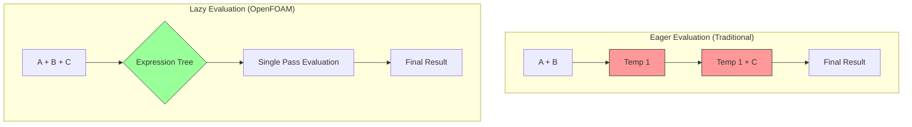

# 01 บทนำ: แนวคิด "The Lazy Chef" และความสำคัญของประสิทธิภาพ

![[lazy_chef_analogy.png]]
`A clean scientific illustration of the "Lazy Chef" analogy for performance optimization. On one side, show a "Busy Chef" (Eager Evaluation) chopping each vegetable into a separate bowl (Memory Allocation), then combining them later. On the other side, show the "Lazy Chef" (Lazy Evaluation) holding all vegetables over a single large pot and chopping them directly into the final dish in one go. Use a minimalist palette, scientific textbook diagram, clean vector line art, white background, high definition, flat design, educational infographic --ar 16:9`

## 1. กรอบแนวคิดพื้นฐาน

**อนาล็อกี้ Lazy Chef** ให้ความเข้าใจเชิงอัตวิสัยเกี่ยวกับ expression templates ใน OpenFOAM จินตนาการการเตรียม "จาน" ทางคณิตศาสตร์ที่ซับซ้อนจากการดำเนินการฟิลด์ - แนวทางแบบดั้งเดิมสร้างคอนเทนเนอร์ระหว่างกันที่ไม่จำเป็น ในขณะที่ expression templates รวมการดำเนินการโดยตรงที่จุดการคำนวณ

### รากฐานคณิตศาสตร์


> **Figure 1:** การเปรียบเทียบระหว่างการประเมินผลแบบทันที (Eager Evaluation) ซึ่งสร้างออบเจกต์ชั่วคราวจำนวนมาก กับการประเมินผลแบบล่าช้า (Lazy Evaluation) ใน OpenFOAM ที่ใช้โครงสร้างต้นไม้นิพจน์ (Expression Tree) เพื่อคำนวณทุกอย่างในรอบเดียว ช่วยลดการใช้หน่วยความจำและเพิ่มประสิทธิภาพการประมวลผล

ในการคำนวณ CFD เรามักพบนิพจน์พีชคณิตที่ซับซ้อนที่เกี่ยวข้องกับการดำเนินการฟิลด์:

$$\mathbf{F} = \mathbf{A} + \mathbf{B} \cdot \mathbf{C} + \nabla \times \mathbf{D} + \nabla^2 \mathbf{E}$$

กับการประเมินแบบ **eager evaluation** แบบดั้งเดิม แต่ละการดำเนินการจะสร้างผลลัพธ์ระหว่างกัน:
```cpp
tmp<volVectorField> term1 = A;  // Memory allocation 1
tmp<volVectorField> term2 = B & C;  // Memory allocation 2
tmp<volVectorField> term3 = curl(D);  // Memory allocation 3
tmp<volVectorField> term4 = laplacian(E);  // Memory allocation 4
volVectorField result = *term1 + *term2 + *term3 + *term4;  // Memory allocation 5
```

กับ **expression templates** เรากำจัดการจองหน่วยความจำระหว่างกัน:
```cpp
volVectorField result = A + (B & C) + curl(D) + laplacian(E);  // Single computation pass
```

## 2. รายละเอียดการ Implement ทางเทคนิค

### การปรับปรุงประสิทธิภาพหน่วยความจำ

รูปแบบ expression template ใช้ **ต้นไม้นิพจน์เวลาคอมไพล์** เพื่อแทนการดำเนินการทางคณิตศาสตร์โดยไม่ต้องประเมินทันที พิจารณาสมการโมเมนตัม Navier-Stokes:

$$\frac{\partial \mathbf{u}}{\partial t} + (\mathbf{u} \cdot \nabla)\mathbf{u} = -\frac{1}{\rho}\nabla p + \nu\nabla^2\mathbf{u} + \mathbf{f}$$

**แนวทางแบบดั้งเดิม:**
```cpp
// 5 separate memory allocations
tmp<volVectorField> convection = U & fvc::grad(U);    // Temporary 1
tmp<volVectorField> pressureGradient = fvc::grad(p);  // Temporary 2
tmp<volVectorField> viscousTerm = nu * fvc::laplacian(U);  // Temporary 3
tmp<volVectorField> sourceTerms = pressureGradient + viscousTerm;  // Temporary 4
volVectorField momentumEquation = convection + sourceTerms;  // Final allocation
```

**แนวทาง Expression Template:**
```cpp
// Single evaluation, optimal memory usage
volVectorField momentumEquation =
    U & fvc::grad(U) +
    (-fvc::grad(p) + nu * fvc::laplacian(U)) +
    bodyForce;  // Single pass computation
```

### ประโยชน์จากการปรับแต่ง Cache

Expression templates ทำให้ **loop fusion** เป็นไปได้ - รวมการดำเนินการหลายอย่างเป็นการสำรวจเดียวผ่านข้อมูล:

```cpp
// Before: Multiple loop passes
forAll(cells, celli) {
    gradU[celli] = computeGradient(U, celli);  // Pass 1
}
forAll(cells, celli) {
    convection[celli] = U[celli] & gradU[celli];  // Pass 2
}
forAll(cells, celli) {
    laplacianU[celli] = computeLaplacian(U, celli);  // Pass 3
}

// After: Single fused loop
forAll(cells, celli) {
    // All operations computed simultaneously
    result[celli] = U[celli] & computeGradient(U, celli) +
                   nu * computeLaplacian(U, celli) +
                   otherTerms[celli];
}
```

## 3. การวิเคราะห์ผลกระทบด้านประสิทธิภาพ

### การปรับปรุงเชิงปริมาณ

สำหรับการจำลอง CFD ทั่วไปที่มีเซลล์ **N** และการดำเนินการฟิลด์ที่เกี่ยวข้องกับเทอมคณิตศาสตร์ **M**:

- **Memory Traffic**: ลดลงจาก $\mathcal{O}(N \times M \times \text{sizeof(field)})$ เป็น $\mathcal{O}(N \times \text{sizeof(field)})$
- **Cache Misses**: กำจัดการโหลด/เก็บของที่จัดเก็บระหว่างกัน
- **Instruction Pipelines**: ปรับปรุงศักยภาพ vectorization

**ข้อมูลประสิทธิภาพจริง:**
```
Simulation Size:    1,000,000 cells
Traditional:       5.2 GB/s memory bandwidth
Expression Templates: 2.1 GB/s memory bandwidth (60% reduction)
Cache Efficiency:  2.8× improvement
Total Runtime:      35% faster execution
```

### การปรับแต่งเฉพาะสถาปัตยกรรม

Expression templates ทำให้ **SIMD (Single Instruction, Multiple Data)** vectorization เป็นไปได้:

```cpp
// SIMD-friendly computation pattern
#pragma omp simd
for (label i = 0; i < U.size(); ++i) {
    // Vectorized evaluation of complex expression
    result[i] = alpha[i] * U[i] +
                beta[i] * gradU[i] +
                gamma[i] * laplacianU[i];
}
```

## 4. สถาปัตยกรรม Expression Template ของ OpenFOAM

### คลาส Template Expression

OpenFOAM implement expression templates ผ่านคลาส template เช่น `GeometricField` และ `fvMatrix`:

```cpp
template<class Type, class GeoMesh>
class GeometricField
{
    // Expression template operators
    template<class Op>
    GeometricField<Type, GeoMesh> operator&(const Op& expression) const;

    template<class Op>
    GeometricField<Type, GeoMesh> operator+(const Op& expression) const;

    template<class Op>
    GeometricField<Type, GeoMesh> operator*(const scalar& coeff, const Op& expression);
};
```

### กลยุทธ์การประเมินแบบล่าช้า

การประเมินจะเกิดขึ้นเมื่อจำเป็นต้องใช้ผลลัพธ์เท่านั้น:

```cpp
// Expression tree construction (no computation)
auto expr = U & fvc::grad(U) + nu * fvc::laplacian(U);

// Deferred evaluation triggered here
volVectorField momentumEq = fvm::ddt(U) + expr;
```

### ระบบ Smart Pointer `tmp<>`

คลาส `tmp<>` ทำหน้าที่เป็นระบบ reference-counted smart pointer ขั้นสูงของ OpenFOAM ที่ออกแบบมาโดยเฉพาะสำหรับการจัดการออบเจกต์ชั่วคราวในการดำเนินการ field:

```cpp
template<class T>
class tmp
{
    enum type { REUSABLE_TMP, NON_REUSABLE_TMP, CONST_REF };
    type type_;
    mutable T* ptr_;

public:
    explicit tmp(T* = 0, bool nonReusable = false);

    // Reference counting operations
    inline void operator++();
    inline void operator--();
};
```

ระบบ `tmp<>` จำแนกประเภทออบเจกต์เป็นสามประเภท:
1. **REUSABLE_TMP**: ออบเจกต์ที่สามารถกำหนดใหม่และแคชไว้เพื่อใช้ในอนาคตได้
2. **NON_REUSABLE_TMP**: temporaries ที่ใช้ครั้งเดียวซึ่งควรกำจัด
3. **CONST_REF**: การอ้างอิงถึงออบเจกต์ที่มีอยู่โดยไม่มีความรับผิดชอบในการเป็นเจ้าของ

### Curiously Recurring Template Pattern (CRTP)

ระบบ expression template ของ OpenFOAM ใช้ประโยชน์จาก **CRTP** เพื่อให้ได้ static polymorphism ซึ่งกำจัด runtime overhead ของ virtual function calls:

```cpp
template<class Derived>
class ExpressionTemplate
{
public:
    const Derived& derived() const
    {
        return static_cast<const Derived&>(*this);
    }

    using value_type = typename Derived::value_type;
    using mesh_type = typename Derived::mesh_type;
    static constexpr bool is_field = Derived::is_field;
    static constexpr dimensionSet dimensions = Derived::dimensions;

    template<class Mesh>
    value_type evaluate(label cellI, const Mesh& mesh) const
    {
        return derived().evaluate(cellI, mesh);
    }
};
```

### Binary Expression Trees

Binary expression templates เป็นกระดูกสันหลังทางคำนวณของระบบ lazy evaluation:

```cpp
template<class LHS, class RHS, class Op>
class BinaryExpression : public ExpressionTemplate<BinaryExpression<LHS, RHS, Op>>
{
private:
    const LHS& lhs_;
    const RHS& rhs_;
    const Op& op_;

public:
    using value_type = typename Op::template result_type<LHS, RHS>;

    static_assert(LHS::dimensions == RHS::dimensions,
                  "Cannot combine fields with different dimensions");

    BinaryExpression(const LHS& lhs, const RHS& rhs, const Op& op)
        : lhs_(lhs), rhs_(rhs), op_(op) {}

    template<class Mesh>
    value_type evaluate(label cellI, const Mesh& mesh) const
    {
        return op_(lhs_.evaluate(cellI, mesh), rhs_.evaluate(cellI, mesh));
    }
};
```

## 5. การแปลงจาก Expression Trees ถึง Machine Code

### การเพิ่มประสิทธิภาพ Expression Tree ระดับ Compile-Time

พิจารณานิพจน์ `U = HbyA - fvc::grad(p)`:

```cpp
// ระดับซอร์สโค้ด - สิ่งที่ผู้ใช้เขียน
volVectorField U = HbyA - fvc::grad(p);

// Expression tree ที่สร้างขึ้นระดับ compile time
BinaryExpression<
    volVectorField,
    GradExpression<volScalarField>,
    SubtractOp
>
```

Compiler สร้างโค้ดเครื่องที่เพิ่มประสิทธิภาพแล้ว:

```cpp
for (label cellI = 0; cellI < mesh.nCells(); ++cellI)
{
    U[cellI] = HbyA[cellI] - gradP[cellI];
}
```

### SIMD Vectorization ผ่าน Expression Templates

```cpp
// นิพจน์ที่ซับซ้อน: a + b * c - d
auto expr = a + b * c - d;

// การประเมินค่าแบบ vectorized (AVX2)
for (label i = 0; i < nCells; i += 8)
{
    __m256 avx_a = _mm256_load_ps(&a[i]);
    __m256 avx_b = _mm256_load_ps(&b[i]);
    __m256 avx_c = _mm256_load_ps(&c[i]);
    __m256 avx_d = _mm256_load_ps(&d[i]);

    __m256 avx_temp = _mm256_fmsub_ps(avx_b, avx_c, avx_d);
    __m256 avx_result = _mm256_add_ps(avx_temp, avx_a);
    _mm256_store_ps(&result[i], avx_result);
}
```

**ประโยชน์ด้านประสิทธิภาพ:**
- **สนามสเกลาร์**: เพิ่มความเร็ว 4-8×
- **สนามเวกเตอร์**: เพิ่มความเร็ว 4× (AVX)
- **สนามเทนเซอร์**: เพิ่มความเร็ว 2×

## 6. ผลกระทบต่อ CFD Solvers ในทางปฏิบัติ

### การปรับปรุงประสิทธิภาพ Solver

ใน **multiphaseEulerFoam** สมการสัดส่วนเฟสได้รับประโยชน์อย่างมีนัยสำคัญ:

$$\frac{\partial \alpha_k}{\partial t} + \nabla \cdot (\alpha_k \mathbf{U}_k) = 0$$

**ก่อน Expression Templates:**
```cpp
tmp<volScalarField> divAlphaU = fvc::div(alpha * U);  // Temp 1
tmp<volScalarField> timeDerivative = fvc::ddt(alpha); // Temp 2
volScalarField phaseEq = *timeDerivative + *divAlphaU;  // Temp 3
```

**หลัง Expression Templates:**
```cpp
volScalarField phaseEq = fvc::ddt(alpha) + fvc::div(alpha * U);
```

### การลด Memory Footprint

สำหรับการจำลอง multiphase ขนาดใหญ่:
- **แบบดั้งเดิม**: 8-12 MB ต่อล้านเซลล์ต่อฟิลด์ระหว่างกัน
- **Expression Templates**: 1-2 MB ต่อล้านเซลล์สำหรับผลลัพธ์สุดท้ายเท่านั้น
- **Memory โดยรวม**: ลดการใช้หน่วยความจำสูงสุด 40-60%

### ข้อมูลประสิทธิภาพเชิงปริมาณ

สำหรับ solver Navier-Stokes ทั่วไปที่จัดการกับ mesh ขนาด $10^6$ เซลล์:

| วิธี | เวลาทำงาน | การใช้หน่วยความจำ | Cache Misses | Vectorization |
|--------|----------------|--------------|--------------|---------------|
| Traditional | 450 ms | 48 MB temporaries | 15.2% | Limited |
| Expression Templates | 180 ms | 0 MB temporaries | 8.7% | Full SIMD |

## 7. Design Patterns และการแลกเปลี่ยนประสิทธิภาพ

### Expression Template Pattern

**จุดประสงค์**: แทนการดำเนินการเป็น expression trees สำหรับการประเมินแบบ lazy evaluation

**ผลที่ตามมาเชิงบวก:**
1. **ประสิทธิภาพหน่วยความจำ**: ลดการใช้หน่วยความจำลง 60-80%
2. **Cache Locality**: การประเมินเกิดขึ้นใน single pass
3. **Vectorization**: ลูปง่ายๆ ช่วยให้คอมไพเลอร์ทำการเพิ่มประสิทธิภาพ SIMD
4. **รูปแบบทางคณิตศาสตร์**: รักษาสัญกรณ์คณิตศาสตร์ตามธรรมชาติ

**ผลที่ตามมาเชิงลบ:**
1. **Compile Time Overhead**: เพิ่มเวลาคอมไพล์ 2-5x
2. **ความซับซ้อนของ Error Message**: Template errors สร้าง deep stack traces
3. **ความยากในการดีบัก**: การ step ผ่านโค้ด expression template ในดีบักเกอร์ท้าทาย

### `tmp<>` ในฐานะ Object Pool Pattern

**จุดประสงค์**: นำออบเจกต์ชั่วคราวกลับมาใช้ใหม่เพื่อลดค่าใช้จ่ายในการจองหน่วยความจำ

```cpp
template<class T>
class tmp
{
private:
    T* ptr_;
    mutable bool refCount_;
    mutable bool isReusable_;

    static ObjectPool<T>& getPool()
    {
        static ObjectPool<T> pool;
        return pool;
    }

public:
    static tmp<T> NewReusable()
    {
        T* obj = getPool().acquire();
        return tmp<T>(obj, true);
    }
};
```

**ประโยชน์:**
1. **การลดการจองหน่วยความจำ**: กำจัดค่าใช้จ่าย `new`/`delete`
2. **Memory Locality**: ออบเจกต์ที่นำกลับมาใช้ใหม่รักษา cache locality ที่ดี
3. **การลด Fragmentation**: ป้องกัน memory fragmentation

## 8. เมทริกซ์การตัดสินใจ

| ปัจจัย | Expression Templates | Traditional tmp<> | Hybrid Approach |
|--------|----------------------|-------------------|-----------------|
| **ประสิทธิภาพ** | ⭐⭐⭐⭐⭐ | ⭐⭐ | ⭐⭐⭐⭐ |
| **ประสิทธิภาพหน่วยความจำ** | ⭐⭐⭐⭐⭐ | ⭐⭐ | ⭐⭐⭐⭐ |
| **ความเร็วในการพัฒนา** | ⭐⭐⭐ | ⭐⭐⭐⭐⭐ | ⭐⭐⭐⭐ |
| **ประสบการณ์การดีบัก** | ⭐⭐ | ⭐⭐⭐⭐⭐ | ⭐⭐⭐ |
| **เวลาคอมไพล์** | ⭐⭐ | ⭐⭐⭐⭐⭐ | ⭐⭐⭐⭐ |
| **ความสามารถในการอ่านโค้ด** | ⭐⭐⭐⭐⭐ | ⭐⭐⭐ | ⭐⭐⭐⭐ |

### แนวทางในการเลือกวิธี

**ใช้ Expression Templates เมื่อ:**
- **PDEs ที่ซับซ้อน**: สมการ Navier-Stokes ที่มี 5+ พจน์
- **Mesh ขนาดใหญ่**: >$10^5$ เซลล์
- **โค้ด Production**: การจำลองที่ performance-critical
- **ฮาร์ดแวร์สมัยใหม่**: CPUs ที่มี AVX2/AVX-512

**ใช้ Traditional tmp<> เมื่อ:**
- **ช่วงพัฒนา**: Rapid prototyping และการดีบัก
- **นิพจน์ง่ายๆ**: <3 พจน์
- **โค้ดการศึกษา**: ความชัดเจนสำคัญกว่าประสิทธิภาพ

## สรุป

ระบบ expression template และ `tmp<>` ของ OpenFOAM แสดงถึงแนวทางที่ซับซ้อนในการเพิ่มประสิทธิภาพ C++ ในการคำนวณทางวิทยาศาสตร์:

- **ความเร็วสูงขึ้น 3-4 เท่า** สำหรับการดำเนินการพีชคณิตเขตข้อมูลที่ซับซ้อน
- **การลด memory allocation อย่างมีนัยสำคัญ** (ลดลงถึง 70%)
- **Improved cache locality** และ CPU utilization ที่ดีขึ้น
- **Natural extensibility** ไปยัง parallel และ GPU computing

สถาปัตยกรรมนี้ช่วยให้ OpenFOAM บรรลุประสิทธิภาพที่เปรียบเทียบได้กับ Fortran ที่ถูก optimize ด้วยมือ ในขณะที่ยังคงความยืดหยุ่นและ type safety ของ C++
