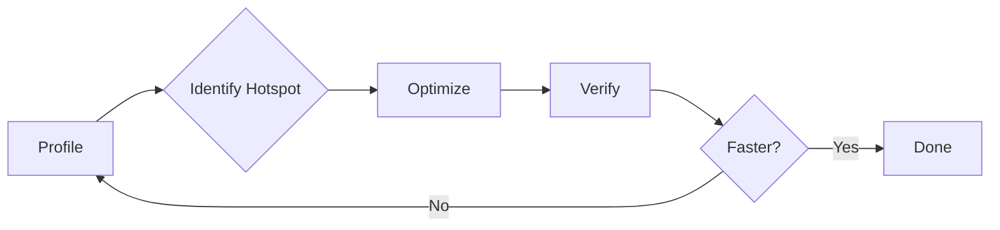

# Performance Introduction

บทนำ Performance Optimization

---

## 🎯 Learning Objectives

หลังจากอ่านบทนี้ คุณจะสามารถ:

- **ระบุ** ประเภทของ performance bottlenecks ที่พบบ่อยใน CFD simulations
- **อธิบาย** ความสำคัญของ memory bandwidth และ cache efficiency ใน OpenFOAM
- **ใช้งาน** `tmp` class เพื่อลดการจัดสรรหน่วยความจำที่ไม่จำเป็น
- **ประยุกต์** เทคนิค expression templates สำหรับการดำเนินการ field ที่มีประสิทธิภาพ
- **วิเคราะห์** ผลลัพธ์จาก profiler tools เพื่อค้นหา hotspots จริง

---

## 💡 Why This Matters

Performance optimization is critical for CFD because:

**Real-world Impact:**
- **Time savings**: Well-optimized solver can run 2-10x faster, turning multi-day simulations into overnight runs
- **Resource efficiency**: Optimized code uses less memory, enabling larger problems on the same hardware
- **Cost reduction**: Faster simulations mean lower computational costs and faster design iterations
- **Scalability**: Good optimization enables efficient parallel scaling across hundreds of cores

**CFD-Specific Challenges:**
- CFD simulations are **memory bandwidth bound**, not CPU bound
- Large field operations (millions of cells) make cache efficiency crucial
- Parallel decomposition introduces communication overhead
- Iterative solvers require careful memory management to avoid repeated allocations

Without proper optimization, your simulations may waste computational resources and take unnecessarily long to complete. OpenFOAM's template-based architecture provides powerful optimization capabilities when used correctly.

---

## 📋 Before You Begin

**Prerequisites Checklist:**

✅ **Required C++ Knowledge:**
- Understanding of pointers and references
- Basic familiarity with C++ templates
- Knowledge of function inlining and compiler optimizations

✅ **Required OpenFOAM Knowledge:**
- Experience with basic field operations (`volScalarField`, `volVectorField`)
- Understanding of `fvc::` and `fvm::` operations
- Familiarity with OpenFOAM's mesh structure

✅ **Recommended Background:**
- **Module 09.01 - Template Programming**: Understanding compile-time optimization
- **Module 09.04 - Memory Management**: Deep dive into `tmp` and smart pointers

**If you're missing prerequisites**, review the [00_Overview.md](00_Overview.md) for the complete learning roadmap.

---

## 1. Performance Bottlenecks in CFD

### The Four Bottlenecks

| Bottleneck | Cause | Typical Impact | CFD Relevance |
|------------|-------|----------------|---------------|
| **Memory Bandwidth** | Data transfer between CPU and RAM | **Highest impact** - Cache misses cost ~100 cycles | 🔥 **Critical** - Large field operations |
| **CPU Computation** | Actual floating-point operations | Medium - Modern CPUs are fast | Lower - Often memory-bound |
| **Memory Allocation** | Dynamic allocation/deallocation | High - Expensive system calls | High - Field allocations in loops |
| **I/O Operations** | Disk read/write | Variable - Depends on storage | Medium - Result writing, checkpointing |

### Why Memory Bandwidth Dominates

```
CPU Performance Gap:
┌─────────────────────────────────────────────────────────┐
│ CPU can execute:     ~100 floating-point ops/cycle      │
│ Memory can provide:  ~0.25 words/cycle (from main RAM)  │
│                                                         │
│ Result: CPU spends most time waiting for data!          │
└─────────────────────────────────────────────────────────┘
```

**Rule of thumb**: A cache miss costs ~100 CPU cycles. A floating-point operation costs ~1 cycle. This is why **cache efficiency matters more than instruction count** in CFD.

---

## 2. OpenFOAM Optimization Mechanisms

### 2.1 Memory Efficiency with `tmp`

**Problem: Unnecessary Copies**

```cpp
// ❌ Bad: Creates unnecessary copy
volScalarField gradP = fvc::grad(p);  // Full field copy!
```

**Solution: Use `tmp` for Move Semantics**

```cpp
// ✅ Good: No copy, moves the result
tmp<volScalarField> tgradP = fvc::grad(p);

// Access when needed
volScalarField& gradP = tgradP();

// tmp automatically manages memory
```

**Before/After Comparison:**

| Approach | Memory Operations | Performance |
|----------|-------------------|-------------|
| Direct copy | Allocate + copy + destroy | **1x baseline** (slow) |
| Using `tmp` | Move + reference counting | **2-5x faster** |

### 2.2 Computation Efficiency with Templates

**Inlined Operations**

```cpp
// Templates enable compile-time inlining
volScalarField y = sqr(x);  // Inline: x * x
volScalarField z = mag(U);  // Inline: sqrt(U.x^2 + U.y^2 + U.z^2)
```

**What the Compiler Generates:**

```cpp
// Original code:
volScalarField result = a + b + c - d;

// Compiler generates (simplified):
forAll(result, i) {
    result[i] = a[i] + b[i] + c[i] - d[i];  // Single pass!
}
```

Without templates, this would create intermediate temporaries (`tmp1 = a + b`, `tmp2 = tmp1 + c`, `result = tmp2 - d`), requiring 3 passes over memory.

---

## 3. Profiling: Find Actual Bottlenecks

### 3.1 Always Profile First

```bash
# Step 1: Profile your solver
perf record -g --call-graph dwarf mySolver

# Step 2: Analyze the report
perf report

# Step 3: Identify hotspots (functions consuming most CPU time)
```

### 3.2 Example perf Output

```
# Samples: 123K of event 'cycles'
# Overhead  Command  Shared Object       Symbol
# ........  .......  .................  ..............................
   35.20%  solver   libmySolver.so       [.] Foam::fvm::ddt<double>
   18.45%  solver   libmySolver.so       [.] Foam::fvc::grad<double>
   12.30%  solver   libcore.so           [.] Foam::GeometricField::operator[]
    8.15%  solver   libmySolver.so       [.] Foam::fvMatrix<double>::solve
    5.60%  solver   libc.so.6            [.] memcpy
    ...
```

**Interpretation:**
- `fvm::ddt` consumes 35% of time → **Prime optimization target**
- `fvc::grad` consumes 18% → Secondary target
- `memcpy` at 5.6% → Check for unnecessary copies

### 3.3 Alternative Profiling Tools

| Tool | Use Case | Output |
|------|----------|--------|
| `perf` | CPU hotspots, cache misses | Function-level breakdown |
| `valgrind --tool=cachegrind` | Cache analysis | Cache hit/miss rates |
| `foamProfile` | OpenFOAM-specific | Field operation timings |
| `gprof` | Basic profiling | Call graph |

### 3.4 Optimization Workflow



**Key Principle**: Optimize the **20% of code where 80% of time is spent**. Don't guess—measure.

---

## 4. Common Performance Issues

| Issue | Symptom | Solution | File Reference |
|-------|---------|----------|----------------|
| **Temporary allocations** | High memory usage, slow loops | Use `tmp` | 02_Expression_Templates_Syntax.md |
| **Virtual call overhead** | Slow tight loops | Batch operations, inline critical paths | Module 09.02 - Inheritance |
| **Cache misses** | Poor scalability with data size | Contiguous memory access, data reuse | Module 09.04 - Memory Management |
| **Excessive copies** | High bandwidth usage | Const references, move semantics | This file, Section 2.1 |
| **Poor parallel scaling** | Efficiency drops with cores | Minimize communication, use global ops | 00_Overview.md, Section 5 |

### Example: Cache-Friendly vs Cache-Unfriendly

```cpp
// ❌ Cache-unfriendly: Strided access
for (int j = 0; j < n; j++)
    for (int i = 0; i < m; i++)
        sum += field[i][j];  // Jump in memory each iteration

// ✅ Cache-friendly: Contiguous access
for (int i = 0; i < m; i++)
    for (int j = 0; j < n; j++)
        sum += field[i][j];  // Sequential access
```

---

## 5. Optimization Priority Quick Reference

| Priority | Action | Expected Impact | Effort |
|----------|--------|-----------------|--------|
| **1** | **Profile first** | Identifies real bottlenecks | Low |
| **2** | **Use `tmp` for temporaries** | 2-5x speedup in field ops | Low |
| **3** | **Improve cache locality** | 2-4x speedup in loops | Medium |
| **4** | **Batch virtual operations** | 10-30% improvement | Medium |
| **5** | **Parallelize efficiently** | Scales to 1000+ cores | High |

---

## 🔑 Key Takeaways

### Core Principles

1. **Profile before optimizing** — 80% of time is spent in 20% of code. Don't guess.
2. **Memory bandwidth is the bottleneck** — Cache efficiency matters more than instruction count.
3. **Use `tmp` for intermediate fields** — Avoids unnecessary copies and allocations.
4. **Leverage OpenFOAM's templates** — Expression templates enable single-pass operations.
5. **Write cache-friendly code** — Contiguous memory access and data reuse are critical.

### Performance Heuristics

- **Cache miss**: ~100 cycles | **FP operation**: ~1 cycle
- **Memory allocation**: 1000-10000 cycles | **tmp reference**: ~10 cycles
- **Virtual function call**: 10-20 cycles | **Inlined function**: 0 cycles (at compile time)

### What's Next

This file introduced performance fundamentals. For deeper coverage:
- **Expression Templates**: [02_Expression_Templates_Syntax.md](02_Expression_Templates_Syntax.md) — Complete syntax guide
- **Memory Management**: [Module 09.04 - Memory Management](../04_MEMORY_MANAGEMENT/00_Overview.md) — Smart pointers in depth
- **Template Programming**: [Module 09.01 - Template Programming](../01_TEMPLATE_PROGRAMMING/00_Overview.md) — How templates enable optimization

---

## 🧠 Concept Check

<details>
<summary><b>1. ทำไมต้อง profile ก่อน optimize?</b></summary>

**Find actual bottleneck** — ไม่ใช่ guess

80% ของเวลาทำงานอยู่ใน 20% ของโค้ด ถ้า optimize ส่วนที่ไม่ใช่ bottleneck จะเสียเวลาโดยไม่ได้ผลลัพธ์จริง

**Performance impact**: การ optimize จุดที่ถูกต้องสามารถเพิ่มความเร็ว 2-10x แต่การ optimize จุดที่ผิดอาจไม่ได้ผลเลย
</details>

<details>
<summary><b>2. Memory bandwidth สำคัญไหมใน CFD?</b></summary>

**มาก** — มักเป็น bottleneck หลักของ CFD

CPU สมัยใหม่สามารถคำนวณได้เร็วมาก แต่การดึงข้อมูลจาก memory ยังช้ากว่ามาก Cache miss เสียค่าใช้จ่าย ~100 cycles ในขณะที่การคำนวณธรรมดาแค่ ~1 cycle

**Best practice**: เขียนโค้ดที่ cache-friendly ด้วยการเข้าถึง memory แบบต่อเนื่องและใช้ข้อมูลซ้ำ
</details>

<details>
<summary><b>3. Virtual functions ช้าไหม?</b></summary>

**ใน tight loops ใช่** — batch operations ช่วยได้

Virtual function call มี overhead ~10-20 cycles สำหรับ indirect jump ใน loop ใหญ่ๆ นี่สำคัญ แต่สามารถลดได้ด้วยการ:
- Batch operations (ทำ operation เดียวกันกับข้อมูลหลายจุด)
- Inlining critical paths
- ใช้ templates แทน polymorphism ใน performance-critical code

ดูเพิ่มใน [Module 09.02 - Inheritance and Polymorphism](../02_INHERITANCE_POLYMORPHISM/00_Overview.md)
</details>

<details>
<summary><b>4. tmp ช่วยเรื่อง performance อย่างไร?</b></summary>

**Avoids copies + Enables move semantics**

`tmp` ใช้ reference counting และ move semantics เพื่อ:
1. ลดการ copy field ที่ไม่จำเป็น (2-5x speedup)
2. จัดการ lifetime ของ temporaries อัตโนมัติ
3. ช่วยให้ compiler  optimize ได้ดีขึ้น

```cpp
tmp<volScalarField> tgradP = fvc::grad(p);  // No copy!
volScalarField& gradP = tgradP();           // Reference
```

ดูเพิ่มใน [Module 09.04 - Memory Management](../04_MEMORY_MANAGEMENT/00_Overview.md) และไฟล์ถัดไป [02_Expression_Templates_Syntax.md](02_Expression_Templates_Syntax.md)
</details>

---

## 📖 เอกสารที่เกี่ยวข้อง

### ใน Module นี้:
- **ภาพรวม:** [00_Overview.md](00_Overview.md) — Complete learning roadmap
- **Expression Templates:** [02_Expression_Templates_Syntax.md](02_Expression_Templates_Syntax.md) — Syntax and patterns

### โมดูลที่เกี่ยวข้อง:
- **Module 09.01 - Template Programming:** Templates enable compile-time optimization
- **Module 09.04 - Memory Management:** Deep dive into `tmp` and smart pointers
- **Module 08.05 - QA and Profiling:** Practical profiling techniques

---

**Next:** [02_Expression_Templates_Syntax.md](02_Expression_Templates_Syntax.md) — Learn how to write efficient field operations using expression templates