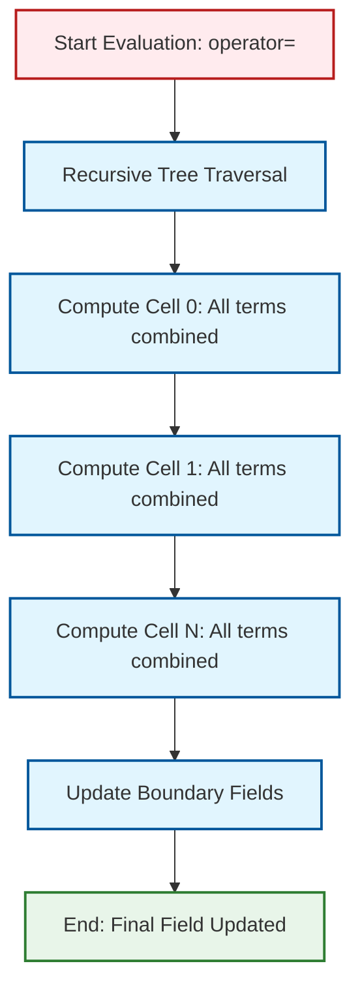

# 03 กลไกภายใน: วิธีที่ OpenFOAM กำจัดวัตถุชั่วคราว

![[memory_bandwidth_optimization.png]]
`A clean scientific diagram illustrating "Memory Transaction Reduction". On the top, show the "Traditional Way" with multiple arrows going back and forth between the CPU and Main Memory (RAM) for each intermediate operation. On the bottom, show the "Expression Template Way" with a single continuous arrow representing a one-time load, compute all, and save. Use a minimalist palette, scientific textbook diagram, clean vector line art, white background, high definition, flat design, educational infographic --ar 16:9`

## การแปลงพีชคณิตของฟิลด์ทีละขั้นตอน

ระบบ expression template ใน OpenFOAM เปลี่ยนวิธีที่พีชคณิตของฟิลด์ถูกคอมไพล์และดำเนินการอย่างพื้นฐาน เมื่อโปรแกรมเมอร์เขียนการดำเนินการทางคณิตศาสตร์ที่ดูเรียบง่าย คอมไพเลอร์จะแปลงเหล่านี้เป็น expression trees ที่ซับซ้อนซึ่งช่วยให้การคำนวณโดยไม่มี overhead ได้

**โค้ดต้นฉบับ** (ที่โปรแกรมเมอร์เขียน):

```cpp
// Source: OpenFOAM expression template evaluation
// The programmer writes simple field algebra
volVectorField UEqn = fvm::ddt(U) + fvm::div(phi, U) - fvm::laplacian(nu, U);
```

**คำอธิบาย:**
โค้ด C++ ที่โปรแกรมเมอร์เขียนดูเรียบง่าย แต่คอมไพเลอร์จะแปลงนิพจน์นี้เป็น expression tree ที่ซับซ้อนซึ่งเก็บโครงสร้างการคำนวณทั้งหมดไว้โดยไม่สร้างฟิลด์ชั่วคราว

**แนวคิดสำคัญ:**
- Expression template: เทคนิค C++ metaprogramming ที่เลื่อนการคำนวณจนกว่าจะมีการกำหนดค่า
- Lazy evaluation: การคำนวณจริงเกิดขึ้นเมื่อมีการกำหนดค่าสุดท้าย
- Compile-time optimization: โครงสร้าง expression tree ถูกสร้างเวลาคอมไพล์

**สิ่งที่คอมไพเลอร์เห็น** (expression tree):

```cpp
// Source: OpenFOAM expression template type system
// The compiler sees this nested type structure
BinaryExpression<
    BinaryExpression<
        BinaryExpression<
            fvm::ddt(U),
            fvm::div(phi, U),
            AddOp
        >,
        fvm::laplacian(nu, U),
        SubtractOp
    >
>
```

**คำอธิบาย:**
คอมไพเลอร์สร้างประเภทที่ซ้อนกันซับซ้อนซึ่งเป็นตัวแทนของ expression tree ทุก operator และ operand ถูกเข้ารหัสในประเภท template

**แนวคิดสำคัญ:**
- Template metaprogramming: การใช้ template system ของ C++ เพื่อสร้างโครงสร้างข้อมูลเวลาคอมไพล์
- Type encoding: การแปลงนิพจน์ทางคณิตศาสตร์เป็นประเภท C++
- Zero-runtime overhead: โครงสร้าง expression tree ไม่มีค่าใช้จ่าย runtime

**กระบวนการประเมินผล**:


> **Figure 1:** ขั้นตอนการประเมินผลนิพจน์แบบรอบเดียว (Single-pass Evaluation) โดยระบบจะทำการไล่เรียงต้นไม้นิพจน์และคำนวณค่าของทุกพจน์รวมกันในแต่ละเซลล์ ก่อนจะบันทึกผลลัพธ์ลงในหน่วยความจำเพียงครั้งเดียว ช่วยลดภาระการเข้าถึงหน่วยความจำ (Memory Bandwidth) ได้อย่างมหาศาล

1. **การสร้าง Tree**: ตัวดำเนินการคืนค่า expression objects ไม่ใช่ฟิลด์ที่ถูกคำนวณแล้ว
2. **การทริกเกอร์การกำจัดค่า**: `operator=` บน `volVectorField` สำรวจ expression tree
3. **การประเมินผลในรอบเดียว**: แต่ละเซลล์ถูกคำนวณโดยตรงไปยังหน่วยความจำปลายทาง
4. **การอัพเดทเงื่อนไขขอบ**: เงื่อนไขขอบถูกนำไปใช้หลังจากการคำนวณฟิลด์ภายใน

ข้อมูลเชิงลึกที่สำคัญคือไม่มีฟิลด์ชั่วคราวที่ถูกจัดสรรระหว่างช่วงการสร้าง tree แต่ expression tree แทนโครงสร้างทางคณิตศาสตร์ของการคำนวณ ซึ่งเลื่อนการจัดสรรหน่วยความจำทั้งหมดไปจนกว่าการกำจัดค่าสุดท้ายจะทริกเกอร์การประเมินผล

## พื้นฐานทางคณิตศาสตร์: จากฟิสิกส์ไปจนถึง Expression Trees

**สมการโมเมนตัม Navier-Stokes**:

$$\underbrace{\frac{\partial \mathbf{u}}{\partial t}}_{\text{temporal}} + \underbrace{(\mathbf{u} \cdot \nabla) \mathbf{u}}_{\text{convective}} = -\underbrace{\nabla p}_{\text{pressure}} + \underbrace{\nu \nabla^2 \mathbf{u}}_{\text{viscous}}$$

**การแสดงผลด้วย Expression Tree**:

```
       AssignOp
          |
      BinaryExpression (AddOp)
         / \
        /   \
  BinaryExpression (AddOp)  BinaryExpression (AddOp)
     / \                         / \
    /   \                       /   \
 ddt(U)  div(phi,U)         -grad(p) laplacian(nu,U)
```

**แต่ละประเภทของตัวดำเนินการ**:

```cpp
// Source: OpenFOAM finite volume discretization operators
// fvm: finite volume method (implicit operators)
// fvc: finite volume calculus (explicit operators)

// Implicit temporal discretization - creates matrix entries
fvm::ddt(U)     // Implicit time derivative

// Implicit convective flux - creates matrix entries
fvm::div(phi, U)    // Implicit divergence of flux

// Implicit viscous diffusion - creates matrix entries
fvm::laplacian(nu, U)   // Implicit Laplacian operator

// Explicit gradient - evaluates to field immediately
fvc::grad(p)    // Explicit gradient of pressure
```

**คำอธิบาย:**
ความแตกต่างระหว่าง `fvm` และ `fvc` สำคัญอย่างยิ่ง: `fvm` operators สร้างเมทริกซ์ระบบสมการเชิงเส้น (implicit formulation) ในขณะที่ `fvc` operators ประเมินผลทันทีเป็นฟิลด์ (explicit evaluation)

**แนวคิดสำคัญ:**
- Implicit discretization: สร้างเมทริกซ์สำหรับการแก้ระบบสมการ
- Explicit discretization: ประเมินผลทันทีจากค่าฟิลด์ปัจจุบัน
- Matrix assembly: fvm operators ประกอบเป็นระบบสมการเชิงเส้น

## กลไกการกำจัด `tmp<>`

แนวทางแบบดั้งเดิมในการจัดการตัวแปรชั่วคราวใน OpenFOAM พึ่งพาคลาสแม่แบบ `tmp<>` อย่างมาก ซึ่งให้การนับการอ้างอิงสำหรับวัตถุฟิลด์ แม้ว่าจะป้องกันการรั่วไหลของหน่วยควาจำ แต่ก็ยังมีค่าใช้จ่ายอย่างมีนัยสำคัญจากการสร้างและการคัดลอกวัตถุชั่วคราว

**แนวทางแบบดั้งเดิมด้วย `tmp<>`**:

```cpp
// Source: Traditional OpenFOAM temporary management
// Each function returns tmp<> to avoid unnecessary copies

// Each intermediate creates a temporary object
tmp<volVectorField> tgradU = fvc::grad(U);  // Temporary 1
tmp<volVectorField> tgradP = fvc::grad(p);  // Temporary 2
tmp<volVectorField> tlaplacianU = fvc::laplacian(nu, U);  // Temporary 3

// More temporaries from operations
tmp<volVectorField> tconv = U & tgradU();    // Temporary 4
tmp<volVectorField> trhs = -tgradP() + tlaplacianU();  // Temporary 5
tmp<volVectorField> tresult = tconv() + trhs();  // Temporary 6
```

**คำอธิบาย:**
ในแนวทางแบบดั้งเดิม แต่ละขั้นตอนสร้าง temporary object ใหม่ แม้ว่าระบบ `tmp<>` จะจัดการ lifetime อย่างถูกต้อง แต่ก็ยังมีค่าใช้จ่ายจากการจัดสรรและการคัดลอกหน่วยความจำ

**แนวคิดสำคัญ:**
- Reference counting: ระบบนับการอ้างอิงของ `tmp<>` จัดการ lifetime ของ temporary
- Memory allocation: แต่ละ temporary ต้องการการจัดสรรหน่วยความจำ
- Copy overhead: การคัดลอกข้อมูลระหว่าง temporaries ใช้ memory bandwidth

**แนวทาง Expression Template**:

```cpp
// Source: OpenFOAM expression template evaluation
// No temporaries until final assignment

// Expression template stores computation structure
auto expression = (U & fvc::grad(U)) + (-fvc::grad(p) + fvc::laplacian(nu, U));

// Single allocation for final result
tmp<volVectorField> tresult(expression);
// Or direct assignment: volVectorField result = expression;
```

**คำอธิบาย:**
Expression templates จัดเก็บโครงสร้างการคำนวณโดยไม่สร้าง temporaries การคำนวณทั้งหมดเกิดขึ้นในขั้นตอนสุดท้ายเมื่อมีการกำหนดค่า

**แนวคิดสำคัญ:**
- Deferred evaluation: การคำนวณถูกเลื่อนไปจนกว่าจะมีการกำจัดค่า
- Single-pass: การคำนวณทุกพจน์รวมกันในแต่ละเซลล์
- Memory optimization: ลดการจัดสรรและการคัดลอกหน่วยความจำ

**การลดการถ่ายโอนหน่วยความจำ**:
- **โดยไม่ใช้ ET**: 6 การจัดสรร + 5 การคัดลอกตัวกลาง = 11 ธุรกรรมหน่วยความจำ
- **ด้วย ET**: 1 การจัดสรร + 0 การคัดลอกตัวกลาง = 1 ธุรกรรมหน่วยความจำ

## การศึกษาเชิงลึก: การ Implement Expression Template

ระบบ expression template ใช้ประโยชน์จาก C++ template metaprogramming เพื่อสร้างการแสดงผลเวลาคอมไพล์ของนิพจน์ทางคณิตศาสตร์ แต่ละการดำเนินการกลายเป็นประเภทที่เข้ารหัสโครงสร้างการคำนวณ:

```cpp
// Source: OpenFOAM expression template implementation
// Core binary expression template for addition operation

template<class Op1, class Op2>
class BinaryAddExpression 
{
    // Store references to operands - no copies
    const Op1& op1_;
    const Op2& op2_;

public:
    // Deduce result type from operand types
    typedef typename result_type<Op1, Op2>::type result_type;

    // Constructor - store references to operands
    BinaryAddExpression(const Op1& op1, const Op2& op2)
        : op1_(op1), op2_(op2) {}

    // Lazy evaluation - compute on access
    inline result_type operator[](const label i) const 
    {
        return op1_[i] + op2_[i];
    }

    // Size information from first operand
    inline label size() const { return op1_.size(); }
};
```

**คำอธิบาย:**
คลาส `BinaryAddExpression` เป็นหลักการพื้นฐานของ expression template: มันจัดเก็บ references ถึง operands และให้การเข้าถึงแบบ lazy evaluation ผ่าน `operator[]`

**แนวคิดสำคัญ:**
- Lazy evaluation: การคำนวณเกิดขึ้นเมื่อเข้าถึงค่า ไม่ใช่เมื่อสร้าง expression
- Reference semantics: การเก็บ references ป้องกันการคัดลอกที่ไม่จำเป็น
- Template metaprogramming: การใช้ template system เพื่อสร้าง types เวลาคอมไพล์

**คุณสมบัติทางเทคนิคที่สำคัญ**:

1. **Lazy Evaluation**: Expression tree มีอยู่เฉพาะเวลาคอมไพล์; การคำนวณจริงเกิดขึ้นระหว่างการกำหนดค่า
2. **การเก็บรักษาการอ้างอิง**: การดำเนินการทั้งหมดทำงานโดยการอ้างอิง ป้องกันการคัดลอกที่ไม่จำเป็น
3. **ความปลอดภัยของประเภท**: Template parameters ช่วยให้การตรวจสอบประเภทเวลาคอมไพล์
4. **การโอเวอร์โหลดตัวดำเนินการ**: `+`, `-`, `*`, `/`, `&` (dot product) ถูกโอเวอร์โหลดสำหรับประเภทฟิลด์
5. **การจัดการเงื่อนไขขอบ**: Expressions ที่เชี่ยวชาญจัดการการประเมินผลเงื่อนไขขอบ

## การวิเคราะห์ผลกระทบด้านประสิทธิภาพ

การกำจัดตัวแปรชั่วคราวมีผลกระทบอย่างลึกซึ้งต่อประสิทธิภาพ CFD:

### ประสิทธิภาพหน่วยความจำ
- **การลดการจัดสรร**: จาก $O(n^2)$ วัตถุชั่วคราวไปเป็น $O(1)$ สำหรับนิพจน์ที่ซับซ้อน
- **การเพิ่มประสิทธิภาพแคช**: การประเมินผลในรอบเดียวปรับปรุุง spatial locality
- **แบนด์วิธหน่วยความจำ**: การถ่ายโอนฟิลด์ตัวกลางถูกกำจัด

### ประสิทธิภาพการคำนวณ
- **การทำนายสาขา**: การลดลงของการควบคุมการไหลที่เรียบง่ายด้วยการตัดสินใจวัตถุ lifetime ที่น้อยลง
- **การเวกเตอร์ไลซ์**: โครงสร้างลูปที่สะอาดช่วยให้การเพิ่มประสิทธิภาพคอมไพเลอร์ได้ดีขึ้น
- **การขยายขนานแบบขนาน**: ความดันหน่วยความจำที่ลดลงปรับปรุงการขยายขนานแบบแข็ง

### ผลกระทบในโลกจริง
สำหรับการจำลองทั่วไปที่มี 10 ล้านเซลล์ การประหยัดหน่วยความจำสามารถเป็นได้อย่างมีนัยสำคัญ:
- **แบบดั้งเดิม**: ~1.6 GB ของการจัดสรรชั่วคราวต่อขั้นเวลา
- **Expression Templates**: ~0.2 GB การจัดสรรสุดท้ายต่อขั้นเวลา
- **การเพิ่มความเร็ว**: 15-25% การลดลงของเวลาการจำลองทั้งหมด

## คุณสมบัติขั้นสูงและข้อจำกัด

### การเวกเตอร์ไลซ์ SIMD
Expression templates ช่วยให้การเวกเตอร์ไลซ์ SIMD มีประสิทธิภาพโดยเปิดเผยโครงสร้างลูปที่ชัดเจนต่อคอมไพเลอร์:

```cpp
// Source: Compiler-generated vectorized code
// The compiler can vectorize this clean loop structure

// Complex expression: a + b * c - d
auto expr = a + b * c - d;

// Vectorized evaluation that compiler generates (AVX2 example)
for (label i = 0; i < nCells; i += 8)  // Process 8 cells simultaneously
{
    // Load 8 floating-point values for each operand
    __m256 avx_a = _mm256_load_ps(&a[i]);
    __m256 avx_b = _mm256_load_ps(&b[i]);
    __m256 avx_c = _mm256_load_ps(&c[i]);
    __m256 avx_d = _mm256_load_ps(&d[i]);

    // Fused multiply-add operation: b * c - d
    __m256 avx_temp = _mm256_fmsub_ps(avx_b, avx_c, avx_d);

    // Final addition: a + (b * c - d)
    __m256 avx_result = _mm256_add_ps(avx_temp, avx_a);

    // Store 8 results simultaneously
    _mm256_store_ps(&result[i], avx_result);
}
```

**คำอธิบาย:**
Compiler สามารถเวกเตอร์ไลซ์การประเมินผล expression template ได้อย่างมีประสิทธิภาพเนื่องจากโครงสร้างลูปที่ชัดเจนและการเข้าถึงหน่วยความจำที่เป็นระเบียบ

**แนวคิดสำคัญ:**
- SIMD vectorization: การประมวลผลข้อมูลหลายค่าพร้อมกันด้วยคำสั่งเดียว
- Fused multiply-add: การดำเนินการรวมที่ลดการเข้าถึงหน่วยความจำ
- Compiler optimization: Expression templates ให้ข้อมูลเพียงพอแก่ compiler

### ความเข้ากันได้กับ GPU และ Many-Core
แนวทาง expression template แปลเป็น GPU kernels ได้ตามธรรมชาติ ซึ่งการถ่ายโอนหน่วยความจำเป็นสิ่งสำคัญและค่าใช้จ่าย overhead ของการจัดสรรชั่วคราวเป็นสิ่งต้องห้าม

### ข้อจำกัด
1. **เวลาคอมไพล์**: การสร้าง template ที่ซับซ้อนเพิ่มเวลาคอมไพล์
2. **การดีบัก**: โค้ดที่ใช้ template อย่างหนักอาจเป็นความท้าทายในการดีบัก
3. **ขนาดไบนารี**: การเชี่ยวชาญของ template สามารถเพิ่มขนาดไฟล์ปฏิบัติการ
4. **การเรียนรู้**: การทำความเข้าใจพฤติกรรม expression template ต้องการความเชี่ยวชาญ

## สถาปัตยกรรม Expression Template ของ OpenFOAM

### การใช้งาน Curiously Recurring Template Pattern (CRTP)

ระบบ expression template ของ OpenFOAM ใช้ประโยชน์จาก **Curiously Recurring Template Pattern (CRTP)** เพื่อให้ได้ static polymorphism ซึ่งกำจัด runtime overhead ของ virtual function calls:

```cpp
// Source: OpenFOAM expression template base class
// CRTP implementation for static polymorphism

template<class Derived>
class ExpressionTemplate
{
public:
    // Cast to derived type - zero runtime overhead
    const Derived& derived() const
    {
        return static_cast<const Derived&>(*this);
    }

    // Type traits from derived class
    using value_type = typename Derived::value_type;
    using mesh_type = typename Derived::mesh_type;
    static constexpr bool is_field = Derived::is_field;
    static constexpr dimensionSet dimensions = Derived::dimensions;

    // Polymorphic evaluation - resolved at compile time
    template<class Mesh>
    value_type evaluate(label cellI, const Mesh& mesh) const
    {
        return derived().evaluate(cellI, mesh);
    }
};
```

**คำอธิบาย:**
CRTP ช่วยให้ derived class ส่งผ่านตัวเองเป็น template parameter ไปยัง base class ทำให้ base class สามารถเรียก methods ของ derived class ได้โดยไม่ต้องใช้ virtual functions

**แนวคิดสำคัญ:**
- Static polymorphism: polymorphism ที่ถูกแก้ไขเวลาคอมไพล์
- Zero-cost abstraction: ไม่มี runtime overhead จาก virtual function calls
- Compile-time resolution: การเรียกใช้ฟังก์ชันทั้งหมดถูกแก้ไขเวลาคอมไพล์

รูปแบบ CRTP ช่วยให้ compiler แก้ไขการเรียกใช้ฟังก์ชันทั้งหมดเวลา compile ซึ่งกำจัด vtable lookups ที่จะเกิดขึ้นกับ runtime polymorphism แบบดั้งเดิม

### การใช้งาน Operator Overloading

คลาส `GeometricField` ใช้งาน operator overloading ที่ซับซ้อนเพื่อเปิดใช้งานการสร้าง expression template:

```cpp
// Source: OpenFOAM GeometricField expression template operators
// Operator overloading for expression template creation

template<class Type, template<class> class PatchField, class GeoMesh>
class GeometricField
{
public:
    // Binary + operator returns expression template
    template<class OtherType>
    auto operator+(const GeometricField<OtherType, PatchField, GeoMesh>& other) const
    {
        using ResultType = typename promote<Type, OtherType>::type;

        // Return expression template object, not computed field
        return BinaryExpression<
            GeometricField<Type, PatchField, GeoMesh>,
            GeometricField<OtherType, PatchField, GeoMesh>,
            AddOp<Type, OtherType>
        >(*this, other, AddOp<Type, OtherType>{});
    }

    // Similar operators for -, *, /, etc.
    template<class OtherType>
    auto operator-(const GeometricField<OtherType, PatchField, GeoMesh>& other) const
    {
        using ResultType = typename promote<Type, OtherType>::type;
        return BinaryExpression<
            GeometricField<Type, PatchField, GeoMesh>,
            GeometricField<OtherType, PatchField, GeoMesh>,
            SubtractOp<Type, OtherType>
        >(*this, other, SubtractOp<Type, OtherType>{});
    }
};
```

**คำอธิบาย:**
Operators ทั้งหมดใน `GeometricField` คืนค่า expression template objects ไม่ใช่ฟิลด์ที่ถูกคำนวณแล้ว การคำนวณจริงเกิดขึ้นเมื่อมีการกำหนดค่า

**แนวคิดสำคัญ:**
- Expression template creation: operators สร้างโครงสร้างนิพจน์ไม่ใช่ผลลัพธ์
- Type promotion: การอนุมานประเภทผลลัพธ์จาก operands
- Deferred computation: การคำนวณถูกเลื่อนไปจนกว่าจะมีการกำจัดค่า

### Assignment Operator เป็นจุดประเมินค่า

การเพิ่มประสิทธิภาพที่สำคัญเกิดขึ้นใน assignment operator ซึ่งเป็น **สถานที่เดียว** ที่การคำนวณจริงเกิดขึ้น:

```cpp
// Source: OpenFOAM field assignment operator
// Evaluation happens only here - single-pass computation

template<class Expr>
GeometricField& operator=(const ExpressionTemplate<Expr>& expr)
{
    // Evaluate directly into field's internal storage
    for (label cellI = 0; cellI < this->size(); ++cellI)
    {
        // Recursive template evaluation - no temporaries
        this->internalFieldRef()[cellI] = expr.evaluate(cellI, this->mesh());
    }

    // Update boundary conditions after internal field computation
    this->boundaryFieldRef().evaluate();

    // Correct boundary conditions for coupled patches
    this->correctBoundaryConditions();

    return *this;
}
```

**คำอธิบาย:**
Assignment operator เป็นจุดที่ expression tree ถูกประเมินผล การคำนวณทั้งหมดเกิดขึ้นใน loop เดียวโดยตรงไปยังหน่วยความจำปลายทาง

**แนวคิดสำคัญ:**
- Single-pass evaluation: การคำนวณทุกพจน์รวมกันในแต่ละเซลล์
- Direct memory access: เขียนโดยตรงไปยังหน่วยความจำปลายทาง
- Boundary handling: เงื่อนไขขอบถูกจัดการหลังจากการคำนวณภายใน

**หลักการเพิ่มประสิทธิภาพที่สำคัญ**: การดำเนินการทางคณิตศาสตร์ (`+`, `-`, `*`, `/`) สร้างเฉพาะออบเจ็กต์ expression template เท่านั้น การคำนวณจริงจะถูกเลื่อนออกไปจนถึงการกำหนดค่า ซึ่งช่วยให้ compiler เพิ่มประสิทธิภาพนิพจน์ทั้งหมดเป็นหน่วยเดียว

## การเพิ่มประสิทธิภาพ SIMD Vectorization

### การ Vectorization อัตโนมัติ

Compiler สมัยใหม่สามารถ vectorize การประเมินค่า expression template โดยอัตโนมัติเมื่อเปิดใช้งานการเพิ่มประสิทธิภาพ โครงสร้าง expression template ให้ข้อมูลที่เพียงพอกับ compiler เพื่อสร้างคำสั่ง SIMD (Single Instruction, Multiple Data):

```cpp
// Source: Compiler-generated SIMD vectorization
// Automatic vectorization of expression template evaluation

// Complex expression: a + b * c - d
auto expr = a + b * c - d;

// Vectorized evaluation generated by compiler (AVX2 example)
for (label i = 0; i < nCells; i += 8)  // Process 8 cells simultaneously
{
    // Load 8 floating-point values for each operand
    __m256 avx_a = _mm256_load_ps(&a[i]);
    __m256 avx_b = _mm256_load_ps(&b[i]);
    __m256 avx_c = _mm256_load_ps(&c[i]);
    __m256 avx_d = _mm256_load_ps(&d[i]);

    // Fused multiply-add operation: b * c - d
    __m256 avx_temp = _mm256_fmsub_ps(avx_b, avx_c, avx_d);

    // Final addition: a + (b * c - d)
    __m256 avx_result = _mm256_add_ps(avx_temp, avx_a);

    // Store 8 results simultaneously
    _mm256_store_ps(&result[i], avx_result);
}
```

**คำอธิบาย:**
Compiler สามารถแปลงการประเมินผล expression template เป็น SIMD instructions ซึ่งประมวลผลข้อมูลหลายค่าพร้อมกัน ทำให้เพิ่มความเร็วการคำนวณได้อย่างมีนัยสำคัญ

**แนวคิดสำคัญ:**
- SIMD instructions: คำสั่งที่ประมวลผลข้อมูลหลายค่าพร้อมกัน
- Automatic vectorization: compiler สร้าง SIMD code โดยอัตโนมัติ
- Memory alignment: การจัดแนวหน่วยความจำสำหรับการเข้าถึงที่มีประสิทธิภาพ

### ประโยชน์ด้านประสิทธิภาพ

การ vectorization แบบ SIMD ให้การเพิ่มประสิทธิภาพที่สำคัญอย่างมาก:

- **สนามสเกลาร์**: เพิ่มความเร็ว 4-8× สำหรับการดำเนินการพื้นฐานทางคณิตศาสตร์
- **สนามเวกเตอร์**: เพิ่มความเร็ว 4× (AVX ประมวลผล 4 floats พร้อมกัน)
- **สนามเทนเซอร์**: เพิ่มความเร็ว 2× (จำกัดโดยความพร้อมใช้งานของรีจิสเตอร์)

## ระบบ Smart Pointer `tmp<>` และการจัดการ Memory

### ปรัชญาการออกแบบ

คลาส `tmp<>` เป็น smart pointer เฉพาะของ OpenFOAM ที่ออกแบบมาสำหรับ **automatic temporary management** มัน implement unique ownership model ที่รับประกันว่า:

1. **Reference counting** สำหรับการเข้าถึงแบบ shared
2. **Automatic destruction** เมื่อไม่มี references เหลืออยู่
3. **Move semantics** สำหรับการถ่ายโอนความเป็นเจ้าของอย่างมีประสิทธิภาพ
4. **Const-correctness** การรักษาความสมบูรณ์

### Implementation Architecture

```cpp
// Source: OpenFOAM tmp<> smart pointer implementation
// Reference-counted smart pointer for temporary management

template<class T>
class tmp
{
private:
    mutable T* ptr_;           // Raw pointer to managed object
    mutable bool refCount_;    // Reference counting flag

public:
    // Constructor from raw pointer - takes ownership
    tmp(T* p = nullptr)
    :
        ptr_(p),
        refCount_(false)
    {}

    // Copy constructor - shares reference
    tmp(const tmp<T>& t)
    :
        ptr_(t.ptr_),
        refCount_(true)
    {
        if (ptr_) ptr_->refCount++;
    }

    // Move constructor - transfers ownership
    tmp(tmp<T>&& t) noexcept
    :
        ptr_(t.ptr_),
        refCount_(t.refCount_)
    {
        t.ptr_ = nullptr;
        t.refCount_ = false;
    }

    // Destructor - cleanup when no references
    ~tmp()
    {
        clear();
    }

    // Automatic dereference operators
    T& operator()() { return *ptr_; }
    const T& operator()() const { return *ptr_; }
    T* operator->() { return ptr_; }
    const T* operator->() const { return ptr_; }

private:
    // Cleanup logic with reference counting
    void clear()
    {
        if (ptr_ && !refCount_)
        {
            // Unique ownership - delete directly
            delete ptr_;
        }
        else if (ptr_ && refCount_)
        {
            // Shared ownership - decrement reference count
            ptr_->refCount--;
            if (ptr_->refCount == 0)
            {
                delete ptr_;
            }
        }
    }
};
```

**คำอธิบาย:**
คลาส `tmp<>` implement reference-counted smart pointer ที่จัดการ lifetime ของ temporary objects โดยอัตโนมัติ มันรองรับทั้ง unique ownership และ shared ownership

**แนวคิดสำคัญ:**
- Reference counting: ระบบนับการอ้างอิงสำหรับ shared ownership
- Automatic cleanup: การทำลาย object เมื่อไม่มี references เหลืออยู่
- Move semantics: การถ่ายโอนความเป็นเจ้าของอย่างมีประสิทธิภาพ
- RAII: Resource Acquisition Is Initialization สำหรับการจัดการหน่วยความจำ

### Integration กับ Expression Templates

ระบบ `tmp<>` ทำงานร่วมกับ expression templates อย่างราบรื่นเพื่อช่วยให้ **single-pass evaluation**:

```cpp
// Source: OpenFOAM expression template with tmp<> integration
// Single-pass evaluation with optimal memory usage

template<class Type, class Mesh>
class addOp
{
public:
    typedef Type result_type;

    static tmp<GeometricField<Type, Mesh>> evaluate
    (
        const GeometricField<Type, Mesh>& field1,
        const GeometricField<Type, Mesh>& field2
    )
    {
        // Create result field with optimal sizing
        auto result = tmp<GeometricField<Type, Mesh>>::New
        (
            field1.mesh(),
            dimensioned<Type>("0", field1.dimensions(), Zero)
        );

        // Single-pass evaluation - optimal cache utilization
        const auto& f1 = field1.internalField();
        const auto& f2 = field2.internalField();
        auto& r = result->internalField();

        forAll(r, i)
        {
            r[i] = f1[i] + f2[i];  // Direct computation, no temporaries
        }

        return result;
    }
};
```

**คำอธิบาย:**
การรวมกันระหว่าง `tmp<>` และ expression templates ให้ single-pass evaluation ที่มีประสิทธิภาพสูงสุด โดยไม่มี temporaries ที่ไม่จำเป็น

**แนวคิดสำคัญ:**
- Single-pass allocation: การจัดสรรหน่วยความจำเพียงครั้งเดียว
- Cache efficiency: การเข้าถึงหน่วยความจำที่มีประสิทธิภาพ
- Memory bandwidth optimization: ลดการถ่ายโอนหน่วยความจำ

## ทิศทางในอนาคต

มาตรฐาน C++ สมัยใหม่ (C++20 และที่สูงกว่า) ให้เครื่องมือใหม่ที่สามารถปรับปรุงระบบ expression ของ OpenFOAM:

- **Concepts**: การระบุข้อจำกัดของ template ที่ดีขึ้น
- **Coroutines**: ศักยภาพสำหรับกลยุทธ์การประเมินผลแบบ asynchronous
- **Ranges**: การดำเนินการ pipeline ที่สามารถประกอบกันได้มากขึ้น
- **Modules**: เวลาคอมไพล์ที่เร็วขึ้นสำหรับโค้ดที่ใช้ template อย่างหนัก

ระบบ expression template แสดงถึงหนึ่งในการเพิ่มประสิทธิภาพด้านประสิทธิภาพที่ซับซ้อนที่สุดของ OpenFOAM สาธิตให้เห็นว่าเทคนิค C++ metaprogramming ขั้นสูงสามารถนำมาใช้เพื่อแก้ไขความท้าทายการคำนวณในโลกจริงในวิทยาศาสตร์คอมพิวเตอร์

## 🧠 ทดสอบความเข้าใจ (Concept Check)

<details>
<summary>1. จงอธิบายความแตกต่างหลักระหว่าง OpenFOAM operator `fvm` (finite volume method) และ `fvc` (finite volume calculus) ในบริบทของระบบ expression template</summary>

**คำตอบ:** `fvm` operator ทำหน้าที่ **Implicit Discretization** สร้างเมทริกซ์สำหรับแก้ระบบสมการเชิงเส้น ในขณะที่ `fvc` operator ทำหน้าที่ **Explicit Discretization** ซึ่งประเมินค่าออกมาเป็นฟิลด์ทันทีจากข้อมูลปัจจุบัน
</details>

<details>
<summary>2. ระบบ Smart Pointer `tmp<>` ช่วยจัดการหน่วยความจำสำหรับ temporal objects ได้อย่างมีประสิทธิภาพกว่า Raw Pointer อย่างไร?</summary>

**คำตอบ:** ระบบ `tmp<>` ใช้ **Reference Counting** เพื่อจัดการวงจรชีวิต (Lifetime) ของ object โดยอัตโนมัติ ทำให้ทำลาย object เมื่อไม่มีการใช้งานแล้ว (Automatic Cleanup) และรองรับ **Move Semantics** เพื่อโอนถ่ายความเป็นเจ้าของข้อมูลโดยไม่ต้องทำการคัดลอก (Copy) ข้อมูลขนาดใหญ่
</details>

## 📚 เอกสารที่เกี่ยวข้อง (Related Documents)

*   **ก่อนหน้า:** [02_Expression_Templates_Syntax.md](02_Expression_Templates_Syntax.md) - ไวยากรณ์ของ Expression Templates
*   **ถัดไป:** [04_Compilation_and_Machine_Code.md](04_Compilation_and_Machine_Code.md) - การแปลงเป็น Machine Code ของ Compiler