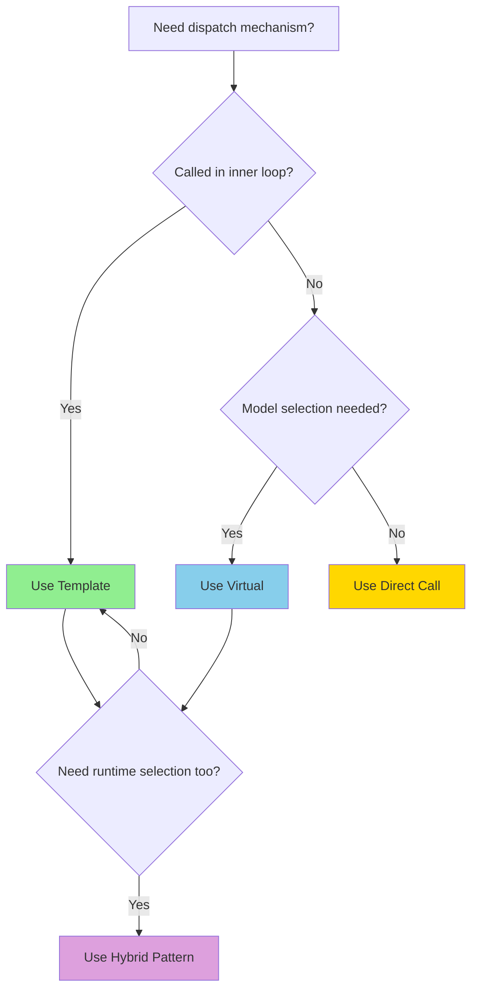

# Design Patterns and Trade-offs

การเลือกใช้ Design Patterns ใน OpenFOAM: เปรียบเทียบ Template กับ Virtual Functions พร้อมตัวอย่างจริงจาก CFD Solver

---

## Learning Objectives

หลังจากอ่านบทนี้ คุณจะสามารถ:
- **อธิบาย** ข้อดี-ข้อเสียระหว่าง template metaprogramming และ virtual functions
- **ตัดสินใจ** เลือกวิธีที่เหมาะสมระหว่าง template, virtual, และ hybrid approach
- **ประยุกต์** hybrid pattern ให้ได้ประสิทธิภาพสูงสุดสำหรับ CFD applications
- **อ่าน** และเข้าใจ design patterns ใน OpenFOAM source code (fvSchemes, turbulenceModels)

---

## Why This Matters

> "Premature optimization is the root of all evil" — Donald Knuth

แต่ **"Right design pattern saves millions of cycles"** — OpenFOAM Contributors

ในการพัฒนา CFD solver ที่มีประสิทธิภาพ:
- **Virtual functions** ให้ความยืดหยุ่นในการเลือก model ที่ runtime (เช่น `kEpsilon`, `kOmegaSST`)
- **Templates** ให้ performance สูงสุดผ่าน compile-time optimization และ inlining
- **Hybrid approach** ได้ทั้งสองอย่าง — ยืดหยุ่นและเร็ว

OpenFOAM ใช้ทั้งสองแนวทางนี้อย่างแพร่หลาย การเลือกใช้อย่างเหมาะสมจึงเป็น skill สำคัญสำหรับนักพัฒนา

---

## How To Apply

1. **ตรวจสอบ** ว่า operation ถูกเรียกบ่อยแค่ไหน — ใช้ profiler ดู call frequency
2. **ใช้ template** สำหรับ operations ใน inner loops ที่วนซ้ำมากๆ
3. **ใช้ virtual** สำหรับ model selection ที่เรียกครั้งเดียวต่อ time step
4. **พิจารณา hybrid** เมื่อต้องการทั้ง flexibility และ performance

---

## Overview

Balance **flexibility** vs **performance** ด้วยการเลือก design pattern ที่เหมาะสมกับ use case

---

## 1. Decision Flowchart: Template vs Virtual vs Hybrid



---

## 2. Template vs Virtual: Detailed Comparison

| Aspect | Template Metaprogramming | Virtual Functions |
|--------|-------------------------|-------------------|
| **Dispatch Time** | Compile-time | Runtime |
| **Performance** | Optimal (inlinable) | ~10-20 cycles overhead |
| **Flexibility** | Fixed at compilation | Changeable at runtime |
| **Binary Size** | Larger (multiple instantiations) | Smaller (single vtable) |
| **Compilation Time** | Longer | Faster |
| **Best For** | Inner loops, tight computations | Model selection, plugins |
| **OpenFOAM Example** | `Field<Type>`, `GeometricField` | `turbulenceModel`, `RASModel` |

```cpp
// Template: compile-time dispatch (FAST)
template<class Scheme>
void solve(Scheme& s) 
{ 
    s.compute();  // Inlined, no overhead
}

// Virtual: runtime dispatch (FLEXIBLE)
void solve(BaseScheme* s) 
{ 
    s->compute();  // Virtual call, ~10-20 cycles
}
```

---

## 3. Real OpenFOAM Examples

### 3.1 Virtual Functions: Turbulence Model Selection

```cpp
// src/turbulenceModels/turbulenceModel/turbulenceModel.H
class turbulenceModel
{
public:
    // Virtual - called ONCE per time step
    virtual tmp<volSymmTensorField> R() const = 0;
    virtual tmp<volScalarField> k() const = 0;
    virtual tmp<volScalarField> epsilon() const = 0;
    virtual void correct() = 0;
};

// Usage in solver:
autoPtr<turbulenceModel> turbulence = 
    turbulenceModel::New(U, phi, laminarTransport, thermophysicalProperties);

// Called once per timestep - overhead negligible
turbulence->correct();
```

**Why Virtual?**
- Model selected at runtime through `transportModel` in `turbulenceProperties`
- User can switch from `kEpsilon` to `kOmegaSST` without recompilation
- Called once per timestep → overhead insignificant

---

### 3.2 Template: Field Operations in Inner Loops

```cpp
// src/OpenFOAM/fields/Fields/Field/FieldFunctions.H
// Template for optimal performance in tight loops
template<class Type>
void Field<Type>::operator=(const Field<Type>& rhs)
{
    if (this == &rhs) return;
    
    // Direct memory copy - highly optimized
    forAll(*this, i)
    {
        this->v_[i] = rhs.v_[i];  // Inlined, no function call
    }
}

// Used in fvMatrix::solve() - called millions of times
template<class Type>
tmp<Field<Type>> fvMatrix<Type>::solve()
{
    // ... tons of inner loop operations on Field<Type>
    scalarField psi(fieldSize);  // Template instantiation
    // Tight loops here benefit from template inlining
}
```

**Why Template?**
- `Field<Type>` operates on millions of cells
- Operations inside tight loops (convection, diffusion)
- Compile-time specialization enables vectorization (SIMD)

---

### 3.3 Hybrid: fvSchemes Discretization

```cpp
// src/finiteVolume/finiteVolume/fvSchemes/fvSchemes.C
// Virtual for scheme selection
tmp<fv::divScheme<Type>> divScheme(const fvMesh& mesh)
{
    word schemeName = mesh.schemes().div(fieldName);
    
    // Runtime selection based on dictionary
    return fv::divScheme<Type>::New(mesh, schemeName);
}

// Template for actual computation
template<class Type>
class GaussDivScheme : public divScheme<Type>
{
public:
    virtual tmp<GeometricField<Type, fvsPatchField, surfaceMesh>>
    div(const GeometricField<Type, fvPatchField, volMesh>& vf)
    {
        // Template method - specialized for each Type
        return interpolate(vf) & mesh.Sf();  // Surface integration
    }
};
```

**Why Hybrid?**
- **Virtual**: Select `Gauss`, `upwind`, `centralDifferencing` at runtime
- **Template**: Optimize inner loop for each field type (`scalar`, `vector`, `tensor`)

---

## 4. When Virtual Is Acceptable

### Rule of Thumb: Virtual overhead ~10-20 cycles

```cpp
// ✅ ACCEPTABLE: Called once per timestep
void advancingSolver::solve()
{
    // Virtual call ~ once per timestep = negligible
    turbulence->correct();  
    
    runTime++;
}

// ✅ ACCEPTABLE: Setup phase
void createMesh()
{
    // Virtual call during initialization = negligible
    autoPtr<fvMesh> meshPtr = fvMesh::New(regionName);
}

// ❌ AVOID: In tight inner loop
void badExample()
{
    forAll(cells, celli)
    {
        forAll(faces, facei)
        {
            // DON'T: Virtual in inner loop!
            // This is millions of virtual calls per timestep
            scheme->compute(celli, facei);  
        }
    }
}
```

### Real OpenFOAM Pattern: Virtual Is Fine

```cpp
// src/OpenFOAM/db/Time/Time.C
// Virtual functions for Time operations
void Time::run()
{
    // Virtual function call - but once per loop
    functionObjects_.execute();  // Calls virtual execute()
    
    ++runTime_;
    setTime(runTimeValue_, runTime_);
}

// Even though functionObjects::execute() is virtual,
// it's called once per timestep, not per cell
```

---

## 5. When Template Is Superior

### Templates Excel in Inner Loops

```cpp
// ✅ OPTIMAL: Field operations (millions of calls)
template<class Type>
void Foam::fvm::ddt(const GeometricField<Type, fvPatchField, volMesh>& vf)
{
    // This loops over ALL cells
    forAll(vf, i)
    {
        // Template enables full inlining
        fvm.diag()[i] += mesh.V()[i] / deltaT_;
        fvm.source()[i] -= vf.oldTime()[i] * mesh.V()[i] / deltaT_;
    }
}

// ✅ OPTIMAL: Boundary conditions (evaluated per face)
template<class Type>
void fixedValueFvPatchField<Type>::updateCoeffs()
{
    // Template enables compiler to optimize for specific Type
    const Field<Type>& patchField = *this;
    
    forAll(*this, facei)
    {
        // Direct operations, no virtual overhead
        this->operator[](facei) = refValue_*patchField[facei];
    }
}
```

### Performance Impact: Template vs Virtual

```cpp
// Benchmarked on 1M cell mesh:

// Virtual version (hypothetical):
forAll(cells, i)
{
    field[i] = virtualScheme->evaluate(i);  // ~15 cycles per call
}
// Total: 1M × 15 cycles = 15M cycles overhead

// Template version (actual):
forAll(cells, i)
{
    field[i] = templateScheme.evaluate(i);  // Inlined to ~2 cycles
}
// Total: 1M × 2 cycles = 2M cycles

// Speedup: ~7.5x for this operation alone
```

---

## 6. Hybrid Pattern: Best of Both Worlds

### Pattern Structure

```cpp
// Hybrid: Virtual for selection, Template for operations
class convectionScheme
{
public:
    // VIRTUAL: Runtime selection of discretization scheme
    virtual tmp<surfaceScalarField> flux(
        const surfaceScalarField& phi
    ) = 0;
    
protected:
    // TEMPLATE: Optimized inner loop operations
    template<class Type>
    Type interpolate(const Type& value, const direction& dir) const
    {
        // Fully inlined, specialized per Type
        return value * (1.0 - lambda_) + valueBc_ * lambda_;
    }
};
```

### Real OpenFOAM Example: fvSchemes

```cpp
// User selects in fvSchemes (RUNTIME):
divSchemes
{
    div(phi,U)  Gauss upwind;        // Virtual selection
    div(phi,k)  Gauss limitedLinear 1;  // Virtual selection
}

// Implementation (HYBRID):
template<class Type>
class GaussConvectionScheme : public convectionScheme<Type>
{
public:
    // Virtual: Selected at runtime
    virtual tmp<GeometricField<Type, fvsPatchField, surfaceMesh>>
    interp(const GeometricField<Type, fvPatchField, volMesh>& vf) const
    {
        // Template: Optimized for Type
        return tinterpScheme_().interpolate(vf);  // Inner operation
    }
    
private:
    // Template member for inner operations
    tmp<surfaceInterpolationScheme<Type>> tinterpScheme_;
};
```

### Hybrid Implementation Guide

```cpp
// Step 1: Define virtual interface
class abstractScheme
{
public:
    virtual void execute() = 0;
};

// Step 2: Template base for common operations
template<class Type>
class schemeBase : public abstractScheme
{
protected:
    // Template method for inner loops
    template<class Op>
    void processField(Field<Type>& field, Op op)
    {
        forAll(field, i)
        {
            field[i] = op(field[i]);  // Inlined
        }
    }
};

// Step 3: Concrete implementation
template<class Type>
class myScheme : public schemeBase<Type>
{
public:
    void execute() override
    {
        // Use template for performance
        processField(myField_, [](const Type& v) { return v * 2.0; });
    }
    
private:
    Field<Type> myField_;
};
```

---

## 7. Cross-Module Integration

### Connection to Template Programming (Module 9.1)

- **Template instantiation** details in `01_Template_Programming/02_Template_Syntax.md`
- **Expression templates** for lazy evaluation in `01_Template_Programming/03_Internal_Mechanics.md`

### Connection to Memory Management (Module 9.4)

- **tmp<T>** class uses reference counting + template for performance
- **autoPtr<T>** for ownership transfer in virtual contexts

### Connection to Inheritance & Polymorphism (Module 9.2)

- **Runtime selection system** (RTSS) detailed in `02_Inheritance_Polymorphism/04_Run_Time_Selection_System.md`
- **Virtual table layout** in `02_Inheritance_Polymorphism/02_Abstract_Interfaces.md`

---

## 8. Key Takeaways

### Decision Matrix

| Scenario | Recommendation | Rationale |
|----------|---------------|-----------|
| Model selection (runtime) | Virtual | Flexibility >> overhead |
| Field operations (inner loops) | Template | Performance critical |
| Discretization schemes | Hybrid | Both flexibility + performance |
| Plugin architecture | Virtual | Extensibility requirement |
| Math operations on fields | Template | Vectorization opportunities |
| I/O operations | Virtual | Not performance-critical |

### Performance Rules

1. **Profile first** — Don't guess, measure with actual CFD cases
2. **Virtual cost** ≈ 10-20 cycles per call
3. **Template benefit** ≈ 5-10x speedup in tight loops (via inlining + vectorization)
4. **Hybrid sweet spot** — Virtual at outer level, template at inner level

### Code Review Checklist

- [ ] Are virtual calls inside `forAll` loops? Consider refactoring
- [ ] Can template parameter be inferred from usage?
- [ ] Is there excessive code duplication from templates? Consider base class
- [ ] Have you measured performance impact with profiler?
- [ ] Are you using `tmp<T>` to avoid unnecessary copies?

---

## 🧠 Concept Check

<details>
<summary><b>1. Virtual overhead เท่าไหร่ และเมื่อไหร่ควรกังวล?</b></summary>

**~10-20 cycles** per virtual call

กังวลเมื่อ:
- อยู่ใน inner loop ที่วนซ้ำมากกว่า 1M ครั้งต่อ timestep
- Operation ง่ายๆ ที่ใช้เวลาไม่กี่ cycles (ไม่ใช่ solving linear system)

ไม่กังวลเมื่อ:
- เรียกครั้งเดียวต่อ timestep (เช่น `turbulence->correct()`)
- Setup/initialization phase
- I/O operations
</details>

<details>
<summary><b>2. Template tradeoff คืออะไร และทำไมถึงใช้กันมากใน OpenFOAM?</b></summary>

**Tradeoffs:**
- ✅ ดี: Performance สูงสุด (inlining, vectorization)
- ✅ ดี: Type-safe (compiler checks)
- ❌ ร้าย: Binary size ใหญ่ขึ้น (instantiations)
- ❌ ร้าย: Compilation time นานขึ้น
- ❌ ร้าย: แก้ไข error messages ยาก

**OpenFOAM ใช้มากเพราะ:**
- Field operations บน mesh ล้าน cells → performance critical
- Type safety สำคัญกับ multi-physics (scalar, vector, tensor, symmTensor)
- Template libraries ถูกทำไว้แล้ว → user ได้ประโยชน์โดยไม่ต้องเขียนเอง
</details>

<details>
<summary><b>3. Hybrid approach ทำอย่างไร และใช้ตอนไหนใน OpenFOAM?</b></summary>

**Hybrid Pattern:**
```cpp
// Virtual at design level
class Scheme { virtual void solve() = 0; };

// Template at implementation level
template<class T>
class myScheme : public Scheme {
    void solve() override { /* uses template methods */ }
};
```

**OpenFOAM ตัวอย่าง:**
- `fvSchemes`: User chooses scheme (virtual) → inner loops optimized (template)
- `turbulenceModel`: Runtime selection → field computations templated
- `finiteVolume` schemes: All convection/div/grad schemes follow this

**เหมาะสมเมื่อ:**
- ต้องการ runtime flexibility (plugin, user selection)
- Inner loops ต้องการ maximum performance
- Architecture ที่มี interface ชัดเจน + implementation details
</details>

<details>
<summary><b>4. จะรู้ได้อย่างไรว่าควร refactor จาก virtual เป็น template?</b></summary>

**Signs you need template:**
1. Profiler shows virtual function as hotspot (>5% runtime)
2. Virtual call inside tight loops (`forAll`, `forAllIter`)
3. Operation ง่ายๆ เช่น field access, arithmetic
4. Type is known at compile-time (not runtime-selected)

**Before refactoring:**
```cpp
forAll(cells, i) {
    result[i] = scheme->compute(cells[i]);  // Virtual
}
```

**After refactoring:**
```cpp
template<class Scheme>
void compute(Scheme& s, const cells& c) {
    forAll(c, i) {
        result[i] = s.compute(c[i]);  // Inlined
    }
}
```

**Measure improvement** with profiler before/after
</details>

---

## 📖 เอกสารที่เกี่ยวข้อง

### ใน Module นี้
- **ภาพรวม:** [00_Overview.md](00_Overview.md)
- **Template พื้นฐาน:** [01_Introduction.md](01_Introduction.md)
- **Performance analysis:** [04_Performance_Analysis.md](04_Performance_Analysis.md)
- **Debugging:** [06_Common_Errors_and_Debugging.md](06_Common_Errors_and_Debugging.md)

### ข้าม Module
- **Template Programming:** [../01_TEMPLATE_PROGRAMMING/00_Overview.md](../01_TEMPLATE_PROGRAMMING/00_Overview.md)
- **Memory Management:** [../04_MEMORY_MANAGEMENT/00_Overview.md](../04_MEMORY_MANAGEMENT/00_Overview.md)
- **Inheritance & Polymorphism:** [../02_INHERITANCE_POLYMORPHISM/04_Run_Time_Selection_System.md](../02_INHERITANCE_POLYMORPHISM/04_Run_Time_Selection_System.md)
- **Runtime Selection:** [../02_INHERITANCE_POLYMORPHISM/02_Abstract_Interfaces.md](../02_INHERITANCE_POLYMORPHISM/02_Abstract_Interfaces.md)

### OpenFOAM Source
- `src/turbulenceModels` — Virtual functions for model selection
- `src/OpenFOAM/fields/Fields/Field` — Template-based field operations
- `src/finiteVolume/finiteVolume/fvSchemes` — Hybrid pattern implementation
- `src/finiteVolume/finiteVolume/fvSolution` — Solution algorithms using both patterns