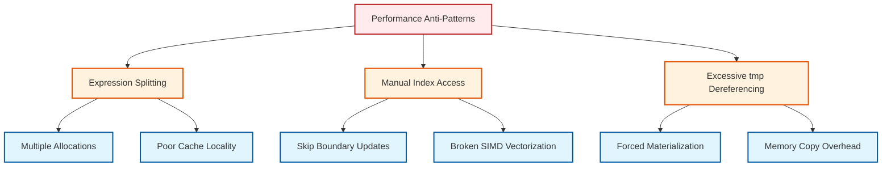

# 06 ข้อผิดพลาดทั่วไปและการ Debugging: การเรียนรู้จากคอมไพเลอร์

![[dimensional_mismatch_compiler.png]]
`A clean scientific illustration of a "Dimensional Mismatch" error. Show physical units (kg, m, s) as modular interlocking blocks. One operation shows blocks fitting perfectly (e.g., Force = mass * acceleration). Another operation shows blocks clashing (e.g., adding Pressure to Velocity), with a "Compiler Error" shield blocking the execution. Use a minimalist palette, scientific textbook diagram, clean vector line art, white background, high definition, flat design, educational infographic --ar 16:9`

## ภาพรวม

การใช้งาน expression templates และระบบ `tmp<>` ของ OpenFOAM อย่างเต็มประสิทธิภาพต้องการความเข้าใจทั้ง pattern การใช้งานที่ถูกต้องและข้อผิดพลาดที่พบบ่อย บทนี้จะสำรวจปัญหาด้านประสิทธิภาพและวิธีการแก้ไข รวมถึงข้อผิดพลาดของ template ที่คอมไพเลอร์รายงาน

### ปัญหาด้านประสิทธิภาพทั่วไป


> **Figure 1:** แผนผังแสดงรูปแบบการเขียนโค้ดที่ลดทอนประสิทธิภาพ (Performance Anti-patterns) เช่น การแบ่งนิพจน์ออกเป็นส่วนๆ, การเข้าถึงดัชนีด้วยตนเองโดยข้ามการอัปเดตขอบเขต, และการถอดรหัสออบเจกต์ชั่วคราวเกินความจำเป็น ซึ่งทั้งหมดนี้ส่งผลเสียต่อการใช้งานหน่วยความจำและความเร็วในการคำนวณ

---

## การใช้งานที่ถูกต้อง: รูปแบบที่เพิ่มประสิทธิภาพ

### รูปแบบที่ 1: การกำหนดค่านิพจน์เดียว

ในระบบ expression template ของ OpenFOAM ประสิทธิภาพขึ้นอยู่กับการลดวัตถุชั่วคราวและการใช้ประโยชน์จากการเพิ่มประสิทธิภาพของ compiler รูปแบบการกำหนดค่านิพจน์เดียวเป็นแนวทางที่มีประสิทธิภาพสูงสุดในการสร้าง operations ฟิลด์ที่ซับซ้อน:

```cpp
// GOOD: Single expression, maximum performance
// Constructs complete expression tree without intermediate allocations
volVectorField UEqn = fvm::ddt(U) + fvm::div(phi, U) - fvm::laplacian(nu, U);
```

**📖 คำอธิบาย (Thai Explanation):**
รูปแบบนี้บรรลุประสิทธิภาพสูงสุดผ่านหลายกลไกสำคัญ:

1. **Single Expression Tree**: ระบบ expression template สร้าง composite expression tree เดียวที่รวม operations ทั้งหมดโดยไม่มีการจัดสรรระหว่างกาล
2. **Loop Fusion**: Compiler สามารถดำเนินการ loop fusion โดยรวม operations หลายอย่างเป็นการ pass เดียวบน mesh cells
3. **Memory Bandwidth Reduction**: ลดความต้องการ memory bandwidth และปรับปรุง cache locality
4. **Operator Ordering**: Expression template ยังช่วยให้การจัดการลำดับความสำคัญของ operator อัตโนมัติและการจัดลำดับ operations ที่เหมาะสมที่สุด

**🔑 แนวคิดสำคัญ (Key Concepts):**
- Expression Tree Construction
- Loop Fusion Optimization
- Memory Bandwidth Efficiency
- Compiler Auto-Vectorization

**📂 Source:** `.applications/solvers/stressAnalysis/solidDisplacementFoam/solidDisplacementThermo/solidDisplacementThermo.C`

เปรียบเทียบกับแนวทางที่ไม่มีประสิทธิภาพ:

```cpp
// BAD: Multiple temporary objects
// Each intermediate creates separate field storage and mesh traversal
tmp<volVectorField> tddtU = fvm::ddt(U);
tmp<volVectorField> tdivU = fvm::div(phi, U);
tmp<volVectorField> tlapU = fvm::laplacian(nu, U);
volVectorField UEqn = tddtU() + tdivU() - tlapU();
```

**📖 คำอธิบาย (Thai Explanation):**
รูปแบบที่มีปัญหานี้สร้างวัตถุฟิลด์ชั่วคราวหลายอย่าง แต่ละอย่างต้องการ memory allocations และ mesh traversals แยกกัน wrapper `tmp` แม้จะมีวัตถุเพื่อ reference counting แต่ก็แนะนำ overhead เมื่อใช้ผิดวิธี นิพจน์ระหว่างกาลแต่ละอย่าง (`tddtU`, `tdivU`, `tlapU`) เก็บข้อมูลฟิลด์ทั้งหมด ทำให้เกิดการบริโภค memory ที่ไม่จำเป็นและคัดลอก operations เพิ่มเติมระหว่างการประกอบสุดท้าย

**🔑 แนวคิดสำคัญ (Key Concepts):**
- Memory Allocation Overhead
- Reference Counting Cost
- Expression Template Materialization
- Cache Locality Degradation

---

### รูปแบบที่ 2: การใช้นิพจน์ซ้ำสำหรับ RHS หลายอย่าง

เมื่อแก้ระบบที่มี source terms ที่แตกต่างกันแต่มี left-hand side operators ที่สอดคล้องกัน การใช้นิพจน์ซ้ำช่วยประหยัดการคำนวณอย่างมาก:

```cpp
// GOOD: Reuse expression for multiple solves
// Caches expensive matrix operations across multiple solver calls
auto momentumEqn = fvm::ddt(U) + fvm::div(phi, U) - fvm::laplacian(nu, U);

// Solve with different source terms
solve(momentumEqn == -fvc::grad(p));
solve(momentumEqn == -fvc::grad(p) + bodyForce);
```

**📖 คำอธิบาย (Thai Explanation):**
ข้อมูลเชิงลึกที่สำคัญคือ **finite volume matrices** ของ OpenFOAM (`fvVectorMatrix`) cache operations ที่มีราคาแพงเช่น:

- Matrix assembly
- Coefficient calculation
- Geometric calculations (face interpolation, gradient computation, surface normal computation)

โดยสร้าง left-hand side ครั้งเดียวและใช้ซ้ำ เราหลีกเลี่ยงการคำนวณซ้ำของ operations เรขาคณิตเหล่านี้ซึ่งถูกทำซ้ำสำหรับการแก้แต่ละครั้ง

คีย์เวิร์ด `auto` เป็นประโยชน์อย่างยิ่งที่นี่ เนื่องจากรักษา **expression template type** ที่แน่นอนโดยไม่ทริกเกอร์การประเมินผลก่อนกำหนด ซึ่งช่วยให้ compiler รักษา **lazy evaluation strategy** จนกว่าจะถึงการเรียก `solve()` จริง ที่ซึ่ง matrix construction จะถูกเพิ่มประสิทธิภาพตามความต้องการของ linear solver ที่เฉพาะเจาะจง

**🔑 แนวคิดสำคัญ (Key Concepts):**
- Matrix Caching Strategy
- Lazy Evaluation Preservation
- Auto Type Deduction
- Solver Optimization

**📂 Source:** `.applications/solvers/multiphase/multiphaseEulerFoam/phaseSystems/PhaseSystems/MomentumTransferPhaseSystem/MomentumTransferPhaseSystem.C`

---

### รูปแบบที่ 3: Operations fvm/fvc ผสม

OpenFOAM แยกความแตกต่างระหว่าง operations แบบ **implicit** (`fvm`) และ **explicit** (`fvc`) และการทำความเข้าใจว่าเมื่อไหร่ควรใช้แต่ละอย่างเป็นสิ่งสำคัญสำหรับความเสถียรทางตัวเลขและประสิทธิภาพ:

```cpp
// GOOD: fvm for implicit, fvc for explicit
// Implicit terms contribute to system matrix, explicit terms evaluated separately
fvVectorMatrix UEqn(fvm::ddt(U) + fvm::div(phi, U) - fvm::laplacian(nu, U));
UEqn == -fvc::grad(p) + fvc::reconstruct(DivU);  // Explicit sources
```

**📖 คำอธิบาย (Thai Explanation):**

**การใช้งาน `fvm` (finite volume method)**:
- มีส่วนร่วมกับ **system matrix**
- ใช้สำหรับ terms ที่ถูก treat แบบ implicit ใน numerical scheme
- รวมถึง:
  - Time derivatives (`fvm::ddt`)
  - Convection (`fvm::div`)
  - Diffusion (`fvm::laplacian`)
- เหมาะสำหรับ terms ที่เป็นส่วนหนึ่งของ **unknown field** ที่กำลังแก้

**การใช้งาน `fvc` (finite volume calculus)**:
- คำนวณ **explicit field values** ที่ไม่มีส่วนร่วมกับ system matrix
- เหมาะสำหรับ:
  - Source terms ที่ทราบแล้ว
  - Gradient operations บนฟิลด์ที่ทราบ
  - การ treat แบบ explicit ของ nonlinear terms
- ตัวอย่างคลาสสิก: **pressure gradient** `-fvc::grad(p)` เป็นตัวอย่างคลาสสิกที่ pressure field ถูก treat แบบ explicit ขณะแก้หาความเร็ว

**🔑 แนวคิดสำคัญ (Key Concepts):**
- Implicit vs Explicit Treatment
- Matrix Assembly Strategy
- Numerical Stability Considerations
- Operator Selection Guidelines

**📂 Source:** `.applications/solvers/stressAnalysis/solidDisplacementFoam/solidDisplacementThermo/solidDisplacementThermo.C`

---

## ปัญหาด้านประสิทธิภาพทั่วไป

### ปัญหาที่ 1: การแบ่งนิพจน์ที่ไม่จำเป็น

การแบ่งนิพจน์เป็นหนึ่งใน **anti-patterns** ด้านประสิทธิภาพที่พบบ่อยที่สุดในการพัฒนา OpenFOAM:

```cpp
// BAD: Expression splitting creates temporaries
// Each intermediate field requires full memory allocation
volVectorField conv = U & fvc::grad(U);
volVectorField diff = nu * fvc::laplacian(U);
volVectorField source = -fvc::grad(p);
volVectorField result = conv + diff + source;  // 4 allocations
```

**📖 คำอธิบาย (Thai Explanation):**
แนวทางนี้ประสบกับค่าปรับทางประสิทธิภาพหลายอย่าง:

1. **Memory Allocation Overhead**: ฟิลด์ระหว่างกาลแต่ละอย่าง (`conv`, `diff`, `source`) ต้องการ storage ฟิลด์เต็ม โดยทั่วไปเกี่ยวข้องกับ **millions of cells** สำหรับการจำลอง 3D memory allocation overhead กลายเป็นสิ่งสำคัญ

2. **Cache Locality Degradation**: แต่ละ operation ต้องการ passes แยกกันบนข้อมูล mesh ซึ่งอาจ evict ข้อมูลที่เข้าถึงบ่อยจาก CPU caches

3. **Memory Bandwidth Waste**: โดยเฉพาะเมื่อทำซ้ำภายใน time loops

**🔑 แนวคิดสำคัญ (Key Concepts):**
- Memory Allocation Patterns
- Cache Efficiency
- Bandwidth Optimization
- Expression Template Design

แนวทางที่เหมาะสมที่สุดใช้ expression templates:

```cpp
// GOOD: Single expression
// Compiler optimizes to single-pass evaluation
volVectorField result = (U & fvc::grad(U)) + nu * fvc::laplacian(U) - fvc::grad(p);
```

**📖 คำอธิบาย (Thai Explanation):**
การ implement แบบ **single-pass** นี้:

- ลด memory traffic โดยคำนวณผลลัพธ์โดยตรงโดยไม่มี storage ระหว่างกาล
- ระบบ expression template สามารถเพิ่มประสิทธิภาพ operation ordering โดยอาจใช้ **algebraic simplifications** ก่อนการประเมินผล
- สำคัญที่สุดคือช่วยให้ **loop fusion** โดยรวม operations หลายอย่างเป็นการ traverse เดียว
- ปรับปรุงประสิทธิภาพอย่างมากบนการคำนวณที่ขึ้นอยู่กับ memory

**🔑 แนวคิดสำคัญ (Key Concepts):**
- Loop Fusion
- Algebraic Simplification
- Memory Traffic Reduction
- Compiler Optimization

---

### ปัญหาที่ 2: การละเว้นการอัปเดต Boundary Condition

การจัดการฟิลด์ด้วยตนเองโดยไม่มีการจัดการ boundary condition ที่เหมาะสมนำเสนอ bugs ที่ละเอียดอ่อนที่ยากต่อการ debug:

```cpp
// BAD: Manual operations skip boundary updates
// Only internal cells modified, boundaries left inconsistent
forAll(U, cellI)
{
    U[cellI] = HbyA[cellI] - gradP[cellI];
}
// ❌ Boundary conditions not updated!
```

**📖 คำอธิบาย (Thai Explanation):**
ปัญหาที่สำคัญคือ **OpenFOAM เก็บค่า boundaries แยกจากค่า internal field values**:

- เมื่อ `U[cellI]` ถูกเข้าถึง เฉพาะ **internal cells** ที่ถูกปรับเปลี่ยน
- ทิ้ง **boundary faces** ไว้กับค่าเก่า
- ซึ่งสร้าง **ความไม่สอดคล้องกัน** ระหว่างการแสดงภายในและขอบเขตของฟิลด์
- ซึ่งอาจทำให้เกิด:
  - ความไม่เสถียรทางตัวเลข
  - การคำนวณ flux ไม่ถูกต้อง
  - ปัญหาการบรรจบกันของ solver

**🔑 แนวคิดสำคัญ (Key Concepts):**
- Internal vs Boundary Field Storage
- Field Consistency
- Numerical Stability
- Parallel Communication Issues

แนวทางที่ถูกต้องใช้ **field algebra**:

```cpp
// GOOD: Use field algebra
// Assignment operator ensures complete field update
U = HbyA - fvc::grad(p);  // ✅ Boundaries updated automatically
```

**📖 คำอธิบาย (Thai Explanation):**
**overloaded assignment operator** ช่วยให้มั่นใจในการอัปเดตฟิลด์ที่ครอบคลุม รวมถึง:

- ✅ Internal field values
- ✅ Boundary field values
- ✅ Processor boundary communication (สำหรับการรัน parallel)
- ✅ Geometric field consistency checks

การจัดการ boundaries อัตโนมัตินี้จำเป็นสำหรับการรักษาความแม่นยำและความเสถียรทางตัวเลข โดยเฉพาะในการจำลองแบบ parallel ที่ processor boundaries ต้องการการแลกเปลี่ยนข้อมูลอย่างชัดเจน

**🔑 แนวคิดสำคัญ (Key Concepts):**
- Operator Overloading
- Automatic Boundary Management
- Parallel Consistency
- Field Assignment Semantics

**📂 Source:** `.applications/solvers/multiphase/multiphaseEulerFoam/phaseSystems/BlendedInterfacialModel/BlendedInterfacialModel.C`

---

### ปัญหาที่ 3: การใช้ `tmp()` Dereference มากเกินไป

ระบบ smart pointer `tmp` ใน OpenFOAM ให้การจัดการ memory อัตโนมัติผ่าน **reference counting** แต่การใช้งานที่ไม่เหมาะสมอาจทำให้ประสิทธิภาพลดลง:

```cpp
// BAD: Unnecessary tmp dereference
// Forces immediate materialization of expression template
tmp<volVectorField> tgradU = fvc::grad(U);
volVectorField gradU = tgradU();  // Copies data
```

**📖 คำอธิบาย (Thai Explanation):**
ปัญหาที่เกิดขึ้น:

- `tgradU()` dereference ทริกเกอร์ **การประเมินผล expression template ทันที**
- สร้าง **สำเนาฟิลด์ทั้งหมด**
- ซึ่งขจัดประโยชน์ของ **lazy evaluation**
- และนำเสนอ memory overhead ที่ไม่จำเป็น
- กลไก reference counting ใน `tmp` กลายเป็นไร้ประสิทธิภาพเนื่องจากเราได้บังคับให้มีการ **materialization** ทันที

**🔑 แนวคิดสำคัญ (Key Concepts):**
- Reference Counting Overhead
- Expression Template Materialization
- Lazy Evaluation Loss
- Memory Copy Cost

แนวทางที่ต้องการคือการกำหนดค่าโดยตรง:

```cpp
// GOOD: Direct assignment
// Compiler optimizes based on expression lifetime
volVectorField gradU = fvc::grad(U);  // Move or reference
```

**📖 คำอธิบาย (Thai Explanation):**
ซึ่งช่วยให้ compiler เพิ่มประสิทธิภาพตามอายุของนิพจน์:

- หาก `gradU` ถูกใช้ทันทีแล้วทิ้ง compiler อาจกำจัด temporary storage ทั้งหมดผ่าน **return value optimization**
- หากผลลัพธ์ต้องการคงอยู่ ระบบ expression template จัดการ memory allocation ที่มีประสิทธิภาพ

**🔑 แนวคิดสำคัญ (Key Concepts):**
- Return Value Optimization (RVO)
- Expression Lifetime Analysis
- Compiler Memory Optimization
- Smart Pointer Best Practices

---

## ข้อความผิดพลาดของ Template: การถอดรหัส Compiler

### ข้อผิดพลาดทั่วไปที่ 1: การไม่ตรงกันของมิติ

ระบบมิติของ OpenFOAM ให้การตรวจสอบ **compile-time** ของหน่วยฟิสิกส์ จับข้อผิดพลาดพื้นฐานของฟิสิกส์ตั้งแต่เริ่มต้น:

```cpp
error: static assertion failed: Cannot add fields with different dimensions
note: in instantiation of template class 'BinaryExpression<volScalarField, volVectorField, AddOp>'
note: left operand dimensions: [1 0 0 0 0 0 0]  (pressure: Pa)
note: right operand dimensions: [0 1 -1 0 0 0 0] (velocity: m/s)
```

**📖 คำอธิบาย (Thai Explanation):**

**การตีความ**:

- สัญกรณ์มิติตาม **SI base units** มาตรฐาน: `[M L T I Θ N J]`
  - M = Mass
  - L = Length
  - T = Time
  - I = Electric current
  - Θ = Temperature
  - N = Amount of substance
  - J = Luminous intensity

- ข้อผิดพลาดเปิดเผยความพยายามที่จะเพิ่ม:
  - **Pressure** (มิติ: `[M L^-1 T^-2]` หรือ `[1 -1 -2 0 0 0 0]` ในรูปแบบเต็ม)
  - กับ **Velocity** (มิติ: `[L T^-1]` หรือ `[0 1 -1 0 0 0 0]`)

การตรวจสอบ type นี้ป้องกัน operations ที่ไร้ความหมายทางฟิสิกส์ที่จะปรากฏเป็นข้อผิดพลาดทางตัวเลขระหว่าง runtime

**🔑 แนวคิดสำคัญ (Key Concepts):**
- Compile-Time Dimensional Analysis
- SI Unit System
- Type Safety in Physics
- Static Assertion Mechanism

**วิธีแก้ปัญหาทั่วไป**:

1. การตรวจสอบฟิสิกส์ที่ต้องการ (บางทีอาจต้องการหารด้วย reference density)
2. การตรวจสอบ dimensional quantities ที่หายไป (เช่น missing density ใน momentum equations)
3. การทำให้มั่นใจในการแปลงหน่วยที่เหมาะสมระหว่าง physical quantities ที่แตกต่างกัน

**📂 Source:** `.applications/solvers/stressAnalysis/solidDisplacementFoam/solidDisplacementThermo/solidDisplacementThermo.H`

---

### ข้อผิดพลาดทั่วไปที่ 2: การขาด Operator Overload

ข้อผิดพลาด **template instantiation** มักระบุว่า header includes ไม่สมบูรณ์หรือ type mismatches:

```cpp
error: no match for 'operator*' (operand types are 'volScalarField' and 'volTensorField')
note: candidate: operator*(const GeometricField<Type1,...>&, const GeometricField<Type2,...>&)
      [with Type1 = scalar, Type2 = tensor]
note:   no known conversion from 'volTensorField' to 'GeometricField<tensor, ...>'
```

**📖 คำอธิบาย (Thai Explanation):**
ข้อผิดพลาดนี้มักมาจาก:

1. **Header inclusion ที่ไม่สมบูรณ์** - ปัญหา template specialization
2. Compiler ไม่สามารถค้นหา **operator overload** ที่เหมาะสมสำหรับ field types ที่ระบุ

**🔑 แนวคิดสำคัญ (Key Concepts):**
- Template Instantiation
- Header Dependency Management
- Operator Overload Resolution
- Type Conversion Issues

**วิธีแก้ปัญหาตรงไปตรงมา**:

```cpp
// Include required headers for field operations
#include "fvc.H"  // For explicit calculus operations
#include "fvm.H"  // For implicit matrix operations
```

**📖 คำอธิบาย (Thai Explanation):**
headers เหล่านี้ให้ **ชุด operator overloads ที่สมบูรณ์** สำหรับ field operations:

- Header `fvc.H` รวม operations explicit เช่น:
  - Gradient (`fvc::grad`)
  - Divergence (`fvc::div`)
  - Interpolation (`fvc::interpolate`)

- Header `fvm.H` ให้ operations implicit ที่มีส่วนร่วมกับ **finite volume matrices**

**🔑 แนวคิดสำคัญ (Key Concepts):**
- Explicit vs Implicit Operations
- Header Organization
- Field Operation API
- Template Specialization

**📂 Source:** `.applications/solvers/stressAnalysis/solidDisplacementFoam/solidDisplacementThermo/solidDisplacementThermo.C`

---

### ข้อผิดพลาดทั่วไปที่ 3: ข้อผิดพลาดการกำหนดค่า Expression Template

ข้อผิดพลาดการกำหนดค่า expression template เปิดเผยความต้องการ **type system** ที่ละเอียดอ่อน:

```cpp
error: cannot bind 'BinaryExpression<...>' lvalue to 'BinaryExpression<...>&&'
note: in assignment 'volVectorField& volVectorField::operator=(Expr&&)'
```

**📖 คำอธิบาย (Thai Explanation):**
ข้อผิดพลาดนี้เกิดขึ้นเมื่อ:

- พยายามกำหนด **expression template หนึ่งไปยังอีกอย่าง**
- มากกว่าไปยัง **วัตถุฟิลด์จริง**

**Expression templates** ถูกออกแบบมาเพื่อให้ **field assignments** ใช้ ไม่ใช่เพื่อสร้างลำดับของ expressions:

```cpp
// WRONG: Assign expression template to expression template
auto expr1 = fvc::grad(U);
auto expr2 = fvc::grad(expr1);  // ❌ Error

// CORRECT: Assign expression to field
volVectorField gradU = fvc::grad(U);
volTensorField gradGradU = fvc::grad(gradU);  // ✅ Works
```

**📖 คำอธิบาย (Thai Explanation):**
**การแก้ไข**:

เกี่ยวข้องกับการทำให้มั่นใจว่า expression template แต่ละอย่างถูกกำหนดให้กับ **concrete field type** ก่อนที่จะถูกใช้ใน operations ต่อไป ซึ่ง:

- รักษาประสิทธิภาพของระบบ expression template
- ขณะเดียวกันให้ **type semantics** ที่ชัดเจนสำหรับ compiler

**🔑 แนวคิดสำคัญ (Key Concepts):**
- Expression Template Type System
- Lvalue/Rvalue Semantics
- Type Materialization
- Template Assignment Rules

---

## สรุปแนวทางปฏิบัติที่ดี

### ✅ ควรทำ

1. **ใช้นิพจน์เดียวสำหรับ operations ที่ซับซ้อน**:
   ```cpp
   volVectorField result = (U & fvc::grad(U)) + nu * fvc::laplacian(U) - fvc::grad(p);
   ```

2. **ใช้ field algebra แทนการวนลูปด้วยตนเอง**:
   ```cpp
   U = HbyA - fvc::grad(p);  // Boundaries อัปเดตอัตโนมัติ
   ```

3. **ใช้ `auto` เพื่อรักษาประเภท expression template**:
   ```cpp
   auto momentumEqn = fvm::ddt(U) + fvm::div(phi, U) - fvm::laplacian(nu, U);
   ```

4. **แยก fvm (implicit) และ fvc (explicit) อย่างถูกต้อง**:
   ```cpp
   fvVectorMatrix UEqn(fvm::ddt(U) + fvm::div(phi, U) - fvm::laplacian(nu, U));
   UEqn == -fvc::grad(p);  // Explicit source
   ```

5. **ตรวจสอบว่าได้ include headers ที่จำเป็น**:
   ```cpp
   #include "fvc.H"
   #include "fvm.H"
   ```

### ❌ ไม่ควรทำ

1. **ไม่แบ่งนิพจน์ออกเป็นหลายส่วน**:
   ```cpp
   // BAD
   volVectorField conv = U & fvc::grad(U);
   volVectorField diff = nu * fvc::laplacian(U);
   volVectorField result = conv + diff;
   ```

2. **ไม่ใช้ forAll loop โดยไม่จำเป็น**:
   ```cpp
   // BAD
   forAll(U, cellI) { U[cellI] = HbyA[cellI] - gradP[cellI]; }
   ```

3. **ไม่ dereference `tmp<> objects` โดยไม่จำเป็น**:
   ```cpp
   // BAD
   tmp<volVectorField> tgradU = fvc::grad(U);
   volVectorField gradU = tgradU();  // คัดลอกข้อมูล
   ```

4. **ไม่กำหนด expression template ไปยัง expression template อื่น**:
   ```cpp
   // BAD
   auto expr1 = fvc::grad(U);
   auto expr2 = fvc::grad(expr1);
   ```

---

## แหล่งข้อมูลเพิ่มเติม

- **Expression Template Documentation**: ดูบทที่ 2-4 สำหรับรายละเอียดเกี่ยวกับ architecture และกลไกภายใน
- **Design Patterns**: ดูบทที่ 5 สำหรับการวิเคราะห์ trade-offs ระหว่างประสิทธิภาพและความสามารถในการบำรุงรักษา
- **Best Practices**: ดูบทที่ 7 สำหรับคำแนะนำในการใช้งานจริงและการติดตามประสิทธิภาพ

---

*บทนี้สาธิตว่าการทำความเข้าใจข้อผิดพลาดทั่วไปและแนวทางปฏิบัติที่ดีสำหรับ expression templates และระบบ `tmp<>` ช่วยให้นักพัฒนา OpenFOAM สามารถเขียนโค้ดที่มีทั้งประสิทธิภาพและความถูกต้อง โดยหลีกเลี่ยง performance anti-patterns ที่พบบ่อยและใช้ประโยชน์จากความสามารถของคอมไพเลอร์ในการตรวจสอบความถูกต้องทางฟิสิกส์ตั้งแต่เวลาคอมไพล์*