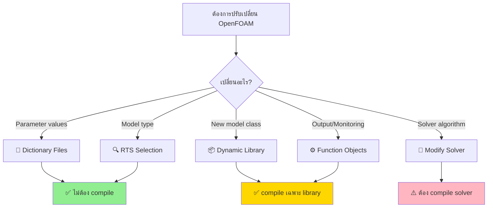

# Introduction - Why Architecture Matters

บทนำสู่สถาปัตยกรรม OpenFOAM และความสำคัญของการออกแบบที่ยืดหยุ่น

---

## 🎯 Learning Objectives

หลังจากอ่านบทนี้ คุณจะสามารถ:

- **อธิบาย** แนวคิดและประโยชน์ของการออกแบบสถาปัตยกรรมที่ยืดหยุ่น (extensibility)
- **แยกแยะ** ความแตกต่างระหว่าง compile-time และ runtime extensibility
- **ประเมิน** เมื่อใดควรใช้กลไก extensibility แต่ละประเภทในโปรเจกต์
- **เข้าใจ** แนวคิดของการเพิ่มฟีเจอร์โดยไม่ต้อง recompile solver

---

## Overview

> **OpenFOAM's architecture philosophy:** Enable users to extend functionality **without touching solver code** or recompiling the core application

เป้าหมายหลักของการออกแบบสถาปัตยกรรม OpenFOAM คือ **การแยก solver logic จาก physical models** ซึ่งทำให้ผู้ใช้สามารถ:

- 🔧 **เพิ่ม model ใหม่** โดยไม่ต้องแก้ไข solver source code
- ⚡ **สลับ model ระหว่างการคำนวณ** ผ่าน dictionary files
- 📦 **แชร์และจัดการ model** แยกจาก solvers
- 🚀 **ปรับแต่งเฉพาะส่วน** โดยไม่กระทบส่วนอื่น

---

## 1. Why Extensibility Matters

### 1.1 Problems with Monolithic Design

❌ **Traditional CFD Solver Issues:**

| Problem | Impact |
|---------|--------|
| **Hard-coded models** | ต้อง recompile เมื่อเพิ่ม model ใหม่ |
| **Tight coupling** | การแก้ไข model ส่งผลต่อ solver code |
| **Solver-specific** | Model ที่เขียนแล้วใช้ร่วมกับ solver อื่นไม่ได้ |
| **Maintenance burden** | ทุกการเปลี่ยนแปลงต้อง rebuild ทั้งหมด |

### 1.2 OpenFOAM's Solution

✅ **Extensibility Without Recompilation:**

```
Traditional Solver:
┌─────────────────────────────┐
│   Solver (hard-coded)        │
│   ├── Turbulence Model A     │  ← ต้อง recompile
│   ├── Turbulence Model B     │
│   └── Boundary Condition C   │
└─────────────────────────────┘

OpenFOAM Architecture:
┌─────────────────────────────┐
│   Solver (generic framework) │
│   └── Dictionary-Driven      │
│       └── Runtime Selection  │
└─────────────────────────────┘
           ↓ loads at runtime
┌─────────────────────────────┐
│   Model Library (.so files)  │
│   ├── turbulenceModels.so    │  ← ไม่ต้อง recompile
│   ├── boundaryConditions.so  │
│   └── customModels.so        │
└─────────────────────────────┘
```

**ประโยชน์:**

- 🎯 **Separation of Concerns** - Solver แค่ orchestrate การคำนวณ ไม่ต้องรู้จัก model ทั้งหมด
- 🔌 **Plug-and-Play** - Model ใหม่ถูกโหลดและใช้งานได้ทันที
- 🔄 **Rapid Prototyping** - ทดสอบ model ใหม่ได้อย่างรวดเร็ว
- 📚 **Code Reusability** - Model ใช้ร่วมกับหลาย solver ได้

---

## 2. When to Use Each Extensibility Mechanism

OpenFOAM มีกลไก extensibility หลายประเภท เลือกใช้ตาม **ระดับของการปรับเปลี่ยน** ที่ต้องการ:

### 2.1 Mechanism Comparison

| Mechanism | Use Case | Modify Solver? | Compile Time | Example |
|-----------|----------|----------------|--------------|---------|
| **Dictionary-driven** | เปลี่ยน parameter, model type | ❌ No | ❌ No | เปลี่ยน kEpsilon → kOmega |
| **RTS (Runtime Selection)** | เพิ่ม model ใหม่ใน class hierarchy | ❌ No | ✅ Once | custom turbulence model |
| **Dynamic libraries** | load model ที่ runtime | ❌ No | ✅ Once | `libs ("libMyModel.so")` |
| **Function objects** | post-processing, monitoring | ❌ No | ✅ Once | forces, probes |
| **Custom boundary conditions** | กำหนด BC เฉพาะทาง | ❌ No | ✅ Once | timeVaryingFixedValue |
| **Top-level solver modification** | เปลี่ยน algorithm หลัก | ✅ Yes | ✅ Always | new pressure solver |

### 2.2 Decision Flowchart



### 2.3 Practical Examples

**Scenario 1: เปลี่ยน turbulence model**
```
// แค่แก้ dictionary - ไม่ต้อง compile!
simulationType RAS;
RAS { turbulenceModel kOmegaSST; }
```

**Scenario 2: เพิ่ม turbulence model ใหม่**
```cpp
// 1. เขียน class ใหม่ (compile เป็น .so)
class myCustomModel: public RASModel {...};
// 2. Register กับ RTS
makeRASModel(myCustomModel);
// 3. ใช้ใน dictionary (ไม่ต้อง recompile solver)
RAS { turbulenceModel myCustomModel; }
```

**Scenario 3: เพิ่ม output quantities**
```cpp
// 1. เขียน function object (compile เป็น .so)
class myFieldReporter ...
// 2. Load ผ่าน controlDict (ไม่ต้อง recompile solver)
functions { myReporter { type myFieldReporter; } }
```

---

## 3. Benefits by User Type

| User Role | Benefits |
|-----------|----------|
| **Application Engineer** | ใช้งาน solver ได้ทันที ไม่ต้อง compile ปรับแต่งผ่าน dictionary |
| **Model Developer** | เพิ่ม model ใหม่ได้โดยไม่กระทบ solver ทดสอบได้รวดเร็ว |
| **Solver Developer** | เขียน generic solver ได้ เน้น algorithm ไม่ต้อง implement model |
| **Researcher** | ทดลอง idea ใหม่ได้อย่างยืดหยุ่น ไม่ต้องแก้ core code |
| **Library Maintainer** | แจกจ่าย model แยกจาก solver จัดการ version ได้ง่าย |

---

## 4. Motivation Behind Key Design Decisions

### 4.1 Why Runtime Selection?

**Traditional Approach:**
```cpp
// Hard-coded selection - ต้อง recompile ทุกครั้ง
if (modelType == "kEpsilon") {
    model = new kEpsilonModel;
} else if (modelType == "kOmega") {
    model = new kOmegaModel;
} // ... ต้องแก้ code ทุกครั้งที่เพิ่ม model
```

**OpenFOAM Approach:**
```cpp
// Dictionary-driven - เปลี่ยนได้โดยไม่ recompile
autoPtr<incompressible::turbulenceModel> model =
    incompressible::turbulenceModel::New(mesh);
// model ถูกสร้างจาก dictionary อัตโนมัติ
```

**Benefits:**
- 🎯 **No recompilation** เมื่อเพิ่ม/เปลี่ยน model
- 📖 **Clean code** - ไม่มี if-else chain
- 🔌 **Extensible** - model ใหม่ register แล้วใช้ได้เลย

### 4.2 Why Dynamic Libraries?

**Problem:** ถ้า model ทั้งหมด compile รวม solver → binary ใหญ่ และ compile ช้า

**Solution:** Compile model แยกเป็น shared libraries (.so)

```bash
# Solver - compile ครั้งเดียว
wmake simpleFoam

# Models - compile แยก เมื่อจำเป็น
wmake libso myTurbulenceModels
wmake libso myBoundaryConditions
```

**Usage:**
```
// controlDict - load library ที่ต้องการ
libs ("libMyTurbulenceModels.so");

// ใช้ model จาก library นั้น
RAS { turbulenceModel myCustomModel; }
```

**Benefits:**
- ⚡ **Incremental compilation** - compile เฉพาะที่เปลี่ยน
- 📦 **Modular distribution** - แจกจ่าย model แยกได้
- 🔧 **Selective loading** - load เฉพาะที่ใช้

### 4.3 Why Registry Pattern?

**Central Object Database** - เข้าถึง object ผ่าน registry แทน pointer passing

```cpp
// Traditional - pass pointer ทุกที่
void calculate(Field* f, Mesh* m, Solver* s, ...);

// OpenFOAM - access via registry
const objectRegistry& db = mesh.thisDb();
const volScalarField& p = db.lookupObject<volScalarField>("p");
```

**Benefits:**
- 🔍 **Global access** - เข้าถึง field ได้ทุกที่
- 📝 **Clean interfaces** - ไม่ต้อง pass pointer ยาวๆ
- 🔄 **Dynamic** - เพิ่ม object ได้ runtime

---

## 5. Real-World Scenarios

### 5.1 Scenario: Adding Custom Turbulence Model

**Challenge:** ต้องการใช้ turbulence model ใหม่สำหรับ atmospheric flows

**Solution:**
1. 📝 เขียน class `atmosphericKEpsilon` สืบทอดจาก `RASModel`
2. 🔨 Compile เป็น `libAtmosphericTurbulence.so`
3. 📋 ใส่ใน `system/controlDict`: `libs ("libAtmosphericTurbulence.so")`
4. ⚙️ ใช้ใน `constant/turbulenceProperties`: `turbulenceModel atmosphericKEpsilon`

**Result:** ✅ ใช้งาน model ใหม่ได้โดย **ไม่ต้อง recompile solver**

### 5.2 Scenario: Comparing Multiple Models

**Challenge:** ทดสอบ kEpsilon, kOmega, และ SpalartAllmaras ในเคสเดียว

**Solution:** สร้าง 3 directory ที่มี turbulenceProperties ต่างกัน

```
case1/constant/turbulenceProperties → kEpsilon
case2/constant/turbulenceProperties → kOmega
case3/constant/turbulenceProperties → SpalartAllmaras
```

**Result:** ✅ Run 3 case โดยใช้ solver **เดียวกัน** ไม่ต้อง compile ซ้ำ

### 5.3 Scenario: Debugging New Boundary Condition

**Challenge:** พัฒนา BC ใหม่ `timeVaryingMappedFixedValue`

**Solution:**
1. 📝 เขียน BC class
2. 🔨 Compile: `wmake libso libCustomBCs`
3. 🔍 ทดสอบด้วยเคสเล็ก: แก้ BC แล้ว **recompile เฉพาะ library**
4. ✅ เมื่อผ่าน → ใช้กับเคสจริง

**Result:** ✅ **Iterate ได้รวดเร็ว** ไม่ต้อง rebuild solver ทุกรอบ

---

## 6. Limitations and Trade-offs

### 6.1 When Extensibility Isn't Enough

| Scenario | Need Compiler Access | Reason |
|----------|---------------------|--------|
| 🔄 เปลี่ยน pressure-velocity coupling algorithm | ✅ Yes | Deep solver logic |
| 🧮 ใส้ discretization scheme ใหม่ | ✅ Yes | Core numerical method |
| 🔧 ปรับ parallel communication strategy | ✅ Yes | MPI integration |
| 📊 เพิ่ม new mesh type | ✅ Yes | Low-level data structure |

### 6.2 Performance Considerations

| Trade-off | Impact | Mitigation |
|-----------|--------|------------|
| **Virtual function overhead** | ~5-10% slower | Profile และ inline critical sections |
| **Dynamic loading** | Startup delay | Pre-load libraries |
| **Dictionary parsing** | I/O overhead | Cache parsed dictionaries |

---

## 7. Architecture Principles

OpenFOAM's extensibility สร้างบน **หลักการ**:

1. **🔓 Open-Closed Principle** - Open for extension, closed for modification
2. **🎯 Single Responsibility** - Solver orchestrate, Models compute
3. **🔌 Dependency Inversion** - Solver depends on abstractions, not concrete models
4. **📦 Modularity** - Component แยกเป็น library ได้
5. **🎛️ Configuration over Code** - Dictionary > Hard-coding

---

## 🎯 Key Takeaways

- ✅ **OpenFOAM's core philosophy:** Extend functionality **without** recompiling solvers
- ✅ **RTS + Dynamic Libraries** = เปลี่ยน model ได้โดยไม่ compile ใหม่
- ✅ **Dictionary-driven** configuration ทำให้ solver **generic** และ **flexible**
- ✅ **เลือกกลไก extensibility** ตามระดับการปรับเปลี่ยนที่ต้องการ
- ✅ **Model ใหม่ = library ใหม่** ไม่ใช่ solver ใหม่
- ✅ **Registry pattern** ให้ global access แต่รักษา modularity

---

## 📖 เอกสารที่เกี่ยวข้อง

| หัวข้อ | ไฟล์ | คำอธิบาย |
|--------|-------|-----------|
| **ภาพรวมกลไก** | [00_Overview.md](00_Overview.md) | WHAT - สถาปัตยกรรมและกลไกทั้งหมด |
| **Runtime Selection** | [02_Runtime_Selection_Tables.md](02_Runtime_Selection_Tables.md) | HOW - RTS เทคนิค |
| **Dynamic Libraries** | [03_Dynamic_Libraries.md](03_Dynamic_Libraries.md) | HOW - การสร้างและใช้ shared libraries |
| **Registry System** | [04_Registry_Pattern.md](04_Registry_Pattern.md) | HOW - Object registry และ lookup |
| **Function Objects** | [05_Function_Objects.md](05_Function_Objects.md) | HOW - Runtime post-processing |
| **Practical Guide** | [06_Practical_Exercise.md](06_Practical_Exercise.md) | แบบฝึกหัดสมบูรณ์ |

---

## 🧠 Concept Check

<details>
<summary><b>1. ทำไม OpenFOAM ออกแบบให้ extend ได้โดยไม่ต้อง recompile solver?</b></summary>

**เพื่อแยก solver logic จาก physical models** - ทำให้ผู้ใช้สามารถ:
- เพิ่ม/เปลี่ยน model ได้อย่างรวดเร็ว
- ทดสอบ model ใหม่โดยไม่กระทบ solver code
- ใช้ solver เดียวกันกับ model หลากหลาย
- ลดเวลา compile และทดสอบ
</details>

<details>
<summary><b>2. เมื่อไหร่ควรใช้ RTS vs เมื่อไหร่ควรแก้ solver code โดยตรง?</b></summary>

**ใช้ RTS เมื่อ:**
- เพิ่ม model ใน class hierarchy ที่มีอยู่ (เช่น turbulence model ใหม่)
- ต้องการเลือก model ผ่าน dictionary
- ต้องการ reuse model กับ solver อื่น

**แก้ solver code เมื่อ:**
- เปลี่ยน core algorithm (เช่น pressure solver)
- ใส่ discretization scheme ใหม่
- ปรับ parallel communication
</details>

<details>
<summary><b>3. `libs ("libMyModel.so")` directive ทำอะไรและทำไมสำคัญ?</b></summary>

**Load shared library ที่ runtime**:

1. Solver ถูก compile ครั้งเดียว → `simpleFoam`
2. Model ถูก compile แยก → `libMyModel.so`
3. **Directive `libs`** โหลด library ตอนเริ่ม run
4. Model ใน library ถูก register กับ RTS
5. ใช้ model ได้ทันทีผ่าน dictionary

**ประโยชน์:** ไม่ต้อง recompile solver เมื่อเพิ่ม model ใหม่
</details>

<details>
<summary><b>4. Registry pattern ช่วยแก้ปัญหาอะไรในสถาปัตยกรรม OpenFOAM?</b></summary>

**Global object access โดยไม่ต้อง pass pointer ทุกที่**:

**Traditional:**
```cpp
void compute(Field* f, Mesh* m, Solver* s, Time* t, DB* db) {
    // pass pointer ยาวๆ
}
```

**Registry:**
```cpp
void compute(const objectRegistry& db) {
    const mesh& mesh = db.lookupObject<mesh>("mesh");
    const Time& time = db.lookupObject<Time>("time");
}
```

**ประโยชน์:**
- Code สะอาดขึ้น
- Object เข้าถึงได้ทุกที่ผ่าน registry
- ลด coupling ระหว่าง component
</details>

<details>
<summary><b>5. ให้ตัวอย่างสถานการณ์ที่ต้อง compile solver ใหม่ vs เพียงพอกับ dynamic library</b></summary>

**Dynamic Library เพียงพอ:**
- เพิ่ม turbulence model ใหม่ → `libMyTurbulence.so`
- เพิ่ม boundary condition ใหม่ → `libMyBCs.so`
- เพิ่ม function object สำหรับ output → `libMyOutput.so`

**ต้อง Compile Solver ใหม่:**
- เปลี่ยนจาก SIMPLE เป็น PISO algorithm
- ใส้ fvScheme ใหม่โดยสิ้นเชิง
- เปลี่ยน parallel decomposition strategy
- ปรับ performance-critical inner loop
</details>