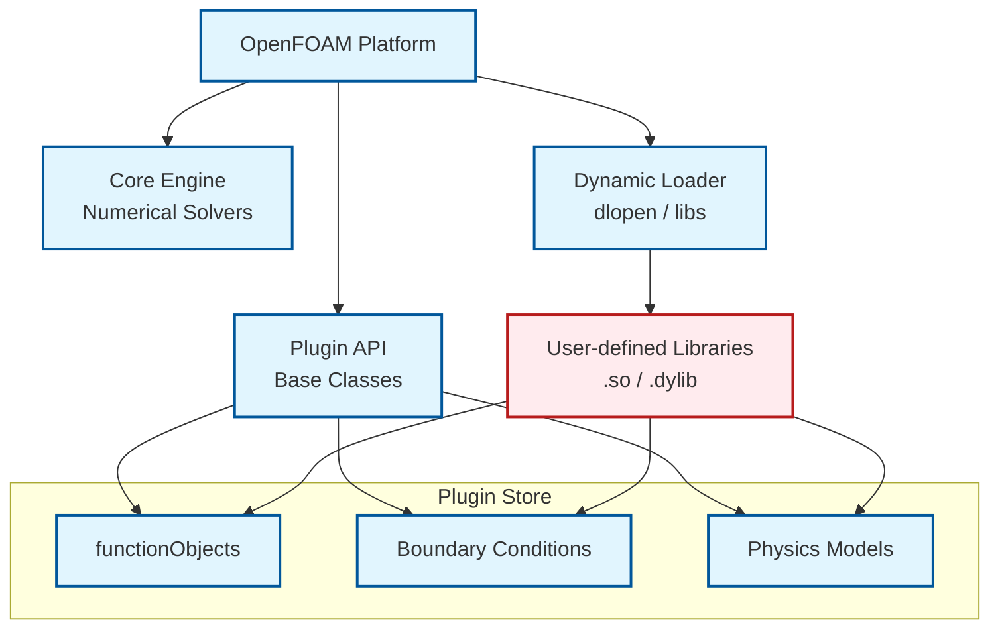

# 01 บทนำ: สถาปัตยกรรมความสามารถในการขยายของ OpenFOAM

![[cfd_app_store.png]]
`A clean scientific illustration of the "CFD App Store" concept. Show a central "OpenFOAM Core" sphere (the OS). Orbiting around it are various "Modular Apps" (functionObjects, custom models, BCs) connected via "Plugin Sockets". A user is shown "installing" a new Force Calculator app into the system via a text-based Dictionary. Use a minimalist palette, scientific textbook diagram, clean vector line art, white background, high definition, flat design, educational infographic --ar 16:9`

## 1.1 "หลักคิดที่น่าสนใจ": "ร้านแอปสำหรับ CFD"

**จินตนาการว่าคุณกำลังใช้สมาร์ทโฟน** ที่มาพร้อมกับแอปพื้นฐาน (กล้องถ่ายรูป เครื่องคิดเลข ปฏิทิน) แต่คุณสามารถ:

* **ติดตั้งแอปใหม่** โดยไม่ต้องแก้ไขระบบปฏิบัติการของโทรศัพท์
* **เลือกจากแอปพิเศษหมื่นรายการ** (ตัวติดตามสุขภาพ โปรแกรมแปลภาษา โปรแกรมแก้ไขรูปภาพ)
* **ถอนการติดตั้งแอป** เมื่อคุณไม่ต้องการแล้ว
* **แอปทั้งหมดทำงานร่วมกันได้อย่างสมบูรณ์** กับคุณสมบัติหลักของโทรศัพท์ (การแจ้งเตือน ที่จัดเก็บข้อมูล เครือข่าย)

**ตอนนี้จินตนาการถึงซอฟต์แวร์ CFD** ที่ทำงานในลักษณะเดียวกัน:

* **OpenFOAM หลัก** = ระบบปฏิบัติการของสมาร์ทโฟน (แก้สมการ Navier-Stokes พื้นฐาน)
* **functionObjects** = แอปที่คุณติดตั้ง (เครื่องคำนวณแรง ตัวติดตามสนาม ตัวส่งออกข้อมูล)
* **ไลบรารีไดนามิก (ไฟล์ .so)** = แพ็คเกจการติดตั้งแอป
* **การเลือกขณะทำงาน** = ระบบค้นหาและเริ่มต้นแอปสโตร์

### ปัญหา: หากไม่มีความสามารถในการขยาย

หากไม่มีสถาปัตยกรรมที่ยืดหยุ่น คุณจะต้องแก้ไขซอร์สโค้ดของ OpenFOAM สำหรับเครื่องมือวิเคราะห์ใหม่ทุกชนิด:

```cpp
// ❌ การตรวจสอบแบบฮาร์ดโค้ด (ไม่ยืดหยุ่น ต้องคอมไพล์ใหม่)
if (userWantsForces) calculateForces();      // การคำนวณแรง
if (userWantsProbes) sampleProbes();         // การสุ่มตัวอย่างจุดวัด
if (userWantsAverages) computeAverages();    // การหาค่าเฉลี่ยสนาม
// เพิ่มคุณสมบัติใหม่? แก้ไขโปรแกรมคำนวณ → คอมไพล์ใหม่ → เผยแพร่ใหม่
```

> **📂 Source:** ตัวอย่างโค้ดนี้แสดงถึงปัญหาในแนวทางการเขียนโปรแกรมแบบดั้งเดิมที่ไม่มีความสามารถในการขยาย
> 
> **คำอธิบาย:** ในแบบจำลองนี้ ฟังก์ชันการทำงานทั้งหมดถูกฮาร์ดโค้ดเข้าไปในโปรแกรมคำนวณหลัก ทุกครั้งที่ต้องการเพิ่มฟีเจอร์ใหม่ ต้องแก้ไขซอร์สโค้ด คอมไพล์ใหม่ และเผยแพร่ซอฟต์แวร์ทั้งหมดซ้ำ ซึ่งไม่เพียงแต่ใช้เวลานาน แต่ยังเสี่ยงต่อการนำเสนอบั๊กใหม่ๆ เข้าไปในโค้ดที่เสถียรแล้ว
> 
> **แนวคิดสำคัญ:**
> - **Hard-coded functionality** - ฟังก์ชันที่ถูกเขียนลงในโค้ดโดยตรง
> - **Monolithic architecture** - สถาปัตยกรรมแบบก้อนเดียวที่ไม่แยกส่วน
> - **Recompilation cycle** - วงจรการคอมไพล์ใหม่ที่น่าเบื่อ
> - **Tight coupling** - การผูกมัดแน่นระหว่างส่วนประกอบต่างๆ

### โซลูชัน: สถาปัตยกรรมปลั๊กอินของ OpenFOAM

OpenFOAM ช่วยให้คุณ "ติดตั้ง" ความสามารถใหม่ได้ในระหว่างการทำงาน:

```cpp
// ✅ สถาปัตยกรรมปลั๊กอิน (ยืดหยุ่น ไม่ต้องคอมไพล์ใหม่)
functions
{
    forces
    {
        type            forces;          // "ติดตั้ง" แอปคำนวณแรง
        libs            ("libforces.so"); // Load library at runtime
        patches         (wing fuselage);
        outputControl   timeStep;
        outputInterval  10;
    }

    fieldAverage
    {
        type            fieldAverage;    // "ติดตั้ง" แอปหาค่าเฉลี่ย
        libs            ("libfieldFunctionObjects.so");
        fields          (U p);
        mean            yes;
        prime2Mean      yes;
    }
}
```

> **📂 Source:** รูปแบบการกำหนดค่าพจนานุกรมนี้เป็นมาตรฐานของ OpenFOAM สำหรับการกำหนด functionObjects
> 
> **คำอธิบาย:** ในแบบจำลองปลั๊กอิน ผู้ใช้ระบุความสามารถที่ต้องการผ่านไฟล์พจนานุกรม (dictionary file) ระบบจะโหลดไลบรารีไดนามิก (.so) และสร้างอ็อบเจ็กต์ functionObject ที่ต้องการขณะทำงาน (runtime) โดยไม่ต้องคอมไพล์โปรแกรมคำนวณใหม่ คีย์เวิร์ด `type` ระบุ class ที่ต้องการ และ `libs` ระบุไฟล์ไลบรารีที่มี implementation อยู่
> 
> **แนวคิดสำคัญ:**
> - **Dictionary-based configuration** - การกำหนดค่าผ่านไฟล์พจนานุกรม
> - **Dynamic library loading** - การโหลดไลบรารีแบบไดนามิกด้วย dlopen
> - **Runtime instantiation** - การสร้างอ็อบเจ็กต์ขณะทำงาน
> - **Loose coupling** - การผูกมัดแบบหลวม ๆ ระหว่างส่วนประกอบ
> - **Plugin architecture** - สถาปัตยกรรมที่อนุญาตให้เพิ่มความสามารถได้โดยไม่ต้องแก้ไขโค้ดหลัก



> **Figure 1:** สถาปัตยกรรมแพลตฟอร์มของ OpenFOAM ที่แยกส่วนเครื่องยนต์หลัก (Core Engine) ออกจากส่วนขยาย (Plugins) ผ่านทาง Plugin API และระบบโหลดไลบรารีแบบไดนามิก ทำให้ผู้ใช้สามารถติดตั้ง "แอป" หรือโมเดลฟิสิกส์ใหม่ๆ ได้อย่างอิสระเหมือนการใช้งานสมาร์ทโฟน

## 1.2 อนาล็อกี: "ร้านแอป CFD"

คิดถึงระบบความสามารถในการขยายของ OpenFOAM เป็น **ร้านแอป CFD** ที่:

| อนาล็อกีสมาร์ทโฟน | OpenFOAM |
|---------------------|----------|
| **แค็ตตาล็อกร้านแอป** | **ตารางการเลือกขณะทำงาน** (รายการ functionObjects ทั้งหมดที่มี) |
| **การติดตั้งแอป** | **การโหลดไลบรารีไดนามิก** (dlopen โหลดไฟล์ .so) |
| **การตั้งค่าแอป** | **การกำหนดค่าพจนานุกรม** (ผู้ใช้กำหนดค่าแต่ละ functionObject) |
| **การดำเนินการแอป** | **การผสานรวมวงรอบเวลา** (functionObjects ทำงานในเวลาที่ระบุ) |

สถาปัตยกรรมนี้เปลี่ยน OpenFOAM จากโปรแกรมคำนวณ CFD แบบคงที่ไปเป็น **แพลตฟอร์มสำหรับฟิสิกส์เชิงคำนวณ**

## 1.3 ผลกระทบต่อการวิจัยและการพัฒนา

### สำหรับนักวิจัย

แนวคิดความสามารถในการขยายเปลี่ยนแปลงวิธีการเข้าใกล้ฟิสิกส์เชิงคำนวณอย่างพื้นฐาน แทนที่จะเป็นแอปพลิเคชันแบบโมโนลิธิกที่มีความสามารถคงที่ OpenFOAM มอบเฟรมเวิร์กแบบโมดูลาร์แบบไดนามิก ที่นักวิจัยและวิศวกรสามารถขยายฟังก์ชันการทำงานได้โดยไม่ต้องแตะโค้ดโปรแกรมคำนวณหลัก

ในบริบทของ CFD นี่หมายความว่า:
* นักวิจัยพลศาสตร์ของไหลสามารถพัฒนาเครื่องมือวิเคราะห์ความปั่นป่วนแบบกำหนดเอง บรรจุเป็นไลบรารีแบ่งปัน และเผยแพร่ให้ผู้ใช้อื่นที่สามารถใช้งานได้ทันทีโดยไม่ต้องคอมไพล์ OpenFOAM ใหม่
* วิศวกรเคมีอาจสร้างเครื่องคำนวณอัตราปฏิกิริยาเฉพาะทางที่ทำงานร่วมกับโปรแกรมคำนวณที่มีอยู่ได้อย่างราบรื่น
* ระบบหลักรักษาเสถียรภาพเชิงตัวเลขและความแข็งแกร่งของโปรแกรมคำนวณในขณะเดียวกันก็มอบโอกาสที่ไม่มีที่สิ้นสุดสำหรับการเพิ่มประสิทธิภาพเฉพาะทาง

### แก้ไขความท้าทายในฟิสิกส์เชิงคำนวณ

แบบจำลอง "ร้านแอป" นี้แก้ไขความท้าทายที่สำคัญในฟิสิกส์เชิงคำนวณ: **ความตึงเครียดระหว่างเสถียรภาพของโปรแกรมคำนวณและนวัตกรรมคุณสมบัติ**

โดยการแยกวิธีการเชิงตัวเลขพื้นฐานจากความสามารถในการวิเคราะห์และประมวลผลหลัง OpenFOAM ช่วยให้แน่ใจว่า:
* การคำนวณทางฟิสิกส์พื้นฐานยังคงได้รับการตรวจสอบและตรวจสอบความถูกต้อง
* อนุญาตให้มีนวัตกรรมไร้ขีดจำกัดในวิธีการประมวลผล วิเคราะห์ และแสดงภาพผลลัพธ์

## 1.4 รากฐานทางเทคนิค

การใช้งานทางเทคนิคพึ่งพาคุณสมบัติและรูปแบบการออกแบบ C++ หลายอย่าง:

### พอลิมอร์ฟิซึมขณะทำงาน (Runtime Polymorphism)

พอลิมอร์ฟิซึมขณะทำงานช่วยให้วัตถุฟังก์ชันต่างๆ ได้รับการปฏิบัติอย่างสม่ำเสมอโดยโปรแกรมคำนวณ ผ่านฟังก์ชันเสมือน (virtual functions):

```cpp
// Abstract interface in base functionObject class
virtual bool execute() = 0;
virtual bool write() = 0;

// Concrete implementation for specific behavior
class forcesFunctionObject : public functionObject
{
    // Override virtual function for force calculations
    virtual bool execute() override
    {
        // Calculate pressure and viscous forces
        // F = ∫(pI + τ)·n dS
        return true;
    }
};
```

> **📂 Source:** รูปแบบนี้เป็นพื้นฐานของระบบ functionObject ใน OpenFOAM ดูเพิ่มเติมใน src/OpenFOAM/db/functionObject/functionObject/functionObject.H
> 
> **คำอธิบาย:** พอลิมอร์ฟิซึมขณะทำงานใช้ฟังก์ชันเสมือน (virtual functions) และการสืบทอด (inheritance) เพื่อสร้าง interface ที่เป็นนามธรรม คลาสฐาน `functionObject` กำหนดสัญญา (contract) ผ่านฟังก์ชันเสมือน `execute()` และ `write()` ที่เป็น pure virtual (= 0) ซึ่งบังคับให้ทุกคลาสลูกต้อง implement ฟังก์ชันเหล่านี้ เมื่อโปรแกรมคำนวณเรียก `execute()` ผ่าน pointer ของคลาสฐาน C++ จะเรียกใช้ implementation ที่ถูกต้องตามประเภทจริงของอ็อบเจ็กต์ (dynamic dispatch)
> 
> **แนวคิดสำคัญ:**
> - **Pure virtual functions** - ฟังก์ชันเสมือนที่ไม่มี implementation ในคลาสฐาน
> - **Function overriding** - การเขียนทับฟังก์ชันเสมือนในคลาสลูก
> - **Dynamic dispatch** - การเลือกฟังก์ชันที่จะเรียกตามประเภทจริงขณะทำงาน
> - **Abstract base class** - คลาสฐานที่ไม่สามารถสร้างอ็อบเจ็กต์โดยตรง
> - **Interface contract** - สัญญาที่กำหนดว่าคลาสลูกต้องทำอะไรได้บ้าง

### การโหลดไลบรารีไดนามิก

การโหลดไลบรารีไดนามิกช่วยให้สามารถเพิ่มความสามารถใหม่ได้ "ตามเวลาจริง" ผ่าน POSIX `dlopen()`:

```cpp
// Dynamic library loading using POSIX dlopen
void* handle = dlopen("libforces.so", RTLD_LAZY | RTLD_GLOBAL);

// Static constructor in library runs automatically
// Registers new functionObjects with runtime selection table
```

> **📂 Source:** กลไกนี้ถูกใช้ใน `src/OpenFOAM/db/dictionary/dictionary.H` และไฟล์ `.C` ที่เกี่ยวข้อง
> 
> **คำอธิบาย:** POSIX `dlopen()` เป็นฟังก์ชันระบบที่ช่วยให้โปรแกรมสามารถโหลด shared libraries (.so บน Linux, .dylib บน macOS) ขณะทำงาน โดยไม่ต้อง link ตั้งแต่ตอนคอมไพล์ flag `RTLD_LAZY` บอกให้ resolve symbols เฉพาะเมื่อถูกใช้จริง และ `RTLD_GLOBAL` ทำให้ symbols ในไลบรารีสามารถเข้าถึงได้โดยไลบรารีอื่นๆ ที่โหลดภายหลัง เมื่อไลบรารีถูกโหลด static constructor ของมันจะทำงานทันทีและลงทะเบียน functionObjects ใหม่กับ runtime selection table
> 
> **แนวคิดสำคัญ:**
> - **Dynamic loading** - การโหลดไลบรารีขณะโปรแกรมทำงาน
> - **Shared libraries** - ไฟล์ .so หรือ .dylib ที่มีโค้ดที่ใช้ร่วมกันได้
> - **Symbol resolution** - กระบวนการเชื่อมโยงฟังก์ชันและตัวแปร
> - **Static constructor** - โค้ดที่ทำงานเมื่อไลบรารีถูกโหลด
> - **Runtime selection table** - ตารางข้อมูลที่เก็บรายชื่อ class ที่พร้อมใช้งาน

ตัวอย่างจริงของการลงทะเบียน functionObject ใน runtime selection table:

```cpp
// * * * * * * * * * * * * * * Static Data Members * * * * * * * * * * * * * //

namespace Foam
{
namespace functionObjects
{
    // Define type name and debug information
    defineTypeNameAndDebug(populationBalanceMoments, 0);
    
    // Add to runtime selection table - enables dictionary-based instantiation
    addToRunTimeSelectionTable
    (
        functionObject,
        populationBalanceMoments,
        dictionary
    );
}
}
```

> **📂 Source:** `.applications/solvers/multiphase/multiphaseEulerFoam/functionObjects/populationBalanceMoments/populationBalanceMoments.C`
> 
> **คำอธิบาย:** นี่คือตัวอย่างจริงจาก OpenFOAM codebase ที่แสดงการลงทะเบียน functionObject `populationBalanceMoments` ลงในระบบ runtime selection macro `defineTypeNameAndDebug` สร้างชื่อประเภทและข้อมูลการดีบัก ในขณะที่ `addToRunTimeSelectionTable` เป็น macro ที่สำคัญที่สร้างรายการในตารางการเลือกขณะทำงาน เมื่อผู้ใช้ระบุ `type populationBalanceMoments;` ในไฟล์พจนานุกรม ระบบจะค้นหาในตารางนี้และสร้างอ็อบเจ็กต์ `populationBalanceMoments` โดยอัตโนมัติ
> 
> **แนวคิดสำคัญ:**
> - **Runtime Selection Table** - ตารางข้อมูลที่เชื่อมโยงชื่อสตริงกับ constructor
> - **Static registration** - การลงทะเบียนที่เกิดขึ้นเมื่อโปรแกรมเริ่มทำงาน
> - **Macro-based registration** - การใช้ preprocessor macros เพื่อลดความซับซ้อน
> - **Dictionary constructor** - constructor ที่รับพจนานุกรมเป็นอาร์กิวเมนต์
> - **Type name system** - ระบบการตั้งชื่อประเภทสำหรับการระบุในไฟล์พจนานุกรม

### รูปแบบการออกแบบ

* **รูปแบบโรงงาน (Factory Pattern)**: จัดการการสร้างวัตถุโดยยึดตามตัวระบุสตริง
* **รูปแบบผู้สังเกต (Observer Pattern)**: functionObjects สังเกตและตอบสนองต่อเหตุการณ์ใน loop การคำนวณ
* **รูปแบบกลยุทธ์ (Strategy Pattern)**: functionObjects แต่ละตัวใช้งานอัลกอริทึมการวิเคราะห์ที่แตกต่างกัน

### ระบบการกำหนดค่าที่ยึดตามพจนานุกรม

ระบบการกำหนดค่าที่ยึดตามพจนานุกรมมอบวิธีการแบบประกาศสำหรับผู้ใช้ในการระบุว่าจะ "ติดตั้ง" แอปใดและกำหนดค่าอย่างไร โดยไม่ต้องเขียนโค้ด C++

## 1.5 ปรัชญาสถาปัตยกรรม

ปรัชญาสถาปัตยกรรมนี้เป็นการเปลี่ยนแปลงพื้นฐานในวิธีการออกแบบและพัฒนาซอฟต์แวร์คอมพิวเตอร์ทางวิทยาศาสตร์ โดยเคลื่อนจากแอปพลิเคชันแบบปิดและโมโนลิธิกไปสู่แพลตฟอร์มแบบเปิดและสามารถขยายได้ที่ใช้ปัญญาประสานของชุมชนนักวิจัยทั่วโลก

### ปรัชญาการออกแบบที่ใช้ Template

ในแกนกลางของ OpenFOAM ใช้วิธีการ **Template Metaprogramming** ที่ซับซ้อนซึ่งเปิดใช้งาน polymorphism ระดับ compile-time และ type safety:

```cpp
// Template extensibility example from OpenFOAM
template<class Type>
class GeometricField
{
    // Field operations that work with scalar, vector, tensor fields
    template<class Type2>
    void operator=(const GeometricField<Type2>&);
};

// Solvers specific to different physics
template<class Type>
class GAMGSolver : public LduMatrix<Type, Type, Type>::solver
{
    // Generic solver implementation
};
```

> **📂 Source:** Template system ถูกใช้อย่างแพร่หลายใน `src/OpenFOAM/fields/` เช่น GeometricField เป็นต้น
> 
> **คำอธิบาย:** Template metaprogramming ใน OpenFOAM ช่วยให้สามารถเขียนโค้ดที่เป็น generic และทำงานกับหลายประเภทข้อมูลโดยไม่ต้องเขียนซ้ำ `GeometricField` เป็นคลาส template ที่ห่อหุ้ม fields ของ OpenFOAM (scalar, vector, tensor) และให้ operations ที่สม่ำเสมอผ่าน operator overloading template parameter `Type` ช่วยให้คอมไพเลอร์สร้าง version ของคลาสที่เฉพาะเจาะจงสำหรับแต่ละประเภทข้อมูล ให้ทั้งประสิทธิภาพของโค้ดเฉพาะและความยืดหยุ่นของโค้ด generic
> 
> **แนวคิดสำคัญ:**
> - **Template metaprogramming** - เทคนิคการใช้ templates เพื่อสร้างโค้ดขณะคอมไพล์
> - **Compile-time polymorphism** - polymorphism ที่ถูก resolve ตอนคอมไพล์ไม่ใช่ขณะทำงาน
> - **Type safety** - การตรวจสอบประเภทข้อมูลขณะคอมไพล์
> - **Code generation** - การสร้างโค้ดโดยอัตโนมัติจาก template
> - **Generic programming** - การเขียนโปรแกรมที่ทำงานกับหลายประเภทข้อมูล

แนวทางแบบ template นี้อนุญาตให้ผู้ใช้สามารถ:
* สร้างประเภท field ใหม่ (scalar, vector, tensor, complex)
* สร้าง solvers ที่เฉพาะเจาะจงสำหรับฟิสิกส์ที่แตกต่างกัน
* พัฒนา boundary conditions แบบกำหนดเองพร้อม type safety
* ขยาย numerical schemes ในขณะที่ยังคงประสิทธิภาพ

### หลักการทางสถาปัตยกรรม

#### หลักการเปิด-ปิด (Open-Closed Principle)

ระบบการขยายความสามารถของ OpenFOAM สะท้อนถึง **หลักการเปิด-ปิด**: มัน **เปิดสำหรับการขยาย** (สามารถเพิ่ม functionObject ใหม่ได้โดยไม่ต้องแก้ไขโค้ดที่มีอยู่) แต่ **ปิดสำหรับการแก้ไข** (ตรรกะหลักของ solver ยังคงไม่เปลี่ยนแปลง)

#### หลักการกลับด้านการพึ่งพา (Dependency Inversion Principle)

สถาปัตยกรรมนี้ใช้ **การกลับด้านการพึ่งพา** ผ่านส่วนติดต่อนามธรรม:

$$\text{Solver} \rightarrow \text{functionObject Interface} \leftarrow \text{Specific Implementation}$$

ทางคณิตศาสตร์ สิ่งนี้สร้างระบบที่ไม่มีการ coupling และอนุญาตให้มีการพัฒนาแบบ decoupled

#### การแยกความกังวล (Separation of Concerns)

OpenFOAM บรรลุการแยกอย่างสะอาดผ่านชั้นสถาปัตยกรรมที่แตกต่างกัน:

* **ชั้น Solver**: การแก้ปัญหาฟิสิกส์ (เช่น $\rho \frac{\partial \mathbf{u}}{\partial t} + \rho (\mathbf{u} \cdot \nabla) \mathbf{u} = -\nabla p + \mu \nabla^2\mathbf{u} + \mathbf{f}$)
* **ชั้น functionObjects**: การวิเคราะห์และการตรวจสอบ (เช่น $C_D = \frac{2F_D}{\rho U_\infty^2 A}$)
* **ชั้นระบบ Runtime**: การจัดการ Plugin (การโหลดไลบรารี `dlopen`, การสร้างแบบ factory)

## 1.6 วัฏจักรแห่งนวัตกรรม

บางที่สำคัญที่สุด สถาปัตยกรรมนี้สร้าง **วัฏจักรแห่งนวัตกรรมอย่างมีคุณภาพ**:

* เมื่อผู้ใช้มีส่วนร่วมใน function objects มากขึ้น แพลตฟอร์มจะมีคุณค่ามากขึ้น
* ดึงดูดผู้ใช้มากขึ้น ซึ่งตอบกลับด้วยการมีส่วนร่วมในความสามารถมากขึ้น
* เอฟเฟกต์ระบบนิเวศนี้มีบทบาทสำคัญในการรับเลือกใช้ OpenFOAM ในการวิจัยทางวิชาการ แอปพลิเคชันอุตสาหกรรม และงานที่ปรึกษาเฉพาะทาง

## 1.7 ความสามารถในการขยายทั่วทั้งระบบ

ความสามารถในการขยายยังขยายไปถึงความสามารถของโปรแกรมคำนวณพื้นฐาน ในขณะที่ function objects ให้ตัวอย่างที่เห็นได้ชัดที่สุดของสถาปัตยกรรมปลั๊กอิน กลไกที่คล้ายกันก็มีอยู่สำหรับ:

* **เงื่อนไขขอบเขต** (Boundary Conditions)
* **รูปแบบเชิงตัวเลข** (Numerical Schemes)
* **แบบจำลองทางกายภาพ** (Physics Models)
* **วิธีการ Discretization**

นี่หมายความว่าผู้ใช้ที่พัฒนาฟังก์ชันผนังเฉพาะทางสำหรับชั้นขอบเขตบรรยากาศสามารถเผยแพร่เป็นปลั๊กอินที่ผู้อื่นสามารถใช้ทันทีในการจำลองของพวกเขา

## 1.8 ข้อดีทางวิศวกรรมซอฟต์แวร์

จากมุมมองวิศวกรรมซอฟต์แวร์ สถาปัตยกรรมนี้มอบข้อดีทางปฏิบัติหลายประการ:

* **การอัปเดตแบบโมดูลาร์**: การอัปเดต function objects แต่ละตัวไม่จำเป็นต้องมีการทดสอบย้อนกลับของโค้ดเบสโปรแกรมคำนวณทั้งหมด
* **การพัฒนาแบบขนาน**: กลุ่มวิจัยต่างๆ สามารถทำงานกับส่วนขยายต่างๆ พร้อมกันโดยไม่มีความขัดแย้งในการผสานรวม
* **การแยกความรับผิดชอบ**: ทีมพัฒนาหลักสามารถมุ่งเน้นที่วิธีการเชิงตัวเลขในขณะที่ชุมชนเพิ่มฟังก์ชันการทำงานเฉพาะทาง

## 1.9 บทสรุป

โดยพื้นฐานแล้ว ความสามารถในการขยายของ OpenFOAM เปลี่ยนพลศาสตร์ของไหลเชิงคำนวณจากวินัยที่ยึดตามเครื่องมือไปสู่วินัยที่ยึดตามแพลตฟอร์ม

* ผู้ใช้ไม่ได้ถูกจำกัดด้วยคุณสมบัติที่นักพัฒนาดั้งเดิมจินตนาการไว้
* สามารถมีส่วนร่วมอย่างแข็งขันในการขยายความสามารถของแพลตฟอร์มเพื่อแก้ไขความท้าทายด้านการวิจัยและวิศวกรรมเฉพาะทางของพวกเขา
* เป็นการเปลี่ยนแปลงพื้นฐานในวิธีการออกแบบและพัฒนาซอฟต์แวร์คอมพิวเตอร์ทางวิทยาศาสตร์
* เคลื่อนจากแอปพลิเคชันแบบปิดและโมโนลิธิกไปสู่แพลตฟอร์มแบบเปิดและสามารถขยายได้
* ใช้ปัญญาประสานของชุมชนนักวิจัยทั่วโลก

---

## แหล่งอ้างอิงเพิ่มเติม

1. OpenFOAM Programmer's Guide - Runtime Selection Tables
2. Design Patterns: Elements of Reusable Object-Oriented Software (Gamma et al.)
3. C++ Templates: The Complete Guide (Vandervoorde & Josuttis)
4. POSIX Dynamic Loading - `dlopen()` Manual Pages

## 🧠 ทดสอบความเข้าใจ (Concept Check)

<details>
<summary>1. จงอธิบายสถาปัตยกรรมของ OpenFOAM โดยใช้ "การเปรียบเทียบกับสมาร์ทโฟน" (Smartphone Analogy) โดยระบุว่าส่วนใดเปรียบเสมือน OS และส่วนใดเปรียบเสมือน Applications?</summary>

**คำตอบ:** OpenFOAM Core (เช่น ตัวแก้สมการ Navier-Stokes พื้นฐาน) เปรียบเสมือน **ระบบปฏิบัติการ (OS)** ของสมาร์ทโฟน ในขณะที่ `functionObjects` เปรียบเสมือน **Applications (Apps)** ที่ผู้ใช้สามารถติดตั้งเพิ่มเข้าไปเพื่อขยายความสามารถในการวิเคราะห์ข้อมูลได้โดยไม่ต้องแก้ไขหรือคอมไพล์ตัว OS ใหม่
</details>

<details>
<summary>2. ประโยชน์หลักของ "Open-Closed Principle" ใน OpenFOAM คืออะไร?</summary>

**คำตอบ:** ช่วยให้ตรรกะหลักของ Solver มีความเสถียรเนื่องจากถูก **ปิดสำหรับการแก้ไข (Closed for Modification)** แต่ระบบยังคงมีความยืดหยุ่นสูงโดย **เปิดสำหรับการขยาย (Open for Extension)** ซึ่งทำให้นักพัฒนาสามารถเพิ่มความสามารถใหม่ๆ ผ่าน Plugins ได้โดยไม่เสี่ยงที่จะทำให้โค้ดหลักพัง
</details>

## 📚 เอกสารที่เกี่ยวข้อง (Related Documents)

*   **ก่อนหน้า:** [00_Overview.md](00_Overview.md) - ภาพรวมของโมดูล
*   **ถัดไป:** [02_Runtime_Selection_Tables.md](02_Runtime_Selection_Tables.md) - ตารางการเลือกขณะทำงาน (Runtime Selection Tables)