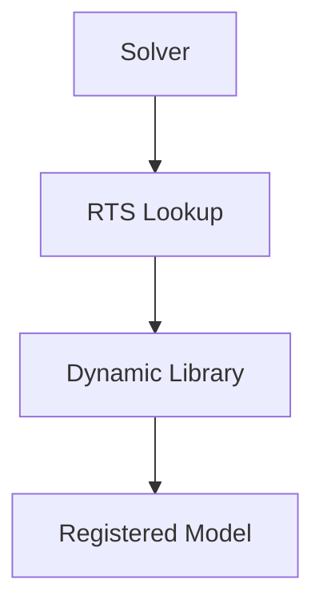

# Architecture - Introduction

บทนำ Architecture และ Extensibility

---

## Overview

> OpenFOAM is designed for **extensibility without recompilation**

---

## 1. Key Features

| Feature | Benefit |
|---------|---------|
| **RTS** | Add models via dictionary |
| **Dynamic libs** | Load at runtime |
| **Plugins** | No solver recompile |
| **Registry** | Central object access |

---

## 2. Extensibility Model



---

## 3. Example: Add Model

1. Write model class
2. Add RTS registration
3. Compile as library
4. Add `libs (...)` to case
5. Use in dictionary

---

## 4. No Recompilation Needed

```cpp
// Just add to controlDict
libs ("libmyNewModel.so");

// Then use in properties dict
model myNewModel;
```

---

## Quick Reference

| Step | How |
|------|-----|
| Create model | Inherit from base |
| Register | RTS macros |
| Compile | wmake libso |
| Use | libs directive |

---

## 🧠 Concept Check

<details>
<summary><b>1. ทำไม extensibility สำคัญ?</b></summary>

**Add features** ไม่ต้องแก้ solver code
</details>

<details>
<summary><b>2. libs directive ทำอะไร?</b></summary>

**Load shared library** ตอน runtime
</details>

<details>
<summary><b>3. RTS ช่วยอะไร?</b></summary>

**Dictionary-driven selection** — เปลี่ยน model ได้ง่าย
</details>

---

## 📖 เอกสารที่เกี่ยวข้อง

- **ภาพรวม:** [00_Overview.md](00_Overview.md)
- **RTS:** [02_Runtime_Selection_Tables.md](02_Runtime_Selection_Tables.md)