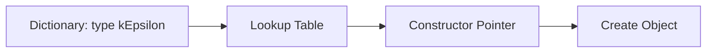

# Runtime Selection Tables

ตาราง Runtime Selection

---

## Overview

> **RTS** = Create objects from strings at runtime

---

## 1. How It Works



---

## 2. Declaring RTS

```cpp
// Base class
class turbulenceModel
{
public:
    TypeName("turbulenceModel");

    declareRunTimeSelectionTable
    (
        autoPtr,
        turbulenceModel,
        dictionary,
        (const dictionary& dict, const fvMesh& mesh),
        (dict, mesh)
    );
};
```

---

## 3. Registering Class

```cpp
// Derived class source file
defineTypeNameAndDebug(kEpsilon, 0);

addToRunTimeSelectionTable
(
    turbulenceModel,
    kEpsilon,
    dictionary
);
```

---

## 4. Factory Method

```cpp
autoPtr<turbulenceModel> turbulenceModel::New
(
    const dictionary& dict,
    const fvMesh& mesh
)
{
    word type(dict.lookup("type"));
    return dictionaryConstructorTable(type)(dict, mesh);
}
```

---

## 5. Usage

```cpp
// Dictionary
turbulenceProperties
{
    model kEpsilon;
}

// Code
autoPtr<turbulenceModel> turb = turbulenceModel::New(dict, mesh);
```

---

## Quick Reference

| Macro | Purpose |
|-------|---------|
| `TypeName` | Register name |
| `declareRunTimeSelectionTable` | Create table |
| `addToRunTimeSelectionTable` | Add class |

---

## Concept Check

<details>
<summary><b>1. RTS ทำงานอย่างไร?</b></summary>

**String → table lookup → constructor → object**
</details>

<details>
<summary><b>2. เมื่อไหร่ที่ registration เกิด?</b></summary>

**Static initialization** — program startup
</details>

<details>
<summary><b>3. ทำไมใช้ autoPtr return?</b></summary>

**Ownership transfer** — caller owns object
</details>

---

## Related Documents

- **ภาพรวม:** [00_Overview.md](00_Overview.md)
- **Dynamic Loading:** [03_Dynamic_Library_Loading.md](03_Dynamic_Library_Loading.md)