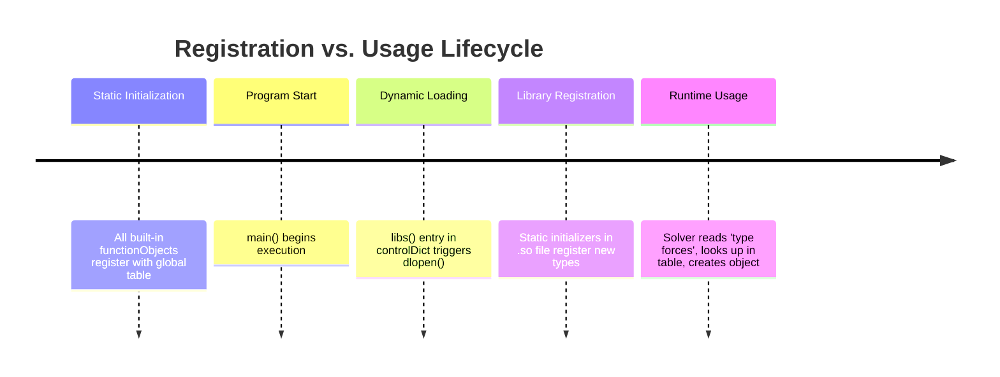

# 02 พิมพ์เขียว: Runtime Selection Tables ในฐานะทะเบียนส่วนขยาย

![[runtime_selection_table_map.png]]
`A clean scientific diagram illustrating the "Runtime Selection Table" as a central directory. Show a large "Global Selection Table" (Hash Table) in the center. On the left, show "Built-in Models" already registered. On the right, show a "Dynamic Library (.so)" being loaded and automatically adding its "Custom Model" into the table. Use a minimalist palette with black lines and clear arrows, scientific textbook diagram, clean vector line art, white background, high definition, flat design, educational infographic --ar 16:9`

**สถาปัตยกรรมของ OpenFOAM ใช้ "ตารางการเลือก" (Selection Tables)** เพื่อทำหน้าที่เป็นสารบัญหรือทะเบียนที่ระบุว่ามี "แอป" หรือ "ส่วนขยาย" อะไรบ้างที่ระบบสามารถเรียกใช้งานได้:

---

## ภาพรวม

Runtime Selection Tables เป็นกลไกหัวใจสำคัญที่ทำให้ OpenFOAM เป็น **แพลตฟอร์มฟิสิกส์เชิงคำนวณ** ที่สามารถขยายได้ ไม่ใช่แค่โปรแกรม CFD แบบคงที่ กลไกนี้ทำหน้าที่เหมือน **"ร้านแอปสำหรับ CFD"** ที่:

*   **ตารางการเลือกขณะทำงาน** = แค็ตตาล็อกร้านแอป (รายการ functionObjects ทั้งหมดที่มี)
*   **การโหลดไลบรารีไดนามิก** = การติดตั้งแอป (dlopen โหลดไฟล์ .so)
*   **การกำหนดค่าพจนานุกรม** = การตั้งค่าแอป (ผู้ใช้กำหนดค่าแต่ละ functionObject)
*   **การผสานรวมวงรอบเวลา** = การดำเนินการแอป (functionObjects ทำงานในเวลาที่ระบุ)

### ทำไมต้องใช้ Runtime Selection Tables แทน Hardcoded Factories?

การเลือกระหว่าง static factory methods และ runtime selection tables เป็นการตัดสินใจทางสถาปัตยกรรมขั้นพื้นฐานที่ส่งผลต่อการบำรุงรักษา การขยายตัว และขั้นตอนการพัฒนา นักออกแบบ OpenFOAM ตั้งใจปฏิเสธแนวทาง hardcoded factory แม้จะดูเหมือนง่ายกว่า

**แนวทาง Hardcoded Factory (สิ่งที่ OpenFOAM ปฏิเสธ)**:
```cpp
// ❌ Factory ที่ไม่ยืดหยุ่น - การเพิ่มประเภทใหม่ต้องแก้ไข source code
autoPtr<functionObject> createFunctionObject(const word& type)
{
    if (type == "forces") return new forces(...);
    else if (type == "probes") return new probes(...);
    else if (type == "fieldAverage") return new fieldAverage(...);
    else if (type == "wallShearStress") return new wallShearStress(...);
    else if (type == "courantNo") return new courantNo(...);
    else if (type == "yPlus") return new yPlus(...);
    // เพิ่มประเภทใหม่? ต้องแก้ไข function นี้และ recompile OpenFOAM
    else FatalError << "Unknown functionObject type: " << type << exit(FatalError);
}
```

แนวทาง hardcoded factory มีข้อจำกัดที่สำคัญหลายประการที่จำกัดระบบนิเวศของ OpenFOAM อย่างรุนแรง:

1.  **ความขึ้นต่อกันในการ compile**: functionObject ใหม่ทุกตัวต้องการการแก้ไข source code หลักของ OpenFOAM
2.  **ความสัมพันธ์แน่น**: factory ต้องรู้จักประเภทข้อมูลที่เป็นรูปธรรมทุกประเภทอย่างชัดเจน
3.  **ความไม่เข้ากันของ binary**: การเพิ่มประเภทใหม่บังคับให้ต้อง recompile ทั้ง framework
4.  **Plugin ที่เป็นไปไม่ได้**: external libraries ไม่สามารถลงทะเบียนประเภทใหม่แบบ dynamic ได้
5.  **ความเปราะบางของเวอร์ชัน**: การเปลี่ยนแปลง factory ทำลาย code ที่ขึ้นต่อกันทั้งหมด

**Runtime Selection Tables (สิ่งที่ OpenFOAM เลือก)**:
```cpp
// ✅ Extensible registry - ประเภทใหม่ลงทะเบียนตัวเองโดยอัตโนมัติ
declareRunTimeSelectionTable
(
    autoPtr,                    // Return type: smart pointer สำหรับจัดการหน่วยความจำอัตโนมัติ
    functionObject,             // Base class ที่ขยาย
    dictionary,                 // Construction argument type identifier
    (const word& name, const Time& runTime, const dictionary& dict),  // Constructor signature
    (name, runTime, dict)       // Constructor parameter forwarding
);

// Macro expansion สร้างโครงสร้างพื้นฐานที่ซับซ้อน:
// HashTable<dictionaryConstructorPtr, word> dictionaryConstructorTable;
// Where dictionaryConstructorPtr = autoPtr<functionObject>(*)(const word&, const Time&, const dictionary&)
//
// นอกจากนี้ยังสร้าง:
// - AddToDictionaryConstructorTable<Class> template class
// - Static initialization mechanism
// - Type-safe constructor forwarding
// - Automatic table population
```

กลไก runtime selection table สร้าง extension registry ที่ทรงพลังซึ่งทำงานผ่านการประสานงานระหว่าง compile-time และ runtime ที่ซับซ้อน `declareRunTimeSelectionTable` macro สร้างโครงสร้างข้อมูลและ accessor functions ที่จำเป็น ในขณะที่ companion macros จัดการกระบวนการลงทะเบียนจริง

---

## ประโยชน์ทางสถาปัตยกรรม

### 1. รองรับ Dynamic Library

Plugins สามารถลงทะเบียนตัวเองหลังจาก main executable โหลดแล้ว:

```cpp
// External library สามารถขยาย OpenFOAM โดยไม่ต้อง recompile:
void loadLibrary()
{
    // Library initialization ทำงานโดยอัตโนมัติ
    // addToRunTimeSelectionTable execute
    // ประเภทใหม่พร้อมใช้งานทันที
    libFunctionObjects.so loads → CustomFunctionObjects auto-register
}
```

### 2. การพัฒนาแบบ Decoupled

functionObjects ใหม่สามารถพัฒนาแยกจาก OpenFOAM หลัก:

```cpp
// Developer สร้าง functionObject ใหม่ใน project แยก:
class myCustomAnalysis : public functionObject
{
    // Implementation details
};

addToRunTimeSelectionTable(functionObject, myCustomAnalysis, dictionary);
// ไม่ต้องแก้ไข OpenFOAM หลัก!
```

### 3. Zero Coupling

OpenFOAM หลักไม่ขึ้นต่อกับประเภท functionObject ที่เป็นรูปธรรม:

```cpp
// Core system รู้จักแค่ abstract interface:
template<class Type>
class functionObjectList
{
    // No specific type dependencies
    // Works with any registered implementation
};
```

### 4. Lazy Loading

Libraries โหลดเมื่อจำเป็นเท่านั้น ลด memory footprint:

```cpp
// Memory-efficient loading pattern:
if (requiredFunction("customAnalysis"))
{
    // โหลด library เมื่อจำเป็นจริงๆ เท่านั้น
    libFunctionObjects.so loads at runtime
}
```

---

## กลไกการลงทะเบียน: Self-Registering Types

ความเยี่ยมของระบบ runtime selection ของ OpenFOAM อยู่ที่กลไกการลงทะเบียนอัตโนมัติ functionObject ที่เป็นรูปธรรมแต่ละตัวกลายเป็นหน่วยที่สมบูรณ์ซึ่งลงทะเบียนตัวเองกับ global registry โดยไม่ต้องการการแทรกแซงด้วยตนเอง

### การ Implement การลงทะเบียนอย่างสมบูรณ์

```cpp
// In forces.C (complete example):
#include "forces.H"

// 1. Define the concrete class metadata
defineTypeNameAndDebug(forces, 0);

// 2. Macro ที่เพิ่ม class เข้า runtime selection table
addToRunTimeSelectionTable
(
    functionObject,     // Base class ที่จะขยาย
    forces,             // Derived class ที่ลงทะเบียน
    dictionary          // Construction signature variant
);

// Macro expansion สร้าง:
/*
class AddToDictionaryConstructorTable_forces
{
public:
    AddToDictionaryConstructorTable_forces()
    {
        functionObject::dictionaryConstructorTable["forces"] =
            forces::NewDictionaryConstructor;
    }
};

static AddToDictionaryConstructorTable_forces
    AddToDictionaryConstructorTable_forces_instance;
*/
```

### ลำดับเวลาการลงทะเบียน

กระบวนการลงทะเบียนเกิดขึ้นในลำดับที่กำหนดไว้อย่างชัดเจน:



> **Figure 1:** ลำดับเหตุการณ์ (Timeline) ของกระบวนการลงทะเบียนและเรียกใช้งานออบเจกต์ใน OpenFOAM เริ่มต้นจากการลงทะเบียนแบบสถิตเมื่อโปรแกรมเริ่มทำงาน ตามด้วยการโหลดไลบรารีเพิ่มเติมในระหว่างรันไทม์ และสิ้นสุดที่การนำออบเจกต์ไปใช้งานจริงเมื่อผู้ใช้เรียกผ่าน Dictionary

#### ระยะ Static Initialization (ก่อน `main()`)

*   Global static constructors execute
*   `AddToDictionaryConstructorTable_forces_instance` constructed
*   Static constructor เพิ่ม entry เข้า global hash table
*   functionObjects ที่มีอยู่ทั้งหมดลงทะเบียนตัวเอง

#### Dynamic Library Loading (runtime)

*   External libraries โหลดผ่าน `dlOpen()`
*   Library static initializers execute อัตโนมัติ
*   functionObjects ใหม่ลงทะเบียนตัวเอง
*   Registry ขยายตัวแบบ dynamic

#### Factory Method Execution (on demand)

*   User ร้องขอ functionObject ตามชื่อ
*   Registry lookup หา constructor ที่เหมาะสม
*   Constructor ถูกเรียกด้วย forwarded parameters
*   New instance ส่งกลับเป็น `autoPtr<functionObject>`

**ข้อมูลสำคัญ**: `addToRunTimeSelectionTable` macro สร้าง boilerplate code ที่ซับซ้อนซึ่งสร้าง static initialization object constructor ของ object นี้ execute อัตโนมัติระหว่าง program startup โดยแทรก function pointer เข้าไปใน global registry สิ่งนี้สร้าง "app store" model ที่ functionObjects ใหม่เพียงแค่เพิ่มตัวเองเข้าไปใน catalog โดยไม่ต้องการการประสานงานกลาง

### รองรับ Constructor Signature หลายแบบ

OpenFOAM รองรับรูปแบบการสร้างต่างกันผ่าน tables แยกกัน:

```cpp
// Different constructor patterns for different use cases:
declareRunTimeSelectionTable(autoPtr, functionObject, dictionary);      // Dictionary-based
declareRunTimeSelectionTable(autoPtr, functionObject, dictionaryMesh);  // Dictionary + Mesh
declareRunTimeSelectionTable(autoPtr, functionObject, dictionaryIO);    // Dictionary + I/O
declareRunTimeSelectionTable(autoPtr, functionObject, dictionaryName);  // Dictionary + Name

// Registration for each variant:
addToRunTimeSelectionTable(functionObject, forces, dictionary);
addToRunTimeSelectionTable(functionObject, customMeshBased, dictionaryMesh);
```

ความยืดหยุ่นนี้อนุญาตให้ functionObjects เลือกรูปแบบ constructor ที่เหมาะสมที่สุดในขณะที่รักษากลไกการลงทะเบียนเดิม

---

## รูปแบบการออกแบบทางสถาปัตยกรรม

### Factory Method + Registry = สถาปัตยกรรมปลั๊กอิน

Runtime Selection Tables ใน OpenFOAM เป็นการผสมผสานระหว่าง **Factory Method Pattern** และ **Registry Pattern** เพื่อสร้างระบบปลั๊กอินที่ทรงพลัง

**ปัญหา**: โปรแกรมแก้ปัญหา CFD จะสร้างออบเจกต์ของประเภทที่ไม่รู้จักซึ่งระบุไว้ในขณะทำงานได้อย่างไร เมื่อประเภทเหล่านั้นอาจไม่มีอยู่ในระหว่างการคอมไพล์

**วิธีแก้ปัญหา**: รวมรูปแบบ Factory Method เข้ากับระบบรีจิสทรีขณะทำงานเพื่อให้การสร้างออบเจกต์แบบไดนามิกโดยไม่มีการพึ่งพาระหว่างคอมไพล์

```cpp
// การ implement Factory Method + Registry แบบสมบูรณ์
template<class Type>
class FactoryRegistry
{
public:
    // Factory Method - สร้างออบเจกต์โดยไม่ต้องรู้ประเภทที่แท้จริง
    static autoPtr<Type> create(const word& typeName, const dictionary& dict)
    {
        // การค้นหาในรีจิสทรีขณะทำงาน
        typename ConstructorTable::iterator cstrIter =
            ConstructorTablePtr_->find(typeName);

        if (cstrIter == ConstructorTablePtr_->end())
        {
            FatalErrorInFunction
                << "Unknown " << Type::typeName << " type "
                << typeName << nl << nl
                << "Valid " << Type::typeName << " types are:" << nl
                << ConstructorTablePtr_->sortedToc()
                << exit(FatalError);
        }

        return cstrIter()(dict);  // มอบหมายให้กับ creator ที่ลงทะเบียนไว้
    }

    // Registry Pattern - กลไกการลงทะเบียนแบบอัตโนมัติ
    static void addConstructorToTable
    (
        const word& typeName,
        typename Type::constructorTable::functionPointer constructor
    )
    {
        ConstructorTablePtr_->insert(typeName, constructor);
    }

private:
    // รีจิสทรีขณะทำงานเก็บฟังก์ชัน creator
    static typename Type::constructorTable* ConstructorTablePtr_;
};

// แมโครการลงทะเบียนแบบอัตโนมัติที่ใช้ทั่ว OpenFOAM
#define addToRunTimeSelectionTable(Type, baseType, argNames) \
    baseType::add##argNames##ConstructorToTable< Type > \
    (#Type, Type::New)
```

**ประโยชน์ทางสถาปัตยกรรมในบริบท CFD**:

1.  **Late Binding**: โปรแกรมแก้ปัญหาสามารถค้นพบและใช้โมเดลความปั่นป่วน, เงื่อนไขขอบเขต, หรือยูทิลิตี้หลังประมวลผลที่พัฒนาขึ้นหลังจากที่โปรแกรมแก้ปัญหาถูกคอมไพล์แล้ว
2.  **การแยกส่วน**: อัลกอริทึม CFD แกนกลาง (SIMPLE, PISO, PIMPLE) ยังคงเป็นอิสระจากการ implement ฟิสิกส์เฉพาะ
3.  **ความสามารถในการขยาย**: กลุ่มวิจัยสามารถพัฒนาโมเดลที่กำหนดเอง (เช่น โมเดลคลอสเจอร์ multiphase ขั้นสูง) และผสานเข้ากันโดยไม่ต้องแก้ไข OpenFOAM แกนกลาง

---

## การโหลดไลบรารีไดนามิก (dlopen)

### ไปป์ไลน์การโหลดไลบรารีไดนามิก

เมื่อ OpenFOAM พบรายการ `libs` ในพจนานุกรม functionObject ระบบจะเริ่มกระบวนการโหลดไลบรารีไดนามิกที่ซับซ้อน ซึ่งเป็นพื้นฐานของสถาปัตยกรรมปลั๊กอินของมัน

```cpp
// มุมมองแบบย่อของ dlLibraryTable::open() จาก functionObject::New():
bool dlLibraryTable::open
(
    const dictionary& dict,
    const word& libsEntry,
    const HashTable<dictionaryConstructorPtr, word>*& tablePtr
)
{
    // 1. แยกชื่อไลบรารีจากพจนานุกรม
    wordList libNames(dict.lookup(libsEntry));

    forAll(libNames, i)
    {
        // 2. เรียก POSIX dlopen() เพื่อโหลดไลบรารีแชร์
        void* handle = ::dlopen(libNames[i].c_str(), RTLD_LAZY | RTLD_GLOBAL);

        // 3. ตัวเริ่มต้นสแตติกของไลบรารีทำงานอัตโนมัติ
        //    - นี่คือการรันมาโคร addToRunTimeSelectionTable
        //    - ประเภท functionObject ลงทะเบียนในตารางโกลบอล

        // 4. อัปเดตพอยเตอร์ตารางคอนสตรัคเตอร์
        tablePtr = dictionaryConstructorTablePtr_;
    }

    return true;
}
```

**อุปลักษณ์ทางฟิสิกส์**: กลไกนี้ทำงานเหมือนกับ **การติดตั้งปลั๊กอิน** ในระบบซอฟต์แวร์สมัยใหม่:
1.  **`dlopen("libforces.so")`** = ใส่แคทริดจ์แอปลงในโทรศัพท์
2.  **ตัวเริ่มต้นสแตติกทำงาน** = แอปลงทะเบียนตัวเองกับระบบปฏิบัติการ
3.  **ตารางคอนสตรัคเตอร์อัปเดต** = แอปปรากฏในลิ้นชักแอปพร้อมใช้งาน

### การจัดการหน่วยความจำและการแก้ไขสัญลักษณ์

การโหลดไดนามิกของ OpenFOAM ต้องจัดการกับฟีเจอร์ภาษา C++ ที่ซับซ้อน:

```cpp
// ความท้าทายกับไลบรารีไดนามิก C++:
// 1. Name mangling: สัญลักษณ์ C++ ถูกแปลงชื่อ (เช่น _ZN4Foam7forcesC1E...)
// 2. ข้อมูลสแตติก: แต่ละไลบรารีมีตัวแปรสแตติกของตัวเอง
// 3. การจัดการข้อยกเว้น: ข้อยกเว้น C++ ต้องสามารถส่งผ่านขอบเขตไลบรารี
// 4. ข้อมูลประเภท: RTTI ต้องทำงานข้ามไลบรารี

// โซลูชันของ OpenFOAM: ใช้ dlopen ของระบบพร้อมการออกแบบที่รอบคอบ
void* handle = ::dlopen(libName.c_str(), RTLD_LAZY | RTLD_GLOBAL);
// RTLD_GLOBAL มีความสำคัญกับ:
// - ความสม่ำเสมอของประเภท: typeid() ทำงานข้ามไลบรารี
// - การจัดการข้อยกเว้น: บล็อก catch สามารถจับข้อยกเว้นจากปลั๊กอิน
// - การสร้างอินสแตนซ์เทมเพลต: เทมเพลตทำงานข้ามขอบเขตไลบรารี
```

กระบวนการโหลดใช้แฟล็กที่สำคัญสองประการ:

*   **`RTLD_LAZY`**: ชะลอการแก้ไขสัญลักษณ์จนกว่าสัญลักษณ์จะถูกอ้างอิงจริง ช่วยปรับปรุงประสิทธิภาพการเริ่มต้น
*   **`RTLD_GLOBAL`**: ทำให้สัญลักษณ์พร้อมใช้งานสำหรับไลบรารีที่โหลดตามมา ช่วยให้มั่นใจได้ว่า **การรักษาเอกลักษณ์ประเภท** ข้ามขอบเขตไลบรารี

### รายละเอียดกลไกการลงทะเบียน

เมื่อไลบรารีถูกโหลดสำเร็จ โค้ดการเริ่มต้นสแตติกจะทำงานโดยอัตโนมัติ นี่คือจุดที่ความมหัศจรรย์ของความสามารถในการขยายรันไทม์ของ OpenFOAM เกิดขึ้น:

```cpp
// ในไฟล์ซอร์สของไลบรารี (เช่น forces.C):
addToRunTimeSelectionTable
(
    functionObject,
    forces,
    dictionary
);

// มาโครนี้ขยายเพื่อรวมโค้ดเช่น:
namespace Foam
{
    // ออบเจกต์คอนสตรัคเตอร์สแตติก
    functionObject::dictionaryConstructorTableEntry
    forces_addToRunTimeSelectionTable_functionObject_dictionaryPtr
    (
        "forces",
        forces::New
    );
}
```

มาโครสร้างออบเจกต์สแตติกที่ระหว่างการเริ่มต้นไลบรารีจะลงทะเบียนคอนสตรัคเตอร์ function object ใน `dictionaryConstructorTable_` โกลบอลโดยอัตโนมัติ

---

## การบูรณาการกับ Loop การคำนวณของ Solver

### รูปแบบการบูรณาการกับ Loop ของเวลา

Solver ของ OpenFOAM ทำตามรูปแบบมาตรฐานที่บูรณาการ functionObjects เข้ากับขั้นตอนการคำนวณโดยอัตโนมัติ การบูรณาการนี้เกิดขึ้นที่จุดที่กำหนดไว้ล่วงหน้าภายใน loop ของเวลาของ solver

```cpp
// Loop ของเวลาแบบทั่วไปของ solver (แบบย่อ):
while (runTime.loop())
{
    // 1. ดำเนินการ functionObjects (ก่อนการแก้สมการ)
    functionObjectList::execute();

    // 2. แก้สมการฟิสิกส์
    solveMomentum();
    solvePressure();
    solveTransport();

    // 3. เขียน functionObjects (หลังการแก้สมการ)
    functionObjectList::write();

    // 4. เขียน fields (ถ้าจำเป็น)
    if (runTime.writeTime()) runTime.write();
}
```

การออกแบบนี้เป็นการนำ **Observer Pattern** มาประยุกต์ใช้กับการคำนวณพลศาสตร์ของไหล:

*   **Subject** = Loop ของเวลา (แจ้ง observers ที่แต่ละรอบการวนซ้ำ)
*   **Observers** = functionObjects (ตอบสนองต่อการเดินหน้าของเวลา)
*   **Notification** = การเรียก `execute()` และ `write()`

### FunctionObjectList: ตัวจัดการ Observer

คลาส `functionObjectList` ทำหน้าที่เป็นผู้ประสานงานกลางสำหรับ functionObjects ที่ใช้งานอยู่ทั้งหมดภายในการจำลอง

```cpp
class functionObjectList
{
private:
    // รายการของ functionObjects (observers)
    PtrList<functionObject> functions_;

    // การควบคุมเวลาสำหรับแต่ละ functionObject
    PtrList<timeControl> timeControls_;

public:
    // ดำเนินการ functionObjects ทั้งหมด (ถ้าการควบคุมเวลาของพวกเขาบอกว่าควร)
    bool execute()
    {
        forAll(functions_, i)
        {
            if (timeControls_[i].execute())
            {
                functions_[i].execute();  // การแจ้งเตือนของ observer
            }
        }
        return true;
    }

    // คล้ายกันสำหรับ write()
};
```

### Strategy Pattern: อัลกอริทึมแบบ Polymorphic

แต่ละ functionObject ใช้งาน **strategy** เฉพาะสำหรับการประมวลผลข้อมูล ตามรูปแบบการออกแบบ Strategy:

```cpp
class functionObject  // ส่วนติดต่อของ strategy
{
public:
    virtual bool execute() = 0;  // ขั้นตอนอัลกอริทึมที่ 1
    virtual bool write() = 0;    // ขั้นตอนอัลกอริทึมที่ 2
};

class forces : public functionObject  // Strategy เฉพาะ
{
public:
    virtual bool execute() override
    {
        // คำนวณแรงโดยใช้สนามการไหลปัจจุบัน
        force_ = sum(patchPressure * patchArea);
        torque_ = sum(r × (patchPressure * patchArea));
        return true;
    }
};
```

---

## สรุปปรัชญาการออกแบบ

Runtime Selection Tables ใน OpenFOAM แสดงให้เห็นถึง **หลักการเปิด-ปิด (Open-Closed Principle)**: ระบบ **เปิดสำหรับการขยาย** (สามารถเพิ่ม functionObject ใหม่ได้โดยไม่ต้องแก้ไขโค้ดที่มีอยู่) แต่ **ปิดสำหรับการแก้ไข** (ตรรกะหลักของ solver ยังคงไม่เปลี่ยนแปลง)

สถาปัตยกรรมนี้ใช้ **การกลับด้านการพึ่งพา (Dependency Inversion Principle)** ผ่านส่วนติดต่อนามธรรม ซึ่งทางคณิตศาสตร์สร้างระบบที่ไม่มีการ coupling:

$$\text{Solver} \rightarrow \text{functionObject Interface} \leftarrow \text{Specific Implementation}$$

ผลลัพธ์คือแพลตฟอร์ม CFD ที่สามารถพัฒนาจากโปรแกรมแก้ปัญหาการไหลแบบลามินาร์ที่ง่ายไปสู่ระบบหลายฟิสิกส์ที่ซับซ้อนผ่านรูปแบบสถาปัตยกรรมที่ยอมรับความสามารถในการขยายมากกว่าการจำกัด
