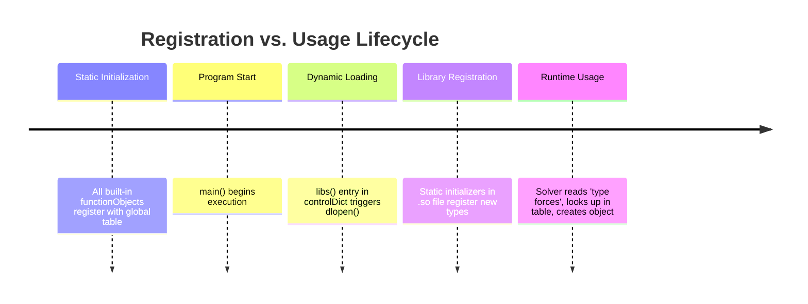

# 02 พิมพ์เขียว: Runtime Selection Tables ในฐานะทะเบียนส่วนขยาย

![[runtime_selection_table_map.png]]
`A clean scientific diagram illustrating the "Runtime Selection Table" as a central directory. Show a large "Global Selection Table" (Hash Table) in the center. On the left, show "Built-in Models" already registered. On the right, show a "Dynamic Library (.so)" being loaded and automatically adding its "Custom Model" into the table. Use a minimalist palette with black lines and clear arrows, scientific textbook diagram, clean vector line art, white background, high definition, flat design, educational infographic --ar 16:9`

**สถาปัตยกรรมของ OpenFOAM ใช้ "ตารางการเลือก" (Selection Tables)** เพื่อทำหน้าที่เป็นสารบัญหรือทะเบียนที่ระบุว่ามี "แอป" หรือ "ส่วนขยาย" อะไรบ้างที่ระบบสามารถเรียกใช้งานได้:

---

## ภาพรวม

Runtime Selection Tables เป็นกลไกหัวใจสำคัญที่ทำให้ OpenFOAM เป็น **แพลตฟอร์มฟิสิกส์เชิงคำนวณ** ที่สามารถขยายได้ ไม่ใช่แค่โปรแกรม CFD แบบคงที่ กลไกนี้ทำหน้าที่เหมือน **"ร้านแอปสำหรับ CFD"** ที่:

*   **ตารางการเลือกขณะทำงาน** = แค็ตตาล็อกร้านแอป (รายการ functionObjects ทั้งหมดที่มี)
*   **การโหลดไลบรารีไดนามิก** = การติดตั้งแอป (dlopen โหลดไฟล์ .so)
*   **การกำหนดค่าพจนานุกรม** = การตั้งค่าแอป (ผู้ใช้กำหนดค่าแต่ละ functionObject)
*   **การผสานรวมวงรอบเวลา** = การดำเนินการแอป (functionObjects ทำงานในเวลาที่ระบุ)

### ทำไมต้องใช้ Runtime Selection Tables แทน Hardcoded Factories?

การเลือกระหว่าง static factory methods และ runtime selection tables เป็นการตัดสินใจทางสถาปัตยกรรมขั้นพื้นฐานที่ส่งผลต่อการบำรุงรักษา การขยายตัว และขั้นตอนการพัฒนา นักออกแบบ OpenFOAM ตั้งใจปฏิเสธแนวทาง hardcoded factory แม้จะดูเหมือนง่ายกว่า

**แนวทาง Hardcoded Factory (สิ่งที่ OpenFOAM ปฏิเสธ)**:
```cpp
// ❌ Inflexible factory - adding new types requires source code modification
autoPtr<functionObject> createFunctionObject(const word& type)
{
    if (type == "forces") return new forces(...);
    else if (type == "probes") return new probes(...);
    else if (type == "fieldAverage") return new fieldAverage(...);
    else if (type == "wallShearStress") return new wallShearStress(...);
    else if (type == "courantNo") return new courantNo(...);
    else if (type == "yPlus") return new yPlus(...);
    // Adding new type? Must modify this function and recompile OpenFOAM
    else FatalError << "Unknown functionObject type: " << type << exit(FatalError);
}
```

<details>
<summary>📖 คำอธิบาย (Explanation)</summary>

**แนวทาง Hardcoded Factory** เป็นวิธีการสร้างออบเจกต์แบบดั้งเดิมที่มีข้อจำกัดทางสถาปัตยกรรมหลายประการ:

- **ความขึ้นต่อกันในการ compile**: functionObject ใหม่ทุกตัวต้องการการแก้ไข source code หลักของ OpenFOAM
- **ความสัมพันธ์แน่น**: factory ต้องรู้จักประเภทข้อมูลที่เป็นรูปธรรมทุกประเภทอย่างชัดเจน
- **ความไม่เข้ากันของ binary**: การเพิ่มประเภทใหม่บังคับให้ต้อง recompile ทั้ง framework
- **Plugin ที่เป็นไปไม่ได้**: external libraries ไม่สามารถลงทะเบียนประเภทใหม่แบบ dynamic ได้
- **ความเปราะบางของเวอร์ชัน**: การเปลี่ยนแปลง factory ทำลาย code ที่ขึ้นต่อกันทั้งหมด

นี่คือเหตุผลที่ OpenFOAM เลือกใช้ Runtime Selection Tables แทน
</details>

**Runtime Selection Tables (สิ่งที่ OpenFOAM เลือก)**:
```cpp
// ✅ Extensible registry - new types register themselves automatically
declareRunTimeSelectionTable
(
    autoPtr,                    // Return type: smart pointer for automatic memory management
    functionObject,             // Base class being extended
    dictionary,                 // Construction argument type identifier
    (const word& name, const Time& runTime, const dictionary& dict),  // Constructor signature
    (name, runTime, dict)       // Constructor parameter forwarding
);

// Macro expansion creates complex underlying structure:
// HashTable<dictionaryConstructorPtr, word> dictionaryConstructorTable;
// Where dictionaryConstructorPtr = autoPtr<functionObject>(*)(const word&, const Time&, const dictionary&)
//
// Additionally creates:
// - AddToDictionaryConstructorTable<Class> template class
// - Static initialization mechanism
// - Type-safe constructor forwarding
// - Automatic table population
```

<details>
<summary>📖 คำอธิบาย (Explanation)</summary>

**Runtime Selection Tables** สร้าง extension registry ที่ทรงพลังซึ่งทำงานผ่านการประสานงานระหว่าง compile-time และ runtime ที่ซับซ้อน:

- **compile-time**: Macro สร้างโครงสร้างข้อมูลและ accessor functions ที่จำเป็น
- **runtime**: Companion macros จัดการกระบวนการลงทะเบียนจริง

`declareRunTimeSelectionTable` macro สร้างพื้นฐานที่จำเป็นสำหรับระบบ plugin ทั้งหมด ทำให้สามารถเพิ่มประเภทใหม่ได้โดยไม่ต้องแก้ไข core code
</details>

กลไก runtime selection table สร้าง extension registry ที่ทรงพลังซึ่งทำงานผ่านการประสานงานระหว่าง compile-time และ runtime ที่ซับซ้อน `declareRunTimeSelectionTable` macro สร้างโครงสร้างข้อมูลและ accessor functions ที่จำเป็น ในขณะที่ companion macros จัดการกระบวนการลงทะเบียนจริง

---

## ประโยชน์ทางสถาปัตยกรรม

### 1. รองรับ Dynamic Library

Plugins สามารถลงทะเบียนตัวเองหลังจาก main executable โหลดแล้ว:

```cpp
// External libraries can extend OpenFOAM without recompilation:
void loadLibrary()
{
    // Library initialization happens automatically
    // addToRunTimeSelectionTable executes
    // New types are immediately available
    libFunctionObjects.so loads → CustomFunctionObjects auto-register
}
```

<details>
<summary>📖 คำอธิบาย (Explanation)</summary>

**Dynamic Library Support** เป็นประโยชน์หลักของ Runtime Selection Tables:

- **Decoupled Development**: พัฒนา functionObject ใหม่ใน project แยกได้
- **Zero Recompilation**: ไม่ต้อง recompile OpenFOAM core
- **Hot-Pluggable**: โหลด library ใหม่ขณะ runtime ได้
- **Binary Compatibility**: ใช้ library ที่ compile แยกกันได้

นี่คือพื้นฐานของสถาปัตยกรรม plugin ที่ทรงพลัง
</details>

### 2. การพัฒนาแบบ Decoupled

functionObjects ใหม่สามารถพัฒนาแยกจาก OpenFOAM หลัก:

```cpp
// Developer creates new functionObject in separate project:
class myCustomAnalysis : public functionObject
{
    // Implementation details
};

addToRunTimeSelectionTable(functionObject, myCustomAnalysis, dictionary);
// No need to modify OpenFOAM core!
}
```

<details>
<summary>📖 คำอธิบาย (Explanation)</summary>

**Decoupled Development** ช่วยให้:
- ทีมวิจัยสามารถพัฒนาโมเดลเฉพาะทางได้ independently
- ไม่ต้องแก้ไข OpenFOAM core code
- ลดความซับซ้อนในการจัดการ dependencies
- สามารถแชร์ functionObjects ผ่าน shared libraries ได้
</details>

### 3. Zero Coupling

OpenFOAM หลักไม่ขึ้นต่อกับประเภท functionObject ที่เป็นรูปธรรม:

```cpp
// Core system knows only abstract interface:
template<class Type>
class functionObjectList
{
    // No specific type dependencies
    // Works with any registered implementation
};
```

<details>
<summary>📖 คำอธิบาย (Explanation)</summary>

**Zero Coupling** คือหลักการสำคัญ:
- Core system รู้จักเฉพาะ abstract interface
- ไม่มีการอ้างอิงถึง concrete implementations
- ทำให้ระบบยืดหยุ่นและ maintainability สูง
- สอดคล้องกับ Dependency Inversion Principle
</details>

### 4. Lazy Loading

Libraries โหลดเมื่อจำเป็นเท่านั้น ลด memory footprint:

```cpp
// Memory-efficient loading pattern:
if (requiredFunction("customAnalysis"))
{
    // Load library only when actually needed
    libFunctionObjects.so loads at runtime
}
```

<details>
<summary>📖 คำอธิบาย (Explanation)</summary>

**Lazy Loading** ช่วยประหยัดทรัพยากร:
- Libraries โหลดเมื่อจำเป็นเท่านั้น
- ลด memory footprint ขณะ runtime
- ปรับปรุง startup time
- อนุญาตให้เลือก load features ที่ต้องการเท่านั้น
</details>

---

## กลไกการลงทะเบียน: Self-Registering Types

ความเยี่ยมของระบบ runtime selection ของ OpenFOAM อยู่ที่กลไกการลงทะเบียนอัตโนมัติ functionObject ที่เป็นรูปธรรมแต่ละตัวกลายเป็นหน่วยที่สมบูรณ์ซึ่งลงทะเบียนตัวเองกับ global registry โดยไม่ต้องการการแทรกแซงด้วยตนเอง

### การ Implement การลงทะเบียนอย่างสมบูรณ์

```cpp
// In forces.C (complete example):
#include "forces.H"

// 1. Define the concrete class metadata
defineTypeNameAndDebug(forces, 0);

// 2. Macro that adds class to runtime selection table
addToRunTimeSelectionTable
(
    functionObject,     // Base class being extended
    forces,             // Derived class being registered
    dictionary          // Construction signature variant
);

// Macro expansion creates:
/*
class AddToDictionaryConstructorTable_forces
{
public:
    AddToDictionaryConstructorTable_forces()
    {
        functionObject::dictionaryConstructorTable["forces"] =
            forces::NewDictionaryConstructor;
    }
};

static AddToDictionaryConstructorTable_forces
    AddToDictionaryConstructorTable_forces_instance;
*/
```

<details>
<summary>📖 คำอธิบาย (Explanation)</summary>

**Self-Registering Types** เป็นกลไกหัวใจของ Runtime Selection Tables:

- **Automatic Registration**: แต่ละ class ลงทะเบียนตัวเองโดยอัตโนมัติ
- **Static Initialization**: ใช้ static constructors เพื่อลงทะเบียนก่อน main()
- **Global Registry**: ทุก class ลงทะเบียนกับ global hash table เดียว
- **Zero Manual Configuration**: ไม่ต้องแก้ไข central registry code

Macro `addToRunTimeSelectionTable` สร้าง helper class ที่มี static constructor ซึ่ง execute อัตโนมัติระหว่าง program startup และ insert function pointer เข้าไปใน global table
</details>

### ลำดับเวลาการลงทะเบียน

กระบวนการลงทะเบียนเกิดขึ้นในลำดับที่กำหนดไว้อย่างชัดเจน:



> **Figure 1:** ลำดับเหตุการณ์ (Timeline) ของกระบวนการลงทะเบียนและเรียกใช้งานออบเจกต์ใน OpenFOAM เริ่มต้นจากการลงทะเบียนแบบสถิตเมื่อโปรแกรมเริ่มทำงาน ตามด้วยการโหลดไลบรารีเพิ่มเติมในระหว่างรันไทม์ และสิ้นสุดที่การนำออบเจกต์ไปใช้งานจริงเมื่อผู้ใช้เรียกผ่าน Dictionary

#### ระยะ Static Initialization (ก่อน `main()`)

*   Global static constructors execute
*   `AddToDictionaryConstructorTable_forces_instance` constructed
*   Static constructor เพิ่ม entry เข้า global hash table
*   functionObjects ที่มีอยู่ทั้งหมดลงทะเบียนตัวเอง

#### Dynamic Library Loading (runtime)

*   External libraries โหลดผ่าน `dlOpen()`
*   Library static initializers execute อัตโนมัติ
*   functionObjects ใหม่ลงทะเบียนตัวเอง
*   Registry ขยายตัวแบบ dynamic

#### Factory Method Execution (on demand)

*   User ร้องขอ functionObject ตามชื่อ
*   Registry lookup หา constructor ที่เหมาะสม
*   Constructor ถูกเรียกด้วย forwarded parameters
*   New instance ส่งกลับเป็น `autoPtr<functionObject>`

**ข้อมูลสำคัญ**: `addToRunTimeSelectionTable` macro สร้าง boilerplate code ที่ซับซ้อนซึ่งสร้าง static initialization object constructor ของ object นี้ execute อัตโนมัติระหว่าง program startup โดยแทรก function pointer เข้าไปใน global registry สิ่งนี้สร้าง "app store" model ที่ functionObjects ใหม่เพียงแค่เพิ่มตัวเองเข้าไปใน catalog โดยไม่ต้องการการประสานงานกลาง

### รองรับ Constructor Signature หลายแบบ

OpenFOAM รองรับรูปแบบการสร้างต่างกันผ่าน tables แยกกัน:

```cpp
// Different constructor patterns for different use cases:
declareRunTimeSelectionTable(autoPtr, functionObject, dictionary);      // Dictionary-based
declareRunTimeSelectionTable(autoPtr, functionObject, dictionaryMesh);  // Dictionary + Mesh
declareRunTimeSelectionTable(autoPtr, functionObject, dictionaryIO);    // Dictionary + I/O
declareRunTimeSelectionTable(autoPtr, functionObject, dictionaryName);  // Dictionary + Name

// Registration for each variant:
addToRunTimeSelectionTable(functionObject, forces, dictionary);
addToRunTimeSelectionTable(functionObject, customMeshBased, dictionaryMesh);
```

<details>
<summary>📖 คำอธิบาย (Explanation)</summary>

**Multiple Constructor Signatures** ช่วยให้:
- functionObjects เลือกรูปแบบ constructor ที่เหมาะสม
- รองรับ use cases ที่หลากหลาย
- รักษากลไกการลงทะเบียนเดิม
- ทำให้ API ยืดหยุ่นและ reusable

ความยืดหยุ่นนี้อนุญาตให้ functionObjects เลือกรูปแบบ constructor ที่เหมาะสมที่สุดในขณะที่รักษากลไกการลงทะเบียนเดิม
</details>

---

## รูปแบบการออกแบบทางสถาปัตยกรรม

### Factory Method + Registry = สถาปัตยกรรมปลั๊กอิน

Runtime Selection Tables ใน OpenFOAM เป็นการผสมผสานระหว่าง **Factory Method Pattern** และ **Registry Pattern** เพื่อสร้างระบบปลั๊กอินที่ทรงพลัง

**ปัญหา**: โปรแกรมแก้ปัญหา CFD จะสร้างออบเจกต์ของประเภทที่ไม่รู้จักซึ่งระบุไว้ในขณะทำงานได้อย่างไร เมื่อประเภทเหล่านั้นอาจไม่มีอยู่ในระหว่างการคอมไพล์

**วิธีแก้ปัญหา**: รวมรูปแบบ Factory Method เข้ากับระบบรีจิสทรีขณะทำงานเพื่อให้การสร้างออบเจกต์แบบไดนามิกโดยไม่มีการพึ่งพาระหว่างคอมไพล์

```cpp
// Complete implementation of Factory Method + Registry
template<class Type>
class FactoryRegistry
{
public:
    // Factory Method - creates objects without knowing concrete types
    static autoPtr<Type> create(const word& typeName, const dictionary& dict)
    {
        // Runtime registry lookup
        typename ConstructorTable::iterator cstrIter =
            ConstructorTablePtr_->find(typeName);

        if (cstrIter == ConstructorTablePtr_->end())
        {
            FatalErrorInFunction
                << "Unknown " << Type::typeName << " type "
                << typeName << nl << nl
                << "Valid " << Type::typeName << " types are:" << nl
                << ConstructorTablePtr_->sortedToc()
                << exit(FatalError);
        }

        return cstrIter()(dict);  // Delegate to registered creator
    }

    // Registry Pattern - automatic registration mechanism
    static void addConstructorToTable
    (
        const word& typeName,
        typename Type::constructorTable::functionPointer constructor
    )
    {
        ConstructorTablePtr_->insert(typeName, constructor);
    }

private:
    // Runtime registry storing creator functions
    static typename Type::constructorTable* ConstructorTablePtr_;
};

// Automatic registration macro used throughout OpenFOAM
#define addToRunTimeSelectionTable(Type, baseType, argNames) \
    baseType::add##argNames##ConstructorToTable< Type > \
    (#Type, Type::New)
```

<details>
<summary>📖 คำอธิบาย (Explanation)</summary>

**Factory Method + Registry Pattern** สร้างสถาปัตยกรรม plugin:

**Factory Method Pattern**:
- สร้างออบเจกต์โดยไม่ต้องรู้ concrete types
- Delegates การสร้างไปยัง registered creators
- รองรับ late binding

**Registry Pattern**:
- เก็บ creator functions ไว้ใน central registry
- อนุญาตให้ register/unregister dynamically
- เป็นฐานข้อมูลของ available types

**ประโยชน์ทางสถาปัตยกรรมในบริบท CFD**:
1. **Late Binding**: โปรแกรมแก้ปัญหาสามารถค้นพบและใช้โมเดลที่พัฒนาภายหลังได้
2. **การแยกส่วน**: อัลกอริทึม CFD แกนกลางยังคงเป็นอิสระ
3. **ความสามารถในการขยาย**: กลุ่มวิจัยสามารถพัฒนาโมเดลที่กำหนดเองได้
</details>

---

## การโหลดไลบรารีไดนามิก (dlopen)

### ไปป์ไลน์การโหลดไลบรารีไดนามิก

เมื่อ OpenFOAM พบรายการ `libs` ในพจนานุกรม functionObject ระบบจะเริ่มกระบวนการโหลดไลบรารีไดนามิกที่ซับซ้อน ซึ่งเป็นพื้นฐานของสถาปัตยกรรมปลั๊กอินของมัน

```cpp
// Simplified view of dlLibraryTable::open() from functionObject::New():
bool dlLibraryTable::open
(
    const dictionary& dict,
    const word& libsEntry,
    const HashTable<dictionaryConstructorPtr, word>*& tablePtr
)
{
    // 1. Extract library names from dictionary
    wordList libNames(dict.lookup(libsEntry));

    forAll(libNames, i)
    {
        // 2. Call POSIX dlopen() to load shared library
        void* handle = ::dlopen(libNames[i].c_str(), RTLD_LAZY | RTLD_GLOBAL);

        // 3. Library static initializers execute automatically
        //    - This runs the addToRunTimeSelectionTable macro
        //    - New functionObject types register with global table

        // 4. Update constructor table pointer
        tablePtr = dictionaryConstructorTablePtr_;
    }

    return true;
}
```

<details>
<summary>📖 คำอธิบาย (Explanation)</summary>

**Dynamic Library Loading Pipeline**:

**อุปลักษณ์**: ทำงานเหมือนกับ **การติดตั้งปลั๊กอิน** ในระบบซอฟต์แวร์สมัยใหม่:
1. **`dlopen("libforces.so")`** = ใส่แคทริดจ์แอปลงในโทรศัพท์
2. **ตัวเริ่มต้นสแตติกทำงาน** = แอปลงทะเบียนตัวเองกับระบบปฏิบัติการ
3. **ตารางคอนสตรัคเตอร์อัปเดต** = แอปปรากฏในลิ้นชักแอปพร้อมใช้งาน

**ขั้นตอนสำคัญ**:
1. **Parsing**: อ่านชื่อ libraries จาก dictionary
2. **Loading**: เรียก dlopen() เพื่อโหลด .so files
3. **Registration**: Static initializers ลงทะเบียน types ใหม่
4. **Update**: Update constructor table pointers
</details>

### การจัดการหน่วยความจำและการแก้ไขสัญลักษณ์

การโหลดไดนามิกของ OpenFOAM ต้องจัดการกับฟีเจอร์ภาษา C++ ที่ซับซ้อน:

```cpp
// Challenges with C++ dynamic libraries:
// 1. Name mangling: C++ symbols have name decoration (e.g., _ZN4Foam7forcesC1E...)
// 2. Static data: Each library has its own static variables
// 3. Exception handling: C++ exceptions must cross library boundaries
// 4. Type information: RTTI must work across libraries

// OpenFOAM's solution: Use system dlopen with careful design
void* handle = ::dlopen(libName.c_str(), RTLD_LAZY | RTLD_GLOBAL);
// RTLD_GLOBAL is crucial for:
// - Type consistency: typeid() works across libraries
// - Exception handling: catch blocks can catch plugin exceptions
// - Template instantiation: templates work across library boundaries
```

<details>
<summary>📖 คำอธิบาย (Explanation)</summary>

**Memory Management & Symbol Resolution**:

**ความท้าทายกับ C++ Dynamic Libraries**:
- **Name Mangling**: สัญลักษณ์ C++ ถูกแปลงชื่อ
- **Static Data**: แต่ละไลบรารีมีตัวแปรสแตติกของตัวเอง
- **Exception Handling**: ข้อยกเว้นต้องสามารถส่งผ่านขอบเขตไลบรารี
- **Type Information**: RTTI ต้องทำงานข้ามไลบรารี

**Flags ที่สำคัญ**:
- **RTLD_LAZY**: ชะลอการแก้ไขสัญลักษณ์ ปรับปรุงประสิทธิภาพ
- **RTLD_GLOBAL**: ทำให้สัญลักษณ์พร้อมใช้งานสำหรับไลบรารีถัดไป

RTLD_GLOBAL มีความสำคัญกับ:
- ความสม่ำเสมอของประเภท: typeid() ทำงานข้ามไลบรารี
- การจัดการข้อยกเว้น: บล็อก catch สามารถจับข้อยกเว้นจากปลั๊กอิน
- การสร้างอินสแตนซ์เทมเพลต: เทมเพลตทำงานข้ามขอบเขตไลบรารี
</details>

### รายละเอียดกลไกการลงทะเบียน

เมื่อไลบรารีถูกโหลดสำเร็จ โค้ดการเริ่มต้นสแตติกจะทำงานโดยอัตโนมัติ นี่คือจุดที่ความมหัศจรรย์ของความสามารถในการขยายรันไทม์ของ OpenFOAM เกิดขึ้น:

```cpp
// In library source file (e.g., forces.C):
addToRunTimeSelectionTable
(
    functionObject,
    forces,
    dictionary
);

// This macro expands to include code such as:
namespace Foam
{
    // Static constructor object
    functionObject::dictionaryConstructorTableEntry
    forces_addToRunTimeSelectionTable_functionObject_dictionaryPtr
    (
        "forces",
        forces::New
    );
}
```

<details>
<summary>📖 คำอธิบาย (Explanation)</summary>

**Registration Mechanism Details**:

Macro สร้าง static object ที่:
1. ถูกสร้างขณะ library initialization
2. ลงทะเบียน constructor ใน `dictionaryConstructorTable_` โกลบอล
3. ทำให้ functionObject ใหม่พร้อมใช้งานทันที

นี่คือจุดที่ความมหัศจรรย์ของ runtime extensibility ของ OpenFOAM เกิดขึ้น!
</details>

---

## การบูรณาการกับ Loop การคำนวณของ Solver

### รูปแบบการบูรณาการกับ Loop ของเวลา

Solver ของ OpenFOAM ทำตามรูปแบบมาตรฐานที่บูรณาการ functionObjects เข้ากับขั้นตอนการคำนวณโดยอัตโนมัติ การบูรณาการนี้เกิดขึ้นที่จุดที่กำหนดไว้ล่วงหน้าภายใน loop ของเวลาของ solver

```cpp
// Typical solver time loop (simplified):
while (runTime.loop())
{
    // 1. Execute functionObjects (before solving equations)
    functionObjectList::execute();

    // 2. Solve physics equations
    solveMomentum();
    solvePressure();
    solveTransport();

    // 3. Write functionObjects (after solving equations)
    functionObjectList::write();

    // 4. Write fields (if necessary)
    if (runTime.writeTime()) runTime.write();
}
```

<details>
<summary>📖 คำอธิบาย (Explanation)</summary>

**Time Loop Integration Pattern**:

การออกแบบนี้เป็นการนำ **Observer Pattern** มาประยุกต์ใช้:
- **Subject** = Time loop (แจ้ง observers ที่แต่ละรอบ)
- **Observers** = functionObjects (ตอบสนองต่อการเดินหน้าของเวลา)
- **Notification** = การเรียก `execute()` และ `write()`

**จุดที่เรียกใช้**:
1. **execute()**: ก่อนการแก้สมการ (pre-processing)
2. **write()**: หลังการแก้สมการ (post-processing)
</details>

### FunctionObjectList: ตัวจัดการ Observer

คลาส `functionObjectList` ทำหน้าที่เป็นผู้ประสานงานกลางสำหรับ functionObjects ที่ใช้งานอยู่ทั้งหมดภายในการจำลอง

```cpp
class functionObjectList
{
private:
    // List of functionObjects (observers)
    PtrList<functionObject> functions_;

    // Timing control for each functionObject
    PtrList<timeControl> timeControls_;

public:
    // Execute all functionObjects (if their timing controls say they should)
    bool execute()
    {
        forAll(functions_, i)
        {
            if (timeControls_[i].execute())
            {
                functions_[i].execute();  // Observer notification
            }
        }
        return true;
    }

    // Similar for write()
};
```

<details>
<summary>📖 คำอธิบาย (Explanation)</summary>

**FunctionObjectList as Observer Manager**:

**หน้าที่**:
- เก็บรายการ functionObjects ทั้งหมด
- จัดการ timing control สำหรับแต่ละ functionObject
- แจ้ง observers เมื่อถึงเวลาที่เหมาะสม
- เป็น coordinator ระหว่าง time loop และ functionObjects

**การทำงาน**:
- execute() เรียก functionObjects ก่อน solving
- write() เรียก functionObjects หลัง solving
- ควบคุม execution frequency ผ่าน timeControl
</details>

### Strategy Pattern: อัลกอริทึมแบบ Polymorphic

แต่ละ functionObject ใช้งาน **strategy** เฉพาะสำหรับการประมวลผลข้อมูล ตามรูปแบบการออกแบบ Strategy:

```cpp
class functionObject  // Strategy interface
{
public:
    virtual bool execute() = 0;  // Algorithm step 1
    virtual bool write() = 0;    // Algorithm step 2
};

class forces : public functionObject  // Concrete strategy
{
public:
    virtual bool execute() override
    {
        // Calculate forces using current flow field
        force_ = sum(patchPressure * patchArea);
        torque_ = sum(r × (patchPressure * patchArea));
        return true;
    }
};
```

<details>
<summary>📖 คำอธิบาย (Explanation)</summary>

**Strategy Pattern Implementation**:

**Strategy Interface** (functionObject):
- กำหนด contract สำหรับ algorithms
- ประกอบด้วย execute() และ write()
- เป็น abstract base class

**Concrete Strategies** (forces, probes, etc.):
- ทำให้ algorithms เฉพาะ
- สามารถแทนที่กันได้
- แต่ละตัวมี implementation เฉพาะของตัวเอง

**ประโยชน์**:
- แยก algorithms จาก client code
- อนุญาตให้เลือก algorithms ขณะ runtime
- ทำให้ algorithms ใหม่ง่ายขึ้น
</details>

---

## สรุปปรัชญาการออกแบบ

Runtime Selection Tables ใน OpenFOAM แสดงให้เห็นถึง **หลักการเปิด-ปิด (Open-Closed Principle)**: ระบบ **เปิดสำหรับการขยาย** (สามารถเพิ่ม functionObject ใหม่ได้โดยไม่ต้องแก้ไขโค้ดที่มีอยู่) แต่ **ปิดสำหรับการแก้ไข** (ตรรกะหลักของ solver ยังคงไม่เปลี่ยนแปลง)

สถาปัตยกรรมนี้ใช้ **การกลับด้านการพึ่งพา (Dependency Inversion Principle)** ผ่านส่วนติดต่อนามธรรม ซึ่งทางคณิตศาสตร์สร้างระบบที่ไม่มีการ coupling:

$$\text{Solver} \rightarrow \text{functionObject Interface} \leftarrow \text{Specific Implementation}$$

ผลลัพธ์คือแพลตฟอร์ม CFD ที่สามารถพัฒนาจากโปรแกรมแก้ปัญหาการไหลแบบลามินาร์ที่ง่ายไปสู่ระบบหลายฟิสิกส์ที่ซับซ้อนผ่านรูปแบบสถาปัตยกรรมที่ยอมรับความสามารถในการขยายมากกว่าการจำกัด