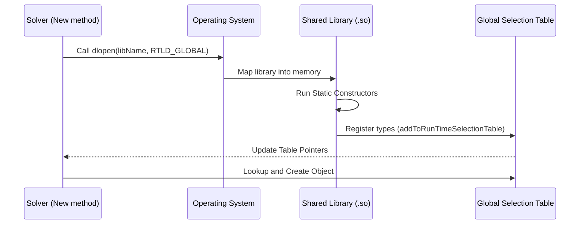

# 03 กลไกภายใน: การโหลดไลบรารีแบบไดนามิก (dlopen)

![[dynamic_library_loading.png]]
`A clean scientific illustration of "Dynamic Library Loading". Show a running "Solver" process in memory. On the side, show a "Shared Library (.so)" file. Show an arrow labeled "dlopen()" pulling the library into the process's address space. Show "Static Initializers" inside the library lighting up and connecting to the Solver's "Selection Table". Use a minimalist palette, scientific textbook diagram, clean vector line art, white background, high definition, flat design, educational infographic --ar 16:9`

เบื้องหลังการทำงานที่ดูเหมือนเวทมนตร์ คือกลไกของระบบปฏิบัติการที่ OpenFOAM นำมาใช้เพื่อโหลดโค้ดใหม่เข้าไปในโปรแกรมที่กำลังทำงานอยู่

## ไปป์ไลน์การโหลดไลบรารีไดนามิก


> **Figure 1:** แผนผังลำดับขั้นตอน (Sequence Diagram) ของการโหลดไลบรารีแบบไดนามิก โดย Solver จะขอให้ระบบปฏิบัติการโหลดไฟล์ไลบรารีเข้าไปในหน่วยความจำ ซึ่งจะไปกระตุ้นให้โค้ดส่วนการลงทะเบียนทำงานอัตโนมัติเพื่อเพิ่มโมเดลใหม่เข้าไปในตารางส่วนกลาง ทำให้ Solver สามารถเรียกใช้งานโมเดลเหล่านั้นได้ทันที

เมื่อ OpenFOAM พบรายการ `libs` ในพจนานุกรม functionObject ระบบจะเริ่มกระบวนการโหลดไลบรารีไดนามิกที่ซับซ้อน ซึ่งเป็นพื้นฐานของสถาปัตยกรรมปลั๊กอินของมัน กระบวนการนี้ซึ่งจัดการโดยเมธอด `dlLibraryTable::open()` จาก `functionObject::New()` แสดงให้เห็นว่า OpenFOAM บรรลุความยืดหยุ่นในรันไทม์ผ่านการโหลดไลบรารีไดนามิก POSIX

```cpp
// Simplified view of dlLibraryTable::open() from functionObject::New():
// มุมมองแบบย่อของ dlLibraryTable::open() จาก functionObject::New():
bool dlLibraryTable::open
(
    const dictionary& dict,
    const word& libsEntry,
    const HashTable<dictionaryConstructorPtr, word>*& tablePtr
)
{
    // 1. Extract library names from dictionary
    // 1. แยกชื่อไลบรารีจากพจนานุกรม
    wordList libNames(dict.lookup(libsEntry));

    // Iterate through all specified libraries
    // วนลูปผ่านไลบรารีทั้งหมดที่ระบุ
    forAll(libNames, i)
    {
        // 2. Call POSIX dlopen() to load shared library
        // 2. เรียก POSIX dlopen() เพื่อโหลดไลบรารีแชร์
        // RTLD_LAZY: Defer symbol resolution until first reference
        // RTLD_GLOBAL: Make symbols available to subsequently loaded libraries
        void* handle = ::dlopen(libNames[i].c_str(), RTLD_LAZY | RTLD_GLOBAL);

        // 3. Library's static constructors run automatically
        //    - This executes the addToRunTimeSelectionTable macro
        //    - functionObject types register themselves in the global table
        // 3. ตัวเริ่มต้นสแตติกของไลบรารีทำงานอัตโนมัติ
        //    - นี่คือการรันมาโคร addToRunTimeSelectionTable
        //    - ประเภท functionObject ลงทะเบียนในตารางโกลบอล

        // 4. Update constructor table pointers
        // 4. อัปเดตพอยเตอร์ตารางคอนสตรัคเตอร์
        tablePtr = dictionaryConstructorTablePtr_;
    }

    return true;
}
```

**📚 คำอธิบาย (Explanation):**
เมธอด `dlLibraryTable::open()` เป็นหัวใจสำคัญของระบบโหลดไลบรารีแบบไดนามิกของ OpenFOAM กระบวนการนี้เริ่มต้นด้วยการอ่านรายการชื่อไลบรารีจากพจนานุกรม จากนั้นวนลูปผ่านแต่ละไลบรารีและเรียกใช้ฟังก์ชัน `dlopen()` ของระบบปฏิบัติการ

แฟล็ก `RTLD_LAZY` ช่วยให้การแก้ไขสัญลักษณ์ถูกเลื่อนออกไปจนกว่าจะมีการอ้างอิงจริง ซึ่งช่วยปรับปรุงประสิทธิภาพการเริ่มต้น ส่วนแฟล็ก `RTLD_GLOBAL` ทำให้สัญลักษณ์ทั้งหมดในไลบรารีพร้อมใช้งานสำหรับไลบรารีอื่นที่โหลดภายหลัง ซึ่งสำคัญมากสำหรับความสม่ำเสมอของข้อมูลประเภท

จุดสำคัญที่สุดคือเมื่อไลบรารีถูกโหลด ตัวสร้างสแตติก (static constructors) จะทำงานโดยอัตโนมัติ ซึ่งรวมถึงมาโคร `addToRunTimeSelectionTable` ที่จะลงทะเบียน function object ใหม่เข้าไปในตารางส่วนกลางโดยอัตโนมัติ

**🔑 แนวคิดสำคัญ (Key Concepts):**
- **POSIX dlopen()**: ฟังก์ชันระบบปฏิบัติการสำหรับโหลดไลบรารีแบบไดนามิกขณะรันไทม์
- **RTLD_LAZY**: แฟล็กที่เลื่อนการแก้ไขสัญลักษณ์จนกว่าจะถูกอ้างอิงจริง
- **RTLD_GLOBAL**: แฟล็กที่ทำให้สัญลักษณ์พร้อมใช้งานสำหรับไลบรารีที่โหลดตามมา
- **Static Constructors**: โค้ดที่ทำงานโดยอัตโนมัติเมื่อไลบรารีถูกโหลด
- **Automatic Registration**: กลไกที่ทำให้ function object ลงทะเบียนตัวเองโดยอัตโนมัติ

**📂 ตำแหน่งไฟล์ต้นฉบับ (Source):**
- `src/OpenFOAM/db/dlLibraryTable/dlLibraryTable.C`

**อุปลักษณ์ทางฟิสิกส์**: กลไกนี้ทำงานเหมือนกับ **การติดตั้งปลั๊กอิน** ในระบบซอฟต์แวร์สมัยใหม่:
1. **`dlopen("libforces.so")`** = ใส่แคทริดจ์แอปลงในโทรศัพท์
2. **ตัวเริ่มต้นสแตติกทำงาน** = แอปลงทะเบียนตัวเองกับระบบปฏิบัติการ
3. **ตารางคอนสตรัคเตอร์อัปเดต** = แอปปรากฏในลิ้นชักแอปพร้อมใช้งาน

กระบวนการเริ่มต้นด้วยการแยกรายการชื่อไลบรารีจากพจนานุกรมโดยใช้เมธอด `dict.lookup()` ของ OpenFOAM ซึ่งดึงข้อมูล `wordList` ที่มีชื่อไลบรารีที่จะโหลด สำหรับแต่ละชื่อไลบรารี ระบบจะเรียกฟังก์ชัน POSIX `dlopen()` ด้วยแฟล็กเฉพาะที่กำหนดว่าไลบรารีจะถูกโหลดและเชื่อมโยงอย่างไร

## การจัดการหน่วยความจำและการแก้ไขสัญลักษณ์

การโหลดไดนามิกของ OpenFOAM ต้องจัดการกับฟีเจอร์ภาษา C++ ที่ซับซ้อนซึ่งเป็นความท้าทายที่สำคัญสำหรับระบบการโหลดในรันไทม์ การใช้งานนี้แก้ไขปัญหาเหล่านี้ผ่านการออกแบบที่รอบคอบและการกำหนดค่าระดับระบบที่เหมาะสม

```cpp
// Challenges with C++ dynamic libraries:
// ความท้าทายกับไลบรารีไดนามิก C++:
// 1. Name mangling: C++ symbols have encoded names (e.g., _ZN4Foam7forcesC1E...)
// 1. Name mangling: สัญลักษณ์ C++ ถูกแปลงชื่อ (เช่น _ZN4Foam7forcesC1E...)
// 2. Static data: Each library has its own copy of static variables
// 2. ข้อมูลสแตติก: แต่ละไลบรารีมีตัวแปรสแตติกของตัวเอง
// 3. Exception handling: C++ exceptions must be able to cross library boundaries
// 3. การจัดการข้อยกเว้น: ข้อยกเว้น C++ ต้องสามารถส่งผ่านขอบเขตไลบรารี
// 4. Type information: RTTI must work across libraries
// 4. ข้อมูลประเภท: RTTI ต้องทำงานข้ามไลบรารี

// OpenFOAM's solution: Use system dlopen with careful design
// โซลูชันของ OpenFOAM: ใช้ dlopen ของระบบพร้อมการออกแบบที่รอบคอบ
void* handle = ::dlopen(libName.c_str(), RTLD_LAZY | RTLD_GLOBAL);

// RTLD_GLOBAL is critical for:
// RTLD_GLOBAL มีความสำคัญกับ:
// - Type consistency: typeid() works across libraries
// - ความสม่ำเสมอของประเภท: typeid() ทำงานข้ามไลบรารี
// - Exception handling: catch blocks can catch exceptions from plugins
// - การจัดการข้อยกเว้น: บล็อก catch สามารถจับข้อยกเว้นจากปลั๊กอิน
// - Template instantiation: templates work across library boundaries
// - การสร้างอินสแตนซ์เทมเพลต: เทมเพลตทำงานข้ามขอบเขตไลบรารี

// Error handling
// การจัดการข้อผิดพลาด
if (!handle)
{
    FatalErrorInFunction
        << "Cannot open library " << libName << nl
        << "System error: " << ::dlerror() << exit(FatalError);
}
```

**📚 คำอธิบาย (Explanation):**
การโหลดไลบรารีแบบไดนามิกใน C++ มีความท้าทายหลายประการที่ไม่พบในภาษาอื่น ปัญหาแรกคือ **Name mangling** ซึ่งคอมไพเลอร์ C++ แปลงชื่อฟังก์ชันให้รวมข้อมูลประเภท เนมสเปซ และพารามิเตอร์ เพื่อสนับสนุนฟีเจอร์เช่น function overloading

ปัญหาที่สองคือ **Static data** แต่ละไลบรารีมีสำเนาของตัวแปรสแตติกของตัวเอง ซึ่งอาจนำไปสู่พฤติกรรมที่ไม่คาดคิดถ้าไม่ได้ออกแบบมาอย่างรอบคอบ

ปัญหาที่สามและสี่คือ **Exception handling และ RTTI** ซึ่งต้องทำงานข้ามขอบเขตไลบรารี แฟล็ก `RTLD_GLOBAL` มีบทบาทสำคัญในการแก้ปัญหานี้โดยทำให้สัญลักษณ์ทั้งหมดรวมอยู่ในเนมสเปซส่วนกลางเดียว ช่วยให้ข้อมูลประเภทสม่ำเสมอกัน

การจัดการข้อผิดพลาดใช้ `FatalErrorInFunction` เพื่อรายงานข้อผิดพลาดอย่างละเอียด รวมถึงชื่อไลบรารีและข้อความผิดพลาดจากระบบ (`dlerror()`)

**🔑 แนวคิดสำคัญ (Key Concepts):**
- **Name Mangling**: กระบวนการแปลงชื่อสัญลักษณ์ C++ ให้รวมข้อมูลประเภท
- **RTLD_GLOBAL**: แฟล็กที่สำคัญสำหรับความสม่ำเสมอของประเภทและการจัดการข้อยกเว้น
- **RTTI (Run-Time Type Information)**: ระบบข้อมูลประเภทขณะรันไทม์ของ C++
- **Exception Safety**: ความสามารถในการส่งและจับข้อยกเว้นข้ามขอบเขตไลบรารี
- **FatalErrorInFunction**: แมโครรายงานข้อผิดพลาดของ OpenFOAM

**📂 ตำแหน่งไฟล์ต้นฉบับ (Source):**
- `src/OpenFOAM/db/dlLibraryTable/dlLibraryTable.C`
- `src/OpenFOAM/db/error/error.C`

กระบวนการโหลดใช้แฟล็กที่สำคัญสองประการ:

- **`RTLD_LAZY`**: ชะลอการแก้ไขสัญลักษณ์จนกว่าสัญลักษณ์จะถูกอ้างอิงจริง ช่วยปรับปรุงประสิทธิภาพการเริ่มต้นและลดความเสี่ยงของการพึ่งพาระหว่างไลบรารีแบบวงจร

- **`RTLD_GLOBAL`**: ทำให้สัญลักษณ์พร้อมใช้งานสำหรับไลบรารีที่โหลดตามมา ช่วยให้มั่นใจได้ว่า **การรักษาเอกลักษณ์ประเภท** ข้ามขอบเขตไลบรารี ซึ่งหมายความว่า `typeid(forces)` จะส่งคืนออบเจกต์ `std::type_info` เดียวกันไม่ว่าประเภทจะถูกกำหนดในโปรแกรมหลักหรือไลบรารีที่โหลดแบบไดนามิก ช่วยให้การดำเนินการ `dynamic_cast` ที่ปลอดภัยข้ามขอบเขตไลบรารี

**ฟีเจอร์ความปลอดภัย**: การใช้ `RTLD_GLOBAL` เป็นสิ่งที่สำคัญอย่างยิ่งสำหรับแอปพลิเคชัน C++ เนื่องจากมันช่วยให้มั่นใจได้ว่าข้อมูลประเภทสม่ำเสมอกันทั่วทุกไลบรารีที่โหลด หากไม่มีแฟล็กนี้ การพยายามจับข้อยกเว้นหรือใช้ RTTI ข้ามขอบเขตไลบรารีจะส่งผลให้เกิดพฤติกรรมที่ไม่กำหนดเนื่องจากข้อมูลประเภทไม่ตรงกัน

การจัดการข้อผิดพลาดแสดงให้เห็นถึงแนวทางของ OpenFOAM ในการตรวจจับความล้มเหลวอย่างสง่างาม โดยให้ข้อมูลวินิจฉัยโดยละเอียดรวมถึงทั้งชื่อไลบรารีและข้อผิดพลาดของระบบจาก `dlerror()` ซึ่งช่วยให้นักพัฒนาสามารถระบุและแก้ไขปัญหาการโหลดไลบรารีได้อย่างรวดเร็ว ซึ่งโดยทั่วไปจะรวมถึงการขาดการพึ่งพา พาธไลบรารีที่ไม่ถูกต้อง หรือการไม่ตรงกันของเวอร์ชัน

## รายละเอียดกลไกการลงทะเบียน

เมื่อไลบรารีถูกโหลดสำเร็จ โค้ดการเริ่มต้นสแตติกจะทำงานโดยอัตโนมัติ นี่คือจุดที่ความมหัศจรรย์ของความสามารถในการขยายรันไทม์ของ OpenFOAM เกิดขึ้นผ่านมาโคร `addToRunTimeSelectionTable`:

```cpp
// In the library source file (e.g., forces.C):
// ในไฟล์ซอร์สของไลบรารี (เช่น forces.C):
addToRunTimeSelectionTable
(
    functionObject,
    forces,
    dictionary
);

// This macro expands to include code such as:
// มาโครนี้ขยายเพื่อรวมโค้ดเช่น:
namespace Foam
{
    // Static constructor object
    // ออบเจกต์คอนสตรัคเตอร์สแตติก
    functionObject::dictionaryConstructorTableEntry
    forces_addToRunTimeSelectionTable_functionObject_dictionaryPtr
    (
        "forces",
        forces::New
    );
}
```

**📚 คำอธิบาย (Explanation):**
มาโคร `addToRunTimeSelectionTable` เป็นหัวใจของระบบการลงทะเบียนแบบอัตโนมัติของ OpenFOAM มาโครนี้สร้างออบเจกต์สแตติกที่มีชื่อเฉพาะและไม่ซ้ำกัน ซึ่งทำหน้าที่ลงทะเบียนคอนสตรัคเตอร์ของ function object ในตารางส่วนกลาง

เมื่อไลบรารีถูกโหลดผ่าน `dlopen()` ออบเจกต์สแตติกนี้จะถูกสร้างขึ้นโดยอัตโนมัติกก่อนที่โค้ดอื่นๆ ในไลบรารีจะทำงาน กระบวนการนี้เรียกว่า **static initialization** และเป็นส่วนหนึ่งของมาตรฐาน C++

ออบเจกต์สแตติกที่ถูกสร้างขึ้นจะเพิ่ม entry ใหม่เข้าไปใน `dictionaryConstructorTable_` ซึ่งเป็น HashTable โกลบอลที่เก็บพอยเตอร์ไปยังฟังก์ชันคอนสตรัคเตอร์ ชื่อของ function object ("forces") ถูกใช้เป็นคีย์ ในขณะที่พอยเตอร์ฟังก์ชัน `forces::New` ถูกใช้เป็นค่า

รูปแบบการออกแบบนี้ช่วยให้สามารถทำงานได้หลายอย่าง:

1. **ความสามารถในการขยายโดยไม่ต้องกำหนดค่า**: function object ใหม่สามารถเพิ่มได้ง่ายๆ เพียงแค่คอมไพล์ไลบรารีแชร์พร้อมมาโครการลงทะเบียน
2. **การค้นพบรันไทม์**: function object พร้อมใช้งานโดยอัตโนมัติโดยไม่ต้องมีโค้ดการลงทะเบียนอย่างชัดเจน
3. **การจัดระเบียบลำดับชั้น**: ตารางการลงทะเบียนรักษาการแยกส่วนที่สะอาดระหว่างประเภท function object ที่แตกต่างกัน
4. **ความปลอดภัยของหน่วยความจำ**: ตารางคอนสตรัคเตอร์ใช้พอยเตอร์นับอ้างอิงเพื่อป้องกันการรั่วไหลของหน่วยความจำ

**🔑 แนวคิดสำคัญ (Key Concepts):**
- **Static Initialization**: กระบวนการสร้างออบเจกต์สแตติกโดยอัตโนมัติเมื่อโหลดไลบรารี
- **addToRunTimeSelectionTable**: มาโครลงทะเบียนประเภทอัตโนมัติของ OpenFOAM
- **Constructor Table**: ตาราง HashTable โกลบอลที่เก็บพอยเตอร์ฟังก์ชันคอนสตรัคเตอร์
- **Automatic Registration**: กลไกที่ทำให้ประเภทใหม่พร้อมใช้งานโดยไม่ต้องแก้ไขโค้ดที่มีอยู่
- **Runtime Discovery**: ความสามารถในการค้นพบและใช้งานประเภทใหม่ขณะรันไทม์

**📂 ตำแหน่งไฟล์ต้นฉบับ (Source):**
- `src/OpenFOAM/db/runTimeSelectionTables/addToRunTimeSelectionTable.H`
- `src/OpenFOAM/db/RunTimeSelection/runTimeSelectionTables.H`

มาโครสร้างออบเจกต์สแตติกที่ระหว่างการเริ่มต้นไลบรารีจะลงทะเบียนคอนสตรัคเตอร์ function object ใน `dictionaryConstructorTable_` โกลบอลโดยอัตโนมัติ ซึ่งเกิดขึ้นก่อนโค้ดอื่น ๆ ในไลบรารี ช่วยให้ function object พร้อมใช้งานทันทีสำหรับการสร้างอินสแตนซ์ผ่าน `functionObject::New()`

## การแก้ไขสัญลักษณ์และการแปลงชื่อ

การแปลงชื่อ C++ นำเสนอความท้าทายเฉพาะสำหรับการโหลดไลบรารีไดนามิก แตกต่างจากฟังก์ชัน C ฟังก์ชัน C++ มีชื่อที่แปลงแล้วซึ่งรวมถึงข้อมูลประเภท เนมสเปซ และพารามิเตอร์เทมเพลต:

```cpp
// Original C++ code:
// โค้ด C++ ต้นฉบับ:
namespace Foam {
    class forces : public functionObject {
        forces(const dictionary& dict);
    };
}

// Mangled symbol name (simplified example):
// ชื่อสัญลักษณ์ที่แปลงแล้ว (ตัวอย่างแบบย่อ):
_ZN4Foam6forcesC1ERKNS_10dictionaryE
// Demangling: _ZN = start, 4Foam = namespace Foam,
// การแยก: _ZN = เริ่มต้น, 4Foam = เนมสเปซ Foam,
// 6forces = class forces, C1 = constructor, E = end
// 6forces = คลาส forces, C1 = คอนสตรัคเตอร์, E = สิ้นสุด
```

**📚 คำอธิบาย (Explanation):**
**Name Mangling** เป็นเทคนิคที่คอมไพเลอร์ C++ ใช้เพื่อสนับสนุนฟีเจอร์เช่น function overloading, namespaces, และ templates คอมไพเลอร์แปลงชื่อฟังก์ชันและคลาสให้เป็นสตริงที่ไม่ซ้ำกันซึ่งรวมข้อมูลเกี่ยวกับ:

1. **Namespace**: ชื่อเนมสเปซที่คลาสหรือฟังก์ชันอยู่
2. **Class Name**: ชื่อคลาสที่เป็นเจ้าของ
3. **Function Parameters**: ประเภทของพารามิเตอร์ (สำหรับ overloading)
4. **Return Type**: ประเภทของค่าที่ส่งคืน (ในบางกรณี)

ตัวอย่างเช่น `_ZN4Foam6forcesC1ERKNS_10dictionaryE` หมายถึง:
- `_ZN`: เริ่มต้นชื่อที่แปลงแล้ว (Nested Name)
- `4Foam`: เนมสเปซ Foam (ตัวเลข 4 คือความยาวของชื่อ)
- `6forces`: คลาส forces
- `C1`: Constructor 1 (มักเป็น constructor หลัก)
- `E`: สิ้นสุดชื่อ

OpenFOAM หลีกเลี่ยงการจัดการกับชื่อที่แปลงแล้วโดยตรงโดยใช้พอยเตอร์ฟังก์ชันและตารางการลงทะเบียนแทนการค้นหาสัญลักษณ์ตามชื่อ มาโคร `addToRunTimeSelectionTable` เก็บพอยเตอร์ฟังก์ชันที่สามารถเรียกผ่านอินเตอร์เฟซที่ปลอดภัยต่อประเภท ซึ่งข้ามความซับซ้อนของการแปลงชื่อ C++ ไปโดยสิ้นเชิง

แนวทางนี้มีความแข็งแกร่งกว่าการค้นหาสัญลักษณ์โดยตรงมากเนื่องจาก:
- มันภูมิคุ้มกันต่อรูปแบบการแปลงชื่อเฉพาะของคอมไพเลอร์
- มันจัดการกับการโอเวอร์โหลดและเทมเพลตได้ตามธรรมชาติ
- มันรักษาความปลอดภัยของประเภท C++ ในรันไทม์
- มันไม่ขึ้นกับอนุสัญญาการเรียกเฉพาะแพลตฟอร์ม

**🔑 แนวคิดสำคัญ (Key Concepts):**
- **Name Mangling**: กระบวนการแปลงชื่อ C++ ให้รวมข้อมูลประเภท
- **Symbol Resolution**: กระบวนการค้นหาและเชื่อมโยงสัญลักษณ์ในไลบรารี
- **Function Pointers**: พอยเตอร์ไปยังฟังก์ชันที่สามารถเรียกใช้งานได้
- **Type Safety**: ความปลอดภัยของประเภทในรันไทม์
- **Compiler Independence**: ความสามารถในการทำงานข้ามคอมไพเลอร์ต่างๆ

**📂 ตำแหน่งไฟล์ต้นฉบับ (Source):**
- `src/OpenFOAM/db/runTimeSelectionTables/addToRunTimeSelectionTable.H`

## เลย์เอาต์หน่วยความจำและการเชื่อมโยง

ระบบไลบรารีไดนามิกต้องจัดการเลย์เอาต์หน่วยความจำอย่างรอบคอบเพื่อให้มั่นใจว่าทำงานได้อย่างถูกต้องข้ามขอบเขตไลบรารี หลายแง่มุมที่สำคัญจำเป็นต้องได้รับการพิจารณา:

```cpp
// Memory layout considerations:
// ข้อควรพิจารณาเลย์เอาต์หน่วยความจำ:
// 1. Static variables: Each library has its own copy
// 1. ตัวแปรสแตติก: แต่ละไลบรารีมีสำเนาของตัวเอง
// 2. Global variables: Shared when using RTLD_GLOBAL
// 2. ตัวแปรโกลบอล: แชร์เมื่อใช้ RTLD_GLOBAL
// 3. Virtual tables: Must be consistent across libraries
// 3. ตารางเสมือน: ต้องสม่ำเสมอกันข้ามไลบรารี
// 4. Exception tables: Must work across library boundaries
// 4. ตารางข้อยกเว้น: ต้องทำงานข้ามขอบเขตไลบรารี

// OpenFOAM ensures consistency through:
// OpenFOAM ช่วยให้มั่นใจในความสม่ำเสมอผ่าน:
class functionObject {
    // Virtual destructor must be consistent
    // ฟังก์ชันเสมือน destructor ต้องสม่ำเสมอ
    virtual ~functionObject();

    // Factory function returns smart pointer
    // ฟังก์ชันโรงงานส่งคืนสมาร์ทพอยเตอร์
    static autoPtr<functionObject> New(const dictionary& dict);
};
```

**📚 คำอธิบาย (Explanation):**
เลย์เอาต์หน่วยความจำที่ถูกต้องเป็นสิ่งสำคัญสำหรับระบบไลบรารีไดนามิก ปัญหาหลักที่ต้องแก้ไขคือ:

1. **Static Variables**: แต่ละไลบรารีมีสำเนาของตัวแปรสแตติกของตัวเอง ซึ่งอาจนำไปสู่พฤติกรรมที่ไม่คาดคิด ตัวอย่างเช่น ถ้ามีตัวนับสแตติกในคลาส แต่ละไลบรารีจะมีตัวนับของตัวเอง

2. **Global Variables**: เมื่อใช้ `RTLD_GLOBAL` ตัวแปรโกลบอลจะถูกแชร์ระหว่างไลบรารีทั้งหมด ซึ่งสามารถเป็นประโยชน์หรือเป็นอันตรายได้ขึ้นอยู่กับสถานการณ์

3. **Virtual Tables (vtables)**: ตารางฟังก์ชันเสมือนต้องสม่ำเสมอกันในไลบรารีทั้งหมด หากไม่สม่ำเสมอ การเรียกฟังก์ชันเสมือนอาจเรียกไปยังที่อยู่ที่ผิด นำไปสู่การชนของหน่วยความจำ

4. **Exception Tables**: ข้อมูลเกี่ยวกับการจัดการข้อยกเว้นต้องทำงานข้ามขอบเขตไลบรารีเพื่อให้ข้อยกเว้นสามารถถูกจับและโยนข้ามไลบรารีได้

OpenFOAM ช่วยให้มั่นใจในความสม่ำเสมอผ่าน:
- การใช้รุ่นคอมไพเลอร์และการตั้งค่าเดียวกันสำหรับไลบรารีทั้งหมด
- การใช้ virtual destructor ที่ถูกต้อง
- การใช้สมาร์ทพอยเตอร์ (`autoPtr`) เพื่อจัดการหน่วยความจำอัตโนมัติ
- การใช้ `RTLD_GLOBAL` เพื่อแชร์ตารางข้อยกเว้น

**🔑 แนวคิดสำคัญ (Key Concepts):**
- **Virtual Table (vtable)**: ตารางฟังก์ชันเสมือนที่ใช้สำหรับ polymorphism
- **Memory Layout**: วิธีการจัดเรียงข้อมูลและโค้ดในหน่วยความจำ
- **ABI (Application Binary Interface)**: มาตรฐานสำหรับความเข้ากันได้ระหว่างไลบรารี
- **Smart Pointers**: พอยเตอร์ที่จัดการหน่วยความจำอัตโนมัติ
- **Exception Handling Across Boundaries**: การจัดการข้อยกเว้นข้ามขอบเขตไลบรารี

**📂 ตำแหน่งไฟล์ต้นฉบับ (Source):**
- `src/OpenFOAM/db/IOobject/functionObject/functionObject.H`
- `src/OpenFOAM/memory/autoPtr/autoPtr.H`

เลย์เอาต์ตารางฟังก์ชันเสมือน (vtable) ต้องสม่ำเสมอกันในไลบรารีทั้งหมดที่กำหนดคลาสพื้นฐานเดียวกัน นี่ถูกรับประกันโดยอัตโนมัติโดยการใช้เวอร์ชันและการตั้งค่าคอมไพเลอร์เดียวกันสำหรับไลบรารีทั้งหมด ซึ่งระบบบิลด์ของ OpenFOAM บังคับใช้

การจัดการข้อยกเว้นข้ามขอบเขตไลบรารีต้องการให้ไลบรารีทั้งหมดถูกคอมไพล์ด้วยกลไกการจัดการข้อยกเว้นที่เข้ากันได้ แฟล็ก `RTLD_GLOBAL` ช่วยให้มั่นใจได้ว่าตารางการจัดการข้อยกเว้นถูกแชร์ ช่วยให้ข้อยกเว้นที่โยนในโค้ดที่โหลดแบบไดนามิกสามารถถูกจับในแอปพลิเคชันหลักได้และในทางกลับกัน

## ผลกระทบด้านประสิทธิภาพ

ระบบการโหลดไดนามิกนำเสนอข้อควรพิจารณาด้านประสิทธิภาพหลายประการ:

1. **เวลาเริ่มต้น**: การโหลดไลบรารีและการแก้ไขสัญลักษณ์เพิ่มโอเวอร์เฮดให้กับการเริ่มต้นแอปพลิเคชัน
2. **การใช้หน่วยความจำ**: แต่ละไลบรารีที่โหลดใช้หน่วยความจำเพิ่มเติมสำหรับโค้ดและข้อมูลสแตติก
3. **โอเวอร์เฮดการเรียกฟังก์ชัน**: การเรียกฟังก์ชันเสมือนผ่านตารางการลงทะเบียนมีโอเวอร์เฮดเล็กน้อยเมื่อเทียบกับการเรียกโดยตรง
4. **การแก้ไขสัญลักษณ์**: `RTLD_LAZY` ลดโอเวอร์เฮดการเริ่มต้นโดยการชะลอการแก้ไขสัญลักษณ์

การแลกเปลี่ยนเหล่านี้โดยทั่วไปเป็นที่ยอมรับได้สำหรับกรณีการใช้งานของ OpenFOAM ซึ่งความยืดหยุ่นและความสามารถในการขยายมีความสำคัญกว่าการปรับแต่งเล็กน้อยของประสิทธิภาพการเรียกฟังก์ชัน ความสามารถในการเพิ่มฟังก์ชันการทำงานใหม่โดยไม่ต้องคอมไพล์ตัวแก้ปัญหาหลักใหม่ให้ประโยชน์อย่างมีนัยสำคัญในสภาพแวดล้อมการวิจัยและอุตสาหกรรมที่การสร้างต้นแบบอย่างรวดเร็วเป็นสิ่งจำเป็น

## 🧠 ทดสอบความเข้าใจ (Concept Check)

<details>
<summary>1. จงอธิบายหน้าที่ของฟังก์ชัน `dlopen()` และความสำคัญของแฟล็ก `RTLD_GLOBAL` ในระบบ Plugin ของ OpenFOAM?</summary>

**คำตอบ:** `dlopen()` ทำหน้าที่โหลด Shared Library (.so) เข้าสู่หน่วยความจำขณะโปรแกรมทำงาน (Runtime) ส่วนแฟล็ก `RTLD_GLOBAL` มีความสำคัญมากเพราะช่วยเปิดเผย Symbols ของไลบรารีนั้นให้ส่วนอื่นๆ ของโปรแกรมมองเห็น ซึ่งจำเป็นสำหรับ **ความสม่ำเสมอของชนิดข้อมูล (Type Consistency)** ข้ามไลบรารี (เช่น `typeid()`, RTTI) และการจัดการ Exceptions ที่ถูกต้อง
</details>

<details>
<summary>2. "Time Loop Integration" คืออะไร และ functionObject ทำงานอย่างไรภายในวงรอบนี้?</summary>

**คำตอบ:** คือรูปแบบมาตรฐานที่ Solver Loop จะเรียกเมธอดของ functionObject ตามจุดที่กำหนด คือเรียก `execute()` **ก่อน** การแก้สมการ (Pre-processing/Adjustment) และเรียก `write()` **หลัง** การแก้สมการ (Post-processing/Reporting) ช่วยให้โมดูลภายนอกสามารถเข้ามาจัดการหรือดึงข้อมูลจากสถานะของการจำลองได้อย่างเป็นระบบ
</details>

## 📚 เอกสารที่เกี่ยวข้อง (Related Documents)

*   **ก่อนหน้า:** [02_Runtime_Selection_Tables.md](02_Runtime_Selection_Tables.md) - พิมพ์เขียว: Runtime Selection Tables
*   **ถัดไป:** [04_FunctionObject_Integration.md](04_FunctionObject_Integration.md) - กลไก: การผสานรวม FunctionObject กับ Solver Loop