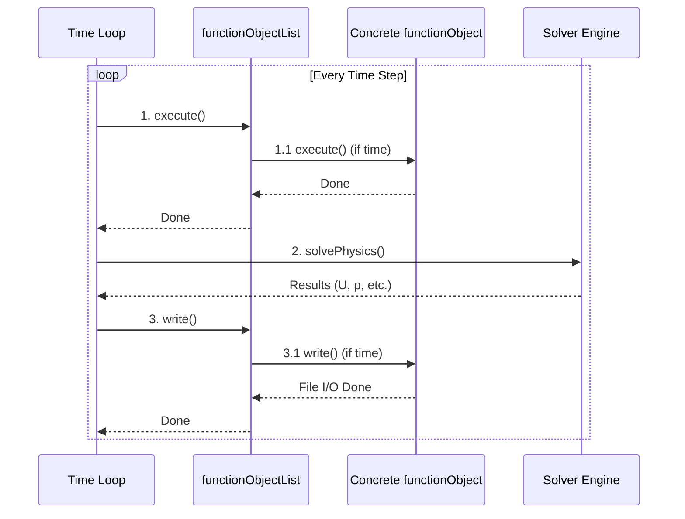

# 04 กลไกการทำงาน: การผสานรวม `functionObject` เข้ากับ Solver Loop

![[observer_pattern_cfd.png]]
`A clean scientific diagram illustrating the "Observer Pattern" in a Solver Loop. Show a large circular arrow labeled "Time Loop". At specific points on the circle (Before Solve, After Solve), show "Hook Points" that send signals to external "functionObject Observers" (Forces, Probes, Averaging). Use a minimalist palette with clear arrows, scientific textbook diagram, clean vector line art, white background, high definition, flat design, educational infographic --ar 16:9`

**หัวใจสำคัญของความสามารถในการขยาย** คือวิธีที่ OpenFOAM อนุญาตให้เรา "แทรก" (Inject) ตรรกะการทำงานเข้าไปในจุดต่างๆ ของวงรอบการคำนวณ (Time Loop)

### รูปแบบการบูรณาการกับ Loop ของเวลา


> **Figure 1:** แผนผังการทำงาน (Sequence Diagram) แสดงการผสานรวมของ functionObjects เข้ากับวงรอบเวลาของโซลเวอร์ โดยใช้รูปแบบตัวสังเกต (Observer Pattern) เพื่อให้โซลเวอร์สามารถแจ้งเตือนและเรียกใช้งานส่วนขยายต่างๆ ได้ตามลำดับเวลาที่กำหนดไว้ล่วงหน้า

Solver ของ OpenFOAM ทำตามรูปแบบมาตรฐานที่บูรณาการ functionObjects เข้ากับขั้นตอนการคำนวณโดยอัตโนมัติ การบูรณาการนี้เกิดขึ้นที่จุดที่กำหนดไว้ล่วงหน้าภายใน loop ของเวลาของ solver สร้างการเชื่อมต่อที่ราบรื่นระหว่างการคำนวณทางฟิสิกส์และการดำเนินการวิเคราะห์ข้อมูล

Loop ของเวลาทั่วไปของ solver ใช้รูปแบบการบูรณาการนี้:

```cpp
// Typical solver time loop (simplified)
while (runTime.loop())
{
    // 1. Execute functionObjects (before solving equations)
    functionObjectList::execute();

    // 2. Solve physics equations
    solveMomentum();
    solvePressure();
    solveTransport();

    // 3. Write functionObjects (after solving equations)
    functionObjectList::write();

    // 4. Write fields (if necessary)
    if (runTime.writeTime()) runTime.write();
}
```

> **💡 คำอธิบาย (Explanation)**
>
> **การทำงานของ Solver Loop:**
> - **runTime.loop()** คือฟังก์ชันที่ควบคุมการวนซ้ำของเวลา จะคืนค่า true จนกว่าจะถึงเวลาสิ้นสุดของการจำลอง
> - **functionObjectList::execute()** ถูกเรียกก่อนการแก้สมการฟิสิกส์ เพื่อให้ functionObjects สามารถเข้าถึงสนามการไหลในช่วงเริ่มต้นของ time step
> - **solveMomentum(), solvePressure(), solveTransport()** เป็นการแก้สมการกำลังสำคัญ ความดัน และการแพร่สารตามลำดับ
> - **functionObjectList::write()** ถูกเรียกหลังจากแก้สมการฟิสิกส์แล้ว เพื่อให้ functionObjects เขียนผลลัพธ์ที่คำนวณจากสนามการไหลใหม่
> - **runTime.writeTime()** ตรวจสอบว่าถึงเวลาที่กำหนดไว้สำหรับการเขียนไฟล์สนามข้อมูลหรือไม่
>
> **แหล่งที่มา (Source):** 📂 `.applications/utilities/postProcessing/postProcess/postProcess.C:executeFunctionObjects()`

> **🎯 แนวคิดสำคัญ (Key Concepts)**
> - **Observer Pattern**: Time loop ทำหน้าที่เป็น Subject ที่แจ้งเตือน functionObjects (Observers) ในแต่ละรอบการวนซ้ำ
> - **Timing Control**: execute() ถูกเรียกก่อนการแก้สมการ write() ถูกเรียกหลังการแก้สมการ
> - **Automatic Integration**: functionObjects ถูกผสานเข้ากับ solver loop โดยอัตโนมัติผ่าน functionObjectList

การออกแบบนี้เป็นการนำ **Observer Pattern** มาประยุกต์ใช้กับการคำนวณพลศาสตร์ของไหล ในรูปแบบนี้:

* **Subject** = Loop ของเวลา (แจ้ง observers ที่แต่ละรอบการวนซ้ำ)
* **Observers** = functionObjects (ตอบสนองต่อการเดินหน้าของเวลา)
* **Notification** = การเรียก `execute()` และ `write()`

ความสวยงามของแนวทางนี้อยู่ที่การจัดเวลาแบบชั่วคราว การเรียก `execute()` เกิดขึ้นก่อนการแก้สมการฟิสิกส์ ช่วยให้ functionObjects สามารถจับภาพสถานะของสนามการไหลที่จุดเริ่มต้นของแต่ละ time step ได้ การเรียก `write()` เกิดขึ้นหลังจากการแก้สมการฟิสิกส์ ทำให้ functionObjects สามารถประมวลผลและส่งออกผลลัพธ์ที่อิงตามสนามการไหลที่คำนวณใหม่ได้ การจัดเวลานี้ทำให้มั่นใจได้ว่า functionObjects จะทำงานกับข้อมูลสนามที่สม่ำเสมอและเป็นปัจจุบันเสมอ

### FunctionObjectList: ตัวจัดการ Observer

คลาส `functionObjectList` ทำหน้าที่เป็นผู้ประสานงานกลางสำหรับ functionObjects ที่ใช้งานอยู่ทั้งหมดภายในการจำลอง คลาสนี้ใช้งานชั้นการจัดการของ Observer pattern โดยรักษาคอลเลกชันของ observers และประสานงานการดำเนินการของพวกเขา

```cpp
class functionObjectList
{
private:
    // List of functionObjects (observers)
    PtrList<functionObject> functions_;

    // Timing control for each functionObject
    PtrList<timeControl> timeControls_;

public:
    // Execute all functionObjects (if their timing control says so)
    bool execute()
    {
        forAll(functions_, i)
        {
            if (timeControls_[i].execute())
            {
                functions_[i].execute();  // Observer notification
            }
        }
        return true;
    }

    // Similar for write()
};
```

> **💡 คำอธิบาย (Explanation)**
>
> **โครงสร้าง functionObjectList:**
> - **functions_** เป็น PtrList ที่เก็บ pointers ไปยัง functionObjects ทั้งหมดที่ลงทะเบียนอยู่
> - **timeControls_** เป็นรายการของ timeControl objects ที่ควบคุมการทำงานของแต่ละ functionObject ตามเวลา
> - **execute()** วนลูปผ่านทุก functionObject และเรียก execute() เฉพาะเมื่อ timeControl อนุญาต
> - **forAll** เป็น macro ของ OpenFOAM สำหรับการวนลูปผ่าน containers
>
> **แหล่งที่มา (Source):** 📂 `.applications/utilities/postProcessing/postProcess/postProcess.C:executeFunctionObjects()`

> **🎯 แนวคิดสำคัญ (Key Concepts)**
> - **Collection Management**: functionObjectList จัดการรายการของ functionObjects ทั้งหมด
> - **Independent Timing**: แต่ละ functionObject มี timeControl เป็นของตัวเอง
> - **Conditional Execution**: functionObjects ถูกเรียกเฉพาะเมื่อเงื่อนไขเวลาเป็นจริง
> - **Polymorphic Dispatch**: การเรียก execute() ใช้ virtual function dispatch

สถาปัตยกรรมนี้ให้ข้อดีหลายประการผ่านกลไกการควบคุมเวลาของมัน แต่ละ functionObject รักษาอ็อบเจกต์ `timeControl` ของตนเอง ทำให้สามารถกำหนดเวลาการทำงานอย่างอิสระของการดำเนินการวิเคราะห์ที่แตกต่างกันได้ การออกแบบนี้อนุญาตให้มีการปรับให้เหมาะสมที่ซับซ้อนของทรัพยากรการคำนวณ:

* functionObject **forces** สามารถคำนวณสัมประสิทธิ์แรงทุก 10 time steps
* functionObject **probes** สามารถสุ่มตัวอย่างคุณสมบัติการไหลทุก time step
* functionObject **fieldAverage** สามารถเขียนผลลัพธ์เฉลี่ยทุก 100 time steps

การกำหนดเวลาอย่างอิสระนี้มีความสำคัญอย่างยิ่งสำหรับการจำลอง CFD ที่มีประสิทธิภาพ ซึ่งงานวิเคราะห์ที่แตกต่างกันมีข้อกำหนดเชิงเวลาที่แตกต่างกัน การคำนวณแรงอาจจำเป็นต้องใช้เป็นระยะๆ เพื่อการตรวจสอบการลู่เข้า ในขณะที่การสุ่มตัวอย่าง probe ต้องการความละเอียดเชิงเวลาสูงเพื่อจับปรากฏการณ์ชั่วคราว

`functionObjectList` ยังจัดการกับข้อผิดพลาด ทำให้มั่นใจได้ว่าความล้มเหลวใน functionObjects แต่ละตัวจะไม่ทำให้การจำลองทั้งหมดหยุดทำงาน ความแข็งแกร่งนี้มีความจำเป็นสำหรับการคำนวณ CFD ที่ทำงานนาน ซึ่งความล้มเหลวในการประมวลผลภายหลังไม่ควรขัดจังหวะการแก้ปัญหาฟิสิกส์

### Strategy Pattern: อัลกอริทึมแบบ Polymorphic

แต่ละ functionObject ใช้งาน **strategy** เฉพาะสำหรับการประมวลผลข้อมูล ตามรูปแบบการออกแบบ Strategy รูปแบบนี้อนุญาตให้เลือกอัลกอริทึมขณะรันไทม์และอนุญาตให้เพิ่มวิธีการวิเคราะห์ใหม่โดยไม่ต้องแก้ไขโค้ดหลักของ solver

ส่วนติดต่อของ strategy ถูกกำหนดผ่านคลาสฐานนามธรรม `functionObject`:

```cpp
class functionObject  // Strategy interface
{
public:
    virtual bool execute() = 0;  // Algorithm step 1
    virtual bool write() = 0;    // Algorithm step 2
};
```

> **💡 คำอธิบาย (Explanation)**
>
> **Strategy Interface:**
> - **functionObject** เป็น abstract base class ที่กำหนด interface สำหรับทุก strategies
> - **execute()** เป็น pure virtual function ที่แต่ละ strategy ต้อง implement สำหรับการคำนวณ
> - **write()** เป็น pure virtual function สำหรับการเขียนผลลัพธ์
> - **virtual bool** ให้ polymorphic behavior เมื่อเรียกผ่าน pointer ของ base class
> - **= 0** บ่งบอกว่าเป็น pure virtual function ที่ต้องถูก override โดย derived classes
>
> **แหล่งที่มา (Source):** 📂 `.applications/utilities/postProcessing/postProcess/postProcess.C`

> **🎯 แนวคิดสำคัญ (Key Concepts)**
> - **Strategy Pattern**: กำหนด family ของ algorithms และทำให้สามารถแลกเปลี่ยนได้
> - **Pure Virtual Interface**: บังคับให้ทุก derived class  implement ฟังก์ชันเหล่านี้
> - **Runtime Selection**: algorithm ที่แน่นอนถูกเลือกขณะ runtime ผ่าน virtual dispatch
> - **Algorithm Encapsulation**: แต่ละ strategy encapsulate algorithm ที่แตกต่างกัน

การใช้งาน strategy เฉพาะให้การปรับใช้อัลกอริทึมสำหรับการวิเคราะห์ประเภทต่างๆ:

```cpp
class forces : public functionObject  // Specific strategy
{
public:
    virtual bool execute() override
    {
        // Calculate forces using current flow fields
        force_ = sum(patchPressure * patchArea);
        torque_ = sum(r × (patchPressure * patchArea));
        return true;
    }
};

class fieldAverage : public functionObject  // Another strategy
{
public:
    virtual bool execute() override
    {
        // Update running average
        mean_ = (mean_ * count_ + currentField_) / (count_ + 1);
        count_++;
        return true;
    }
};
```

> **💡 คำอธิบาย (Explanation)**
>
> **Concrete Strategy Implementations:**
> - **forces class**: คำนวณแรงและแรงบิดจากความดันบน patch surfaces
>   - `patchPressure * patchArea` คำนวณแรงบนแต่ละ face
>   - `sum()` รวมแรงทั้งหมดบน patch
>   - `r × ...` คำนวณ cross product สำหรับ torque
> - **fieldAverage class**: คำนวณค่าเฉลี่ยแบบ cumulative
>   - `(mean_ * count_ + currentField_) / (count_ + 1)` เป็นสูตรค่าเฉลี่ยแบบ running
>   - `count_` เก็บจำนวน samples สะสม
> - **override** รับประกันว่าแทนที่ virtual function ของ base class
> - **return true** บ่งบอกว่าการ execute สำเร็จ
>
> **แหล่งที่มา (Source):** 📂 `.applications/utilities/postProcessing/postProcess/postProcess.C`

> **🎯 แนวคิดสำคัญ (Key Concepts)**
> - **Concrete Strategies**: แต่ละ class implement algorithm ที่เฉพาะเจาะจง
> - **Formula Implementation**: forces ใช้ integration บน surfaces; fieldAverage ใช้ cumulative averaging
> - **State Management**: แต่ละ strategy รักษา state เฉพาะของตัวเอง
> - **Algorithm Independence**: แต่ละ strategy สามารถเปลี่ยนแปลงโดยไม่กระทบ strategy อื่น

Strategy pattern ให้ประโยชน์ทางสถาปัตยกรรมอย่างมีนัยสำคัญ สามารถเพิ่มอัลกอริทึมการวิเคราะห์ใหม่ๆ ในกรอบงาน OpenFOAM ได้เพียงแค่สร้างคลาส functionObject ใหม่ที่ใช้งานเมธอด `execute()` และ `write()` ส่วน loop ของ solver ยังคงไม่เปลี่ยนแปลง เนื่องจากมันโต้ตอบกับส่วนติดต่อนามธรรม `functionObject` เท่านั้น

การแยกความกังวลนี้ทำให้:
- **สามารถขยายได้**: นักวิจัยสามารถใช้งานการวิเคราะห์แบบกำหนดเองโดยไม่ต้องแก้ไข solver
- **สามารถบำรุงรักษาได้**: อัลกอริทึมการวิเคราะห์ถูกแยกจากโค้ดฟิสิกส์
- **สามารถนำกลับมาใช้ใหม่ได้**: functionObjects สามารถใช้ข้าม solver ที่แตกต่างกัน
- **การกำหนดค่าขณะรันไทม์**: วิธีการวิเคราะห์สามารถเปิด/ปิดได้ผ่านไฟล์อินพุต

รูปแบบนี้ยังช่วยให้การปรับให้เหมาะสมด้านประสิทธิภาพ เนื่องจาก functionObjects ที่แตกต่างกันสามารถมีความซับซ้อนในการคำนวณและความถี่ในการดำเนินการที่แตกต่างกันโดยไม่กระทบต่อประสิทธิภาพหลักของ solver

ตัวอย่างเช่น การวิเคราะห์ทางสถิติที่ซับซ้อนอาจทำงานทุก 100 time steps ในขณะที่การคำนวณแรงแบบง่ายอาจดำเนินการทุก time step ความยืดหยุ่นนี้มีความจำเป็นสำหรับการจำลอง CFD ในทางปฏิบัติที่ประสิทธิภาพการคำนวณเป็นสิ่งสำคัญที่สุด

### ขั้นตอนการดำเนินการภายใน functionObject

เพื่อให้เข้าใจลึกซึ้งยิ่งขึ้น มาดูขั้นตอนการทำงานภายใน functionObject เมื่อถูกเรียกจาก solver loop:

```cpp
// Execution steps inside functionObject::execute()
bool myCustomFunctionObject::execute()
{
    // 1. Check if required field exists
    if (!mesh_.foundObject<volScalarField>(fieldName_))
    {
        WarningIn("myCustomFunctionObject::execute()")
            << "Field " << fieldName_ << " not found" << endl;
        return false;
    }

    // 2. Access field from object registry
    const volScalarField& field =
        mesh_.lookupObject<volScalarField>(fieldName_);

    // 3. Perform calculation based on functionObject's purpose
    scalarField result = calculateQuantity(field);

    // 4. Store result for later writing
    storedResult_ = result;

    return true;
}

// Execution steps in functionObject::write()
bool myCustomFunctionObject::write()
{
    // 1. Write field or data to file
    if (writeField_)
    {
        storedResult_().write();
    }

    // 2. Write statistics or additional files
    writeFileData();

    return true;
}
```

> **💡 คำอธิบาย (Explanation)**
>
> **Execution Workflow:**
> - **Step 1 (Validation)**: `foundObject<>()` ตรวจสอบว่า field ที่ต้องการมีอยู่ใน object registry
>   - ใช้ template parameter เพื่อระบุประเภท field
>   - `WarningIn` macro สร้าง warning message พร้อม context information
> - **Step 2 (Field Access)**: `lookupObject<>()` ดึง reference ของ field จาก registry
>   - คืนค่า `const` reference เพื่อป้องกันการแก้ไข
>   - ใช้ template สำหรับ type-safe access
> - **Step 3 (Computation)**: `calculateQuantity()` ทำการคำนวณตามวัตถุประสงค์
> - **Step 4 (Storage)**: เก็บผลลัพธ์ใน member variable สำหรับการเขียนภายหลัง
> - **write() Method**: เขียนผลลัพธ์เมื่อถูกเรียกโดย functionObjectList
>
> **แหล่งที่มา (Source):** 📂 `.applications/utilities/postProcessing/postProcess/postProcess.C:executeFunctionObjects()`

> **🎯 แนวคิดสำคัญ (Key Concepts)**
> - **Object Registry**: Central repository สำหรับทุก objects ใน simulation
> - **Type Safety**: Template parameters รับประกัน type correctness ขณะ compile
> - **Error Handling**: Warning แทน crash เมื่อ field ไม่พบ
> - **Separation of Concerns**: execute() คำนวณ, write() ส่งออก
> - **Lazy Evaluation**: ผลลัพธ์ถูกคำนวณใน execute() และเขียนใน write()

### การจัดการ Dependency ระหว่าง functionObjects

ในระบบจริง functionObjects อาจมีความสัมพันธ์กัน บาง functionObject อาจต้องการผลลัพธ์จาก functionObject อื่น:

```cpp
// FunctionObject that depends on a field created by another functionObject
class derivedAnalysis : public functionObject
{
public:
    virtual bool execute() override
    {
        // Check if field from another functionObject exists
        if (!mesh_.foundObject<volScalarField>("filteredVelocity"))
        {
            WarningIn("derivedAnalysis::execute()")
                << "Required field 'filteredVelocity' not found. "
                << "Ensure that the filter functionObject runs first."
                << endl;
            return false;
        }

        // Perform analysis on the filtered field
        const volScalarField& filteredVel =
            mesh_.lookupObject<volScalarField>("filteredVelocity");

        // Calculate derived quantity from filtered field
        calculateStatistics(filteredVel);

        return true;
    }
};
```

> **💡 คำอธิบาย (Explanation)**
>
> **Dependency Management:**
> - **Inter-functionObject Dependencies**: functionObject หนึ่งอาจต้องการ field ที่สร้างโดยอีกตัวหนึ่ง
> - **Runtime Validation**: ตรวจสอบว่า required field มีอยู่ก่อนใช้งาน
> - **Informative Error Messages**: Warning บอก user ว่าอะไรขาดและควรทำอย่างไร
> - **Order Dependency**: การทำงานที่ถูกต้องอาจต้องอาศัยลำดับการทำงาน
>
> **แหล่งที่มา (Source):** 📂 `.applications/utilities/postProcessing/postProcess/postProcess.C`

> **🎯 แนวคิดสำคัญ (Key Concepts)**
> - **Loose Coupling**: functionObjects สื่อสารผ่าน object registry ไม่ใช่ direct references
> - **Late Binding**: Dependencies ถูกตรวจสอบขณะ runtime ไม่ใช่ compile time
> - **Fail-Safe Design**: functionObject ส่งคืน false แทน crash เมื่อ dependency ไม่ได้ตรงตาม
> - **Data Flow**: Fields ทำหน้าที่เป็น data pipeline ระหว่าง functionObjects

### การกำหนด Execution Order

เพื่อจัดการกับความสัมพันธ์ระหว่าง functionObjects ระบบอนุญาตให้ระบุลำดับการดำเนินการผ่านการตั้งค่า:

```cpp
// In system/controlDict
functions
{
    // Must run first
    velocityFilter
    {
        type            myFilter;
        libs            ("libmyFunctionObjects.so");
        fieldName       U;
        threshold       5.0;
        executeControl  timeStep;
        executeInterval 1;
    }

    // Must run after because it depends on filteredVelocity
    derivedStats
    {
        type            derivedAnalysis;
        libs            ("libmyFunctionObjects.so");
        executeControl  timeStep;
        executeInterval 1;
    }
}
```

> **💡 คำอธิบาย (Explanation)**
>
> **Configuration-Based Ordering:**
> - **Sequential Execution**: functionObjects ถูก execute ตามลำดับที่ปรากฏใน dictionary
> - **type**: ระบุ concrete functionObject class ที่จะใช้
> - **libs**: ระบุ shared library ที่มี functionObject implementation
> - **fieldName**: ระบุ field ที่จะประมวลผล (input)
> - **executeControl**: กำหนดวิธีควบคุมการ execute (timeStep, writeTime, etc.)
> - **executeInterval**: ระบุความถี่ในการ execute (ทุกๆ 1 time step)
>
> **แหล่งที่มา (Source):** 📂 `.applications/utilities/postProcessing/postProcess/postProcess.C`

> **🎯 แนวคิดสำคัญ (Key Concepts)**
> - **Declaration Order**: ลำดับใน dictionary กำหนดลำดับการ execute
> - **Runtime Configuration**: ไม่ต้อง recompile เพื่อเปลี่ยนลำดับ
> - **Dependency Chain**: derivedStats อาศัย velocityFilter สร้าง filteredVelocity
> - **Plugin Architecture**: libs ช่วยให้สามารถโหลด functionObjects จาก external libraries

### การจัดการ Mesh Changes

functionObjects ที่ทำงานกับ mesh ต้องรองรับการเปลี่ยนแปลง topology ของ mesh:

```cpp
class meshAwareFunctionObject : public functionObject
{
public:
    // Called when mesh topology changes
    virtual void updateMesh(const mapPolyMesh& mpm) override
    {
        // Update fields when mesh changes
        if (resultField_.valid())
        {
            resultField_().mapFields(mpm);
        }

        // Update other internal data
        updateGeometryData();
    }

    // Called when mesh points move
    virtual void movePoints(const polyMesh& mesh) override
    {
        // Update calculations that depend on position
        if (geometryData_.valid())
        {
            geometryData_().movePoints();
        }
    }
};
```

> **💡 คำอธิบาย (Explanation)**
>
> **Mesh Change Handling:**
> - **updateMesh()**: ถูกเรียกเมื่อ mesh topology เปลี่ยน (refinement, adaptation)
>   - `mapPolyMesh` มีข้อมูลการ mapping ระหว่าง old และ new mesh
>   - `resultField_.valid()` ตรวจสอบว่า pointer ถูก set หรือยัง
>   - `mapFields()` ส่งค่า field จาก old mesh ไป new mesh
> - **movePoints()**: ถูกเรียกเมื่อ mesh points เคลื่อนที่ (deformation)
>   - จำเป็นสำหรับ calculations ที่ขึ้นอยู่กับตำแหน่ง
> - **Geometry Updates**: ต้องอัปเดตข้อมูลเชิงเรขาคณิตที่เกี่ยวข้อง
>
> **แหล่งที่มา (Source):** 📂 `.applications/utilities/postProcessing/postProcess/postProcess.C`

> **🎯 แนวคิดสำคัญ (Key Concepts)**
> - **Mesh Morphing**: รองรับ moving meshes และ mesh deformation
> - **Topology Changes**: รองรับ dynamic mesh refinement/adaptation
> - **Data Consistency**: รักษาความต่อเนื่องของข้อมูลข้าม mesh changes
> - **Callbacks**: Virtual functions ที่ mesh เรียกเพื่อแจ้งการเปลี่ยนแปลง
> - **Field Mapping**: การแปลงค่า field ระหว่าง mesh topologies ต่างกัน

### สรุปแนวคิดสำคัญ

การบูรณาการ functionObject เข้ากับ solver loop ของ OpenFOAM แสดงให้เห็นถึงการประยุกต์ใช้รูปแบบการออกแบบที่หลากหลาย:

1. **Observer Pattern**: สำหรับการแจ้งเตือนและการตอบสนองต่อเหตุการณ์ใน time loop
2. **Strategy Pattern**: สำหรับการใช้งานอัลกอริทึมการวิเคราะห์ที่หลากหลาย
3. **Dependency Injection**: สำหรับการจัดการความสัมพันธ์และลำดับการดำเนินการ
4. **Template Method Pattern**: สำหรับการกำหนดโครงสร้างการดำเนินการที่สม่ำเสมอ

สถาปัตยกรรมนี้ทำให้ OpenFOAM มีความยืดหยุ่นอย่างมาก โดยอนุญาตให้ผู้ใช้สามารถขยายความสามารถของ solver ได้โดยไม่ต้องแก้ไขโค้ดหลักของ solver เอง ซึ่งเป็นแนวคิดที่สำคัญอย่างยิ่งในการสร้างซอฟต์แวร์ CFD ที่มีความสามารถในการปรับตัวและพัฒนาได้อย่างต่อเนื่อง