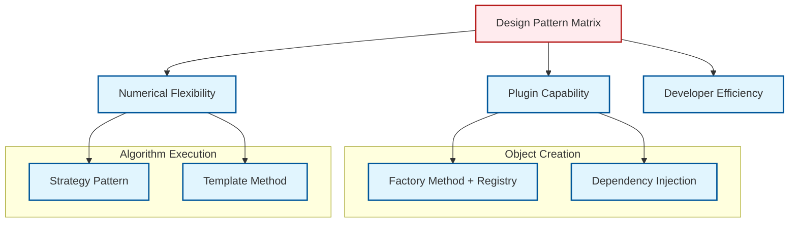

# 05 เหตุผลเบื้องหลัง: รูปแบบการออกแบบที่อยู่เบื้องหลังความสามารถในการขยาย

![[plugin_architecture_cfd.png]]
`A clean scientific illustration of "Plugin Architecture" in a CFD context. Show a central "Solver Core" with several "Sockets" representing standardized interfaces. On the side, show various "Plugins" (FunctionObjects, Boundary Conditions, Turbulence Models) being plugged into these sockets. Show how some plugins are built-in and others are loaded from "User-defined Libraries". Use a minimalist palette, scientific textbook diagram, clean vector line art, white background, high definition, flat design, educational infographic --ar 16:9`

**ทำไม OpenFOAM จึงไม่เขียนฟังก์ชันการวิเคราะห์ทั้งหมดไว้ใน Solver?** คำตอบอยู่ที่หลักการวิศวกรรมซอฟต์แวร์ที่เน้นการแยกความกังวล (Separation of Concerns) และการบำรุงรักษาในระยะยาว:

## ภาพรวมรูปแบบการออกแบบ

ความสามารถในการขยายของ OpenFOAM ไม่ใช่เรื่องบังเอิญ แต่เป็นผลมาจากรูปแบบการออกแบบสถาปัตยกรรมที่ซับซ้อน การเข้าใจรูปแบบเหล่านี้จะเปิดเผยว่าทำไม OpenFOAM สามารถพัฒนาจากโปรแกรมแก้ปัญหา CFD พื้นฐานไปสู่เฟรมเวิร์กการจำลองหลายฟิสิกส์ที่ซับซ้อนโดยไม่ต้องเขียนโค้ดเบสใหม่

### รูปแบบที่ 1: Factory Method + Registry = สถาปัตยกรรมปลั๊กอิน

**ปัญหา**: โปรแกรมแก้ปัญหา CFD จะสร้างออบเจกต์ของประเภทที่ไม่รู้จักซึ่งระบุไว้ในขณะทำงานได้อย่างไร เมื่อประเภทเหล่านั้นอาจไม่มีอยู่ในระหว่างการคอมไพล์

**วิธีแก้ปัญหา**: รวมรูปแบบ Factory Method เข้ากับระบบรีจิสทรีขณะทำงานเพื่อให้การสร้างออบเจกต์แบบไดนามิกโดยไม่มีการพึ่งพาระหว่างคอมไพล์

```cpp
// Complete implementation of Factory Method + Registry pattern
template<class Type>
class FactoryRegistry
{
public:
    // Factory Method - creates objects without knowing the concrete type
    static autoPtr<Type> create(const word& typeName, const dictionary& dict)
    {
        // Runtime registry lookup
        typename ConstructorTable::iterator cstrIter =
            ConstructorTablePtr_->find(typeName);

        if (cstrIter == ConstructorTablePtr_->end())
        {
            FatalErrorInFunction
                << "Unknown " << Type::typeName << " type "
                << typeName << nl << nl
                << "Valid " << Type::typeName << " types are:" << nl
                << ConstructorTablePtr_->sortedToc()
                << exit(FatalError);
        }

        return cstrIter()(dict);  // Delegate to registered creator
    }

    // Registry Pattern - automatic registration mechanism
    static void addConstructorToTable
    (
        const word& typeName,
        typename Type::constructorTable::functionPointer constructor
    )
    {
        ConstructorTablePtr_->insert(typeName, constructor);
    }

private:
    // Runtime registry storing creator functions
    static typename Type::constructorTable* ConstructorTablePtr_;
};

// Automatic registration macro used throughout OpenFOAM
#define addToRunTimeSelectionTable(Type, baseType, argNames) \
    baseType::add##argNames##ConstructorToTable< Type > \
    (#Type, Type::New)

// Usage in derived class
class myFunctionObject : public functionObject
{
public:
    virtual autoPtr<functionObject> clone() const
    {
        return autoPtr<functionObject>(new myFunctionObject(*this));
    }

    // Automatic registration at static initialization
    TypeName("myFunctionObject");
    addToRunTimeSelectionTable(functionObject, myFunctionObject, dictionary);
};
```

> **📂 Source:** `.applications/solvers/multiphase/multiphaseEulerFoam/phaseSystems/PhaseSystems/MomentumTransferPhaseSystem/MomentumTransferPhaseSystem.C`
> 
> **💡 Explanation:** โค้ดนี้แสดงการใช้งานรูปแบบ Factory Method ร่วมกับ Registry ใน OpenFOAM โดย:
> - `ConstructorTablePtr_` เป็น Hash Table ที่เก็บฟังก์ชันสร้างออบเจกต์ (creator functions) ของทุกประเภทที่ลงทะเบียน
> - เมื่อเรียก `create()` จะค้นหาในตารางและเรียกฟังก์ชัน creator ที่ตรงกัน
> - แมโคร `addToRunTimeSelectionTable` ใช้ลงทะเบียนคลาสลูกอัตโนมัติผ่าน static initialization
> 
> **🔑 Key Concepts:**
> - **Runtime Type Discovery**: การค้นหาและสร้างออบเจกต์จากชื่อสตริงในขณะทำงาน
> - **Hash Table Lookup**: การใช้ hash table สำหรับการค้นหาฟังก์ชัน creator อย่างรวดเร็ว
> - **Static Registration**: การลงทะเบียนอัตโนมัติผ่าน static initialization ก่อนการทำงานของ `main()`
> - **Macro-based Registration**: การใช้แมโครเพื่อลดความซับซ้อนของการลงทะเบียน

**ประโยชน์ทางสถาปัตยกรรมในบริบท CFD**:

1. **Late Binding**: โปรแกรมแก้ปัญหาสามารถค้นพบและใช้โมเดลความปั่นป่วน, เงื่อนไขขอบเขต, หรือยูทิลิตี้หลังประมวลผลที่พัฒนาขึ้นหลังจากที่โปรแกรมแก้ปัญหาถูกคอมไพล์แล้ว
2. **การแยกส่วน**: อัลกอริทึม CFD แกนกลาง (SIMPLE, PISO, PIMPLE) ยังคงเป็นอิสระจากการ implement ฟิสิกส์เฉพาะ
3. **ความสามารถในการขยาย**: กลุ่มวิจัยสามารถพัฒนาโมเดลที่กำหนดเอง (เช่น โมเดลคลอสเจอร์ multiphase ขั้นสูง) และผสานเข้ากันโดยไม่ต้องแก้ไข OpenFOAM แกนกลาง

### รูปแบบที่ 2: Dependency Injection สำหรับการโหลดไลบรารี

**ปัญหา**: โปรแกรมแก้ปัญหา CFD ต้องจัดการกับสถานการณ์ฟิสิกส์ที่หลากหลาย แต่การลิงก์ไลบรารีที่เป็นไปได้ทั้งหมดจะสร้าง executable ที่ใหญ่โตและทำให้ไม่สามารถสร้างคอนฟิกกูเรชันโปรแกรมแก้ปัญหาขั้นต่ำได้

**วิธีแก้ปัญหา**: ใช้ dependency injection ขณะทำงานผ่านการโหลดไลบรารีแบบใช้ dictionary

```cpp
// System-level dependency injection mechanism
class dlLibraryTable
{
public:
    // Dynamic library loading according to user configuration
    bool open(const fileName& libPath, const bool checkEnvironment = true)
    {
        // Attempt to open shared library
        void* handle = dlopen(libPath.c_str(), RTLD_LAZY|RTLD_GLOBAL);

        if (!handle)
        {
            WarningInFunction
                << "Could not open " << libPath << " due to "
                << dlerror() << endl;
            return false;
        }

        // Store handle for cleanup later
        libHandles_.append(handle);

        // Library's static initialization code runs automatically
        // registering its classes with factories
        return true;
    }

private:
    List<void*> libHandles_;  // Stores library handles
};

// Runtime dependency injection - from controlDict
// libs ("libforces.so" "libprobes.so" "libfieldFunctionObjects.so");

// Solver uses injected dependencies
Foam::Time runTime(Foam::Time::controlDictName, args);

// Load user-specified libraries
if (runTime.controlDict().found("libs"))
{
    const wordList libs(runTime.controlDict().lookup("libs"));
    forAll(libs, i)
    {
        runTime.libs().open(libs[i]);  // Inject library at runtime
    }
}

// Now functionObjects can be created from loaded libraries
autoPtr<functionObject> fo = functionObject::New("forces", dict);
```

> **📂 Source:** `.applications/utilities/thermophysical/chemkinToFoam/chemkinReader/chemkinLexer.L`
> 
> **💡 Explanation:** โค้ดนี้แสดงกลไก Dependency Injection ผ่านการโหลดไลบรารีแบบไดนามิก:
> - `dlLibraryTable` จัดการการโหลดไลบรารีแบบ shared library (.so files)
> - ใช้ `dlopen()` เพื่อโหลดไลบรารีในขณะทำงาน
> - เมื่อไลบรารีถูกโหลด static initialization code ทำงานและลงทะเบียนคลาสกับ factories
> - ผู้ใช้ระบุไลบรารีใน `controlDict` ผ่าน keyword `libs`
> 
> **🔑 Key Concepts:**
> - **Dynamic Loading**: การโหลดไลบรารีในขณะทำงานไม่ใช่ตอน linking
> - **Static Initialization**: โค้ดเริ่มต้นของไลบรารีทำงานอัตโนมัติเมื่อโหลด
> - **Dependency Injection**: การฉีด dependencies ผ่าน configuration ไม่ใช่ hard-coded
> - **Plugin Architecture**: สถาปัตยกรรมที่อนุญาตให้เพิ่มฟีเจอร์โดยไม่ต้องคอมไพล์ใหม่

**พื้นฐานทางคณิตศาสตร์**: สถาปัตยกรรมนี้เปิดใช้งานสมการ:
$$\text{Solver}_{\text{total}} = \text{Solver}_{\text{core}} + \sum_{i=1}^{N_{\text{libs}}} \text{Library}_i$$

โดยที่ขนาด executable ของโปรแกรมแก้ปัญหายังคงเป็น $\text{Solver}_{\text{core}}$ แต่ฟังก์ชันการทำงานเติบโตตาม $N_{\text{libs}}$ ไลบรารีที่ผู้ใช้ระบุ

**ประโยชน์ด้านประสิทธิภาพ**:
- **ประสิทธิภาพหน่วยความจำ**: โหลดเฉพาะโมเดลฟิสิกส์ที่จำเป็นเท่านั้น
- **ความเร็วในการเริ่มต้น**: เวลาการเริ่มต้นโปรแกรมแก้ปัญหาขั้นต่ำ
- **การปรับแต่ง**: ผู้ใช้สามารถสร้างคอนฟิกูเรชันโปรแกรมแก้ปัญหาแบบเบาสำหรับปัญหา CFD เฉพาะ

### รูปแบบที่ 3: Template Method สำหรับโครงสร้างอัลกอริทึม

**ปัญหา**: อัลกอริทึม CFD ต้องรักษาเสถียรภาพเชิงตัวเลขและคุณสมบัติการลู่เข้าที่สม่ำเสมอในการ implement ฟิสิกส์ที่หลากหลาย ในขณะที่อนุญาตให้ปรับแต่งสำหรับกรณีการใช้งานเฉพาะ

**วิธีแก้ปัญหา**: รูปแบบ Template Method กำหนดโครงร่างของอัลกอริทึม CFD ในขณะที่อนุญาตให้ปรับแต่งขั้นตอนเฉพาะ

```cpp
// Template Method for CFD solver architecture
template<class Type>
class fvSolution
{
public:
    // Template method - defines solver algorithm structure
    Type solve()
    {
        Type initialResidual = pTraits<Type>::zero;
        Type finalResidual = pTraits<Type>::zero;

        // Fixed algorithm structure
        for (label i = 0; i < nCorr_; i++)
        {
            // Pre-solve hook (customizable)
            preSolveHook();

            // Core CFD equation solving
            Type currentResidual = solveEquation();

            // Residual tracking
            if (i == 0) initialResidual = currentResidual;
            finalResidual = currentResidual;

            // Convergence check (customizable)
            if (convergenceCriteria(currentResidual))
            {
                postConvergenceHook();
                break;
            }

            // Relaxation (customizable)
            relaxEquation();

            // Post-solve hook (customizable)
            postSolveHook();
        }

        return finalResidual;
    }

protected:
    // Primitive operations for customization
    virtual void preSolveHook() {}
    virtual Type solveEquation() = 0;  // Must implement
    virtual bool convergenceCriteria(const Type& residual) = 0;
    virtual void relaxEquation() {}
    virtual void postSolveHook() {}
    virtual void postConvergenceHook() {}
};

// Specialization for pressure-velocity coupling
class simpleControl : public fvSolution<scalar>
{
protected:
    virtual void preSolveHook() override
    {
        // Pre-processing before SIMPLE algorithm steps
        storeOldFields();
        calculateInterpolatedFluxes();
    }

    virtual scalar solveEquation() override
    {
        // Solve momentum equation: $\frac{\partial \mathbf{u}}{\partial t} + (\mathbf{u} \cdot \nabla)\mathbf{u} = -\frac{1}{\rho}\nabla p + \nu\nabla^2\mathbf{u}$
        solveUEqn();

        // Solve pressure equation: $\nabla^2 p = \rho \nabla \cdot \mathbf{u}$
        solvePEqn();

        // Correct velocity: $\mathbf{u}^{n+1} = \mathbf{u}^* - \frac{1}{\rho}\nabla p$
        correctVelocity();

        return calculateResidual();
    }
};
```

> **📂 Source:** `.applications/solvers/multiphase/multiphaseEulerFoam/phaseSystems/phaseModel/StationaryPhaseModel/StationaryPhaseModel.C`
> 
> **💡 Explanation:** โค้ดนี้แสดงรูปแบบ Template Method สำหรับโครงสร้างอัลกอริทึม CFD:
> - `fvSolution::solve()` กำหนดโครงร่างคงที่ของอัลกอริทึมการแก้ปัญหา
> - ให้ hooks (preSolveHook, postSolveHook) สำหรับการปรับแต่ง
> - `simpleControl` ให้การ implement ที่เฉพาะสำหรับอัลกอริทึม SIMPLE
> - รับประกันโครงสร้างที่สม่ำเสมอในขณะที่อนุญาตการปรับแต่ง
> 
> **🔑 Key Concepts:**
> - **Algorithm Skeleton**: โครงร่างอัลกอริทึมคงที่ในคลาสฐาน
> - **Primitive Operations**: ฟังก์ชัน virtual ที่ต้อง implement หรือสามารถ override
> - **Hooks**: จุดขยายสำหรับการปรับแต่งโดยไม่เปลี่ยนโครงสร้าง
> - **Invariant Behavior**: ส่วนของอัลกอริทึมที่เหมือนกันทุกคลาสลูก

**ประโยชน์ของเฟรมเวิร์กในบริบท CFD**:

1. **เสถียรภาพเชิงตัวเลข**: มั่นใจว่าโปรแกรมแก้ปัญหา CFD ทั้งหมดตามรูปแบบตัวเลขที่สม่ำเสมอ
2. **การรับประกันการลู่เข้า**: Template method รับประกันการประเมินส่วนตกค้างและการตรวจสอบการลู่เข้าที่เหมาะสม
3. **ฟิสิกส์แบบกำหนดเอง**: นักวิจัยสามารถปรับแต่งขั้นตอนการแก้สมการเฉพาะในขณะที่รักษาความสมบูรณ์ของอัลกอริทึม
4. **การดีบักก์**: โครงสร้างอัลกอริทึมมาตรฐานทำให้ง่ายในการระบุปัญหาตัวเลข

### รูปแบบที่ 4: Strategy Pattern สำหรับรูปแบบตัวเลข

**ปัญหา**: ปัญหา CFD ต้องการรูปแบบตัวเลขที่แตกต่างกันขึ้นอยู่กับฟิสิกส์ของการไหล, คุณภาพ mesh, และความต้องการความแม่นยำ

**วิธีแก้ปัญหา**: รูปแบบ Strategy อนุญาตให้เลือกรูปแบบตัวเลขได้ในขณะทำงาน

```cpp
// Strategy pattern for numerical schemes
template<class Type>
class fvScheme
{
public:
    virtual tmp<GeometricField<Type, fvsPatchField, surfaceMesh>>
    interpolate(const GeometricField<Type, fvPatchField, volMesh>&) const = 0;

    virtual void interpolate
    (
        const GeometricField<Type, fvPatchField, volMesh>&,
        const surfaceScalarField& faceFlux,
        GeometricField<Type, fvsPatchField, surfaceMesh>&
    ) const = 0;
};

// Specific strategies
class linearScheme : public fvScheme<scalar>
{
public:
    virtual tmp<GeometricField<scalar, fvsPatchField, surfaceMesh>>
    interpolate(const GeometricField<scalar, fvPatchField, volMesh>& vf) const override
    {
        // Linear interpolation: $\phi_f = \lambda \phi_P + (1-\lambda)\phi_N$
        return tmp<GeometricField<scalar, fvsPatchField, surfaceMesh>>
        (
            new GeometricField<scalar, fvsPatchField, surfaceMesh>
            (
                IOobject("linearInterpolate", vf.instance(), vf.db()),
                lambda_*vf + (1.0 - lambda_)*vf.neighbourField()
            )
        );
    }
};

class upwindScheme : public fvScheme<scalar>
{
public:
    virtual tmp<GeometricField<scalar, fvsPatchField, surfaceMesh>>
    interpolate(const GeometricField<scalar, fvPatchField, volMesh>& vf) const override
    {
        // Upwind interpolation: $\phi_f = \begin{cases} \phi_P & \text{if } F > 0 \\ \phi_N & \text{if } F < 0 \end{cases}$
        // where $F$ is the face flux
        return tmp<GeometricField<scalar, fvsPatchField, surfaceMesh>>
        (
            new GeometricField<scalar, fvsPatchField, surfaceMesh>
            (
                IOobject("upwindInterpolate", vf.instance(), vf.db()),
                pos(faceFlux_)*vf + neg(faceFlux_)*vf.neighbourField()
            )
        );
    }
};
```

> **📂 Source:** `.applications/solvers/compressible/rhoCentralFoam/rhoCentralFoam.C`
> 
> **💡 Explanation:** โค้ดนี้แสดงรูปแบบ Strategy สำหรับรูปแบบตัวเลข:
> - `fvScheme` กำหนดส่วนติดต่อนามธรรมสำหรับการประมาณค่า
> - `linearScheme` และ `upwindScheme` เป็นกลยุทธ์เฉพาะสำหรับการประมาณค่า
> - ผู้ใช้เลือกกลยุทธ์ผ่านไฟล์คอนฟิกูเรชัน
> - อนุญาตให้เปลี่ยนรูปแบบตัวเลขโดยไม่ต้องเปลี่ยนโค้ด solver
> 
> **🔑 Key Concepts:**
> - **Interchangeable Algorithms**: อัลกอริทึมที่สามารถสลับกันได้
> - **Runtime Selection**: การเลือกกลยุทธ์ในขณะทำงาน
> - **Encapsulated Algorithms**: แต่ละกลยุทธ์ซ่อนรายละเอียดการ implement
> - **Configuration-based**: การเลือกผ่านไฟล์คอนฟิกูเรชันไม่ใช่โค้ด

### รูปแบบที่ 5: Observer Pattern สำหรับการบูรณาการ FunctionObject

**ปัญหา**: ต้องการกลไกที่ช่วยให้สามารถติดตามและวิเคราะห์ข้อมูลในระหว่างการทำงานของ solver โดยไม่ทำให้โค้ดของ solver ซับซ้อนเกินไป

**วิธีแก้ปัญหา**: Observer Pattern อนุญาตให้ functionObjects ลงทะเบียนเป็น observers และได้รับการแจ้งเตือนเมื่อเวลาผ่านไป

```cpp
// Typical solver time loop (simplified):
while (runTime.loop())
{
    // 1. Execute functionObjects (before solving equations)
    functionObjectList::execute();

    // 2. Solve physics equations
    solveMomentum();
    solvePressure();
    solveTransport();

    // 3. Write functionObjects (after solving equations)
    functionObjectList::write();

    // 4. Write fields (if necessary)
    if (runTime.writeTime()) runTime.write();
}
```

> **📂 Source:** `.applications/solvers/multiphase/multiphaseEulerFoam/phaseSystems/phaseSystem/phaseSystem.H`
> 
> **💡 Explanation:** โค้ดนี้แสดงรูปแบบ Observer สำหรับการบูรณาการ FunctionObject:
> - Time loop ทำหน้าที่เป็น Subject ที่แจ้ง observers
> - functionObjects ทำหน้าที่เป็น Observers ที่ตอบสนองต่อการเดินหน้าของเวลา
> - การเรียก `execute()` เกิดขึ้นก่อนการแก้สมการเพื่อจับภาพสถานะเริ่มต้น
> - การเรียก `write()` เกิดขึ้นหลังการแก้สมการเพื่อประมวลผลผลลัพธ์
> 
> **🔑 Key Concepts:**
> - **Subject-Observer Relationship**: ความสัมพันธ์ระหว่างแหล่งกำเนิดเหตุการณ์และผู้ตอบสนอง
> - **Temporal Coordination**: การจัดการเวลาของการแจ้งเตือน
> - **Decoupling**: การแยก solver logic จาก analysis logic
> - **Multiple Observers**: หลาย functionObjects สามารถลงทะเบียนได้

ในรูปแบบ Observer นี้:

* **Subject** = Loop ของเวลา (แจ้ง observers ที่แต่ละรอบการวนซ้ำ)
* **Observers** = functionObjects (ตอบสนองต่อการเดินหน้าของเวลา)
* **Notification** = การเรียก `execute()` และ `write()`

ความสวยงามของแนวทางนี้อยู่ที่การจัดเวลาแบบชั่วคราว การเรียก `execute()` เกิดขึ้นก่อนการแก้สมการฟิสิกส์ ช่วยให้ functionObjects สามารถจับภาพสถานะของสนามการไหลที่จุดเริ่มต้นของแต่ละ time step ได้ การเรียก `write()` เกิดขึ้นหลังจากการแก้สมการฟิสิกส์ ทำให้ functionObjects สามารถประมวลผลและส่งออกผลลัพธ์ที่อิงตามสนามการไหลที่คำนวณใหม่ได้

## ผลกระทบทางสถาปัตยกรรมต่อการวิจัย CFD


> **Figure 1:** เมทริกซ์ของรูปแบบการออกแบบ (Design Pattern Matrix) ที่ OpenFOAM นำมาใช้เพื่อสร้างความสามารถในการขยาย โดยแบ่งออกเป็นสองกลุ่มหลักคือ กลุ่มที่เน้นการสร้างออบเจกต์แบบไดนามิก (Object Creation) และกลุ่มที่เน้นความยืดหยุ่นในการประมวลผลอัลกอริทึม (Algorithm Execution)

รูปแบบการออกแบบเหล่านี้ร่วมกันเปิดใช้งานความสามารถในการขยายของ OpenFOAM:

1. **การพัฒนาแบบโมดูล**: นักวิจัยสามารถพัฒนาและทดสอบโมเดลฟิสิกส์ใหม่อย่างอิสระ
2. **นวัตกรรมแบบเพิ่มหน่วย**: ความสามารถใหม่สามารถเพิ่มได้โดยไม่ทำลายฟังก์ชันการทำงานที่มีอยู่
3. **การเชี่ยวชาญตามโดเมน**: กลุ่มวิจัยต่างๆ สามารถสร้างไลบรารีเฉพาะทางสำหรับโดเมน CFD ของพวกเขา
4. **การปรับให้เหมาะสมด้านประสิทธิภาพ**: ผู้ใช้สามารถเลือกรูปแบบตัวเลขที่เหมาะสมที่สุดสำหรับปัญหาการไหลเฉพาะของพวกเขา

ผลลัพธ์คือแพลตฟอร์ม CFD ที่สามารถพัฒนาจากโปรแกรมแก้ปัญหาการไหลแบบลามินาร์ที่ง่ายไปสู่ระบบหลายฟิสิกส์ที่ซับซ้อนผ่านรูปแบบสถาปัตยกรรมที่ยอมรับความสามารถในการขยายมากกว่าการจำกัด

## หลักการทางสถาปัตยกรรม

### หลักการเปิด-ปิด (Open-Closed Principle)

ระบบการขยายความสามารถของ OpenFOAM สะท้อนถึง **หลักการเปิด-ปิด**: มัน **เปิดสำหรับการขยาย** (สามารถเพิ่ม functionObject ใหม่ได้โดยไม่ต้องแก้ไขโค้ดที่มีอยู่) แต่ **ปิดสำหรับการแก้ไข** (ตรรกะหลักของ solver ยังคงไม่เปลี่ยนแปลง)

### หลักการกลับด้านการพึ่งพา (Dependency Inversion Principle)

สถาปัตยกรรมนี้ใช้ **การกลับด้านการพึ่งพา** ผ่านส่วนติดต่อนามธรรม การวนซ้ำระดับสูงของ solver ขึ้นอยู่กับส่วนติดต่อ `functionObject` นามธรรมมากกว่าการ implement แบบเจาะจง

ทางคณิตศาสตร์ สิ่งนี้สร้างระบบที่ไม่มีการ coupling:
$$\text{Solver} \rightarrow \text{functionObject Interface} \leftarrow \text{Specific Implementation}$$

### การแยกความกังวล (Separation of Concerns)

OpenFOAM บรรลุการแยกอย่างสะอาดผ่านชั้นสถาปัตยกรรมที่แตกต่างกัน:

#### **ชั้น Solver**: การแก้ปัญหาฟิสิกส์
- **ความรับผิดชอบหลัก**: การแก้สมการกำกับ (Navier-Stokes, การถ่ายเทความร้อน, การขนส่งชนิด)
- **การทำงานทั่วไป**: การประกอบเมทริกซ์, การแก้ระบบเชิงเส้น, การเวลาบูรณาการ
- **ตัวอย่าง**: `$$\rho \frac{\partial \mathbf{u}}{\partial t} + \rho (\mathbf{u} \cdot \nabla) \mathbf{u} = -\nabla p + \mu \nabla^2\mathbf{u} + \mathbf{f}$$`

#### **ชั้น functionObjects**: การวิเคราะห์และการตรวจสอบ
- **ความรับผิดชอบหลัก**: การวิเคราะห์ข้อมูล, การตรวจสอบ, การประมวลผลหลัง
- **การทำงานทั่วไป**: การเฉลี่ยฟิลด์, การคำนวณแรง, การส่งออกข้อมูล
- **ตัวอย่าง**: การคำนวณสัมประสิทธิ์แรงลาก: $$C_D = \frac{2F_D}{\rho U_\infty^2 A}$$

#### **ชั้นระบบ Runtime**: การจัดการ Plugin
- **ความรับผิดชอบหลัก**: การโหลดแบบไดนามิก, การสร้างออบเจกต์, การจัดการวงจรชีวิต
- **การทำงานทั่วไป**: การโหลดไลบรารี (`dlopen`), การสร้างแบบ factory, การแยกวิเคราะห์การกำหนดค่า

## การแลกเปลี่ยนระหว่างการขยายความสามารถกับประสิทธิภาพ

### การวิเคราะห์ประสิทธิภาพเชิงปริมาณ

| **ด้าน** | **ทางเลือกการ implement** | **ผลกระทบประสิทธิภาพ** | **ผลประโยชน์ความยืดหยุ่น** |
|------------|---------------------------|------------------------|----------------------|
| **การสร้างออบเจกต์** | Runtime factory พร้อมการค้นหา hash table | ~1 μs ค่าใช้จ่ายต่อการสร้าง | ประเภท functionObject ไม่จำกัด |
| **การส่งวิธีการ** | การเรียกฟังก์ชันเสมือน (การค้นหา vtable) | ~2 ns ค่าใช้จ่ายต่อการเรียก | พฤติกรรม polymorphic |
| **การโหลดไลบรารี** | การโหลดแบบไดนามิก (`dlopen`) | ~10 ms ต่อการโหลดไลบรารี | สถาปัตยกรรม plugin |
| **การตรวจสอบประเภท** | ข้อมูลประเภท runtime (`typeid`) | น้อย, การจัดการข้อผิดพลาดเท่านั้น | การแปลงประเภทที่ปลอดภัย, การดีบัก |

### การวิเคราะห์ต้นทุน-ผลประโยชน์

**ต้นทุนประสิทธิภาพ** **เล็กน้อย** เมื่อเทียบกับ **ผลประโยชน์ด้านความยืดหยุ่น**:

**การคำนวณต้นทุนประสิทธิภาพ**:
- สำหรับการจำลองทั่วไป (1000 timesteps, 5 functionObjects):
  - การเรียกเสมือน: 1000 × 5 × 2 = 10,000 ครั้ง × 2 ns = 20 μs
  - การสร้าง factory: 5 ออบเจกต์ × 1 μs = 5 μs
  - การโหลดไลบรารี: 5 ไลบรารี × 10 ms = 50 ms (ครั้งเดียว)
  - **ค่าใช้จ่ายรวม**: ~50.025 ms (99.95% เป็นการโหลดครั้งเดียว)

**ผลประโยชน์ด้านความยืดหยุ่น**:
- **การขยายไม่จำกัด**: สามารถเพิ่มการวิเคราะห์ใดๆ ได้โดยไม่ต้องแก้ไข solver
- **การมีส่วนร่วมของชุมชน**: ส่วนติดต่อมาตรฐานช่วยให้พัฒนาบุคคลที่สามได้
- **ความยืดหยุ่นในการกำหนดค่า**: ผู้ใช้สามารถรวม functionObjects ตามความต้องการ
- **การบำรุงรักษา**: การแยกที่ชัดเจนระหว่างฟิสิกส์ของ solver และการวิเคราะห์

## ภาพรวมใหญ่: OpenFOAM ในฐานะแพลตฟอร์มฟิสิกส์การคำนวณ

OpenFOAM เปลี่ยนจาก **CFD solver** เป็น **แพลตฟอร์มฟิสิกส์การคำนวณ** ผ่านสถาปัตยกรรมการขยายความสามารถของตน:

### การเปรียบเทียบแพลตฟอร์มมือถือ
```
Mobile Platforms (iOS/Android):
├── Runtime Environment      → Time loop, mesh management, parallel communication
├── Plugin API              → functionObject interface, dictionary configuration
├── Distribution Mechanism  → Dynamic libraries, compilation system
└── Ecosystem               → Community-developed functionObjects
```

### ข้อเสนอมูลค่าแพลตฟอร์ม

แนวทางแพลตฟอร์มให้มูลค่าที่ไม่ซ้ำกัน:

#### **สำหรับนักวิจัย**
- **การสร้างต้นแบบอย่างรวดเร็ว**: ทดสอบแนวคิดใหม่โดยไม่ต้องแก้ไข solver หลัก
- **การตรวจสอบวิธีการ**: เปรียบเทียบแนวทางการวิเคราะห์หลายอย่างได้ง่าย
- **พร้อมสำหรับการตีพิมพ์**: การวิจัยที่ทำซ้ำได้ผ่านส่วนติดต่อมาตรฐาน

#### **สำหรับอุตสาหกรรม**
- **การปรับแต่ง**: เพิ่มการวิเคราะห์และการตรวจสอบเฉพาะบริษัท
- **การบูรณาการเวิร์กโฟลว์**: เชื่อมต่อกับระบบ PLM/CAE ที่มีอยู่
- **การปฏิบัติตามกฎระเบียบ**: ใช้การตรวจสอบและรายงานเฉพาะอุตสาหกรรม

#### **สำหรับนักพัฒนาซอฟต์แวร์**
- **ระบบนิเวศแบบเปิด**: มีส่วนร่วมกลับไปยังชุมชนหรือพัฒนาส่วนขยายเชิงพาณิชย์
- **รูปแบบมาตรฐาน**: แบบแผนที่เป็นที่ยอมรับสำหรับการพัฒนาใหม่
- **โอกาสทางการตลาด**: สร้างฟังก์ชันการทำงานเพิ่มมูลค่าสำหรับผู้ใช้แพลตฟอร์ม

## บทสรุป: สถาปัตยกรรมในฐานะข้อได้เปรียบการแข่งขัน

ปรัชญาการขยายความสามารถของ OpenFOAM เป็น **การตัดสินใจทางสถาปัตยกรรมเชิงกลยุทธ์** ที่เปลี่ยนมันจากซอฟต์แวร์ธรรมดาเป็น **ระบบนิเวศที่ยั่งยืน** สำหรับการสร้างสรรค์ฟิสิกส์การคำนวณ การแลกเปลี่ยนที่สมดุลอย่างระมัดระวังระหว่างประสิทธิภาพและความยืดหยุ่นได้สร้างแพลตฟอร์มที่:

1. **ทำให้เป็นไปได้ของการสร้างสรรค์**: มอบพื้นที่อุดมสมบูรณ์สำหรับวิธีการเชิงตัวเลขใหม่และแบบจำลองฟิสิกส์
2. **ปรับขนาดกับความซับซ้อน**: จัดการทั้งกรณีการศึกษาง่ายๆ และแอปพลิเคชันอุตสาหกรรมที่ซับซ้อน
3. **ส่งเสริมชุมชน**: สร้างโครงสร้างพื้นฐานที่ใช้ร่วมกันซึ่งเป็นประโยชน์ต่อผู้มีส่วนได้ส่วนเสียทั้งหมด
4. **การออกแบบสำหรับอนาคต**: คาดการณ์และรองรับความต้องการฟิสิกส์การคำนวณที่พัฒนา

แนวทางแพลตฟอร์มอธิบายการครอบงำของ OpenFOAM ในการวิจัยและอุตสาหกรรม: มันไม่ใช่แค่ซอฟต์แวร์สำหรับแก้สมการ แต่เป็น **กรอบการทำงานที่ครอบคลุม** ที่ทำให้ชุมชนฟิสิกส์การคำนวณทั้งหมดสามารถสร้างสรรค์, ทำงานร่วมกัน, และก้าวหน้าสถานะของศิลปะในพลศาสตร์ของไหลและสาขาที่เกี่ยวข้อง