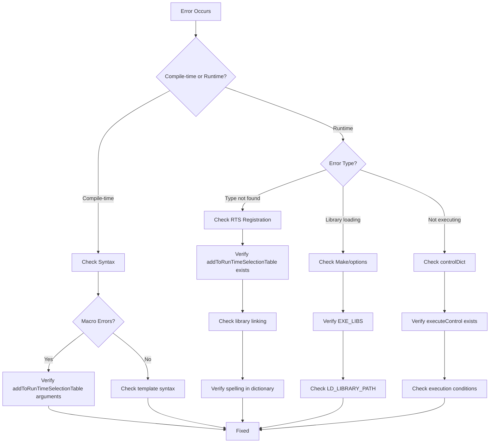

# Common Errors and Debugging

ข้อผิดพลาดที่พบบ่อยและการแก้ไข

---

## Learning Objectives

หลังจากอ่านบทนี้ คุณจะสามารถ:
- ระบุสาเหตุของข้อผิดพลาดที่พบบ่อยในระบบ extensible architecture ของ OpenFOAM
- ใช้เทคนิค systematic troubleshooting ในการวินิจฉัยปัญหา
- ป้องกันข้อผิดพลาดที่เกิดจากการลงทะเบียน RTS และ library linking
- ใช้ debugging tools เพื่อติดตามปัญหา runtime และ compile-time

---

## 1. Debugging Flowchart



---

## 2. RTS Type Not Found

### 2.1 Problem Description

```
Unknown turbulenceModel type "myModel"
```

หรือ:
```
--> FOAM FATAL ERROR:
Unknown RASModel type "kOmegaSST"
```

### 2.2 Root Causes

1. **RTS table ไม่ได้ลงทะเบียน** - ไม่มี `addToRunTimeSelectionTable` ใน source
2. **Library ไม่ถูก link** - ไม่ได้เพิ่มใน `Make/options`
3. **Typo ใน dictionary** - ชื่อ type ผิดในไฟล์ case
4. **Constructor ไม่ตรงกัน** - RTS registers constructor ที่ไม่ตรงกับที่เรียกใช้

### 2.3 Diagnostic Steps

```bash
# 1. Check if library contains the symbol
nm -D $FOAM_USER_LIBBIN/libmyTurbulenceModels.so | grep myModel

# 2. Search for RTS macro
grep -r "addToRunTimeSelectionTable" *.C

# 3. Verify dictionary syntax
foamListTemplates
```

### 2.4 Solution

**Step 1: Verify RTS Registration**
```cpp
// In myModel.C
#include "myModel.H"

// Check this macro exists and has 4 correct arguments
addToRunTimeSelectionTable
(
    RASModel,              // Base class
    myModel,               // Derived class
    dictionary             // Constructor type
);
```

**Step 2: Check Library Linking**
```bash
# In Make/options
EXE_LIBS = \
    -L$(FOAM_USER_LIBBIN) \
    -lmyTurbulenceModels
```

**Step 3: Verify Dictionary**
```cpp
// In constant/turbulenceProperties
simulationType  RASModel;
RASModel        myModel;  // Must match RTS registration

myModel
{
    // Parameters
}
```

### 2.5 Prevention

✅ **Always check:**
- [ ] `addToRunTimeSelectionTable` macro exists with correct 4 arguments
- [ ] Library is linked in `Make/options` with `-l` prefix
- [ ] Constructor type matches (dictionary, mesh, etc.)
- [ ] Type name in dictionary exactly matches class name

---

## 3. Missing Library Errors

### 3.1 Problem Description

```
error while loading shared libraries: libmyLib.so: 
cannot open shared object file: No such file or directory
```

หรือ:
```
undefined reference to `Foam::myFunctionObject::myFunctionObject(...)`
```

### 3.2 Root Causes

1. **Library not built** - ไม่ได้ compile library
2. **Wrong library path** - `Make/options` ชี้ path ผิด
3. **Missing in wmake** - Library ไม่ได้ถูก build กับ solver
4. **LD_LIBRARY_PATH not set** - Runtime ไม่พบ library

### 3.3 Diagnostic Steps

```bash
# 1. Check if library exists
ls -la $FOAM_USER_LIBBIN/libmyLib.so

# 2. Check symbols in library
nm -C $FOAM_USER_LIBBIN/libmyLib.so | grep myClass

# 3. Trace library loading
LD_DEBUG=libs simpleFoam -help 2>&1 | grep myLib
```

### 3.4 Solution

**Method 1: Link via Make/options**
```bash
# In solver/Make/options
EXE_INC = \
    -I$(LIB_SOURCE)/customLib/lnInclude

EXE_LIBS = \
    -L$(FOAM_USER_LIBBIN) \
    -lcustomLib
```

**Method 2: Set LD_LIBRARY_PATH**
```bash
# In ~/.bashrc
export LD_LIBRARY_PATH=$FOAM_USER_LIBBIN:$LD_LIBRARY_PATH

# Reload
source ~/.bashrc
```

**Method 3: Build Library First**
```bash
# Build the library
cd $WM_PROJECT_USER_DIR/libs/customLib
wmake libso

# Verify
ls -la $FOAM_USER_LIBBIN/libcustomLib.so
```

### 3.5 Prevention

✅ **Build sequence:**
```bash
# Always build libraries before solvers
wmake libso customLib
wmake solver

# Or use dependency in Make/files
LIB_LIBS = \
    -lcustomLib
```

---

## 4. Static Initialization Order Issues

### 4.1 Problem Description

```
Segmentation fault (core dumped)
# Occurs during static initialization
```

### 4.2 Root Causes

1. **Static initialization order fiasco** - Global objects initialize in undefined order
2. **RTS table not ready** - Trying to use RTS before tables are populated
3. **Dependent static objects** - One static object depends on another

### 4.3 Diagnostic Steps

```bash
# Use debugger to catch segfault
gdb --args simpleFoam
(gdb) run
(gdb) backtrace

# Check initialization order
nm -C solverExe | grep _Z*
```

### 4.4 Solution

**Avoid static objects:**
```cpp
// ❌ BAD: Global static
static myHelper helper;

// ✅ GOOD: Function-local static (Meyers' singleton)
myHelper& getHelper()
{
    static myHelper helper;
    return helper;
}

// ✅ GOOD: Lazy initialization
auto& tables = RuntimeSelectionTables::BaseClass::Table();
```

**Safe RTS usage:**
```cpp
// Don't register static objects that need RTS
// Register at library load time instead (via macro)

addToRunTimeSelectionTable(...);  // ✅ Safe
```

### 4.5 Prevention

✅ **Best practices:**
- Use function-local statics (C++11 guaranteed thread-safe)
- Avoid global objects that depend on RTS
- Initialize at first use, not at static initialization
- Use pointer wrapper for complex initialization

---

## 5. Function Object Not Executing

### 5.1 Problem Description

Function object ปรากฏใน log แต่ไม่เห็น output:

```bash
# Log shows:
functionObject::myFunc: Cannot find functionObject file myFunc
```

หรือ function object ไม่ทำงานเลย

### 5.2 Root Causes

1. **Missing executeControl** - ไม่ระบุเมื่อควร execute
2. **Wrong type name** - `type` ไม่ตรงกับ RTS registration
3. **Execution condition never met** - `writeInterval` ไม่ตรงกัน
4. **File not readable** - ไฟล์ function object อยู่ใน path ที่ผิด

### 5.3 Diagnostic Steps

```bash
# 1. Check function object loading
simpleFoam -postProcess -func 'myFunc' -help

# 2. Verify dictionary
foamDictionary system/controlDict -entry 'functions'

# 3. Test manually
runApplication postProcess -func myFunc
```

### 5.4 Solution

**Complete function object entry:**
```cpp
// In system/controlDict
functions
{
    myFunc
    {
        type            myFunctionObject;      // Required: matches RTS
        executeControl  timeStep;              // Required: when to execute
        writeControl    timeStep;              // When to write
        executeInterval 1;                     // Execute every timestep
        writeInterval   10;                    // Write every 10 timesteps
        
        // Function object specific settings
        fields          (p U);
    }
}
```

**Execution modes:**
```cpp
executeControl  timeStep;      // Every N timesteps
executeControl  writeTime;     // At write times
executeControl  endTime;       // At end
executeControl  outputTime;    // At output times

// Add conditions
executeIf(ROI);                 // Only if region of interest exists
executeOnRestart true;          // Run when restarting
```

### 5.5 Prevention

✅ **Checklist for function objects:**
- [ ] `type` matches RTS registration name
- [ ] `executeControl` always specified
- [ ] `executeInterval` reasonable (not 0)
- [ ] Output directory exists or is writable
- [ ] Fields referenced exist in mesh/database

---

## 6. Compile Errors in RTS Macros

### 6.1 Problem Description

```
error: macro "addToRunTimeSelectionTable" requires 4 arguments, 
but only 3 given
```

หรือ:
```
error: 'typeName' was not declared in this scope
```

### 6.2 Root Causes

1. **Missing arguments** - Macro ต้องการ 4 arguments
2. **Wrong constructor type** - constructor type ไม่ถูกต้อง
3. **TypeName not defined** - ไม่ได้ define `TypeName` ใน class
4. **Missing include** - ไม่ได้ include header files ที่จำเป็น

### 6.3 Diagnostic Steps

```bash
# Check macro expansion
gcc -E myModel.C | grep -A 10 "addToRunTimeSelectionTable"

# Verify TypeName
grep "TypeName" myModel.H
```

### 6.4 Solution

**Correct RTS macro syntax:**
```cpp
// Full template
addToRunTimeSelectionTable
(
    baseClass,              // 1. Base class name
    derivedClass,           // 2. Derived class name
    constructorType         // 3. Constructor signature
);

// Example 1: Dictionary constructor
addToRunTimeSelectionTable
(
    RASModel,
    myModel,
    dictionary
);

// Example 2: Mesh constructor
addToRunTimeSelectionTable
(
    fvMeshFunctionObject,
    myFunctionObject,
    mesh
);

// Example 3: Component name constructor
addToRunTimeSelectionTable
(
    regionFunctionObject,
    myRegionObject,
    dictionary, mesh, geoMesh
);
```

**Define TypeName:**
```cpp
// In myModel.H
class myModel
:
    public RASModel
{
    // Required for RTS
    TypeName("myModel");  // Must match class name
    
    // ...
};
```

### 6.5 Prevention

✅ **Always include:**
```cpp
// At top of .C file
#include "myModel.H"
#include "addToRunTimeSelectionTable.H"

// Verify TypeName in .H
TypeName("myModel");  // In class definition
```

---

## 7. Template Instantiation Errors

### 7.1 Problem Description

```
undefined reference to `Foam::myClass<double>::myClass()'
```

### 7.2 Root Causes

1. **Missing explicit instantiation** - Template ไม่ถูก instantiate สำหรับ type
2. **Definition in .C file** - Template implementation อยู่ใน .C (ไม่ visible)

### 7.3 Solution

**Explicit instantiation:**
```cpp
// In myTemplate.C (at bottom)
template class myClass<double>;
template class myClass<vector>;
template class myClass<tensor>;
```

**Header-only implementation:**
```cpp
// Move all template implementations to .H file
// myTemplate.H
template<class T>
class myClass
{
    // Implementation here (not in .C)
    void myMethod();
};

template<class T>
void myClass<T>::myMethod()
{
    // ...
}
```

---

## 8. Quick Troubleshooting Reference

| Error | Likely Cause | Quick Fix |
|-------|--------------|-----------|
| `Unknown type` | Not registered | Add `addToRunTimeSelectionTable` |
| `cannot open shared object` | Library not found | Add to `EXE_LIBS` or `LD_LIBRARY_PATH` |
| `undefined reference` | Not linked | Link library in `Make/options` |
| `Segmentation fault` | Static init order | Use function-local statics |
| `Function object not called` | Missing control | Add `executeControl` |
| `Macro requires N arguments` | Wrong macro usage | Check macro documentation |
| `TypeName not declared` | Missing TypeName | Add `TypeName("name")` in class |

---

## 9. Debugging Tools and Techniques

### 9.1 Compile-Time Debugging

```bash
# Show preprocessor output
wmake -k | less

# Check what symbols are exported
nm -C libmyLib.so | grep mySymbol

# Verify RTS registration
objdump -t libmyLib.so | grep Table
```

### 9.2 Runtime Debugging

```bash
# Enable debug output
export FOAM_SIGFPE=false
export FOAM_SETNAN=false

# Run with debug info
simpleFoam -debug

# Trace file loading
export FOAM_FILEHANDLER_DEBUG=1
```

### 9.3 GDB Usage

```bash
# Compile with debug symbols
export WM_COMPILE_OPTION=Debug
wmake

# Run in debugger
gdb --args simpleFoam
(gdb) break main
(gdb) run
(gdb) backtrace  # When crashes
(gdb) print variableName
```

### 9.4 Log File Analysis

```bash
# Check for warnings
grep -i "warning" log.simpleFoam

# Find function object execution
grep "functionObject" log.simpleFoam

# Check RTS table loading
grep "RuntimeSelectionTable" log.simpleFoam
```

---

## 10. Prevention Checklist

### 10.1 Before Coding

- [ ] Plan class hierarchy with proper base class
- [ ] Choose correct constructor type (dictionary, mesh, etc.)
- [ ] Identify which libraries to link

### 10.2 During Coding

- [ ] Add `TypeName` in class definition
- [ ] Include `addToRunTimeSelectionTable.H` in .C
- [ ] Use correct macro with 4 arguments
- [ ] Avoid global/static objects

### 10.3 Before Building

- [ ] Library listed in `Make/options`
- [ ] Include paths correct
- [ ] Dependencies specified

### 10.4 Before Running

- [ ] Dictionary type matches TypeName
- [ ] executeControl specified
- [ ] Fields exist in mesh
- [ ] Output directories writable

---

## 🧠 Concept Check

<details>
<summary><b>1. เมื่อเจอ error "Unknown turbulenceModel type myModel" ต้องแก้ตรงไหนบ้าง?</b></summary>

**ต้องตรวจสอบ 3 จุด:**
1. **RTS Registration** - มี `addToRunTimeSelectionTable` ใน .C หรือไม่
2. **Library Linking** - link library ใน `Make/options` หรือไม่
3. **Dictionary** - ชื่อ type ใน case ต้องตรงกับ `TypeName`
</details>

<details>
<summary><b>2. Library loading error "cannot open shared object file" แก้ไขอย่างไร?</b></summary>

**2 วิธี:**
1. **Link ผ่าน Make/options:** `EXE_LIBS = -L$(FOAM_USER_LIBBIN) -lmyLib`
2. **Set LD_LIBRARY_PATH:** `export LD_LIBRARY_PATH=$FOAM_USER_LIBBIN:$LD_LIBRARY_PATH`

**จุดสำคัญ:** ต้อง build library ก่อนด้วย `wmake libso`
</details>

<details>
<summary><b>3. Function object ไม่ทำงาน แม้ว่าจะลงทะเบียนแล้ว เพราะอะไร?</b></summary>

**สาเหตุหลัก:**
- **Missing `executeControl`** - ไม่บอกว่าเมื่อไหร่ต้อง execute
- **Execution condition never met** - `executeInterval` หรือ timing ไม่ตรงกัน
- **Type mismatch** - `type` ใน controlDict ไม่ตรงกับ RTS registration

**ต้องมีอย่างน้อย:**
```cpp
type            myFunctionObject;
executeControl  timeStep;
```
</details>

<details>
<summary><b>4. Static initialization order fiasco คืออะไร แก้ไขอย่างไร?</b></summary>

**คือ:** Global static objects initialize ในลำดับที่ไม่ได้ define ทำให้เกิด segfault ถ้า object หนึ่งพึ่งพาอีก object ที่ยังไม่ initialize

**วิธีแก้:**
```cpp
// ❌ BAD
static myHelper globalHelper;

// ✅ GOOD - Use function-local static (Meyers' singleton)
myHelper& getHelper()
{
    static myHelper helper;
    return helper;
}
```
</details>

<details>
<summary><b>5. Debugging flowchart เริ่มต้นจากไหน?</b></summary>

**แบ่งเป็น 2 เส้นทาง:**

1. **Compile-time errors** → Check syntax → Check macro arguments → Check template syntax
2. **Runtime errors** → Identify error type → 
   - "Type not found" → Check RTS → Check library → Check dictionary
   - "Library loading" → Check Make/options → Check LD_LIBRARY_PATH
   - "Not executing" → Check executeControl → Check conditions
</details>

---

## Key Takeaways

✅ **Systematic Troubleshooting:**
- แบ่งปัญหาเป็น compile-time vs runtime
- ใช้ flowchart เพื่อ narrow down สาเหตุ
- Check 3 จุดหลัก: registration, linking, dictionary

✅ **Common Patterns:**
- **RTS errors** = ไม่ได้ลงทะเบียน หรือ link ไม่ถูกต้อง
- **Library errors** = path ผิด หรือไม่ได้ build
- **Runtime errors** = configuration ผิด หรือ execution condition ไม่ตรง

✅ **Prevention Strategies:**
- Always add `TypeName` and `addToRunTimeSelectionTable`
- Use function-local statics แทน global statics
- Verify executeControl ใน function objects
- Build libraries before solvers

✅ **Debugging Tools:**
- `nm`, `objdump` สำหรับ symbols
- `gdb` สำหรับ runtime debugging
- `grep` สำหรับ log analysis
- Compiler flags `-E` สำหรับ preprocessor debugging

---

## 📖 Related Documents

**Architecture Fundamentals:**
- **Overview:** [00_Overview.md](00_Overview.md) - Architecture diagram
- **RTS Details:** [02_Runtime_Selection_Tables.md](02_Runtime_Selection_Tables.md)
- **Function Objects:** [04_FunctionObject_Integration.md](04_FunctionObject_Integration.md)

**Implementation:**
- **Dynamic Loading:** [03_Dynamic_Library_Loading.md](03_Dynamic_Library_Loading.md)
- **Design Patterns:** [05_Design_Patterns.md](05_Design_Patterns.md)