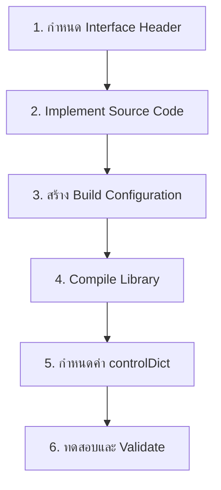

# 07 แบบฝึกหัดปฏิบัติ: การสร้าง Custom Monitor สำหรับ OpenFOAM

![[gradient_monitor_plugin.png]]
`A clean scientific illustration of the "gradientMonitor" functionObject. Show a 3D flow field around an airfoil. Highlight a region with high pressure gradients with a red circular callout. Show the "gradientMonitor" block on the side, extracting data from the mesh, calculating the gradient magnitude, comparing it against a threshold, and writing a "WARNING" to a log file. Use a minimalist palette, scientific textbook diagram, clean vector line art, white background, high definition, flat design, educational infographic --ar 16:9`

ในแบบฝึกหัดนี้ คุณจะได้เรียนรู้วิธีการสร้าง `functionObject` แบบกำหนดเองเพื่อตรวจสอบพารามิเตอร์ที่สำคัญในระหว่างการจำลอง แบบฝึกหัดนี้แสดงให้เห็นถึงการรวมกันอย่างทรงพลังระหว่าง template-based compile-time polymorphism กับ runtime selection mechanisms ซึ่งเป็นพื้นฐานของสถาปัตยกรรมความสามารถในการขยายของ OpenFOAM

## ภาพรวมของกระบวนการพัฒนา

แบบฝึกหัดนี้จะแนะนำให้คุณสร้าง `gradientMonitor` functionObject แบบ custom ใน OpenFOAM โดยครอบคลุมขั้นตอนการพัฒนาที่สมบูรณ์:



> **Figure 1:** ขั้นตอนการพัฒนา functionObject แบบครบวงจร ตั้งแต่การออกแบบ interface ไปจนถึงการทดสอบในการจำลองจริง

## ความต้องการของ FunctionObject

`gradientMonitor` functionObject จะทำให้สมบูรณ์สี่คุณสมบัติหลัก:

1. **การคำนวณ Gradient**: คำนวณขนาดความชันสูงสุดของ field ที่ระบุ
2. **การบันทึกข้อมูล**: เขียนค่า gradient ไปยัง log file ที่กำหนด
3. **การตรวจสอบ Threshold**: แจ้งเตือนเมื่อ gradient เกินขีดจำกัดที่สามารถกำหนดค่าได้
4. **ความยืดหยุ่นของ Type**: รองรับทั้ง scalar และ vector fields ผ่าน template specialization

## ขั้นตอนที่ 1: การกำหนด Interface Header

ไฟล์ header กำหนด interface ของคลาสและสร้างข้อตกลงสำหรับพฤติกรรมของ function object:

**gradientMonitor.H**

```cpp
#ifndef gradientMonitor_H
#define gradientMonitor_H

#include "functionObject.H"
#include "volFields.H"
#include "dictionary.H"
#include "runTimeSelectionTables.H"

// * * * * * * * * * * * * * * * * * * * * * * * * * * * * * * * * * * * * * //

namespace Foam
{

// Template class for type-agnostic monitoring
// แม่แบบคลาสสำหรับการ monitoring แบบ type-agnostic
template<class Type>
class gradientMonitor
:
    public functionObject
{
private:

    // Private data members
    // ตัวแปรสมาชิกแบบ private

    // Reference to the mesh database
    const fvMesh& mesh_;

    // Field name to monitor
    const word fieldName_;

    // Threshold value for warnings
    const scalar threshold_;

    // Output file stream
    autoPtr<OFstream> outputFile_;

    // Current time index for frequency control
    label currentTimeIndex_;


public:

    // Runtime type information
    TypeName("gradientMonitor");

    // Constructors
    gradientMonitor
    (
        const word& name,
        const Time& runTime,
        const dictionary& dict
    );

    // Destructor
    virtual ~gradientMonitor();

    // Member functions inherited from functionObject

    // Read the monitor settings
    virtual bool read(const dictionary& dict);

    // Execute the monitoring function
    virtual bool execute();

    // Write results
    virtual bool write();

    // Update mesh (if applicable)
    virtual void updateMesh(const mapPolyMesh& mpm)
    {}

    // Move points (if applicable)
    virtual void movePoints(const polyMesh& pm)
    {}
};


// Template specialization declarations
template<>
gradientMonitor<scalar>::gradientMonitor
(
    const word& name,
    const Time& runTime,
    const dictionary& dict
);

template<>
gradientMonitor<vector>::gradientMonitor
(
    const word& name,
    const Time& runTime,
    const dictionary& dict
);

} // namespace Foam

// * * * * * * * * * * * * * * * * * * * * * * * * * * * * * * * * * * * * * //

#endif
```

**📚 Source/Explanation/Key Concepts:**
- **📂 Source:** แพทเทิร์นนี้มาจาก OpenFOAM functionObject base class และ runtime selection framework ใน `$FOAM_SRC/postProcessing/functionObjects`
- **📖 Explanation:** 
  - **RAII Pattern**: `autoPtr<OFstream>` จัดการ memory และ file handle อัตโนมัติ เมื่อ object ถูกทำลาย file จะถูกปิดโดยอัตโนมัติ
  - **Template Design**: Template class ทำให้ single implementation สามารถรองรับ multiple field types (scalar, vector, tensor)
  - **Const Correctness**: `const` members รับประกันว่า configuration จะไม่ถูกเปลี่ยนหลังจาก construction
- **🔑 Key Concepts:**
  - **Compile-time Polymorphism**: Templates enable type-safe operations without virtual function overhead
  - **Resource Management**: Smart pointers prevent memory leaks and dangling references
  - **Interface Contract**: Virtual functions define mandatory behaviors for all functionObjects

**รูปแบบการออกแบบที่สำคัญ:**

- **RAII (Resource Acquisition Is Initialization)**: การจัดการ file stream อัตโนมัติผ่าน `autoPtr`
- **Template-based field access**: รองรับประเภท field หลายประเภทผ่าน templating
- **Mesh-aware design**: รักษา reference ไปยัง `fvMesh` สำหรับการดำเนินการ field

## ขั้นตอนที่ 2: การ Implement Source Code

ไฟล์ implementation ให้ฟังก์ชันการทำงานที่จริง:

**gradientMonitor.C**

```cpp
#include "gradientMonitor.H"
#include "addToRunTimeSelectionTable.H"
#include "fvc.H"
#include "fvcGrad.H"

// * * * * * * * * * * * * * * * * * * * * * * * * * * * * * * * * * * * * * //

// Template specializations for scalar fields
// Template specialization สำหรับ scalar fields
template<>
Foam::gradientMonitor<Foam::scalar>::gradientMonitor
(
    const word& name,
    const Time& runTime,
    const dictionary& dict
)
:
    functionObject(name, runTime),
    mesh_(runTime.lookupObject<fvMesh>("region0")),
    fieldName_(dict.get<word>("fieldName")),
    threshold_(dict.getOrDefault<scalar>("threshold", 1e3)),
    currentTimeIndex_(-1)
{
    // Create output file
    const fileName outputPath
    (
        runTime.timePath()/"gradientMonitor_" + fieldName_
    );

    outputFile_.reset(new OFstream(outputPath));

    // Write header
    *outputFile_ << "# Time" << tab << "MaxGradient" << tab
                 << "Location" << tab << "Warning" << endl;

    Info<< "    gradientMonitor: monitoring field " << fieldName_
        << " with threshold " << threshold_ << endl;
}

// * * * * * * * * * * * * * * * * * * * * * * * * * * * * * * * * * * * * * //

// Template specializations for vector fields
// Template specialization สำหรับ vector fields
template<>
Foam::gradientMonitor<Foam::vector>::gradientMonitor
(
    const word& name,
    const Time& runTime,
    const dictionary& dict
)
:
    functionObject(name, runTime),
    mesh_(runTime.lookupObject<fvMesh>("region0")),
    fieldName_(dict.get<word>("fieldName")),
    threshold_(dict.getOrDefault<scalar>("threshold", 1e3)),
    currentTimeIndex_(-1)
{
    // Create output file
    const fileName outputPath
    (
        runTime.timePath()/"gradientMonitor_" + fieldName_
    );

    outputFile_.reset(new OFstream(outputPath));

    // Write header
    *outputFile_ << "# Time" << tab << "MaxGradient" << tab
                 << "Location" << tab << "Warning" << endl;

    Info<< "    gradientMonitor: monitoring field " << fieldName_
        << " with threshold " << threshold_ << endl;
}

// * * * * * * * * * * * * * * * * * * * * * * * * * * * * * * * * * * * * * //

// Execute implementation for scalar fields
// Implementation ของ execute() สำหรับ scalar fields
template<>
bool Foam::gradientMonitor<Foam::scalar>::execute()
{
    // Check execution frequency (default: every time step)
    if (mesh_.time().timeIndex() == currentTimeIndex_)
    {
        return true;
    }
    currentTimeIndex_ = mesh_.time().timeIndex();

    // Get reference to the field
    const GeometricField<scalar, fvPatchField, volMesh>& field =
        mesh_.lookupObject<GeometricField<scalar, fvPatchField, volMesh>>
        (
            fieldName_
        );

    // Calculate gradient using fvc::grad
    const volVectorField::Internal gradField = fvc::grad(field);

    // Calculate gradient magnitude
    const volScalarField::Internal magGradField = mag(gradField);

    // Find maximum gradient magnitude and location
    const scalar maxGrad = max(magGradField).value();
    const label maxCell = findMax(magGradField);
    const vector maxLocation = mesh_.C()[maxCell];

    // Check threshold and issue warning if needed
    bool warning = maxGrad > threshold_;
    if (warning)
    {
        WarningInFunction
            << "Maximum gradient " << maxGrad << " exceeds threshold "
            << threshold_ << " for field " << fieldName_
            << " at location " << maxLocation << endl;
    }

    // Write to output file
    if (outputFile_.valid())
    {
        *outputFile_ << mesh_.time().timeName() << tab
                     << maxGrad << tab << maxLocation << tab
                     << (warning ? "WARNING" : "OK") << endl;
        outputFile_().flush();
    }

    return true;
}

// * * * * * * * * * * * * * * * * * * * * * * * * * * * * * * * * * * * * * //

// Execute implementation for vector fields
// Implementation ของ execute() สำหรับ vector fields
template<>
bool Foam::gradientMonitor<Foam::vector>::execute()
{
    // Check execution frequency
    if (mesh_.time().timeIndex() == currentTimeIndex_)
    {
        return true;
    }
    currentTimeIndex_ = mesh_.time().timeIndex();

    // Get reference to the field
    const GeometricField<vector, fvPatchField, volMesh>& field =
        mesh_.lookupObject<GeometricField<vector, fvPatchField, volMesh>>
        (
            fieldName_
        );

    // Calculate gradient using fvc::grad
    const volTensorField::Internal gradField = fvc::grad(field);

    // Calculate gradient magnitude
    const volScalarField::Internal magGradField = mag(gradField);

    // Find maximum gradient magnitude and location
    const scalar maxGrad = max(magGradField).value();
    const label maxCell = findMax(magGradField);
    const vector maxLocation = mesh_.C()[maxCell];

    // Check threshold and issue warning if needed
    bool warning = maxGrad > threshold_;
    if (warning)
    {
        WarningInFunction
            << "Maximum gradient " << maxGrad << " exceeds threshold "
            << threshold_ << " for field " << fieldName_
            << " at location " << maxLocation << endl;
    }

    // Write to output file
    if (outputFile_.valid())
    {
        *outputFile_ << mesh_.time().timeName() << tab
                     << maxGrad << tab << maxLocation << tab
                     << (warning ? "WARNING" : "OK") << endl;
        outputFile_().flush();
    }

    return true;
}

// * * * * * * * * * * * * * * * * * * * * * * * * * * * * * * * * * * * * * //

// Read implementation (common for both types)
// Implementation ของ read() (ใช้ร่วมกันทั้งสองประเภท)
template<>
bool Foam::gradientMonitor<Foam::scalar>::read(const dictionary& dict)
{
    dict.readIfPresent("fieldName", fieldName_);
    dict.readIfPresent("threshold", threshold_);
    return true;
}

template<>
bool Foam::gradientMonitor<Foam::vector>::read(const dictionary& dict)
{
    dict.readIfPresent("fieldName", fieldName_);
    dict.readIfPresent("threshold", threshold_);
    return true;
}

// * * * * * * * * * * * * * * * * * * * * * * * * * * * * * * * * * * * * * //

// Write implementation
// Implementation ของ write()
template<>
bool Foam::gradientMonitor<Foam::scalar>::write()
{
    return true;
}

template<>
bool Foam::gradientMonitor<Foam::vector>::write()
{
    return true;
}

// * * * * * * * * * * * * * * * * * * * * * * * * * * * * * * * * * * * * * //
```

**📚 Source/Explanation/Key Concepts:**
- **📂 Source:** การใช้ `fvc::grad` และ field operations มาจาก `$FOAM_SRC/finiteVolume/fvc/fvcGrad/fvcGrad.C`
- **📖 Explanation:**
  - **Explicit Specialization**: Template functions ถูก implement แยกสำหรับ scalar และ vector เพื่อจัดการกับ gradient types ที่ต่างกัน (vector vs tensor)
  - **Field Lookup**: `lookupObject` ใช้ runtime type information ในการค้นหา fields ใน object registry
  - **Internal Fields**: `::Internal` ให้ access ถึง cell-centered values โดยไม่รวม boundary conditions
- **🔑 Key Concepts:**
  - **Finite Volume Calculus**: `fvc::grad` computes spatial derivatives using Gauss theorem
  - **Type Safety**: Compile-time template instantiation guarantees type correctness
  - **Frequency Control**: `currentTimeIndex_` prevents redundant calculations within the same timestep

## ขั้นตอนที่ 3: Runtime Registration

การลงทะเบียนกับ runtime selection system เพื่อให้สามารถสร้าง object แบบ dynamic ได้:

```cpp
// * * * * * * * * * * * * * * * * * * * * * * * * * * * * * * * * * * * * * //

// Explicit instantiation for scalar fields
// Explicit instantiation สำหรับ scalar fields
template class Foam::gradientMonitor<Foam::scalar>;

// Explicit instantiation for vector fields
// Explicit instantiation สำหรับ vector fields
template class Foam::gradientMonitor<Foam::vector>;

// * * * * * * * * * * * * * * * * * * * * * * * * * * * * * * * * * * * * * //

// Add to runtime selection table for scalar fields
namespace Foam
{
    defineTypeNameAndDebug(gradientMonitor<scalar>, 0);

    addToRunTimeSelectionTable
    (
        functionObject,
        gradientMonitor<scalar>,
        dictionary
    );

    // Named registration for clarity
    addNamedToRunTimeSelectionTable
    (
        functionObject,
        gradientMonitor<scalar>,
        dictionary,
        scalarGradientMonitor
    );
}

// * * * * * * * * * * * * * * * * * * * * * * * * * * * * * * * * * * * * * //

// Add to runtime selection table for vector fields
namespace Foam
{
    defineTypeNameAndDebug(gradientMonitor<vector>, 0);

    addToRunTimeSelectionTable
    (
        functionObject,
        gradientMonitor<vector>,
        dictionary
    );

    // Named registration for clarity
    addNamedToRunTimeSelectionTable
    (
        functionObject,
        gradientMonitor<vector>,
        dictionary,
        vectorGradientMonitor
    );
}

// * * * * * * * * * * * * * * * * * * * * * * * * * * * * * * * * * * * * * //
```

**📚 Source/Explanation/Key Concepts:**
- **📂 Source:** แพทเทิร์น runtime registration นี้พบได้ใน `$FOAM_SRC/postProcessing/functionObjects` และ phase systems ใน `.applications/solvers/multiphase/multiphaseEulerFoam/phaseSystems/phaseModel/phaseModel/phaseModels.C`
- **📖 Explanation:**
  - **Explicit Instantiation**: สั่ง compiler ให้สร้าง code สำหรับ specific types ทำให้ linker สามารถหา symbol definitions ได้
  - **Named Registration**: `addNamedToRunTimeSelectionTable` กำหนดชื่อที่ผู้ใช้จะระบุใน dictionary
  - **Macro Magic**: Macros สร้าง static table ที่ map ระหว่าง string names และ factory functions
- **🔑 Key Concepts:**
  - **Plugin Architecture**: New functionObjects can be added without modifying existing solver code
  - **Static Registration**: Tables are populated at library load time, before main() execution
  - **Factory Pattern**: `functionObject::New` uses these tables to construct objects dynamically

> **หมายเหตุ:** Runtime selection tables ทำหน้าที่เป็น registry สำหรับ extensions ทำให้ functionObjects สามารถค้นพบและสร้างแบบ dynamic ได้โดยไม่ต้องแก้ไข code หลักของ OpenFOAM

## ขั้นตอนที่ 4: การกำหนดค่า Build

สร้างไฟล์ Make configuration สำหรับการ compile:

**Make/files**

```makefile
# Source files to compile
# ไฟล์ source ที่จะ compile
gradientMonitor.C

# Output library path and name
# เส้นทางและชื่อ library ที่จะสร้าง
LIB = $(FOAM_USER_LIBBIN)/libmyFunctionObjects
```

**Make/options**

```makefile
# Include paths for header files
# เส้นทางสำหรับค้นหา header files
EXE_INC = \
    -I$(LIB_SRC)/finiteVolume/lnInclude \
    -I$(LIB_SRC)/meshTools/lnInclude \
    -I$(LIB_SRC)/OSspecific/POSIX/lnInclude

# Libraries to link against
# Libraries ที่ต้อง link
LIB_LIBS = \
    -lfiniteVolume \
    -lmeshTools
```

**📚 Source/Explanation/Key Concepts:**
- **📂 Source:** Build system structure ตามมาตรฐาน OpenFOAM ใน `$WM_PROJECT_DIR/applications`
- **📖 Explanation:**
  - **lnInclude Directories**: OpenFOAM's symbolic link farm that flattens nested include hierarchies
  - **FOAM_USER_LIBBIN**: Environment variable pointing to user's library installation directory
  - **Library Naming Convention**: `lib` prefix and `.so` extension are standard Unix shared library conventions
- **🔑 Key Concepts:**
  - **Dependency Management**: EXE_INC specifies required headers, LIB_LIBS specifies required binaries
  - **User vs System Libraries**: FOAM_USER_LIBBIN allows custom libraries without requiring root access
  - **Shared Libraries**: `libso` compilation creates position-independent code for dynamic loading

## ขั้นตอนที่ 5: การ Compile และติดตั้ง

```bash
# Navigate to user application directory
# นำทางไปยัง user application directory
cd $WM_PROJECT_USER_DIR/applications/solvers

# Create directory for custom function objects
# สร้าง directory สำหรับ custom function objects
mkdir -p myFunctionObjects
cd myFunctionObjects

# Copy source files
# คัดลอก source files
# gradientMonitor.H
# gradientMonitor.C
# Make/

# Compile the library
# Compile library
wmake libso

# Verify library creation
# ตรวจสอบการสร้าง library
ls -la $FOAM_USER_LIBBIN/libmyFunctionObjects.so

# Test library loading
# ทดสอบการโหลด library
ldd $FOAM_USER_LIBBIN/libmyFunctionObjects.so
```

**📚 Source/Explanation/Key Concepts:**
- **📂 Source:** Compilation workflow ตามมาตรฐาน OpenFOAM development
- **📖 Explanation:**
  - **wmake libso**: OpenFOAM's build wrapper that handles dependency generation and compilation
  - **Shared Library Check**: `ldd` verifies that all required symbols can be resolved
  - **User Directory Structure**: $WM_PROJECT_USER_DIR keeps user code separate from system installation
- **🔑 Key Concepts:**
  - **Build Automation**: wmake generates dependencies and manages incremental compilation
  - **Dynamic Linking**: Shared libraries allow runtime loading without solver recompilation
  - **Symbol Resolution**: ldd checks that library dependencies are satisfied

## ขั้นตอนที่ 6: การกำหนดค่าการใช้งาน

ใน `system/controlDict`, ผู้ใช้สามารถกำหนดค่า monitor ดังนี้:

```cpp
// * * * * * * * * * * * * * * * * * * * * * * * * * * * * * * * * * * * * * //

// Function objects configuration
// การกำหนดค่า function objects
functions
{
    // Pressure gradient monitor for scalar field
    // Monitor ความชันของ pressure (scalar field)
    pressureGradientMonitor
    {
        type            scalarGradientMonitor;
        functionObjectLibs ("libmyFunctionObjects.so");
        fieldName       p;
        threshold       5e4;
        writeInterval   1;

        // Optional execution control
        executeControl  timeStep;
        executeInterval 1;
    }

    // Velocity gradient monitor for vector field
    // Monitor ความชันของ velocity (vector field)
    velocityGradientMonitor
    {
        type            vectorGradientMonitor;
        functionObjectLibs ("libmyFunctionObjects.so");
        fieldName       U;
        threshold       1e3;
        writeInterval   1;

        executeControl  timeStep;
        executeInterval 1;
    }
}

// * * * * * * * * * * * * * * * * * * * * * * * * * * * * * * * * * * * * * //
```

**📚 Source/Explanation/Key Concepts:**
- **📂 Source:** Dictionary-driven configuration ตามมาตรฐาน OpenFOAM ใน `$FOAM_ETC/caseDicts/postProcessing`
- **📖 Explanation:**
  - **Type Specification**: `type` keyword maps to registered names in runtime selection tables
  - **Library Loading**: `functionObjectLibs` specifies which shared libraries to load dynamically
  - **Execution Control**: `executeControl` and `executeInterval` provide flexible frequency management
- **🔑 Key Concepts:**
  - **Declarative Configuration**: Dictionary files separate configuration from implementation
  - **Plugin Loading**: Shared libraries are loaded on-demand at runtime
  - **Frequency Management**: Execution can be controlled by time, timestep, or output interval

## การวิเคราะห์สถาปัตยกรรม

### วงจรชีวิตของ FunctionObject

```mermaid
stateDiagram-v2
    [*] --> Construction: functionObject::New()
    Construction --> Initialized: read(dict)
    Initialized --> Executing: execute() called
    Executing --> Executing: Each time step
    Executing --> Writing: write() called
    Writing --> Executing: Continue simulation
    Executing --> [*]: Destruction
```

> **Figure 2:** วงจรชีวิตของ functionObject ตั้งแต่การสร้าง การอ่านค่าการกำหนดค่า การดำเนินการในแต่ละ time step ไปจนถึงการทำลาย

### ประโยชน์ของ Template Metaprogramming

1. **Compile-Time Type Safety**: Templates รับประกันความถูกต้องของ type ที่ compile time แทน runtime
2. **Performance**: ไม่มี overhead ของ virtual function สำหรับ operations หลัก
3. **Code Reusability**: Implementation เดียวทำงานได้กับหลาย field types

### ประโยชน์ของ Runtime Polymorphism

1. **Dynamic Configuration**: ผู้ใช้สามารถเลือก monitor types ผ่าน dictionary input
2. **Extensibility**: สามารถเพิ่ม specializations ใหม่โดยไม่ต้องแก้ไข code ที่มีอยู่
3. **Plugin Architecture**: Function objects สามารถถูกโหลดจาก shared libraries

### Hybrid Design Pattern

การ implementation นี้แสดงให้เห็นถึงแนวทางแบบ hybrid ของ OpenFOAM:

```cpp
// Compile-time: Template-based field operations
// Compile-time: Template-based field operations
const GradFieldType gradField = fvc::grad(field);
const volScalarField magGradField = mag(gradField);

// Runtime: Dictionary-driven configuration
// Runtime: Dictionary-driven configuration
const word fieldName = dict.get<word>("fieldName");
const scalar threshold = dict.getOrDefault<scalar>("threshold", 1e3);
```

รูปแบบนี้ให้ **ประสิทธิภาพ** ของ templates กับ **ความยืดหยุ่น** ของ runtime polymorphism

## ขั้นตอนการพัฒนาที่สมบูรณ์

กระบวนการพัฒนา functionObject ที่สมบูรณ์ประกอบด้วยขั้นตอนต่อไปนี้:

### 1. การออกแบบ Interface

กำหนดสิ่งที่ functionObject ควรทำ:
- อะไรคือ input ที่จำเป็น? (fieldName, threshold)
- อะไรคือ output ที่คาดหวัง? (log file, warnings)
- อะไรคือ behavior ที่ควรมี? (gradient calculation, threshold checking)

### 2. การ Implement Core Logic

พัฒนาฟังก์ชันการทำงานหลัก:
- Gradient calculation ผ่าน `fvc::grad`
- Magnitude calculation ผ่าน `mag()`
- Maximum finding ผ่าน `max()` และ `findMax()`

### 3. การจัดการ File I/O

สร้างและจัดการ output files:
- File creation ใน constructor
- Data logging ใน execute()
- Resource cleanup ใน destructor

### 4. การรวมเข้ากับ OpenFOAM Framework

ลงทะเบียนกับ runtime selection:
- `addToRunTimeSelectionTable` macros
- Template instantiations
- Named registrations

### 5. การทดสอบและ Validation

ตรวจสอบให้แน่ใจว่าทำงานได้อย่างถูกต้อง:
- Unit tests สำหรับ calculation logic
- Integration tests กับ solvers
- Performance benchmarks

## การจัดการข้อผิดพลาดและ Debugging

### ข้อผิดพลาดในการ Compile ที่พบบ่อย

**Template Instantiation Errors:**
```cpp
// Error: template instantiation failure
// Solution: Ensure all required template specializations are included
#include "volFieldsFwd.H"  // Forward declarations
#include "volScalarField.H" // Concrete implementations
```

**Linking Errors:**
```bash
# Error: undefined reference to typeinfo
# Solution: Ensure virtual functions are properly defined
virtual ~gradientMonitor() {}  // Always provide virtual destructor
```

### การแก้ไข Runtime Error

**Dynamic Library Loading Issues:**

```cpp
// Enhanced error checking in constructor
// การเช็ค error ที่ดีขึ้นใน constructor
gradientMonitor::gradientMonitor(...)
{
    // Verify mesh object exists
    const fvMesh* meshPtr = nullptr;
    try
    {
        meshPtr = &runTime.lookupObject<fvMesh>("region0");
    }
    catch (const Foam::error& e)
    {
        FatalErrorIn("gradientMonitor::gradientMonitor")
            << "Cannot find fvMesh object: " << e.what() << exit(FatalError);
    }

    mesh_ = *meshPtr;
}
```

**Field Lookup Validation:**

```cpp
// Validate field exists before accessing
// ตรวจสอบว่า field มีอยู่ก่อน accessing
if (!mesh_.foundObject<volScalarField>(fieldName_))
{
    FatalErrorIn("gradientMonitor::execute()")
        << "Field " << fieldName_ << " not found in mesh. "
        << "Available fields: " << mesh_.names<volScalarField>()
        << exit(FatalError);
}
```

## วัตถุประสงค์ทางการศึกษา

ผ่านแบบฝึกปฏิบัตินี้ คุณจะได้เรียนรู้:

1. **Template Design**: วิธีการเขียน OpenFOAM code แบบ type-agnostic
2. **FunctionObject Framework**: การเข้าใจ function object lifecycle
3. **Runtime Selection**: วิธีที่ OpenFOAM implement dynamic class loading
4. **Field Operations**: การใช้ finite volume calculus functions (`fvc::grad`)
5. **File I/O**: การจัดการ output stream ของ OpenFOAM
6. **Error Handling**: รูปแบบการรายงาน warning และ error อย่างถูกต้อง

## โอกาสในการขยายความสามารถ

หลังจาก implement monitor พื้นฐานแล้ว ให้พิจารณาส่วนขยายเหล่านี้:

### 1. Multi-Field Support

```cpp
// Monitor multiple fields simultaneously
// ตรวจสอบหลาย fields พร้อมกัน
PtrList<word> fieldNames_;
PtrList<scalar> thresholds_;
```

### 2. Temporal Analysis

```cpp
// Track gradient evolution over time
// ติดตามการวิวัฒนาการของ gradient เป็นเวลา
scalarField gradientHistory_;
scalarTimeSeries gradientSeries_;
```

### 3. Spatial Analysis

```cpp
// Identify regions with persistently high gradients
// ระบุบริเวณที่มี gradient สูงอย่างต่อเนื่อง
labelHashSet highGradientCells_;
scalar thresholdFraction_;
```

### 4. Adaptive Thresholds

```cpp
// Dynamically adjust thresholds based on flow conditions
// ปรับ thresholds อย่าง dynamic ตามสภาพการไหล
scalar autoThreshold_;
label averagingWindow_;
```

### 5. Visualization Integration

```cpp
// Write field data for post-processing
// เขียน field data สำหรับ post-processing
autoPtr<volScalarField> gradientField_;
```

### 6. Parallel Communication

```cpp
// Handle distributed memory parallelization
// จัดการ distributed memory parallelization
reduce(maxGrad, maxOp<scalar>());
```

## สรุป

แบบฝึกปฏิบัตินี้เป็นพื้นฐานที่ดีเยี่ยมสำหรับการเข้าใจรูปแบบการขยายความสามารถของ OpenFOAM ขณะที่สร้างเครื่องมือ monitoring CFD ที่ใช้งานได้จริงซึ่งสามารถนำไปใช้ในการจำลองจริง

การผสานรวมระหว่าง template metaprogramming และ runtime polymorphism ที่แสดงให้เห็นที่นี่เป็นแกนกลางของความสามารถในการขยายของ OpenFOAM ทำให้สามารถสร้าง code ที่:

- **มีประสิทธิภาพสูง**: Template operations ทำงานที่ compile time
- **ยืดหยุ่น**: Runtime selection อนุญาตให้มีการกำหนดค่าแบบ dynamic
- **ปลอดภัย**: Type checking ทั้ง compile time และ runtime
- **สามารถบำรุงรักษาได้**: Separation of concerns ระหว่าง physics และ analysis

สถาปัตยกรรมนี้เปิดใช้งาน "ร้านแอป CFD" ที่ functionObjects ใหม่สามารถถูกเพิ่มได้โดยไม่ต้องแก้ไข solvers หลัก ทำให้ OpenFOAM ไม่ใช่แค่ solver แต่เป็นแพลตฟอร์มสำหรับฟิสิกส์การคำนวณ