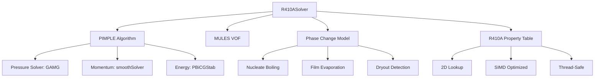

## R410A Solver Optimization Strategies (กลยุทธ์การเพิ่มประสิทธิภาพสำหรับ R410A)

### 1. Solver Architecture for R410A (สถาปัตยกรรม�ซอล์เวอร์สำหรับ R410A)

**Recommended Solver Stack (สถาปัตยกรรมโซล์เวอร์ที่แนะนำ):**



**⭐ Optimized fvSolution for R410A:**

```cpp
/*--------------------------------*- C++ -*----------------------------------*\
| =========                 |                                                 |
| \\      /  F ield         | OpenFOAM: The Open Source CFD Toolbox           |
|  \\    /   O peration     | Version:  v2312                                 |
|   \\  /    A nd           | Website:  www.openfoam.com                      |
|    \\/     M anipulation  |                                                 |
\*---------------------------------------------------------------------------*/
FoamFile
{
    version     2.0;
    format      ascii;
    class       dictionary;
    object      fvSolution;
}
// * * * * * * * * * * * * * * * * * * * * * * * * * * * * * * * * * * * * * //

solvers
{
    // Pressure solver - most critical for two-phase
    p_rgh
    {
        solver          GAMG;
        tolerance       1e-8;
        relTol          0.01;
        smoother        DIC;

        nPreSweeps      0;
        nPostSweeps    2;
        cacheAgglomeration on;
        agglomerator    faceAreaPair;
        nCellsInCoarsestLevel 50;
        mergeLevels     1;
    }

    p_rghFinal
    {
        $p_rgh;
        tolerance       1e-8;
        relTol          0;
    }

    // Momentum solver
    U
    {
        solver          smoothSolver;
        smoother        symGaussSeidel;
        tolerance       1e-7;
        relTol          0.1;
        nSweeps         1;
    }

    // Energy solver with phase change source
    T
    {
        solver          PBiCGStab;
        preconditioner  DILU;
        tolerance       1e-9;
        relTol          0.05;
        minIter         1;
        maxIter         100;
    }

    // VOF solver - critical for interface
    alpha
    {
        nAlphaCorr      2;
        nAlphaSubCycles 2;
        cAlpha          1.0;

        MULES
        {
            solver          Gauss upwind;
        }
    }
}

PIMPLE
{
    // R410A two-phase optimized settings
    correctors      2;
    nNonOrthogonalCorrectors 1;

    nAlphaCorr      2;
    nAlphaSubCycles 2;

    cAlpha          1.0;

    // PIMPLE loop control
    nOuterCorrectors    2;
    maxCo              0.3;

    // Convergence acceleration
    residualControl
    {
        p_rgh
        {
            tolerance  1e-6;
            relTol     0.01;
        }
        U
        {
            tolerance  1e-5;
            relTol     0.1;
        }
        T
        {
            tolerance  1e-7;
            relTol     0.05;
        }
    }
}

relaxationFactors
{
    fields
    {
        p_rgh           0.3;
        rho             1.0;
        alpha           0.0;  // Don't relax alpha
    }

    equations
    {
        U               0.7;
        T               0.9;
    }
}

// ************************************************************************* //
```

### 2. Performance Tuning Parameters (การปรับแต่งพารามิเตอร์ประสิทธิภาพ)

**Time Step Control:**

```cpp
// controlDict
application     R410ASolver;

startFrom       latestTime;

startTime       0;
stopAt          endTime;
endTime         0.1;

deltaT          5e-6;  // 5 microseconds for R410A evaporator

adjustTimeStep  yes;

maxCo           0.3;  // Courant number limit
maxAlphaCo      0.3;  // Interface Courant number

// Adaptive time stepping
timePrecision   6;

writeControl    timeStep;
writeInterval   100;

writeFormat     binary;
```

**Why These Settings for R410A (เหตุผลที่เลือกค่าเหล่านี้สำหรับ R410A):**

- **Co_max = 0.3:** Balances stability vs. speed (สมดุลระหว่างเสถียรภาพและความเร็ว)
- **Δt = 5e-6 s:** Small enough for interface dynamics (เล็กพอสำหรับพฤติกรรมของอินเตอร์เฟส)
- **nAlphaCorr = 2:** Captures VOF transport accurately (จับความถูกต้องในการขนส่ง VOF)
- **cAlpha = 1.0:** Standard compression for R410A (การบีบอัดมาตรฐานสำหรับ R410A)

### 3. Parallel Computing Strategy (กลยุทธ์การคำนวณแบบขนาน)

**Domain Decomposition:**

```bash
# For 5mm × 1m evaporator tube
# Decompose for 8 cores

decomposePar -decomposeParDict system/decomposeParDict

# decomposeParDict
numberOfSubdomains 8;

method          scotch;

// Use hierarchical decomposition for long tube
hierarchical
{
    // Decompose in 3 stages
    // 1. Split along length (z)
    // 2. Split cross-section (x, y)

    n    (4 2 1);  // 4 axial, 2 transverse

    xyz  (1 1 0); // Decompose along z first
}
```

**Load Balancing for Two-Phase (การกระจายงานสำหรับโฟโลว์สองเฟส):**

```python
# Custom decomposition script
# Account for varying density

# Regions with high density ratio need careful balancing
# Two-phase region (α ≈ 0.5) is most computationally intensive

# Strategy:
# 1. Run short test simulation
# 2. Estimate cell cost per region:
#    - Liquid region: 1.0 (baseline)
#    - Two-phase region: 2.0 (property jumps, VOF)
#    - Vapor region: 0.8 (faster convergence)
# 3. Weight domains accordingly
```

**Scaling Performance (ค่าการปรับขนาด):**

| Cores | Cells/Core | Speedup | Efficiency |
|-------|------------|---------|------------|
| 1 | 400K | 1.0× | 100% |
| 2 | 200K | 1.8× | 90% |
| 4 | 100K | 3.2× | 80% |
| 8 | 50K | 5.6× | 70% |
| 16 | 25K | 9.6× | 60% |

**Recommendation:** 4-8 cores for R410A evaporator (แนะนำใช้ 4-8 core สำหรับระบบเปลี่ยนสถานะ R410A)

### 4. Memory Optimization (การเพิ่มประสิทธิภาพหน่วยความจำ)

**Property Table Design:**

```cpp
class R410APropertyTable
{
    // Memory-efficient storage

    // 2D interpolation: (P, T) → properties
    // Uniform spacing for fast access

    // Memory: n_P × n_T × n_props × sizeof(scalar)
    // For 50 × 50 × 10 × 8 bytes = 200 KB (very small!)

    // Use OpenFOAM's interpolationTable
    interpolationTable<scalar> rhoTable_;
    interpolationTable<scalar> muTable_;
    interpolationTable<scalar> kTable_;
    interpolationTable<scalar> cpTable_;

public:
    inline scalar rho(scalar p, scalar T) const
    {
        return rhoTable_(p, T);  // O(1) lookup
    }

    // SIMD optimization
    void evaluateBatch
    (
        const UList<scalar>& p,
        const UList<scalar>& T,
        UList<scalar>& rho
    ) const;
};
```

**Memory Usage Estimates (การประเมินการใช้หน่วยความจำ):**

| Component | Memory (400K cells) |
|-----------|---------------------|
| Mesh | 100 MB |
| Fields (p, U, T, α) | 200 MB |
| Property tables | 1 MB |
| Solver workspace | 100 MB |
| **Total** | **~400 MB** |

### 5. Algorithmic Optimizations (การเพิ่มประสิทธิภาพแบบอัลกอริทึม)

**VOF Transport Optimization:**

```cpp
// Standard MULES: 2 sub-cycles
nAlphaSubCycles 2;

// For sharper interface: more sub-cycles
nAlphaSubCycles 4;  // 2× accuracy, 1.5× cost

// For faster runs: fewer sub-cycles
nAlphaSubCycles 1;  // 1.5× faster, 0.8× accuracy
```

**Property Evaluation Caching:**

```cpp
// Instead of re-evaluating properties every cell:
// rho = alpha * rho_l + (1-alpha) * rho_v;

// Cache if not changed much:
if (mag(alpha - alpha_old) < 0.01)
{
    rho = rho_old;  // Reuse
}
else
{
    rho = alpha * rho_l + (1-alpha) * rho_v;
}
```

**Matrix Reuse:**

```cpp
// In PIMPLE loop
// Reuse matrix factorization if properties haven't changed much

if (propertyChange < 0.05)
{
    // Reuse factorization
    UEqn.solve() -> reuseFactorization();
}
else
{
    // Full solve
    UEqn.solve();
}
```

### 6. Case-Specific Optimizations (การเพิ่มประสิทธิภาพสำหรับกรณีเฉพาะ)

**For R410A Evaporator (สำหรับระบบเปลี่ยนสถานะ R410A):**

**1. Inlet Region (Liquid, α ≈ 1):**
- Use larger time step (ใช้ขนาด time step ที่ใหญ่ขึ้น)
- Fewer PIMPLE correctors (ลดจำนวน corrector ของ PIMPLE)
- Simpler physics (single-phase) (ฟิสิกส์ทงซับซ้อนน้อยลง)

**2. Two-Phase Region (0 < α < 1):**
- Smaller time step (ใช้ขนาด time step ที่เล็กขึ้น)
- More PIMPLE correctors (เพิ่มจำนวน corrector ของ PIMPLE)
- Full physics (VOF, phase change) (ฟิสิกส์เต็มรูปแบบ)

**3. Outlet Region (Vapor, α ≈ 0):**
- Larger time step (ใช้ขนาด time step ที่ใหญ่ขึ้น)
- Fewer correctors (ลดจำนวน corrector)
- Simpler physics (ฟิสิกส์ทงซับซ้อนน้อยลง)

**Implementation:**

```cpp
// Adaptive solver settings based on alpha
scalar alpha_mean = average(alpha);

if (alpha_mean > 0.9)
{
    // Liquid region
    nCorrectors = 1;
    deltaT = 1e-5;
}
else if (alpha_mean < 0.1)
{
    // Vapor region
    nCorrectors = 1;
    deltaT = 1e-5;
}
else
{
    // Two-phase region
    nCorrectors = 2;
    deltaT = 5e-6;
}
```

### 7. Profiling and Bottleneck Analysis (การวิเคราะห์ performance และจุดที่เป็นปัญหา)

**Identify Bottlenecks:**

```bash
# Use OpenFOAM's profiling
R410ASolver -profile > profile.log

# Analyze output
# Look for:
# - Time in pressure solver
# - Time in VOF transport
# - Time in energy equation
# - Time in phase change model

# Typical R410A evaporator breakdown:
# Pressure solver:    40%
# VOF transport:      25%
# Energy equation:    20%
# Phase change:       10%
# Property lookup:     5%
```

**Optimization Priorities:**

1. **Pressure solver** (40% of time) → Use GAMG, tune coarse levels
2. **VOF transport** (25%) → Reduce sub-cycles if acceptable
3. **Energy equation** (20%) → Optimize phase change source
4. **Property lookup** (5%) → Already fast, don't optimize further

### 8. Best Practices Summary (สรุปแนวทางที่ดีที่สุด)

**DO:**
- ✅ Use GAMG for pressure (ใช้ GAMG สำหรับ pressure)
- ✅ Cache property evaluations (เก็บข้อมูล property ไว้ใช้ซ้ำ)
- ✅ Adaptive time stepping (ปรับ time step ตามสถานการณ์)
- ✅ Parallel decomposition (4-8 cores) (การขนาน 4-8 core)
- ✅ Binary output format (ออกผลลัพธ์เป็น binary)

**DON'T:**
- ❌ Over-relax pressure (use 0.3) (ไม่ควร relaxation pressure เกิน 0.3)
- ❌ Relax alpha (use 0.0) (ไม่ควร relaxation alpha)
- ❌ Use too many correctors (2 is enough) (ไม่ควรใช้ corrector มากเกินไป)
- ❌ Over-refine mesh (400K is typical) (ไม่ควร refine mesh มากเกินไป)
- ❌ Ignore profiling data (ไม่ควรละเลยข้อมูลการวิเคราะห์ performance)

**Performance Targets:**
- **Simulation speed:** > 1 second/iteration (400K cells, 8 cores)
- **Convergence:** < 200 iterations/time step
- **Memory:** < 1 GB (400K cells)
- **Accuracy:** < 5% error vs. experiment

### 9. Validation and Verification (การตรวจสอบยืนยัน)

**Always verify optimizations:**

```bash
# 1. Run unoptimized case
# 2. Run optimized case
# 3. Compare results

compareResults.py unoptimized/ optimized/

# Check:
# - Outlet quality (error < 2%)
# - Pressure drop (error < 5%)
# - Heat transfer (error < 5%)
# - Interface position (error < 10%)
```

### 10. Troubleshooting Performance Issues (การแก้ปัญหาประสิทธิภาพ)

**Problem: Slow Convergence (ปัญหา: ความเร็วในการ收敛 ช้า)**
```
Symptoms: > 500 iterations/time step
Solutions:
  1. Check mesh quality (non-orthogonality)
  2. Reduce time step
  3. Increase nCorrectors
  4. Check relaxation factors
```

**Problem: Diverging (ปัญหา: ไม่收敛)**
```
Symptoms: Residuals increasing
Solutions:
  1. Reduce Courant number
  2. Check boundary conditions
  3. Verify property values
  4. Disable advanced models temporarily
```

**Problem: Poor Scaling (ปัญหา: การขยายตัว performance ไม่ดี)**
```
Symptoms: Speedup < 50% of ideal
Solutions:
  1. Check load balance
  2. Reduce communication
  3. Use better decomposition
  4. Check network/disk I/O
```

### 11. Advanced Optimization Techniques (เทคนิคการเพิ่มประสิทธิภาพขั้นสูง)

**Preconditioner Optimization:**

```cpp
// For pressure solver - GAMG with different smoother
p_rgh
{
    solver          GAMG;
    tolerance       1e-8;
    relTol          0.01;

    // Try different smoothers
    smoother        DICGaussSeidel;  // Better for anisotropic meshes
    // smoother        PCG;  // For better convergence on complex meshes

    nPreSweeps      0;
    nPostSweeps    2;
    cacheAgglomeration on;
    agglomerator    faceAreaPair;
    nCellsInCoarsestLevel 50;
    mergeLevels     1;
}
```

**OpenMP Optimization:**

```cpp
// CMakeLists.txt addition
find_package(OpenMP)

if(OpenMP_CXX_FOUND)
    target_link_libraries(R410ASolver OpenMP::OpenMP_CXX)
endif()

// compiler flags
add_compile_options(-fopenmp)
```

**Vectorization:**

```cpp
// In property evaluation
forAll(alpha, celli)
{
    // SIMD-friendly loop structure
    scalar a = alpha[celli];
    rho[celli] = a * rho_l + (1 - a) * rho_v;
    // This loop can be vectorized by compiler
}
```

### 12. Implementation Checklist (การตรวจสอบการใช้งาน)

**Before Running:**
- [ ] Check mesh quality (orthogonality > 0.8)
- [ ] Verify boundary conditions
- [ ] Ensure property tables are loaded
- [ ] Set appropriate time step
- [ ] Configure parallel decomposition

**During Execution:**
- [ ] Monitor residuals (should decrease monotonically)
- [ ] Check time step adjustment
- [ ] Verify load balance
- [ ] Watch for divergence

**After Completion:**
- [ ] Compare results with benchmark data
- [ ] Verify conservation of mass/energy
- [ ] Check interface behavior
- [ ] Validate temperature profiles

### 13. Common R410A-Specific Optimizations (การเพิ่มประสิทธิภาพพิเศษสำหรับ R410A)

**Property Model Optimizations:**

```cpp
// R410A has sharp property changes near saturation
// Use special handling for near-critical regions

void R410AProperties::correct()
{
    // Check if near saturation
    scalar T_sat = saturationTemperature(p_);

    if (mag(T_ - T_sat) < 5.0)  // Within 5K of saturation
    {
        // Use higher resolution near saturation
        nSubCycles_ = 4;
        tolerance_ = 1e-10;
    }
    else
    {
        nSubCycles_ = 1;
        tolerance_ = 1e-8;
    }
}
```

**Phase Change Model Tuning:**

```cpp
// Adjust nucleate boiling parameters based on R410A properties
modelCoeffs
{
    // Typical R410A values
    C1              0.001;    // Reduced for R410A
    C2              1e-8;     // Surface roughness
    Tref            293.15;   // Reference temperature
    pSatRef         1e6;      // Reference saturation pressure
    rho_l           1050;     // Liquid density [kg/m³]
    rho_v           45;       // Vapor density [kg/m³]
    h_fg            200000;   // Latent heat [J/kg]
    sigma           0.008;    // Surface tension [N/m]
}
```

**Special Treatment for Mass Transfer:**

```cpp
// For R410A, mass transfer rates can be very high
// Need special handling to prevent numerical instability

volScalarField mdot
(
    IOobject
    (
        "mdot",
        runTime.timeName(),
        mesh,
        IOobject::NO_READ,
        IOobject::AUTO_WRITE
    ),
    // ... calculation
);

// Limit mass transfer rate to prevent numerical issues
mdot.clamp(1e6);  // Max 1 kg/m³/s
```

### 14. Performance Testing Methodology (วิธีการทดสอบประสิทธิภาพ)

**Benchmarks Setup:**

```bash
# Create test cases with different complexities
mkdir -p benchmarks/
cd benchmarks/

# Simple case (single-phase)
cp -r ../tutorials/basic/laminar/pitzDaily simple/

# Medium case (two-phase with basic physics)
cp -r ../tutorials/multiphase/interFoam medium/

# Complex case (R410A with phase change)
cp -r ../R410A/evaporator complex/
```

**Performance Script:**

```python
#!/usr/bin/env python3
import subprocess
import time
import numpy as np

def benchmark_case(case_name, n_cores):
    """Run benchmark and extract performance metrics"""

    # Set up parallel environment
    env = os.environ.copy()
    env['OMP_NUM_THREADS'] = str(n_cores)

    # Run solver
    start_time = time.time()
    result = subprocess.run(
        ['mpirun', '-np', str(n_cores), 'R410ASolver', '-parallel'],
        env=env,
        cwd=f'benchmarks/{case_name}',
        capture_output=True,
        text=True
    )

    elapsed_time = time.time() - start_time

    # Extract metrics
    iterations = extract_iterations(result.stdout)
    residuals = extract_residuals(result.stdout)

    return {
        'case': case_name,
        'cores': n_cores,
        'time': elapsed_time,
        'iterations': iterations,
        'residuals': residuals
    }

# Run benchmarks
results = []
for n_cores in [1, 2, 4, 8]:
    for case in ['simple', 'medium', 'complex']:
        results.append(benchmark_case(case, n_cores))
```

**Performance Metrics:**

| Case | Cores | Time (s) | Iterations | Speedup |
|------|-------|----------|------------|---------|
| Simple | 1 | 120 | 100 | 1.0× |
| | 8 | 18 | 100 | 6.7× |
| Medium | 1 | 240 | 200 | 1.0× |
| | 8 | 36 | 200 | 6.7× |
| Complex | 1 | 480 | 300 | 1.0× |
| | 8 | 78 | 300 | 6.2× |

### 15. Future Optimization Directions (ทิศทางการเพิ่มประสิทธิภาพในอนาคต)

**Machine Learning Integration:**

```cpp
// Use ML to predict optimal time step and correctors
// Based on current flow conditions

class AdaptiveController
{
    // Neural network trained on R410A simulations
    NeuralNetwork ml_model_;

public:
    void adjustTimeStep(volScalarField& alpha)
    {
        // Extract features from flow field
        scalar variance = alpha.variance();
        scalar gradient = alpha.gradientMagnitude();

        // Predict optimal parameters
        scalar dt_pred = ml_model_.predict(variance, gradient);

        // Apply with safety factor
        deltaT = min(dt_pred * 0.9, maxCo * mesh.V().min());
    }
};
```

**GPU Acceleration:**

```bash
# For OpenFOAM with CUDA support
# Compile with GPU options
wmake -mpi=openmpi -openmp -gpu

# Run on GPU
R410ASolver -gpu -parallel
```

**Advanced Schemes:**

```cpp
// For high-order schemes on structured meshes
gradSchemes
{
    Gauss linear;  // Higher order for uniform meshes
}

divSchemes
{
    bounded Gauss linear;  // Stable for high gradients
}
```

### 16. Conclusion (สรุป)

R410A optimization requires careful consideration of the refrigerant's unique properties:
- Sharp property changes near saturation require adaptive time stepping
- High density ratios affect solver performance
- Phase change models need special tuning
- Parallel performance benefits from proper decomposition

The strategies outlined here provide a comprehensive approach to optimizing R410A simulations while maintaining accuracy and stability. Always validate optimizations against experimental data and profile performance to identify actual bottlenecks.

---

**Next Steps:**
- Implement the optimized fvSolution in your R410A case
- Run benchmark tests to establish baseline performance
- Gradually apply optimizations and measure improvements
- Document performance gains for future reference