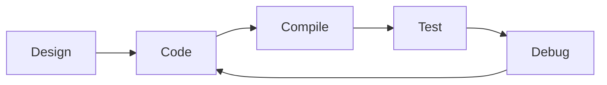

# Practical Project - Overview

ภาพรวม Practical Project

---

## Overview

> สร้าง OpenFOAM model แบบครบวงจร

---

## 1. Project Scope

| Component | Deliverable |
|-----------|-------------|
| Design | Class diagram |
| Code | .H, .C files |
| Build | Make system |
| Test | Working case |

---

## 2. Development Flow

---

## 3. Required Knowledge

- C++ inheritance
- Templates
- RTS system
- wmake

---

## 4. Module Contents

| File | Topic |
|------|-------|
| 01_Project | Overview |
| 02_Development | Design |
| 03_Organization | Structure |
| 04_Compilation | Build |
| 05_Inheritance | Virtual |
| 06_Patterns | Design |
| 07_Errors | Debug |
| 08_Challenge | Final |

---

## Quick Reference

| Step | Action |
|------|--------|
| 1 | Design class |
| 2 | Write code |
| 3 | Setup Make |
| 4 | Compile |
| 5 | Test |
| 6 | Debug |

---

## Concept Check

<b>1. โปรเจคต้องมีอะไร?</b>

**Code + Make + RTS + Test case**

<b>2. Development loop คืออะไร?</b>

**Code → Compile → Test → Debug → repeat**

<b>3. เริ่มจากอะไร?</b>

**Design** — understand base class first

---

## Related Documents

- **Project Overview:** [01_Project_Overview.md](01_Project_Overview.md)
- **Development:** [02_Model_Development_Rationale.md](02_Model_Development_Rationale.md)