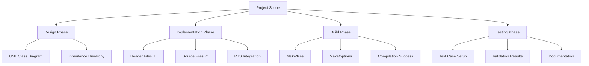
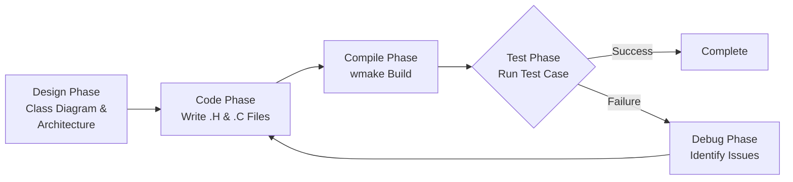
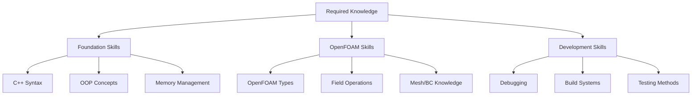
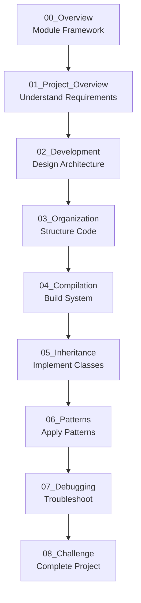
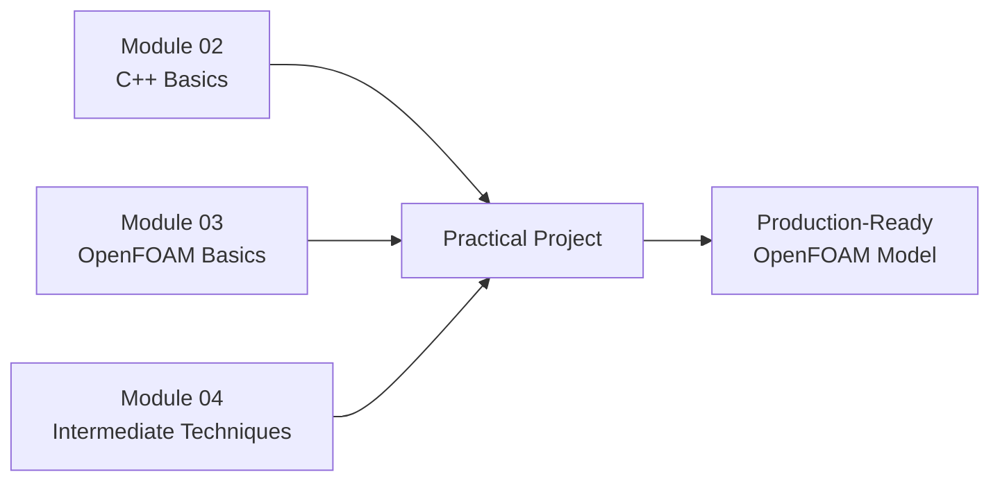

# Practical Project - Overview

ภาพรวม Practical Project

---

## 📚 Learning Objectives

**Learning Objectives (เป้าหมายการเรียนรู้):**

Upon completing this practical project module, you will be able to:

- **Design a complete OpenFOAM model** using class diagrams and inheritance hierarchies
- **Implement custom C++ classes** following OpenFOAM coding standards and patterns
- **Configure build systems** using wmake and Make/files for compilation
- **Apply the Runtime Selection (RTS) system** for flexible model instantiation
- **Debug and test** your implementation with working test cases
- **Follow professional development workflow** from design to deployment

---

## 🎯 Key Takeaways

**Key Takeaways (สิ่งสำคัญที่ต้องจำ):**

✓ **Complete Development Lifecycle:** A production-ready OpenFOAM model requires **Design + Code + Build + Test** - all four components are essential

✓ **Iterative Process:** Development follows a **Design → Code → Compile → Test → Debug** cycle, with multiple iterations

✓ **RTS Integration:** Understanding the Runtime Selection system is critical for creating flexible, user-friendly models

✓ **Class Hierarchy:** Proper use of C++ inheritance and virtual functions enables extensible architecture

✓ **Build System:** The wmake build system and proper Make/files configuration are fundamental to successful compilation

---

## 📋 Prerequisites

**Prerequisites (ความรู้พื้นฐานที่ต้องมี):**

Before starting this practical project, ensure you have:

- **C++ Fundamentals:**
  - Classes and objects
  - Inheritance and polymorphism
  - Virtual functions and abstract classes
  - Templates basics

- **OpenFOAM Foundation:**
  - Basic OpenFOAM directory structure
  - Field types (volScalarField, volVectorField, etc.)
  - Boundary conditions
  - Basic solver usage

- **Build System Knowledge:**
  - wmake compilation system
  - Make/files structure
  - Library linking concepts

- **Development Tools:**
  - Text editor or IDE
  - Terminal/command line proficiency
  - Git basics (optional but recommended)

**Recommended Previous Modules:**
- Module 02: Fundamentals of C++ Programming
- Module 03: OpenFOAM Programming Basics
- Module 04: Intermediate Programming Techniques

---

## Overview

> **สร้าง OpenFOAM model แบบครบวงจร**
> 
> Build a complete, production-ready OpenFOAM model from design to deployment

This practical project module guides you through creating a fully-functional OpenFOAM turbulence model (or custom physics model) following industry best practices. You will experience the complete software development lifecycle specific to OpenFOAM programming.

**Note:** This overview provides the module structure and learning framework. For detailed project specifications, requirements, and the complete case study, see [01_Project_Overview.md](01_Project_Overview.md).

---

## 1. Project Scope

| Component | Deliverable | Description |
|-----------|-------------|-------------|
| **Design** | Class diagram | UML/class hierarchy design showing inheritance structure |
| **Code** | .H, .C files | Header and implementation files following OpenFOAM conventions |
| **Build** | Make system | Properly configured Make/files, options, and dependencies |
| **Test** | Working case | Functional test case demonstrating model behavior |

### Project Deliverables Breakdown



---

## 2. Development Flow

The OpenFOAM model development follows an iterative cycle:



### Development Cycle Details

| Phase | Activities | Deliverables | Common Issues |
|-------|-----------|--------------|---------------|
| **Design** | Analyze requirements, identify base class, design hierarchy | UML diagram, class specifications | Over-complexity, unclear responsibilities |
| **Code** | Implement header and source files, add RTS support | `.H`, `.C` files | Syntax errors, missing includes, const correctness |
| **Compile** | Configure Make/files, run wmake | Compiled library/object files | Linking errors, missing dependencies, template errors |
| **Test** | Create test case, run simulation, validate results | Working case directory, results | Runtime errors, incorrect physics, boundary conditions |
| **Debug** | Analyze error messages, add debugging output, fix issues | Bug fixes, improved code | Logic errors, memory issues, incorrect references |

---

## 3. Required Knowledge

### Core Technical Skills

| Knowledge Area | Key Concepts | OpenFOAM Application |
|----------------|--------------|----------------------|
| **C++ Inheritance** | Base classes, derived classes, virtual functions | Extending existing turbulence/physics models |
| **Templates** | Template syntax, type parameters, specialization | Generic field operations, dimension handling |
| **RTS System** | Runtime Selection tables, TypeName, New() macros | Dynamic model selection in dictionaries |
| **wmake Build** | Make/files, Make/options, compilation rules | Building custom libraries and solvers |

### Skill Proficiency Levels



---

## 4. Module Contents

| File | Topic | Key Focus |
|------|-------|-----------|
| **00_Overview.md** | Module Overview | Learning objectives, prerequisites, module structure (this file) |
| **01_Project_Overview.md** | Project Overview | Detailed project specifications, case study, requirements |
| **02_Model_Development_Rationale.md** | Development Design | Design philosophy, architecture decisions, pattern selection |
| **03_Code_Organization.md** | Code Structure | File organization, naming conventions, directory layout |
| **04_Compilation_Build_Process.md** | Build System | Make/files configuration, compilation process, linking |
| **05_Inheritance_Virtual_Functions.md** | Inheritance Implementation | Base class extension, virtual function overriding, polymorphism |
| **06_Design_Patterns.md** | Design Patterns | Factory, Strategy, and other patterns in OpenFOAM context |
| **07_Error_Debugging_Techniques.md** | Debugging | Common errors, debugging strategies, troubleshooting techniques |
| **08_Integration_Challenge.md** | Final Challenge | Complete integration exercise bringing all concepts together |

### Module Learning Path



**Recommended Flow:**
1. Start here (00_Overview) for module framework
2. Proceed to 01_Project_Overview for detailed project requirements
3. Follow sequentially through 02-07 for concept-by-concept learning
4. Complete 08_Integration_Challenge as final assessment

---

## 5. Integration with Other Modules

This practical project integrates concepts from previous modules:



| Previous Module | Concepts Applied |
|-----------------|------------------|
| **Module 02: C++ Fundamentals** | Classes, inheritance, templates, memory management |
| **Module 03: OpenFOAM Programming** | Field types, geometric fields, boundary conditions |
| **Module 04: Intermediate Programming** | Virtual functions, RTS, advanced debugging |
| **Module 05: Turbulence Modeling** | Understanding turbulence model base classes |

---

## Quick Reference

### Development Checklist

| Step | Action | Command/File | Status |
|------|--------|--------------|--------|
| 1 | Design class hierarchy | UML diagram tool | ⬜ |
| 2 | Create directory structure | `mkdir -p model/*` | ⬜ |
| 3 | Write header files | `*.H` files | ⬜ |
| 4 | Write source files | `*.C` files | ⬜ |
| 5 | Configure Make/files | `Make/files` | ⬜ |
| 6 | Configure Make/options | `Make/options` | ⬜ |
| 7 | Compile library | `wmake` | ⬜ |
| 8 | Create test case | Case directory setup | ⬜ |
| 9 | Run test simulation | Solver execution | ⬜ |
| 10 | Validate results | Post-processing | ⬜ |

### Common Commands Reference

```bash
# Compilation
wclean                    # Clean build artifacts
wmake                     # Compile library/application
wmake libso               # Compile as shared library

# Testing
solver -case <path>       # Run solver on test case
checkMesh                 # Verify mesh quality
foamListTimes             # List available time directories

# Debugging
wmake -debug              # Compile with debug symbols
gdb <solver>              # Debug with GDB
valgrind <solver>         # Check memory issues
```

---

## 🧠 Concept Check

<details>
<summary><b>1. โปรเจคต้องมีอะไร?</b></summary>

**What components must a complete OpenFOAM project have?**

A production-ready OpenFOAM model requires four essential components:
- **Code:** Properly structured `.H` and `.C` source files
- **Make:** Configured build system (Make/files, Make/options)
- **RTS:** Runtime Selection integration for flexible model instantiation
- **Test case:** Working validation case demonstrating correct behavior

All four components must work together for a successful project.
</details>

<details>
<summary><b>2. Development loop คืออะไร?</b></summary>

**What is the development iteration cycle?**

The OpenFOAM development loop follows this iterative cycle:

**Design → Code → Compile → Test → Debug → Code → ...**

1. **Design:** Plan class hierarchy and architecture
2. **Code:** Implement header and source files
3. **Compile:** Build using wmake system
4. **Test:** Run test case and validate results
5. **Debug:** Identify and fix any issues
6. **Repeat:** Go back to Code phase if needed

This cycle continues until the model passes all tests and produces valid results.
</details>

<details>
<summary><b>3. เริ่มจากอะไร?</b></summary>

**Where should you start the development process?**

**Always start with Design** — specifically:

1. **Understand the base class** you're extending (e.g., `kEpsilon`, `RASModel`)
2. **Identify required virtual functions** that must be overridden
3. **Plan the class hierarchy** and what new members you need
4. **Create a UML diagram** showing relationships
5. **Then begin coding** with clear architectural understanding

Starting without proper design leads to rework and structural issues.
</details>

<details>
<summary><b>4. ทำไมต้องใช้ระบบ RTS?</b></summary>

**Why is the RTS (Runtime Selection) system essential?**

The RTS system enables:
- **Flexible model selection** through dictionary configuration
- **User-friendly interface** - no recompilation needed to switch models
- **Standard OpenFOAM integration** - consistent with existing solvers
- **Polymorphic behavior** - base class pointers can instantiate any derived model

Without RTS, your model would require code modifications to change, limiting usability.
</details>

---

## 📖 Related Documentation

### Within This Module

- **Project Overview:** [01_Project_Overview.md](01_Project_Overview.md) - Detailed project specifications and case study
- **Development Design:** [02_Model_Development_Rationale.md](02_Model_Development_Rationale.md) - Architecture and design decisions
- **Code Organization:** [03_Code_Organization.md](03_Code_Organization.md) - File structure and naming conventions

### Cross-Module References

| Related Module | Relevant Section | Connection to This Project |
|----------------|------------------|----------------------------|
| **Module 02** | C++ Fundamentals | Provides the C++ foundation for implementing classes |
| **Module 03** | OpenFOAM Basics | Introduces field types and mesh operations used here |
| **Module 04** | Intermediate Techniques | Covers inheritance patterns and RTS in depth |
| **Module 05** | Turbulence Models | Base classes you may extend in this project |

### External Resources

- **OpenFOAM Programmer's Guide:** Official documentation on custom model development
- **OpenFOAM Source Code:** `/src/turbulenceModels` for reference implementations
- **OpenFOAM Wiki:** Community tutorials and examples

---

## 🎓 Next Steps

**After reviewing this overview:**

1. ✅ Review [01_Project_Overview.md](01_Project_Overview.md) for detailed project requirements
2. ✅ Ensure you meet all prerequisites listed above
3. ✅ Set up your development environment
4. ✅ Proceed sequentially through files 02-08 as you develop your project

**Remember:** This practical project is your opportunity to synthesize all previous learning into a complete, production-quality OpenFOAM model. Take your time with the design phase—it will save significant effort during implementation!