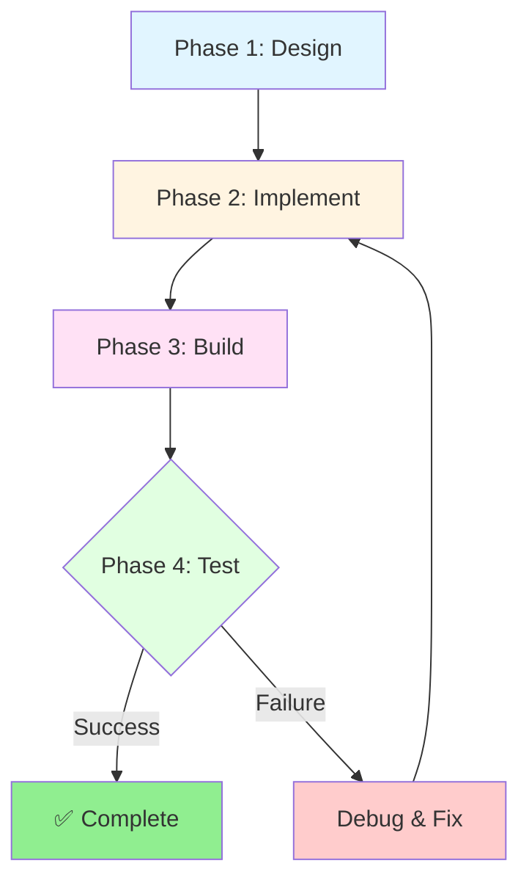
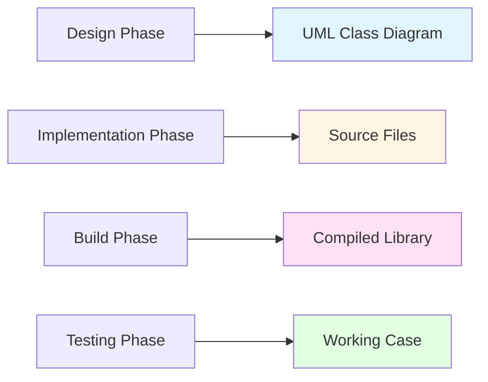

# Project Specifications

ภาพรวมโปรเจคและสเปกโปรเจค

---

## 📚 Learning Objectives

**Learning Objectives (เป้าหมายการเรียนรู้):**

Upon completing this project overview, you will be able to:

- **Define project scope** and understand the specific requirements for this practical project
- **Identify deliverables** at each phase of the development lifecycle
- **Apply the complete workflow** from design to deployment for an OpenFOAM model
- **Distinguish between module overview** (00_Overview.md) and **project specifications** (this file)

---

## 🎯 Key Takeaways

**Key Takeaways (สิ่งสำคัญที่ต้องจำ):**

✓ **Clear Scope Definition:** This file provides **specific project requirements**, while 00_Overview.md provides the **learning framework**

✓ **Four Essential Components:** Every OpenFOAM project requires **Design + Code + Build + Test** - all non-negotiable

✓ **RTS is Critical:** Runtime Selection enables flexible, user-friendly models without recompilation

✓ **Iterative Development:** Expect multiple cycles through **Design → Code → Compile → Test → Debug**

✓ **Professional Standards:** Following OpenFOAM patterns ensures maintainability and extensibility

---

## 📋 Prerequisites

**Prerequisites (ความรู้พื้นฐานที่ต้องมี):**

Before starting this project, ensure you have:

- **C++ Proficiency:**
  - Classes, inheritance, virtual functions
  - Templates and polymorphism
  - Memory management basics

- **OpenFOAM Experience:**
  - Directory structure and file organization
  - Field types and boundary conditions
  - Basic solver execution

- **Development Tools:**
  - Text editor/IDE with C++ support
  - Terminal proficiency
  - Understanding of build systems

**Required Foundation:** Complete [00_Overview.md](00_Overview.md) before proceeding with this project specification.

---

## 🌟 Why This Project Matters

### The What (สิ่งที่จะทำ)

You will build a **complete, production-ready OpenFOAM model** from scratch. This could be:
- A custom turbulence model
- A specialized boundary condition
- A modified physics model
- A custom utility

### The Why (ทำไมสำคัญ)

**Professional Development:**
- Real OpenFOAM development requires **more than running simulations** - you need to create custom models
- Industry positions demand **the ability to extend OpenFOAM**, not just use existing tools
- This project bridges the gap between **user** and **developer**

**Skill Integration:**
- Synthesizes ALL previous modules into one practical application
- Demonstrates mastery of C++, OpenFOAM architecture, and development workflow
- Creates a **portfolio-worthy project** showcasing your capabilities

### The How (จะทำอย่างไร)

**Structured Approach:**
1. **Design First:** Plan architecture before coding
2. **Implement Incrementally:** Build and test components iteratively  
3. **Follow Standards:** Use OpenFOAM conventions and patterns
4. **Validate Thoroughly:** Test with real cases

---

## 📋 1. Project Specifications

### 1.1 Project Goal

**Objective (วัตถุประสงค์):**

สร้าง model/solver ที่:
- Compiles successfully with wmake
- Uses Runtime Selection (RTS) for flexible model instantiation
- Follows OpenFOAM coding patterns and conventions
- Works correctly in real simulation cases

### 1.2 Project Structure

```
myProject/
├── Make/
│   ├── files          # Source files to compile
│   └── options        # Compilation flags and dependencies
├── myModel.H          # Header file with class declaration
├── myModel.C          # Implementation file
├── NewMyModel.C       # RTS registration and factory
└── testCase/
    ├── 0/             # Initial conditions
    ├── constant/      # Mesh and physics properties
    ├── system/        # Control dictionaries
    └── Allrun         # Execution script
```

### 1.3 Development Workflow



| Phase | Activities | Deliverable | Success Criteria |
|-------|-----------|-------------|------------------|
| **1. Design** | Create class diagram, identify base class, plan hierarchy | UML/class diagram | Clear architecture with identified virtual functions |
| **2. Implement** | Write header and source files, add RTS macros | `.H` and `.C` files | Code compiles without syntax errors |
| **3. Build** | Configure Make/files and Make/options, compile | Compiled library | `wmake` completes successfully |
| **4. Test** | Create test case, run simulation, validate | Working case directory | Results are physically plausible |

---

## 📊 2. Detailed Development Steps

### Step 1: Design Class Hierarchy

**Tasks:**
- Identify base class to extend (e.g., `kEpsilon`, `RASModel`)
- Determine which virtual functions to override
- Plan new member variables and methods
- Create UML diagram showing relationships

**Output:** Class design document

---

### Step 2: Write Header File

**Tasks:**
- Declare class with proper inheritance
- Define constructor and destructor
- Declare overridden virtual functions
- Add new member variables

**Minimum Template:**
```cpp
#ifndef myModel_H
#define myModel_H

#include "baseModel.H"

// * * * * * * * * * * * * * * * * * * * * * * * * * * * * * * * * * * * * * //

namespace Foam
{

class myModel
:
    public baseModel
{
    // Private Member Functions
    
    //- Disallow default bitwise copy construct
    myModel(const myModel&);
    
    //- Disallow default bitwise assignment
    void operator=(const myModel&);


protected:

    // Protected data members
    
    // Protected member functions


public:

    //- Runtime type information
    TypeName("myModel");

    //- Declare runtime construction
    declareRunTimeSelectionTable
    (
        autoPtr,
        myModel,
        dictionary,
        (
            const dictionary& dict,
            const fvMesh& mesh
        ),
        (dict, mesh)
    );


    // Constructors

        //- Construct from components
        myModel
        (
            const dictionary& dict,
            const fvMesh& mesh
        );


    //- Destructor
    virtual ~myModel();


    // Member Functions

        //- Override required virtual function
        virtual void correct();
        
        //- Additional member functions
        // ...
};


// * * * * * * * * * * * * * * * * * * * * * * * * * * * * * * * * * * * * * //

} // End namespace Foam

// * * * * * * * * * * * * * * * * * * * * * * * * * * * * * * * * * * * * * //

#endif

// ************************************************************************* //
```

---

### Step 3: Implement Methods

**Tasks:**
- Implement constructor with member initialization
- Override virtual functions with custom logic
- Implement new member functions
- Add proper error handling

---

### Step 4: Add Runtime Selection

**Tasks:**
- Define TypeName and debug flag
- Implement `New()` selector method
- Add to runtime selection table

**RTS Registration Template:**
```cpp
#include "myModel.H"

// * * * * * * * * * * * * * * Static Data Members * * * * * * * * * * * * * //

defineTypeNameAndDebug(myModel, 0);

addToRunTimeSelectionTable
(
    baseModel,
    myModel,
    dictionary
);


// * * * * * * * * * * * * * * * * Constructors  * * * * * * * * * * * * * * //

Foam::myModel::myModel
(
    const dictionary& dict,
    const fvMesh& mesh
)
:
    baseModel(dict, mesh),
    // Initialize member variables
{
    // Constructor implementation
}


// * * * * * * * * * * * * * * * * Destructor  * * * * * * * * * * * * * * * //

Foam::myModel::~myModel()
{}


// * * * * * * * * * * * * * * * Member Functions  * * * * * * * * * * * * * //

void Foam::myModel::correct()
{
    // Implementation
}


// * * * * * * * * * * * * * * * * * * * * * * * * * * * * * * * * * * * * * //

} // End namespace Foam

// ************************************************************************* //
```

---

### Step 5: Configure Build System

**Make/files:**
```bash
myModel.C

LIB = $(FOAM_USER_LIBBIN)/libmyModel
```

**Make/options:**
```bash
EXE_INC = \
    -I$(LIB_SRC)/finiteVolume/lnInclude \
    -I$(LIB_SRC)/meshTools/lnInclude \
    /* Additional includes */

LIB_LIBS = \
    -lfiniteVolume \
    -lmeshTools \
    /* Additional libraries */
```

---

### Step 6: Compile and Test

**Compilation Commands:**
```bash
wclean    # Clean previous build
wmake     # Compile library
```

**Testing:**
```bash
# Navigate to test case
cd testCase

# Run solver with your model
solver -case .

# Check results
paraFoam
```

---

## 📋 3. Module Content Map

| File | Topic | Purpose |
|------|-------|---------|
| **00_Overview.md** | Module Framework | Learning objectives, prerequisites, high-level structure |
| **01_Project_Overview.md** | **Project Specs** | **Specific project requirements and case study (this file)** |
| **02_Model_Development_Rationale.md** | Design Philosophy | Why we design models this way |
| **03_Code_Organization.md** | File Structure | Directory layout and naming conventions |
| **04_Compilation_Build_Process.md** | Build System | wmake configuration and compilation details |
| **05_Inheritance_Virtual_Functions.md** | Implementation | Extending base classes and overriding methods |
| **06_Design_Patterns.md** | Architecture | Factory, Strategy, and other patterns |
| **07_Error_Debugging_Techniques.md** | Troubleshooting | Common errors and debugging strategies |
| **08_Integration_Challenge.md** | Final Assessment | Complete integration exercise |

**Key Distinction:**
- **00_Overview.md** = "What will I learn?" (educational framework)
- **01_Project_Overview.md** = "What must I build?" (project specifications)

---

## 📐 4. Project Deliverables

### 4.1 Phase Deliverables



### 4.2 Deliverable Checklist

| Phase | File/Artifact | Description | Status |
|-------|--------------|-------------|--------|
| **Design** | `class_diagram.png/pdf` | UML diagram showing inheritance hierarchy | ⬜ |
| **Implementation** | `*.H` files | Header files with class declarations | ⬜ |
| **Implementation** | `*.C` files | Implementation files with method definitions | ⬜ |
| **Implementation** | `Make/files` | Source file list for compilation | ⬜ |
| **Implementation** | `Make/options` | Compilation flags and dependencies | ⬜ |
| **Build** | `lib*.so` | Compiled shared library | ⬜ |
| **Test** | `testCase/` | Complete test case directory | ⬜ |
| **Test** | `results/` | Validation results and plots | ⬜ |
| **Documentation** | `README.md` | Project documentation and usage guide | ⬜ |

---

## 🔍 5. Comparison with Module Overview

| Aspect | 00_Overview.md | 01_Project_Overview.md |
|--------|----------------|----------------------|
| **Purpose** | Educational framework | Project specifications |
| **Content** | Learning objectives, prerequisites | Specific requirements, deliverables |
| **Audience** | Learners planning their studies | Developers building the project |
| **Scope** | Entire module structure | Single project details |
| **Questions Answered** | "What will I learn?" | "What must I build?" |

---

## 📚 Quick Reference

### Development Command Reference

```bash
# Build Commands
wclean                  # Remove build artifacts
wmake                   # Compile library
wmake libso            # Compile as shared library

# Testing Commands
solver -case <path>     # Run solver on test case
checkMesh              # Verify mesh quality
foamListTimes          # List available time directories
paraFoam               # Open in ParaView

# Debugging Commands
wmake -debug           # Compile with debug symbols
gdb <solver>           # Debug with GDB
valgrind <solver>      # Check for memory issues
```

### File Structure Template

```
projectName/
├── Make/
│   ├── files          # Source file list
│   └── options        # Compile flags
├── modelName.H        # Header file
├── modelName.C        # Implementation
├── NewModelName.C     # RTS registration
├── testCase/
│   ├── 0/
│   ├── constant/
│   │   ├── polyMesh/
│   │   └── transportProperties/turbulenceProperties
│   ├── system/
│   │   ├── controlDict
│   │   ├── fvSchemes
│   │   └── fvSolution
│   └── Allrun
└── README.md          # Documentation
```

---

## 🧠 Concept Check

<details>
<summary><b>1. โปรเจคต้องมีอะไรบ้าง?</b></summary>

**What are the four essential components of an OpenFOAM project?**

A complete OpenFOAM project requires:

1. **Make/** - Build system configuration (files, options)
2. **Source files** - `.H` header and `.C` implementation files
3. **RTS registration** - Runtime Selection integration for flexibility
4. **Test case** - Working validation case demonstrating functionality

All four components are non-negotiable for a production-ready project.
</details>

<details>
<summary><b>2. ลำดับการพัฒนาที่ถูกต้องคืออะไร?</b></summary>

**What is the correct development sequence?**

The proper sequence is:

**Design → Header → Implement → RTS → Compile → Test**

1. **Design:** Plan architecture and class hierarchy
2. **Header:** Write `.H` file with declarations
3. **Implement:** Write `.C` file with implementations
4. **RTS:** Add Runtime Selection macros and registration
5. **Compile:** Configure Make files and build with wmake
6. **Test:** Create test case and validate results

Skipping design or changing the order often leads to rework.
</details>

<details>
<summary><b>3. ทดสอบโปรเจคอย่างไร?</b></summary>

**How do you test the project?**

Testing involves:

1. **Create test case directory** with proper structure (0/, constant/, system/)
2. **Configure dictionary** to select your model (e.g., `RASModel myModel;`)
3. **Run solver:** `solver -case testCase`
4. **Verify results:** Check convergence, physical plausibility, boundary conditions
5. **Post-process:** Visualize in ParaView to confirm behavior

The test case must demonstrate that your model works in a real simulation.
</details>

<details>
<summary><b>4. 00_Overview.md กับ 01_Project_Overview.md ต่างกันอย่างไร?</b></summary>

**What's the difference between the two overview files?**

- **00_Overview.md** answers "What will I learn?" - It provides the **educational framework**, learning objectives, prerequisites, and module structure
- **01_Project_Overview.md** answers "What must I build?" - It provides **specific project requirements**, deliverables, and implementation details

Think of 00 as the **syllabus** and 01 as the **project assignment**.
</details>

<details>
<summary><b>5. ทำไมต้องใช้ระบบ RTS?</b></summary>

**Why is the Runtime Selection (RTS) system essential?**

RTS enables:

- **Flexible selection:** Choose models via dictionary without recompiling
- **User-friendly:** Standard OpenFOAM interface
- **Polymorphic instantiation:** Base class pointers create derived objects
- **Extensibility:** Easy to add new models to existing framework

Without RTS, your model would require code changes to use different implementations.
</details>

---

## 📖 Related Documentation

### Within This Module

- **Module Framework:** [00_Overview.md](00_Overview.md) - Learning objectives and prerequisites
- **Development Design:** [02_Model_Development_Rationale.md](02_Model_Development_Rationale.md) - Architecture decisions
- **Code Structure:** [03_Code_Organization.md](03_Code_Organization.md) - File organization details
- **Build System:** [04_Compilation_Build_Process.md](04_Compilation_Build_Process.md) - wmake configuration
- **Implementation:** [05_Inheritance_Virtual_Functions.md](05_Inheritance_Virtual_Functions.md) - Coding techniques

### Cross-Module References

| Module | Relevant Section | Application |
|--------|------------------|-------------|
| **Module 09-01** | Template Programming | Template syntax in model implementation |
| **Module 09-02** | Inheritance & Polymorphism | Extending base classes |
| **Module 09-03** | Design Patterns | Factory and Strategy patterns |
| **Module 09-06** | Architecture & Extensibility | Runtime Selection mechanism |

---

## 🎓 Next Steps

**After reviewing these project specifications:**

1. ✅ Ensure you've completed [00_Overview.md](00_Overview.md) prerequisites
2. ✅ Review [02_Model_Development_Rationale.md](02_Model_Development_Rationale.md) for design philosophy
3. ✅ Begin the design phase with a class diagram
4. ✅ Follow the development workflow sequentially through files 02-08

**Remember:** This project is your opportunity to demonstrate mastery of OpenFOAM development. Take time with the design phase—it will save significant effort during implementation!