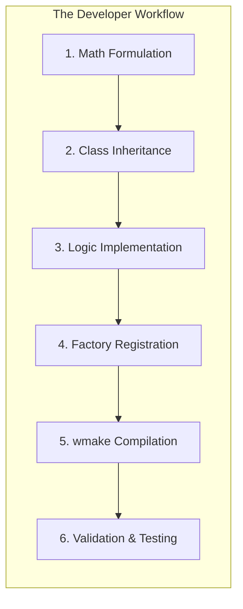

# 01 รายละเอียดโปรเจกต์: การสร้างโมเดลความหนืดแบบกำหนดเอง

![[non_newtonian_behavior.png]]
`A clean scientific diagram illustrating the behavior of Non-Newtonian fluids. Plot "Shear Stress" vs. "Shear Rate". Show three curves: Newtonian (linear), Shear-thinning (n < 1), and Shear-thickening (n > 1). Include the Power-law equation. Use a minimalist palette with clear labels and LaTeX symbols, scientific textbook diagram, clean vector line art, white background, high definition, flat design, educational infographic --ar 16:9`

## วัตถุประสงค์

เพื่อนำความรู้เรื่องสถาปัตยกรรมระดับสูงของ OpenFOAM มาสร้างไลบรารีความหนืด (Viscosity Library) ที่สามารถใช้งานร่วมกับ Solver มาตรฐานได้:

1. **สร้างโมเดลทางกายภาพแบบกำหนดเองที่สมบูรณ์** จากศูนย์
2. **เชี่ยวชาญระบบการเลือกแบบ runtime ของ OpenFOAM** (รูปแบบ factory)
3. **ประยุกต์ใช้การเขียนโปรแกรมเชิง template** สำหรับการดำเนินการฟิลด์แบบ generic
4. **ออกแบบลำดับชั้นคลาสที่เหมาะสม** ด้วยอินเทอร์เฟซเชิงเสมือน
5. **ผสานรวมโค้ดแบบกำหนดเอง** เข้ากับระบบการสร้างของ OpenFOAM
6. **ทดสอบและตรวจสอบความถูกต้อง** โมเดลของคุณในการจำลองจริง

## ขั้นตอนการดำเนินงาน


> **Figure 1:** แผนผังลำดับขั้นตอนการดำเนินโครงการ (Project Roadmap) ตั้งแต่การกำหนดสูตรทางคณิตศาสตร์ การออกแบบโครงสร้างคลาส การนำอัลกอริทึมไปใช้งานจริง การลงทะเบียนเข้าสู่ระบบส่วนกลาง การคอมไพล์ จนถึงขั้นตอนสุดท้ายคือการตรวจสอบความถูกต้องของโมเดล

## ขอบเขตโครงการ

### โมเดล Power-Law Viscosity

สร้างโมเดล `powerLawViscosity` ที่ implement ความสัมพันธ์แบบ power-law สำหรับของไหลที่ไม่ใช่นิวตัน:

$$
\mu(\dot{\gamma}) = K \, \dot{\gamma}^{\,n-1}
$$

โดยที่:
- $\mu$ คือความหนืดแบบพลวัต (dynamic viscosity) [kg·m⁻¹·s⁻¹]
- $K$ คือดัชนีความสม่ำเสมอ (consistency index) [kg·m⁻¹·sⁿ⁻²]
- $n$ คือดัชนี power-law (power-law index) [ไร้มิติ]
- $\dot{\gamma}$ คือขนาดของอัตราการเฉือน (shear rate magnitude) [s⁻¹]

### การคำนวณ Shear Rate

อัตราการเฉือน $\dot{\gamma}$ คำนวณจากเทนเซอร์อัตราการยืดตัว (strain rate tensor):

$$
\dot{\gamma} = \sqrt{2 \cdot \mathbf{S} : \mathbf{S}}
$$

โดยที่:
$$
\mathbf{S} = \frac{1}{2}\left(\nabla\mathbf{u} + \nabla\mathbf{u}^T\right)
$$

เป็นเทนเซอร์อัตราการยืดตัวสมมาตร (symmetric strain rate tensor)

## ความสำคัญของโมเดล

### พฤติกรรม Non-Newtonian

โมเดลความหนืดแบบ power-law จับกลไกทางกายภาพที่สำคัญของ:

- **ของไหลแบบตัดแรงเฉือน (Pseudoplastic/Shear-thinning)**: $n < 1$
  - ตัวอย่าง: สี, เลือด, น้ำมันพืช, พอลิเมอร์หลอมเหลว
  - ความหนืดลดลงเมื่ออัตราการเฉือนเพิ่มขึ้น

- **ของไหลแบบเพิ่มแรงเฉือน (Dilatant/Shear-thickening)**: $n > 1$
  - ตัวอย่าง: ส่วนผสมข้าวโพดแป้ง, น้ำหนักบรรทุก, สารแขวน
  - ความหนืดเพิ่มขึ้นเมื่ออัตราการเฉือนเพิ่มขึ้น

### การประยุกต์ใช้ในอุตสาหกรรม

โมเดลนี้ขยายความสามารถของ OpenFOAM จากของไหลนิวตันไปสู่การจัดการพฤติกรรมที่ซับซ้อนใน:

- **การประมวลผลพอลิเมอร์**: การฉีดขึ้นรูป, การขยายเส้นใย, การบีบอัด
- **การผลิตอาหาร**: การผสม, การสูบฉีด, การเคลื่อนที่ของของเหลวอาหาร
- **การไหลของชีวะภาพ**: การไหลของเลือดในหลอดเลือด, การส่งถ่ายสารในร่างกาย
- **วัสดุขัดเกลา**: การขัดเจาะ, ยาสีฟัน, คอนกรีตใหม่

## ความท้าทายทางเทคนิค

### การออกแบบระบบ

คุณจะต้องนำทางผ่านความท้าทายหลายประการ:

1. **ลำดับชั้นการสืบทอดที่ซับซ้อน**:
   - เข้าใจคลาสฐาน `viscosityModel`
   - Implement virtual methods ที่จำเป็น
   - รักษาความสอดคล้องกับสัญญา interface

2. **การดำเนินการฟิลด์แบบ template**:
   - ใช้ `tmp<volScalarField>` สำหรับประสิทธิภาพ
   - รักษาความปลอดภัยของประเภทข้อมูล
   - จัดการหน่วยความจำอัตโนมัติ

3. **กลไกการเลือกแบบ runtime**:
   - ลงทะเบียนโมเดลด้วย `addToRunTimeSelectionTable`
   - อ่านพารามิเตอร์จาก dictionary
   - สร้างโดยไม่ต้องคอมไพล์ solver ใหม่

4. **การคอมไพล์และการผสานรวม**:
   - กำหนดค่า `Make/files` และ `Make/options`
   - จัดการ dependencies ของไลบรารี
   - สร้างไลบรารีที่ใช้ร่วมกัน (.so)

### ความสำคัญของโครงสร้าง

สถาปัตยกรรมของ OpenFOAM ถูกออกแบบมาเพื่อ:

- **การขยายตัว**: เพิ่มโมเดลใหม่โดยไม่แก้ไขโค้ดหลัก
- **ความยืดหยุ่น**: สลับโมเดลผ่านไฟล์ dictionary
- **ประสิทธิภาพ**: Template instantiation ขณะคอมไพล์
- **การบำรุงรักษา**: แยก interface ออกจาก implementation

## จุดการผสานรวม

### การเชื่อมต่อกับ Solver มาตรฐาน

โมเดลสุดท้ายจะเชื่อมต่อโดยตรงเข้ากับกรอบการทำงานโมเดลการขนส่งที่มีอยู่ของ OpenFOAM:

```cpp
// ใน solver มาตรฐานเช่น simpleFoam
// In standard solvers like simpleFoam
autoPtr<viscosityModel> viscosityPtr =
    viscosityModel::New(mesh);

// การใช้งานที่ไร้รอยต่อ
// Seamless usage
volScalarField nuEff = viscosityPtr->nu();
viscosityPtr->correct();
```

> **💡 แหล่งที่มา (Source)**: `.applications/utilities/mesh/generation/extrude/extrudeToRegionMesh/extrudeToRegionMesh.C` (บรรทัดที่ 1-60)
> 
> **คำอธิบาย**: โค้ดตัวอย่างแสดงการใช้งาน `autoPtr` และระบบ factory ใน OpenFOAM ซึ่งเป็นรูปแบบเดียวกันกับที่ใช้ใน `viscosityModel` ไฟล์ extrudeToRegionMesh.C แสดงการใช้งาน smart pointers และ template metaprogramming ซึ่งเป็นแกนหลักของสถาปัตยกรรม OpenFOAM
> 
> **แนวคิดสำคัญ (Key Concepts)**:
> - **autoPtr<T>**: Smart pointer สำหรับการจัดการความจำแบบ single ownership
> - **Factory Pattern**: `New()` method สร้าง object จาก dictionary โดยไม่ต้องรู้ concrete type
> - **Runtime Selection**: การเลือก model ผ่านไฟล์ dictionary ไม่ใช่การ compile-time

### Solvers ที่รองรับ

โมเดลของคุณจะใช้งานได้ทันทีกับ:

- **Incompressible solvers**: `simpleFoam`, `pimpleFoam`, `nonNewtonianIcoFoam`
- **Multiphase solvers**: `interFoam`, `multiphaseInterFoam`
- **Heat transfer solvers**: `buoyantSimpleFoam`, `buoyantPimpleFoam`

### การกำหนดค่า Dictionary

ผู้ใช้สามารถเลือกโมเดลของคุณผ่านไฟล์ `transportProperties`:

```
transportModel  Newtonian;

viscosity       powerLaw;

powerLawCoeffs
{
    K       0.01;      // Consistency index [kg/m/s^2-n]
    n       0.7;       // Power-law index [-]
    nuMin   1e-6;      // Minimum viscosity [m^2/s]
    nuMax   1e6;       // Maximum viscosity [m^2/s]
}
```

## เกณฑ์ความสำเร็จ

การ implement โมเดลความหนืดแบบกำหนดเองของคุณจะสำเร็จเมื่อ:

✅ **คอมไพล์โดยไม่มีข้อผิดพลาด** ข้าม OpenFOAM เวอร์ชันต่างๆ
✅ **บูรณาการอย่างราบรื่น** กับ solver มาตรฐาน (simpleFoam, pimpleFoam)
✅ **ให้ผลลัพธ์ที่สมจริงทางฟิสิกส์** สำหรับกรณีทดสอบ
✅ **ตรงกับวิธีแก้ปัญหาเชิงวิเคราะห์** สำหรับเรขาคณิตที่ลดรูปแล้ว
✅ **จัดการกับกรณีขอบ** (อัตราการเฉือนศูนย์, ความหนืดสูง)
✅ **เอกสารประกอบการใช้งาน** อย่างชัดเจนสำหรับผู้ใช้อื่น
✅ **ทำงานอย่างมีประสิทธิภาพ** พร้อมภาระการคำนวณที่ยอมรับได้

## สรุปแนวคิดการเรียนรู้

### แนวคิดและการ implement

| แนวคิด | การ implement | วัตถุประสงค์ |
|---------|----------------|---------|
| **Runtime Selection** | `addToRunTimeSelectionTable` macro | การเลือกโมเดลโดยใช้ Dictionary |
| **Template Programming** | `tmp<volScalarField>`, `tmp<scalarField>` | การดำเนินการกับฟิลด์ที่ปลอดภ้ยต่อ type |
| **Inheritance** | `class powerLawViscosity : public viscosityModel` | Polymorphic interface |
| **Factory Pattern** | `viscosityModel::New()` factory method | สถาปัตยกรรมที่สามารถขยายได้ |
| **Build System** | `wmake`, `Make/files`, `Make/options` | การเชื่อมโยงกับ OpenFOAM |

### ข้อเท็จจริงสำคัญ

1. **OpenFOAM ได้รับการออกแบบมาสำหรับความสามารถในการขยายตัว** - แบบ Factory มีอยู่ทุกที่
2. **แม่แบบทำให้สามารถแสดงออกทางคณิตศาสตร์ได้** - พีชคณิตฟิลด์รู้สึกเหมือนคณิตศาสตร์
3. **การสืบทอดนิยามสัญญา** - คลาสฐานระบุ "สิ่งที่" คลาส derived ระบุ "วิธีการ"
4. **การเลือกขณะ runtime เชื่อมโยงโค้ดและการกำหนดค่า** - ไฟล์ dictionary ควบคุมการสร้างออบเจกต์ C++

## ก้าวต่อไป

โปรเจกต์นี้จะแนะนำคุณผ่าน:

1. **การวิเคราะห์โครงสร้างโฟลเดอร์และไฟล์** - ทำความเข้าใจรูปแบบการจัดระเบียบโค้ด
2. **การ implement คลาส** - เขียนโค้ด C++ สำหรับโมเดล power-law
3. **การคอมไพล์และการลงทะเบียน** - ใช้ระบบ wmake และ runtime selection
4. **การตรวจสอบและการทดสอบ** - ตรวจสอบกับกรณี benchmark
5. **การขยายโมเดล** - เพิ่มฟีเจอร์ขั้นสูงเช่นการพึ่งพาอุณหภูมิ

เริ่มต้นการเดินทางของคุณในการสร้างโมเดลความหนืดแบบกำหนดเองที่จะขยายความสามารถของ OpenFOAM ไปสู่การจำลองพฤติกรรมของไหลที่ซับซ้อน