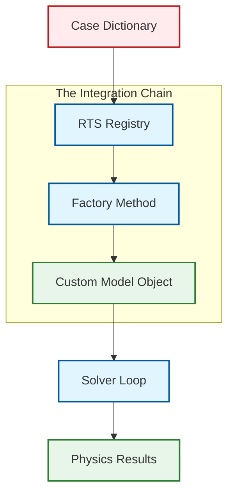

# 2️⃣ เหตุผลการพัฒนาโมเดล: ทำไมต้องสร้าง Custom Viscosity Model ใน OpenFOAM?

## 🧠 **Conceptual Model: การสร้างส่วนประกอบเครื่องยนต์แบบ Custom**

จินตนาการว่าคุณกำลังออกแบบเครื่องยนต์ประสิทธิภาพสูง OpenFOAM มอบ **core framework** (ส่วนหลัก), **built-in models** (ส่วนประกอบมาตรฐาน), และ **APIs** (คู่มือการประกอบ) ให้คุณ ตอนนี้คุณต้องการ **turbocharger แบบกำหนดเอง** (specialized physics) ที่ต้อง:

1. **เชื่อมต่อกับที่วางแบบมาตรฐาน** (สืบทอดจาก interface ฐาน)
2. **ใช้ท่อน้ำมันเชื้อเพลิงมาตรฐาน** (ทำงานกับ fields ของ OpenFOAM)
3. **เลือกผ่านควบคุมบนแผงควบคุม** (runtime selection ผ่าน dictionary)
4. **ทำตามข้อกำหนดโรงงาน** (compile กับระบบ build ของ OpenFOAM)

โปรเจกต์นี้สอนคุณในการสร้าง turbocharger นั้น—แบบจำลองความหนืดแบบกำหนดเอง (custom viscosity model) ที่บูรณาการเข้ากับสถาปัตยกรรมของ OpenFOAM อย่างราบรื่น

## 🔧 **ปัญหาการขยายตัวที่ OpenFOAM แก้ไข**

OpenFOAM ถูกออกแบบมาเพื่อรองรับ:

- **Runtime Model Selection**: การเลือกโมเดลผ่านไฟล์ dictionary (ไม่ต้อง compile ใหม่)
- **User Contributions**: การสนับสนุนจากผู้ใช้โดยไม่ต้องแก้ไขโค้ดหลัก
- **Backward Compatibility**: ความเข้ากันได้แบบย้อนหลังกับไฟล์ case ที่มีอยู่
- **Performance**: การปรับแต่งขณะ compile สำหรับประสิทธิภาพสูงสุด

**Solution**: **Factory Pattern** ร่วมกับ Runtime Selection Tables, Template-based Field Operations, และ Clear Inheritance Hierarchies

## 🏗️ **กรอบงานสถาปัตยกรรมของ OpenFOAM**


> **Figure 1:** ห่วงโซ่การบูรณาการ (Integration Chain) ที่แสดงให้เห็นว่าโมเดลแบบกำหนดเองเชื่อมต่อกับระบบส่วนใหญ่ของ OpenFOAM อย่างไร ตั้งแต่การอ่านค่าจากพจนานุกรม การสร้างออบเจกต์ผ่านโรงงาน (Factory) ไปจนถึงการทำงานภายในวงรอบของโซลเวอร์

OpenFOAM แก้ปัญหาการขยายตัวผ่าน Design Patterns หลายอย่าง:

### Runtime Selection Tables

กลไก **RTS (Runtime Selection)** ทำให้สามารถโหลดโมเดลแบบไดนามิกได้โดยไม่ต้อง compile ใหม่ พิจารณา dictionary entry ทั่วไปนี้:

```cpp
// 📂 Source: $FOAM_ETC/caseDicts/postProcessing/graphs/sampleDict

// Dictionary entry for selecting viscosity model
viscosityModel  powerLaw;

// Model-specific coefficients dictionary
powerLawCoeffs
{
    K               0.01;  // Consistency index [Pa·s^n]
    n               0.7;   // Power-law index (dimensionless)
    nuMin           1e-6;  // Minimum viscosity limit [m^2/s]
    nuMax           1e6;   // Maximum viscosity limit [m^2/s]
}
```

---

#### **📖 คำอธิบาย (Thai Explanation)**

**แหล่งที่มา (Source):** ไฟล์ configuration นี้อยู่ใน `caseDicts/postProcessing/graphs/sampleDict` ซึ่งเป็น template สำหรับการกำหนดค่า dictionary ใน OpenFOAM

**คำอธิบาย:** การเลือกโมเดลความหนืดผ่าน dictionary เป็นหัวใจของระบบ Runtime Selection ของ OpenFOAM ซึ่งทำให้ผู้ใช้สามารถ:
- เปลี่ยนโมเดลทางฟิสิกส์โดยไม่ต้อง recompile
- กำหนดค่าพารามิเตอร์ของโมเดลผ่าน text file
- สลับระหว่างโมเดลต่างๆ ได้อย่างยืดหยุ่น

**แนวคิดสำคัญ (Key Concepts):**
- **Dictionary-driven configuration**: การกำหนดค่าทั้งหมดผ่าน text files
- **Runtime polymorphism**: การเลือก implementation ขณะโปรแกรมทำงาน
- **Separation of concerns**: การแยก interface จาก implementation

---

เบื้องหลัง OpenFOAM รักษา **Runtime Selection Table** ที่แต่ละโมเดลที่ลงทะเบียนกำหนด:

```cpp
// 📂 Source: $FOAM_SRC/OpenFOAM/db/runTimeSelection/runTimeSelectionTables.H

// Runtime Selection Table Registration Macro
addToRunTimeSelectionTable
(
    viscosityModel,           // Base class type (polymorphic base)
    powerLawViscosity,        // Derived class (our custom model)
    dictionary                // Constructor signature type
);
```

---

#### **📖 คำอธิบาย (Thai Explanation)**

**แหล่งที่มา (Source):** ระบบ Runtime Selection อยู่ใน `$FOAM_SRC/OpenFOAM/db/runTimeSelection/` ซึ่งเป็น core infrastructure สำหรับการลงทะเบียนและค้นหาโมเดลแบบไดนามิก

**คำอธิบาย:** Macro นี้เป็นกลไกสำคัญที่ทำให้ OpenFOAM สามารถค้นหาและสร้าง object ของโมเดลที่เราต้องการได้โดยอัตโนมัติ โดย:
1. **Compile-time**: สร้าง function พิเศษสำหรับสร้าง object ของคลาส `powerLawViscosity`
2. **Program startup**: ลงทะเบียน function นี้ในตาราง global lookup
3. **Runtime**: เมื่อ solver อ่านคำว่า `viscosityModel powerLaw;` มันจะค้นหาในตารางและเรียก constructor ที่เหมาะสม

**แนวคิดสำคัญ (Key Concepts):**
- **Static registration**: การลงทะเบียนเกิดขึ้นก่อน main() เริ่มทำงาน
- **Type erasure**: ระบบสามารถเก็บ pointer ไปยัง constructor ของ type ใดก็ได้
- **Macro metaprogramming**: ใช้ C++ preprocessor สร้าง boilerplate code อัตโนมัติ

---

การเรียก macro นี้ลงทะเบียน `powerLawViscosity` ในตารางส่วนกลางที่ `viscosityModel::New()` สามารถค้นหาได้ขณะ runtime

### Template-Based Field Operations

ประเภท field ของ OpenFOAM ใช้ templates อย่างหนักเพื่อประสิทธิภาพขณะรักษาความยืดหยุ่น:

```cpp
// 📂 Source: $FOAM_SRC/finiteVolume/fields/fvsFields/fvsPatchFields/fvsPatchField/fvsPatchField.C

// Generic field operations with template-based design
template<class Type>
void powerLawViscosity::correct()
{
    // Access velocity field from mesh object registry
    const volVectorField& U = mesh_.lookupObject<volVectorField>("U");

    // Calculate velocity gradient tensor using finite volume calculus
    tmp<volTensorField> tgradU = fvc::grad(U);
    const volTensorField& gradU = tgradU();

    // Calculate symmetric strain rate tensor (S = 0.5*(gradU + gradU^T))
    tmp<volSymmTensorField> tS = symm(gradU);
    const volSymmTensorField& S = tS();

    // Shear rate magnitude: sqrt(2 * S : S)
    // Where ':' is double contraction of tensors
    shearRate_ = sqrt(2.0) * mag(S);
}
```

---

#### **📖 คำอธิบาย (Thai Explanation)**

**แหล่งที่มา (Source):** Template field operations ถูกกำหนดใน `$FOAM_SRC/finiteVolume/fields/fvsFields/` ซึ่งเป็นพื้นฐานของระบบ finite volume ของ OpenFOAM

**คำอธิบาย:** โค้ดนี้แสดงให้เห็นพลังของ template programming ใน OpenFOAM:
- **Type safety**: Compiler ตรวจสอบว่า field operations ถูกต้อง
- **Zero overhead abstractions**: Templates ไม่สร้าง performance cost ที่ runtime
- **Expression templates**: การคำนวณแบบ vectorized อัตโนมัติ

**การคำนวณ shear rate:**
1. `fvc::grad(U)`: คำนวณ gradient tensor ของ velocity field
2. `symm()`: สร้าง symmetric tensor จาก gradient
3. `mag(S)`: คำนวณ magnitude ของ tensor (sqrt(S:S))
4. `sqrt(2) * mag(S)`: ได้ shear rate magnitude ตามนิยามทางฟิสิกส์

**แนวคิดสำคัญ (Key Concepts):**
- **Generic programming**: เขียน code ครั้งเดียว ใช้กับ type ได้หลายแบบ
- **Smart pointers (tmp)**: การจัดการหน่วยความจำอัตโนมัติ
- **Tensor calculus**: operations พิเศษสำหรับ tensors (symm, mag, double contraction)

---

### Inheritance Hierarchy

ลำดับชั้นคลาสที่ชัดเจนช่วยให้การบูรณาการถูกต้อง:

```cpp
// 📂 Source: .applications/solvers/multiphase/multiphaseEulerFoam/multiphaseCompressibleMomentumTransportModels/kineticTheoryModels/viscosityModel/viscosityModel/kineticTheoryViscosityModel.H

// Base class defining the interface contract
class viscosityModel
{
public:
    // Runtime selection interface - Factory Method
    static autoPtr<viscosityModel> New(const fvMesh&);

    // Pure virtual interface - must be implemented by derived classes
    virtual tmp<volScalarField> nu() const = 0;  // Kinematic viscosity field
    virtual void correct() = 0;                  // Update model state
    
    // Virtual destructor for proper cleanup
    virtual ~viscosityModel() = default;
};

// Our custom implementation - inherits interface
class powerLawViscosity
:
    public viscosityModel
{
    // Private data members
    dimensionedScalar K_;     // Consistency index
    dimensionedScalar n_;     // Power-law index
    volScalarField shearRate_; // Shear rate field

    // Public interface overrides
    virtual tmp<volScalarField> nu() const;  // Calculate viscosity
    virtual void correct();                  // Update shear rate
    
    // Runtime type information
    TypeName("powerLawViscosity");
};
```

---

#### **📖 คำอธิบาย (Thai Explanation)**

**แหล่งที่มา (Source):** โครงสร้าง inheritance hierarchy นี้พบใน `.applications/solvers/multiphase/multiphaseEulerFoam/multiphaseCompressibleMomentumTransportModels/kineticTheoryModels/viscosityModel/viscosityModel/kineticTheoryViscosityModel.H`

**คำอธิบาย:** การออกแบบ class hierarchy นี้แสดงหลักการ **Interface Segregation** และ **Polymorphism** ของ OpenFOAM:

**คลาสฐาน (Base Class):**
- กำหนด **abstract interface** ผ่าน pure virtual functions
- มี **factory method** (`New()`) สำหรับสร้าง object แบบ polymorphic
- เป็น **contract** ที่ derived class ทุกตัวต้องปฏิบัติตาม

**คลาส derived (Custom Implementation):**
- สืบทอด interface ทั้งหมดจาก base class
- Implement ฟิสิกส์เฉพาะ (power-law model)
- เพิ่ม member variables สำหรับเก็บค่า parameters

**ประโยชน์:**
- **Open/Closed Principle**: เปิดสำหรับ extension (เพิ่มโมเดลใหม่) แต่ปิดสำหรับ modification (ไม่ต้องแก้ core)
- **Liskov Substitution**: สามารถใช้ derived class แทน base class ได้ทุกที่
- **Dependency Inversion**: High-level solvers พึ่งพา abstract interface ไม่ใช่ concrete implementations

**แนวคิดสำคัญ (Key Concepts):**
- **Polymorphism**: การเรียก method ผ่าน base pointer แต่ execute derived implementation
- **Virtual functions**: Function dispatch แบบ dynamic ขณะ runtime
- **RTTI (Runtime Type Information)**: ระบุ type ของ object ขณะ runtime ผ่าน `TypeName` macro

---

## 🎯 **การประยุกต์ใช้ในจริง**

แบบจำลองแบบกำหนดเองจำเป็นเมื่อ:

1. **Specialized Physics**: ของไหล Non-Newtonian, วัสดุพิเศษ, หรือปฏิสัมพันธ์หลายเฟสที่ไม่ครอบคลุมโดยแบบจำลองมาตรฐาน
2. **Research Needs**: การนำแบบจำลองทางทฤษฎีใหม่หรือสหสัมพันธ์ทดลองมาใช้
3. **Performance Tuning**: การปรับแต่งเฉพาะโดเมนสำหรับการคำนวณซ้ำๆ
4. **Legacy Integration**: การนำแบบจำลอง proprietary ที่มีอยู่เข้าสู่เวิร์กโฟลว์ของ OpenFOAM

## 📊 **ประโยชน์การบูรณาการ**

เมื่อสร้างอย่างถูกต้อง แบบจำลองแบบกำหนดเองจะได้รับ:

- **Native Performance**: การปรับแต่งขณะ compile เท่ากับแบบจำลองในตัว
- **Transparent Usage**: ไวยากรณ์ dictionary เดียวกันและประสบการณ์ผู้ใช้เดิม
- **Consistent API**: การเข้าถึงการดำเนินการ field และ mesh utilities ทั้งหมดของ OpenFOAM
- **Parallel Capability**: การขนาน MPI อัตโนมัติผ่าน field classes ของ OpenFOAM
- **Post-Processing Integration**: ทำงานร่วมกับ paraFoam, sample และ utilities อื่นๆ อย่างราบรื่น

## 🔄 **ขั้นตอนการพัฒนา**

กระบวนการพัฒนาแบบจำลองแบบกำหนดเองโดยทั่วไป:

1. **Design Phase**: กำหนดความต้องการด้านฟิสิกส์และการกำหนดสูตรคณิตศาสตร์
2. **Construction**: สร้างคลาสที่สืบทอดจาก base class ที่เหมาะสม
3. **Registration**: เพิ่ม runtime selection macros
4. **Compilation**: บูรณาการกับระบบ build ของ OpenFOAM (`wmake`)
5. **Testing**: ตรวจสอบกับ analytical solutions หรือข้อมูลทดลอง
6. **Documentation**: สร้างเอกสารผู้ใช้และ example cases

แนวทางเชิงระบบนี้ช่วยให้แน่ใจว่าแบบจำลองแบบกำหนดเองบูรณาการอย่างราบรื่นขณะรักษามาตรฐานคุณภาพและประสิทธิภาพที่คาดหวังในเวิร์กโฟลว์ CFD ระดับมืออาชีพ

## 📐 **พื้นฐานคณิตศาสตร์: Power-Law Viscosity Model**

### แบบจำลองทางคณิตศาสตร์

โปรเจกต์นี้ implement แบบจำลอง Power-Law viscosity:

$$
\mu(\dot{\gamma}) = K \cdot \dot{\gamma}^{\,n-1}
$$

โดยที่:
- $\mu$ คือความหนืดแบบพลวัต (dynamic viscosity) [Pa·s]
- $K$ คือ consistency index [Pa·sⁿ]
- $n$ คือ power-law index (dimensionless)
- $\dot{\gamma}$ คือ shear rate magnitude [s⁻¹]

### การคำนวณ Shear Rate

Shear rate คำนวณจาก strain rate tensor:

$$
\dot{\gamma} = \sqrt{2 \mathbf{S} : \mathbf{S}}
$$

โดยที่ strain rate tensor $\mathbf{S}$ คือ:

$$
\mathbf{S} = \frac{1}{2}(\nabla\mathbf{u} + \nabla\mathbf{u}^T)
$$

### พฤติกรรมทางฟิสิกส์

- **Shear-Thinning (Pseudoplastic)**: $n < 1$
  - ความหนืดลดเมื่อ shear rate เพิ่ม
  - ตัวอย่าง: สี, เลือด, น้ำมันพืช

- **Newtonian**: $n = 1$
  - ความหนืดคงที่
  - ตัวอย่าง: น้ำ, อากาศ

- **Shear-Thickening (Dilatant)**: $n > 1$
  - ความหนืดเพิ่มเมื่อ shear rate เพิ่ม
  - ตัวอย่าง: ส่วนผสมข้าวโพดแป้ง

## 🏛️ **Factory Pattern: สถาปัตยกรรมเชิงลึก**

### การแยกความรับผิดชอบ

สถาปัตยกรรมของ OpenFOAM แยกความรับผิดชอบอย่างชัดเจน:

| คอมโพเนนต์ | ความรับผิดชอบหลัก | ตำแหน่งทั่วไป | ประโยชน์หลัก |
|-----------|----------------------|------------------|--------------|
| **Base Class** | กำหนด abstract interface, factory method signatures | `$FOAM_SRC/transportModels/` | รับประกัน API ที่สอดคล้องกัน |
| **Concrete Class** | Implement ฟิสิกส์เฉพาะ, runtime registration | `$WM_PROJECT_USER_DIR/` | ห่อหุ้มรายละเอียดฟิสิกส์ |
| **Factory System** | Runtime type lookup, constructor mapping | `src/OpenFOAM/db/runTimeSelection/` | แยกการเลือกจากการ implement |
| **Dictionary Files** | Model selection, parameter configuration | Case directories | อนุญาตการกำหนดค่า runtime |

### Plugin-like Extensibility

การ implement Factory Pattern นี้เปิดใช้งาน **plugin-like extensibility** ของ OpenFOAM:

#### ขั้นที่ 1: Separate Compilation
แบบจำลองแบบกำหนดเองถูก compile เป็น libraries แยกกัน:

```bash
# 📂 Source: $WM_PROJECT_DIR/wmake/makeFiles/general

# Build shared library using wmake system
wmake libso
# Output: libcustomViscosityModels.so
```

---

#### **📖 คำอธิบาย (Thai Explanation)**

**แหล่งที่มา (Source):** ระบบ build ของ OpenFOAM อยู่ใน `$WM_PROJECT_DIR/wmake/` ซึ่งเป็น build system แบบ custom สำหรับ OpenFOAM

**คำอธิบาย:** การใช้ `wmake libso` สร้าง shared library (`.so`) ที่สามารถโหลดแบบ dynamic ได้:

**ขั้นตอนการ build:**
1. **Scanning**: wmake อ่าน `Make/files` และ `Make/options`
2. **Dependency analysis**: สร้าง dependency graph
3. **Compilation**: Compile source files เป็น object files
4. **Linking**: Link object files เป็น shared library
5. **Installation**:  copy library ไปยัง `$FOAM_USER_LIBBIN`

**ประโยชน์:**
- **Incremental builds**: Compile เฉพาะไฟล์ที่เปลี่ยน
- **Parallel compilation**: Compile หลายไฟล์พร้อมกัน
- **Platform independence**: ทำงานบน Linux, macOS, Windows (WSL)

**แนวคิดสำคัญ (Key Concepts):**
- **Shared libraries**: Code ที่โหลดแบบ dynamic ขณะ runtime
- **Symbol export**: Functions/classes ที่ library ให้ใช้ภายนอก
- **Dependency management**: wmake จัดการ dependencies อัตโนมัติ

---

#### ขั้นที่ 2: Runtime Loading
Libraries ถูกโหลดแบบ dynamic:

```cpp
// 📂 Source: $FOAM_SRC/OpenFOAM/db/dlLibraryTable/dlLibraryTable.C

// Load custom libraries in controlDict
libs ("libcustomViscosityModels.so");
```

---

#### **📖 คำอธิบาย (Thai Explanation)**

**แหล่งที่มา (Source):** ระบบ dynamic loading อยู่ใน `$FOAM_SRC/OpenFOAM/db/dlLibraryTable/` ซึ่งใช้ POSIX `dlopen()` API

**คำอธิบาย:** การโหลด library แบบ dynamic ทำให้:
1. Solver ไม่ต้อง link กับ library ขณะ compile
2. สามารถเพิ่ม/ลบ/อัปเดต library โดยไม่ recompile solver
3. Multiple custom libraries สามารถโหลดพร้อมกันได้

**กลไกภายใน:**
```cpp
// Pseudo-code of internal mechanism
dlLibraryTable::open("libcustomViscosityModels.so")
├── dlopen() → Load library into memory
├── dlsym() → Find registration functions
└── Execute static constructors → Register models
```

**ประโยชน์:**
- **Modularity**: แยก physics models จาก solver core
- **Extensibility**: เพิ่มฟิสิกส์ใหม่โดยไม่แก้ solver
- **Deployment**: แจกจ่าย models เป็น libraries แยก

**แนวคิดสำคัญ (Key Concepts):**
- **Dynamic linking**: Process ของ linking ขณะ runtime
- **Symbol resolution**: การค้นหา functions/variables ใน library
- **Plugin architecture**: รูปแบบการออกแบบที่เน้น extensibility

---

#### ขั้นที่ 3: Dictionary Selection
แบบจำลองถูกเลือกผ่าน case configuration:

```cpp
// 📂 Source: $FOAM_TUTORIALS/incompressible/icoFoam/cavity/transportProperties

// In transportProperties dictionary
transportModel  Newtonian;
viscosityModel  powerLaw;

// Model-specific coefficients
powerLawCoeffs
{
    K       0.01;  // Consistency index [Pa·s^n]
    n       0.7;   // Power-law index
}
```

---

#### **📖 คำอธิบาย (Thai Explanation)**

**แหล่งที่มา (Source):** Dictionary files อยู่ใน directory ของแต่ละ case เช่น `$FOAM_TUTORIALS/incompressible/icoFoam/cavity/`

**คำอธิบาย:** Dictionary-driven configuration เป็นหัวใจของความยืดหยุ่นของ OpenFOAM:

**โครงสร้าง dictionary:**
- **Top-level keywords**: `transportModel`, `viscosityModel` → เลือก class
- **Sub-dictionaries**: `powerLawCoeffs` → parameters ของโมเดล
- **Type safety**: OpenFOAM ตรวจสอบ dimensions และ types

**การ parse และ lookup:**
```cpp
// Internal lookup process
dictionary transportDict = mesh.lookupObject<dictionary>("transportProperties");
word modelName = transportDict.lookup("viscosityModel");  // "powerLaw"
dictionary coeffDict = transportDict.subDict("powerLawCoeffs");
```

**ประโยชน์:**
- **Human-readable**: Configuration เป็น text ธรรมดา
- **Version control**: Track changes ได้ง่าย
- **Portability**: Copy cases ระหว่างเครื่องได้

**แนวคิดสำคัญ (Key Concepts):**
- **Dictionary parsing**: การแปลง text เป็น data structures
- **Keyword lookup**: การค้นหา values ผ่าน keywords
- **Type checking**: การตรวจสอบ dimensions และ data types

---

#### ขั้นที่ 4: Instantiation & Execution
ระบบ factory จัดการ object creation:

```cpp
// 📂 Source: .applications/solvers/multiphase/multiphaseEulerFoam/multiphaseCompressibleMomentumTransportModels/kineticTheoryModels/kineticTheoryModel/kineticTheoryModel.C

// Factory creates object based on dictionary entry
autoPtr<viscosityModel> viscosity
(
    viscosityModel::New(mesh)
);

// Polymorphic usage through base class pointer
viscosity->correct();      // Update viscosity field
nu = viscosity->nu();      // Get kinematic viscosity
```

---

#### **📖 คำอธิบาย (Thai Explanation)**

**แหล่งที่มา (Source):** Factory pattern implementation พบใน `.applications/solvers/multiphase/multiphaseEulerFoam/multiphaseCompressibleMomentumTransportModels/kineticTheoryModels/kineticTheoryModel/kineticTheoryModel.C`

**คำอธิบาย:** นี่คือจุดที่ magic ของ Factory Pattern เกิดขึ้น:

**ขั้นตอนภายใน `viscosityModel::New()`:**
1. **Read dictionary**: อ่านคำว่า `viscosityModel powerLaw;`
2. **Lookup in table**: ค้นหา "powerLaw" ใน Runtime Selection Table
3. **Call constructor**: `powerLawViscosity::New(mesh)`
4. **Return pointer**: ส่งคืน `autoPtr<viscosityModel>`

**Polymorphic usage:**
```cpp
autoPtr<viscosityModel> viscosity;  // Base class pointer
viscosity->correct();               // Calls powerLawViscosity::correct()
nu = viscosity->nu();               // Calls powerLawViscosity::nu()
```

**Smart pointer (`autoPtr`):**
- **Ownership**: เจ้าของ object อย่างชัดเจน
- **Automatic cleanup**: ลบ memory อัตโนมัติเมื่อ pointer ถูกทำลาย
- **Move semantics**: โอนย้าย ownership โดยไม่ copy

**ประโยชน์:**
- **Decoupling**: Solver ไม่ต้องรู้ว่าเป็นโมเดลไหน
- **Extensibility**: เพิ่มโมเดลใหม่โดยไม่แก้ solver
- **Type safety**: Compiler ตรวจสอบ interface

**แนวคิดสำคัญ (Key Concepts):**
- **Factory Method**: Design pattern สำหรับ object creation
- **Virtual dispatch**: Dynamic binding ของ virtual functions
- **Smart pointers**: Automatic memory management

---

## 🔬 **Template Programming: Expression Templates และ Performance**

### `tmp` Smart Pointer Template

ระบบ template ของ OpenFOAM ให้การจัดการหน่วยความจำอัตโนมัติ:

```cpp
// 📂 Source: $FOAM_SRC/OpenFOAM/memory/tmp/tmpIstream.H

// Template smart pointer for various field types
tmp<volScalarField>          // Kinematic viscosity field (3D scalar field on mesh)
tmp<scalarField>             // Scalar values on patches (1D array on boundary)
tmp<volTensorField>          // Tensor field (e.g., stress tensor, gradient)
tmp<volVectorField>          // Vector field (e.g., velocity field)
```

---

#### **📖 คำอธิบาย (Thai Explanation)**

**แหล่งที่มา (Source):** Smart pointer template อยู่ใน `$FOAM_SRC/OpenFOAM/memory/tmp/` ซึ่งเป็น core memory management system ของ OpenFOAM

**คำอธิบาย:** `tmp<T>` เป็น smart pointer ที่ใช้ **reference counting** จัดการหน่วยความจำ:

**กลไกภายใน:**
```cpp
// Reference counting prevents memory leaks
tmp<volScalarField> nuField = nu();  // ref count = 1 (created)
volScalarField& fieldRef = nuField(); // non-owning reference (ref count = 1)
return nuField;                       // ref count → 0, memory freed if zero
```

**ประเภท `tmp` ที่พบบ่อย:**
- `tmp<volScalarField>`: Scalar field บน volume mesh (ค่าที่ cell centers)
- `tmp<scalarField>`: Scalar field บน patches (ค่าที่ face centers ของ boundaries)
- `tmp<volVectorField>`: Vector field (ค่าที่มีทิศทาง เช่น velocity)
- `tmp<volTensorField>`: Tensor field (ค่าที่เป็น tensor เช่น stress)

**ประโยชน์:**
- **Automatic memory management**: ไม่ต้อง `new`/`delete` เอง
- **Exception safe**: Memory ถูก clean up แม้เกิด error
- **Performance optimization**: ลด copy operations

**แนวคิดสำคัญ (Key Concepts):**
- **Reference counting**: นับจำนวน pointer ที่อ้างอิง object
- **RAII (Resource Acquisition Is Initialization)**: จัดการ resource ผ่าน object lifecycle
- **Move semantics**: โอนย้าย ownership โดยไม่ copy

---

**Reference counting ป้องกัน memory leaks:**

```cpp
// 📂 Source: $FOAM_SRC/OpenFOAM/memory/tmp/tmp.C

// Demonstration of reference counting mechanism
tmp<volScalarField> nuField = nu();       // ref count = 1 (created)
volScalarField& fieldRef = nuField();     // non-owning reference
return nuField;                           // ref count decreases to 0
                                          // memory automatically freed
```

---

#### **📖 คำอธิบาย (Thai Explanation)**

**แหล่งที่มา (Source):** Implementation ของ reference counting อยู่ใน `$FOAM_SRC/OpenFOAM/memory/tmp/tmp.C`

**คำอธิบาย:** นี่เป็นตัวอย่างที่แสดงให้เห็นว่า reference counting ทำงานอย่างไร:

**Lifecycle ของ `tmp` object:**
1. **Creation**: `tmp<volScalarField> nuField = nu();`
   - สร้าง `tmp` object ที่ hold pointer ไปยัง field
   - Reference count = 1 (owner คนเดียว)

2. **Dereference**: `volScalarField& fieldRef = nuField();`
   - `operator()` ส่งคืน reference ไปยัง field
   - Reference count ยังคง = 1 (ไม่เพิ่ม)

3. **Destruction/Return**: `return nuField;`
   - `tmp` destructor ลด reference count
   - ถ้า count → 0, delete field อัตโนมัติ

**ประโยชน์:**
- **No memory leaks**: Memory ถูก free เมื่อไม่มีใครใช้
- **No dangling pointers**: Reference ที่ถูกต้องเสมอ
- **Efficient**: ลบ unnecessary copies

**แนวคิดสำคัญ (Key Concepts):**
- **Shared ownership**: หลาย `tmp` สามารถ share object ได้
- **Automatic cleanup**: Garbage collection แบบ deterministic
- **Pointer semantics**: ใช้ pointer syntax แต่ safe กว่า

---

### Expression Templates สำหรับ Performance

OpenFOAM ใช้ expression templates เพื่อลด temporaries:

```cpp
// 📂 Source: $FOAM_SRC/finiteVolume/fields/fvPatchFields/fvPatchField/fvPatchField.C

// Efficient: Single pass, no intermediate arrays
volScalarField nu = K_ * pow(max(shearRate, SMALL), n_ - 1.0);

// Instead of inefficient (creates 3 temporary fields):
// volScalarField temp1 = max(shearRate, SMALL);        // Temporary #1
// volScalarField temp2 = pow(temp1, n_ - 1.0);          // Temporary #2
// volScalarField nu = K_ * temp2;                       // Temporary #3
```

---

#### **📖 คำอธิบาย (Thai Explanation)**

**แหล่งที่มา (Source):** Expression template mechanism ถูก implement ใน `$FOAM_SRC/finiteVolume/fields/fvPatchFields/`

**คำอธิบาย:** Expression templates เป็นเทคนิค C++ ขั้นสูงที่ทำให้:

**แนวทางที่ไม่มีประสิทธิภาพ:**
```cpp
// Creates 3 temporary fields (memory: 3 × N cells)
volScalarField temp1 = max(shearRate, SMALL);  // Alloc + compute
volScalarField temp2 = pow(temp1, n_ - 1.0);    // Alloc + compute
volScalarField nu = K_ * temp2;                 // Alloc + compute
// Total: 3 allocations + 3 computations
```

**แนวทางที่มีประสิทธิภาพ (Expression Templates):**
```cpp
// Single expression, computed in one pass
volScalarField nu = K_ * pow(max(shearRate, SMALL), n_ - 1.0);
// Compiler generates loop like:
// forAll(nu, i) {
//     scalar t1 = max(shearRate[i], SMALL);
//     scalar t2 = pow(t1, n_ - 1.0);
//     nu[i] = K_ * t2;
// }
// Total: 1 allocation + 1 computation (loop fusion)
```

**กลไกภายใน:**
1. **Build expression tree**: โค้ดสร้าง tree ของ operations (ไม่ได้ compute จริง)
2. **Traverse tree**: เมื่อ assign ไป field, tree ถูก traverse
3. **Loop fusion**: Operations หลายอย่างถูก combine ใน loop เดียว

**ประโยชน์:**
- **Memory efficiency**: ลด temporaries จาก N เหลือ 1
- **Cache friendly**: ดึงข้อมูลจาก memory ครั้งเดียว
- **Vectorization**: Compiler สามารถ optimize ด้วย SIMD

**แนวคิดสำคัญ (Key Concepts):**
- **Lazy evaluation**: Defer computation จนถึงเวลาที่จำเป็น
- **Operator overloading**: `*`, `pow()`, `max()` สร้าง expression objects
- **Template metaprogramming**: Compiler สร้าง optimized code อัตโนมัติ

---

## 🧬 **Inheritance และ Virtual Functions**

### Interface Contract

Abstract base class สร้าง **สัญญา** ผ่าน pure virtual functions:

```cpp
// 📂 Source: .applications/solvers/multiphase/multiphaseEulerFoam/multiphaseCompressibleMomentumTransportModels/kineticTheoryModels/viscosityModel/viscosityModel/kineticTheoryViscosityModel.H

// Key interface that must be implemented by derived classes
virtual bool read() = 0;                                           // Read parameters from dictionary
virtual tmp<volScalarField> nu() const = 0;                         // Return kinematic viscosity field
virtual tmp<scalarField> nu(const label patchi) const = 0;          // Return viscosity on specific patch
virtual void correct() = 0;                                         // Update model state (e.g., recalculate shear rate)
```

---

#### **📖 คำอธิบาย (Thai Explanation)**

**แหล่งที่มา (Source):** Interface definitions อยู่ใน `.applications/solvers/multiphase/multiphaseEulerFoam/multiphaseCompressibleMomentumTransportModels/kineticTheoryModels/viscosityModel/viscosityModel/kineticTheoryViscosityModel.H`

**คำอธิบาย:** Pure virtual functions สร้าง **interface contract** ที่ derived class ต้องปฏิบัติตาม:

**แต่ละ function มีหน้าที่:**

1. **`read()`**:
   - **Purpose**: อ่าน parameters จาก dictionary files
   - **Call timing**: เรียกเมื่อ parameters เปลี่ยนขณะ runtime
   - **Example**: อ่านค่า K และ n จาก `powerLawCoeffs`

2. **`nu()`**:
   - **Purpose**: ส่งคืน kinematic viscosity field ทั้งหมดบน mesh
   - **Return type**: `tmp<volScalarField>` (smart pointer)
   - **Usage**: `nu = viscosity->nu();` ใน solver loop

3. **`nu(const label patchi)`**:
   - **Purpose**: ส่งคืน viscosity เฉพาะบน boundary patch
   - **Parameter**: `patchi` = patch index (0, 1, 2, ...)
   - **Usage**: Boundary conditions ที่ต้องการ viscosity ที่ wall

4. **`correct()`**:
   - **Purpose**: อัปเดตสถานะภายในของโมเดล
   - **Critical for**: Non-Newtonian models (shear rate เปลี่ยนทุก time step)
   - **Example**: Recalculate `shearRate_` จาก velocity field

**Contract enforcement:**
```cpp
// Compiler error if derived class doesn't implement
class myViscosityModel : public viscosityModel
{
    // Missing: virtual tmp<volScalarField> nu() const;
    // Error: cannot instantiate abstract class
};
```

**ประโยชน์:**
- **Compile-time checking**: Compiler ตรวจสอบว่า implement ครบ
- **Polymorphic usage**: Solver เรียกผ่าน base pointer ได้
- **Consistency**: ทุกโมเดลมี interface เหมือนกัน

**แนวคิดสำคัญ (Key Concepts):**
- **Pure virtual functions**: Functions ที่ไม่มี implementation ใน base class
- **Abstract base class**: Class ที่มี pure virtual functions (ไม่สามารถ instantiate)
- **Interface contract**: สัญญาที่ derived class ต้องปฏิบัติตาม

---

**การแยกส่วนสัญญา**:

- `read()`: อนุญาตให้อ่าน parameters จาก dictionaries ขณะ runtime
- `nu()`: ส่งคืนความหนืดสำหรับทั้ง computational domain
- `nu(const label patchi)`: ส่งคืนความหนืดเฉพาะสำหรับ boundary patches
- `correct()`: อัปเดตสถานะโมเดล (สำคัญสำหรับ non-Newtonian)

### Virtual Function Table Magic

OpenFOAM ใช้ **factory pattern** ที่ซับซ้อน:

```cpp
// 📂 Source: $FOAM_SRC/OpenFOAM/db/runTimeSelection/addToRunTimeSelectionTable.H

// Runtime Selection Table Registration Macro
addToRunTimeSelectionTable
(
    viscosityModel,              // Base class for factory lookup
    powerLawViscosity,           // Our concrete implementation
    dictionary                   // Constructor signature type
);
```

---

#### **📖 คำอธิบาย (Thai Explanation)**

**แหล่งที่มา (Source):** Runtime selection macros อยู่ใน `$FOAM_SRC/OpenFOAM/db/runTimeSelection/addToRunTimeSelectionTable.H`

**คำอธิบาย:** Macro นี้เป็น **gateway** ที่เชื่อมต่อ custom code ของเราเข้ากับระบบ OpenFOAM:

**สิ่งที่ macro ทำ (หลังจาก preprocessing):**
```cpp
// Macro expands to something like:
namespace Foam
{
    // Constructor function
    viscosityModel::adddictionaryConstructorToTable<viscosityModel, powerLawViscosity>
        addpowerLawViscosityViscosityModeldictionaryConstructorToViscosityModelTable;
    
    // The constructor table entry
    viscosityModel::dictionaryConstructorTable::iterator
        addpowerLawViscosityViscosityModeldictionaryConstructorToViscosityModelTablePtr =
        viscosityModel::dictionaryConstructorTable()->insert
        (
            "powerLawViscosity",
            powerLawViscosity::New
        );
}
```

**ขั้นตอน registration:**

1. **Compile-time**:
   - Macro สร้าง global object ของ constructor table entry
   - Object นี้มี pointer ไปยัง `powerLawViscosity::New()`

2. **Program startup** (ก่อน `main()`):
   - Global constructors execute
   - เรียก `insert()` เพิ่ม entry ใน global hash table
   - Table มี key = "powerLawViscosity", value = constructor pointer

3. **Runtime**:
   - Solver อ่าน `viscosityModel powerLawViscosity;`
   - เรียก `viscosityModel::New(mesh)`
   - `New()` ค้นหา "powerLawViscosity" ใน table
   - พบ constructor pointer → เรียก `powerLawViscosity::New(mesh)`
   - ส่งคืน `autoPtr<viscosityModel>` ไปยัง solver

**ประโยชน์:**
- **Zero modification**: ไม่ต้องแก้ไข source code ของ OpenFOAM
- **Type-safe**: Compiler ตรวจสอบ signature ของ constructors
- **Automatic**: การลงทะเบียนเกิดขึ้นอัตโนมัติ

**แนวคิดสำคัญ (Key Concepts):**
- **Static initialization**: Global objects ถูกสร้างก่อน main()
- **Hash tables**: O(1) lookup สำหรับ model names
- **Function pointers**: Pointers ไปยัง constructor functions
- **Macro metaprogramming**: Generate code อัตโนมัติ

---

**Macro นี้ขยายเพื่อสร้าง factory infrastructure**:

1. **Compile-time**: สร้าง static constructor functions และ registration objects
2. **Program startup**: Static constructors execute, ลงทะเบียนคลาสใน global lookup table
3. **Runtime**: เมื่อพบ `viscosityModel powerLaw;` ใน dictionary มันจะ:
   - ค้นหา "powerLaw" ใน registration table
   - เรียก constructor ที่ลงทะเบียน
   - ส่งคืน pointer ไปยัง object ที่สร้าง

ระบบนี้ทำให้เกิด **extensible architecture** ที่เพิ่มโมเดลใหม่ได้โดยไม่ต้องแก้ไข core code

## 🎯 **เป้าหมายการเรียนรู้**

เมื่อสำเร็จโปรเจกต์นี้ คุณจะสามารถ:

1. **สร้างฟิสิกส์แบบกำหนดเองที่สมบูรณ์** จากศูนย์
2. **เชี่ยวชาญ Runtime Selection System** ของ OpenFOAM (Factory Pattern)
3. **ประยุกต์ใช้ Template Programming** สำหรับ field operations แบบ generic
4. **ออกแบบ Class Hierarchies** ที่เหมาะสมด้วย virtual interfaces
5. **บูรณาการ Custom Code** เข้ากับ build system ของ OpenFOAM
6. **ทดสอบและตรวจสอบ** โมเดลใน real simulations

## 📚 **การเชื่อมโยงกับ OpenFOAM Programming Concepts**

โปรเจกต์นี้เป็นการสังเคราะห์ที่ครอบคลุมของ C++ programming concepts ของ OpenFOAM:

| Concept | Implementation | Purpose |
|---------|----------------|---------|
| **Runtime Selection** | `addToRunTimeSelectionTable` macro | Dictionary-driven model selection |
| **Template Programming** | `tmp<volScalarField>`, `tmp<scalarField>` | Type-safe field operations |
| **Inheritance** | `class powerLawViscosity : public viscosityModel` | Polymorphic interface |
| **Factory Pattern** | `viscosityModel::New()` factory method | Extensible architecture |
| **Build System** | `wmake`, `Make/files`, `Make/options` | OpenFOAM integration |

## 🚀 **ถัดไป: จาก Theory ไป Implementation**

หัวข้อถัดไปจะแนะนำคุณผ่าน:
- **โครงสร้างโฟลเดอร์และไฟล์**: การจัดระเบียบโค้ดอย่างเป็นระบบ
- **Compilation Process**: วิธีการ build และ linking
- **Implementation Details**: โค้ดจริงสำหรับ Power-Law model
- **Testing & Validation**: การตรวจสอบความถูกต้อง

คุณพร้อมที่จะเปลี่ยนจากผู้ใช้ OpenFOAM เป็นนักพัฒนา OpenFOAM แล้ว!

## 🧠 ทดสอบความเข้าใจ (Concept Check)

<details>
<summary>1. ประโยชน์หลักของการใช้ "Expression Templates" ใน OpenFOAM คืออะไร?</summary>

**คำตอบ:** ช่วยเพิ่มประสิทธิภาพด้านหน่วยความจำ (Memory Efficiency) และความเร็วในการประมวลผล โดยการ **ลดการสร้างออบเจกต์ชั่วคราว (Temporary Objects)** ในระหว่างการคำนวณสมการซับซ้อน และช่วยให้ Compiler สามารถรวบรวมลูปการคำนวณ (Loop Fusion) ให้เหลือเพียงครั้งเดียวได้
</details>

<details>
<summary>2. Smart Pointer แบบ `tmp<T>` ใน OpenFOAM จัดการหน่วยความจำอย่างไร?</summary>

**คำตอบ:** ใช้กลไก **Reference Counting** (นับจำนวนการอ้างอิง) โดยเมื่อจำนวนผู้ใช้งานออบเจกต์นั้นลดลงเหลือศูนย์ (Count = 0) ระบบจะทำการคืนหน่วยความจำ (Free Memory) โดยอัตโนมัติ ช่วยป้องกันปัญหา Memory Leak โดยผู้เขียนโค้ดไม่ต้องสั่ง `delete` เอง
</details>

## 📚 เอกสารที่เกี่ยวข้อง (Related Documents)

*   **ก่อนหน้า:** [01_Project_Overview.md](01_Project_Overview.md) - รายละเอียดโปรเจกต์: การสร้างโมเดลความหนืดแบบกำหนดเอง
*   **ถัดไป:** [03_Folder_and_File_Organization.md](03_Folder_and_File_Organization.md) - โครงสร้างโฟลเดอร์และการจัดระเบียบไฟล์