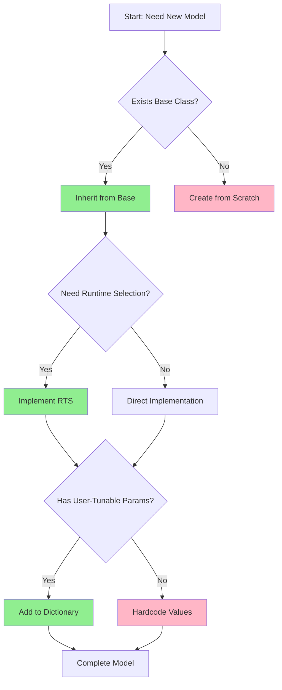

# Model Development Rationale

หลักการและเหตุผลในการพัฒนาโมเดล

---

## 📚 Learning Objectives

เป้าหมายการเรียนรู้

After completing this section, you should be able to:

- **Explain** อธิบายเหตุผลเชิงปรัชญา หลังการออกแบบโครงสร้างโมเดล OpenFOAM
- **Apply** นำหลักการออกแบบ ไปใช้ในการสร้างโมเดลที่ยืดหยุ่นและบำรุงรักษาได้
- **Evaluate** ประเมิน trade-offs ระหว่างวิธีการออกแบบที่แตกต่างกัน
- **Identify** ระบุ anti-patterns ที่ควรหลีกเลี่ยงในการพัฒนาโมเดล

---

## 📋 Prerequisites

ความรู้พื้นฐานที่ต้องมี

- Basic C++ programming (classes, inheritance, virtual functions)
- OpenFOAM file structure basics
- Understanding of dictionary files in OpenFOAM

---

## Overview

> Build on OpenFOAM patterns for **maintainable**, **extensible**, and **robust** models  
> สร้างโมเดลบนพื้นฐานรูปแบบ OpenFOAM เพื่อโมเดลที่ **บำรุงรักษาได้** และ **ยืดหยุ่น**

---

## 1. Design Goals

เป้าหมายการออกแบบ

### 1.1 What - สิ่งที่เราต้องการสำเร็จ

| Goal | Description |
|------|-------------|
| **Reusable** | นำกลับมาใช้ใหม่ได้ - Code สามารถประยุกต์ใช้กับโครงการอื่น |
| **Extensible** | ขยายได้ - เพิ่มฟีเจอร์ใหม่โดยไม่แก้โค้ดเดิม |
| **Testable** | ทดสอบได้ - ออกแบบให้ทดสอบหน่วยแยกกันได้ |
| **Maintainable** | บำรุงรักษาได้ - อ่านและแก้ไขง่ายในภายหลัง |

### 1.2 Why - เหตุผลเชิงปรัชญา

**Philosophy Behind Each Design Goal:**

#### **Reusable** - ทำไมต้องนำกลับมาใช้ใหม่ได้?

- **Don't Repeat Yourself (DRY):** ลดการเขียนโค้ดซ้ำ ซึ่งเป็นแหล่งความผิดพลาด
- **Consistency:** โค้ดที่ใช้ร่วมกันรับประกันพฤติกรรมสม่ำเสมอ
- **Efficiency:** พัฒนาครั้งเดียว ใช้ได้หลายที่
- **Community Standards:** ตรงกับแนวทาง OpenFOAM ที่ส่งเสริมการแบ่งปัน

#### **Extensible** - ทำไมต้องขยายได้?

- **Future-Proofing:** โมเดลควรเติบโตไปพร้อมกับความต้องการวิจัย
- **Plugin Architecture:** เพิ่มความสามารถโดยไม่กระทบส่วนที่ทำงานอยู่
- **Runtime Flexibility:** ผู้ใช้เลือกโมเดลผ่าน dictionary ไม่ต้อง recompile
- **Separation of Concerns:** แยกส่วน core จากส่วนเฉพาะทาง

#### **Testable** - ทำไมต้องทดสอบได้?

- **Scientific Rigor:** โมเดล CFD ต้องมั่นใจในความถูกต้อง
- **Debugging:** แยกปัญหาได้ง่ายเมื่อโมดูลเป็นอิสระ
- **Validation:** ทดสอบกับ benchmark ได้ทีละส่วน
- **Confidence:** แก้ไขโค้ดโดยไม่ทำลายฟีเจอร์ที่มีอยู่

#### **Maintainable** - ทำไมต้องบำรุงรักษาได้?

- **Code Longevity:** โค้ดที่ดีอยู่ได้หลายปี
- **Team Collaboration:** คนอื่นเข้าใจและพัฒนาต่อได้
- **Documentation:** Self-documenting code ลดภาระคำอธิบาย
- **OpenFOAM Style:** ทำตาม convention ทำให้ integration ง่าย

### 1.3 How - วิธีนำไปใช้

| Goal | Implementation Strategy |
|------|------------------------|
| **Reusable** | Use templates, inheritance, composition |
| **Extensible** | Use RTS (Run-Time Selection), virtual functions |
| **Testable** | Modular design, dependency injection |
| **Maintainable** | Follow OpenFOAM coding standards |

### 1.4 Trade-offs Discussion

**การแลกเปลี่ยนระหว่างเป้าหมาย**

| Trade-off | Consideration |
|-----------|---------------|
| **Flexibility vs Performance** | Virtual functions ยืดหยุ่นแต่มี overhead เล็กน้อย |
| **Generality vs Simplicity** | Templates ทำงานกับหลาย type แต่ compile ช้า |
| **Abstraction vs Clarity** | Layer มากเกินไปทำให้ trace code ยาก |
| **Feature Rich vs Focused** | ฟีเจอร์มากเกินไปทำให้ maintenance หนัก |

**Guideline:** Balance based on use case - start simple, add complexity only when needed

### 1.5 Anti-Patterns to Avoid

⚠️ **รูปแบบที่ควรหลีกเลี่ยง**

| Anti-Pattern | Why Bad | Better Approach |
|--------------|---------|-----------------|
| **God Class** | คลาสเดียวทำทุกอย่า่าง - แก้ยาก ทดสอบยาก | Split into focused classes |
| **Copy-Paste Coding** | Code ซ้ำ - แก้ที่เดียวไม่ได้ผลทั้งหมด | Extract common logic |
| **Hardcoded Values** | ไม่ยืดหยุ่น - เปลี่ยนต้อง recompile | Dictionary parameters |
| **Tight Coupling** | พึ่งพากันมาก - แก้ที่นึงกระทบทั้งระบบ | Use interfaces, dependency injection |
| **Not Using RTS** | เพิ่มโมเดลต้องแก้โค้ดหลัก | Implement runtime selection |
| **Ignoring Base Class** | Reinvent the wheel | Inherit and extend existing |

---

## 2. Inheritance Strategy

กลยุทธ์การใช้ Inheritance

### 2.1 What

การสืบทอดจาก base class ที่เหมาะสมเพื่อใช้งาน infrastructure ที่มีอยู่

### 2.2 Why

- **Code Reuse:** ไม่ต้องเขียนซ้ำสิ่งที่ base class ทำไว้แล้ว
- **Polymorphism:** โมเดลของคุณทำงานร่วมกับ OpenFOAM framework
- **Consistency:** มั่นใจว่า interface ตรงกับมาตรฐาน
- **Interoperability:** ใช้งานร่วมกับ solvers/utilities อื่นๆ ได้

### 2.3 How

```cpp
// ✓ CORRECT: Inherit from appropriate base
class myModel : public turbulenceModel
{
    // Use base class infrastructure
    // - Mesh access
    // - Field management
    // - Time tracking
    // - Database operations
};
```

```cpp
// ✗ AVOID: Starting from scratch
class myModel  // No base class
{
    // Must implement EVERYTHING yourself
    // - Mesh handling
    // - Time integration
    // - Database access
    // Easy to introduce bugs!
};
```

### Common Base Classes

| Base Class | When to Use |
|------------|-------------|
| `turbulenceModel` | Turbulence closures (k-ε, k-ω, LES) |
| `thermophysicalTransportModel` | Heat/mass transfer models |
| `radiationModel` | Radiation calculations |
| `fvModel` | Finite volume source terms |
| `fvOption` | Optional fvMatrix sources |

---

## 3. RTS Integration

การผนวก Run-Time Selection

### 3.1 What

ระบบที่ให้ผู้ใช้เลือกโมเดลผ่าน dictionary file โดยไม่ต้อง recompile

### 3.2 Why

**Philosophy:** Configuration should be external to code

- **User Convenience:** แก้โมเดลโดยแก้ text file ไม่ต้อง programming
- **Experimentation:** เปรียบเทียบโมเดลได้รวดเร็ว
- **Distribution:** แชร์ setup ได้โดยไม่ต้องแจก source code
- **Validation:** เปลี่ยนโมเดลเพื่อ test ได้ทันที
- **Standard Practice:** OpenFOAM solvers ทุกตัวใช้ RTS

### 3.3 How

```cpp
// 1. Declare type name for dictionary lookup
TypeName("myModel");

// 2. Declare runtime selection table
declareRunTimeSelectionTable
(
    autoPtr,
    turbulenceModel,
    dictionary,
    (
        const volScalarField& rho,
        const volVectorField& U,
        const surfaceScalarField& phi,
        const transportModel& transport
    ),
    (rho, U, phi, transport)
);

// 3. Register in constructor table
addToRunTimeSelectionTable
(
    turbulenceModel,
    myModel,
    dictionary
);
```

**Dictionary Usage:**

```cpp
// User can now select in constant/turbulenceProperties:
simulationType  RAS;
RAS
{
    RASModel        myModel;  // ← Your model here!
    
    myModelCoeffs
    {
        Cmu         0.09;
        C1          1.44;
        C2          1.92;
    }
}
```

### 3.4 Trade-offs

| Pro | Con |
|-----|-----|
| Flexible switching | Slight runtime overhead |
| User-friendly | More complex setup code |
| Standard compliant | Harder to debug macros |

**Verdict:** Benefits far outweigh costs for any reusable model

---

## 4. Field Usage

การใช้งาน Field

### 4.1 What

การจัดเก็บ geometric fields เป็น member variables ของโมเดล

### 4.2 Why

- **Lifetime Management:** Fields มีชีวิตตลอด solver run
- **Access Control:** Private members ป้องกันการแก้ไขโดยไม่ได้ตั้งใจ
- **Encapsulation:** โมเดลควบคุมการเข้าถึงข้อมูล
- **Consistency:** Fields sync กับ mesh automatically

### 4.3 How

```cpp
// ✓ CORRECT: Store as member variables
class myModel : public turbulenceModel
{
private:
    // Required fields - always present
    volScalarField k_;
    volScalarField epsilon_;
    
    // Optional fields - use autoPtr
    autoPtr<volScalarField> nuTilda_;
    
public:
    myModel(...)
    :
        turbulenceModel(...),
        k_        // Initialize in constructor
        (
            IOobject
            (
                "k",  // Field name
                mesh_.time().timeName(),
                mesh_,
                IOobject::MUST_READ,
                IOobject::AUTO_WRITE
            ),
            mesh_
        ),
        epsilon_
        (
            IOobject
            (
                "epsilon",
                mesh_.time().timeName(),
                mesh_,
                IOobject::MUST_READ,
                IOobject::AUTO_WRITE
            ),
            mesh_
        )
    {
        // Optional field - conditionally create
        if (coeffDict_.getBool("includeNutilda"))
        {
            nuTilda_.set
            (
                new volScalarField
                (
                    IOobject
                    (
                        "nuTilda",
                        mesh_.time().timeName(),
                        mesh_,
                        IOobject::READ_IF_PRESENT,
                        IOobject::AUTO_WRITE
                    ),
                    mesh_
                )
            );
        }
    }
};
```

### 4.4 Anti-Patterns

| ❌ Bad Pattern | ✅ Better Approach |
|----------------|-------------------|
| Global fields everywhere | Encapsulate in model class |
| Raw pointers | `autoPtr` or `tmp` for management |
| Public member fields | Private + accessor methods |
| Local variables in `correct()` | Member variables for persistence |

---

## 5. Method Design

การออกแบบ Method

### 5.1 What

กำหนด interface ที่ virtual สำหรับ extensibility และ access methods สำหรับ data encapsulation

### 5.2 Why

**Virtual Methods:**
- **Polymorphism:** Base class calls your implementation automatically
- **Framework Integration:** Solver ไม่ต้องรู้ว่าเป็นโมเดลไหน
- **Consistency:** ทุกโมเดลมี interface เหมือนกัน

**Access Methods:**
- **Encapsulation:** ซ่อน implementation details
- **Return Optimization:** `tmp<T>` ลดการ copy
- **Const Correctness:** ป้องกันการแก้ไขโดยไม่ตั้งใจ

### 5.3 How

```cpp
class myModel : public turbulenceModel
{
public:
    // ===== VIRTUAL METHODS - Override from base =====
    
    // Main correction method - called every time step
    virtual void correct()
    {
        // Update your model equations here
        // This is where the physics happens!
    }
    
    // Destructor - must be virtual
    virtual ~myModel()
    {}
    
    // ===== ACCESS METHODS - Provide data safely =====
    
    // Return by tmp<T> for efficiency
    virtual tmp<volScalarField> k() const
    {
        return k_;  // Returns reference-counted wrapper
    }
    
    virtual tmp<volScalarField> epsilon() const
    {
        return epsilon_;
    }
    
    // Const access - prevents modification
    virtual const volScalarField& kRef() const
    {
        return k_;
    }
    
    // Non-const access - for internal use
    virtual volScalarField& kRef()
    {
        return k_;
    }
    
    // Computed properties
    virtual tmp<volScalarField> nut() const
    {
        // Compute on-the-fly
        return tmp<volScalarField>
        (
            new volScalarField
            (
                Cmu_*sqr(k_)/(epsilon_ + dimensionedScalar("small", dimless, SMALL))
            )
        );
    }
};
```

### 5.4 Method Categories

| Category | Purpose | Example |
|----------|---------|---------|
| **Lifecycle** | Construction/destruction | Constructor, destructor |
| **Core Physics** | Main solver calls | `correct()`, `solve()` |
| **Accessors** | Get model data | `k()`, `epsilon()`, `nut()` |
| **Utilities** | Helper functions | `read()`, `write()` |

### 5.5 Anti-Patterns

```cpp
// ✗ AVOID: Non-virtual override
void correct()  // Missing 'virtual'
{
    // Won't be called through base pointer!
}

// ✗ AVOID: Returning by value (expensive copy)
volScalarField k() const
{
    return k_;  // Copies entire field!
}

// ✗ AVOID: Non-const accessor
volScalarField& k() const  // Contradictory!
{
    return k_;  // Allows modification through const method
}

// ✓ CORRECT: Virtual + tmp<T> + const
virtual tmp<volScalarField> k() const
{
    return k_;  // Efficient, safe, polymorphic
}
```

---

## 6. Dictionary Reading

การอ่านค่าจาก Dictionary

### 6.1 What

กำหนด parameters ผ่าน dictionary files แทน hardcoding

### 6.2 Why

- **Tunability:** ปรับค่าได้โดยไม่ recompile
- **Case Management:** แต่ละเคสมี parameter set ของตัวเอง
- **Documentation:** Dictionary เป็น spec ที่ชัดเจน
- **Validation:** OpenFOAM validates types automatically
- **Reproducibility:** Save dictionary = save exact configuration

### 6.3 How

```cpp
class myModel : public turbulenceModel
{
private:
    // Model coefficients
    scalar Cmu_;
    scalar C1_;
    scalar C2_;
    scalar sigmaK_;
    scalar sigmaEps_;
    
    // Switches/flags
    Switch wallTreatment_;
    word fluxScheme_;
    
public:
    myModel(...)
    :
        turbulenceModel(...),
        // Read required coefficients
        Cmu_(coeffDict().get<scalar>("Cmu")),
        C1_(coeffDict().get<scalar>("C1")),
        C2_(coeffDict().get<scalar>("C2")),
        
        // Read optional with defaults
        sigmaK_(coeffDict().getOrDefault<scalar>("sigmaK", 1.0)),
        sigmaEps_(coeffDict().getOrDefault<scalar>("sigmaEps", 1.3)),
        
        // Read switches
        wallTreatment_(coeffDict().getOrDefault<Switch>("wallTreatment", true)),
        fluxScheme_(coeffDict().getOrDefault<word>("fluxScheme", word("Gauss linear")))
    {
        // Validate ranges
        if (Cmu_ <= 0 || Cmu_ > 1.0)
        {
            FatalErrorInFunction
                << "Cmu must be between 0 and 1, got " << Cmu_
                << exit(FatalError);
        }
    }
};
```

**Dictionary File:**

```cpp
myModelCoeffs
{
    // Required
    Cmu         0.09;
    C1          1.44;
    C2          1.92;
    
    // Optional (have defaults)
    sigmaK      1.0;
    sigmaEps    1.3;
    
    // Switches
    wallTreatment  true;
    fluxScheme     Gauss linear;
}
```

### 6.4 Reading Methods

| Method | Use Case | Example |
|--------|----------|---------|
| `get<T>("key")` | Required parameter | `Cmu_ = coeffDict().get<scalar>("Cmu");` |
| `getOrDefault<T>("key", default)` | Optional with default | `sigmaK_ = coeffDict().getOrDefault<scalar>("sigmaK", 1.0);` |
| `readEntry("key", value)` | Read into existing variable | `coeffDict().readEntry("Cmu", Cmu_);` |
| `get<Switch>("key")` | Boolean flag | `debug_ = coeffDict().get<Switch>("debug");` |
| `get<word>("key")` | String/enum | `scheme_ = coeffDict().get<word>("scheme");` |

### 6.5 Anti-Patterns

```cpp
// ✗ AVOID: Hardcoded values
class myModel
{
    scalar Cmu_ = 0.09;  // Can't change without recompile!
};

// ✗ AVOID: Reading without defaults
scalar Cmu_;
Cmu_ = coeffDict().get<scalar>("Cmu");  // Crashes if not present!

// ✗ AVOID: No validation
scalar beta_;
beta_ = coeffDict().getOrDefault<scalar>("beta", -100.0);  
// Negative value might break physics!

// ✓ CORRECT: Dictionary + defaults + validation
scalar Cmu_;
Cmu_ = coeffDict().getOrDefault<scalar>("Cmu", 0.09);

if (Cmu_ <= 0 || Cmu_ > 1.0)
{
    WarningInFunction << "Cmu out of range: " << Cmu_ << endl;
}
```

---

## Quick Reference

คู่มืออ้างอิงรวดเร็ว

### Architecture Summary

| Aspect | Approach | Rationale |
|--------|----------|-----------|
| **Base Class** | Inherit from existing | Reuse infrastructure |
| **Extensibility** | RTS | Runtime model selection |
| **Fields** | Member variables | Lifetime management |
| **Coefficients** | Dictionary | Tunability |
| **Methods** | Virtual | Polymorphism |
| **Access** | `tmp<T>` return | Efficiency |

### Design Decision Flowchart



### Implementation Checklist

- [ ] Choose appropriate base class
- [ ] Implement RTS macros
- [ ] Add to runtime selection table
- [ ] Declare member fields
- [ ] Implement constructor with dictionary reading
- [ ] Override `correct()` method
- [ ] Add access methods with `tmp<T>`
- [ ] Add parameter validation
- [ ] Write dictionary entry
- [ ] Test with simple case

---

## 🧠 Concept Check

ทดสอบความเข้าใจ

<details>
<summary><b>1. ทำไมใช้ inheritance?</b></summary>

**Answer:** เพื่อ **reuse** base class infrastructure (mesh, time, database) และทำให้โมเดล **interoperate** กับ OpenFOAM ecosystem เพราะ base class กำหนด interface ที่ solvers ใช้งานอยู่แล้ว

**Key Points:**
- Reuse existing functionality
- Polymorphic behavior through base class pointers
- Consistency with OpenFOAM conventions
</details>

<details>
<summary><b>2. RTS ช่วยอะไร?</b></summary>

**Answer:** RTS ทำให้ **user can select model จาก dictionary** โดยไม่ต้อง recompile ซึ่งเป็นประโยชน์สำหรับ:

- Parameter studies: เปรียบเทียบโมเดลได้รวดเร็ว
- Case management: แต่ละเคสใช้โมเดลต่างกัน
- Distribution: แชร์ setup โดยไม่ต้องแจก code
- Experimentation: ลองโมเดลใหม่ได้ทันที

**Mechanism:** Dictionary → TypeName → Constructor Table → Model Selection
</details>

<details>
<summary><b>3. Dictionary coefficients ดีอย่างไร?</b></summary>

**Answer:** Dictionary ทำให้ parameters **tunable โดยไม่ต้อง recompile** ซึ่งให้:

- **Flexibility:** แก้ได้ทันทีด้วย text editor
- **Case-specific:** แต่ละเคสมีค่าของตัวเอง
- **Documentation:** Dictionary เป็น spec ที่ชัดเจน
- **Validation:** OpenFOAM check types automatically
- **Reproducibility:** Save dictionary = save exact config

**Best Practice:** ให้ค่า default สำหรับ optional parameters
</details>

<details>
<summary><b>4. ทำไมต้องใช้ tmp&lt;T&gt; ใน access methods?</b></summary>

**Answer:** `tmp<T>` ใช้ **reference counting** เพื่อ:

- **Avoid copy:** Large fields ไม่ถูก copy เปลืองหน่วยความจำ
- **Automatic management:** ลด reference count และ cleanup อัตโนมัติ
- **Return optimization:** Compiler สามารถ optimize ให้ return reference โดยตรง
- **Standard practice:** ทุก OpenFOAM access methods ใช้ `tmp<T>`

**Performance:** สำคัญมากกับ fields ที่มี millions of cells
</details>

<details>
<summary><b>5. Anti-pattern ที่อันตรายที่สุดคืออะไร?</b></summary>

**Answer:** ขึ้นกับบริบท แต่ top 3 ที่ควรหลีกเลี่ยง:

1. **God Class** - คลาสเดียวทำทุกอย่าง
   - ผล: แก้ยาก, ทดสอบยาก, ไม่สามารถ reuse ได้
   
2. **Copy-Paste Coding** - code ซ้ำ
   - ผล: แก้ที่เดียวไม่ได้ผลทั้งหมด, bug ซ้ำ
   
3. **Hardcoded Values** - ไม่ยืดหยุ่น
   - ผล: เปลี่ยนต้อง recompile, case-specific logic ตาย

**Prevention:** Follow OpenFOAM patterns, use inheritance, RTS, dictionaries
</details>

---

## 📖 Related Documents

เอกสารที่เกี่ยวข้อง

- **ภาพรวม:** [00_Overview.md](00_Overview.md) - ภาพรวมโครงการ
- **Project Overview:** [01_Project_Overview.md](01_Project_Overview.md) - รายละเอียดโครงการ
- **Folder Organization:** [03_Folder_and_File_Organization.md](03_Folder_and_File_Organization.md) - โครงสร้างไฟล์
- **Implementation:** [04_Implementation_Details.md](04_Implementation_Details.md) - รายละเอียดการ implement
- **Integration:** [05_Integration_Testing.md](05_Integration_Testing.md) - การทดสอบการผนวก

---

## 🔗 Cross-References

เชื่อมโยงไปยังแนวคิดที่เกี่ยวข้อง

### Within This Module

- **RTS Deep Dive:** ดูรายละเอียดเพิ่มเติมใน [06_Architecture_Extensibility](../../06_ARCHITECTURE_EXTENSIBILITY/00_Overview.md)
- **Inheritance Patterns:** ศึกษาต่อใ [02_Inheritance_Polymorphism](../../02_INHERITANCE_POLYMORPHISM/00_Overview.md)
- **Memory Management:** เรียนรู้เพิ่มใ [04_Memory_Management](../../04_MEMORY_MANAGEMENT/00_Overview.md)

### Related Modules

- **Basic C++:** [Module 4 - C++ Programming](../../../MODULE_04_CPP_PROGRAMMING/00_Overview.md)
- **Turbulence Modeling:** [Module 6 - Advanced Physics](../../../MODULE_06_ADVANCED_PHYSICS/00_Overview.md)
- **Verification:** [Module 8 - Testing & Validation](../../../MODULE_08_TESTING_VALIDATION/00_Overview.md)

---

## 🎯 Key Takeaways

สรุปสิ่งสำคัญ

### Design Principles
1. ✅ **Inherit** from appropriate base classes - don't reinvent the wheel
2. ✅ **Use RTS** for runtime model selection - flexibility without recompilation
3. ✅ **Store fields** as members - proper lifetime management
4. ✅ **Return by `tmp<T>`** - avoid expensive copies
5. ✅ **Read from dictionary** - tunable parameters
6. ✅ **Make methods virtual** - enable polymorphism

### Anti-Patterns to Avoid
1. ❌ God classes doing everything
2. ❌ Copy-paste coding
3. ❌ Hardcoded values
4. ❌ Tight coupling
5. ❌ Ignoring OpenFOAM conventions

### Philosophy
> **"Work with the framework, not against it"**  
> ใช้พลังของ OpenFOAM patterns ไม่ใช่ต่อสู้กับมัน

---

## 💡 Putting It All Together

การนำทุกอย่างมาเชื่อมรวม

When developing a new model in OpenFOAM, follow this complete workflow:

```cpp
// 1. INHERITANCE: Start with right base class
class myTurbulenceModel : public turbulenceModel
{
    // 2. RTS: Enable runtime selection
    TypeName("myTurbulenceModel");
    
    // 3. FIELDS: Store model data
    volScalarField k_;
    volScalarField epsilon_;
    
    // 4. PARAMETERS: Dictionary-based
    scalar Cmu_;
    scalar C1_;
    
public:
    // 5. CONSTRUCTOR: Read from dictionary
    myTurbulenceModel(...)
    :
        turbulenceModel(...),
        k_(...),
        epsilon_(...),
        Cmu_(coeffDict().getOrDefault<scalar>("Cmu", 0.09)),
        C1_(coeffDict().getOrDefault<scalar>("C1", 1.44))
    {}
    
    // 6. VIRTUAL METHODS: Override core physics
    virtual void correct()
    {
        // Implement your model equations
    }
    
    // 7. ACCESS METHODS: Return efficiently
    virtual tmp<volScalarField> k() const
    {
        return k_;
    }
};
```

**Result:** A maintainable, extensible, testable model that fits perfectly into the OpenFOAM ecosystem!