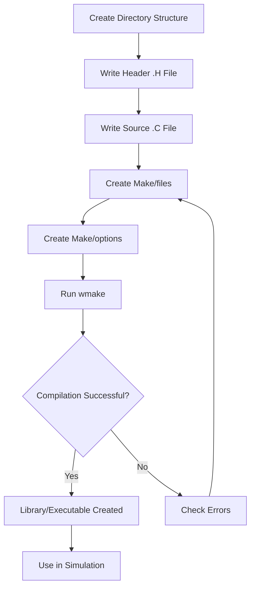

# Folder and File Organization

การจัดโครงสร้างโฟลเดอร์และไฟล์

---

## 🎯 Learning Objectives

**วัตถุประสงค์การเรียนรู้**

By the end of this section, you will be able to:

- ✅ **Structure** OpenFOAM solver/utility folders correctly
- ✅ **Apply** consistent naming conventions across all files
- ✅ **Configure** Make/files and Make/options properly
- ✅ **Understand** the purpose of each file type and directory

เมื่อจบส่วนนี้ คุณจะสามารถ:
- ✅ จัดโครงสร้างโฟลเดอร์ solver/utility ของ OpenFOAM ได้อย่างถูกต้อง
- ✅ ใช้ naming conventions ที่สอดคล้องกันทั่วทั้งไฟล์
- ✅ ตั้งค่า Make/files และ Make/options ได้อย่างเหมาะสม
- ✅ เข้าใจวัตถุประสงค์ของแต่ละประเภทไฟล์และไดเรกทอรี

---

## 📋 Prerequisites

**ความรู้พื้นฐานที่ต้องมี**

Before starting this section, ensure you have:

- ⭐ **Basic File System Knowledge** - Understanding of directories, files, and paths
- ⭐ **C++ Fundamentals** - Familiarity with header and source file separation
- ⭐ **OpenFOAM Basics** - Completed Module 1 or equivalent experience
- ⭐ **Terminal Usage** - Comfortable with command line navigation

ก่อนเริ่มส่วนนี้ ให้แน่ใจว่าคุณมี:
- ⭐ ความรู้พื้นฐานเรื่องระบบไฟล์ - ความเข้าใจเรื่องไดเรกทอรี ไฟล์ และ paths
- ⭐ พื้นฐานภาษา C++ - ความคุ้นเคยกับการแยกไฟล์ header และ source
- ⭐ พื้นฐาน OpenFOAM - ผ่าน Module 1 หรือมีประสบการณ์เทียบเท่า
- ⭐ การใช้ Terminal - คุ้นเคยกับการนำทาง command line

---

## Overview

> **Follow OpenFOAM naming conventions for maintainability**

> **ปฏิบัติตาม naming conventions ของ OpenFOAM เพื่อความง่ายในการบำรุงรักษา**

**What (อะไร):** Standard organization structure for OpenFOAM source code files and directories

**Why (ทำไม):**
- 🔧 **Maintainability** - Consistent structure makes code easier to navigate and modify
- 🔧 **Compilation** - OpenFOAM build system expects specific directory layouts
- 🔧 **Collaboration** - Shared conventions enable team development
- 🔧 **Reusability** - Proper structure facilitates code sharing across projects

**How (อย่างไร):** Follow the standard layout with Make/ directory, proper header/source separation, and consistent naming conventions

---

## 1. Standard Layout

```
myModel/
├── Make/
│   ├── files      # Sources + target
│   └── options    # Includes + libs
├── lnInclude/     # Auto-generated symlinks
├── myModel.H      # Declaration
├── myModel.C      # Implementation
└── myModelI.H     # Optional inline methods
```

**What (อะไร):** The canonical directory structure for any OpenFOAM library or application

**Why (ทำไม):**
- 🔍 **Separation of Concerns** - Build configuration separated from source code
- 🔍 **Auto-Generation** - lnInclude/ is created automatically by wmake
- 🔍 **Modularity** - Each file has a single, clear responsibility
- 🔍 **Scalability** - Structure scales from simple utilities to complex solvers

**How (อย่างไร):** Create directories and files as shown; run `wmake` to generate lnInclude/

---

## 2. Header File (.H)

```cpp
#ifndef myModel_H
#define myModel_H

#include "baseClass.H"

// * * * * * * * * * * * * * * * * * * * * * * * * * * * * * * * * * * * * * //

namespace Foam
{

// Class declaration
class myModel
:
    public baseClass
{
    // Public members
    public:
        
        // Constructor
        myModel();
        
        // Destructor  
        virtual ~myModel();
        
        // Member functions
        virtual void calculate() = 0;
    
    // Private members
    private:
        
        // Private data
        label nCells_;
        
        // Private methods
        void initialize();
};

// * * * * * * * * * * * * * * * * * * * * * * * * * * * * * * * * * * * * * //

} // End namespace Foam

// * * * * * * * * * * * * * * * * * * * * * * * * * * * * * * * * * * * * * //

#endif
```

**What (อะไร):** Declaration file containing class interfaces, function prototypes, and constants

**Why (ทำไม):**
- 📄 **Interface Definition** - Defines the public API without implementation details
- 📄 **Compilation Speed** - Headers can be included without recompiling implementation
- 📄 **Documentation** - Serves as primary reference for class usage
- 📄 **Type Safety** - Enables compile-time type checking

**How (อย่างไร):**
- Use `#ifndef` guards to prevent multiple inclusion
- Match filename to class name exactly
- Organize as: includes → namespace → class → closing braces
- Add clear comments for each section

---

## 3. Source File (.C)

```cpp
#include "myModel.H"

// * * * * * * * * * * * * * * * * * * * * * * * * * * * * * * * * * * * * * //

// Optionally include template implementations
#ifdef NoRepository
    #include "myModelTemplates.C"
#endif

// * * * * * * * * * * * * * * * * * * * * * * * * * * * * * * * * * * * * * //

namespace Foam
{

// Define type name for runtime selection
defineTypeNameAndDebug(myModel, 0);

// * * * * * * * * * * * * * * * * * * * * * * * * * * * * * * * * * * * * * //

// Constructor
myModel::myModel()
:
    baseClass(),
    nCells_(0)
{
    initialize();
}

// Destructor
myModel::~myModel()
{}

// Private methods
void myModel::initialize()
{
    nCells_ = 100;
}

// * * * * * * * * * * * * * * * * * * * * * * * * * * * * * * * * * * * * * //

} // End namespace Foam

// * * * * * * * * * * * * * * * * * * * * * * * * * * * * * * * * * * * * * //
```

**What (อะไร):** Implementation file containing actual function definitions and logic

**Why (ทำไม):**
- ⚙️ **Implementation Hiding** - Separates "what" from "how"
- ⚙️ **Compilation Efficiency** - Only changed files need recompilation
- ⚙️ **Binary Compatibility** - Enables library linking without source
- ⚙️ **Code Organization** - Keeps implementation details separate from interface

**How (อย่างไร):**
- Include corresponding header first
- Use `defineTypeNameAndDebug` for runtime selection
- Organize methods logically (constructor → public → private)
- Use initializer lists in constructors
- Add section comment dividers for readability

---

## 4. Make/files

```make
# Source files
myModel.C
AnotherSource.C
myModelTemplates.C

# Target library
LIB = $(FOAM_USER_LIBBIN)/libMyModel
```

**For executables:**
```make
# Source files (main must be listed)
myModel.C
main.C

# Target executable
EXE = $(FOAM_USER_APPBIN)/myModel
```

**What (อะไร):** Build configuration file listing source files and build target

**Why (ทำไม):**
- 🎯 **Source Tracking** - Tells wmake which files to compile
- 🎯 **Target Specification** - Defines output library or executable
- 🎯 **Build Automation** - Enables automated dependency resolution
- 🎯 **Portability** - Uses environment variables for path independence

**How (อย่างไร):**
- List all `.C` source files (one per line)
- Use `LIB =` for libraries, `EXE =` for executables
- Use `$(FOAM_USER_LIBBIN)` for user libraries
- Use `$(FOAM_USER_APPBIN)` for user applications
- Order matters: list dependent files before dependents

---

## 5. Make/options

```make
# Include paths
EXE_INC = \
    -I$(LIB_SRC)/finiteVolume/lnInclude \
    -I$(LIB_SRC)/meshTools/lnInclude \
    -I./lnInclude

# Libraries to link
EXE_LIBS = \
    -lfiniteVolume \
    -lmeshTools
```

**What (อะไร):** Compilation and linking flags for include paths and libraries

**Why (ทำไม):**
- 🔗 **Dependency Resolution** - Specifies required OpenFOAM libraries
- 🔗 **Header Access** - Tells compiler where to find header files
- 🔗 **Linker Configuration** - Defines which libraries to link against
- 🔗 **Build Consistency** - Ensures consistent compilation across systems

**How (อย่างไร):**
- Use `EXE_INC` for include paths (start with `-I`)
- Use `EXE_LIBS` for libraries (start with `-l`)
- Always include `./lnInclude` for local headers
- Use `$(LIB_SRC)/<module>/lnInclude` for OpenFOAM modules
- End lines with ` \` for multi-line continuation
- Don't put ` \` on the last line

---

## 6. Naming Conventions

| Item | Convention | Example | Why? |
|------|------------|---------|------|
| **Class** | `PascalCase` | `myModel`, `RASModel` | Clear identification of types |
| **Header File** | Same as class + `.H` | `myModel.H` | Direct mapping class → file |
| **Source File** | Same as class + `.C` | `myModel.C` | Direct mapping class → file |
| **Member Function** | `camelCase` | `calculate()`, `getMesh()` | Distinguishes from types |
| **Member Variable** | `camelCase_` | `nCells_`, `meshPtr_` | Underscore indicates member |
| **Local Variable** | `camelCase` | `i`, `cellId` | No trailing underscore |
| **Constant** | `UPPER_CASE` | `MAX_ITER`, `PI` | Indicates immutable values |
| **Macro** | `UPPER_CASE` | `DEBUG` | Follows C convention |

**What (อะไร):** Standardized naming patterns for code elements

**Why (ทำไม):**
- 🏷️ **Readability** - Consistent names improve code comprehension
- 🏷️ **Tooling** - Enables automated code generation and parsing
- 🏷️ **Maintenance** - Easier to locate and modify code
- 🏷️ **Convention Over Configuration** - Reduces decision fatigue
- 🏷️ **Community Standards** - Aligns with OpenFOAM ecosystem

**How (อย่างไร):**
- Always match filenames to class names exactly
- Use trailing underscore for member variables
- Avoid Hungarian notation and abbreviations
- Prefer descriptive names over short ones
- Use verbs for functions (`get`, `set`, `calculate`)
- Use nouns for variables and classes

---

## 7. File Type Quick Reference

| File Extension | Content | Purpose | Auto-Generated? |
|----------------|---------|---------|-----------------|
| `.H` | **Declarations** | Class interfaces, prototypes | No |
| `.C` | **Implementations** | Function definitions, logic | No |
| `.I.H` | **Inline methods** | Template/trivial functions | No |
| `Templates.C` | **Template code** | Template implementations | No |
| `lnInclude/` | **Symlinks** | Auto-generated header links | ✅ Yes (by wmake) |

---

## 🔄 Workflow Diagram



---

## 📝 Summary Table

| Component | Location | Purpose | Key Points |
|-----------|----------|---------|------------|
| **Make/files** | `Make/files` | List sources and target | One file per line, use `LIB=` or `EXE=` |
| **Make/options** | `Make/options` | Include paths and libraries | Use `EXE_INC` and `EXE_LIBS` |
| **lnInclude/** | Auto-generated | Header symlinks for compilation | Don't edit manually |
| **Header .H** | `ClassName.H` | Class declarations | Use include guards |
| **Source .C** | `ClassName.C` | Function implementations | Include corresponding header |

---

## 🧠 Concept Check

<details>
<summary><b>1. lnInclude ทำไม?</b></summary>

**Symlinks** สำหรับ include paths — auto-generated

- **Why:** Flattens directory structure for easier includes
- **Why:** Enables consistent header access across projects
- **Why:** Auto-generated by wmake to track dependencies

**ทำไม:** ทำให้โครงสร้างไดเรกทอรีเรียบง่ายสำหรับการ include
**ทำไม:** ช่วยให้เข้าถึง header ได้สอดคล้องกันทั่วทั้งโปรเจกต์
**ทำไม:** สร้างอัตโนมัติโดย wmake เพื่อติดตาม dependencies

</details>

<details>
<summary><b>2. แยก .H และ .C ทำไม?</b></summary>

**Compilation efficiency** และ readability

- **Why:** Headers can be included without recompiling implementation
- **Why:** Separates interface (what) from implementation (how)
- **Why:** Only modified files need recompilation
- **Why:** Enables binary library distribution

**ทำไม:** สามารถ include headers ได้โดยไม่ต้องคอมไพล์ implementation ใหม่
**ทำไม:** แยกส่วน interface (อะไร) จาก implementation (อย่างไร)
**ทำไม:** คอมไพล์เฉพาะไฟล์ที่แก้ไขเท่านั้น
**ทำไม:** ช่วยให้สามารถแจกจ่าย library แบบ binary ได้

</details>

<details>
<summary><b>3. Make/options ใส่อะไร?</b></summary>

**Include paths** และ **libraries**

- **EXE_INC:** Header search paths (start with `-I`)
- **EXE_LIBS:** Libraries to link (start with `-l`)
- **Always include:** `./lnInclude` for local headers
- **Use variables:** `$(LIB_SRC)` for portability

**ใส่อะไร:**
- **EXE_INC:** พาธค้นหา header (เริ่มต้นด้วย `-I`)
- **EXE_LIBS:** libraries ที่ต้องลิงก์ (เริ่มต้นด้วย `-l`)
- **ต้องรวมเสมอ:** `./lnInclude` สำหรับ local headers
- **ใช้ตัวแปร:** `$(LIB_SRC)` สำหรับ portability

</details>

<details>
<summary><b>4. Naming conventions ทำไมสำคัญ?</b></summary>

**Maintainability** และ **tooling support**

- **Why:** Enables automated code generation (wmake scripts)
- **Why:** Makes code searchable and navigable
- **Why:** Reduces cognitive load when reading code
- **Why:** Aligns with OpenFOAM ecosystem expectations

**ทำไมสำคัญ:**
- **ทำไม:** ช่วยให้สร้าง code อัตโนมัติได้ (wmake scripts)
- **ทำไม:** ทำให้ code ค้นหาและนำทางได้ง่าย
- **ทำไม:** ลดภาระทางความคิดเมื่ออ่าน code
- **ทำไม:** สอดคล้องกับมาตรฐาน OpenFOAM ecosystem

</details>

---

## 🎓 Key Takeaways

**สิ่งสำคัญที่ต้องจำ**

### Essential Points (จุดสำคัญ)

1. **Structure Matters** ✅
   - Follow standard layout: `Make/`, `lnInclude/`, `.H`, `.C` files
   - Match filenames exactly to class names
   - Use `Make/files` for sources, `Make/options` for dependencies

2. **Separation of Concerns** 📂
   - Headers (`.H`) declare interfaces
   - Sources (`.C`) define implementations
   - Inline files (`.I.H`) for template/trivial methods
   - Build files in `Make/` directory

3. **Naming Consistency** 🏷️
   - Classes: `PascalCase`
   - Functions: `camelCase`
   - Member variables: `camelCase_`
   - Files: Match class name exactly

4. **Build System Integration** ⚙️
   - `Make/files`: List sources and target (`LIB=` or `EXE=`)
   - `Make/options`: Include paths (`EXE_INC`) and libraries (`EXE_LIBS`)
   - Always include `./lnInclude` for local headers
   - Use environment variables (`$(LIB_SRC)`) for portability

### Remember (จำไว้)

> **"Match filenames to class names, separate headers from sources, and let wmake handle lnInclude/"**

> **"ให้ชื่อไฟล์ตรงกับชื่อคลาส แยก headers จาก sources และปล่อยให้ wmake จัดการ lnInclude/"**

---

## 📖 Related Documentation

**เอกสารที่เกี่ยวข้อง**

### Sequential Reading (อ่านต่อเนื่องกัน)

- **📋 Overview:** [00_Overview.md](00_Overview.md) - Module introduction and roadmap
- **🔨 Compilation:** [04_Compilation_Process.md](04_Compilation_Process.md) - How wmake builds your code
- **🔗 Linking:** [05_Linking_and_Libraries.md](05_Linking_and_Libraries.md) - Using libraries in OpenFOAM

### Related Concepts (แนวคิดที่เกี่ยวข้อง)

- **🏗️ Runtime Selection:** [06_Runtime_Selection.md](06_Runtime_Selection.md) - How naming conventions enable RTSL
- **📦 Template Programming:** [../../MODULE_09_ADVANCED_TOPICS/CONTENT/01_TEMPLATE_PROGRAMMING/00_Overview.md](../../MODULE_09_ADVANCED_TOPICS/CONTENT/01_TEMPLATE_PROGRAMMING/00_Overview.md) - Advanced template usage
- **🔍 Code Style:** [07_Code_Style_and_Debugging.md](07_Code_Style_and_Debugging.md) - Formatting and best practices

### External Resources (ทรัพยากรภายนอก)

- **OpenFOAM Source Code:** [OpenFOAM GitHub Repository](https://github.com/OpenFOAM/OpenFOAM-dev) - See examples in `$FOAM_SRC/`
- **wmake Documentation:** [OpenFOAM Programmer's Guide](https://www.openfoam.com/documentation/programmers-guide)

---

## 🚀 Next Steps

**ขั้นตอนต่อไป**

1. **Practice:** Create a simple utility following the standard structure
2. **Explore:** Browse `$FOAM_SRC/finiteVolume/` to see real examples
3. **Experiment:** Modify `Make/options` to add new dependencies
4. **Proceed:** Read [04_Compilation_Process.md](04_Compilation_Process.md) to understand building

**แนะนำ:**
- **ฝึก:** สร้าง utility ง่ายๆ ตามโครงสร้างมาตรฐาน
- **สำรวจ:** ดูตัวอย่างจริงใน `$FOAM_SRC/finiteVolume/`
- **ทดลอง:** แก้ไข `Make/options` เพื่อเพิ่ม dependencies
- **ดำเนินการ:** อ่าน [04_Compilation_Process.md](04_Compilation_Process.md) เพื่อเข้าใจการ build