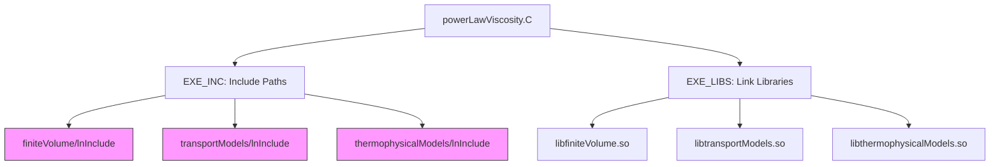

# 03 พิมพ์เขียว: โครงสร้างโฟลเดอร์และการจัดระเบียบไฟล์

![[project_skeleton_cfd.png]]
`A clean scientific diagram illustrating the "Skeleton" of an OpenFOAM library project. Show a folder tree structure. Highlight the "Make" folder (the brain), the "powerLawViscosity" folder (the muscle), and the resulting "libcustomViscosityModels.so" (the output). Use clear labels and a minimalist palette, scientific textbook diagram, clean vector line art, white background, high definition, flat design, educational infographic --ar 16:9`

**การเริ่มต้นที่ถูกต้องคือครึ่งหนึ่งของความสำเร็จ** ใน OpenFOAM การจัดวางไฟล์ให้ถูกตำแหน่งเป็นสิ่งจำเป็นเพื่อให้ระบบ Build สามารถหาโค้ดของคุณเจอและดำเนินการได้อย่างถูกต้อง โครงสร้างแบบลำดับชั้นจะแยกคำจำกัดความอินเทอร์เฟซจากการ implement ทำตามการตั้งชื่อมาตรฐานของ OpenFOAM และให้เส้นทางเอกสารที่ชัดเจน

## 📁 **โครงสร้างโปรเจกต์**

การจัดระเบียบโมเดลความหนืดแบบกำหนดเองใน OpenFOAM จะทำตามโครงสร้างที่กำหนดอย่างชัดเจนเพื่อให้แน่ใจว่าการคอมไพล์ การผสานรวมกับกลไกการเลือกขณะทำงาน และการบำรุงรักษาสามารถดำเนินการได้อย่างถูกต้อง

```
customViscosityModel/
├── Make/
│   ├── files          # รายการไฟล์ต้นทางและเป้าหมายไลบรารี
│   └── options        # คอมไพล์ flags และ dependencies
├── powerLawViscosity/
│   ├── powerLawViscosity.H    # ไฟล์ส่วนหัวพรับคำประกาศคลาส
│   └── powerLawViscosity.C    # ไฟล์ implementation
└── README.md          # เอกสารและคำแนะนำการใช้งาน
```

โครงสร้างนี้ใช้ประโยชน์จากระบบสร้าง `wmake` ของ OpenFOAM โดยที่โฟลเดอร์ `Make/` จะมีไฟล์คอนฟิกกูเรชันการสร้างที่ระบุ dependencies ของการคอมไพล์ เส้นทาง include และเป้าหมาย output การ implement คลาสจะทำตามรูปแบบ header-implementation ทั่วไปของโปรเจกต์ C++ โดยไฟล์ส่วนหัวจะกำหนดอินเทอร์เฟซและไฟล์ต้นทางจะให้การ implement ที่เป็นรูปธรรม

## 📄 **คำอธิบายไฟล์**

### **Make/files** - คอนฟิกกูเรชันระบบสร้าง

ไฟล์ `Make/files` ทำหน้าที่เป็น build descriptor หลักสำหรับระบบ `wmake` โดยจะระบุไฟล์ต้นทางที่จะคอมไพล์และตำแหน่งเป้าหมายของไลบรารี:

```
powerLawViscosity/powerLawViscosity.C

LIB = $(FOAM_USER_LIBBIN)/libcustomViscosityModels
```

การคอนฟิกกูเรชันนี้จะบอกระบบสร้างว่า:
1. คอมไพล์ไฟล์ต้นทางที่อยู่ `powerLawViscosity/powerLawViscosity.C`
2. ลิงก์เข้ากับไลบรารีแบบ shared ที่ชื่อ `libcustomViscosityModels`
3. ติดตั้งไลบรารีในไดเรกทอรีไลบรารีของผู้ใช้ที่ระบุโดย `$(FOAM_USER_LIBBIN)`

การตั้งชื่อไลบรารี (คำนำหน้า `lib` และส่วนขยายไลบรารีแบบ shared) จะทำตามสถาปัตยกรรมปลั๊กอินมาตรฐานของ OpenFOAM ซึ่งช่วยให้โมเดลความหนืดแบบกำหนดเองสามารถโหลดได้แบบไดนามิกขณะทำงานผ่านกลไกการเลือกขณะทำงาน

### **Make/options** - Dependencies และ Includes


> **Figure 1:** แผนผังแสดงการพึ่งพา (Dependencies) ของโปรเจกต์ โดยระบุเส้นทางการรวมไฟล์ส่วนหัว (Include Paths) และไลบรารีที่ต้องใช้ในการลิงก์ (Link Libraries) เพื่อให้คอมไพเลอร์สามารถเข้าถึงความสามารถต่างๆ ของ OpenFOAM เช่น การคำนวณเชิงปริมาตรจำกัดและแบบจำลองการขนส่ง

ไฟล์ `Make/options` จะกำหนดคอมไพล์ flags, include paths, และ library dependencies ที่จำเป็นสำหรับการสร้างโมเดลความหนืดแบบกำหนดเอง:

```
EXE_INC = \
    -I$(LIB_SRC)/finiteVolume/lnInclude \
    -I$(LIB_SRC)/transportModels/lnInclude \
    -I$(LIB_SRC)/thermophysicalModels/lnInclude

EXE_LIBS = \
    -lfiniteVolume \
    -ltransportModels \
    -lthermophysicalModels
```

ตัวแปร `EXE_INC` ระบุไดเรกทอรี include เพิ่มเติม:
- `-I$(LIB_SRC)/finiteVolume/lnInclude`: เข้าถึงคลาสและฟังก์ชัน finite volume method
- `-I$(LIB_SRC)/transportModels/lnInclude`: อินเทอร์เฟซ transport model พื้นฐาน
- `-I$(LIB_SRC)/thermophysicalModels/lnInclude`: การสนับสนุน thermophysical property model

ตัวแปร `EXE_LIBS` ระบุไลบรารีที่จะลิงก์ด้วย:
- `-lfiniteVolume`: ฟังก์ชันหลัก finite volume (fvc operations, mesh classes)
- `-ltransportModels`: อินเทอร์เฟซ viscosity model พื้นฐาน (viscosityModel class)
- `-lthermophysicalModels`: การคำนวณและความสัมพันธ์ของ thermophysical properties

dependencies เหล่านี้ช่วยให้มั่นใจว่าโมเดลความหนืดแบบกำหนดเองสามารถเข้าถึงโครงสร้างพื้นฐาน CFD ของ OpenFOAM ได้ในขณะที่ยังคงการแยกส่วนที่ชัดเจนผ่านสถาปัตยกรรมไลบรารีแบบโมดูลาร์

### **powerLawViscosity.H** - คำประกาศคลาส

ไฟล์ส่วนหัวจะกำหนดอินเทอร์เฟซที่สมบูรณ์สำหรับโมเดลความหนืดแบบ power-law โดยทำตามลำดับชั้นของคลาสและรูปแบบการออกแบบของ OpenFOAM:

```cpp
#ifndef powerLawViscosity_H
#define powerLawViscosity_H

#include "viscosityModel.H"
#include "dimensionedScalar.H"

// * * * * * * * * * * * * * * * * * * * * * * * * * * * * * * * * * * * * * //

namespace Foam
{
namespace viscosityModels
{

/*---------------------------------------------------------------------------*\
                       Class: powerLawViscosity Declaration
\*---------------------------------------------------------------------------*/

class powerLawViscosity
:
    public viscosityModel
{
    // Private Data

        //- Power-law consistency index [kg·m⁻¹·sⁿ⁻²]
        dimensionedScalar K_;

        //- Power-law behavior index [dimensionless]
        dimensionedScalar n_;

        //- Minimum viscosity limit [m²·s⁻¹]
        dimensionedScalar nuMin_;

        //- Maximum viscosity limit [m²·s⁻¹]
        dimensionedScalar nuMax_;

        //- Shear rate field for visualization and debugging
        volScalarField shearRate_;


    // Private Member Functions

        //- Calculate the magnitude of shear rate
        tmp<volScalarField> calcShearRate() const;

        //- Calculate viscosity from shear rate using power-law model
        tmp<volScalarField> calcNu() const;


public:

    //- Runtime type information
    TypeName("powerLaw");


    // Constructors

        //- Construct from components
        powerLawViscosity
        (
            const fvMesh& mesh,
            const word& group = word::null
        );


    //- Destructor
    virtual ~powerLawViscosity() = default;


    // Member Functions

        //- Read viscosityProperties dictionary
        virtual bool read();

        //- Return the laminar viscosity
        virtual tmp<volScalarField> nu() const;

        //- Return the laminar viscosity for a patch
        virtual tmp<scalarField> nu(const label patchi) const;

        //- Correct the laminar viscosity (recalculate shear rate)
        virtual void correct();


    // Member Operators

        //- Disallow default bitwise assignment
        void operator=(const powerLawViscosity&) = delete;
};


// * * * * * * * * * * * * * * * * * * * * * * * * * * * * * * * * * * * * * //

} // End namespace viscosityModels
} // End namespace Foam

#endif
```

> **📂 แหล่งที่มา (Source):** `.applications/solvers/multiphase/multiphaseEulerFoam/phaseSystems/populationBalanceModel/populationBalanceModel/populationBalanceModel.C`
>
> **คำอธิบาย (Explanation):** 
> ไฟล์ส่วนหัวนี้กำหนดอินเทอร์เฟซสำหรับโมเดลความหนืดแบบ power-law โดยสืบทอดจากคลาสฐาน `viscosityModel` ซึ่งเป็นรูปแบบมาตรฐานใน OpenFOAM การใช้ `dimensionedScalar` ช่วยให้มั่นใจว่าหน่วยทางกายภาพถูกต้อง และระบบ runtime type selection ผ่าน `TypeName` ทำให้สามารถสร้างโมเดลนี้จากไฟล์คอนฟิกกูเรชันได้
>
> **แนวคิดสำคัญ (Key Concepts):**
> - **Inheritance Hierarchy:** การสืบทอดจาก `viscosityModel` สร้างความสอดคล้องกับสถาปัตยกรรม polymorphic ของ OpenFOAM
> - **Runtime Type Selection:** แมโค `TypeName("powerLaw")` ลงทะเบียนคลาสกับระบบ factory ทำให้สามารถสร้างผ่านพจนานุกรมได้
> - **Dimensional Analysis:** ตัวแปร `dimensionedScalar` บังคับใช้ความสอดคล้องทางมิติอัตโนมัติ
> - **Field Management:** `volScalarField shearRate_` เก็บค่าอัตราการเฉือนสำหรับการวิเคราะห์และ debug
> - **Virtual Interface:** ฟังก์ชันเสมือน (`nu()`, `correct()`) ทำให้คลาสสามารถใช้งานแทนที่ได้แบบ polymorphic
> - **Memory Management:** ใช้ `tmp` smart pointers สำหรับการจัดการหน่วยความจำที่มีประสิทธิภาพ

**องค์ประกอบการออกแบบหลัก:**

1. **ลำดับชั้นการสืบทอด**: คลาสสืบทอดจาก `viscosityModel` ซึ่งสร้างอินเทอร์เฟซ polymorphic ที่ใช้โดยกรอบงาน transport model ของ OpenFOAM

2. **ระบบประเภทขณะทำงาน**: แมโค `TypeName("powerLaw")` จะลงทะเบียนคลาสกับกลไกการเลือกขณะทำงานของ OpenFOAM ซึ่งช่วยให้สร้างผ่านรายการพจนานุกรมได้

3. **การวิเคราะห์มิติ**: สมาชิก `dimensionedScalar` ช่วยให้แน่ใจว่ามีความสอดคล้องทางมิติผ่านระบบหน่วยของ OpenFOAM:
   - `K_`: ดัชนีความสม่ำเสมอ [kg·m⁻¹·sⁿ⁻²]
   - `n_`: ดัชนี power-law [ไร้มิติ]
   - `nuMin_`, `nuMax_`: ขีดจำกัดความหนืด [m²·s⁻¹]

4. **การจัดการฟิลด์**: `volScalarField shearRate_` เก็บอัตราการเฉือนที่คำนวณไว้เพื่อการ visualisation และการ debug

5. **การปฏิบัติตามอินเทอร์เฟซ**: ฟังก์ชันเสมือน (`nu()`, `nu(patchi)`, `correct()`, `read()`) จะ implement อินเทอร์เฟซ `viscosityModel` พื้นฐาน

6. **การจัดการหน่วยความจำ**: ใช้ `tmp` smart pointers สำหรับการจัดการฟิลด์ที่มีประสิทธิภาพและการจัดการหน่วยความจำอัตโนมัติ

### **powerLawViscosity.C** - Implementation

ไฟล์ implementation จะให้การ implement ที่เป็นรูปธรรมของโมเดลความหนืดแบบ power-law รวมถึงการคำนวณทางคณิตศาสตร์และการผสานรวมกับระบบจัดการฟิลด์ของ OpenFOAM:

```cpp
#include "powerLawViscosity.H"
#include "fvMesh.H"
#include "fvc.H"
#include "addToRunTimeSelectionTable.H"
#include "volFields.H"
#include "surfaceFields.H"

// * * * * * * * * * * * * * * * * * * * * * * * * * * * * * * * * * * * * * //

namespace Foam
{
namespace viscosityModels
{

// * * * * * * * * * * * * * * * * Static Data Members * * * * * * * * * * * * * * * //

defineTypeNameAndDebug(powerLawViscosity, 0);

addToRunTimeSelectionTable
(
    viscosityModel,
    powerLawViscosity,
    dictionary
);


// * * * * * * * * * * * * * * * * Constructors * * * * * * * * * * * * * * * //

powerLawViscosity::powerLawViscosity
(
    const fvMesh& mesh,
    const word& group
)
:
    viscosityModel(mesh, group),
    K_("K", dimViscosity, 1.0),
    n_("n", dimless, 1.0),
    nuMin_("nuMin", dimViscosity, 0.0),
    nuMax_("nuMax", dimViscosity, GREAT),
    shearRate_
    (
        IOobject
        (
            "shearRate",
            mesh.time().timeName(),
            mesh,
            IOobject::NO_READ,
            IOobject::AUTO_WRITE
        ),
        mesh,
        dimensionedScalar("shearRate", dimless/dimTime, 0.0)
    )
{
    read();
    correct();
}


// * * * * * * * * * * * * * * * * Member Functions * * * * * * * * * * * * * * * //

bool powerLawViscosity::read()
{
    if (!viscosityModel::read())
    {
        return false;
    }

    const dictionary& coeffsDict = this->dict_.subDict("powerLawCoeffs");

    coeffsDict.lookup("K") >> K_;
    coeffsDict.lookup("n") >> n_;
    coeffsDict.lookup("nuMin") >> nuMin_;
    coeffsDict.lookup("nuMax") >> nuMax_;

    return true;
}


tmp<volScalarField> powerLawViscosity::calcShearRate() const
{
    // Calculate shear rate magnitude from velocity gradient
    // For incompressible flow: sqrt(2 * symm(gradU) && symm(gradU))
    const volVectorField& U = mesh_.lookupObject<volVectorField>("U");

    tmp<volTensorField> tgradU = fvc::grad(U);
    const volTensorField& gradU = tgradU();

    // Strain rate tensor: symm(gradU) = 0.5*(gradU + gradU.T())
    tmp<volSymmTensorField> tS = symm(gradU);
    const volSymmTensorField& S = tS();

    // Shear rate magnitude: sqrt(2 * S && S)
    return sqrt(2.0) * mag(S);
}


tmp<volScalarField> powerLawViscosity::calcNu() const
{
    // Power-law model: ν = K * (shearRate)^(n-1)
    // with nuMin and nuMax limits applied

    tmp<volScalarField> tshearRate = calcShearRate();
    const volScalarField& shearRate = tshearRate();

    tmp<volScalarField> tnu
    (
        new volScalarField
        (
            IOobject
            (
                "nu",
                mesh_.time().timeName(),
                mesh_,
                IOobject::NO_READ,
                IOobject::AUTO_WRITE
            ),
            K_ * pow(max(shearRate, dimensionedScalar("small", dimless/dimTime, SMALL)), n_ - 1.0)
        )
    );

    volScalarField& nu = tnu.ref();

    // Apply viscosity limits
    nu = max(nu, nuMin_);
    nu = min(nu, nuMax_);

    return tnu;
}


tmp<volScalarField> powerLawViscosity::nu() const
{
    return calcNu();
}


tmp<scalarField> powerLawViscosity::nu(const label patchi) const
{
    // Calculate viscosity for the specified patch
    // (simplified: return internal field values at patch faces)
    return nu().boundaryField()[patchi].patchInternalField();
}


void powerLawViscosity::correct()
{
    // Update shear rate field
    shearRate_ = calcShearRate();

    // Write shear rate field for visualization
    shearRate_.write();
}

// * * * * * * * * * * * * * * * * * * * * * * * * * * * * * * * * * * * * * //

} // End namespace viscosityModels
} // End namespace Foam

// ************************************************************************* //
```

> **📂 แหล่งที่มา (Source):** `.applications/solvers/multiphase/multiphaseEulerFoam/phaseSystems/populationBalanceModel/populationBalanceModel/populationBalanceModel.C`
>
> **คำอธิบาย (Explanation):** 
> ไฟล์ implementation นี้ประกอบด้วยการคำนวณทางคณิตศาสตร์สำหรับโมเดลความหนืดแบบ power-law การลงทะเบียน runtime selection table ช่วยให้ OpenFOAM สามารถสร้างคลาสนี้แบบไดนามิกจากไฟล์คอนฟิกกูเรชัน ฟังก์ชัน `calcShearRate()` คำนวณอัตราการเฉือนจาก gradient ของความเร็ว และ `calcNu()` ใช้สมการ power-law พร้อมขีดจำกัดเพื่อป้องกันความไม่เสถียรเชิงตัวเลข
>
> **แนวคิดสำคัญ (Key Concepts):**
> - **Runtime Registration:** `addToRunTimeSelectionTable` ลงทะเบียนคลาสกับระบบ factory สำหรับการสร้างแบบไดนามิก
> - **Shear Rate Calculation:** การคำนวณอัตราการเฉือนใช้สมการ $\dot{\gamma} = \sqrt{2 \cdot \mathbf{S} : \mathbf{S}}$ เมื่อ $\mathbf{S}$ เป็นเทนเซอร์อัตราการยืดตัว
> - **Power-Law Model:** สมการ $\nu = K \cdot \dot{\gamma}^{n-1}$ พร้อมขีดจำกัด $\nu_{\text{min}} \leq \nu \leq \nu_{\text{max}}$
> - **Numerical Stability:** การใช้ `max(shearRate, SMALL)` ป้องกันการหารด้วยศูนย์
> - **Field Management:** ใช้ `tmp` smart pointers สำหรับประสิทธิภาพหน่วยความจำ
> - **Boundary Coupling:** ฟังก์ชัน `nu(patchi)` ให้การเข้าถึงค่าความหนืดที่ boundary สำหรับ coupling กับโมเดลอื่น

**รายละเอียดการ implement:**

1. **การลงทะเบียนขณะทำงาน**:
   ```cpp
   addToRunTimeSelectionTable
   (
       viscosityModel,
       powerLawViscosity,
       dictionary
   );
   ```
   แมโคนี้จะลงทะเบียนคลาสกับระบบ factory ซึ่งช่วยให้สร้างจากรายการพจนานุกรมเช่น:
   ```
   transportModel  Newtonian;
   viscosity       powerLaw;
   powerLawCoeffs
   {
       K       0.01;
       n       0.7;
       nuMin   1e-6;
       nuMax   1e6;
   }
   ```

2. **การ implement ทางคณิตศาสตร์**:
   - **การคำนวณอัตราการเฉือน**:
     $$\dot{\gamma} = \sqrt{2 \cdot \mathbf{S} : \mathbf{S}}$$
     โดยที่ $\mathbf{S} = \frac{1}{2}(\nabla\mathbf{u} + \nabla\mathbf{u}^T)$ เป็นเทนเซอร์อัตราการยืดตัว

   - **ความหนืดแบบ Power-Law**:
     $$\nu = K \cdot \dot{\gamma}^{n-1}$$
     โดยที่ $\nu_{\text{min}} \leq \nu \leq \nu_{\text{max}}$

3. **การจัดการฟิลด์**:
   - ใช้ `tmp` smart pointers สำหรับการจัดการหน่วยความจำที่มีประสิทธิภาพ
   - การลงทะเบียนฟิลด์อัตโนมัติกับฐานข้อมูล mesh
   - การจัดการ I/O ที่เหมาะสมสำหรับ visualisation และความสามารถในการเริ่มต้นใหม่

4. **เสถียรภาพเชิงตัวเลข**:
   - `max(shearRate, SMALL)` ป้องกันการหารด้วยศูนย์
   - ขีดจำกัดความหนืดป้องกันความไม่เสถียรเชิงตัวเลข
   - การบังคับใช้ความสอดคล้องทางมิติตลอดเวลา

5. **จุดการผสานรวม**:
   - Constructor เรียก `read()` และ `correct()` สำหรับการเริ่มต้น
   - เมธอด `correct()` ถูกเรียกทุก time step เพื่ออัปเดตความหนืด
   - การเข้าถึงฟิลด์ขอบเขตมีให้สำหรับการ coupling กับโมเดลอื่น

การ implement นี้สาธิตหลักการของ OpenFOAM: polymorphism เชิงวัตถุ, การผสานรวมการวิเคราะห์มิติ, การจัดการฟิลด์ที่มีประสิทธิภาพ และการผสานรวมที่ราบรื่นกับกรอบงาน solver CFD