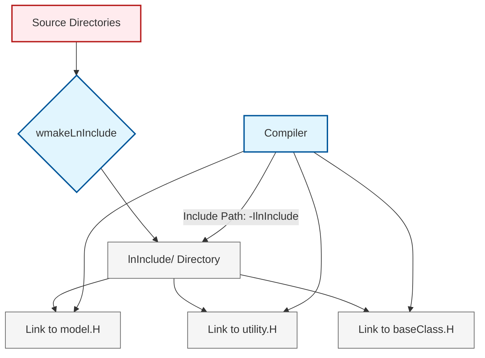

# 04 กลไกภายใน: กระบวนการคอมไพล์และ Build System

![[wmake_assembly_line.png]]
`A clean scientific illustration of the "wmake assembly line". Show raw Source Code (.C, .H) entering the machine. Inside, show stages for: 1. lnInclude generation (Symbolic Links), 2. Preprocessing, 3. Compilation (C++ to Object), and 4. Linking (Objects to .so). Show the final Shared Library being placed in the FOAM_USER_LIBBIN folder. Use a minimalist palette with clear arrows, scientific textbook diagram, clean vector line art, white background, high definition, flat design, educational infographic --ar 16:9`

### 🔨 **ระบบ Build ของ wmake**

ระบบ build แบบกำหนดเองของ OpenFOAM `wmake` เป็นเฟรมเวิร์กการคอมไพล์ที่ซับซ้อนซึ่งออกแบบมาโดยเฉพาะสำหรับการจัดการ dependencies ที่ซับซ้อนและโครงสร้างแบบโมดูลาร์ของไลบรารี CFD เมื่อคุณ build แบบจำลองการขนส่งแบบกำหนดเองโดยใช้ `wmake libso` ระบบจะประสานงานกระบวนการหลายขั้นตอนที่เกินกว่าการคอมไพล์แบบง่าย

ลำดับการคอมไพล์เริ่มต้นด้วย `wmake` ที่แยกวิเคราะห์ไดเรกทอรี `Make/files` เพื่อระบุไฟล์ต้นฉบับทั้งหมดที่ต้องการคอมไพล์ ไฟล์นี้โดยทั่วไปจะมีรายการเช่น:

```cpp
// Make/files - Source file listing for custom viscosity model
// Specifies which source files to compile and the target library location

customViscosityModel.C
EXE = $(FOAM_USER_LIBBIN)/libcustomViscosityModel
```

---
**📖 Source Files Compilation (การคอมไพล์ไฟล์ต้นฉบับ)**

ไฟล์ `Make/files` ทำหน้าที่ระบุไฟล์ต้นฉบับทั้งหมดที่ต้องการคอมไพล์และตำแหน่งที่จะติดตั้งไลบรารีที่สร้างเสร็จ ในตัวอย่างนี้คือ `customViscosityModel.C` ซึ่งเป็นไฟล์ C++ หลักสำหรับแบบจำลองความหนืดแบบกำหนดเอง ตัวแปร `EXE` ระบุว่าไลบรารีที่สร้างเสร็จควรถูกติดตั้งไปยัง `$FOAM_USER_LIBBIN` ซึ่งเป็นไดเรกทอรีไลบรารีผู้ใช้ของ OpenFOAM

---
ในเวลาเดียวกัน `wmake` อ่านไฟล์ `Make/options` เพื่อดึงข้อมูล flags ของคอมไพเลอร์และข้อมูล dependencies:

```cpp
// Make/options - Compiler flags and dependency specifications
// Defines include paths for header files and libraries to link against

EXE_INC = \
    -I$(LIB_SRC)/finiteVolume/lnInclude \
    -I$(LIB_SRC)/transportModels/lnInclude \
    -I$(LIB_SRC)/thermophysicalModels/basic/lnInclude

EXE_LIBS = \
    -lfiniteVolume \
    -ltransportModels \
    -lthermophysicalModels
```

---
**📖 Compiler Configuration (การตั้งค่าคอมไพเลอร์)**

ไฟล์ `Make/options` มีสองส่วนหลัก: `EXE_INC` และ `EXE_LIBS` ตัวแปร `EXE_INC` ระบุเส้นทาง include สำหรับไฟล์ header ที่จำเป็นสำหรับการคอมไพล์ โดยใช้ flags `-I` เพื่อระบุไดเรกทอรี `lnInclude` ของแต่ละโมดูล OpenFOAM ส่วน `EXE_LIBS` ระบุไลบรารีที่จะลิงก์กับไฟล์ออบเจกต์ที่คอมไพล์แล้ว โดยใช้ flags `-l` เพื่อระบุชื่อไลบรารี

---

กระบวนการคอมไพล์จริงทำตามขั้นตอนเหล่านี้:

1. **การประมวลผล Header**: `wmake` สร้างไดเรกทอรี symbolic link (`lnInclude`) ที่มีไฟล์ header ที่จำเป็นทั้งหมดก่อน ขั้นตอนนี้สำคัญมากสำหรับสถาปัตยกรรมที่ใช้ template หนักของ OpenFOAM เพราะมันช่วยให้มั่นใจว่า header dependencies ทั้งหมดสามารถเข้าถึงได้ระหว่างการคอมไพล์

2. **การคอมไพล์ซอร์ส**: แต่ละไฟล์ `.C` จะถูกคอมไพล์โดยใช้ compiler flags ที่ระบุ สำหรับแบบจำลองการขนส่ง โดยทั่วไปจะเกี่ยวข้องกับการคอมไพล์คลาสหลักและฟังก์ชันยูทิลิตี้ที่รองรับ

3. **การลิงก์ออบเจกต์**: ไฟล์ออบเจกต์ที่คอมไพล์แล้ว (`.o` files) จะถูกลิงก์เข้าด้วยกันเพื่อสร้างไลบรารีแชร์ (`.so` file) ไลบรารีแชร์นี้สามารถโหลดแบบไดนามิกโดย solvers ของ OpenFOAM ได้ขณะ runtime

4. **การติดตั้งไลบรารี**: ไลบรารีที่เสร็จสมบูรณ์จะถูกคัดลอกไปยัง `$FOAM_USER_LIBBIN` (โดยทั่วไปคือ `~/.OpenFOAM/$(WM_PROJECT_VERSION)/platforms/linux64GccDPInt32Opt/lib`) ทำให้พร้อมใช้งานสำหรับแอปพลิเคชัน OpenFOAM ทั้งหมด

พื้นฐานคณิตศาสตร์ของแบบจำลองการขนส่งของคุณจะถูกคอมไพล์เป็นโค้ดเครื่องที่มีประสิทธิภาพระหว่างกระบวนการนี้ ตัวอย่างเช่น หากแบบจำลองของคุณ implement สมการความหนืดกฎกำลัง:

$$\mu_{\text{eff}} = K \dot{\gamma}^{n-1}$$

ความสัมพันธ์นี้จะถูกแปลเป็นโค้ด C++ ที่ปรับให้เหมาะสมซึ่งคอมไพเลอร์ประมวลผลเป็นคำสั่งที่ทำงานได้ ระบบ `wmake` ช่วยให้มั่นใจว่าโครงสร้างพื้นฐาน OpenFOAM ทั้งหมดที่จำเป็นสำหรับการประเมินนิพจน์ดังกล่าวได้รับการลิงก์และพร้อมใช้งานอย่างถูกต้อง

### 🧩 **การแก้ไข Dependencies**

กลไกการแก้ไข dependencies ในระบบ build ของ OpenFOAM มีลำดับชั้นและช่วยให้มั่นใจว่าโมดูลที่จำเป็นทั้งหมดพร้อมใช้งานก่อนเริ่มการคอมไพล์ ตัวแปร `EXE_INC` (executable include paths) และ `EXE_LIBS` (executable libraries) ใน `Make/options` มีจุดประสงค์ที่แตกต่างกันแต่เสริมซึ่งกันและกัน:

**การแก้ไข Include Path (`EXE_INC`)**:
flags `-I` บอก C++ preprocessor ว่าจะค้นหาไฟล์ header จากที่ใด สำหรับแบบจำลองความหนืดแบบกำหนดเอง dependencies ทั่วไปประกอบด้วย:

- **finiteVolume**: จัดเตรียมเฟรมเวิร์กการ discretize แบบ finite volume รวมถึงคลาสเช่น `volScalarField`, `fvMesh` และตัวดำเนินการ finite volume (`fvm::div()`, `fvc::grad()`)
- **transportModels**: มีคลาสฐานเช่น `viscosityModel` ที่แบบจำลองแบบกำหนดเองของคุณจะสืบทอดมา
- **thermophysicalModels**: นำเสนอแบบจำลองคุณสมบัติทางอุณหพลศาสตร์ที่อาจจำเป็นสำหรับการคำนวณความหนืดที่ขึ้นกับอุณหภูมิ

**การลิงก์ไลบรารี (`EXE_LIBS`)**:
flags `-l` ระบุไลบรารีที่จะลิงก์กับไฟล์ออบเจกต์ที่คอมไพล์แล้ว นี่คือที่ที่การ implement จริงของคลาสที่อ้างอิงใน headers ของคุณจะเชื่อมต่อกับโค้ดของคุณ

กราฟ dependencies สำหรับแบบจำลองการขนส่งทั่วไปทำตามรูปแบบนี้:

```cpp
// Dependency hierarchy for custom viscosity models
// Shows the layered dependency structure from custom code down to core OpenFOAM

customViscosityModel.so
    ↓ depends on
transportModels.so
    ↓ depends on
finiteVolume.so
    ↓ depends on
OpenFOAM.so (core library)
```

---
**📖 Dependency Graph (กราฟการพึ่งพา)**

กราฟ dependencies แสดงลำดับชั้นของการพึ่งพาสำหรับแบบจำลองความหนืดแบบกำหนดเอง แบบจำลองที่กำหนดเอง (`customViscosityModel.so`) พึ่งพาไลบรารี `transportModels.so` ซึ่งเป็นไลบรารีที่มีคลาสฐานสำหรับแบบจำลองการขนส่ง ไลบรารีนี้พึ่งพา `finiteVolume.so` ซึ่งเป็นไลบรารีหลักสำหรับเฟรมเวิร์ก finite volume และไลบรารี finiteVolume พึ่งพา `OpenFOAM.so` ซึ่งเป็นไลบรารีหลักของ OpenFOAM

---

**ความซับซ้อนของ Template Instantiation**:
OpenFOAM ใช้ C++ templates อย่างกว้างขวาง ซึ่งทำให้การแก้ไข dependencies ซับซ้อนขึ้น เมื่อคุณประกาศฟิลด์เช่น:

```cpp
// Template-based field declaration with automatic memory management
// Creates a volume scalar field with specified IOobject parameters

volScalarField muEff(
    IOobject(
        "muEff",                          // Field name
        mesh.time().timeName(),           // Time directory
        mesh,                             // Reference to mesh
        IOobject::NO_READ,                // Do not read from file
        IOobject::AUTO_WRITE              // Auto-write to file
    ),
    mesh                                 // Mesh reference
);
```

---
**📖 Template Instantiation (การสร้าง Template Instance)**

การประกาศฟิลด์ `volScalarField` ใน OpenFOAM ใช้ระบบ template อย่างกว้างขวาง ซึ่งทำให้การแก้ไข dependencies ซับซ้อนขึ้น คลาส `volScalarField` เป็น template ที่ถูก instantiate ด้วยประเภท `scalar` ซึ่งต้องการไฟล์ header จำนวนมากจากไลบรารี finiteVolume และ OpenFOAM core การประกาศนี้ยังใช้คลาส `IOobject` ซึ่งเป็นส่วนหนึ่งของระบบจัดการไฟล์และฐานข้อมูลของ OpenFOAM

---

นี่จะกระตุ้น template instantiation ที่ต้องการไฟล์ header จำนวนมากจากไลบรารี finiteVolume และ OpenFOAM core ระบบ `wmake` จัดการความซับซ้อนนี้โดย:

1. สร้างไดเรกทอรี `lnInclude` ที่ครอบคลุมด้วย headers ที่จำเป็นทั้งหมด
2. ใช้การติดตาม dependencies เพื่อคอมไพล์ใหม่เฉพาะเมื่อ dependencies เปลี่ยนแปลง
3. จัดการลำดับ template instantiation เพื่อป้องกันความขัดแย้งในการคอมไพล์

**ตัวแปรสภาพแวดล้อมการ Build**:
OpenFOAM ใช้ตัวแปรสภาพแวดล้อมเพื่อจัดการเส้นทาง build และการตั้งค่าคอมไพเลอร์:

- `WM_PROJECT_VERSION`: เวอร์ชัน OpenFOAM (เช่น "10")
- `WM_OPTIONS`: การตั้งค่าแพลตฟอร์มและคอมไพเลอร์ (เช่น "linux64GccDPInt32Opt")
- `FOAM_LIBBIN`: ไดเรกทอรีไลบรารีระบบ
- `FOAM_USER_LIBBIN`: ไดเรกทอรีไลบรารีผู้ใช้

### 🔗 **Symbolic Links สำหรับการค้นพบ Header**


> **Figure 1:** แผนผังแสดงกลไกของระบบ `lnInclude` ซึ่งทำหน้าที่รวบรวมไฟล์ส่วนหัว (Headers) จากโฟลเดอร์ต่างๆ มาไว้ในที่เดียวผ่านทาง Symbolic Links เพื่อให้คอมไพเลอร์สามารถค้นหาและรวมไฟล์ที่จำเป็นสำหรับการสร้างเทมเพลตได้อย่างรวดเร็วและเป็นระเบียบ

ระบบไดเรกทอรี `lnInclude` เป็นหนึ่งในคุณสมบัติสถาปัตยกรรมที่เด่นที่สุดของ OpenFOAM ซึ่งออกแบบมาเพื่อแก้ปัญหาการพึ่งพา header ที่ซับซ้อนซึ่งเป็นสิ่งที่หลีกเลี่ยงไม่ได้ในโค้ด C++ ที่ใช้ template หนัก เมื่อคุณ execute `wmakeLnInclude` ระบบจะดำเนินการที่ซับซ้อนซึ่งเกินกว่าการสร้าง symbolic link แบบธรรมดา

**กลไกการค้นพบ Header**:
กระบวนการเริ่มต้นด้วย `wmake` ที่สแกนโครงสร้างไดเรกทอรีต้นฉบับเพื่อระบุไฟล์ header ทั้งหมด (`.H` files) สำหรับแบบจำลองการขนส่งทั่วไป อาจรวมถึง:

```cpp
// Typical directory structure for custom OpenFOAM model
// Shows organization of source files and build configuration

customViscosityModel/
├── customViscosityModel.H      // Main class declaration
├── customViscosityModel.C      // Implementation file
└── Make/
    ├── files                   // Source file list
    └── options                 // Compiler flags
```

---
**📖 Directory Structure (โครงสร้างไดเรกทอรี)**

โครงสร้างไดเรกทอรีมาตรฐานสำหรับแบบจำลอง OpenFOAM แบบกำหนดเองประกอบด้วยไฟล์ header (`.H`) สำหรับการประกาศคลาส ไฟล์ implementation (`.C`) สำหรับการ implement ฟังก์ชัน และไดเรกทอรี `Make/` ที่มีไฟล์ `files` และ `options` สำหรับการตั้งค่าการ build โครงสร้างนี้ช่วยให้ระบบ build ของ OpenFOAM สามารถคอมไพล์และลิงก์โค้ดของคุณได้อย่างถูกต้อง

---

กระบวนการสร้าง symbolic link สร้าง namespace แบบแบนใน `lnInclude/` ที่มี headers ทั้งหมดจากไดเรกทอรีปัจจุบันและไดเรกทอรีที่พึ่งพาทั้งหมด แนวทางนี้แก้ไขปัญหาสำคัญหลายประการ:

**Template Instantiation โดยไม่มี Circular Dependencies**:
ใน template metaprogramming headers มักต้อง include ซึ่งกันและกันในรูปแบบที่ซับซ้อน พิจารณาสถานการณ์นี้:

```cpp
// Custom viscosity model class inheriting from base viscosity model
// Demonstrates inheritance hierarchy and dependency on volScalarField

class customViscosityModel
:
    public viscosityModel
{
    // Depends on volScalarField from finiteVolume
    const volScalarField& T_;
};
```

---
**📖 Class Inheritance (การสืบทอดคลาส)**

คลาส `customViscosityModel` สืบทอดจากคลาสฐาน `viscosityModel` ซึ่งเป็นส่วนหนึ่งของไลบรารี transportModels ของ OpenFOAM คลาสนี้มีสมาชิกข้อมูล `T_` ซึ่งเป็น reference ถึง `volScalarField` ที่มาจากไลบรารี finiteVolume การอ้างอิงนี้แสดงถึงการพึ่งพาที่ซับซ้อนระหว่างไลบรารีต่างๆ ใน OpenFOAM

---

โดยไม่มี `lnInclude` คอมไพเลอร์จะต้องนำทางผ่านเส้นทาง include ที่ซับซ้อนเพื่อค้นหาการประกาศของ `volScalarField` ด้วย symbolic links headers ที่จำเป็นทั้งหมดจะปรากฏเหมือนอยู่ในไดเรกทอรีเดียวกัน ทำให้กระบวนการคอมไพล์ง่ายขึ้นอย่างมาก

**การติดตาม Dependencies และการคอมไพล์เพิ่มเติม**:
ระบบ `wmake` ใช้การเปรียบเทียบ timestamp เพื่อกำหนดสิ่งที่ต้องการคอมไพล์ใหม่ เมื่อไฟล์ header เปลี่ยนแปลง:

1. **การตรวจจับ Header ที่แก้ไข**: `wmake` ตรวจสอบว่าไฟล์ `.H` ใดมี timestamp ใหม่กว่าไฟล์ออบเจกต์ที่เกี่ยวข้อง
2. **การวิเคราะห์ Dependency Chain**: ระบบตรวจสอบว่าไฟล์ต้นฉบับใดขึ้นอยู่กับ header ที่แก้ไข
3. **การคอมไพล์ใหม่เฉพาะส่วน**: มีเพียงไฟล์ต้นฉบับที่ได้รับผลกระทบเท่านั้นที่ถูกคอมไพล์ใหม่ ไม่ใช่ทั้งโปรเจกต์

**การเข้าถึง Header ข้ามโมジュล**:
เมื่อแบบจำลองแบบกำหนดเองของคุณขึ้นอยู่กับโมดูล OpenFOAM หลายโมดูล ระบบ `lnInclude` จะสร้าง symbolic links ไปยัง headers จากไลบรารีที่พึ่งพาทั้งหมด:

```cpp
// Example lnInclude directory structure after wmakeLnInclude execution
// Shows how headers from different modules are aggregated

# lnInclude structure after wmakeLnInclude
lnInclude/
├── customViscosityModel.H              // Internal header
├── viscosityModel.H                    // From transportModels
├── volFields.H                         // From finiteVolume
├── tmp.H                              // From OpenFOAM core
└── [hundreds of other headers...]
```

---
**📖 Header Aggregation (การรวบรวม Header)**

ไดเรกทอรี `lnInclude` ที่สร้างโดย `wmakeLnInclude` จะรวบรวมไฟล์ header จากไดเรกทอรีต่างๆ มาไว้ในที่เดียวผ่าน symbolic links ซึ่งช่วยให้คอมไพเลอร์สามารถค้นหาไฟล์ header ที่จำเป็นได้อย่างรวดเร็ว โดยไม่ต้องนำทางผ่านโครงสร้างไดเรกทอรีที่ซับซ้อนของ OpenFOAM

---

โครงสร้างนี้ช่วยให้คอมไพเลอร์สามารถค้นหา header ใดๆ ได้โดยไม่ต้องมีการจัดการเส้นทาง include ที่ซับซ้อน

**การซิงโครไนซ์ Header อัตโนมัติ**:
ระบบ `wmake` อัปเดตไดเรกทอรี `lnInclude` โดยอัตโนมัติเมื่อ:

- ไฟล์ต้นฉบับถูกเพิ่มหรือลบออกจากโปรเจกต์
- Dependencies เปลี่ยนแปลงใน `Make/options`
- ไฟล์ header ถูกแก้ไขหรือเปลี่ยนชื่อ

**การปรับปรุงประสิทธิภาพการ Build**:
แนวทาง symbolic link ให้ประโยชน์ด้านประสิทธิภาพหลายประการ:

1. **ลดเวลาการคอมไพล์**: Headers ไม่ต้องการการค้นหาข้ามไดเรกทอรีหลายๆ ไดเรกทอรี
2. **ลดการใช้หน่วยความจำ**: คอมไพเลอร์สามารถใช้การแคช header ที่มีประสิทธิภาพมากขึ้น
3. **การคอมไพล์แบบขนาน**: ไฟล์หลายไฟล์สามารถคอมไพล์พร้อมกันโดยไม่มีความขัดแย้งของ header

**ประโยชน์ด้านการดีบักและการพัฒนา**:
โครงสร้าง header แบบแบนใน `lnInclude` ทำให้การดีบักง่ายขึ้น:

- ข้อความผิดพลาดของคอมไพเลอร์แสดงเส้นทางไฟล์ที่ชัดเจน
- การแก้ไขสัญลักษณ์ของ IDE ทำงานได้น่าเชื่อถือมากขึ้น
- การนำทางโค้ดถูกทำให้ง่ายขึ้นสำหรับนักพัฒนา

ระบบ `lnInclude` เป็นการแก้ปัญหาที่ซับซ้อนของการจัดการ dependencies สำหรับไลบรารี C++ template ขนาดใหญ่ ช่วยให้สถาปัตยกรรมแบบโมดูลาร์ของ OpenFOAM ทำงานได้ในขณะที่ยังคงรักษาเวลาการคอมไพล์ที่มีประสิทธิภาพ

### ⚙️ **ขั้นตอนการคอมไพล์โดยละเอียด**

เพื่อให้เข้าใจกระบวนการคอมไพล์อย่างลึกซึ้ง ให้เราติดตามเส้นทางจากซอร์สโค้ดไปจนถึงไลบรารีที่ใช้งานได้:

#### **ขั้นตอนที่ 1: การวิเคราะห์ Make/files**

`wmake` เริ่มต้นโดยการอ่าน `Make/files`:

```cpp
// Source files specification and library target
// Identifies which C++ files to compile and where to install the resulting library

powerLawViscosity.C
LIB = $(FOAM_USER_LIBBIN)/libcustomViscosityModels
```

---
**📖 Make Files Analysis (การวิเคราะห์ Make/files)**

ไฟล์ `Make/files` ระบุไฟล์ซอร์ส `.C` ที่จะคอมไพล์ ประเภทไลบราร์ (`LIB` สำหรับ shared library) และตำแหน่งที่จะติดตั้งไลบราร์สุดท้าย ในกรณีนี้คือ `powerLawViscosity.C` ซึ่งเป็นไฟล์ C++ สำหรับแบบจำลองความหนืดแบบ Power Law

---

การวิเคราะห์นี้ระบุ:
- ไฟล์ซอร์ส `.C` ที่จะคอมไพล์
- ประเภทไลบราร์ (`LIB` สำหรับ shared library)
- ตำแหน่งที่จะติดตั้งไลบราร์สุดท้าย

#### **ขั้นตอนที่ 2: การประมวลผล Make/options**

ต่อไป `wmake` ประมวลผล `Make/options` เพื่อรวบรวมข้อมูล dependencies:

```cpp
// Include path specification with environment variable expansion
// Shows how OpenFOAM resolves library paths during compilation

EXE_INC = \
    -I$(LIB_SRC)/finiteVolume/lnInclude \
    -I$(LIB_SRC)/transportModels/lnInclude

// Expands to:
// -I/usr/local/OpenFOAM/OpenFOAM-10/src/finiteVolume/lnInclude
// -I/usr/local/OpenFOAM/OpenFOAM-10/src/transportModels/lnInclude
```

---
**📖 Environment Variable Expansion (การขยายตัวแปรสภาพแวดล้อม)**

ตัวแปร `EXE_INC` ใน `Make/options` ระบุเส้นทาง include สำหรับไฟล์ header โดยใช้ตัวแปรสภาพแวดล้อมของ OpenFOAM เช่น `$(LIB_SRC)` ซึ่งจะถูกขยายเป็นเส้นทางจริงของไดเรกทอรี source code ของ OpenFOAM ระหว่างการคอมไพล์

---

#### **ขั้นตอนที่ 3: การสร้าง lnInclude**

ก่อนการคอมไพล์ `wmake` execute `wmakeLnInclude`:

```bash
# Symbolic link creation process for header aggregation
# Demonstrates how wmakeLnInclude creates the lnInclude directory

$ wmakeLnInclude

lnInclude: symbolic linking to source files
    powerLawViscosity.H
    customViscosityModel.H
    [creating symbolic links...]
```

---
**📖 Symbolic Link Creation (การสร้าง Symbolic Link)**

คำสั่ง `wmakeLnInclude` สร้างไดเรกทอรี `lnInclude` และสร้าง symbolic links ไปยังไฟล์ header ทั้งหมดที่จำเป็น ขั้นตอนนี้สแกนไดเรกทอรีปัจจุบันและ dependencies สำหรับไฟล์ `.H` แล้วสร้าง symbolic links ใน `lnInclude/` ไปยัง headers เหล่านี้

---

ขั้นตอนนี้:
1. สแกนไดเรกทอรีปัจจุบันและ dependencies สำหรับไฟล์ `.H`
2. สร้าง symbolic links ใน `lnInclude/` ไปยัง headers เหล่านี้
3. สร้าง dependencies เชิงลึกสำหรับ headers ที่อ้างอิง

#### **ขั้นตอนที่ 4: การคอมไพล์ C++**

สำหรับแต่ละไฟล์ `.C`:

```cpp
// Actual compilation command (simplified for clarity)
// Shows how g++ compiles C++ source with OpenFOAM-specific flags

# Compilation command
g++ -c -std=c++14 \
    -IlnInclude \
    -I$(LIB_SRC)/finiteVolume/lnInclude \
    -I$(LIB_SRC)/OpenFOAM/lnInclude \
    -DFULLDEBUG -O0 \
    powerLawViscosity.C \
    -o Make/linux64GccDPInt32Opt/powerLawViscosity.o
```

---
**📖 C++ Compilation Process (กระบวนการคอมไพล์ C++)**

คำสั่งคอมไพล์ของ g++ ใช้ flag `-c` เพื่อคอมไพล์แต่ละไฟล์ `.C` เป็นไฟล์ object (`.o`) โดยไม่ลิงก์ flags `-I` ระบุเส้นทาง include สำหรับไฟล์ header และ flags `-DFULLDEBUG -O0` ตั้งค่าระดับการดีบักและปิดการปรับปรุงประสิทธิภาพ

---

ขั้นตอนนี้:
- Preprocess: ขยาย macros และ process `#include` directives
- Compile: แปลง C++ เป็น assembly code
- Assemble: แปลง assembly เป็น object code (`.o` file)

#### **ขั้นตอนที่ 5: การลิงก์**

หลังจากคอมไพล์ object files ทั้งหมด:

```cpp
// Linker command to create shared library (simplified)
// Demonstrates how object files are combined into a shared library

# Linking command
g++ -shared \
    Make/linux64GccDPInt32Opt/*.o \
    -L$(FOAM_LIBBIN) \
    -lfiniteVolume \
    -ltransportModels \
    -lOpenFOAM \
    -o $FOAM_USER_LIBBIN/libcustomViscosityModels.so
```

---
**📖 Shared Library Linking (การลิงก์ไลบรารีแชร์)**

คำสั่งลิงก์ใช้ flag `-shared` เพื่อสร้างไลบรารีแชร์ (`.so`) จากไฟล์ object ทั้งหมด flags `-L` ระบุเส้นทางค้นหาไลบรารี และ flags `-l` ระบุไลบรารีที่จะลิงก์ ไลบรารีที่สร้างเสร็จจะถูกติดตั้งไปยัง `$FOAM_USER_LIBBIN`

---

ขั้นตอนนี้:
- รวม object files เข้าด้วยกัน
- resolve external symbols ผ่านไลบรารี OpenFOAM
- สร้าง shared library (`.so` file)

#### **ขั้นตอนที่ 6: การติดตั้ง**

สุดท้าย ไลบรารีถูกติดตั้ง:

```bash
# Verify installed shared library
# Shows how to check the created library file

$ ls -lh $FOAM_USER_LIBBIN/libcustomViscosityModels.so
-rwxr-xr-x 1 user group 128K Dec 24 10:30 libcustomViscosityModels.so
```

---
**📖 Library Installation (การติดตั้งไลบรารี)**

หลังจากการลิงก์สำเร็จ ไลบรารีแชร์จะถูกติดตั้งไปยัง `$FOAM_USER_LIBBIN` ซึ่งเป็นไดเรกทอรีไลบรารีผู้ใช้ของ OpenFOAM คำสั่ง `ls -lh` แสดงขนาดและสิทธิ์ของไฟล์ไลบรารีที่สร้างเสร็จ

---

ไลบรารีพร้อมใช้งานสำหรับ:
- Dynamic loading ผ่าน `libs` entry ใน `controlDict`
- Runtime selection ผ่าน `addToRunTimeSelectionTable`

### 📋 **การคอมไพล์แบบ Step-by-Step (Full Workflow)**

เพื่อให้เห็นภาพรวมที่สมบูรณ์ของกระบวนการคอมไพล์ นี่คือ workflow แบบเต็ม:

#### **Step 1: สร้างโครงสร้าง Directory**

```bash
# Directory creation for custom model development
# Shows standard OpenFOAM user directory structure

# Change to user directory and create model directory structure
cd $WM_PROJECT_USER_DIR
mkdir -p customViscosityModel/powerLawViscosity
cd customViscosityModel
mkdir Make
```

---
**📖 Directory Structure Creation (การสร้างโครงสร้างไดเรกทอรี)**

การสร้างโครงสร้างไดเรกทอรีสำหรับการพัฒนาแบบจำลองแบบกำหนดเองเริ่มต้นด้วยการเปลี่ยนไปยังไดเรกทอรีผู้ใช้ของ OpenFOAM (`$WM_PROJECT_USER_DIR`) จากนั้นสร้างไดเรกทอรีสำหรับโปรเจกต์และไดเรกทอรี `Make/` สำหรับการตั้งค่าการ build

---

#### **Step 2: เขียน Make/files**

```cpp
// Make/files - Source file and target specification
// Lists source files and defines library output location

powerLawViscosity/powerLawViscosity.C

LIB = $(FOAM_USER_LIBBIN)/libcustomViscosityModels
```

---
**📖 Source File Specification (การระบุไฟล์ต้นฉบับ)**

ไฟล์ `Make/files` ระบุไฟล์ต้นฉบับที่จะคอมไพล์และตำแหน่งที่จะติดตั้งไลบรารี ในกรณีนี้คือ `powerLawViscosity/powerLawViscosity.C` ซึ่งเป็นไฟล์ C++ สำหรับแบบจำลองความหนืดแบบ Power Law และไลบรารีที่สร้างเสร็จจะถูกติดตั้งไปยัง `$FOAM_USER_LIBBIN`

---

#### **Step 3: เขียน Make/options**

```cpp
// Make/options - Compiler configuration
// Specifies include paths and libraries to link

EXE_INC = \
    -I$(LIB_SRC)/finiteVolume/lnInclude \
    -I$(LIB_SRC)/transportModels/lnInclude \
    -I$(LIB_SRC)/meshTools/lnInclude

EXE_LIBS = \
    -lfiniteVolume \
    -ltransportModels
```

---
**📖 Compiler Configuration (การตั้งค่าคอมไพเลอร์)**

ไฟล์ `Make/options` ระบุเส้นทาง include สำหรับไฟล์ header และไลบรารีที่จะลิงก์ ตัวแปร `EXE_INC` ระบุเส้นทาง include สำหรับ finiteVolume, transportModels และ meshTools ส่วน `EXE_LIBS` ระบุไลบรารีที่จะลิงก์

---

#### **Step 4: Build Library**

```bash
# Build commands for OpenFOAM custom library
# Demonstrates clean build and library compilation process

# Clean build (start fresh)
wclean libso

# Build shared library
wmake libso

# Output:
# wmake LnInclude: linking lnInclude directory to source files
# wmake MkDir: creating Make/linux64GccDPInt32Opt
# g++ -c -std=c++14 [... compiler flags ...] powerLawViscosity.C
# g++ -shared [... linker flags ...] -o libcustomViscosityModels.so
# ln -sf [...] $FOAM_USER_LIBBIN/libcustomViscosityModels.so
```

---
**📖 Library Build Process (กระบวนการสร้างไลบรารี)**

คำสั่ง `wclean libso` ลบไฟล์ object และไลบรารีเก่าเพื่อเริ่มการ build ใหม่ คำสั่ง `wmake libso` สร้าง lnInclude, คอมไพล์ไฟล์ source, ลิงก์ไฟล์ object และติดตั้งไลบรารีไปยัง `$FOAM_USER_LIBBIN`

---

#### **Step 5: ตรวจสอบการสร้าง**

```bash
# Verification commands for build output
# Shows how to verify successful library creation

# Check that library was created
ls $FOAM_USER_LIBBIN/libcustomViscosityModels*

# Check symbols
nm $FOAM_USER_LIBBIN/libcustomViscosityModels.so | grep powerLaw

# Check dependencies
ldd $FOAM_USER_LIBBIN/libcustomViscosityModels.so
```

---
**📖 Build Verification (การตรวจสอบการสร้าง)**

คำสั่ง `ls` ตรวจสอบว่าไฟล์ไลบรารีถูกสร้าง คำสั่ง `nm` แสดง symbols ในไลบรารี และคำสั่ง `ldd` แสดง dependencies ของไลบรารี ซึ่งช่วยให้มั่นใจว่าไลบรารีสร้างและลิงก์อย่างถูกต้อง

---

### 🐛 **การแก้ไขปัญหาการคอมไพล์**

#### **ปัญหา: Header ไม่พบ**

```cpp
// Common compilation error when header files are not found
// Indicates missing include paths or lnInclude issues

fatal error: viscosityModel.H: No such file or directory
```

---
**📖 Header Not Found Error (ข้อผิดพลาด Header ไม่พบ)**

ข้อผิดพลาดนี้เกิดขึ้นเมื่อคอมไพเลอร์ไม่สามารถค้นหาไฟล์ header ที่ระบุ สาเหตุที่เป็นไปได้คือ เส้นทาง include ไม่ถูกต้อง, ไดเรกทอรี lnInclude ไม่ถูกสร้าง หรือไฟล์ header ถูกย้ายหรือลบ

---

**วิธีแก้ไข**:
1. ตรวจสอบ `EXE_INC` ใน `Make/options`
2. ตรวจสอบว่า `lnInclude` ถูกสร้าง:
   ```bash
   ls lnInclude/
   ```
3. Rebuild lnInclude:
   ```bash
   wclean
   wmake lnInclude
   ```

#### **ปัญหา: Undefined Reference**

```cpp
// Linker error when library dependencies are missing
// Shows that required libraries are not linked

undefined reference to `Foam::viscosityModel::New()'
```

---
**📖 Undefined Reference Error (ข้อผิดพลาด Undefined Reference)**

ข้อผิดพลาดนี้เกิดขึ้นเมื่อ linker ไม่สามารถหาฟังก์ชันหรือคลาสที่อ้างอิง ซึ่งมักเกิดจากการลิงก์ไลบรารีที่จำเป็นไม่ครบถ้วน

---

**วิธีแก้ไข**:
1. ตรวจสอบ `EXE_LIBS` ใน `Make/options`
2. ตรวจสอบว่า library dependencies ถูกระบุ:
   ```
   EXE_LIBS = \
       -lfiniteVolume \
       -ltransportModels
   ```
3. ตรวจสอบ library search path:
   ```bash
   echo $LD_LIBRARY_PATH
   ```

#### **ปัญหา: Template Instantiation Errors**

```cpp
// Template-related linking error
// Occurs when template implementations are not properly instantiated

undefined reference to `Foam::tmp<Foam::volScalarField>::~tmp()'
```

---
**📖 Template Instantiation Error (ข้อผิดพลาด Template Instantiation)**

ข้อผิดพลาดนี้เกิดขึ้นเมื่อ template instantiation ไม่สมบูรณ์ ซึ่งมักเกิดจากไฟล์ header ที่จำเป็นหายไปจาก lnInclude หรือการลิงก์ไลบรารีไม่ถูกต้อง

---

**วิธีแก้ไข**:
1. ตรวจสอบว่า `lnInclude` มี templates ทั้งหมดที่จำเป็น
2. Rebuild จาก root directory:
   ```bash
   wclean all
   wmake libso
   ```
3. ตรวจสอบ template instantiation ใน source files

### 🎯 **แนวทางปฏิบัติที่ดีที่สุด**

1. **Incremental Builds**: ใช้ `wmake libso` เพื่อคอมไพล์เฉพาะสิ่งที่เปลี่ยนแปลง
2. **Clean Builds**: ใช้ `wclean libso` ก่อน rebuild เมื่อมีการเปลี่ยนแปลงใหญ่
3. **Dependency Management**: รักษา `EXE_INC` และ `EXE_LIBS` อัปเดตและ minimal
4. **Symbol Visibility**: ใช้ `__attribute__((visibility))` สำหรับ symbols ที่ต้อง export เท่านั้น
5. **Debug Symbols**: ใช้ `-g` flag สำหรับ debugging builds
6. **Optimization**: ใช้ `-O3` สำหรับ production builds

### 🔍 **การตรวจสอบ Build**

หลังจากการสร้างสำเร็จ:

```bash
# Library inspection commands
# Demonstrates how to verify library integrity and dependencies

# Check library metadata
ldd $FOAM_USER_LIBBIN/libcustomViscosityModels.so

# Check exported symbols
nm -D $FOAM_USER_LIBBIN/libcustomViscosityModels.so | grep -E "(T|W)"

# Check library size and dependencies
size $FOAM_USER_LIBBIN/libcustomViscosityModels.so
```

---
**📖 Library Inspection (การตรวจสอบไลบรารี)**

คำสั่ง `ldd` แสดง dependencies ของไลบรารี, `nm -D` แสดง symbols ที่ export จากไลบรารี และ `size` แสดงขนาดและส่วนประกอบของไลบรารี ซึ่งช่วยในการตรวจสอบความสมบูรณ์ของไลบรารี

---

### 📊 **สรุปกระบวนการคอมไพล์**

| ขั้นตอน | คำสั่ง | เอาต์พุต | วัตถุประสงค์ |
|---------|---------|----------|--------------|
| 1. Preprocessing | `wmakeLnInclude` | `lnInclude/` | เตรียม headers |
| 2. Compilation | `g++ -c` | `*.o` | สร้าง object files |
| 3. Linking | `g++ -shared` | `*.so` | สร้าง shared library |
| 4. Installation | `ln -sf` | `$FOAM_USER_LIBBIN/` | ทำให้ library available |

การเข้าใจกระบวนการคอมไพล์นี้เป็นสิ่งสำคัญสำหรับการพัฒนา OpenFOAM ที่มีประสิทธิภาพ ระบบ build ที่ซับซ้อนนี้ช่วยให้สถาปัตยกรรมแบบโมดูลาร์และการใช้ template อย่างกว้างขวางของ OpenFOAM ทำงานร่วมกันได้อย่างราบรื่น ในขณะที่ยังคงประสิทธิภาพการคอมไพล์และความสามารถในการขยายตัว