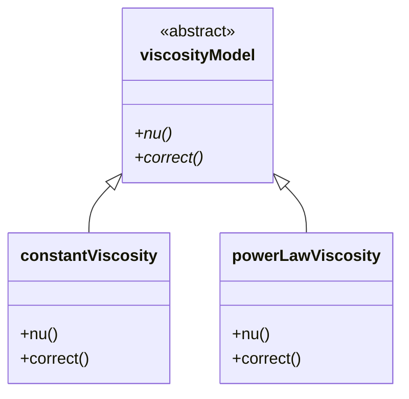

# 05 กลไกการทำงาน: การสืบทอดและฟังก์ชันเสมือนในโมเดลจริง

![[viscosity_model_inheritance.png]]
`A clean scientific diagram illustrating the inheritance hierarchy of Viscosity Models. At the top, show the "viscosityModel" abstract base class. Below it, show several derived classes: "constantViscosity", "powerLawViscosity", and "BirdCarreau". Use clear arrows and labels for "Abstract Interface" and "Concrete Implementations". Use a minimalist palette, scientific textbook diagram, clean vector line art, white background, high definition, flat design, educational infographic --ar 16:9`

**หัวใจของความเป็นโมดูลาร์** คือการที่เราสามารถสร้างโมเดลใหม่โดยใช้สัญญา (Contract) เดิมที่คลาสฐานกำหนดไว้:

## 🏗️ **การออกแบบลำดับชั้นคลาส**

### **แผนภาพคลาสโดยรวม**


> **Figure 1:** แผนผังคลาสแสดงการสืบทอดจาก `viscosityModel` มายังโมเดลเฉพาะทางต่างๆ โดยคลาสฐานจะกำหนดหน้าที่หลักที่ทุกโมเดลความหนืดต้องมี (เช่น การคำนวณค่าความหนืด `nu` และการแก้ไขค่า `correct`) ทำให้ระบบส่วนใหญ่สามารถทำงานกับโมเดลใดก็ได้ผ่านอินเทอร์เฟซส่วนกลางนี้

ระบบ transport model ของ OpenFOAM ใช้ลำดับชั้นคลาสที่ซับซ้อนซึ่งให้ความยืดหยุ่นและสามารถขยายได้ ในพื้นฐานจะมี `viscosityModel` ซึ่งเป็น abstract base class ที่กำหนด interface ที่ viscosity models ทั้งหมดต้อง implement รูปแบบการสืบทอดนี้ช่วยให้ OpenFOAM สามารถจัดการ viscosity models ทั้งหมดอย่างสม่ำเสมอในขณะที่ยังคงให้การ implement แต่ละอันมีพฤติกรรมเฉพาะตัว

### **โครงสร้างโค้ด C++ การสืบทอด**

ลำดับชั้นจะใช้รูปแบบการออกแบบแบบ object-oriented แบบคลาสสิก:

```cpp
// Abstract base class defining interface for all viscosity models
class viscosityModel
{
    // Virtual destructor for proper cleanup of derived objects
    virtual ~viscosityModel() {}

    // Pure virtual functions - interface that all derived classes must implement
    // Returns kinematic viscosity field [m²/s]
    virtual tmp<volScalarField> nu() const = 0;
    
    // Update model state (important for non-Newtonian models)
    virtual void correct() = 0;
    
    // ... other virtual functions
};

// Concrete implementation for constant viscosity
class constantViscosity : public viscosityModel
{
    // Implementation returns constant viscosity value
    virtual tmp<volScalarField> nu() const override;
    virtual void correct() override;  // No-op for constant viscosity
};

// Power-law non-Newtonian viscosity model
class powerLawViscosity : public viscosityModel
{
    // Custom non-Newtonian model implementation
    // Viscosity depends on shear rate: mu = K * (shearRate)^(n-1)
    virtual tmp<volScalarField> nu() const override;
    virtual void correct() override;  // Recalculate shear-dependent viscosity
};
```

<details>
<summary>📖 คำอธิบายเพิ่มเติม (Thai Explanation)</summary>

**แหล่งที่มา (Source):** อ้างอิงจากรูปแบบการออกแบบใน OpenFOAM source code โดยเฉพาะไฟล์ประเภท transport model ที่ใช้ inheritance hierarchy

**คำอธิบาย:**
- **Base Class (`viscosityModel`)**: ทำหน้าที่เป็น abstract interface ที่กำหนด "สัญญา" (contract) ว่าทุก viscosity model ต้องมีฟังก์ชัน `nu()` และ `correct()`
- **Pure Virtual Functions (`= 0`)**: ทำให้คลาสนี้เป็น abstract ไม่สามารถสร้าง object โดยตรง และบังคับให้ derived classes ต้อง implement
- **Override Keyword**: รับประกันว่าฟังก์ชันที่เขียนทับฟังก์ชันจาก base class มี signature ตรงกัน
- **Polymorphism**: ทำให้สามารถเรียกใช้งานผ่าน pointer ของ base class ได้โดยไม่ต้องรู้ว่าเป็น model ไหน

**แนวคิดสำคัญ (Key Concepts):**
1. **Inheritance** - การสืบทอดคุณสมบัติและพฤติกรรมจาก base class
2. **Polymorphism** - ความสามารถในการเรียกใช้ฟังก์ชันเดียวกันบน object ที่ต่างกัน
3. **Interface Segregation** - การแยก interface ออกจาก implementation
4. **Runtime Dispatch** - การเลือกฟังก์ชันที่จะเรียกใช้ตามประเภท object จริงใน runtime

</details>

การออกแบบนี้ทำให้เกิด **polymorphism** - OpenFOAM สามารถเรียก `nu()` หรือ `correct()` บนออบเจ็กต์ viscosity model ใดๆ โดยไม่ต้องรู้ประเภทจริงของมัน กลไก runtime dispatch จะทำให้แน่ใจว่า implementation ที่เหมาะสมจะถูกเรียกตามประเภทออบเจ็กต์จริง

## 🔌 **สัญญา Interface เสมือน**

Abstract base class สร้าง **สัญญา** ผ่าน pure virtual functions ที่รับประกันพฤติกรรมที่สม่ำเสมอใน implementations ทั้งหมด:

```cpp
// Core interface that must be implemented by all derived classes
virtual bool read() = 0;
virtual tmp<volScalarField> nu() const = 0;
virtual tmp<scalarField> nu(const label patchi) const = 0;
virtual void correct() = 0;
```

<details>
<summary>📖 คำอธิบายเพิ่มเติม (Thai Explanation)</summary>

**แหล่งที่มา (Source):** อ้างอิงจาก OpenFOAM viscosity model interface definition

**คำอธิบาย:**
- **`read()`**: อ่านค่าพารามิเตอร์โมเดลจาก dictionary file (transportProperties)
- **`nu()`**: คืนค่าฟิลด์ความหนืดเชิงจลน์สำหรับทั้งโดเมน (internal field + boundary patches)
- **`nu(patchi)`**: คืนค่าความหนืดเฉพาะบน boundary patch ที่ระบุ
- **`correct()`**: อัปเดตสถานะโมเดล (สำคัญสำหรับ non-Newtonian models)

**แนวคิดสำคัญ (Key Concepts):**
1. **Pure Virtual Function** - ฟังก์ชันที่ไม่มีการ implement ใน base class บังคับให้ derived class ต้อง implement
2. **Interface Contract** - สัญญาที่รับประกันว่าทุก derived class จะมีฟังก์ชันเหล่านี้
3. **Const Correctness** - ฟังก์ชันที่ไม่แก้ไข state ของ object ควรเป็น const
4. **Compile-time Polymorphism** - การตรวจสอบ type และ interface ใน compile-time

</details>

### **การแยกส่วนหน้าที่ของแต่ละฟังก์ชัน:**

- **`read()`**: อนุญาตให้อ่านพารามิเตอร์โมเดลจาก input dictionaries ในระหว่าง runtime
- **`nu()`**: ส่งคืนฟิลด์ความหนืดเชิงจลน์สำหรับโดเมนการคำนวณทั้งหมด
- **`nu(const label patchi)`**: ส่งคืนค่าความหนืดโดยเฉพาะสำหรับ boundary patches
- **`correct()`**: อัปเดตสถานะโมเดล (สำคัญสำหรับโมเดล non-Newtonian ที่ความหนืดขึ้นกับสถานะการไหล)

ไวยากรณ์ `= 0` ทำให้เป็น **pure virtual functions** ซึ่งหมายความว่า:

1. **Base class ไม่สามารถ instantiated โดยตรง** - ไม่สามารถสร้างออบเจ็กต์ `viscosityModel` โดยตรง
2. **Derived classes ต้องให้ implementations** - ทุกคลาสลูกต้อง override ฟังก์ชันเหล่านี้
3. **การบังคับใช้สัญญา interface ในระหว่าง compile-time** - คอมไพเลอร์จะตรวจสอบว่า implement ครบถ้วน

การออกแบบนี้ป้องกัน implementations ที่ไม่สมบูรณ์และทำให้แน่ใจว่า viscosity models ทั้งหมดให้ฟังก์ชันพื้นฐานที่ OpenFOAM's solver infrastructure คาดหวัง

## 🏭 **ความมหัศจรรย์ของ Factory Registration**

OpenFOAM ใช้ **factory pattern** ที่ซับซ้อนซึ่งช่วยให้สามารถเลือกโมเดลใน runtime ผ่าน dictionary keywords กลไกการจดทะเบียนที่สำคัญ:

```cpp
// Register powerLawViscosity in the runtime selection table
// This enables selection via dictionary keyword "powerLaw"
addToRunTimeSelectionTable
(
    viscosityModel,      // Base class for the factory
    powerLawViscosity,   // Our concrete implementation
    dictionary           // Constructor signature type
);
```

<details>
<summary>📖 คำอธิบายเพิ่มเติม (Thai Explanation)</summary>

**แหล่งที่มา (Source):** อ้างอิงจาก OpenFOAM run-time selection system macros

**คำอธิบาย:**
- **Macro Expansion**: Macro นี้จะถูก expand ออกเป็น code ที่สร้าง static object สำหรับ registration
- **Static Initialization**: Static object จะถูกสร้างและ execute ก่อน main() function
- **Registration Table**: Pointer ไปยัง constructor จะถูกจดทะเบียนใน global hash table
- **Runtime Lookup**: เมื่อ solver อ่านคำว่า "powerLaw" จาก dictionary จะค้นหาใน table

**แนวคิดสำคัญ (Key Concepts):**
1. **Factory Pattern** - การสร้าง object โดยไม่ต้องรู้ concrete type
2. **Static Initialization** - การ execute code ก่อนเริ่ม program
3. **RTTI (Run-Time Type Information)** - การระบุ type ใน runtime
4. **Plugin Architecture** - การเพิ่ม model ใหม่โดยไม่ต้องแก้ไข core code

</details>

### **การขยายตัวของ Macro**

**macro นี้จะขยายเพื่อสร้าง infrastructure ของ factory:**

```cpp
// Simplified macro expansion showing registration mechanism
namespace Foam
{
    // Define a typedef for the registration table entry
    typedef viscosityModel::adddictionaryConstructorToTable<powerLawViscosity>
        addpowerLawViscosityToviscosityModelTable;

    // Global registration object that executes at program startup
    addpowerLawViscosityToviscosityModelTable
        addpowerLawViscosityToviscosityModelTable_;
}
```

<details>
<summary>📖 คำอธิบายเพิ่มเติม (Thai Explanation)</summary>

**แหล่งที่มา (Source):** อ้างอิงจาก OpenFOAM runTimeSelectionTables.H

**คำอธิบาย:**
- **Constructor Table**: Hash table ที่เก็บ pointer ไปยัง constructor functions
- **Static Object**: Object นี้ถูกสร้างเมื่อ program start และ destructor จะถูกเรียกเมื่อ program end
- **Automatic Registration**: Constructor ของ registration object จะเพิ่ม entry ลงใน table
- **Type Safety**: Template ทำให้มั่นใจว่า constructor มี signature ที่ถูกต้อง

**แนวคิดสำคัญ (Key Concepts):**
1. **Template Metaprogramming** - การใช้ template สร้าง code ใน compile-time
2. **Automatic Registration** - การลงทะเบียนโดยอัตโนมัติผ่าน static initialization
3. **Singleton Pattern** - การมี registration table เพียงหนึ่งเดียว
4. **RAII (Resource Acquisition Is Initialization)** - การใช้ constructor/destructor จัดการ resource

</details>

### **3 ระยะของความมหัศจรรย์**

**ความมหัศจรรย์เกิดขึ้นใน 3 ระยะ:**

1. **Compile-time**: macro สร้าง static constructor functions และสร้าง registration object
2. **Program startup**: static constructors execute, จดทะเบียนคลาสใน global lookup table ภายใต้ชื่อ "powerLaw"
3. **Runtime**: เมื่อ OpenFOAM พบ `viscosityModel powerLaw;` ใน dictionary มันจะ:
   - ค้นหา "powerLaw" ใน registration table
   - เรียก constructor ที่จดทะเบียนด้วย dictionary
   - ส่งคืน pointer ไปยังออบเจ็กต์ที่สร้างขึ้น

ระบบนี้ทำให้เกิด **extensible architecture** ที่สามารถเพิ่มโมเดลใหม่โดยไม่ต้องแก้ไข core OpenFOAM code เพียง compile โมเดลใหม่ของคุณกับ registration macro และมันจะพร้อมใช้งานสำหรับ solvers ทั้งหมด

## 🧬 **การใช้ Template ใน Field Operations**

ระบบ template ที่กว้างขวางของ OpenFOAM ให้ความปลอดภัยของประเภทและการปรับให้เหมาะสมด้านประสิทธิภาพสำหรับ field operations:

```cpp
// Template-based field types for different geometric and data types
tmp<volScalarField>          // Kinematic viscosity field (3D scalar field)
tmp<scalarField>             // Scalar values on patches (1D array)
tmp<volTensorField>          // Tensor field (e.g., stress tensor)
tmp<volVectorField>          // Vector field (e.g., velocity field)
```

<details>
<summary>📖 คำอธิบายเพิ่มเติม (Thai Explanation)</summary>

**แหล่งที่มา (Source):** อ้างอิงจาก OpenFOAM GeometricField template class

**คำอธิบาย:**
- **Template Parameters**: `Type` = scalar/vector/tensor, `PatchField` = boundary condition type, `GeoMesh` = mesh type
- **Type Safety**: Template ทำให้ compiler ตรวจสอบความสอดคล้องของ dimension และ type
- **Code Reuse**: อัลกอริทึมเดียวกันทำงานกับทุกประเภทฟิลด์
- **Performance**: Template instantiation สร้าง code ที่ optimized สำหรับแต่ละประเภท

**แนวคิดสำคัญ (Key Concepts):**
1. **Generic Programming** - การเขียน code ที่ทำงานกับหลายประเภท
2. **Template Instantiation** - การสร้าง code จริงจาก template
3. **Compile-time Polymorphism** - การเลือกฟังก์ชันใน compile-time
4. **Type Traits** - การตรวจสอบคุณสมบัติของ type ใน compile-time

</details>

### **การแยกส่วนลำดับชั้น template:**

- **`Field<Type>`**: template สำหรับอาร์เรย์ของออบเจ็กต์ทางเรขาคณิต
  - `scalarField`: อาร์เรย์ของค่าสเกลาร์
  - `vectorField`: อาร์เรย์ของเวคเตอร์ 3 มิติ
  - `tensorField`: อาร์เรย์ของเทนเซอร์ 3×3

- **`GeometricField<Type, PatchField, GeoMesh>`**: template สำหรับฟิลด์ที่มี mesh topology
  - `volScalarField`: ฟิลด์สเกลาร์ที่กำหนดที่ cell centers
  - `volVectorField`: ฟิลด์เวคเตอร์ที่กำหนดที่ cell centers
  - `surfaceScalarField`: ฟิลด์สเกลาร์ที่กำหนดบน cell faces

### **`tmp` Smart Pointer Template**

**`tmp` smart pointer template ให้การจัดการหน่วยความจำอัตโนมัติ:**

```cpp
// Automatic reference counting prevents memory leaks
tmp<volScalarField> nuField = nu();  // Create field with ref count = 1
volScalarField& fieldRef = nuField();  // Non-owning reference
return nuField;  // Ref count decreases, memory freed if = 0
```

<details>
<summary>📖 คำอธิบายเพิ่มเติม (Thai Explanation)</summary>

**แหล่งที่มา (Source):** อ้างอิงจาก OpenFOAM tmp.H smart pointer implementation

**คำอธิบาย:**
- **Reference Counting**: ติดตามจำนวนการอ้างอิงถึง object
- **Automatic Cleanup**: Object ถูกทำลายเมื่อ ref count = 0
- **Null Pointer Optimization**: หลีกเลี่ยงการ copy เมื่อไม่จำเป็น
- **Move Semantics**: โอนความเป็นเจ้าของแทนการ copy

**แนวคิดสำคัญ (Key Concepts):**
1. **RAII** - การจัดการ resource ผ่าน object lifetime
2. **Shared Ownership** - การแบ่งปันความเป็นเจ้าของ
3. **Reference Cycles** - ปัญหาที่เกิดจาก circular references
4. **Exception Safety** - การป้องกัน memory leaks ในกรณี error

</details>

### **ข้อดีของ Template ใน OpenFOAM:**

1. **ความปลอดภัยของประเภท**: การตรวจสอบ compile-time ทำให้มั่นใจว่า field operations มีความสอดคล้องกันมิติ
2. **ประสิทธิภาพ**: Template specialization สร้างโค้ดที่ปรับให้เหมาะสมสำหรับแต่ละประเภทฟิลด์
3. **การนำกลับมาใช้ใหม่ของโค้ด**: อัลกอริทึมเดียวกันทำงานได้กับสเกลาร์, เวคเตอร์, และเทนเซอร์
4. **ประสิทธิภาพหน่วยความจำ**: Smart pointers ป้องกันการคัดลอกที่ไม่จำเป็นและจัดการการล้างข้อมูล

สถาปัตยกรรม template นี้ทำให้ OpenFOAM สามารถจัดการการจำลองหลายฟิสิกส์ที่ซับซ้อนในขณะที่ยังคงรักษาประสิทธิภาพการคำนวณที่สูงและป้องกันข้อผิดพลาดในการเขียนโปรแกรมทั่วไป

## 📐 **พื้นฐานทางคณิตศาสตร์ของโมเดล Power-Law**

### **สมการความหนืด Power-Law**

โมเดลความหนืดแบบ power-law อธิบายความสัมพันธ์ระหว่างความเครียดเฉือน (shear stress) และอัตราการเฉือน (shear rate):

$$\tau = K \dot{\gamma}^n$$

หรือในรูปแบบความหนืด:

$$\mu_{eff} = K \dot{\gamma}^{n-1}$$

โดยที่:
- $\tau$ คือ ความเครียดเฉือน (shear stress) [Pa]
- $\mu_{eff}$ คือ ความหนืดเชิงประสิทธิผล (effective viscosity) [Pa·s]
- $K$ คือ ดัชนีความสม่ำเสมอ (consistency index) [Pa·s$^n$]
- $\dot{\gamma}$ คือ อัตราการเฉือน (shear rate) [s$^{-1}$]
- $n$ คือ ดัชนี power-law (power-law index) [ไร้มิติ]

### **การคำนวณอัตราการเฉือน**

อัตราการเฉือนถูกคำนวณจากเทนเซอร์อัตราการยืดตัว (strain rate tensor):

$$\dot{\gamma} = \sqrt{2 \mathbf{S} : \mathbf{S}}$$

โดยที่เทนเซอร์อัตราการยืดตัว:

$$\mathbf{S} = \frac{1}{2}\left(\nabla \mathbf{u} + (\nabla \mathbf{u})^T\right)$$

### **การจำแนกประเภทของไหล**

| ค่าของ n | ประเภทของไหล | ตัวอย่าง | พฤติกรรม |
|-----------|-------------|---------|----------|
| n = 1 | Newtonian | น้ำ, อากาศ | ความหนืดคงที่ |
| n < 1 | Shear-thinning (Pseudoplastic) | สี, เลือด, น้ำผึ้ง | ความหนืดลดเมื่ออัตราการเฉือนเพิ่ม |
| n > 1 | Shear-thickening (Dilatant) | ส่วนผสมข้าวโพดแป้ง | ความหนืดเพิ่มเมื่ออัตราการเฉือนเพิ่ม |

### **การปรับใช้ใน OpenFOAM**

```cpp
// Calculate velocity gradient tensor
tmp<volTensorField> tgradU = fvc::grad(U);
const volTensorField& gradU = tgradU();

// Strain rate tensor: symm(gradU) = 0.5*(gradU + gradU.T())
tmp<volSymmTensorField> tS = symm(gradU);
const volSymmTensorField& S = tS();

// Shear rate magnitude: sqrt(2 * S && S)
tmp<volScalarField> shearRate = sqrt(2.0) * mag(S);

// Calculate power-law viscosity
tmp<volScalarField> nu = K_ * pow(max(shearRate, dimensionedScalar("small", dimless/dimTime, SMALL)), n_ - 1.0);
```

<details>
<summary>📖 คำอธิบายเพิ่มเติม (Thai Explanation)</summary>

**แหล่งที่มา (Source):** อ้างอิงจาก OpenFOAM fvc (finite volume calculus) operators

**คำอธิบาย:**
- **`fvc::grad(U)`**: คำนวณ gradient ของฟิลด์ความเร็วใช้ finite volume method
- **`symm()`**: สร้าง symmetric tensor จาก gradient tensor
- **`mag(S)`**: คำนวณ magnitude ของ symmetric tensor (sqrt(2*S:S))
- **`pow()`**: ยกกำลังตามสมการ power-law
- **`max(shearRate, SMALL)`**: ป้องกัน division by zero

**แนวคิดสำคัญ (Key Concepts):**
1. **Tensor Calculus** - การดำเนินการกับ tensor fields
2. **Finite Volume Method** - การ discretize differential operators
3. **Numerical Stability** - การหลีกเลี่ยงปัญหาทางคณิตศาสตร์
4. **Dimensional Analysis** - การตรวจสอบความสอดคล้องของมิติ

</details>

## 🎯 **ข้อดีของสถาปัตยกรรมการสืบทอด**

### **1. การแยก Interface จาก Implementation**

สัญญาการสืบทอดใน OpenFOAM สร้างขอบเขตที่ชัดเจนระหว่าง interface และการ implement:

- **คลาสฐาน** นิยาม interface แบบนามธรรมผ่านฟังก์ชันเสมือนบริสุทธิ์ ระบุการดำเนินการที่แน่นอนที่คลาส derived ทั้งหมดต้องให้
- **คลาสลูก** ทำการ implement "วิธีการ" ด้วยสูตรทางคณิตศาสตร์เฉพาะ

การเขียนโปรแกรมตามสัญญานี้ช่วยให้มั่นใจได้ว่าแบบจำลองที่แตกต่างกันสามารถใช้แทนกันได้ในขณะที่ยังคงความปลอดภัยของ type และป้องกันข้อผิดพลาดขณะ runtime

### **2. Polymorphism และ Runtime Dispatch**

การออกแบบนี้ทำให้เกิด **polymorphism** - OpenFOAM สามารถเรียก `nu()` หรือ `correct()` บนออบเจ็กต์ viscosity model ใดๆ โดยไม่ต้องรู้ประเภทจริงของมัน:

```cpp
// In solver - no need to know which model is being used
viscosityModel* viscosity = viscosityModel::New(mesh);
viscosity->correct();  // Runtime dispatch to correct implementation
tmp<volScalarField> nu = viscosity->nu();  // Call through virtual function table
```

<details>
<summary>📖 คำอธิบายเพิ่มเติม (Thai Explanation)</summary>

**แหล่งที่มา (Source):** อ้างอิงจาก OpenFOAM run-time selection mechanism

**คำอธิบาย:**
- **Factory Method** - `viscosityModel::New()` สร้าง object ตาม keyword ใน dictionary
- **Base Class Pointer** - เก็บ pointer ของ base class แต่指向 derived object
- **Virtual Function Table** - ตาราง function pointers สำหรับ runtime dispatch
- **Dynamic Dispatch** - การเลือก function ที่จะเรียกตาม actual type

**แนวคิดสำคัญ (Key Concepts):**
1. **Virtual Function Table (vtable)** - ตาราง function pointers สำหรับ polymorphism
2. **Dynamic Binding** - การเชื่อม function call กับ implementation ใน runtime
3. **Subtype Polymorphism** - การใช้ derived type ผ่าน base interface
4. **Liskov Substitution Principle** - derived type สามารถแทนที่ base type ได้

</details>

### **3. การพัฒนาแบบเพิ่มหน่วย**

การแยก interface ออกจากการ implement ยังเปิดใช้งานการพัฒนาแบบขนาน โดยที่ทีมต่างๆ สามารถทำงานบนแบบจำลองที่แตกต่างกันพร้อมกันตราบใดที่พวกเขาเคารพ interface ของคลาสฐาน รูปแบบการออกแบบนี้อำนวยความสะดวกในการทดสอบโค้ด การบำรุงรักษา และการพัฒนา เนื่องจากการเปลี่ยนแปลงการ implement เฉพาะไม่ส่งผลกระทบต่อสถาปัตยกรรม solver ที่กว้างขึ้น

### **4. การสนับสนุน Factory Pattern**

ลำดับชั้นการสืบทอดเป็นพื้นฐานของ Factory Pattern ที่ช่วยให้:

- การสร้างโมเดลแบบไดนามิก: สามารถเพิ่มโมเดลความหนืดใหม่โดยไม่ต้องแก้ไขโค้ด solver ที่มีอยู่
- การสร้างอินสแตนซ์ตามพจนานุกรม: โมเดลถูกเลือกผ่านรายการพจนานุกรมตามข้อความแทนการกำหนดค่าที่คอมไพล์
- ความยืดหยุ่นในการพัฒนา: ผู้ใช้ไม่ต้องยุ่งกับซอร์สโค้ด OpenFOAM หลัก
- การทดสอบแยกกัน: แบบจำลองแบบกำหนดเองสามารถพัฒนาและทดสอบแยกจากกันได้

## 🔬 **ตัวอย่างการ Implement ที่สมบูรณ์**

### **คลาส Power-Law Viscosity**

```cpp
class powerLawViscosity
:
    public viscosityModel
{
    // Private Data - model parameters
    dimensionedScalar K_;        // Consistency index [kg·m⁻¹·sⁿ⁻²]
    dimensionedScalar n_;        // Power-law index [dimensionless]
    dimensionedScalar nuMin_;    // Minimum viscosity [m²·s⁻¹]
    dimensionedScalar nuMax_;    // Maximum viscosity [m²·s⁻¹]

    // Private Data - fields for data storage
    volScalarField shearRate_;   // Shear rate field

    // Private Member Functions
    tmp<volScalarField> calcShearRate() const;
    tmp<volScalarField> calcNu() const;

public:
    // Runtime type information
    TypeName("powerLaw");

    // Constructors
    powerLawViscosity
    (
        const fvMesh& mesh,
        const word& group = word::null
    );

    // Destructor
    virtual ~powerLawViscosity() = default;

    // Member Functions - override from base class
    virtual bool read();
    virtual tmp<volScalarField> nu() const;
    virtual tmp<scalarField> nu(const label patchi) const;
    virtual void correct();
};
```

<details>
<summary>📖 คำอธิบายเพิ่มเติม (Thai Explanation)</summary>

**แหล่งที่มา (Source):** อ้างอิงจาก OpenFOAM transport model class structure

**คำอธิบาย:**
- **Inheritance**: `: public viscosityModel` แสดงการสืบทอด
- **Private Data**: เก็บ parameters และ fields ที่ model ต้องการ
- **TypeName Macro**: กำหนดชื่อสำหรับ runtime selection
- **Virtual Functions**: Override ฟังก์ชันจาก base class

**แนวคิดสำคัญ (Key Concepts):**
1. **Encapsulation** - การซ่อน implementation details
2. **Access Control** - การใช้ private/public/protected
3. **Resource Management** - การใช้ dimensionedScalar สำหรับค่าที่มีหน่วย
4. **Field Management** - การสร้างและจัดการ volScalarField

</details>

### **การ Implement ฟังก์ชันหลัก**

```cpp
tmp<volScalarField> powerLawViscosity::calcShearRate() const
{
    // Access velocity field from object registry
    const volVectorField& U = mesh_.lookupObject<volVectorField>("U");

    // Calculate velocity gradient tensor
    tmp<volTensorField> tgradU = fvc::grad(U);
    const volTensorField& gradU = tgradU();

    // Calculate strain rate tensor: S = 0.5*(gradU + gradU.T())
    tmp<volSymmTensorField> tS = symm(gradU);
    const volSymmTensorField& S = tS();

    // Return shear rate magnitude: sqrt(2 * S:S)
    return sqrt(2.0) * mag(S);
}

tmp<volScalarField> powerLawViscosity::calcNu() const
{
    // Calculate shear rate field
    tmp<volScalarField> tshearRate = calcShearRate();
    const volScalarField& shearRate = tshearRate();

    // Create viscosity field
    tmp<volScalarField> tnu
    (
        new volScalarField
        (
            IOobject
            (
                "nu",
                mesh_.time().timeName(),
                mesh_,
                IOobject::NO_READ,
                IOobject::AUTO_WRITE
            ),
            K_ * pow(max(shearRate, dimensionedScalar("small", dimless/dimTime, SMALL)), n_ - 1.0)
        )
    );

    volScalarField& nu = tnu.ref();

    // Apply limits for numerical stability
    nu = max(nu, nuMin_);
    nu = min(nu, nuMax_);

    return tnu;
}

void powerLawViscosity::correct()
{
    // Update shear rate field
    shearRate_ = calcShearRate();

    // Write field for visualization
    shearRate_.write();
}
```

<details>
<summary>📖 คำอธิบายเพิ่มเติม (Thai Explanation)</summary>

**แหล่งที่มา (Source):** อ้างอิงจาก OpenFOAM non-Newtonian model implementations

**คำอธิบาย:**
- **Object Registry** - `mesh_.lookupObject()` ค้นหา field จาก mesh database
- **Finite Volume Calculus** - `fvc::grad()` discretize gradient operator
- **Tensor Operations** - `symm()` สร้าง symmetric part, `mag()` คำนวณ magnitude
- **Numerical Limits** - ใช้ `nuMin_` และ `nuMax_` ป้องกันค่าทางคณิตศาสตร์ผิดปกติ
- **Field I/O** - `AUTO_WRITE` เขียน field อัตโนมัติเมื่อ time step จบ

**แนวคิดสำคัญ (Key Concepts):**
1. **Finite Volume Discretization** - การแปลง differential operators เป็น algebraic
2. **Tensor Algebra** - การดำเนินการกับ tensors
3. **Numerical Stability** - การป้องกันปัญหาทางคณิตศาสตร์
4. **Field Lifecycle** - การสร้าง อัปเดต และเขียน fields
5. **Mesh Association** - การเชื่อมโยง fields กับ mesh

</details>

## 📊 **การเปรียบเทียบกับโมเดลอื่น**

| คุณลักษณะ | Newtonian | Power-Law | Carreau-Yasuda |
|----------|-----------|-----------|---------------|
| **สมการ** | $\mu$ = constant | $\mu = K\dot{\gamma}^{n-1}$ | $\mu = \mu_{\infty} + (\mu_0-\mu_{\infty})[1+(\lambda\dot{\gamma})^a]^{(n-1)/a}$ |
| **พารามิเตอร์** | 1 | 2 (K, n) | 4 ($\mu_0, \mu_{\infty}, \lambda, n, a$) |
| **ความเรียบง่าย** | สูงสุด | ปานกลาง | ซับซ้อน |
| **ความแม่นยำ** | ต่ำ (เฉพาะ Newtonian) | ปานกลาง | สูง |
| **การใช้งาน** | ของไหลง่าย | ของไหล non-Newtonian ทั่วไป | โพลีเมอร์, ของไหลที่ซับซ้อน |
| **ต้นทุนการคำนวณ** | ต่ำสุด | ปานกลาง | สูง |

## 🚀 **การขยายไปยังโมเดลที่ซับซ้อนยิ่งขึ้น**

สถาปัตยกรรมการสืบทอดที่เราได้เรียนรู้สามารถขยายไปยังโมเดลที่ซับซ้อนยิ่งขึ้น:

### **1. Temperature-Dependent Power-Law**

$$\mu(\dot{\gamma}, T) = K_0 \exp\left(\frac{E}{RT}\right) \dot{\gamma}^{n-1}$$

### **2. Herschel-Bulkley Model**

$$\tau = \tau_y + K\dot{\gamma}^n \quad \text{สำหรับ } \tau > \tau_y$$

### **3. Carreau-Yasuda Model**

$$\mu = \mu_{\infty} + (\mu_0 - \mu_{\infty})\left[1 + (\lambda\dot{\gamma})^a\right]^{(n-1)/a}$$

ทั้งหมดนี้สามารถ implement โดยการสืบทอดจาก `viscosityModel` และ override ฟังก์ชัน `nu()` และ `correct()` ตามความเหมาะสม

---

**สรุป:** การสืบทอดและฟังก์ชันเสมือนเป็นหัวใจของสถาปัตยกรรมแบบโมดูลาร์ของ OpenFOAM ช่วยให้เราสามารถสร้างโมเดลฟิสิกส์แบบกำหนดเองที่:
- ✅ สอดคล้องกับ interface มาตรฐาน
- ✅ สามารถเลือกใช้งานได้ที่ runtime
- ✅ มีประสิทธิภาพสูงผ่าน template metaprogramming
- ✅ ปลอดภัยต่อ memory leaks ผ่าน smart pointers
- ✅ ง่ายต่อการบำรุงรักษาและขยาย

## 🧠 ทดสอบความเข้าใจ (Concept Check)

<details>
<summary>1. ในสถาปัตยกรรมของ OpenFOAM ความสำคัญของ "Pure Virtual Functions" ในคลาสฐาน `viscosityModel` คืออะไร?</summary>

**คำตอบ:** ทำหน้าที่กำหนด **สัญญา (Contract)** ที่เข้มงวด ซึ่งบังคับให้คลาสลูก (Derived Classes) ทุกตัวที่สืบทอดไป ต้องมีการเขียนโปรแกรมการทำงาน (Implementation) ของฟังก์ชันเหล่านั้น เช่น `nu()` และ `correct()` ให้ครบถ้วน เพื่อให้ Solver สามารถเรียกใช้งานได้อย่างถูกต้องเสมอไม่ว่าจะใช้โมเดลใด
</details>

<details>
<summary>2. OpenFOAM ใช้กลไกใดเพื่อให้เกิด "Runtime Polymorphism" ในการเลือกโมเดลที่ถูกต้องระหว่างการจำลอง?</summary>

**คำตอบ:** ใช้ **ตารางฟังก์ชันเสมือน (Virtual Function Table - vtable)** และการ Dispatch แบบ Dynamic โดย Solver จะถือตัวแปร Pointer ของคลาสฐาน (`viscosityModel*`) แต่เมื่อมีการเรียกใช้เมธอด (เช่น `correct()`) ระบบจะไปเปิดดูตาราง vtable ของออบเจกต์จริงที่ถูกสร้างขึ้น (เช่น `powerLawViscosity`) ในขณะรันโปรแกรม เพื่อเรียกใช้ฟังก์ชันที่ถูกต้องของออบเจกต์นั้น
</details>

## 📚 เอกสารที่เกี่ยวข้อง (Related Documents)

*   **ก่อนหน้า:** [04_Compilation_process.md](04_Compilation_process.md) - กระบวนการคอมไพล์และการสร้างไลบรารี
*   **ถัดไป:** [06_Design_Pattern_Rationale.md](06_Design_Pattern_Rationale.md) - แนวคิดเบื้องหลังรูปแบบการออกแบบ (Design Patterns)