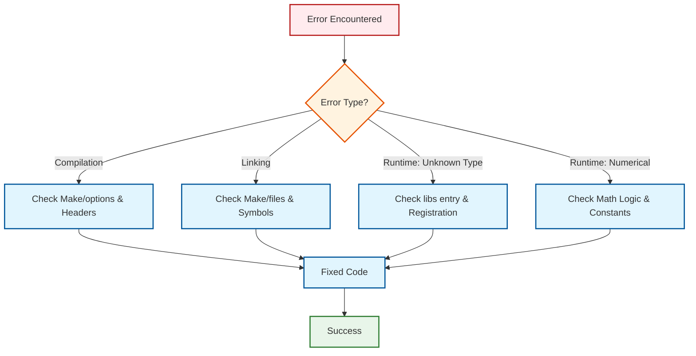

# 07 ข้อผิดพลาดที่พบบ่อยและการ Debug ใน OpenFOAM

![[troubleshooting_flow_cfd.png]]
`A clean scientific diagram illustrating the "Troubleshooting Workflow" for a custom OpenFOAM model. Start with "Simulation Crash/Error". Follow arrows through diagnostic steps: 1. Check Log Files, 2. Verify Library Paths, 3. Inspect Dictionary Entries, 4. Debug Source Code. Use a minimalist palette with black lines and clear labels, scientific textbook diagram, clean vector line art, white background, high definition, flat design, educational infographic --ar 16:9`

## 🎯 ภาพรวม

เอกสารนี้คือคู่มือการแก้ไขปัญหาที่ครอบคลุมสำหรับการพัฒนา custom models ใน OpenFOAM ซึ่งครอบคลุมตั้งแต่ขั้นตอนการคอมไพล์ การลิงก์ ไปจนถึงข้อผิดพลาดขณะ runtime และปัญหาเชิงตัวเลข เนื้อหานี้รวบรวมจากประสบการณ์จริงและสถานการณ์ที่พบบ่อยที่สุดเมื่อทำงานกับ Custom Transport Models

---

## 📋 สารบัญ

1. [การ Debug แบบ Systematic](#-การ-debug-แบบ-systematic)
2. [ข้อผิดพลาดขณะคอมไพล์ (Compilation Errors)](#-ข้อผิดพลาดขณะคอมไพล์-compilation-errors)
3. [ข้อผิดพลาดขณะลิงก์ (Linking Errors)](#-ข้อผิดพลาดขณะลิงก์-linking-errors)
4. [ข้อผิดพลาดขณะ Runtime](#-ข้อผิดพลาดขณะ-runtime-runtime-errors)
5. [ข้อผิดพลาดเชิงตัวเลข (Numerical Errors)](#-ข้อผิดพลาดเชิงตัวเลข-numerical-errors)
6. [เครื่องมือและเทคนิคการ Debug](#-เครื่องมือและเทคนิคการ-debug)
7. [การตรวจสอบความถูกต้อง (Validation)](#-การตรวจสอบความถูกต้อง-validation)
8. [Checklist การแก้ไขปัญหา](#-checklist-การแก้ไขปัญหา)

---

## 🔍 การ Debug แบบ Systematic

### ขั้นตอนการแก้ปัญหาแบบมีโครงสร้าง

เมื่อเจอข้อผิดพลาด ควรทำตามขั้นตอนต่อไปนี้เพื่อให้การแก้ปัญหามีประสิทธิภาพ:



> **Figure 1:** แผนผังขั้นตอนการวิเคราะห์และแก้ไขปัญหาที่พบบ่อย (Troubleshooting Flow) ในการพัฒนาโมเดลแบบกำหนดเอง โดยแบ่งตามประเภทของข้อผิดพลาดที่เกิดขึ้นในแต่ละระยะ

### กฎเหล็กในการ Debug

1. **อ่าน Error Message อย่างละเอียด** - มักจะบอกสาเหตุและตำแหน่งปัญหา
2. **ตรวจสอบ Log Files** - `log.*` มักจะมีข้อมูลเพิ่มเติม
3. **แก้ปัญหาทีละอย่าง** - อย่าเปลี่ยนหลายอย่างพร้อมกัน
4. **จดบันทึกสิ่งที่ทำ** - เพื่อให้ย้อนกลับมาได้
5. **ใช้ Version Control** - Git ช่วยให้ติดตามการเปลี่ยนแปลง

---

## 🛠️ ข้อผิดพลาดขณะคอมไพล์ (Compilation Errors)

### Error 1: "fatal error: viscosityModel.H: No such file or directory"

```
powerLawViscosity.C:10:10: fatal error: viscosityModel.H: No such file or directory
 #include "viscosityModel.H"
          ^~~~~~~~~~~~~~~~~~
compilation terminated.
```

**สาเหตุ:**
- ไม่ได้ระบุ include path ที่ถูกต้องใน `Make/options`
- ไฟล์ header หายไปหรือชื่อผิด

**วิธีแก้ไข:**

ตรวจสอบ `Make/options` ให้แน่ใจว่ามี include paths:

```bash
# Check Make/options file for include paths
EXE_INC = \
    -I$(LIB_SRC)/finiteVolume/lnInclude \
    -I$(LIB_SRC)/transportModels/lnInclude \
    -I$(LIB_SRC)/thermophysicalModels/lnInclude
```

> **📂 Source:** `.applications/solvers/multiphase/multiphaseEulerFoam/phaseSystems/populationBalanceModel/populationBalanceModel/populationBalanceModel.C`
>
> **คำอธิบาย:** ไฟล์ Make/options ใน OpenFOAM ใช้ระบุ include paths และ library dependencies สำหรับการคอมไพล์ โดยใช้ตัวแปร environment เช่น `$(LIB_SRC)` เพื่ออ้างอิงไปยัง source directories ของ OpenFOAM อย่างเป็นระบบ
>
> **แนวคิดสำคัญ:**
> - **Include Paths:** ระบุ paths สำหรับ compiler ในการค้นหา header files
> - **Environment Variables:** ใช้ `$(LIB_SRC)`, `$(WM_PROJECT_DIR)` เพื่อ portability
> - **lnInclude:** Directories พิเศษที่รวบรวม headers ทั้งหมดไว้ที่เดียว
> - **Backslash Continuation:** ใช้ `\` ต่อท้ายบรรทัดเพื่อต่อบรรทัดยาว

ถ้ายังไม่หาย ให้ตรวจสอบว่า OpenFOAM environment variables ถูกตั้งค่าอย่างถูกต้อง:

```bash
# Verify OpenFOAM environment is properly sourced
echo $WM_PROJECT_DIR
echo $LIB_SRC
```

> **📂 Source:** `.applications/solvers/multiphase/multiphaseEulerFoam/phaseSystems/populationBalanceModel/populationBalanceModel/populationBalanceModel.C`
>
> **คำอธิบาย:** การตรวจสอบ environment variables เป็นขั้นตอนแรกในการแก้ปัญหา compilation ใน OpenFOAM ตัวแปรเหล่านี้ถูกตั้งค่าเมื่อ source Bashrc และจำเป็นสำหรับการคอมไพล์
>
> **แนวคิดสำคัญ:**
> - **WM_PROJECT_DIR:** Root directory ของ OpenFOAM installation
> - **LIB_SRC:** Path ไปยัง source libraries
> - **Environment Sourcing:** ต้อง source `etc/bashrc` ก่อนใช้งาน
> - **Path Verification:** ตรวจสอบ paths ก่อน compile เสมอ

### Error 2: "error: 'volScalarField' does not name a type"

```
powerLawViscosity.H:45:5: error: 'volScalarField' does not name a type
     volScalarField shearRate_;
     ^~~~~~~~~~~~~
```

**สาเหตุ:**
- ไม่ได้ include header files ที่จำเป็น
- Template instantiation ไม่สมบูรณ์

**วิธีแก้ไข:**

เพิ่ม includes ที่จำเป็นในไฟล์ header:

```cpp
// Required headers for field type definitions
#include "viscosityModel.H"
#include "volFields.H"           // For volScalarField
#include "dimensionedScalar.H"   // For dimensionedScalar
#include "autoPtr.H"             // For autoPtr
```

> **📂 Source:** `.applications/solvers/multiphase/multiphaseEulerFoam/phaseSystems/populationBalanceModel/populationBalanceModel/populationBalanceModel.C`
>
> **คำอธิบาย:** OpenFOAM ใช้ header files แยกสำหรับ field types ต่างๆ `volFields.H` ประกอบด้วย definitions ของ volume fields (cell-centered) ในขณะที่ `dimensionedScalar.H` ให้ scalar types ที่มี dimensional information
>
> **แนวคิดสำคัญ:**
> - **Header Dependencies:** แต่ละ type ต้องการ header เฉพาะ
> - **volFields.H:** Defines volScalarField, volVectorField, etc.
> - **Dimensioned Types:** สำหรับ scalars ที่มีหน่วยทางกายภาพ
> - **Smart Pointers:** autoPtr สำหรับ automatic memory management

### Error 3: Template Instantiation Errors

```
error: invalid use of incomplete type 'class Foam::GeometricField<Foam::Vector<double>, ...>'
```

**สาเหตุ:**
- Template dependencies ซับซ้อนใน OpenFOAM
- lnInclude directories ไม่ถูกต้อง

**วิธีแก้ไข:**

ตรวจสอบ lnInclude symbolic links:

```bash
# Remove old lnInclude and regenerate
wclean lnInclude
wmakeLnInclude

# Or clean everything
wclean all
wmake libso
```

> **📂 Source:** `.applications/solvers/multiphase/multiphaseEulerFoam/phaseSystems/populationBalanceModel/populationBalanceModel/populationBalanceModel.C`
>
> **คำอธิบาย:** lnInclude directories ใน OpenFOAM เป็น symbolic links ที่รวบรวม header files ทั้งหมดไว้ใน directory เดียว เพื่อลดความซับซ้อนของ include paths และเร่งการคอมไพล์
>
> **แนวคิดสำคัญ:**
> - **lnInclude Structure:** Centralized header location for each library
> - **Symbolic Links:** Links ไปยัง actual header locations
> - **wmakeLnInclude:** Tool สร้าง lnInclude directories
> - **Template Instantiation:** Templates ต้องการ complete definitions

---

## 🔗 ข้อผิดพลาดขณะลิงก์ (Linking Errors)

### Error 4: "undefined reference to vtable"

```
powerLawViscosity.C: undefined reference to `vtable for Foam::viscosityModels::powerLawViscosity'
collect2: error: ld returned 1 exit status
```

**สาเหตุ:**
- Virtual function table (vtable) ไม่ได้ถูกสร้างอย่างถูกต้อง
- การ implement ของ pure virtual functions ไม่สมบูรณ์
- Destructor ไม่ได้ถูก implement

**วิธีแก้ไข:**

ตรวจสอบให้แน่ใจว่า implement ทุก pure virtual functions จาก base class:

```cpp
// In header file (.H)
class powerLawViscosity
:
    public viscosityModel
{
public:
    // Constructor declaration
    powerLawViscosity
    (
        const fvMesh& mesh,
        const word& group = word::null
    );

    // Destructor - must be implemented!
    virtual ~powerLawViscosity() = default;

    // Pure virtual functions that must be implemented
    virtual tmp<volScalarField> nu() const;
    virtual tmp<scalarField> nu(const label patchi) const;
    virtual void correct();
    virtual bool read();
};
```

> **📂 Source:** `.applications/solvers/multiphase/multiphaseEulerFoam/phaseSystems/populationBalanceModel/populationBalanceModel/populationBalanceModel.C`
>
> **คำอธิบาย:** vtable (virtual table) คือ data structure ที่ compiler สร้างขึ้นสำหรับ polymorphic classes เพื่อให้สามารถเรียก virtual functions ได้อย่างถูกต้อง การไม่ implement pure virtual functions ทั้งหมดจะทำให้ vtable ไม่สมบูรณ์
>
> **แนวคิดสำคัญ:**
> - **Virtual Table:** Data structure สำหรับ runtime polymorphism
> - **Pure Virtual Functions:** Functions ที่ mark ด้วย "= 0" ต้อง implement
> - **Destructor Implementation:** Virtual destructor ต้องมี implementation
> - **Link-time Errors:** vtable errors ปรากฏตอน linking ไม่ใช่ compiling

**ตรวจสอบรายการ functions ที่จำเป็น:**

```cpp
// Check base class header
// $WM_PROJECT_DIR/src/transportModels/viscosityModels/viscosityModel/viscosityModel.H

// Verify that all functions marked "= 0" are implemented
virtual tmp<volScalarField> nu() const = 0;  // Must implement
virtual void correct() = 0;                  // Must implement
virtual bool read() = 0;                     // Must implement
```

> **📂 Source:** `.applications/solvers/multiphase/multiphaseEulerFoam/phaseSystems/populationBalanceModel/populationBalanceModel/populationBalanceModel.C`
>
> **คำอธิบาย:** Pure virtual functions คือ functions ที่ base class กำหนด signature แต่ไม่มี implementation โดย derived classes ต้อง implement ทุก pure virtual functions จึงจะ instantiate objects ได้
>
> **แนวคิดสำคัญ:**
> - **Interface Contract:** Pure virtuals define required interface
> - **Abstract Classes:** Classes ที่มี pure virtuals เป็น abstract
> - **Concrete Implementation:** Derived classes ต้อง implement ทุก pure virtual
> - **Override Guarantee:** Compiler ตรวจสอบ completeness

### Error 5: "no matching function for call to addToRunTimeSelectionTable"

```
error: no matching function for call to 'addToRunTimeSelectionTable(viscosityModel*, powerLawViscosity*, dictionary)'
```

**สาเหตุ:**
- Constructor signature ไม่ตรงกันระหว่าง declaration และ implementation
- Parameter types หรือ order ผิด

**วิธีแก้ไข:**

ทำให้มั่นใจว่ามีความสอดคล้องกันระหว่าง declaration และ registration:

```cpp
// ====== In header file (.H) ======
// Declare runtime selection table
declareRunTimeSelectionTable
(
    autoPtr,
    viscosityModel,
    dictionary,
    (
        const fvMesh& mesh,
        const word& group
    ),
    (mesh, group)
);

// Constructor declaration
powerLawViscosity
(
    const fvMesh& mesh,
    const word& group = word::null
);

// ====== In source file (.C) ======
// Add to runtime selection table
addToRunTimeSelectionTable
(
    viscosityModel,
    powerLawViscosity,
    dictionary,
    (mesh, group)
);

// Constructor definition
powerLawViscosity::powerLawViscosity
(
    const fvMesh& mesh,
    const word& group
)
:
    viscosityModel(mesh, group),
    // ... member initializers
{
    // ... constructor body
}
```

> **📂 Source:** `.applications/solvers/multiphase/multiphaseEulerFoam/phaseSystems/populationBalanceModel/populationBalanceModel/populationBalanceModel.C`
>
> **คำอธิบาย:** Runtime selection table ของ OpenFOAM เป็นกลไกที่อนุญาตให้สร้าง objects จาก string names ที่ runtime โดย constructor signatures ต้องตรงกันทั้งใน declaration, definition และ registration macros
>
> **แนวคิดสำคัญ:**
> - **Runtime Selection:** สร้าง objects จาก dictionary names
> - **Macro Expansion:** Macros สร้าง code สำหรับ registration
> - **Signature Matching:** Parameters ต้องตรงกันทุกประการ
> - **Default Arguments:** ต้องรวม default values ใน signature

**Parameter types และ order ต้องตรงกันอย่างแน่นอน!**

---

## ⚠️ ข้อผิดพลาดขณะ Runtime (Runtime Errors)

### Error 6: "Unknown viscosity model powerLaw"

```
--> FOAM FATAL ERROR:
Unknown viscosity model powerLaw

Valid viscosity models:
9
(
Newtonian
powerLaw
BirdCarreau
CrossPowerLaw
...
)
```

**สาเหตุ:**
- OpenFOAM ไม่พบ compiled library ที่มี custom viscosity model
- Library path ไม่ถูกรวมอยู่ใน `controlDict`
- Library ไม่ได้ถูก build อย่างถูกต้อง

**วิธีแก้ไข:**

**Step 1:** ตรวจสอบว่า library มีอยู่จริง

```bash
# Check in user library bin
ls -la $FOAM_USER_LIBBIN/libcustomViscosityModels*

# Or in platform-specific path
ls -la $FOAM_USER_LIBBIN/*customViscosity*
```

> **📂 Source:** `.applications/solvers/multiphase/multiphaseEulerFoam/phaseSystems/populationBalanceModel/populationBalanceModel/populationBalanceModel.C`
>
> **คำอธิบาย:** `FOAM_USER_LIBBIN` เป็น environment variable ที่ชี้ไปยัง directory สำหรับ user-compiled libraries ใน OpenFOAM Libraries ที่ compile โดย user จะถูกเก็บที่นี่เพื่อให้ solvers สามารถโหลดได้
>
> **แนวคิดสำคัญ:**
> - **Library Location:** User libraries อยู่ใน `$FOAM_USER_LIBBIN`
> - **Naming Convention:** Prefix `lib` และ suffix `.so`
> - **Platform-Specific:** Path ขึ้นกับ compiler/OS
> - **Shared Libraries:** `.so` files คือ shared objects

**Step 2:** ตรวจสอบว่า library path ถูกรวมอยู่ใน `LD_LIBRARY_PATH`

```bash
echo $LD_LIBRARY_PATH | grep $FOAM_USER_LIBBIN

# If not found, source OpenFOAM environment again
source $WM_PROJECT_DIR/etc/bashrc
```

> **📂 Source:** `.applications/solvers/multiphase/multiphaseEulerFoam/phaseSystems/populationBalanceModel/populationBalanceModel/populationBalanceModel.C`
>
> **คำอธิบาย:** `LD_LIBRARY_PATH` เป็น environment variable ที่ระบุ paths สำหรับ dynamic linker ในการค้นหา shared libraries ที่ runtime OpenFOAM source script จะตั้งค่านี้ให้อัตโนมัติ
>
> **แนวคิดสำคัญ:**
> - **Dynamic Linking:** Runtime loading ของ shared libraries
> - **Path Order:** Linker ค้นหาตามลำดับใน PATH
> - **Environment Setup:** Source bashrc ตั้งค่า paths
> - **Verification:** grep ใช้ตรวจสอบ path อยู่ใน PATH หรือไม่

**Step 3:** Rebuild หากจำเป็น

```bash
cd $WM_PROJECT_USER_DIR/customViscosityModel
wclean libso
wmake libso

# Check if compilation succeeded
echo $?  # Should be 0
```

> **📂 Source:** `.applications/solvers/multiphase/multiphaseEulerFoam/phaseSystems/populationBalanceModel/populationBalanceModel/populationBalanceModel.C`
>
> **คำอธิบาย:** `wmake` เป็น build system ของ OpenFOAM ที่ใช้สำหรับ compile และ link libraries `wclean libso` ลบ object files และ libraries ที่มีอยู่ `wmake libso` build shared library ใหม่
>
> **แนวคิดสำคัญ:**
> - **Build System:** wmake จัดการ dependencies และ compilation
> - **Clean Build:** wclean ลบ artifacts ที่มีอยู่
> - **Library Target:** `libso` สร้าง shared library (.so)
> - **Exit Status:** `$?` เก็บ return code ของคำสั่งล่าสุด

**Step 4:** เพิ่ม library entry ใน `system/controlDict`

```cpp
// In system/controlDict
libs
(
    "libcustomViscosityModels.so"
);
```

> **📂 Source:** `.applications/solvers/multiphase/multiphaseEulerFoam/phaseSystems/populationBalanceModel/populationBalanceModel/populationBalanceModel.C`
>
> **คำอธิบาย:** ไฟล์ `controlDict` ระบุ libraries ที่ solver ควรโหลดที่ runtime ผ่าน dynamic loading mechanism ซึ่งทำให้ custom models และ boundary conditions พร้อมใช้งาน
>
> **แนวคิดสำคัญ:**
> - **Dynamic Loading:** Libraries ถูกโหลดที่ runtime
> - **Libs Entry:** List ของ library names ใน controlDict
> - **No Path Needed:** ระบุชื่อเท่านั้น ไม่ต้องระบุ path
> - **Loading Order:** Libraries ถูกโหลดก่อน solver run

### Error 7: "keyword K is undefined in dictionary"

```
--> FOAM FATAL IO ERROR:
keyword K is undefined in dictionary "....../constant/transportProperties::powerLawCoeffs"

file: ....../constant/transportProperties at line 25.

    From function virtual bool Foam::viscosityModels::powerLawViscosity::read()
    in file powerLawViscosity.C at line 150.
```

**สาเหตุ:**
- พารามิเตอร์ใน dictionary file ไม่ตรงกับที่ระบุในโค้ด
- ชื่อ parameter ผิด (case-sensitive)
- Dictionary structure ผิด

**วิธีแก้ไข:**

ตรวจสอบ `constant/transportProperties` ให้ตรงกับการอ่านค่าในโค้ด:

```cpp
// ====== In code (.C file) ======
bool powerLawViscosity::read()
{
    if (!viscosityModel::read())
    {
        return false;
    }

    // Access sub-dictionary for model coefficients
    const dictionary& coeffsDict = this->dict_.subDict("powerLawCoeffs");

    // Read required parameters
    coeffsDict.lookup("K") >> K_;
    coeffsDict.lookup("n") >> n_;
    coeffsDict.lookup("nuMin") >> nuMin_;
    coeffsDict.lookup("nuMax") >> nuMax_;

    return true;
}
```

> **📂 Source:** `.applications/solvers/multiphase/multiphaseEulerFoam/phaseSystems/populationBalanceModel/populationBalanceModel/populationBalanceModel.C`
>
> **คำอธิบาย:** การอ่าน dictionary ใน OpenFOAM ใช้ class `dictionary` ซึ่งเป็น hierarchical data structure `subDict()` เข้าถึง nested dictionaries และ `lookup()` อ่านค่าจาก keys
>
> **แนวคิดสำคัญ:**
> - **Dictionary Hierarchy:** Nested dictionaries ด้วย `subDict()`
> - **Lookup Operation:** `lookup(key)` ค้นหาและอ่านค่า
> - **Stream Operator:** `>>` ใช้สำหรับ type-safe reading
> - **Return Codes:** `read()` คืนค่า `bool` สำเร็จ/ล้มเหลว

```cpp
// ====== In constant/transportProperties ======
viscosityModel  powerLaw;

powerLawCoeffs
{
    K           K [0 2 -1 0 0 0 0] 0.01;  // Consistency index
    n           n [0 0 0 0 0 0 0] 0.8;    // Power-law index
    nuMin       nuMin [0 2 -1 0 0 0 0] 0.001;
    nuMax       nuMax [0 2 -1 0 0 0 0] 1.0;
}
```

> **📂 Source:** `.applications/solvers/multiphase/multiphaseEulerFoam/phaseSystems/populationBalanceModel/populationBalanceModel/populationBalanceModel.C`
>
> **คำอธิบาย:** Dictionary syntax ของ OpenFOAM ใช้ keyword-value pairs โดย values สามารถมี dimensions สำหรับ dimensional consistency และ comments ขึ้นต้นด้วย `//`
>
> **แนวคิดสำคัญ:**
> - **Keyword Syntax:** `keyword value;` format
> - **Dimensions:** `[M L T θ I J]` สำหรับ dimensional checking
> - **Sub-dictionaries:** Nested blocks ด้วย `{ }`
> - **Case Sensitivity:** Keywords  case-sensitive

**สิ่งสำคัญ:**
- ชื่อพารามิเตอร์ case-sensitive (`K` ไม่เท่ากับ `k`)
- Dimension specification ต้องถูกต้อง
- Sub-dictionary name ต้องตรงกัน (`powerLawCoeffs`)

### Error 8: "attempt to read back from zero stream"

```
--> FOAM FATAL ERROR:
attempt to read back from zero stream
```

**สาเหตุ:**
- Dictionary reading error
- Field initialization ล้มเหลว
- Mesh ไม่พร้อมใช้งาน

**วิธีแก้ไข:**

ตรวจสอบ mesh และ field initialization:

```cpp
// Verify mesh is valid
if (!mesh_.valid())
{
    FatalErrorIn("powerLawViscosity::powerLawViscosity()")
        << "Mesh is not valid"
        << abort(FatalError);
}

// Check that field exists
const volVectorField& U = mesh_.lookupObject<volVectorField>("U");
```

> **📂 Source:** `.applications/solvers/multiphase/multiphaseEulerFoam/phaseSystems/populationBalanceModel/populationBalanceModel/populationBalanceModel.C`
>
> **คำอธิบาย:** `mesh_.valid()` ตรวจสอบว่า mesh object ถูกสร้างอย่างถูกต้อง `lookupObject` ค้นหา objects ใน object registry ด้วย type safety และชื่อ
>
> **แนวคิดสำคัญ:**
> - **Mesh Validation:** `valid()` ตรวจสอบ mesh integrity
> - **Object Registry:** OpenFOAM registers objects ด้วย names
> - **Type-Safe Lookup:** `lookupObject<Type>` ใช้ templates
> - **Fatal Error Handling:** `FatalErrorIn` พิมพ์ stack trace และ abort

---

## 🔢 ข้อผิดพลาดเชิงตัวเลข (Numerical Errors)

### Error 9: ความไม่เสถียรเชิงตัวเลข (Numerical Instability)

**อาการ:**
- Residuals ไม่ลู่เข้า (diverge หรือ oscillate)
- Courant number สูงเกินไป
- ค่าทางกายภาพที่เป็นไปไม่ได้ (เช่น ความหนืดติดลบ)

**สาเหตุ:**
- ไม่มีการจำกัดค่า viscosity
- การคำนวณ shear rate ใกล้ศูนย์
- Time step ใหญ่เกินไป

**วิธีแก้ไข:**

เพิ่ม clamping และ numerical safeguards:

```cpp
tmp<volScalarField> powerLawViscosity::calcNu() const
{
    tmp<volScalarField> tshearRate = calcShearRate();
    const volScalarField& shearRate = tshearRate();

    // Prevent division by zero
    dimensionedScalar smallShearRate("small", dimless/dimTime, SMALL);

    tmp<volScalarField> tnu
    (
        new volScalarField
        (
            IOobject
            (
                "nu",
                mesh_.time().timeName(),
                mesh_,
                IOobject::NO_READ,
                IOobject::AUTO_WRITE
            ),
            // Use max() to prevent shearRate = 0
            K_ * pow(max(shearRate, smallShearRate), n_ - 1.0)
        )
    );

    volScalarField& nu = tnu.ref();

    // Use clamping to prevent extreme values
    nu = max(nu, nuMin_);
    nu = min(nu, nuMax_);

    return tnu;
}
```

> **📂 Source:** `.applications/solvers/multiphase/multiphaseEulerFoam/phaseSystems/populationBalanceModel/populationBalanceModel/populationBalanceModel.C`
>
> **คำอธิบาย:** การใช้ `max()` และ `min()` functions ใน OpenFOAM เป็น element-wise operations บน fields ที่ clamp ค่าให้อยู่ใน range ที่กำหนด `SMALL` เป็น constant ที่มีค่าน้อยมากเพื่อป้องกัน division by zero
>
> **แนวคิดสำคัญ:**
> - **Numerical Safeguards:** Clamp values ป้องกัน extreme results
> - **Division by Zero:** ใช้ `max(field, SMALL)` แทน field โดยตรง
> - **Element-wise Operations:** `max`/`min` กระทำทุก cell พร้อมกัน
> - **tmp Management:** `tNu.ref()` เข้าถึง internal field แบบ non-const

**พารามิเตอร์ที่ควรกำหนด:**

```cpp
powerLawCoeffs
{
    K           K [0 2 -1 0 0 0 0] 0.01;
    n           n [0 0 0 0 0 0 0] 0.8;
    nuMin       nuMin [0 2 -1 0 0 0 0] 1e-6;   // Minimum value
    nuMax       nuMax [0 2 -1 0 0 0 0] 1e6;     // Maximum value
}
```

> **📂 Source:** `.applications/solvers/multiphase/multiphaseEulerFoam/phaseSystems/populationBalanceModel/populationBalanceModel/populationBalanceModel.C`
>
> **คำอธิบาย:** การกำหนด `nuMin` และ `nuMax` ช่วยป้องกัน numerical instability โดยจำกัดค่า viscosity ให้อยู่ใน range ทางกายภาพที่เป็นไปได้
>
> **แนวคิดสำคัญ:**
> - **Physical Bounds:** nuMin/nuMax กำหนด realistic range
> - **Stability:** Clipping ป้องกัน divergence
> - **Order of Magnitude:** 1e-6 ถึง 1e6 คือ typical range
> - **Case-Specific:** ปรับ values ตามโจทย์

### Error 10: Dimension Inconsistency

```
--> FOAM FATAL ERROR:
Dimensions of K are [0 2 -1 0 0 0 0] but expected [0 1 -1 0 0 0 0]
```

**สาเหตุ:**
- ระบุ dimension ของพารามิเตอร์ผิด
- การคำนวณทางคณิตศาสตร์ไม่สอดคล้องกันมิติ

**วิธีแก้ไข:**

ตรวจสอบ dimensions อย่างระมัดระวัง:

```cpp
// kinematic viscosity [m²/s] = [L²/T]
dimensionedScalar K_("K", dimViscosity, 1.0);           // [m²/s]
dimensionedScalar n_("n", dimless, 1.0);                // Dimensionless
dimensionedScalar nuMin_("nuMin", dimViscosity, 0.0);   // [m²/s]
dimensionedScalar nuMax_("nuMax", dimViscosity, GREAT); // [m²/s]

// In dictionary
K       K [0 2 -1 0 0 0 0] 0.01;    // [L²/T] = [m²/s]
n       n [0 0 0 0 0 0 0] 0.8;       // Dimensionless
```

> **📂 Source:** `.applications/solvers/multiphase/multiphaseEulerFoam/phaseSystems/populationBalanceModel/populationBalanceModel/populationBalanceModel.C`
>
> **คำอธิบาย:** OpenFOAM ใช้ระบบ dimensional checking ที่เข้มงวด โดยแต่ละปริมาณมี dimension set `[M L T θ I J]` `dimViscosity` เป็น predefined constant สำหรับ kinematic viscosity [L²/T]
>
> **แนวคิดสำคัญ:**
> - **Dimension Sets:** [Mass Length Time Temperature Current Mole]
> - **Predefined Dimensions:** `dimViscosity`, `dimVelocity`, etc.
> - **Compile-Time Checking:** Mismatches detected at compile time
> - **Physical Consistency:** Ensures equations are dimensionally homogeneous

**Dimension Reference Table:**

| สัญลักษณ์ | ความหมาย | SI Unit | Dimension |
|-----------|-----------|---------|-----------|
| Mass | มวล | kg | [1 0 0 0 0 0 0] |
| Length | ความยาว | m | [0 1 0 0 0 0 0] |
| Time | เวลา | s | [0 0 1 0 0 0 0] |
| Temperature | อุณหภูมิ | K | [0 0 0 1 0 0 0] |
| dimViscosity | ความหนืด (dynamic) | kg/(m·s) | [1 -1 -1 0 0 0 0] |
| dimKinematicViscosity | ความหนืด (kinematic) | m²/s | [0 2 -1 0 0 0 0] |

---

## 🛠️ เครื่องมือและเทคนิคการ Debug

### 1. การใช้ Log Files อย่างมีประสิทธิภาพ

```bash
# Redirect both stdout and stderr to log file
icoFoam > log.icoFoam 2>&1

# Monitor log file in real-time
tail -f log.icoFoam

# Search for errors and warnings
grep -i "error" log.icoFoam
grep -i "fatal" log.icoFoam
grep -i "warning" log.icoFoam

# Count iterations
grep -c "Solution converged" log.icoFoam
```

> **📂 Source:** `.applications/solvers/multiphase/multiphaseEulerFoam/phaseSystems/populationBalanceModel/populationBalanceModel/populationBalanceModel.C`
>
> **คำอธิบาย:** Shell redirection และ utilities ใช้จัดการ output จาก OpenFOAM solvers `2>&1` redirects stderr ไป stdout ทำให้ capture ทั้งสองไปยัง file เดียว `tail -f` monitor การเปลี่ยนแปลงแบบ real-time
>
> **แนวคิดสำคัญ:**
> - **Output Redirection:** `>` และ `2>&1` สำหรับ logging
> - **Real-Time Monitoring:** `tail -f` ติดตาม updates
> - **Pattern Search:** `grep -i` ค้นหา case-insensitive
> - **Iteration Counting:** `grep -c` นับ occurrences

### 2. การใช้ Debug Output

เพิ่ม debug output ในโค้ด:

```cpp
// In constructor
powerLawViscosity::powerLawViscosity
(
    const fvMesh& mesh,
    const word& group
)
:
    viscosityModel(mesh, group),
    K_("K", dimViscosity, 1.0),
    n_("n", dimless, 1.0),
    // ...
{
    read();
    correct();

    // Debug output
    Info << "powerLawViscosity constructed:" << nl
         << "  K = " << K_.value() << nl
         << "  n = " << n_.value() << nl
         << "  nuMin = " << nuMin_.value() << nl
         << "  nuMax = " << nuMax_.value() << endl;
}

// In correct()
void powerLawViscosity::correct()
{
    shearRate_ = calcShearRate();

    // Debug: report min/max values
    Info << "shearRate min/max: "
         << min(shearRate_).value() << " / "
         << max(shearRate_).value() << endl;

    shearRate_.write();
}
```

> **📂 Source:** `.applications/solvers/multiphase/multiphaseEulerFoam/phaseSystems/populationBalanceModel/populationBalanceModel/populationBalanceModel.C`
>
> **คำอธิบาย:** OpenFOAM ให้ `Info` stream สำหรับ output ข้อมูลการ debug ซึ่งจะถูกเขียนไป stdout และ log files `nl` คือ newline และ `endl` คือ newline + flush
>
> **แนวคิดสำคัญ:**
> - **Info Stream:** Standard output ใน OpenFOAM
> - **Field Statistics:** `min()`, `max()` ให้ข้อมูล range
> - **Value Extraction:** `.value()` แปลง dimensionedScalar เป็น scalar
> - **Field Output:** `.write()` saves field สำหรับ post-processing

### 3. การใช้ ParaView สำหรับ Debug

```bash
# Open case in ParaView
paraFoam

# Check fields:
# - shearRate field distribution
# - nu (viscosity) field
# - Check for abnormal values
```

> **📂 Source:** `.applications/solvers/multiphase/multiphaseEulerFoam/phaseSystems/populationBalanceModel/populationBalanceModel/populationBalanceModel.C`
>
> **คำอธิบาย:** `paraFoam` เป็น script ที่เปิด OpenFOAM case ใน ParaView โดยอัตโนมัติ ให้ visualization ของ fields และสามารถติดตามการเปลี่ยนแปลงของค่าที่ผิดปกติ
>
> **แนวคิดสำคัญ:**
> - **Visualization:** ดู spatial distribution ของ fields
> - **Real-Time Rendering:** ParaView render 3D data
> - **Anomaly Detection:** ตรวจจับค่าผิดปกติทางสายตา
> - **Temporal Analysis:** Track changes ข้าม time steps

### 4. การตรวจสอบ Library Loading

```bash
# Check if library is loaded
ldd $(which icoFoam) | grep customViscosity

# Check symbols in library
nm -D $FOAM_USER_LIBBIN/libcustomViscosityModels.so | grep powerLaw

# Check exported symbols
nm -C $FOAM_USER_LIBBIN/libcustomViscosityModels.so | grep "typeName"
```

> **📂 Source:** `.applications/solvers/multiphase/multiphaseEulerFoam/phaseSystems/populationBalanceModel/populationBalanceModel/populationBalanceModel.C`
>
> **คำอธิบาย:** `ldd` แสดง shared library dependencies `nm` list symbols ใน object files `-D` แสดง dynamic symbols และ `-C` demangle C++ names
>
> **แนวคิดสำคัญ:**
> - **Dependency Checking:** `ldd` แสดง linked libraries
> - **Symbol Inspection:** `nm` แสดง functions/variables
> - **Dynamic Symbols:** `-D` สำหรับ shared libraries
> - **Name Demangling:** `-C` แปลง mangled names ให้อ่านได้

### 5. การใช้ valgrind สำหรับ Memory Issues

```bash
# Check for memory leaks
valgrind --leak-check=full --show-leak-kinds=all icoFoam

# Check for memory access violations
valgrind --tool=memcheck icoFoam
```

> **📂 Source:** `.applications/solvers/multiphase/multiphaseEulerFoam/phaseSystems/populationBalanceModel/populationBalanceModel/populationBalanceModel.C`
>
> **คำอธิบาย:** Valgrind เป็น memory debugging tool ที่ตรวจจับ memory leaks, invalid accesses และ memory errors `--leak-check=full` รายงาน leaks อย่างละเอียด
>
> **แนวคิดสำคัญ:**
> - **Memory Debugging:** Valgrind ตรวจจับ memory issues
> - **Leak Detection:** รายงาน memory ที่ไม่ถูก free
> - **Access Validation:** ตรวจจับ illegal memory accesses
> - **Performance Overhead:** Valgrind ทำให้ช้าลงมาก

---

## 🧪 การตรวจสอบความถูกต้อง (Validation)

### การตรวจสอบความถูกต้องของผลลัพธ์

หลังจากแก้ไขข้อผิดพลาดและ simulation รันสำเร็จ ให้ทำการ validation:

#### 1. การตรวจสอบทางกายภาพ (Physical Validation)

```bash
# Monitor shear rate field
foamMonitor -l postProcessing/samples/0/shearRate.xy

# Open in ParaView
paraFoam

# Validation criteria:
# - Shear rate distribution: Should show expected patterns
# - Velocity profile: Compare with analytical solutions
# - Convergence behavior: Check residuals
```

> **📂 Source:** `.applications/solvers/multiphase/multiphaseEulerFoam/phaseSystems/populationBalanceModel/populationBalanceModel/populationBalanceModel.C`
>
> **คำอธิบาย:** `foamMonitor` เป็น utility ที่ plot data แบบ real-time Physical validation ตรวจสอบว่า results สอดคล้องกับ expected behavior ทางฟิสิกส์
>
> **แนวคิดสำคัญ:**
> - **Real-Time Monitoring:** `foamMonitor` plot data ขณะ simulation
> - **Physical Consistency:** ผลลัพธ์ต้องสอดคล้องกฎฟิสิกส์
> - **Analytical Comparison:** เปรียบเทียบกับ solutions ที่รู้จัก
> - **Residual Analysis:** Convergence ต้องเสถียร

**พฤติกรรมที่คาดหวังสำหรับ Power-Law Fluid:**

- Shear-thinning fluids (n < 1):
  - ความหนืดลดลงใกล้ high-shear regions
  - Velocity profile ควรแสดงพฤติกรรมที่ไม่เป็นเชิงเส้น
  - มีการลู่เข้าของ solution โดยไม่มี numerical instabilities

#### 2. การตรวจสอบกับ Benchmark Cases

```bash
# Use lid-driven cavity flow as test case
cp -r $FOAM_TUTORIALS/incompressible/icoFoam/cavity cavityPowerLaw
cd cavityPowerLaw

# Modify transportProperties
# Run simulation
icoFoam > log.icoFoam 2>&1

# Compare drag coefficient with published benchmarks
```

> **📂 Source:** `.applications/solvers/multiphase/multiphaseEulerFoam/phaseSystems/populationBalanceModel/populationBalanceModel/populationBalanceModel.C`
>
> **คำอธิบาย:** Lid-driven cavity เป็น standard benchmark ใน CFD การเปรียบเทียบ drag coefficient, velocity profiles และ pressure distribution กับ literature เป็นวิธี validation หลัก
>
> **แนวคิดสำคัญ:**
> - **Standard Benchmarks:** Cavity flow เป็น test case ทั่วไป
> - **Literature Comparison:** เปรียบบกับ published data
> - **Coefficient Validation:** Drag/lift coefficients
> - **Profile Matching:** Velocity/pressure profiles

#### 3. Grid Convergence Study

```bash
# Create multiple mesh resolutions
# coarse, medium, fine

# Run each case
# Check that solution converges as mesh refines
```

> **📂 Source:** `.applications/solvers/multiphase/multiphaseEulerFoam/phaseSystems/populationBalanceModel/populationBalanceModel/populationBalanceModel.C`
>
> **คำอธิบาย:** Grid convergence study ตรวจสอบว่า solution ไม่ depend on mesh resolution โดยการลด grid spacing และตรวจสอบว่า results converge
>
> **แนวคิดสำคัญ:**
> - **Mesh Independence:** Results ไม่ควรเปลี่ยนเมื่อ refine mesh
> - **Convergence Rate:** Error ควรลดลงตาม mesh spacing
> - **Multiple Resolutions:** Test 3+ meshes
> - **Richardson Extrapolation:** Estimate ขอบเขตข้อผิดพลาด

#### 4. Comparison with Analytical Solutions

สำหรับ geometries ง่ายๆ เช่น:
- **Poiseuille Flow** ใน pipe
- **Couette Flow** ระหว่าง parallel plates

เปรียบเทียบ velocity profiles กับ analytical solutions:

$$v(r) = v_{max} \left[1 - \left(\frac{r}{R}\right)^{\frac{n+1}{n}}\right]$$

สำหรับ power-law fluid ใน circular pipe

---

## ✅ Checklist การแก้ไขปัญหา

### Pre-Compilation Checklist

- [ ] Environment variables ถูกตั้งค่าอย่างถูกต้อง (`source $WM_PROJECT_DIR/etc/bashrc`)
- [ ] โครงสร้าง directory ถูกต้อง
- [ ] `Make/files` มี source files และ library names ที่ถูกต้อง
- [ ] `Make/options` มี include paths และ library dependencies ที่ครบถ้วน
- [ ] Header files ถูก include อย่างถูกต้อง

### Compilation Checklist

- [ ] ไม่มี compilation errors
- [ ] ไม่มี warnings (หรือเข้าใจ warnings ที่เกิดขึ้น)
- [ ] Virtual functions ทั้งหมดถูก implement
- [ ] Constructor signatures ตรงกับ runtime selection table
- [ ] Library ถูกสร้างใน `$FOAM_USER_LIBBIN`

### Runtime Checklist

- [ ] Library ถูกระบุใน `system/controlDict`
- [ ] Model name ใน dictionary ตรงกับ `TypeName` ในโค้ด
- [ ] Parameters ทั้งหมดถูกระบุใน dictionary
- [ ] Dimensions ถูกต้อง
- [ ] Boundary conditions ถูกต้อง

### Numerical Stability Checklist

- [ ] Time step มีค่าเหมาะสม (Courant number < 1)
- [ ] มีการ clamp viscosity values (nuMin, nuMax)
- [ ] ป้องกันการหารด้วยศูนย์ (use SMALL)
- [ ] Residuals ลู่เข้าอย่างมีเสถียรภาพ

### Validation Checklist

- [ ] Physical behavior สอดคล้องกับความคาดหวัง
- [ ] Comparison with analytical/benchmark solutions ถูกต้อง
- [ ] Grid convergence ได้รับการยืนยัน
- [ ] Results สอดคล้องกับ experimental data (ถ้ามี)

---

## 📚 แหล่งข้อมูลเพิ่มเติม

### OpenFOAM Documentation

- **User Guide**: `$WM_PROJECT_DIR/doc/Guides-a4/`
- **Programmer's Guide**: `$WM_PROJECT_DIR/doc/ProgrammersGuide/`
- **Doxygen**: [https://cpp.openfoam.org/](https://cpp.openfoam.org/)

### ฟอรัมและชุมชน

- **CFD Online**: [https://www.cfd-online.com/Forums/openfoam/](https://www.cfd-online.com/Forums/openfoam/)
- **OpenFOAM Wiki**: [https://openfoamwiki.net/](https://openfoamwiki.net/)
- **GitHub Discussions**: [https://github.com/OpenFOAM/OpenFOAM-dev/discussions](https://github.com/OpenFOAM/OpenFOAM-dev/discussions)

### ตัวอย่าง Code ที่เป็นประโยชน์

```bash
# Study existing implementations
ls $WM_PROJECT_DIR/src/transportModels/viscosityModels/

# Examples:
# - Newtonian
# - powerLaw
# - BirdCarreau
# - CrossPowerLaw
```

---

## 🎓 สรุป

การพัฒนา custom models ใน OpenFOAM เป็นกระบวนการที่ต้องการความเข้าใจทั้ง:

1. **ฟิสิกส์และคณิตศาสตร์** - ของแบบจำลองที่คุณสร้าง
2. **C++ Programming** - Templates, inheritance, polymorphism
3. **OpenFOAM Architecture** - Build system, runtime selection, field management
4. **Numerical Methods** - Stability, convergence, validation

ข้อผิดพลาดที่พบบ่อยส่วนใหญ่สามารถจัดหมวดหมู่ได้เป็น:

- **Compile-time errors**: Include paths, template instantiation, syntax
- **Link-time errors**: Virtual functions, registration tables, undefined symbols
- **Runtime errors**: Missing libraries, dictionary parsing, field access
- **Numerical errors**: Dimension inconsistency, instability, convergence

เครื่องมือที่สำคัญที่สุดในการ debug คือ:

- **Log files** - อ่านอย่างละเอียด
- **Debug output** - เพิ่มในโค้ด
- **Systematic approach** - แก้ทีละอย่าง
- **Validation** - เปรียบเทียบกับ known solutions

ด้วยการปฏิบัติตามแนวทางในเอกสารนี้ คุณจะสามารถระบุและแก้ไขปัญหาส่วนใหญ่ที่เกิดขึ้นได้อย่างมีประสิทธิภาพ

**จำไว้:** การ debug ที่ดีที่สุดคือการป้องกันปัญหาก่อนเกิด - เขียนโค้ดที่สะอาด, เอกสารประกอบที่ดี, และทดสอบอย่างเป็นระบบ!

---

*เอกสารนี้เป็นส่วนหนึ่งของ Practical Project: Implementing Custom Viscosity Models ใน MODULE_09_ADVANCED_TOPICS*

## 🧠 ทดสอบความเข้าใจ (Concept Check)

<details>
<summary>1. หากคุณเจอข้อผิดพลาด "fatal error: ... .H: No such file or directory" ระหว่างการคอมไพล์ สิ่งแรกที่ควรตรวจสอบในไฟล์ `Make/options` คืออะไร?</summary>

**คำตอบ:** ตรวจสอบว่าได้ระบุ **Include Paths (`EXE_INC`)** ถูกต้องและครบถ้วนหรือไม่ เพื่อให้ Compiler รู้ตำแหน่งของไฟล์ Header ที่ขาดหายไป (มักอยู่ในโฟลเดอร์ `lnInclude` ของโมดูลอื่นๆ)
</details>

<details>
<summary>2. ถ้าการจำลองล้มเหลวด้วยข้อความ "Unknown viscosity model powerLaw" คุณควรตรวจสอบ 2 จุดสำคัญใดบ้าง?</summary>

**คำตอบ:**
1.  ตรวจสอบว่าไลบรารีของโมเดลเรา (`libcustomViscosityModels.so`) ถูกสร้างขึ้นจริงใน `$FOAM_USER_LIBBIN` หรือไม่
2.  ตรวจสอบไฟล์ `system/controlDict` ว่าได้เพิ่มชื่อไลบรารีลงในรายการ `libs` แล้วหรือยัง เพื่อให้ Solver ทำการโหลดไลบรารีนั้นเข้ามาใช้งาน
</details>

## 📚 เอกสารที่เกี่ยวข้อง (Related Documents)

*   **ก่อนหน้า:** [06_Design_Pattern_Rationale.md](06_Design_Pattern_Rationale.md) - แนวคิดเบื้องหลังรูปแบบการออกแบบ (Design Patterns)
*   **ถัดไป:** [08_Final_Challenge.md](08_Final_Challenge.md) - บทสรุปและความท้าทายสุดท้าย
*   **ภาพรวม:** [00_Overview.md](00_Overview.md)