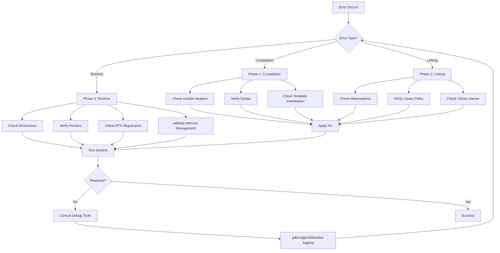

# Common Errors and Debugging

ข้อผิดพลาดที่พบบ่อยและการแก้ไข

---

## 🎯 Learning Objectives

เป้าหมายการเรียนรู้

After completing this section, you should be able to:

- **Identify** common error types across compilation, linking, and runtime phases
- **Apply** systematic debugging workflows to diagnose and resolve errors
- **Prevent** common errors through proper coding practices and validation
- **Use** debugging tools effectively (gdb, debug builds, error messages)

หลังจากเรียนส่วนนี้ คุณควรจะสามารถ:

- **ระบุ** ประเภทข้อผิดพลาดทั่วไปในแต่ละขั้นตอน (คอมไพล์/ลิงก์/รันไทม์)
- **ประยุกต์** ขั้นตอนการดีบักเพื่อวินิจฉัยและแก้ไขปัญหา
- **ป้องกัน** ข้อผิดพลาดที่พบบ่อยผ่านการเขียนโค้ดที่ถูกต้อง
- **ใช้งาน** เครื่องมือดีบักได้อย่างมีประสิทธิภาพ

---

## 📋 Prerequisites

ความรู้พื้นฐานที่ต้องมี

- Understanding of OpenFOAM compilation process (Make/files, wmake)
- Familiarity with C++ templates and Run-Time Selection (RTS) system
- Basic knowledge of OpenFOAM field types and dimension system
- Experience with basic terminal debugging (ls, grep, find)

---

## 🔄 Debugging Workflow Overview

ภาพรวมขั้นตอนการดีบัก



---

## Phase 1: Compilation Errors

ข้อผิดพลาดขั้นตอนคอมไพล์

Compilation errors occur when `wmake` cannot compile source files. These are typically **syntax errors**, **missing declarations**, or **type mismatches**.

### 🔍 Why These Errors Occurate

**Missing type declarations** - C++ compiler needs complete type definitions
**Incorrect include paths** - Headers not found in search paths
**Template instantiation failures** - Missing template parameters or specializations

---

### 1.1 Missing Type Declaration

**What:** Compiler cannot find the type definition

**Why:** Header file not included or incorrect include path

**How to Fix:**

```cpp
// ❌ ERROR
error: 'volScalarField' was not declared in this scope

// ✅ SOLUTION
#include "volFields.H"  // Add proper include
```

**Prevention Tips:**

- **Always** include required headers at the top of source files
- **Use** `.H` extension for OpenFOAM headers (not `.h`)
- **Check** similar files in `src/` for required includes
- **Verify** header exists with `find $WM_PROJECT_DIR -name volFields.H`

**Common Required Headers:**

| Type | Header |
|------|--------|
| `volScalarField`, `volVectorField` | `volFields.H` |
| `fvScalarMatrix`, `fvVectorMatrix` | `fvMatrices.H` |
| `RASmodel`, `LESmodel` | `turbulentTransportModel.H` |
| `fvc::grad`, `fvm::ddt` | `fvc.H`, `fvm.H` |

---

### 1.2 Template Instantiation Errors

**What:** Template cannot be instantiated with given types

**Why:** Missing template specialization or incorrect type arguments

**How to Fix:**

```cpp
// ❌ ERROR
error: no matching function for call to 'New'

// ✅ SOLUTION
// 1. Check if template exists in base class
// 2. Verify type is registered with RTS
// 3. Include all template specializations

// Example for turbulence models:
#include "turbulentTransportModel.H"
#include "RASmodel.H"
#include "LESmodel.H"
```

---

## Phase 2: Linking Errors

ข้อผิดพลาดขั้นตอนลิงก์

Linking errors occur after successful compilation when the linker cannot resolve **symbol references** (functions, classes, variables) across object files.

### 🔍 Why These Errors Occur

**Missing library dependencies** - Required libraries not linked
**Incorrect library names** - Typo in library name or wrong path
**Missing template instantiations** - Templates not explicitly instantiated
**Architecture mismatch** - 32-bit vs 64-bit libraries

---

### 2.1 Undefined Reference

**What:** Linker cannot find function/class implementation

**Why:** Library not linked in `Make/options` or library name incorrect

**How to Fix:**

```bash
# ❌ ERROR
undefined reference to `Foam::turbulenceModel::New'
undefined reference to `Foam::myCustomFunction'

# ✅ SOLUTION - Add to Make/options
EXE_LIBS = \
    -lturbulenceModels \
    -lincompressibleTurbulenceModels \
    -lmyCustomLibrary
```

**Prevention Tips:**

- **Always** check `Make/options` when adding new models
- **Verify** library exists: `ls $FOAM_LIBBIN/lib*turbulence*`
- **Use** correct library naming: `lib[Name].a` → `-l[Name]`
- **Order** matters: dependent libraries after dependents

**Common Libraries:**

| Feature | Library | Link Flag |
|---------|---------|-----------|
| RAS/LES Models | `libincompressibleTurbulenceModels.a` | `-lincompressibleTurbulenceModels` |
| Finite Volume | `libfiniteVolume.a` | `-lfiniteVolume` |
| Mesh Tools | `libmeshTools.a` | `-lmeshTools` |
| Sampling | `libsampling.a` | `-lsampling` |

---

### 2.2 Duplicate Symbol Errors

**What:** Multiple definitions of the same symbol

**Why:** Function defined in header file or compiled multiple times

**How to Fix:**

```cpp
// ❌ ERROR - Defined in header
// MyHeader.H
class MyClass {
public:
    void myFunction() { /* implementation */ }  // ❌ BAD
};

// ✅ SOLUTION - Separate declaration and implementation
// MyHeader.H
class MyClass {
public:
    void myFunction();  // Declaration only
};

// MyHeader.C
void MyClass::myFunction() { /* implementation */ }  // ✅ GOOD

// OR use inline keyword
class MyClass {
public:
    inline void myFunction() { /* implementation */ }  // ✅ OK for small functions
};
```

---

## Phase 3: Runtime Errors

ข้อผิดพลาดขณะรันไทม์

Runtime errors occur **during solver execution**. These are often **logic errors**, **dimensional inconsistencies**, or **memory issues**.

### 🔍 Why These Errors Occur

**Dimensional inconsistencies** - Adding incompatible physical quantities
**Null pointer access** - Dereferencing uninitialized pointers
**Missing RTS registration** - Custom model not registered properly
**Memory management errors** - Dangling references, memory leaks

---

### 3.1 Dimension Mismatch

**What:** OpenFOAM's dimensional system prevents invalid operations

**Why:** Attempting to combine quantities with **incompatible units**

**How to Fix:**

```cpp
// ❌ ERROR
--> FOAM FATAL ERROR:
    Inconsistent dimensions for +
    LHS : [0 0 -1 0 0 0 0]  (1/s - frequency)
    RHS : [0 1 -1 0 0 0 0]  (m/s - velocity)

// ✅ SOLUTION - Check dimensions
// Dimension sets: [mass length time temperature current moles luminous]

// Problem: Adding frequency to velocity
volScalarField freq("freq", dimless/dimTime);  // [0 0 -1 0 0 0 0]
volScalarField vel("vel", dimLength/dimTime);  // [0 1 -1 0 0 0 0]
volScalarField bad = freq + vel;  // ❌ ERROR

// Fix: Ensure consistent dimensions
volScalarField rate("rate", dimLength/dimTime);  // Same units
volScalarField good = vel + rate;  // ✅ OK

// Common dimension checks:
Info << "rho dimensions: " << rho.dimensions() << endl;
Info << "U dimensions: " << U.dimensions() << endl;
```

**Prevention Tips:**

- **Always** verify dimensions match before operations
- **Use** `dimensionSet()` for custom dimensions
- **Check** reference fields in similar solvers
- **Test** with `Info <<` statements before complex operations

**Common Dimension Sets:**

| Quantity | Dimension Set |
|----------|---------------|
| Pressure | `[1 -1 -2 0 0 0 0]` (kg/(m·s²)) |
| Velocity | `[0 1 -1 0 0 0 0]` (m/s) |
| Density | `[1 -3 0 0 0 0 0]` (kg/m³) |
| Kinematic Viscosity | `[0 2 -1 0 0 0 0]` (m²/s) |

---

### 3.2 Run-Time Selection (RTS) Type Not Found

**What:** Custom model type not recognized by solver

**Why:** Missing `addToRunTimeSelectionTable` macro

**How to Fix:**

```cpp
// ❌ ERROR
--> FOAM FATAL ERROR:
    Unknown turbulence model type "myKEpsilon"

// ✅ SOLUTION - Add RTS table registration

// In header file (myKEpsilon.H):
class myKEpsilon
:
    public RASModel
{
    // Constructor
    myKEpsilon
    (
        const volScalarField& rho,
        const volVectorField& U,
        const surfaceScalarField& phi,
        transportModel& transport
    );

    // ... rest of class
};

// In source file (myKEpsilon.C):
// 1. Include the base class
#include "RASmodel.H"

// 2. Define constructor
myKEpsilon::myKEpsilon(...)
:
    RASModel(rho, U, phi, transport)
{
    // ... initialization
}

// 3. ✅ CRITICAL: Add to RTS table
addToRunTimeSelectionTable
(
    RASmodel,
    myKEpsilon,
    dictionary
);

// 4. ✅ Also include in New() method if needed
```

**Prevention Tips:**

- **Always** use `addToRunTimeSelectionTable` after implementation
- **Match** base class name exactly
- **Verify** library compiles without warnings
- **Recompile** solver and library: `wclean && wmake`

---

### 3.3 Null Pointer / Segmentation Fault

**What:** Program crashes with "Segmentation fault" or accesses invalid memory

**Why:** Dereferencing null, uninitialized, or deleted pointers

**How to Fix:**

```cpp
// ❌ ERROR - Crash
autoPtr<turbulenceModel> turb = turbulenceModel::New(...);
turbulenceModel& myTurb = turb();  // Might be null if New() failed
myTurb.correct();  // ❌ SEGFAULT if turb is invalid

// ✅ SOLUTION - Always check validity
autoPtr<turbulenceModel> turb = turbulenceModel::New(...);

if (turb.valid())
{
    turbulenceModel& myTurb = turb();
    myTurb.correct();
}
else
{
    FatalErrorInFunction
        << "Failed to create turbulence model"
        << abort(FatalError);
}

// ✅ SAFER PATTERN - Use smart pointers
autoPtr<myModel> modelPtr;
if (dictionary.subDict("model").found("myModelType"))
{
    modelPtr.reset(new myModel(...));
}

if (modelPtr.valid())
{
    modelPtr->solve();
}

// ✅ CHECK BEFORE USE
if (!objectRegistry_.foundObject<volScalarField>("p"))
{
    FatalErrorInFunction
        << "Pressure field 'p' not found"
        << abort(FatalError);
}
const volScalarField& p = objectRegistry_.lookupObject<volScalarField>("p");
```

**Prevention Tips:**

- **Always** check `valid()` before dereferencing `autoPtr` or `tmp`
- **Use** smart pointers instead of raw pointers
- **Initialize** pointers to `nullptr`
- **Check** object existence in registry with `foundObject()`

---

## Phase 4: Memory Management Errors

ข้อผิดพลาดการจัดการหน่วยความจำ

### 🔍 Why These Errors Occur

**Dangling references** - Referencing temporary objects that are destroyed
**Memory leaks** - Allocated memory never freed
**Double deletion** - Same memory freed twice

---

### 4.1 Dangling Reference (Temporary Object)

**What:** Crash or corruption when accessing destroyed temporary

**Why:** OpenFOAM uses `tmp<>` for temporary objects; accessing after destruction causes errors

**How to Fix:**

```cpp
// ❌ ERROR - Dangling reference
const volVectorField& gradP = fvc::grad(p)();  // Temporary destroyed
// ... later in code
Info << gradP << endl;  // ❌ CRASH - tmp<> already destroyed

// ✅ SOLUTION 1 - Store tmp<> object
tmp<volVectorField> tgradP = fvc::grad(p);
const volVectorField& gradP = tgradP();  // Valid while tgradP exists
Info << gradP << endl;  // ✅ OK

// ✅ SOLUTION 2 - Create copy (if needed)
volVectorField gradP = fvc::grad(p)();  // Creates new field
// ... later
Info << gradP << endl;  // ✅ OK (owns data)

// ✅ SOLUTION 3 - Use in single expression
volScalarField divGradP = fvc::div(fvc::grad(p));  // ✅ Temporary valid during expression
```

**Prevention Tips:**

- **Never** store reference to `tmp<>` result without keeping `tmp<>` alive
- **Always** use `tmp<>` to manage temporaries from `fvc::` functions
- **Return** `tmp<>` from functions that create temporaries
- **Document** lifetime expectations in function comments

---

### 4.2 Memory Leaks

**What:** Memory usage grows over time

**Why:** Allocated memory never freed

**How to Fix:**

```cpp
// ❌ ERROR - Memory leak
void myFunction()
{
    volScalarField* myField = new volScalarField(...);
    // ... use myField
    // Function exits - myField leaked!
}

// ✅ SOLUTION 1 - Use smart pointers
void myFunction()
{
    autoPtr<volScalarField> myField
    (
        new volScalarField(...)
    );
    // ... use myField()
    // autoPtr deletes automatically
}

// ✅ SOLUTION 2 - Use stack allocation (preferred)
void myFunction()
{
    volScalarField myField(...);  // Stack allocation
    // ... use myField
    // Destructor called automatically
}

// ✅ SOLUTION 3 - Manual delete (not recommended)
void myFunction()
{
    volScalarField* myField = new volScalarField(...);
    // ... use myField
    delete myField;  // Must remember to delete
    myField = nullptr;
}
```

---

## 🛠️ Debugging Tools and Techniques

เทคนิคและเครื่องมือการดีบัก

### 5.1 Debug Build

**What:** Compile with debugging symbols and no optimization

**Why:** Get **detailed error messages** and enable **gdb debugging**

**How:**

```bash
# 1. Set debug compilation
export WM_COMPILE_OPTION=Debug

# 2. Clean and rebuild
wclean
wmake

# 3. Verify build
ls -lh ~/OpenFOAM/woramet-v2406/platforms/linux64GccDPpt32Debug/bin/mySolver

# Comparison:
# Debug:   ~50 MB (with symbols, no optimization)
# Release: ~5 MB  (stripped, optimized)
```

**Benefits:**

| Debug Build | Release Build |
|-------------|---------------|
| Full error messages | Minimal error messages |
| Works with gdb | Limited gdb support |
| No optimization (-O0) | Full optimization (-O3) |
| Slow execution | Fast execution |

---

### 5.2 Using GDB

**What:** GNU Debugger for step-by-step execution

**Why:** Inspect variables, set breakpoints, trace crashes

**How:**

```bash
# 1. Compile debug build
export WM_COMPILE_OPTION=Debug && wclean && wmake

# 2. Run with gdb
gdb --args mySolver -case myTestCase

# 3. Common GDB commands
(gdb) run                    # Start program
(gdb) bt                     # Backtrace after crash
(gdb) frame 3                # Inspect stack frame 3
(gdb) print variableName     # Print variable value
(gdb) print object.dimensions()  # Call method
(gdb) break main::solve      # Set breakpoint
(gdb) continue               # Continue to breakpoint
(gdb) step                   # Execute next line
(gdb) quit                   # Exit gdb

# 4. Batch mode (scriptable)
gdb -batch -ex "run" -ex "bt" --args mySolver -case myCase
```

**Common GDB Workflows:**

```bash
# 🐛 Trace segmentation fault
$ gdb --args mySolver -case myCase
(gdb) run
# Program crashes
(gdb) bt  # See where crash occurred
#0  0x... in myFunction at file.C:45
#1  0x... in solve at solve.C:123
(gdb) frame 0
(gdb) print this->pointerName  # Check null pointer

# 🐛 Break at suspicious code
$ gdb --args mySolver -case myCase
(gdb) break myCustomModel.C:156
(gdb) run
# ... stops at line 156
(gdb) print fieldValue
(gdb) continue
```

---

### 5.3 Enabling Additional Logging

**What:** Add debug output to track execution

**Why:** Understand **program flow** and locate errors

**How:**

```cpp
// ✅ STRATEGIC LOGGING
Info<< "=== Starting time step ===" << endl;
Info<< "Time = " << runTime.timeName() << endl;
Info<< "Courant number max: " << max(CourantNo).value() << endl;

// ✅ CONDITIONAL LOGGING
if (debug)
{
    Info<< "Debug: myTurbulenceModel::correct() called" << endl;
    Info<< "  k field min/max: " << min(k).value() << " / " << max(k).value() << endl;
}

// ✅ ERROR CONTEXT
if (!myPtr.valid())
{
    FatalErrorInFunction
        << "Null pointer detected in " << functionName
        << " at line " << __LINE__
        << abort(FatalError);
}

// ✅ PROGRESS TRACKING
for (int i=0; i<maxIter; i++)
{
    Info<< "Iteration " << i << "/" << maxIter << endl;
    // ... solve
    if (converged)
    {
        Info<< "Converged at iteration " << i << endl;
        break;
    }
}
```

---

## 📊 Quick Troubleshooting Reference

ตารางอ้างอิงการแก้ปัญหาเบื้องต้น

| Error Phase | Error Message | Common Cause | Quick Fix |
|-------------|---------------|--------------|-----------|
| **Compilation** | `'X' was not declared` | Missing header | Add `#include "X.H"` |
| **Compilation** | `no matching function` | Wrong template args | Check function signature |
| **Linking** | `undefined reference to 'Y'` | Missing library | Add `-lY` to Make/options |
| **Linking** | `multiple definition` | Duplicate symbol | Use `inline` or move to .C |
| **Runtime** | `Inconsistent dimensions` | Physics error | Check units with `.dimensions()` |
| **Runtime** | `Unknown model type "Z"` | Missing RTS | Add `addToRunTimeSelectionTable` |
| **Runtime** | `Segmentation fault` | Null pointer | Check `valid()` before use |
| **Runtime** | `Cannot find file "file"` | Wrong path | Check case directory structure |

---

## 🔧 Prevention Best Practices

แนวทางปฏิบัติเพื่อป้องกันข้อผิดพลาด

### Compilation Phase Prevention

1. **Always include all required headers** at file start
2. **Use forward declarations** where possible to reduce dependencies
3. **Check similar OpenFOAM code** for required includes
4. **Compile frequently** to catch errors early

### Linking Phase Prevention

1. **Maintain organized Make/options** with comments
2. **List dependent libraries** after their dependencies
3. **Verify library exists** in `$FOAM_LIBBIN` before linking
4. **Use correct naming**: `libmyLib.a` → `-lmyLib`

### Runtime Phase Prevention

1. **Always check pointer validity** with `valid()` or `!= nullptr`
2. **Verify dimensions** before combining quantities
3. **Use RTS macros** for all custom models
4. **Initialize all variables** before use
5. **Check object existence** in registry with `foundObject()`

### Memory Management Prevention

1. **Prefer stack allocation** over heap allocation
2. **Use smart pointers** (`autoPtr`, `tmp`, `refPtr`)
3. **Never store references to temporaries** without extending lifetime
4. **Follow RAII principles** - acquire resources in constructors

---

## 🎯 Key Takeaways

สรุปสิ่งสำคัญ

- **Organize errors by phase**: Compilation → Linking → Runtime → Memory
- **Debug systematically**: Use workflow diagram, not trial-and-error
- **Prevent over fix**: Follow best practices to avoid common errors
- **Use tools wisely**: Debug builds + gdb + strategic logging
- **Check validity first**: Always verify pointers, dimensions, and objects before use

**การจัดระเบียบข้อผิดพลาดตามขั้นตอน**: คอมไพล์ → ลิงก์ → รันไทม์ → หน่วยความจำ

**ดีบักอย่างเป็นระบบ**: ใช้ผังงาน ไม่ใช่การทดลองผิดลองถูก

**ป้องกันมากกว่ารักษา**: ทำตามแนวทางปฏิบัติเพื่อหลีกเลี่ยงข้อผิดพลาด

**ใช้เครื่องมืออย่างเหมาะสม**: Debug build + gdb + logging อย่างมีกลยุทธ์

---

## 🧠 Concept Check

ทบทวนความเข้าใจ

<details>
<summary><b>1. How do you fix "undefined reference" errors?</b></summary>
<br>

**Add library link** in `Make/options`: `-lLibName`

**การแก้ไข:**
```bash
# Make/options
EXE_LIBS = -lturbulenceModels -lfiniteVolume
```

**Checklist:**
- ✅ Library exists in `$FOAM_LIBBIN`
- ✅ Library name correct (no "lib" prefix, no extension)
- ✅ Spelling matches exactly
- ✅ Dependent libraries listed after

</details>

<details>
<summary><b>2. What causes dimension mismatch errors?</b></summary>
<br>

**Physics error** — combining quantities with incompatible units

**ตัวอย่าง:**
```cpp
// ❌ ERROR: Cannot add velocity (m/s) and frequency (1/s)
volScalarField result = velocityField + frequencyField;

// ✅ FIX: Ensure compatible dimensions
volScalarField result = velocityField + anotherVelocityField;
```

**Common dimension sets:**
- Pressure: `[1 -1 -2 0 0 0 0]` (kg/(m·s²))
- Velocity: `[0 1 -1 0 0 0 0]` (m/s)
- Density: `[1 -3 0 0 0 0 0]` (kg/m³)

</details>

<details>
<summary><b>3. Why use debug builds?</b></summary>
<br>

**Benefits:**

1. **Better error messages** — Full stack traces, detailed info
2. **GDB compatibility** — Step-through debugging, variable inspection
3. **No optimization** — Code executes as written, easier to reason about

**Usage:**
```bash
export WM_COMPILE_OPTION=Debug
wclean && wmake
```

**Trade-offs:**
- ✅ Better debugging experience
- ❌ Slower execution (~10x)
- ❌ Larger binaries (~10x)

</details>

<details>
<summary><b>4. How do you prevent dangling references?</b></summary>
<br>

**Store `tmp<>` object** instead of just reference

**❌ WRONG:**
```cpp
const volVectorField& gradP = fvc::grad(p)();  // Temporary destroyed
```

**✅ CORRECT:**
```cpp
tmp<volVectorField> tgradP = fvc::grad(p);
const volVectorField& gradP = tgradP();  // Valid while tgradP exists
```

**OR** create owning copy:
```cpp
volVectorField gradP = fvc::grad(p)();  // Owns data
```

</details>

---

## 📖 Related Documentation

เอกสารที่เกี่ยวข้อง

### Within This Module

- **Overview:** [00_Overview.md](00_Overview.md) - Module structure and goals
- **Project Overview:** [01_Project_Overview.md](01_Project_Overview.md) - MyThermFoam design
- **Compilation:** [04_Compilation_process.md](04_Compilation_process.md) - Build system details
- **Inheritance:** [05_Inheritance_and_Virtual_Functions.md](05_Inheritance_and_Virtual_Functions.md) - Virtual functions in debugging
- **Design Patterns:** [06_Design_Pattern_Rationale.md](06_Design_Pattern_Rationale.md) - Factory pattern errors

### Cross-Module References

- **Template Programming:** [01_Template_Programming/06_Common_Errors_and_Debugging.md](../../01_TEMPLATE_PROGRAMMING/06_Common_Errors_and_Debugging.md) — Template-specific errors
- **Inheritance & Polymorphism:** [02_INHERITANCE_POLYMORPHISM/06_Common_Errors_and_Debugging.md](../../02_INHERITANCE_POLYMORPHISM/06_Common_Errors_and_Debugging.md) — Virtual function errors
- **Memory Management:** [04_MEMORY_MANAGEMENT/07_Common_Errors_and_Debugging.md](../../04_MEMORY_MANAGEMENT/07_Common_Errors_and_Debugging.md) — Advanced memory debugging

### External Resources

- **OpenFOAM Programmer's Guide:** Chapter 6 - Debugging
- **GDB Documentation:** https://www.gnu.org/software/gdb/documentation/
- **Valgrind Manual:** https://valgrind.org/docs/manual/ (memory leak detection)

---

**Next:** [08_Putting_It_All_Together.md](08_Putting_It_All_Together.md) - Integration exercise