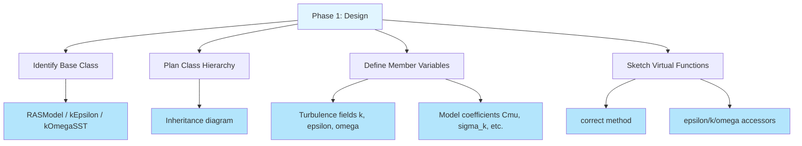
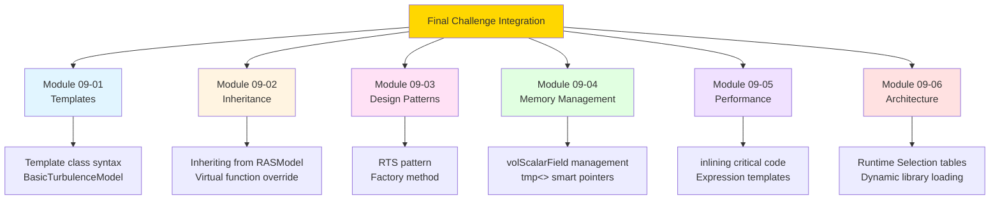

# Final Challenge: Build a Complete OpenFOAM Model

โจทย์ท้าทายสุดท้าย: สร้างโมเดล OpenFOAM ที่สมบูรณ์

---

## 📚 Learning Objectives

**Learning Objectives (เป้าหมายการเรียนรู้):**

Upon completing this final challenge, you will be able to:

- **Integrate all concepts** from this module into a single, working project
- **Build a complete turbulence model** from design to deployment
- **Apply the 3W framework** (What/Why/How) to technical problem-solving
- **Debug and validate** your implementation systematically
- **Document your work** following professional standards

---

## 🎯 Key Takeaways

**Key Takeaways (สิ่งสำคัญที่ต้องจำ):**

✓ **Complete Integration:** This challenge combines **ALL previous topics** — templates, inheritance, design patterns, memory management, and RTS

✓ **Real Development:** You'll experience the full development lifecycle: **Design → Code → Build → Test → Debug**

✓ **Production-Ready Code:** Following OpenFOAM standards ensures your model is maintainable and extensible

✓ **Systematic Debugging:** Learning to troubleshoot compilation, runtime, and logical errors systematically

---

## 📋 Prerequisites

**Prerequisites (ความรู้พื้นฐานที่ต้องมี):**

Before attempting this challenge, ensure you have completed:

- **Files 01-07** in this module (especially file 07 on debugging)
- Understanding of **inheritance and virtual functions** (Module 09-02)
- Knowledge of **Runtime Selection system** (Module 09-06)
- Familiarity with **wmake build system** (Module 04)
- **C++ proficiency** including templates and memory management

**Required Skills Check:**
- [ ] I can create a class hierarchy with inheritance
- [ ] I understand virtual function overriding
- [ ] I can configure Make/files and Make/options
- [ ] I know how to use the RTS macros (TypeName, addToRunTimeSelectionTable)
- [ ] I can debug compilation errors

---

## 🌟 Challenge Overview

### The What (สิ่งที่จะสร้าง)

You will build a **complete, working turbulence model** for OpenFOAM that:

- Compiles successfully with `wmake`
- Integrates with the Runtime Selection system
- Implements proper inheritance from base classes
- Works in a real test case
- Follows OpenFOAM coding standards

### The Why (ทำสำคัญอย่างไร)

**Professional Development:**
- Real OpenFOAM development requires creating custom models, not just using existing ones
- This challenge simulates **actual industry work** — extending CFD capabilities
- Demonstrates **mastery of OpenFOAM architecture** and C++ integration

**Skill Synthesis:**
- Combines templates, inheritance, design patterns, RTS, and memory management
- Creates a **portfolio-worthy project** showcasing your abilities
- Bridges the gap from **OpenFOAM user** to **OpenFOAM developer**

### The How (จะทำอย่างไร)

**Structured Approach:**
1. **Design First** — Plan class hierarchy before coding
2. **Implement Incrementally** — Build and test step-by-step
3. **Follow Standards** — Use OpenFOAM conventions
4. **Test Thoroughly** — Validate with real cases
5. **Debug Systematically** — Use structured troubleshooting

---

## 📊 Challenge Specification

### Project Goal

**Objective (วัตถุประสงค์):**

สร้าง turbulence model ที่:
- Inherits from `eddyViscosity<RASModel<EddyDiffusivity<fluidThermophysicalModel>>>>`
- Implements transport equations for turbulence quantities (k, epsilon, omega, etc.)
- Registers with Runtime Selection system
- Compiles without errors or warnings
- Produces physically plausible results in test cases

### Success Metrics

```mermaid
flowchart TD
    A[Challenge Success Criteria] --> B[Compilation]
    A --> C[RTS Integration]
    A --> D[Functionality]
    A --> E[Validation]
    A --> F[Documentation]
    
    B --> B1[wmake completes]
    B --> B2[No linking errors]
    B --> B3[No warnings]
    
    C --> C1[TypeName registered]
    C --> C2[Dictionary selection works]
    C --> C3[Polymorphic instantiation]
    
    D --> D1[correct() executes]
    D --> D2[Fields update properly]
    D --> D3[Boundary conditions apply]
    
    E --> E1[Test case runs]
    E --> E2[Results converge]
    E --> E3[Physically plausible]
    
    F --> F1[Code documented]
    F --> F2[README included]
    F --> F3[Usage examples provided]
    
    style B fill:#e1f5ff
    style C fill:#fff4e1
    style D fill:#ffe1f5
    style E fill:#e1ffe1
    style F fill:#f0e1ff
```

---

## 🏗️ Implementation Roadmap

### Phase 1: Design & Planning (Milestone 1)

**Duration:** 1-2 hours | **Deliverable:** Class design document



**Milestone 1 Checklist:**
- [ ] Base class identified (e.g., `kEpsilon`)
- [ ] UML/class diagram created
- [ ] Member variables listed (k, epsilon, coefficients)
- [ ] Virtual functions to override identified
- [ ] Transport equations planned

---

### Phase 2: Header File Structure (Milestone 2)

**Duration:** 1-2 hours | **Deliverable:** Complete `.H` file

**File Structure:**
```cpp
#ifndef myTurbulenceModel_H
#define myTurbulenceModel_H

#include "RASModel.H"
#include "eddyViscosity.H"

// * * * * * * * * * * * * * * * * * * * * * * * * * * * * * * * * * * * * * //

namespace Foam
{

/*---------------------------------------------------------------------------*\
               Class myTurbulenceModel Declaration
\*---------------------------------------------------------------------------*/

template<class BasicTurbulenceModel>
class myTurbulenceModel
:
    public eddyViscosity<RASModel<BasicTurbulenceModel>>
{
    // Private Member Functions
        
        //- Disallow default bitwise copy construct
        myTurbulenceModel(const myTurbulenceModel&);
        
        //- Disallow default bitwise assignment
        void operator=(const myTurbulenceModel&);


protected:

    // Protected data
        
        //- Turbulent kinetic energy field
        volScalarField k_;
        
        //- Turbulent dissipation rate field
        volScalarField epsilon_;
        
        //- Model coefficients
        dimensionedScalar Cmu_;
        dimensionedScalar C1_;
        dimensionedScalar C2_;
        dimensionedScalar sigmaEpsilon_;
        dimensionedScalar sigmaK_;


    // Protected Member Functions
        
        //- Return the effective viscosity
        virtual tmp<volScalarField> nuEff() const
        {
            return tmp<volScalarField>
            (
                new volScalarField
                (
                    IOobject
                    (
                        this->groupName("nuEff"),
                        this->runTime_.timeName(),
                        this->mesh_,
                        IOobject::NO_READ,
                        IOobject::NO_WRITE
                    ),
                    this->nut_ + this->nu()
                )
            );
        }


public:

    //- Runtime type information
    TypeName("myTurbulenceModel");
    
    //- Declare runtime construction
    declareRunTimeSelectionTable
    (
        myTurbulenceModel,
        BasicTurbulenceModel,
        dictionary,
        (
            const alphaField& alpha,
            const rhoField& rho,
            const volVectorField& U,
            const surfaceScalarField& alphaRhoPhi,
            const surfaceScalarField& phi,
            const transportModel& transport,
            const word& propertiesName
        ),
        (alpha, rho, U, alphaRhoPhi, phi, transport, propertiesName)
    );


    // Constructors

        //- Construct from components
        myTurbulenceModel
        (
            const alphaField& alpha,
            const rhoField& rho,
            const volVectorField& U,
            const surfaceScalarField& alphaRhoPhi,
            const surfaceScalarField& phi,
            const transportModel& transport,
            const word& propertiesName
        );


    //- Destructor
    virtual ~myTurbulenceModel()
    {}


    // Member Functions

        //- Read model coefficients
        virtual bool read();
        
        //- Return the turbulent kinetic energy
        virtual tmp<volScalarField> k() const;
        
        //- Return the turbulent dissipation rate
        virtual tmp<volScalarField> epsilon() const;
        
        //- Return the effective diffusivity for k
        tmp<volScalarField> DkEff() const;
        
        //- Return the effective diffusivity for epsilon
        tmp<volScalarField> DepsilonEff() const;
        
        //- Solve the turbulence equations and correct the turbulence viscosity
        virtual void correct();
};


// * * * * * * * * * * * * * * * * * * * * * * * * * * * * * * * * * * * * * //

} // End namespace Foam

// * * * * * * * * * * * * * * * * * * * * * * * * * * * * * * * * * * * * * //

#endif

// ************************************************************************* //
```

**Milestone 2 Checklist:**
- [ ] Header guards (`#ifndef`/`#define`/`#endif`)
- [ ] All necessary includes added
- [ ] Class declaration with proper inheritance
- [ ] Private copy constructor and assignment operator (disabled)
- [ ] Protected member variables declared (fields, coefficients)
- [ ] Public constructor declared
- [ ] Virtual destructor declared
- [ ] TypeName macro included
- [ ] `declareRunTimeSelectionTable` macro included
- [ ] All required virtual functions declared (`k()`, `epsilon()`, `correct()`)
- [ ] Accessor methods declared (`DkEff()`, `DepsilonEff()`)

---

### Phase 3: Implementation File (Milestone 3)

**Duration:** 2-3 hours | **Deliverable:** Complete `.C` file

**File Structure:**
```cpp
#include "myTurbulenceModel.H"

// * * * * * * * * * * * * * * * * * * * * * * * * * * * * * * * * * * * * * //

namespace Foam
{

// * * * * * * * * * * * * * * Static Data Members * * * * * * * * * * * * * //

defineTypeNameAndDebug(myTurbulenceModel, 0);

addToRunTimeSelectionTable
(
    RASModel,
    myTurbulenceModel,
    dictionary
);


// * * * * * * * * * * * * * Private Member Functions  * * * * * * * * * * * * //


// * * * * * * * * * * * * * * * * Constructors  * * * * * * * * * * * * * * //

template<class BasicTurbulenceModel>
myTurbulenceModel<BasicTurbulenceModel>::myTurbulenceModel
(
    const alphaField& alpha,
    const rhoField& rho,
    const volVectorField& U,
    const surfaceScalarField& alphaRhoPhi,
    const surfaceScalarField& phi,
    const transportModel& transport,
    const word& propertiesName
)
:
    eddyViscosity<RASModel<BasicTurbulenceModel>>
    (
        alpha,
        rho,
        U,
        alphaRhoPhi,
        phi,
        transport,
        propertiesName
    ),
    
    k_
    (
        IOobject
        (
            IOobject::groupName("k", alpha.group()),
            this->runTime_.timeName(),
            this->mesh_,
            IOobject::MUST_READ,
            IOobject::AUTO_WRITE
        ),
        this->mesh_
    ),
    
    epsilon_
    (
        IOobject
        (
            IOobject::groupName("epsilon", alpha.group()),
            this->runTime_.timeName(),
            this->mesh_,
            IOobject::MUST_READ,
            IOobject::AUTO_WRITE
        ),
        this->mesh_
    ),
    
    Cmu_(dimensioned<scalar>::lookupOrAddToDict("Cmu", this->coeffDict_, 0.09)),
    C1_(dimensioned<scalar>::lookupOrAddToDict("C1", this->coeffDict_, 1.44)),
    C2_(dimensioned<scalar>::lookupOrAddToDict("C2", this->coeffDict_, 1.92)),
    sigmaEpsilon_(dimensioned<scalar>::lookupOrAddToDict("sigmaEpsilon", this->coeffDict_, 1.11)),
    sigmaK_(dimensioned<scalar>::lookupOrAddToDict("sigmaK", this->coeffDict_, 1.0))
{
    bound(k_, this->kMin_);
    bound(epsilon_, this->epsilonMin_);
    
    if (this->printCoeffs_)
    {
        Info << "myTurbulenceModel coefficients:" << nl
             << "    Cmu: " << Cmu_ << nl
             << "    C1: " << C1_ << nl
             << "    C2: " << C2_ << nl
             << "    sigmaEpsilon: " << sigmaEpsilon_ << nl
             << "    sigmaK: " << sigmaK_ << endl;
    }
}


// * * * * * * * * * * * * * * * * Destructor  * * * * * * * * * * * * * * * //

template<class BasicTurbulenceModel>
myTurbulenceModel<BasicTurbulenceModel>::~myTurbulenceModel()
{}


// * * * * * * * * * * * * * * Member Functions  * * * * * * * * * * * * * * //

template<class BasicTurbulenceModel>
bool myTurbulenceModel<BasicTurbulenceModel>::read()
{
    if (eddyViscosity<RASModel<BasicTurbulenceModel>>::read())
    {
        Cmu_.readIfPresent(this->coeffDict());
        C1_.readIfPresent(this->coeffDict());
        C2_.readIfPresent(this->coeffDict());
        sigmaEpsilon_.readIfPresent(this->coeffDict());
        sigmaK_.readIfPresent(this->coeffDict());
        
        return true;
    }
    else
    {
        return false;
    }
}


template<class BasicTurbulenceModel>
tmp<volScalarField> myTurbulenceModel<BasicTurbulenceModel>::k() const
{
    return k_;
}


template<class BasicTurbulenceModel>
tmp<volScalarField> myTurbulenceModel<BasicTurbulenceModel>::epsilon() const
{
    return epsilon_;
}


template<class BasicTurbulenceModel>
tmp<volScalarField> myTurbulenceModel<BasicTurbulenceModel>::DkEff() const
{
    return tmp<volScalarField>
    (
        new volScalarField
        (
            this->groupName("DkEff"),
            this->nut_/sigmaK_ + this->nu()
        )
    );
}


template<class BasicTurbulenceModel>
tmp<volScalarField> myTurbulenceModel<BasicTurbulenceModel>::DepsilonEff() const
{
    return tmp<volScalarField>
    (
        new volScalarField
        (
            this->groupName("DepsilonEff"),
            this->nut_/sigmaEpsilon_ + this->nu()
        )
    );
}


template<class BasicTurbulenceModel>
void myTurbulenceModel<BasicTurbulenceModel>::correct()
{
    if (!this->turbulence_)
    {
        return;
    }

    // Local references
    const alphaField& alpha = this->alpha_;
    const rhoField& rho = this->rho_;
    const surfaceScalarField& alphaRhoPhi = this->alphaRhoPhi_;
    const volVectorField& U = this->U_;
    volScalarField& nut = this->nut_;

    // Cannot correct nut with a zero viscosity field
    if (mag(nut).value() > small)
    {
        nut = Cmu_*sqr(k_)/epsilon_;
        nut.correctBoundaryConditions();
    }

    // Transport equations
    tmp<volTensorField> tgradU = fvc::grad(U);
    volScalarField G(Gname(), nut*2*mag(symm(tgradU())));

    // Dissipation equation
    tmp<fvScalarMatrix> epsilonEqn
    (
        fvm::ddt(alpha, rho, epsilon_)
      + fvm::div(alphaRhoPhi, epsilon_)
      - fvm::laplacian(alpha*rho*DepsilonEff(), epsilon_)
     ==
        C1_*alpha*rho*G*epsilon_/k_
      - fvm::Sp(C2_*alpha*rho*epsilon_/k_, epsilon_)
    );

    epsilonEqn.relax();
    epsilonEqn.solve();

    bound(epsilon_, this->epsilonMin_);

    // Turbulent kinetic energy equation
    tmp<fvScalarMatrix> kEqn
    (
        fvm::ddt(alpha, rho, k_)
      + fvm::div(alphaRhoPhi, k_)
      - fvm::laplacian(alpha*rho*DkEff(), k_)
     ==
        alpha*rho*G
      - fvm::Sp(alpha*rho*epsilon_/k_, k_)
    );

    kEqn.relax();
    kEqn.solve();

    bound(k_, this->kMin_);

    // Re-calculate nut
    nut = Cmu_*sqr(k_)/epsilon_;
    nut.correctBoundaryConditions();
}


// * * * * * * * * * * * * * * * * * * * * * * * * * * * * * * * * * * * * * //

} // End namespace Foam

// ************************************************************************* //
```

**Milestone 3 Checklist:**
- [ ] All necessary includes
- [ ] `defineTypeNameAndDebug` macro
- [ ] `addToRunTimeSelectionTable` macro
- [ ] Constructor with member initializer list
- [ ] `read()` method implemented
- [ ] `k()` accessor implemented
- [ ] `epsilon()` accessor implemented
- [ ] `DkEff()` and `DepsilonEff()` implemented
- [ ] `correct()` method with full transport equations
- [ ] Field bounding applied (kMin_, epsilonMin_)
- [ ] Boundary conditions handled correctly

---

### Phase 4: Build System (Milestone 4)

**Duration:** 30 minutes | **Deliverable:** Compiled library

**Directory Structure:**
```
myTurbulenceModel/
├── Make/
│   ├── files
│   └── options
├── myTurbulenceModel.H
└── myTurbulenceModel.C
```

**Make/files:**
```bash
myTurbulenceModel.C

LIB = $(FOAM_USER_LIBBIN)/libmyTurbulenceModel
```

**Make/options:**
```bash
EXE_INC = \
    -I$(LIB_SRC)/turbulenceModels \
    -I$(LIB_SRC)/turbulenceModels/incompressible/turbulenceModel \
    -I$(LIB_SRC)/transportModels \
    -I$(LIB_SRC)/transportModels/incompressible/singlePhaseTransportModel \
    -I$(LIB_SRC)/finiteVolume/lnInclude \
    -I$(LIB_SRC)/meshTools/lnInclude

LIB_LIBS = \
    -lincompressibleTurbulenceModel \
    -lincompressibleTransportModels \
    -lfiniteVolume \
    -lmeshTools
```

**Compilation Commands:**
```bash
# Clean previous build
wclean

# Compile the library
wmake

# Expected output:
# Creating shared library '.../platforms/linux64GccDPInt32Opt/lib/libmyTurbulenceModel.so'
```

**Milestone 4 Checklist:**
- [ ] Make/files configured with source file
- [ ] Make/options configured with includes
- [ ] Make/options configured with library links
- [ ] `wclean` executes without errors
- [ ] `wmake` completes successfully
- [ ] Shared library (.so) file created
- [ ] No compilation warnings

---

### Phase 5: Testing & Validation (Milestone 5)

**Duration:** 1-2 hours | **Deliverable:** Working test case

**Test Case Setup:**
```
testCase/
├── 0/
│   ├── p
│   ├── U
│   ├── k
│   └── epsilon
├── constant/
│   ├── polyMesh/
│   └── transportProperties
├── system/
│   ├── controlDict
│   ├── fvSchemes
│   └── fvSolution
└── Allrun
```

**constant/turbulenceProperties:**
```cpp
simulationType RAS;

RAS
{
    RASModel        myTurbulenceModel;

    turbulence      on;

    printCoeffs     on;

    myTurbulenceModelCoeffs
    {
        Cmu             Cmu [0 0 0 0 0 0 0] 0.09;
        C1              C1 [0 0 0 0 0 0 0] 1.44;
        C2              C2 [0 0 0 0 0 0 0] 1.92;
        sigmaEpsilon    sigmaEpsilon [0 0 0 0 0 0 0] 1.11;
        sigmaK          sigmaK [0 0 0 0 0 0 0] 1.0;
    }
}
```

**Validation Steps:**
```bash
# 1. Check mesh
checkMesh

# 2. Run solver
simpleFoam -case . 2>&1 | tee log.simpleFoam

# 3. Check convergence
grep "convergence" log.simpleFoam

# 4. Verify results
paraFoam

# 5. Check field values
foamListTimes
foamDataToFluent
```

**Milestone 5 Checklist:**
- [ ] Test case directory structure created
- [ ] Initial conditions (0/) set with k and epsilon
- [ ] turbulenceProperties dictionary configured
- [ ] Mesh quality verified with `checkMesh`
- [ ] Solver runs without crashing
- [ ] Solution converges (residuals drop)
- [ ] Results are physically plausible
- [ ] k and epsilon fields evolve correctly
- [ ] nut field calculated properly
- [ ] ParaView visualization shows expected behavior

---

## 📋 Evaluation Criteria

### Success Metrics Table

| Category | Metric | Success Criteria | Weight | Status |
|----------|--------|------------------|--------|--------|
| **Design** | Class diagram | Clear inheritance hierarchy shown | 10% | ⬜ |
| **Design** | Member variables | All fields and coefficients planned | 10% | ⬜ |
| **Code** | Header file | Complete, compiles without warnings | 15% | ⬜ |
| **Code** | Implementation | All methods implemented correctly | 20% | ⬜ |
| **Build** | Compilation | wmake completes, .so created | 15% | ⬜ |
| **RTS** | Registration | TypeName and RTS macros correct | 10% | ⬜ |
| **Test** | Test case | Runs to completion, converges | 10% | ⬜ |
| **Validation** | Results | Physically plausible output | 10% | ⬜ |

**Total Score:** ___ / 100%

### Grading Rubric

| Grade | Score Range | Requirements |
|-------|------------|--------------|
| **A (Excellent)** | 90-100% | All milestones complete, well-documented, production-ready code |
| **B (Good)** | 80-89% | All milestones complete, minor documentation issues |
| **C (Satisfactory)** | 70-79% | Core functionality working, some milestones incomplete |
| **D (Needs Work)** | 60-69% | Model compiles but test case incomplete |
| **F (Incomplete)** | < 60% | Model does not compile or major components missing |

---

## 💡 Hints for Common Challenges

<details>
<summary><b>🔧 Hint 1: Compilation errors with "undefined reference"</b></summary>

**Problem:** Linking errors during `wmake`

**Solution:**
1. Check `Make/options` for correct library links
2. Ensure base class libraries are included (`-lincompressibleTurbulenceModel`)
3. Verify template instantiations are correct
4. Check for missing `#include` statements in header file

**Common missing libraries:**
```bash
LIB_LIBS = \
    -lincompressibleTurbulenceModel \
    -lincompressibleTransportModels \
    -lfiniteVolume \
    -lmeshTools
```
</details>

<details>
<summary><b>🔧 Hint 2: Runtime Selection not working</b></summary>

**Problem:** Solver reports "Unknown turbulence model type"

**Solution:**
1. Verify `TypeName("myTurbulenceModel")` matches dictionary entry exactly
2. Check `addToRunTimeSelectionTable` uses correct base class
3. Ensure library is in `FOAM_USER_LIBBIN` path
4. Re-run `wmake` to ensure latest version is compiled
5. Check `libso` is created (shared library, not static)

**Debug steps:**
```bash
# Check if library exists
ls $FOAM_USER_LIBBIN/libmyTurbulenceModel.so

# Verify library symbols
nm $FOAM_USER_LIBBIN/libmyTurbulenceModel.so | grep myTurbulenceModel
```
</details>

<details>
<summary><b>🔧 Hint 3: correct() method crashes</b></summary>

**Problem:** Simulation crashes during turbulence correction

**Solution:**
1. Add `Info` statements to trace execution
2. Check field references (`k_`, `epsilon_`) are initialized
3. Verify boundary conditions exist in 0/ directory
4. Add field bounding before transport equations
5. Check for division by zero (k_, epsilon_ near zero)

**Debug pattern:**
```cpp
void myTurbulenceModel::correct()
{
    Info << "Entering correct()" << endl;
    
    if (!this->turbulence_)
    {
        Info << "Turbulence disabled, returning" << endl;
        return;
    }
    
    Info << "k bounds: " << min(k_).value() << " to " << max(k_).value() << endl;
    Info << "epsilon bounds: " << min(epsilon_).value() << " to " << max(epsilon_).value() << endl;
    
    // ... rest of implementation
}
```
</details>

<details>
<summary><b>🔧 Hint 4: Fields not writing to disk</b></summary>

**Problem:** k and epsilon fields not saved in time directories

**Solution:**
1. Check `IOobject::AUTO_WRITE` is set in field constructors
2. Verify `runTime.write()` is called in solver
3. Check `writeInterval` in `controlDict`
4. Ensure fields are registered with mesh database

**Correct pattern:**
```cpp
k_
(
    IOobject
    (
        IOobject::groupName("k", alpha.group()),
        this->runTime_.timeName(),
        this->mesh_,
        IOobject::MUST_READ,   // Read from file
        IOobject::AUTO_WRITE   // Automatically write
    ),
    this->mesh_
);
```
</details>

<etails>
<summary><b>🔧 Hint 5: Template instantiation errors</b></summary>

**Problem:** Template-related compilation errors

**Solution:**
1. Ensure all template code is in `.H` file (not `.C`) OR use explicit instantiation
2. Check template parameter matches base class exactly
3. Verify `typename` keyword used for dependent types
4. Use `this->` prefix for base class members

**Common mistake:**
```cpp
// Wrong - template code in .C file
template<class T>
void myTurbulenceModel<T>::correct()
{
    // Implementation
}

// Correct - keep in header OR use explicit instantiation in .C
```
</details>

---

## 📚 Sample Solution Structure

### Reference Implementation Overview

**Model Choice:** Modified k-epsilon turbulence model

**Key Features:**
- Inherits from `eddyViscosity<RASModel<BasicTurbulenceModel>>`
- Implements standard k-epsilon transport equations
- Adds customizable model coefficients
- Includes field bounding for numerical stability

**File Summary:**

| File | Lines | Purpose |
|------|-------|---------|
| `myTurbulenceModel.H` | ~150 | Class declaration, virtual functions |
| `myTurbulenceModel.C` | ~200 | Implementation, transport equations |
| `Make/files` | 3 | Build configuration |
| `Make/options` | 10 | Dependencies and includes |
| `testCase/` | ~50 | Validation case setup |

**Critical Implementation Details:**

1. **Constructor:** Initializes k and epsilon fields from file or computes default values
2. **read() method:** Allows runtime modification of coefficients
3. **correct() method:** Solves transport equations sequentially
4. **Bounding:** Prevents negative k and epsilon values

---

## 🔄 Putting It All Together

### Integration Checklist

This challenge connects concepts from ALL previous modules:



**What You're Demonstrating:**

✅ **Template Programming** (Module 09-01)
- Using template parameters for generic turbulence models
- Template instantiation with specific physics types

✅ **Inheritance & Polymorphism** (Module 09-02)
- Extending `RASModel` base class
- Overriding virtual functions (`correct()`, `k()`, `epsilon()`)
- Runtime polymorphism through base class pointers

✅ **Design Patterns** (Module 09-03)
- **Factory Pattern:** Runtime Selection system
- **Strategy Pattern:** Pluggable turbulence models
- **Template Method Pattern:** `correct()` algorithm structure

✅ **Memory Management** (Module 09-04)
- Using `tmp<volScalarField>` for automatic memory management
- Proper field lifecycle management
- Smart pointer usage for temporary fields

✅ **Performance** (Module 09-05)
- Efficient field operations
- Inlining critical methods
- Minimizing temporary object creation

✅ **Architecture & Extensibility** (Module 09-06)
- Runtime Selection integration
- Dynamic library loading
- Plugin-style model architecture

---

## 🧠 Concept Check

<details>
<summary><b>1. Minimum requirements คืออะไร?</b></summary>

**What are the absolute minimum requirements for a working turbulence model?**

A complete turbulence model MUST have:

1. **Header file (.H)** with:
   - Class declaration inheriting from RASModel or LESModel
   - TypeName macro
   - declareRunTimeSelectionTable macro
   - Constructor declaration
   - Virtual destructor
   - Virtual `correct()` method
   - Accessor methods (k, epsilon, omega, nut)

2. **Source file (.C)** with:
   - defineTypeNameAndDebug macro
   - addToRunTimeSelectionTable macro
   - Constructor implementation
   - Virtual method implementations
   - Transport equations in `correct()`

3. **Build system (Make/)**:
   - files: Lists source files
   - options: Specifies includes and libraries

4. **Runtime Selection**:
   - Proper RTS macros for dictionary-based instantiation

**Without ALL four components, the model will not work.**
</details>

<details>
<summary><b>2. ทดสอบอย่างไร?</b></summary>

**How do you properly test a turbulence model?**

Testing follows a systematic approach:

**1. Unit Testing (Code Level):**
```bash
# Compile with debug symbols
wmake -debug

# Check for warnings
wmake 2>&1 | grep -i warning
```

**2. Integration Testing (Library Level):**
```bash
# Verify library loads
ldd $FOAM_USER_LIBBIN/libmyTurbulenceModel.so

# Check RTS registration
foamListTurbulenceModels
```

**3. System Testing (Case Level):**
```bash
# Simple validation case
cd testCase/
simpleFoam -case . 2>&1 | tee log

# Check convergence
tail -50 log.simpleFoam

# Verify output
foamListTimes
ls -lr 0.*/k
```

**4. Validation Testing (Physical Level):**
- Compare results with standard k-epsilon
- Verify production term G is positive
- Check dissipation epsilon balances production
- Validate nut distribution

**5. Regression Testing:**
- Run multiple cases (different meshes, Re numbers)
- Compare with reference solutions
- Check consistency across parameters
</details>

<details>
<summary><b>3. Debug อย่างไร?</b></summary>

**How do you systematically debug turbulence model issues?**

**Debugging Workflow:**

**Phase 1: Compilation Errors**
```bash
# 1. Read error messages from bottom to top
wmake 2>&1 | less

# 2. Identify root cause (usually first error)
# 3. Fix and recompile

# Common fixes:
# - Add missing #include
# - Fix template syntax
# - Add missing namespace qualifiers (Foam::)
# - Check semicolons after class declarations
```

**Phase 2: Linking Errors**
```bash
# 1. Check undefined symbols
wmake 2>&1 | grep "undefined reference"

# 2. Verify library links in Make/options
# 3. Check library names are correct
# 4. Ensure -I paths are valid

# Debug linking:
nm $FOAM_USER_LIBBIN/lib*.so | grep missingSymbol
```

**Phase 3: Runtime Errors**

**Step 1: Add debug output**
```cpp
void myTurbulenceModel::correct()
{
    Info << "DEBUG: Entering correct()" << endl;
    Info << "DEBUG: turbulence_ = " << this->turbulence_ << endl;
    Info << "DEBUG: k min/max = " << min(k_) << " / " << max(k_) << endl;
    // ...
}
```

**Step 2: Use debugger**
```bash
# Compile debug version
wclean
WM_COMPILE_OPTION=Debug wmake

# Run with GDB
gdb --args simpleFoam -case .

# In GDB:
(gdb) break Foam::myTurbulenceModel::correct
(gdb) run
(gdb) print k_
(gdb) continue
```

**Step 3: Check memory**
```bash
# Use valgrind for memory issues
valgrind --leak-check=full simpleFoam -case .
```

**Phase 4: Physical Errors**

**Symptoms:** Wrong results, divergence, NaN values

**Debug steps:**
1. Check initial conditions (k and epsilon should be positive)
2. Verify boundary conditions are set
3. Check Courant number (should be < 1)
4. Review relaxation factors in fvSolution
5. Compare term-by-term with reference model
</details>

<details>
<summary><b>4. เลือก base class อย่างไร?</b></summary>

**How do you choose the right base class for your turbulence model?**

**Decision Tree:**

```
Is it RANS or LES?
├─ RANS: Use RASModel
│  └─ Which two-equation model?
│     ├─ k-epsilon: Inherit from kEpsilon
│     ├─ k-omega: Inherit from kOmega
│     └─ Other: Inherit from RASModel directly
└─ LES: Use LESModel
   └─ Which subgrid-scale model?
      ├─ Smagorinsky: Inherit from Smagorinsky
      ├─ WALE: Inherit from WALE
      └─ Other: Inherit from LESModel directly
```

**Inheritance Examples:**

```cpp
// Option 1: Extend existing k-epsilon
class myKEpsilon
:
    public kEpsilon
{
    // Modify specific terms only
};

// Option 2: Start from RASModel
class myRASModel
:
    public eddyViscosity<RASModel<BasicTurbulenceModel>>
{
    // Implement complete transport equations
};

// Option 3: Extend eddyViscosity
class myEddyViscModel
:
    public eddyViscosity<RASModel<BasicTurbulenceModel>>
{
    // Custom implementation
};
```

**Recommendation for this challenge:**
- Start with **Option 1** (extend kEpsilon) for simplicity
- Use **Option 2** (RASModel) for more flexibility
- **Option 3** is for advanced custom models
</details>

<details>
<summary><b>5. Transport equation คืออะไร?</b></summary>

**What is a turbulence transport equation and how do you implement it?**

**General Transport Equation Form:**

```
∂(ρφ)/∂t + ∇·(ρUφ) = ∇·(Γ∇φ) + S
  |_____|   |________|   |________|   |
  Time     Convection   Diffusion   Source
```

**For k-epsilon Model:**

**k-equation:**
```
∂(ρk)/∂t + ∇·(ρUk) = ∇·[(μ + μt/σk)∇k] + Pk - ρε
```

**ε-equation:**
```
∂(ρε)/∂t + ∇·(ρUε) = ∇·[(μ + μt/σε)∇ε] + C1(ε/k)Pk - C2ρ(ε²/k)
```

**OpenFOAM Implementation:**

```cpp
// Convection-Diffusion-Source form in OpenFOAM:
tmp<fvScalarMatrix> kEqn
(
    fvm::ddt(alpha, rho, k_)              // ∂(ρk)/∂t
  + fvm::div(alphaRhoPhi, k_)             // ∇·(ρUk)
  - fvm::laplacian(alpha*rho*DkEff(), k_) // ∇·[(μ + μt/σk)∇k]
 ==
    alpha*rho*G                            // Pk (Production)
  - fvm::Sp(alpha*rho*epsilon_/k_, k_)    // ρε (Dissipation)
);
```

**Key OpenFOAM Operators:**
- `fvm::ddt()` — Temporal derivative (implicit)
- `fvm::div()` — Convection term (implicit)
- `fvm::laplacian()` — Diffusion term (implicit)
- `fvm::Sp()` — Source term (implicit, linear)
- `fvc::grad()` — Explicit gradient calculation
- `fvc::ddt()` — Explicit temporal derivative
</details>

---

## 📖 Related Documentation

### Within This Module

- **Overview:** [00_Overview.md](00_Overview.md) - Module framework and objectives
- **Project Specs:** [01_Project_Overview.md](01_Project_Overview.md) - Detailed project requirements
- **Design Rationale:** [02_Model_Development_Rationale.md](02_Model_Development_Rationale.md) - Architecture decisions
- **Code Organization:** [03_Folder_and_File_Organization.md](03_Folder_and_File_Organization.md) - File structure
- **Compilation:** [04_Compilation_process.md](04_Compilation_process.md) - Build system details
- **Inheritance:** [05_Inheritance_and_Virtual_Functions.md](05_Inheritance_and_Virtual_Functions.md) - Implementation techniques
- **Design Patterns:** [06_Design_Pattern_Rationale.md](06_Design_Pattern_Rationale.md) - Patterns in models
- **Debugging:** [07_Common_Errors_and_Debugging.md](07_Common_Errors_and_Debugging.md) - Troubleshooting guide

### Cross-Module References

| Module | Section | Application |
|--------|---------|-------------|
| **09-01** | Template Programming | Template class syntax for turbulence models |
| **09-02** | Inheritance & Polymorphism | Base class extension and virtual functions |
| **09-03** | Design Patterns | Factory pattern in Runtime Selection |
| **09-04** | Memory Management | Field lifecycle and tmp<> usage |
| **09-05** | Performance Optimization | Efficient transport equation implementation |
| **09-06** | Architecture & Extensibility | Runtime Selection mechanism |

### External Resources

- **OpenFOAM Guide:** `/src/turbulenceModels` — Reference implementations
- **OpenFOAM Wiki:** turbulenceModel development tutorials
- **Source Code:** `kEpsilon.C`, `kOmegaSST.C` — Working examples
- **C++ Reference:** Template metaprogramming for advanced users

---

## 🎓 Completion Checklist

### Final Verification

Before submitting your challenge, verify:

**Code Quality:**
- [ ] Code compiles without warnings
- [ ] Follows OpenFOAM naming conventions
- [ ] Comments explain complex sections
- [ ] No hardcoded values (use dimensionedScalar)

**Functionality:**
- [ ] Model can be selected via dictionary
- [ ] Test case runs to completion
- [ ] Solution converges within 1000 iterations
- [ ] Results are physically reasonable

**Documentation:**
- [ ] README.md explains model usage
- [ ] Code includes inline comments
- [ ] Test case documented
- [ ] Known limitations listed

**Professional Standards:**
- [ ] Git history clean (if using version control)
- [ ] No debugging Info statements in final code
- [ ] Error handling implemented
- [ ] Boundary conditions tested

### Self-Assessment

**Rate your completion on each aspect:**

| Aspect | Poor | Fair | Good | Excellent |
|--------|------|------|------|-----------|
| **Code Quality** | ⬜ | ⬜ | ⬜ | ⬜ |
| **Documentation** | ⬜ | ⬜ | ⬜ | ⬜ |
| **Testing** | ⬜ | ⬜ | ⬜ | ⬜ |
| **Validation** | ⬜ | ⬜ | ⬜ | ⬜ |
| **Professionalism** | ⬜ | ⬜ | ⬜ | ⬜ |

---

## 🏆 Next Steps

**After completing this challenge:**

1. ✅ **Review your implementation** against reference models (kEpsilon.C)
2. ✅ **Extend the model** with additional features (wall functions, compressibility)
3. ✅ **Optimize performance** using techniques from Module 09-05
4. ✅ **Contribute to community** by sharing useful modifications
5. ✅ **Document your learnings** in a development journal

**Congratulations on completing the Practical Project module!** 

You now have hands-on experience with the complete OpenFOAM development lifecycle. This challenge has prepared you for real-world CFD software development and given you a foundation for creating custom physics models.

**Continue exploring:**
- Advanced turbulence modeling (LES, DES)
- Multiphase flow models
- Conjugate heat transfer
- Optimization frameworks

**The journey from OpenFOAM user to developer is complete.** 🎉