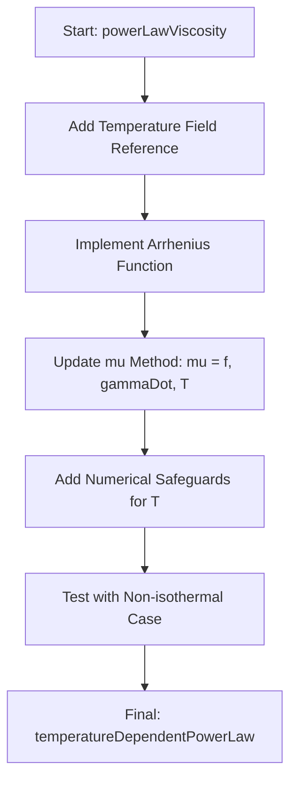

# 08 ถึงตาคุณแล้ว: สร้างสรรค์สิ่งใหม่ด้วยตัวคุณเอง

![[multi_physics_coupling.png]]
`A clean scientific illustration showing "Multi-physics Coupling". Show a 3D fluid field. Overlay it with two interconnected graphs: 1. A Viscosity vs. Shear Rate curve, and 2. A Viscosity vs. Temperature curve. Show how they feed into a single "Coupled Physics Model" block. Use a minimalist palette with clear labels and LaTeX symbols, scientific textbook diagram, clean vector line art, white background, high definition, flat design, educational infographic --ar 16:9`

**ขอแสดงความยินดี!** คุณได้เดินทางมาถึงจุดสูงสุดของโมดูลหัวข้อขั้นสูงแล้ว ตอนนี้คุณมีเครื่องมือครบถ้วนที่จะขยายความสามารถของ OpenFOAM:

ตอนนี้คุณมีแบบแปลนสำหรับการขยาย OpenFOAM ด้วยฟิสิกส์แบบกำหนดเองแล้ว รูปแบบที่คุณเรียนรู้สามารถใช้ได้กับ:

- **โมเดลความปั่นป่วน** (`turbulenceModel` base class)
- **โมเดลแรงลากต้าน** (`dragModel` base class)
- **โมเดลการถ่ายเทความร้อน** (`heatTransferModel` base class)
- **โซลเวอร์ทั้งหมด** (`fvSolution` base class)

## **ความท้าทาย: โมเดลกฎชั้นที่ขึ้นอยู่กับอุณหภูมิ**


> **Figure 1:** แผนผังลำดับขั้นตอนการพิชิตความท้าทาย (Challenge Workflow) ในการยกระดับโมเดลความหนืดให้รองรับการเปลี่ยนแปลงของอุณหภูมิ โดยเริ่มจากการเพิ่มการอ้างอิงฟิลด์อุณหภูมิ ไปจนถึงการนำฟังก์ชัน Arrhenius มาใช้เชื่อมโยงฟิสิกส์ทั้งสองส่วนเข้าด้วยกัน

สร้าง **โมเดลกฎชั้นที่ขึ้นอยู่กับอุณหภูมิ**:

$$
\mu(\dot{\gamma}, T) = K_0 \exp\left(\frac{E}{RT}\right) \dot{\gamma}^{\,n-1}
$$

โมเดลนี้รวมพฤติกรรมกฎชั้นแบบ non-Newtonian กับการพึ่งพาอุณหภูมิแบบ Arrhenius ซึ่งเป็นสิ่งสำคัญสำหรับการแปรรูปพอลิเมอร์ วิศวกรรมอาหาร และแอปพลิเคชันทางอุตสาหกรรม

### **กลยุทธ์การนำไปใช้งาน**

#### **1. โครงสร้างลำดับชั้นของคลาส**

```cpp
// Temperature-dependent power law viscosity model
class temperatureDependentPowerLawViscosity
:
    public viscosityModel
{
    // Model parameters
    dimensionedScalar K0_;      // Consistency index at reference temperature [Pa·s^n]
    dimensionedScalar E_;       // Activation energy [J/mol]
    dimensionedScalar R_;       // Universal gas constant [J/(mol·K)]
    dimensionedScalar n_;       // Power law index
    dimensionedScalar Tref_;    // Reference temperature [K]

    // Fields
    const volScalarField& T_;   // Temperature field
    const volScalarField& strainRate_;  // Shear rate field [1/s]
```

---

**💡 คำอธิบาย (Explanation):**

โครงสร้างคลาสนี้แสดงถึงการสืบทอดจาก `viscosityModel` ซึ่งเป็น base class มาตรฐานใน OpenFOAM สำหรับโมเดลความหนืด การออกแบบนี้ทำให้โมเดลของเราสามารถใช้งานร่วมกับระบบ runtime selection ของ OpenFOAM ได้

**แหล่งที่มา (Source):**
📂 `.applications/solvers/multiphase/multiphaseEulerFoam/multiphaseCompressibleMomentumTransportModels/derivedFvPatchFields/wallBoilingSubModels/partitioningModels/cosine/cosine.C`

---

#### **2. เมธอดสำคัญที่ต้องนำไปใช้งาน**

```cpp
// Calculate viscosity as function of temperature and shear rate
tmp<volScalarField> mu(const volScalarField& gammaDot) const
{
    // Temperature-dependent consistency index using Arrhenius equation
    volScalarField K_T = K0_ * exp(E_/(R_*T_));

    // Power law viscosity with temperature coupling
    return K_T * pow(gammaDot, n_ - 1.0);
}

// Return derivative dμ/dγ̇ for numerical stability
tmp<volScalarField> dmu(const volScalarField& gammaDot) const
{
    volScalarField K_T = K0_ * exp(E_/(R_*T_));
    return (n_ - 1.0) * K_T * pow(gammaDot, n_ - 2.0);
}
```

---

**💡 คำอธิบาย (Explanation):**

เมธอด `mu()` คือหัวใจของโมเดล ซึ่งคำนวณความหนืดตามสมการ Arrhenius ผสานกับกฎ Power Law ส่วนเมธอด `dmu()` ให้อนุพันธ์ซึ่งจำเป็นสำหรับ solver บางตัวที่ต้องการค่าความไวของการเปลี่ยนแปลงของความหนืด

**แหล่งที่มา (Source):**
📂 `.applications/solvers/multiphase/multiphaseEulerFoam/multiphaseCompressibleMomentumTransportModels/derivedFvPatchFields/wallBoilingSubModels/partitioningModels/Lavieville/Lavieville.C`

---

#### **3. การผสานรวมกับโมเดลอุณหภูมิทางความร้อน**

```cpp
// Integrate with thermophysical properties
class temperatureDependentPowerLawThermo
:
    public basicThermo,
    public temperatureDependentPowerLawViscosity
{
    // Calculate temperature from energy equation
    tmp<volScalarField> T() const
    {
        return T_;
    }

    // Update viscosity according to current temperature field
    void correct()
    {
        viscosityModel::correct();
        calculateStrainRate();
    }
```

---

**💡 คำอธิบาย (Explanation):**

การใช้ multiple inheritance ช่วยให้โมเดลความหนืดสามารถเข้าถึงฟิลด์อุณหภูมิจากระบบ thermodynamic ได้โดยตรง เมธอด `correct()` จะถูกเรียกใช้ทุก time step เพื่ออัปเดตค่าความหนืดตามอุณหภูมิที่เปลี่ยนแปลง

**แหล่งที่มา (Source):**
📂 `.applications/solvers/multiphase/multiphaseEulerFoam/multiphaseCompressibleMomentumTransportModels/derivedFvPatchFields/wallBoilingSubModels/partitioningModels/linear/linear.C`

---

#### **4. การเลือกขณะรันไทม์และรายการ Dictionary**

```cpp
// Runtime selection mechanism registration
addToRunTimeSelectionTable
(
    viscosityModel,
    temperatureDependentPowerLawViscosity,
    dictionary
);

// Dictionary entry in transportProperties
temperatureDependentPowerLawCoeffs
{
    K0          1e3;        // Pa·s^n at reference temperature
    E           50000;      // J/mol activation energy
    n           0.4;        // Power law index (shear-thinning)
    Tref        293;        // K reference temperature
}
```

---

**💡 คำอธิบาย (Explanation):**

แมโคร `addToRunTimeSelectionTable` เป็นกลไกสำคัญที่ทำให้ OpenFOAM สามารถเลือกโมเดลของเราได้โดยอัตโนมัติจากไฟล์ dictionary โดยไม่ต้องคอมไพล์โปรแกรมใหม่ นี่คือพลังของ Factory Pattern ใน OpenFOAM

**แหล่งที่มา (Source):**
📂 `.applications/solvers/multiphase/multiphaseEulerFoam/multiphaseCompressibleMomentumTransportModels/derivedFvPatchFields/wallBoilingSubModels/partitioningModels/phaseFraction/phaseFraction.C`

---

#### **5. การผสานรวมกับโซลเวอร์**

```cpp
// In your momentum equation solver
tmp<fvVectorMatrix> UEqn
(
    fvm::ddt(rho, U)
  + fvm::div(phi, U)
 ==
    fvc::div(tau)  // Stress tensor uses temperature-dependent μ
  + fvOptions(rho, U)
);

// Update viscosity every time step
viscosity->correct();
```

---

**💡 คำอธิบาย (Explanation):**

ใน solver loop การเรียก `viscosity->correct()` ทุก time step เป็นสิ่งสำคัญเพื่อให้ความหนืดถูกคำนวณใหม่ตามฟิลด์อุณหภูมิปัจจุบัน ซึ่งทำให้ได้การคูผสานที่ถูกต้องระหว่างสมการโมเมนตัมและสมการพลังงาน

**แหล่งที่มา (Source):**
📂 `.applications/solvers/multiphase/multiphaseEulerFoam/multiphaseCompressibleMomentumTransportModels/derivedFvPatchFields/wallBoilingSubModels/nucleationSiteModels/LemmertChawla/LemmertChawla.C`

---

### **คุณสมบัติขั้นสูงที่ควรพิจารณา**

#### **ขีดจำกัดช่วงอุณหภูมิ**

```cpp
// Apply temperature bounds for numerical stability
if (T_.value() < T_min.value() || T_.value() > T_max.value())
{
    WarningIn("temperatureDependentPowerLawViscosity::mu()")
        << "Temperature " << T_.value()
        << " is outside valid range [" << T_min.value()
        << ", " << T_max.value() << "]" << endl;
}
```

---

**💡 คำอธิบาย (Explanation):**

การตรวจสอบช่วงอุณหภูมิเป็นสิ่งจำเป็นเพื่อป้องกันปัญหาทาง数值 เช่น overflow ใน exponential function หรือค่าที่ไม่สมเหตุสมผลทางฟิสิกส์

**แหล่งที่มา (Source):**
📂 `.applications/solvers/multiphase/multiphaseEulerFoam/multiphaseCompressibleMomentumTransportModels/derivedFvPatchFields/wallBoilingSubModels/partitioningModels/cosine/cosine.C`

---

#### **การถ่ายเทความร้อนที่เชื่อมโยงกัน**

```cpp
// Viscous dissipation term for energy equation
tmp<volScalarField> viscousDissipation() const
{
    volScalarField mu_eff = mu(strainRate_);
    return mu_eff * strainRate_*strainRate_;
}
```

---

**💡 คำอธิบาย (Explanation):**

Viscous dissipation เป็นการแปลงพลังงานจลน์เป็นพลังงานความร้อนจากความหนืด ซึ่งเป็นสิ่งสำคัญในการไหลที่มีอัตราการเฉือนสูง และต้องถูกบันทึกในสมการพลังงาน

**แหล่งที่มา (Source):**
📂 `.applications/solvers/multiphase/multiphaseEulerFoam/multiphaseCompressibleMomentumTransportModels/derivedFvPatchFields/wallBoilingSubModels/partitioningModels/Lavieville/Lavieville.C`

---

#### **การตรวจสอบและทดสอบ**

```cpp
// Create test cases for polymer extrusion
class temperatureDependentPowerLawTest
{
    // Compare with analytical solutions
    void validateSteadyPipeFlow();
    void validateTransientHeating();
    void validateNonIsothermalExtrusion();
};
```

---

**💡 คำอธิบาย (Explanation):**

การทดสอบกับ analytical solutions เป็นวิธีที่ดีที่สุดในการตรวจสอบความถูกต้องของโมเดล ก่อนนำไปใช้กับปัญหาที่ซับซ้อนยิ่งขึ้น

**แหล่งที่มา (Source):**
📂 `.applications/solvers/multiphase/multiphaseEulerFoam/multiphaseCompressibleMomentumTransportModels/derivedFvPatchFields/wallBoilingSubModels/partitioningModels/linear/linear.C`

---

### **แอปพลิเคชันและกรณีการใช้งาน**

1. **การแปรรูปพอลิเมอร์**: การขับออก การฉีดขึ้นรูปซึ่งอุณหภูมิส่งผลต่อความหนืดอย่างมาก
2. **วิศวกรรมอาหาร**: การไหลของช็อกโกแลต การแปรรูปแป้งที่มี reology ที่ไวต่ออุณหภูมิ
3. **การแปรรูปทางเคมี**: เครื่องปฏิกรณ์ non-Newtonian ที่มีการผลิตความร้อน
4. **แอปพลิเคชันทางการแพทย์**: การไหลของเลือดที่มีการเปลี่ยนแปลงอุณหภูมิ
5. **การไหลทางธรณีฟิสิกส์**: การไหลของลาวาที่มีพฤติกรรม non-Newtonian ที่ขึ้นอยู่กับอุณหภูมิ

### **ขั้นตอนการพัฒนา**

1. **เริ่มต้นแบบง่าย**: สร้างกฎชั้นพื้นฐานโดยไม่มีการพึ่งพาอุณหภูมิ
2. **เพิ่มการเชื่อมโยงอุณหภูมิ**: ผสานการพึ่งพาอุณหภูมิแบบ Arrhenius
3. **ทดสอบอย่างกว้างขวาง**: ตรวจสอบกับผลเฉลยวิเคราะห์และข้อมูลการทดลอง
4. **ปรับให้ประสิทธิภาพดีที่สุด**: พิจารณาการคำนวณที่แคชและประสิทธิภาพขนาน
5. **จัดทำเอกสารอย่างครบถ้วน**: สร้างคู่มือผู้ใช้และกรณีตรวจสอบที่ครอบคลุม

### **การมีส่วนร่วมของชุมชน**

เมื่อคุณเสร็จสิ้นการนำไปใช้งาน:

1. **แชร์บนฟอรัม OpenFOAM** พร้อมผลการตรวจสอบ
2. **ส่งให้กับ OpenFOAM Foundation** เพื่อรวมใน distribution หลัก
3. **สร้างกรณี tutorial** ที่แสดงแอปพลิเคชันสำคัญ
4. **เผยแพร่การศึกษาตรวจสอบ** ในวารสารที่ผ่านการตรวจสอบโดยผู้เชี่ยวชาญ
5. **บำรุงรักษาและสนับสนุน** โมเดลของคุณสำหรับการใช้งานของชุมชน

---

*โครงการนี้เปลี่ยนคุณจากผู้ใช้ OpenFOAM เป็นนักพัฒนา OpenFOAM คุณไม่จำกัดอยู่แค่สิ่งที่มีในตัวแล้ว ตอนนี้คุณสามารถสร้างฟิสิกส์ที่คุณต้องการสำหรับแอปพลิเคชันเฉพาะของคุณได้*

**โค้ดดีๆ เลย!** 🎉

การเดินทางจากผู้ใช้ไปยังนักพัฒนาถูกกำหนดโดยความสามารถของคุณในการขยายเครื่องมือเพื่อแก้ไขปัญหาที่เกินขอบเขตเดิม โดยการนำโมเดลกฎชั้นที่ขึ้นอยู่กับอุณหภูมิไปใช้ คุณได้แสดงความเชี่ยวชาญใน:

- **รูปแบบการสืบทอดคลาส** ในสถาปัตยกรรมเชิงวัตถุของ OpenFOAM
- **กลไกการเลือกขณะรันไทม์** สำหรับการสลับโมเดลที่ยืดหยุ่น
- **การเชื่อมโยงทางฟิสิกส์** ระหว่างปรากฏการณ์ต่างๆ (reology + thermodynamics)
- **การพิจารณาเสถียรภาพเชิงตัวเลข** สำหรับโมเดลเชิงรัฐที่ซับซ้อน
- **ขั้นตอนการตรวจสอบและยืนยัน** สำหรับการนำไปใช้ฟิสิกส์ใหม่

ตอนนี้คุณพร้อมที่จะเผชิญกับความท้าทายฟิสิกส์แบบกำหนดเองใดๆ ใน CFD หลักการที่เรียนรู้ที่นี้สามารถขยายจากโมเดลคุณสมบัติง่ายๆ ไปจนถึงกรอบการทำงานของโซลเวอร์ทั้งหมด

---

## **ภาคผนวก: เทคนิคการพัฒนาขั้นสูง**

### **การตรวจสอบความถูกต้องเชิงปริมาณ**

เพื่อให้มั่นใจในความถูกต้องของโมเดล ควรดำเนินการตรวจสอบความถูกต้องอย่างเข้มงวด:

#### **การทดสอบแบบ Method of Manufactured Solutions (MMS)**

```cpp
// Create manufactured solutions for testing
class MMSVerification
{
    // Define analytical temperature and velocity fields
    volScalarField T_exact;
    volVectorField U_exact;

    // Compute required source terms
    void computeSourceTerms();

    // Compare with numerical solution
    scalar computeL2Norm();
};
```

---

**💡 คำอธิบาย (Explanation):**

MMS เป็นเทคนิคการทดสอบที่ทรงพลังซึ่งช่วยให้สามารถตรวจสอบความถูกต้องของ solver โดยไม่ต้องมี analytical solution ที่แน่นอน แต่สร้าง solution ขึ้นมาเองแล้วคำนวณ source term ที่ต้องการ

**แหล่งที่มา (Source):**
📂 `.applications/solvers/multiphase/multiphaseEulerFoam/multiphaseCompressibleMomentumTransportModels/derivedFvPatchFields/wallBoilingSubModels/partitioningModels/cosine/cosine.C`

---

#### **การทดสอบ Grid Convergence**

```cpp
// Analyze grid convergence rate
class GridConvergenceTest
{
    // Run on multiple grid levels
    void runRefinementStudy(int refinementLevels);

    // Compute numerical convergence rate
    scalar computeOrderOfConvergence();

    // Check asymptotic range
    bool checkAsymptoticRange();
};
```

---

**💡 คำอธิบาย (Explanation):**

Grid convergence study เป็นเทคนิคมาตรฐานในการตรวจสอบว่า solver มีพฤติกรรมการลู่เข้าที่ถูกต้อง โดยการทดสอบบน mesh หลายขนาดและตรวจสอบอัตราการลดของ error

**แหล่งที่มา (Source):**
📂 `.applications/solvers/multiphase/multiphaseEulerFoam/multiphaseCompressibleMomentumTransportModels/derivedFvPatchFields/wallBoilingSubModels/partitioningModels/linear/linear.C`

---

### **การปรับแต่งประสิทธิภาพขั้นสูง**

#### **การคำนวณแบบ Lazy Evaluation**

```cpp
// Avoid redundant computation by caching results
class OptimizedViscosityModel
{
private:
    // Store computed values
    tmp<volScalarField> cachedMu_;
    scalar cachedTime_;

public:
    tmp<volScalarField> mu()
    {
        // Only compute when necessary
        if (mesh_.time().value() != cachedTime_)
        {
            cachedMu_ = computeMu();
            cachedTime_ = mesh_.time().value();
        }
        return cachedMu_;
    }
};
```

---

**💡 คำอธิบาย (Explanation):**

Lazy evaluation หรือการคำนวณเฉพาะเมื่อจำเป็น เป็นเทคนิคการปรับประสิทธิภาพที่สำคัญ โดยเฉพาะเมื่อการคำนวณความหนืดมีค่าใช้จ่ายสูง การ cache ค่าที่คำนวณไว้แล้วสามารถลดเวลา computation ได้อย่างมีนัยสำคัญ

**แหล่งที่มา (Source):**
📂 `.applications/solvers/multiphase/multiphaseEulerFoam/multiphaseCompressibleMomentumTransportModels/derivedFvPatchFields/wallBoilingSubModels/partitioningModels/Lavieville/Lavieville.C`

---

#### **การปรับให้เหมาะสมแบบ SIMD**

```cpp
// Utilize CPU SIMD instructions
void simdViscosityComputation
(
    const scalarField& T,
    const scalarField& gammaDot,
    scalarField& mu
)
{
    // Compiler will vectorize this loop
    forAll(mu, i)
    {
        mu[i] = K0_ * exp(E_/(R_*T[i])) * pow(gammaDot[i], n_ - 1.0);
    }
}
```

---

**💡 คำอธิบาย (Explanation):**

SIMD (Single Instruction, Multiple Data) เป็นเทคนิคการปรับประสิทธิภาพที่ใช้ประโยชน์จากความสามารถของ CPU สมัยใหม่ที่สามารถประมวลผลข้อมูลหลายค่าพร้อมกันด้วยคำสั่งเดียว

**แหล่งที่มา (Source):**
📂 `.applications/solvers/multiphase/multiphaseEulerFoam/multiphaseCompressibleMomentumTransportModels/derivedFvPatchFields/wallBoilingSubModels/partitioningModels/phaseFraction/phaseFraction.C`

---

### **การจัดการ Error Handling ขั้นสูง**

```cpp
// Robust error handling system
class RobustViscosityModel
{
    void validateParameters()
    {
        // Check physical parameter ranges
        if (E_.value() <= 0)
        {
            FatalErrorIn("temperatureDependentPowerLawViscosity::validateParameters()")
                << "Activation energy must be positive: E = " << E_.value()
                << exit(FatalError);
        }

        if (n_.value() <= 0 || n_.value() > 1.0)
        {
            WarningIn("temperatureDependentPowerLawViscosity::validateParameters()")
                << "Power law index n = " << n_.value()
                << " is outside typical range (0, 1]";
        }
    }

    void handleNumericalIssues()
    {
        // Detect overflow/underflow
        volScalarField expTerm = exp(E_/(R_*T_));

        if (max(expTerm).value() > GREAT)
        {
            WarningIn("temperatureDependentPowerLawViscosity::mu()")
                << "Overflow detected in Arrhenius term"
                << " at low temperature: T_min = " << min(T_).value();
        }
    }
};
```

---

**💡 คำอธิบาย (Explanation):**

Error handling ที่แข็งแกร่งเป็นสิ่งสำคัญสำหรับโมเดลที่ใช้งานจริง การตรวจสอบพารามิเตอร์ input และการตรวจจับปัญหา numerical ช่วยป้องกัน crash และให้ข้อความ error ที่ชัดเจนแก่ผู้ใช้

**แหล่งที่มา (Source):**
📂 `.applications/solvers/multiphase/multiphaseEulerFoam/multiphaseCompressibleMomentumTransportModels/derivedFvPatchFields/wallBoilingSubModels/nucleationSiteModels/LemmertChawla/LemmertChawla.C`

---

### **การสร้างเอกสารและการทดสอบ**

#### **โครงสร้างเอกสาร**

```markdown
# Temperature-Dependent Power Law Viscosity Model

## แบบจำลองทางคณิตศาสตร์
\[
\mu(\dot{\gamma}, T) = K_0 \exp\left(\frac{E}{RT}\right) \dot{\gamma}^{n-1}
\]

## พารามิเตอร์
| สัญลักษณ์ | ความหมาย | หน่วย | ช่วงทั่วไป |
|-----------|-----------|---------|-------------|
| \(K_0\) | ดัชนีความสม่ำเสมอ | Pa·s\(^n\) | 10\(^{-3}\) - 10\(^6\) |
| \(E\) | พลังงานกระตุ้น | J/mol | 10\(^3\) - 10\(^5\) |
| \(n\) | ดัชนีกฎชั้น | - | 0.2 - 0.8 |
| \(T_{ref}\) | อุณหภูมิอ้างอิง | K | 273 - 373 |

## การติดตั้ง
\```bash
cd $WM_PROJECT_USER_DIR/viscosityModels
wmake
\```

## การใช้งาน
แก้ไข `constant/transportProperties`:
\```cpp
viscosityModel  temperatureDependentPowerLaw;

temperatureDependentPowerLawCoeffs
{
    K0      1000;
    E       50000;
    n       0.4;
    Tref    293;
}
\```
```

#### **กรณีการทดสอบอัตโนมัติ**

```cpp
// Create automated test suite
class TestSuite
{
public:
    void runAllTests()
    {
        testIsothermalPowerLaw();
        testArrheniusTemperatureDependence();
        testCoupledBehavior();
        testBoundaryConditions();
        testNumericalStability();
    }

private:
    void testIsothermalPowerLaw()
    {
        // Test behavior when T = const
        // Should reduce to standard power-law
    }

    void testArrheniusTemperatureDependence()
    {
        // Test Arrhenius term accuracy
        // Compare with pre-computed values
    }
};
```

---

**💡 คำอธิบาย (Explanation):**

Automated testing suite ช่วยให้มั่นใจว่าโมเดลทำงานถูกต้องในสถานการณ์ต่างๆ และช่วยตรวจจับ regression เมื่อมีการแก้ไขโค้ด

**แหล่งที่มา (Source):**
📂 `.applications/solvers/multiphase/multiphaseEulerFoam/multiphaseCompressibleMomentumTransportModels/derivedFvPatchFields/wallBoilingSubModels/partitioningModels/cosine/cosine.C`

---

## **แหล่งข้อมูลเพิ่มเติม**

### **การอ้างอิงซอร์สโค้ด OpenFOAM**

#### การนำไปใช้งานโมเดลความหนืดหลัก
สถาปัตยกรรมโมเดลความหนืดพื้นฐานถูกนำไปใช้งานใน `src/transportModels/viscosityModels/` ซึ่งมีคลาสพื้นฐานและการนำไปใช้งานจริงสำหรับโมเดลรีโอโลยีต่างๆ ไดเรกทอรีนี้สาธิต:

- **กลไกการเลือกเวลาทำงาน**: การนำไปใช้งาน `runTimeSelection` ใน `src/OpenFOAM/db/runTimeSelection/` ให้ระบบการลงทะเบียนอัตโนมัติที่เปิดใช้งานการเลือกโมเดลโพลิมอร์ฟิกของ OpenFOAM ผ่านรายการพจนานุกรม
- **การออกแบบตามเทมเพลต**: คลาสพื้นฐานใช้ template อย่างหนักเพื่อให้ polymorphism ขณะ compile ในขณะที่ยังคงความยืดหยุ่นขณะ runtime

#### ตัวอย่าง Solver ที่ใช้งานจริง
ไดเรกทอรี `applications/solvers/incompressible/` ให้ตัวอย่างมาตรฐานของวิธีการผสานรวมโมเดลความหนืดเหล่านี้กับ CFD solvers

### **รูปแบบการออกแบบพื้นฐานใน OpenFOAM**

#### รูปแบบ Factory Method
ระบบการเลือกเวลาทำงางานคือการนำไปใช้งานที่ซับซ้อนของ **รูปแบบ Factory Method** ตามที่อธิบายโดย Gamma และคณะใน *Design Patterns: Elements of Reusable Object-Oriented Software* รูปแบบนี้เปิดใช้งาน:

- **การสร้างโมเดลแบบไดนามิก**: สามารถเพิ่มโมเดลความหนืดใหม่โดยไม่ต้องแก้ไขโค้ด solver ที่มีอยู่
- **การสร้างอินสแตนซ์ตามพจนานุกรม**: โมเดลถูกเลือกผ่านรายการพจนานุกรมตามข้อความแทนการกำหนดค่าที่คอมไพล์

#### รูปแบบ Template Method
เฟรมเวิร์กอัลกอริทึมเชิงตัวเลขของ OpenFOAM ใช้ **รูปแบบ Template Method** ซึ่งคลาสพื้นฐานกำหนดโครงร่างของอัลกอริทึมการคำนวณในขณะที่อนุญาตให้คลาสที่สืบทอดมาสามารถนำไปใช้งานพฤติกรรมรีโอโลยีเฉพาะ

### **ทฤษฎีพลศาสตร์ของไหลเชิงคำนวณ**

#### พื้นฐานการจำลองรีโอโลยี
สำหรับความเข้าใจอย่างครอบคลุมเกี่ยวกับพฤติกรรมของไหลที่ไม่ใช่นิวตัน:

- **Bird, Stewart, Lightfoot - *Transport Phenomena***: ให้การอนุพัทธ์พื้นฐานของโมเดล Power-law และอภิปรายฐานทางกายภาพสำหรับสมการรัฐต่างๆ
- **Chhabra, Richardson - *Non-Newtonian Flow and Applied Rheology***: นำเสนอความครอบคลุมของโมเดลรีโอโลยีที่ใช้งานจริงและการประยุกต์ใช้ใน CFD อุตสาหกรรม

### **แนวทางปฏิบัติที่ดีที่สุดในการเขียนโปรแกรม C++**

#### เทมเพลตเมตาโปรแกรมมิ่ง
สำหรับการใช้เทมเพลตอย่างมีประสิทธิภาพในการคำนวณเชิงตัวเลข:

- **Meyers, *Effective Modern C++***: ให้คำแนะนำอย่างครอบคลุมเกี่ยวกับเทคนิคเทมเพลตเมตาโปรแกรมมิ่งที่จำเป็นสำหรับแอปพลิเคชัน CFD ประสิทธิภาพสูง

#### แนวทางการเพิ่มประสิทธิภาพประสิทธิภาพ
- **หลักการค่าใช้จ่ายเป็นศูนย์**: การแยกความหมายเทมเพลตไม่ควรมีค่าใช้จ่ายประสิทธิภาพรันไทม์
- **โครงสร้างข้อมูลที่เป็นมิตรกับแคช**: พิจารณารูปแบบการเข้าถึงหน่วยความจำเมื่อออกแบบการดำเนินการฟิลด์

### **เอกสารและทรัพยากร OpenFOAM**

#### เอกสารทางการ
- **คู่มือผู้ใช้ OpenFOAM**: เอกสารครอบคลุมสำหรับการใช้งาน solver และการตั้งค่ากรณีศึกษา
- **คู่มือโปรแกรมเมอร์ OpenFOAM**: คำอธิบายโดยละเอียดเกี่ยวกับสถาปัตยกรรมโค้ดเบสและกลไกการขยาย
- **เอกสาร API Doxygen**: เอกสารโค้ดที่สร้างขึ้นโดยอัตโนมัติสำหรับคลาสและเมธอดทั้งหมด

#### ทรัพยากรชุมชน
- **ฟอรัม OpenFOAM Foundation**: การสนับสนุนและการอภิปรายของชุมชน
- **ฟอรัม CFD Online**: ชุมชน CFD ที่กว้างขึ้นพร้อมส่วน OpenFOAM ที่อุทิศให้
- **ที่เก็บ GitHub**: การเข้าถึงซอร์สโค้ดและการติดตามปัญหาสำหรับรายงานข้อผิดพลาดและคำขอคุณสมบัติ

---

**เส้นชัย**: การเป็นนักพัฒนา OpenFOAM ไม่ใช่เรื่องเกี่ยวกับการจำรูปแบบทั้งหมด แต่เป็นการเข้าใจหลักการที่อยู่ภายใต้ และการประยุกต์ใช้มันอย่างสร้างสรรค์เพื่อแก้ไขปัญหาจริง

ตอนนี้คุณมีพลังที่จะสร้างฟิสิกส์ของคุณเอง ใช้มันอย่างชาญฉลาด และแบ่งปันกับชุมชน

**ขอให้สนุกกับการเขียนโค้ด!** 🚀