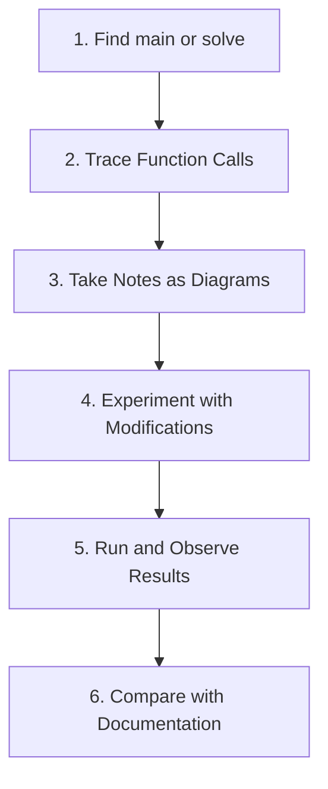

# Code Anatomy — Overview

Reading OpenFOAM Code Line by Line

---

[//]: # (Level: Beginner | Approx. Time: 30 min | Related Files: 01_icoFoam_Walkthrough.md, 02_simpleFoam_Walkthrough.md, 03_kEpsilon_Model_Anatomy.md, 04_fvMatrix_Deep_Dive.md)

---

## Learning Objectives

By the end of this lesson, you will be able to:

- **Explain** the benefits of reading OpenFOAM source code versus relying solely on documentation
- **Set up** a professional development environment with VSCode + clangd for code navigation
- **Navigate** the OpenFOAM directory structure to locate solvers, turbulence models, and core libraries
- **Apply** the 3W Framework (What-Why-How) to systematically understand code components
- **Demonstrate** a systematic workflow for reading and understanding unfamiliar OpenFOAM code

---

## Prerequisites

- **Basic C++ Knowledge**: Classes, inheritance, templates, pointers/references
- **OpenFOAM Installation**: Working installation with sourced environment
- **Terminal Proficiency**: Basic command-line operations (cd, ls, grep)
- **Text Editor Experience**: Any code editor (VSCode recommended)

---

## The 3W Framework

### What: Code Anatomy Fundamentals

Code anatomy is the systematic study of OpenFOAM source code to understand:

- **Implementation Details**: How algorithms are actually coded
- **Design Patterns**: Architectural decisions and their rationale
- **Data Structures**: Field types, matrices, mesh representation
- **Solver Workflow**: Time loops, pressure-velocity coupling, convergence

### Why: Benefits of Reading Source

> **อ่านโค้ด OpenFOAM ได้อย่างเข้าใจ** — ไม่ใช่แค่ใช้งานได้

1. **Documentation is Incomplete** — Code is the "ultimate source of truth"
2. **Learn Design Decisions** from experienced developers
3. **Deeper Debugging** — Beyond error messages to root causes
4. **Custom Development** — Essential preparation for writing your own solvers
5. **Performance Understanding** — See how operations are optimized
6. **API Mastery** — Discover available functions and proper usage

### How: Tools and Workflow

#### Systematic Code Reading Process



#### Recommended Development Tools

| Tool | Purpose | Installation |
|:---|:---|:---|
| **VSCode + clangd** | Navigation, Go to Definition, References | `code --install-extension llvm-vs-code-extensions.vscode-clangd` |
| **Doxygen** | Generated API documentation | Included with OpenFOAM |
| **ripgrep (rg)** | Fast code search | `brew install ripgrep` (macOS) |
| **gdb** | Interactive debugging | Included with dev tools |
| **bear** | Generate compile_commands.json | `brew install bear` (macOS) |

#### VSCode Setup for OpenFOAM

**Step 1: Generate compile_commands.json**

This file enables clangd to understand how OpenFOAM code is compiled, providing accurate code intelligence.

```bash
# Navigate to your OpenFOAM case or solver directory
cd $FOAM_SOLVERS/incompressible/icoFoam

# Generate compilation database
bear -- wmake

# Verify compile_commands.json was created
ls compile_commands.json
```

**Step 2: Configure VSCode**

Create `.vscode/settings.json`:

```json
{
    "clangd.arguments": [
        "--compile-commands-dir=compile_commands.json",
        "--header-insertion=never"
    ]
}
```

**Step 3: Use Key Bindings**

- **F12** — Go to Definition
- **Shift+F12** — Find All References
- **Ctrl+Shift+O** — Symbol Search
- **Ctrl+Space** — Auto-complete

---

## Source Code Directory Structure

Understanding where code lives is the first step to finding what you need.

| Solver Type | Path | Examples |
|:---|:---|:---|
| **Incompressible** | `$FOAM_SOLVERS/incompressible/` | icoFoam, simpleFoam, pimpleFoam |
| **Compressible** | `$FOAM_SOLVERS/compressible/` | rhoPimpleFoam, sonicFoam |
| **Multiphase** | `$FOAM_SOLVERS/multiphase/` | interFoam, multiphaseInterFoam |
| **Heat Transfer** | `$FOAM_SOLVERS/heatTransfer/` | buoyantSimpleFoam, chtMultiRegionFoam |
| **DNS** | `$FOAM_SOLVERS/DNS/` | dnsFoam |
| **Turbulence Models** | `$FOAM_SRC/TurbulenceModels/` | kEpsilon, kOmegaSST |
| **Core Libraries** | `$FOAM_SRC/finiteVolume/` | fvMesh, fvMatrix, fvm::div |
| **ODE Solvers** | `$FOAM_SRC/ODE/` | ODE solvers for chemistry |
| **Mesh Tools** | `$FOAM_SRC/mesh/` | polyMesh, primitiveMesh |

---

## Lessons in This Section

This module provides progressive code walkthroughs:

1. **[icoFoam Walkthrough](01_icoFoam_Walkthrough.md)** — Incompressible Navier-Stokes Solver (~100 lines)  
   *Difficulty: Beginner* | Transient, laminar, PISO algorithm

2. **[simpleFoam Walkthrough](02_simpleFoam_Walkthrough.md)** — Steady-State SIMPLE Algorithm  
   *Difficulty: Intermediate* | Steady, turbulent, under-relaxation

3. **[kEpsilon Model Anatomy](03_kEpsilon_Model_Anatomy.md)** — Turbulence Model Implementation  
   *Difficulty: Intermediate* | RANS modeling, wall functions

4. **[fvMatrix Deep Dive](04_fvMatrix_Deep_Dive.md)** — How Matrices are Assembled  
   *Difficulty: Advanced* | Discretization, sparse matrices, linear solvers

---

## Key Takeaways

- **Code > Documentation** — Source code is the authoritative reference; documentation can be outdated or incomplete
- **Tools Matter** — clangd + VSCode transforms code reading from frustrating to efficient
- **Systematic Approach** — Follow the workflow: find entry point → trace calls → diagram → experiment
- **Directory Structure** — Know where solvers, models, and libraries live to navigate quickly
- **3W Framework** — Always ask: What is this code? Why was it written this way? How does it work?
- **compile_commands.json** — Essential for proper code intelligence in OpenFOAM development
- **Start Simple** — Begin with icoFoam (~100 lines) before tackling complex solvers

---

## Hands-On Exercise

### Setup Your Code Reading Environment

**Objective**: Configure a professional OpenFOAM development environment and practice code navigation.

**Time**: 20 minutes

**Steps**:

1. **Generate compilation database**:
   ```bash
   # Navigate to icoFoam solver directory
   cd $FOAM_SOLVERS/incompressible/icoFoam
   
   # Clean previous build
   wclean
   
   # Generate compile_commands.json
   bear -- wmake
   
   # Open VSCode from this directory
   code .
   ```

2. **Verify clangd is working**:
   - Open `icoFoam.C`
   - Hover over `fvMesh` or `fvScalarMatrix` — you should see type information
   - Press F12 on `UEqn.H()` — should jump to definition
   - Press Shift+F12 on `solve` — should find all references

3. **Practice navigation**:
   - Find where `p` (pressure field) is created
   - Trace the `piso.loop()` function
   - Locate the convection term `fvm::ddt(U)`
   - Find the time loop definition

4. **Document your findings**:
   - Create a simple diagram showing icoFoam's main execution flow
   - Note any functions you don't understand — these become learning targets

**Verification**:
- [ ] `compile_commands.json` exists in solver directory
- [ ] clangd shows hover information for OpenFOAM types
- [ ] F12 (Go to Definition) works for OpenFOAM classes
- [ ] You can trace the execution from `main()` through one time step

---

## Concept Check

<details>
<summary><b>1. Why is reading code more important than reading documentation?</b></summary>

**Answer**:
- Documentation can be outdated or incomplete
- Code shows **implementation details** not documented
- You see **edge cases** and **error handling**
- You learn the **coding style** and patterns used in the project
- You discover available APIs and functions not mentioned in docs
- Code is compiled and tested — docs may have theoretical errors

</details>

<details>
<summary><b>2. What is the most important tool for reading OpenFOAM code, and why?</b></summary>

**Answer**: **clangd + VSCode** is the most essential combination because:

- **Go to Definition (F12)** — Jump to function implementations instantly
- **Find All References (Shift+F12)** — See where and how functions are used
- **Hover Information** — See types, parameters, and documentation
- **Auto-complete** — Discover available methods and parameters
- **Cross-referencing** — Navigate inheritance hierarchies easily
- **compile_commands.json** — Understand the full compilation context

Without this, code reading is 10x slower and more error-prone.

</details>

<details>
<summary><b>3. In the systematic code reading workflow, why is Step 4 (experiment with modifications) important?</b></summary>

**Answer**:
- Passive reading gives limited understanding
- Making changes tests your comprehension
- Running modified code shows cause-and-effect
- Breakage reveals hidden dependencies and assumptions
- Builds confidence for future custom development
- Transforms you from user to developer mindset

</details>

---

## Related Files

- **Next Lesson**: [icoFoam Walkthrough](01_icoFoam_Walkthrough.md) — Line-by-line analysis of transient incompressible solver
- **Module 05**: [OpenFOAM Programming](../../MODULE_05_OPENFOAM_PROGRAMMING/README.md) — C++ fundamentals for OpenFOAM
- **Module 03**: [Numerical Methods](../../MODULE_03_NUMERICAL_METHODS/README.md) — PISO/SIMPLE algorithms explained
- **Official Doxygen**: https://www.openfoam.com/documentation/guide-docs/ — API reference

---

## Next Steps

After completing this overview:

1. **Complete the Hands-On Exercise** above to set up your environment
2. **Proceed to icoFoam Walkthrough** for your first complete code analysis
3. **Reference this document** whenever you need to recall tool setup or directory locations
4. **Practice daily navigation** — spend 15 minutes exploring unfamiliar OpenFOAM code

---

*Last Updated: 2024-12-31* | *Difficulty: Beginner* | *Related Skills: C++ Fundamentals, OpenFOAM Basics*