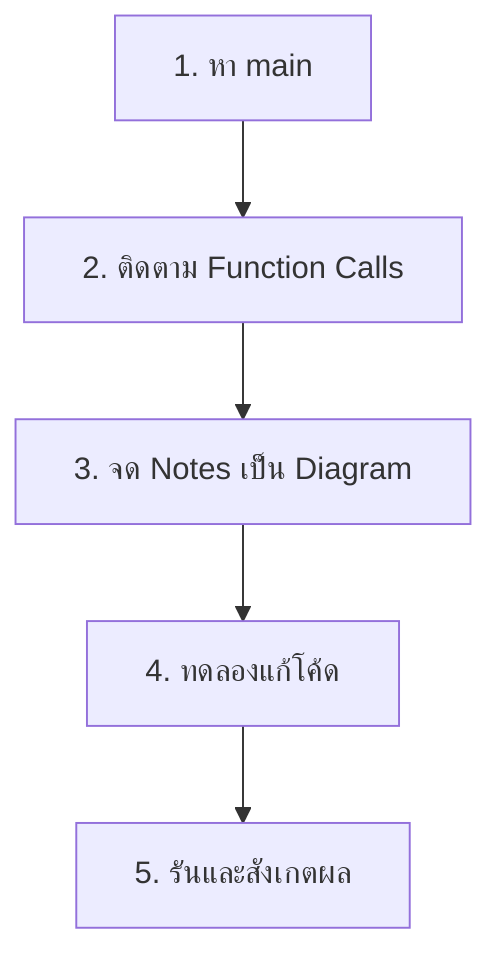

# Code Anatomy — Overview

ผ่าโค้ด OpenFOAM ทีละบรรทัด

---

## เป้าหมาย

> **อ่านโค้ด OpenFOAM ได้อย่างเข้าใจ** — ไม่ใช่แค่ใช้งานได้

---

## ทำไมต้องอ่านโค้ด?

1. **Documentation ไม่ครบ** — โค้ดคือ "ความจริงสูงสุด"
2. **เรียนรู้ Design Decisions** จากมืออาชีพ
3. **Debug ได้ลึกกว่า** แค่ดู Error Message
4. **เตรียมพร้อม** สำหรับการเขียน Solver เอง

---

## วิธีอ่านโค้ด OpenFOAM



---

## เครื่องมือที่แนะนำ

| Tool | Purpose |
|:---|:---|
| **VSCode + clangd** | Navigation, Go to Definition |
| **Doxygen** | Generated API docs |
| **ripgrep (rg)** | Fast code search |
| **gdb** | Interactive debugging |

### Setup VSCode for OpenFOAM

```bash
# Generate compile_commands.json
bear -- wmake

# Install clangd extension in VSCode
```

---

## Source Code Locations

| Solver Type | Path |
|:---|:---|
| Incompressible | `$FOAM_SOLVERS/incompressible/` |
| Compressible | `$FOAM_SOLVERS/compressible/` |
| Multiphase | `$FOAM_SOLVERS/multiphase/` |
| Turbulence Models | `$FOAM_SRC/TurbulenceModels/` |
| Core Libraries | `$FOAM_SRC/finiteVolume/` |

---

## บทเรียนในส่วนนี้

1. **icoFoam Walkthrough** — Incompressible NS Solver (~100 lines)
2. **simpleFoam Walkthrough** — Steady-State SIMPLE Algorithm
3. **kEpsilon Model Anatomy** — Turbulence Model Implementation
4. **fvMatrix Deep Dive** — How Matrices are Assembled

---

## Concept Check

<details>
<summary><b>1. ทำไมการอ่านโค้ดสำคัญกว่าการอ่าน Documentation?</b></summary>

- Documentation อาจ outdated หรือไม่ครบ
- โค้ดแสดง **implementation details** ที่ไม่มีใน docs
- เห็น **edge cases** และ **error handling**
- เรียนรู้ **coding style** ของ project
</details>

<details>
<summary><b>2. เครื่องมือไหนสำคัญที่สุดสำหรับการอ่านโค้ด OpenFOAM?</b></summary>

**clangd + VSCode** เพราะ:
- Go to Definition (F12)
- Find All References (Shift+F12)
- Hover to see type information
- Auto-complete ช่วยเข้าใจ API
</details>

---

## เอกสารที่เกี่ยวข้อง

- **ถัดไป:** [icoFoam Walkthrough](01_icoFoam_Walkthrough.md)
- **Module 05:** OpenFOAM Programming Basics
